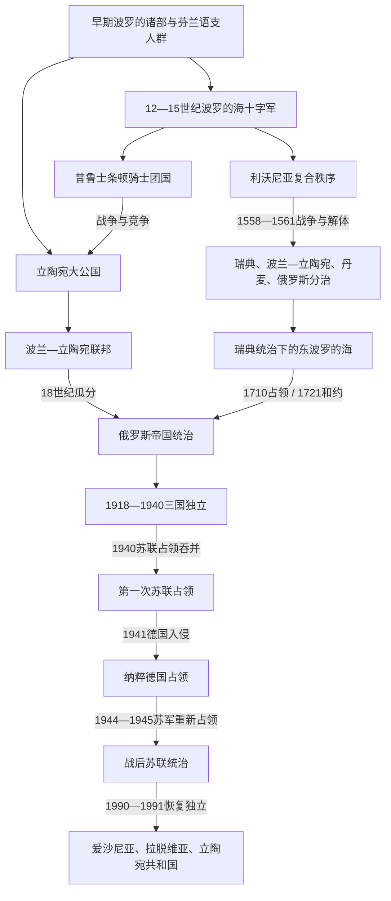

# 波罗的海历史

[返回欧洲历史](/%E4%BA%BA%E6%96%87%E7%A7%91%E5%AD%A6/%E5%8E%86%E5%8F%B2/%E6%AC%A7%E6%B4%B2/README.md)

## 概括

本目录梳理波罗的海东岸从早期部族社会、十字军征服和中世纪复合政权，到近世列强分治、俄罗斯帝国统治、现代民族国家建立及苏联占领的共同脉络。

“波罗的海”首先是地区概念，不是单一民族或语言谱系：拉脱维亚语、立陶宛语属于波罗的语族，爱沙尼亚语属于乌拉尔语系芬兰语支。三地历史到18—20世纪才日益汇合；中世纪爱沙尼亚和拉脱维亚大部进入利沃尼亚秩序，立陶宛则形成大公国并扩张为多民族国家。

## 全史演进图

## 历史主线

1. 冰后期定居、农业、山丘堡垒和海河贸易塑造多个人群共同体，现代民族边界尚不存在。
2. 12—15世纪传教、教皇十字军授权、军事修会、丹麦和瑞典王权、德意志城市及地方盟友共同改变东岸政治。
3. 今爱沙尼亚、拉脱维亚大部形成骑士团、主教领、城市和贵族并立的利沃尼亚；普鲁士出现条顿骑士团国；立陶宛保持本土统治并形成大公国。
4. 16世纪利沃尼亚战争终结旧秩序，瑞典、波兰—立陶宛、丹麦和俄罗斯争夺港口、贸易与边境。
5. 1710/1721年后俄罗斯控制爱沙尼亚、利沃尼亚，18世纪末又通过联邦瓜分取得库尔兰和立陶宛大部；不同地方制度直到近代仍有明显差异。
6. 一战和俄罗斯帝国崩溃使三国在1918年前后建国，经独立战争、土地改革和议会政治巩固，随后分别转向威权统治。
7. 1940年苏联占领并吞并三国，1941—1944/1945年纳粹德国占领，战后苏联重新控制；大屠杀、驱逐、游击战、集体化、工业化和人口迁移重塑社会。
8. 1987—1991年人民阵线、萨尤季斯、波罗的之路和民选机关推动国家恢复，三国以战前共和国的法理连续性重新独立。

## 按阶段导航

| 顺序 | 名称 | 时间 | 阅读重点 |
|---:|---|---|---|
| 1 | [早期波罗的人](/%E4%BA%BA%E6%96%87%E7%A7%91%E5%AD%A6/%E5%8E%86%E5%8F%B2/%E6%AC%A7%E6%B4%B2/%E6%B3%A2%E7%BD%97%E7%9A%84%E6%B5%B7/%E6%97%A9%E6%9C%9F%E6%B3%A2%E7%BD%97%E7%9A%84%E4%BA%BA.md) | 史前—13世纪初 | 区分波罗的语族、芬兰语支和地缘“波罗的海”；理解堡垒、河海贸易与地方政治。 |
| 2 | [中世纪波罗的海十字军](/%E4%BA%BA%E6%96%87%E7%A7%91%E5%AD%A6/%E5%8E%86%E5%8F%B2/%E6%AC%A7%E6%B4%B2/%E6%B3%A2%E7%BD%97%E7%9A%84%E6%B5%B7/%E4%B8%AD%E4%B8%96%E7%BA%AA%E6%B3%A2%E7%BD%97%E7%9A%84%E6%B5%B7%E5%8D%81%E5%AD%97%E5%86%9B.md) | 12—15世纪 | 传教、征服、地方结盟、古普鲁士大起义、立陶宛抵抗与改宗。 |
| 3 | [利沃尼亚](/%E4%BA%BA%E6%96%87%E7%A7%91%E5%AD%A6/%E5%8E%86%E5%8F%B2/%E6%AC%A7%E6%B4%B2/%E6%B3%A2%E7%BD%97%E7%9A%84%E6%B5%B7/%E5%88%A9%E6%B2%83%E5%B0%BC%E4%BA%9A.md) | 约1201—1561年 | 骑士团、主教领、汉萨城市和贵族构成的复合秩序及其解体。 |
| 4 | [条顿骑士团国与波罗的海秩序](/%E4%BA%BA%E6%96%87%E7%A7%91%E5%AD%A6/%E5%8E%86%E5%8F%B2/%E6%AC%A7%E6%B4%B2/%E6%B3%A2%E7%BD%97%E7%9A%84%E6%B5%B7/%E6%9D%A1%E9%A1%BF%E9%AA%91%E5%A3%AB%E5%9B%A2%E5%9B%BD%E4%B8%8E%E6%B3%A2%E7%BD%97%E7%9A%84%E6%B5%B7%E7%A7%A9%E5%BA%8F.md) | 1230年代—1525年 | 普鲁士征服、修会国家、波兰—立陶宛战争、十三年战争与世俗化。 |
| 5 | [立陶宛大公国](/%E4%BA%BA%E6%96%87%E7%A7%91%E5%AD%A6/%E5%8E%86%E5%8F%B2/%E6%AC%A7%E6%B4%B2/%E6%B3%A2%E7%BD%97%E7%9A%84%E6%B5%B7/%E7%AB%8B%E9%99%B6%E5%AE%9B%E5%A4%A7%E5%85%AC%E5%9B%BD.md) | 13世纪—1569年为独立扩张主线 | 从波罗的核心扩展到广大罗斯地区，与波兰联合并保持独立制度。 |
| 6 | [立陶宛大公世系表](/%E4%BA%BA%E6%96%87%E7%A7%91%E5%AD%A6/%E5%8E%86%E5%8F%B2/%E6%AC%A7%E6%B4%B2/%E6%B3%A2%E7%BD%97%E7%9A%84%E6%B5%B7/%E7%AB%8B%E9%99%B6%E5%AE%9B%E5%A4%A7%E5%85%AC%E4%B8%96%E7%B3%BB%E8%A1%A8.md) | 约1236—1795年 | 按在位顺序核对大公、共同统治、复位与联邦时期世系。 |
| 7 | [波兰—立陶宛联邦](/%E4%BA%BA%E6%96%87%E7%A7%91%E5%AD%A6/%E5%8E%86%E5%8F%B2/%E6%AC%A7%E6%B4%B2/%E6%96%AF%E6%8B%89%E5%A4%AB/%E8%A5%BF%E6%96%AF%E6%8B%89%E5%A4%AB/%E6%B3%A2%E5%85%B0-%E7%AB%8B%E9%99%B6%E5%AE%9B%E8%81%94%E9%82%A6.md) | 1569—1795年 | 立陶宛与波兰的复合国家及其对东波罗的海的影响。 |
| 8 | [瑞典统治下的东波罗的海](/%E4%BA%BA%E6%96%87%E7%A7%91%E5%AD%A6/%E5%8E%86%E5%8F%B2/%E6%AC%A7%E6%B4%B2/%E6%B3%A2%E7%BD%97%E7%9A%84%E6%B5%B7/%E7%91%9E%E5%85%B8%E7%BB%9F%E6%B2%BB%E4%B8%8B%E7%9A%84%E4%B8%9C%E6%B3%A2%E7%BD%97%E7%9A%84%E6%B5%B7.md) | 1561—1721年 | 领土取得、总督与地方等级、教育改革、土地收回、大饥荒和大北方战争。 |
| 9 | [俄罗斯帝国统治下的波罗的海](/%E4%BA%BA%E6%96%87%E7%A7%91%E5%AD%A6/%E5%8E%86%E5%8F%B2/%E6%AC%A7%E6%B4%B2/%E6%B3%A2%E7%BD%97%E7%9A%84%E6%B5%B7/%E4%BF%84%E7%BD%97%E6%96%AF%E5%B8%9D%E5%9B%BD%E7%BB%9F%E6%B2%BB%E4%B8%8B%E7%9A%84%E6%B3%A2%E7%BD%97%E7%9A%84%E6%B5%B7.md) | 1710/1721—1918年 | 波罗的诸省和立陶宛西北边疆的差异、农奴解放、民族觉醒与帝国崩溃。 |
| 10 | [波罗的三国独立](/%E4%BA%BA%E6%96%87%E7%A7%91%E5%AD%A6/%E5%8E%86%E5%8F%B2/%E6%AC%A7%E6%B4%B2/%E6%B3%A2%E7%BD%97%E7%9A%84%E6%B5%B7/%E6%B3%A2%E7%BD%97%E7%9A%84%E4%B8%89%E5%9B%BD%E7%8B%AC%E7%AB%8B.md) | 1917—1940年 | 独立战争、边界、宪政、威权转向、1939年基地条约与1940年占领。 |
| 11 | [苏联统治下的波罗的海](/%E4%BA%BA%E6%96%87%E7%A7%91%E5%AD%A6/%E5%8E%86%E5%8F%B2/%E6%AC%A7%E6%B4%B2/%E6%B3%A2%E7%BD%97%E7%9A%84%E6%B5%B7/%E8%8B%8F%E8%81%94%E7%BB%9F%E6%B2%BB%E4%B8%8B%E7%9A%84%E6%B3%A2%E7%BD%97%E7%9A%84%E6%B5%B7.md) | 1940—1991年 | 苏德两种占领、实际权力、镇压与社会转型，以及恢复独立的共同过程。 |

## 重要转折与时间节点

| 时间 | 转折 | 区域意义 |
|---|---|---|
| 1201—1237年 | 里加、宝剑骑士团及利沃尼亚分支形成 | 拉丁教会、城市和军事修会成为永久政治力量。 |
| 1219、1346年 | 丹麦取得、后出售北爱沙尼亚 | 显示征服后仍有王权与修会间领土重组。 |
| 1230年代—1283年 | 普鲁士征服与古普鲁士大起义 | 条顿骑士团建立领土国家，古普鲁士社会被长期重构。 |
| 13—14世纪 | 立陶宛国家形成并扩张 | 东波罗的海出现能抵抗骑士团并利用罗斯纵深的本土大国。 |
| 1386—1387、1410、1422年 | 立陶宛改宗、格伦瓦德战役、梅尔诺和约 | 骑士团十字军理由和战略优势衰退。 |
| 1525、1561年 | 普鲁士与利沃尼亚修会领地先后世俗化 | 中世纪军事修会领土秩序转为王朝和列强竞争。 |
| 1621—1629年 | 瑞典取得里加和利沃尼亚大部 | 瑞典东岸帝国形成。 |
| 1710、1721年 | 爱沙尼亚和利沃尼亚投降并正式割让 | 俄罗斯取得波罗的海门户，同时确认地方等级特权。 |
| 1772—1795年 | 联邦瓜分与库尔兰并入 | 拉特加尔、库尔兰和立陶宛大部进入俄罗斯帝国。 |
| 1816—1819、1861年 | 分地区农奴解放 | 爱沙尼亚、拉脱维亚大部早于立陶宛和拉特加尔，但土地问题仍延续。 |
| 1905、1917年 | 革命与帝国崩溃 | 大众政治、自治和独立诉求从文化运动转为国家行动。 |
| 1918—1920年 | 三个共和国和独立战争 | 现代国家获得实际领土与国际承认。 |
| 1926、1934年 | 三国先后威权化 | 议会政治被集中权力取代，地区安全仍未改善。 |
| 1939—1940年 | 德苏秘密划分、基地条约和苏联占领 | 三国第一次独立时期终结。 |
| 1941—1945年 | 纳粹占领、犹太人大屠杀与苏军重返 | 两种占领交替，人口、社会和政治精英遭巨变。 |
| 1949年 | “冲浪行动”驱逐和集体化 | 战后武装抵抗与私人农业受到决定性打击。 |
| 1989-08-23 | 波罗的之路 | 三国把秘密议定书、国家连续性和群众动员结合。 |
| 1990—1991年 | 恢复独立 | 立陶宛先行，爱沙尼亚与拉脱维亚在八月政变失败时完成恢复。 |

## 三国路径对照

| 国家 | 中世纪与近世路径 | 帝国时期重点 | 现代建国和恢复 |
|---|---|---|---|
| [爱沙尼亚](/%E4%BA%BA%E6%96%87%E7%A7%91%E5%AD%A6/%E5%8E%86%E5%8F%B2/%E6%AC%A7%E6%B4%B2/%E6%B3%A2%E7%BD%97%E7%9A%84%E6%B5%B7/%E7%88%B1%E6%B2%99%E5%B0%BC%E4%BA%9A/README.md) | 芬兰语支社会 → 丹麦、骑士团与利沃尼亚 → 瑞典 | 波罗的德意志自治、路德宗、早期农奴解放、民族觉醒 | 1918年建国，1920年和约；1940年被占领，1991-08-20恢复独立。 |
| [拉脱维亚](/%E4%BA%BA%E6%96%87%E7%A7%91%E5%AD%A6/%E5%8E%86%E5%8F%B2/%E6%AC%A7%E6%B4%B2/%E6%B3%A2%E7%BD%97%E7%9A%84%E6%B5%B7/%E6%8B%89%E8%84%B1%E7%BB%B4%E4%BA%9A/README.md) | 波罗的诸部和利沃尼亚人 → 旧利沃尼亚 → 瑞典、波兰属利沃尼亚与库尔兰分治 | 三个历史区域并入时间不同，德意志庄园、天主教拉特加尔和民族运动并存 | 1918年建国，经多方战争统一；1940年被占领，1991-08-21完全恢复独立。 |
| [立陶宛](/%E4%BA%BA%E6%96%87%E7%A7%91%E5%AD%A6/%E5%8E%86%E5%8F%B2/%E6%AC%A7%E6%B4%B2/%E6%B3%A2%E7%BD%97%E7%9A%84%E6%B5%B7/%E7%AB%8B%E9%99%B6%E5%AE%9B/README.md) | 立陶宛大公国 → 波兰—立陶宛联邦 | 西北边疆、天主教、波兰语贵族、起义与拉丁字母禁印 | 1918年恢复国家，长期失去维尔纽斯；1940年被占领，1990-03-11率先恢复独立。 |

## 关键辨析

- **地区、语言与国家是三个层次**：爱沙尼亚人属于芬兰语支，仍是波罗的海地区和“波罗的三国”之一。
- **利沃尼亚不是统一民族国家**：它由骑士团、主教领、城市和地方等级组成。
- **条顿骑士团不是只有普鲁士国家**：组织通史见[条顿骑士团](/%E4%BA%BA%E6%96%87%E7%A7%91%E5%AD%A6/%E5%8E%86%E5%8F%B2/%E6%AC%A7%E6%B4%B2/_%E9%80%9A%E5%8F%B2/%E5%8D%81%E5%AD%97%E5%86%9B%E4%B8%9C%E5%BE%81/%E5%B9%BF%E4%B9%89%E5%8D%81%E5%AD%97%E5%86%9B%E8%BF%90%E5%8A%A8/%E6%9D%A1%E9%A1%BF%E9%AA%91%E5%A3%AB%E5%9B%A2.md)，本目录页聚焦普鲁士领土国家。
- **瑞典统治没有覆盖现代三国全部疆域**：核心在爱沙尼亚、利沃尼亚、英格里亚和萨雷马岛。
- **俄罗斯“波罗的海诸省”不等于全部立陶宛**：前者有德意志等级自治，立陶宛主要按西北边疆治理。
- **1940年并入缺乏自由同意**：最后通牒、驻军、受控选举和单一候选名单构成占领背景。
- **1990—1991年称“恢复独立”**：三国主张战前国家在国际法上持续存在，而非从苏联中新建三个国家。

## 相关区域

- [北方十字军](/%E4%BA%BA%E6%96%87%E7%A7%91%E5%AD%A6/%E5%8E%86%E5%8F%B2/%E6%AC%A7%E6%B4%B2/_%E9%80%9A%E5%8F%B2/%E5%8D%81%E5%AD%97%E5%86%9B%E4%B8%9C%E5%BE%81/%E5%B9%BF%E4%B9%89%E5%8D%81%E5%AD%97%E5%86%9B%E8%BF%90%E5%8A%A8/%E5%8C%97%E6%96%B9%E5%8D%81%E5%AD%97%E5%86%9B.md)
- [瑞典帝国](/%E4%BA%BA%E6%96%87%E7%A7%91%E5%AD%A6/%E5%8E%86%E5%8F%B2/%E6%AC%A7%E6%B4%B2/%E5%8C%97%E6%AC%A7/%E7%91%9E%E5%85%B8%E5%B8%9D%E5%9B%BD.md)
- [德意志历史](/%E4%BA%BA%E6%96%87%E7%A7%91%E5%AD%A6/%E5%8E%86%E5%8F%B2/%E6%AC%A7%E6%B4%B2/%E5%BE%B7%E6%84%8F%E5%BF%97/README.md)
- [北欧历史](/%E4%BA%BA%E6%96%87%E7%A7%91%E5%AD%A6/%E5%8E%86%E5%8F%B2/%E6%AC%A7%E6%B4%B2/%E5%8C%97%E6%AC%A7/README.md)
