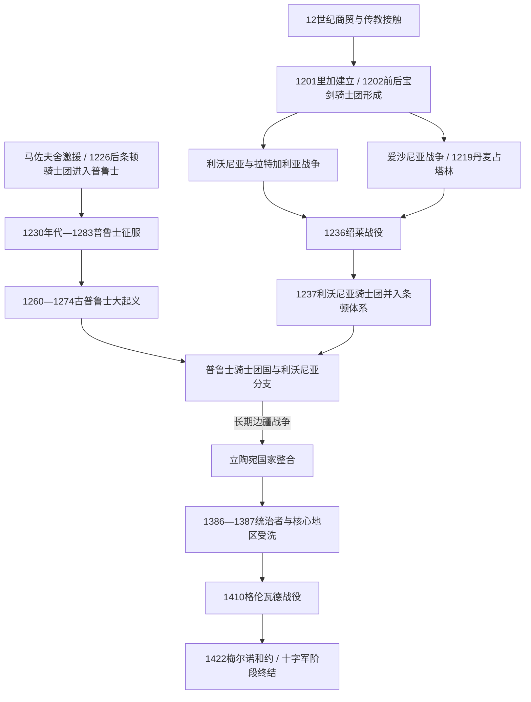

# 中世纪波罗的海十字军

[返回波罗的海历史](/%E4%BA%BA%E6%96%87%E7%A7%91%E5%AD%A6/%E5%8E%86%E5%8F%B2/%E6%AC%A7%E6%B4%B2/%E6%B3%A2%E7%BD%97%E7%9A%84%E6%B5%B7/README.md)

## 时间

12世纪中叶—15世纪前期。利沃尼亚与普鲁士的主要征服发生在12世纪末至13世纪；对立陶宛的骑士团战争延续到15世纪。1147年文德十字军构成北方背景，但本页重点是东波罗的海。

## 空间范围

今爱沙尼亚、拉脱维亚、立陶宛、波兰东北部与俄罗斯加里宁格勒州一带，并涉及芬兰湾、诺夫哥罗德和波洛茨克方向。完整的文德、芬兰和斯堪的纳维亚战场比较参见[北方十字军](/%E4%BA%BA%E6%96%87%E7%A7%91%E5%AD%A6/%E5%8E%86%E5%8F%B2/%E6%AC%A7%E6%B4%B2/_%E9%80%9A%E5%8F%B2/%E5%8D%81%E5%AD%97%E5%86%9B%E4%B8%9C%E5%BE%81/%E5%B9%BF%E4%B9%89%E5%8D%81%E5%AD%97%E5%86%9B%E8%BF%90%E5%8A%A8/%E5%8C%97%E6%96%B9%E5%8D%81%E5%AD%97%E5%86%9B.md)。

## 概括

中世纪波罗的海十字军把教皇认可的十字军特权、拉丁教会传教、德意志军事修会、丹麦与瑞典王权扩张、商人贸易利益及地方冲突结合起来。它不是一次连续战役，也不是所有参与者始终服从同一指挥，而是一组跨越数代的战争、改宗、结盟、叛乱、移民和建制过程。

结果因地而异：利沃尼亚和爱沙尼亚被主教区、骑士团、丹麦王权及城市瓜分；古普鲁士诸部经长期战争和大起义后被条顿骑士团征服；立陶宛则在压力下整合为大公国，并在改宗天主教后与波兰联合，最终削弱骑士团的十字军合法性和军事优势。

## 演进图

## 参与者与各自目标

| 参与者 | 主要目标与资源 | 内部差异 |
|---|---|---|
| 罗马教廷与拉丁教会 | 扩大教区、传教、规范战争并给予十字军赎罪特权 | 教皇、使节、里加主教及其他主教对领地和修会控制权并不一致。 |
| 宝剑骑士团、条顿骑士团及利沃尼亚分支 | 以修会纪律、城堡网、跨地区募兵和土地收入维持征服 | 利沃尼亚分支自1237年属条顿体系，但拥有自己的团长、领地和地区利益。 |
| 丹麦、瑞典等王权 | 建立属地、教区、税源和海上据点 | 丹麦在北爱沙尼亚形成较稳定领地；传统所谓瑞典三次“芬兰十字军”的具体日期和性质存在史学争议。 |
| 德意志商人、城市与移民 | 保护海道与河运、建立城市特权和商业网络 | 商人与主教、骑士团既合作也因税收、司法和贸易垄断冲突。 |
| 波兰诸侯 | 应对普鲁士边境袭击并扩展基督教政治秩序 | 马佐夫舍公爵康拉德邀条顿骑士团后，骑士团建立独立领土权力，最终反与波兰长期冲突。 |
| 东波罗的海诸部与地方首领 | 守卫土地与信仰、争夺地方优势，或借外援打击邻敌 | 利沃尼亚首领考波等人选择受洗并与十字军合作；其他集团反复叛乱，阵营会随地方利益改变。 |
| 波洛茨克、诺夫哥罗德、普斯科夫等罗斯政治体 | 维持贡赋、贸易和边境安全 | 既与本地集团结盟，也同拉丁势力作战或议和；正教与天主教差异只是竞争因素之一。 |
| 立陶宛诸公与大公国 | 抵抗骑士团、整合波罗的核心并扩张罗斯土地 | 改宗、停战与战争常被用于国内权力竞争和外交，不是一条直线过程。 |

## 形成背景

### 宗教合法性

1147年第二次十字军期间，教皇认可在波罗的海南岸对非基督教文德人的战争可获得与赴圣地相近的宗教特权。此后传教失败、当地袭击、俘虏与报复被不断重新解释为十字军理由。教皇诏令和布道能从德意志、低地国家及更远地区吸引季节性十字军，为地方修会补充兵员。

### 商贸与城市

吕贝克、哥特兰和德意志商人希望沿道加瓦河进入罗斯市场。传教士搭乘商船进入河口；里加建立后同时成为主教座、军队集结地和商业港口。宗教、贸易与征服并非彼此替代的解释，而是由不同参与者叠加在同一空间。

### 地方政治分散

[早期波罗的人](/%E4%BA%BA%E6%96%87%E7%A7%91%E5%AD%A6/%E5%8E%86%E5%8F%B2/%E6%AC%A7%E6%B4%B2/%E6%B3%A2%E7%BD%97%E7%9A%84%E6%B5%B7/%E6%97%A9%E6%9C%9F%E6%B3%A2%E7%BD%97%E7%9A%84%E4%BA%BA.md)由多个地区共同体、堡垒和首领集团构成。十字军利用地方仇敌关系、受洗盟友、贡赋协议和人质制度逐步推进；本地人也会借十字军或罗斯援助对付邻敌。这种分化使征服得以展开，却也造成持续数十年的叛乱。

## 分阶段过程

### 传教、里加与宝剑骑士团（约1180年代—1208）

- 奥古斯丁会传教士迈因哈德约在1180年代进入道加瓦河口利沃尼亚人地区，1186年左右成为于克斯屈尔主教。他修建石堡并寻求和平改宗，但受洗、贡赋和外来军事保护的关系很快引发冲突。
- 继任者贝特霍尔德于1198年战死。第三任主教阿尔伯特得到持续十字军援军，1201年把主教座和港口移到里加。
- 约1202年成立的宝剑骑士团提供常备军事骨干，却同时追求自身领地。1207年教皇认可主教与骑士团分地，此后双方围绕征服收益长期竞争。
- 部分利沃尼亚和拉特加利亚首领受洗并成为盟友，另一些共同体被迫纳贡、交付人质或反复起义。1206年前后道加瓦河下游的利沃尼亚抵抗基本被压制，战争继续向东北与南部扩展。

### 爱沙尼亚征服与丹麦介入（1208—1227）

- 1208年后十字军与盟友进入爱沙尼亚南部，围绕乌干迪、萨卡拉等地区反复作战。地方军队多次围攻堡垒，瘟疫、饥荒和报复性劫掠扩大人口损失。
- 1217年圣马太日战役中，萨卡拉首领伦比图与十字军盟友一方的利沃尼亚首领考波均战死；德意志—拉特加利亚—利沃尼亚联军取得优势，但征服尚未结束。
- 丹麦国王瓦尔德马二世于1219年攻占林达尼塞并建立后来塔林的丹麦据点。丹麦、宝剑骑士团和主教势力随后争夺北爱沙尼亚。
- 1223年大起义一度摧毁多处十字军据点，1224年塔尔图陷落，1227年萨雷马岛被迫归顺，主要军事征服完成。
- 1238年《斯滕斯比条约》确认丹麦重新获得北爱沙尼亚，说明“十字军胜利”之后仍需在征服者之间重新划界。

### 绍莱战败与利沃尼亚分支形成（1236—13世纪末）

- 宝剑骑士团在扩张、同主教冲突和兵员不足中承受压力。1236年，其远征军在绍莱战役被萨莫吉希亚与塞米加利亚力量重创，大团长及多数参战骑士阵亡。
- 1237年残余组织并入条顿骑士团，形成利沃尼亚分支。它与普鲁士总团长保持组织隶属，却保留地区团长、会议和领地。
- 库尔人、塞米加利亚人和萨雷马岛居民继续反抗。1260年杜尔贝战役中，萨莫吉希亚人击败利沃尼亚与条顿联军，触发普鲁士、库尔兰和其他地区新一轮起义。
- 塞米加利亚的主要抵抗到1290年才被压制；部分人迁往立陶宛。因此利沃尼亚征服不是1201—1227年即告完全结束。

### 普鲁士十字军与古普鲁士大起义（1220年代—1283）

- 马佐夫舍公爵康拉德在与古普鲁士诸部战争中邀请条顿骑士团。1226年神圣罗马皇帝腓特烈二世颁“里米尼金玺诏书”，1230年前后的克鲁什维茨条约及教皇文件为骑士团主张海乌姆诺和未来征服地提供多重合法性；部分文件的形成与文本细节存在史学争论。
- 骑士团自维斯瓦河下游逐堡推进，以海乌姆诺法授予城市自治，建立城堡、主教区和移民聚落。征服依靠来自西欧的十字军季节性援军，而非少数修会骑士单独完成。
- 1242—1249年第一次大规模反抗与波美拉尼亚公爵希温托佩乌克的战争交织；1249年《基督堡条约》许诺受洗普鲁士人一定权利，但执行有限。
- 1260年杜尔贝战败后爆发古普鲁士大起义。各部推举首领，围攻骑士团城堡；骑士团凭坚固据点、海上补给和新十字军援军逐步逆转局势，至1274年前后镇压主要起义。
- 1283年常被视为普鲁士征服结束年份。其后仍有逃亡、局部抵抗和边疆战斗；土地重组、基督教化、德意志移民及长期语言转变持续数百年。

### 立陶宛边疆战争与十字军理由消退（13—15世纪）

- 骑士团从普鲁士和利沃尼亚两面进攻萨莫吉希亚与立陶宛，企图连接两块领地；立陶宛诸公也持续劫掠骑士团、波兰和罗斯边疆。
- 明道加斯在国内竞争中接受拉丁洗礼，1253年加冕为王，并向骑士团让渡若干有争议的土地权利。1260年杜尔贝战役后他恢复与异教盟友合作，1263年遇刺；首次王国和改宗没有形成稳定制度。
- 1386年约盖拉受洗并成为波兰国王，1387年立陶宛核心区正式推行天主教化。萨莫吉希亚因反复转让和争夺，直到1413—1417年前后才建立稳定教会建制。
- 改宗使骑士团“征服异教徒”的主要合法性受到削弱，但萨莫吉希亚归属、边界、贸易和政治竞争仍导致战争。
- 1410年格伦瓦德战役中，波兰—立陶宛联军重创骑士团主力。1411年第一次托伦和约未彻底解决边界，1422年《梅尔诺和约》基本确定萨莫吉希亚归立陶宛，东波罗的海十字军边疆由此转入常规国家竞争。

## 关键战役与转折

| 时间 | 事件 | 参与者与结果 | 长期意义 |
|---|---|---|---|
| 1198年 | 贝特霍尔德战死 | 利沃尼亚人击杀里加主教前身教区的武装主教 | 推动阿尔伯特以持续十字军和常备修会取代有限传教。 |
| 1201—1202年 | 里加建立、宝剑骑士团形成 | 主教、商人和修会建立永久据点 | 港口、教区和军事国家形成共同核心。 |
| 1217年 | 圣马太日战役 | 十字军联盟击败爱沙尼亚联盟 | 南爱沙尼亚抵抗的重要转折，但未立即结束战争。 |
| 1219年 | 丹麦攻占林达尼塞 | 瓦尔德马二世建立北爱沙尼亚属地 | 塔林兴起，丹麦成为征服者之一。 |
| 1236年 | 绍莱战役 | 萨莫吉希亚—塞米加利亚军击溃宝剑骑士团 | 宝剑骑士团并入条顿体系，利沃尼亚组织重组。 |
| 1260年 | 杜尔贝战役 | 萨莫吉希亚军击败骑士团联军 | 引发古普鲁士大起义和多地反抗。 |
| 1260—1274年 | 古普鲁士大起义 | 各部围攻城堡，最终被骑士团镇压 | 决定普鲁士征服走向，并加速领土、人口与语言秩序重构。 |
| 1386—1387年 | 波兰—立陶宛联合与改宗 | 约盖拉受洗为波兰国王，立陶宛核心区天主教化 | 削弱骑士团十字军理由，形成共同对手。 |
| 1410年 | 格伦瓦德战役 | 波兰—立陶宛联军击败骑士团 | 骑士团军事声望、财政和政治优势转衰。 |
| 1422年 | 梅尔诺和约 | 萨莫吉希亚归属基本确定 | 结束骑士团连接普鲁士与利沃尼亚的主要领土希望。 |

## 征服后的统治机制

- **城堡与辖区**：军事修会以城堡为驻军、仓储、司法和征租中心，周边划为团区；主教拥有自己的领地与教会法庭。
- **教区与什一税**：洗礼伴随堂区划分、教士任命和什一税。宗教实践的改变往往经历数代，官方洗礼不等于旧信仰立即消失。
- **城市与法律**：里加、雷瓦尔、塔尔图、海乌姆诺、托伦等城市获得德意志城市法传统，吸引商人和工匠，并进入汉萨网络。
- **土地与等级**：征服者把土地分给修会、主教、封臣和城市；本地自由人、附庸与农民地位不一，长期庄园化才逐步加深依附关系。
- **人口与文化**：战争造成死亡、迁徙和俘虏；德意志及其他移民主要集中城市、城堡和部分乡村。古普鲁士人、爱沙尼亚人和拉脱维亚相关群体并未整体被“替换”，而是在不平等制度中经历宗教、语言与身份转变。

## 崛起条件与抵抗失败原因

### 征服者的优势

1. 教皇授权能持续动员跨地区兵员和捐助。
2. 修会拥有常备组织、书面行政、城堡工程和海上补给。
3. 商业港口与城市税收使战争拥有较稳定后勤。
4. 逐堡推进和利用地方联盟避免一次决战决定全部成败。
5. 丹麦王权、主教区和修会虽相互冲突，面对重大起义时仍可共享拉丁基督教资源。

### 本地抵抗的限制

1. 地区共同体政治分散，联盟多围绕短期威胁形成。
2. 不同群体间有旧仇、贡赋和贸易竞争，征服者得以各个击破。
3. 木石堡垒、季节性军队和有限攻城能力难以长期封锁修会石堡。
4. 大起义虽一度切断陆路，却未能持续阻止海运和西欧援军。
5. 立陶宛之所以避免同样结果，关键在于形成更广域国家、拥有纵深并能吸纳罗斯资源，而非单纯“抵抗意志更强”。

## 结果与长期影响

### 直接结果

- 今爱沙尼亚、拉脱维亚大部形成[利沃尼亚](/%E4%BA%BA%E6%96%87%E7%A7%91%E5%AD%A6/%E5%8E%86%E5%8F%B2/%E6%AC%A7%E6%B4%B2/%E6%B3%A2%E7%BD%97%E7%9A%84%E6%B5%B7/%E5%88%A9%E6%B2%83%E5%B0%BC%E4%BA%9A.md)复合秩序；普鲁士形成[条顿骑士团国与波罗的海秩序](/%E4%BA%BA%E6%96%87%E7%A7%91%E5%AD%A6/%E5%8E%86%E5%8F%B2/%E6%AC%A7%E6%B4%B2/%E6%B3%A2%E7%BD%97%E7%9A%84%E6%B5%B7/%E6%9D%A1%E9%A1%BF%E9%AA%91%E5%A3%AB%E5%9B%A2%E5%9B%BD%E4%B8%8E%E6%B3%A2%E7%BD%97%E7%9A%84%E6%B5%B7%E7%A7%A9%E5%BA%8F.md)。
- [立陶宛大公国](/%E4%BA%BA%E6%96%87%E7%A7%91%E5%AD%A6/%E5%8E%86%E5%8F%B2/%E6%AC%A7%E6%B4%B2/%E6%B3%A2%E7%BD%97%E7%9A%84%E6%B5%B7/%E7%AB%8B%E9%99%B6%E5%AE%9B%E5%A4%A7%E5%85%AC%E5%9B%BD.md)在战争压力中整合，并以罗斯土地和波兰联盟取得战略纵深。
- 拉丁教会、德意志城市法、汉萨贸易和波罗的德意志精英文化长期扎根于东岸。

### 长期结构

- 政治和社会分层并不完全一致：本地人口仍占乡村多数，德意志语骑士、教士、商人和贵族掌握大量土地、城市职位与书面权力。
- 宗教地图分化：爱沙尼亚与拉脱维亚大部后来转为路德宗，立陶宛核心保持天主教，东部边缘存在正教传统。
- 骑士团战争塑造普鲁士—立陶宛、利沃尼亚—罗斯边界，也为后来的波兰、瑞典、丹麦和俄罗斯竞争留下城市、城堡与制度基础。
- 近代民族史曾把这段历史写成“文明化”或单一民族抵抗史；更稳妥的理解应同时看到宗教动机、殖民征服、地方合作、社会适应和多方政治竞争。

## 演变关系

- 前一节点：[早期波罗的人](/%E4%BA%BA%E6%96%87%E7%A7%91%E5%AD%A6/%E5%8E%86%E5%8F%B2/%E6%AC%A7%E6%B4%B2/%E6%B3%A2%E7%BD%97%E7%9A%84%E6%B5%B7/%E6%97%A9%E6%9C%9F%E6%B3%A2%E7%BD%97%E7%9A%84%E4%BA%BA.md)。
- 地区后继：[利沃尼亚](/%E4%BA%BA%E6%96%87%E7%A7%91%E5%AD%A6/%E5%8E%86%E5%8F%B2/%E6%AC%A7%E6%B4%B2/%E6%B3%A2%E7%BD%97%E7%9A%84%E6%B5%B7/%E5%88%A9%E6%B2%83%E5%B0%BC%E4%BA%9A.md)、[条顿骑士团国与波罗的海秩序](/%E4%BA%BA%E6%96%87%E7%A7%91%E5%AD%A6/%E5%8E%86%E5%8F%B2/%E6%AC%A7%E6%B4%B2/%E6%B3%A2%E7%BD%97%E7%9A%84%E6%B5%B7/%E6%9D%A1%E9%A1%BF%E9%AA%91%E5%A3%AB%E5%9B%A2%E5%9B%BD%E4%B8%8E%E6%B3%A2%E7%BD%97%E7%9A%84%E6%B5%B7%E7%A7%A9%E5%BA%8F.md)、[立陶宛大公国](/%E4%BA%BA%E6%96%87%E7%A7%91%E5%AD%A6/%E5%8E%86%E5%8F%B2/%E6%AC%A7%E6%B4%B2/%E6%B3%A2%E7%BD%97%E7%9A%84%E6%B5%B7/%E7%AB%8B%E9%99%B6%E5%AE%9B%E5%A4%A7%E5%85%AC%E5%9B%BD.md)。
- 通史上级：[北方十字军](/%E4%BA%BA%E6%96%87%E7%A7%91%E5%AD%A6/%E5%8E%86%E5%8F%B2/%E6%AC%A7%E6%B4%B2/_%E9%80%9A%E5%8F%B2/%E5%8D%81%E5%AD%97%E5%86%9B%E4%B8%9C%E5%BE%81/%E5%B9%BF%E4%B9%89%E5%8D%81%E5%AD%97%E5%86%9B%E8%BF%90%E5%8A%A8/%E5%8C%97%E6%96%B9%E5%8D%81%E5%AD%97%E5%86%9B.md)。
