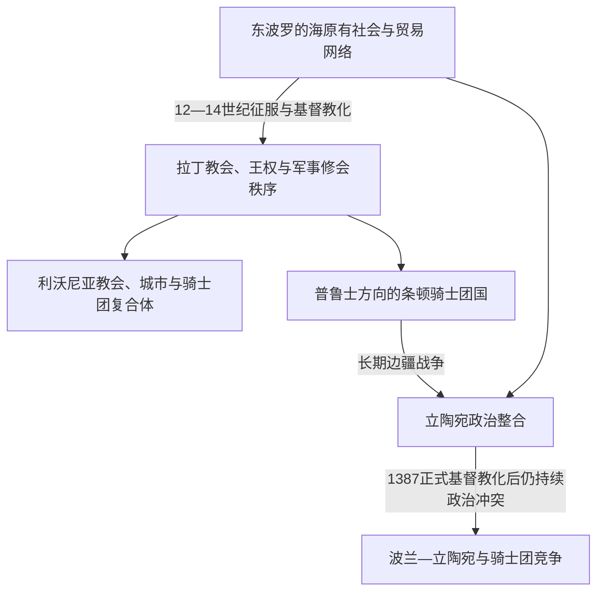

# 中世纪波罗的海十字军

## 时间

12—14世纪为东波罗的海征服与建制的主要阶段；相关战争在立陶宛方向延续到15世纪。

## 空间范围

本页聚焦今爱沙尼亚、拉脱维亚、立陶宛及普鲁士等东波罗的海社会在北方十字军中的经历。完整的运动背景、文德人和芬兰等其他战场，参见[北方十字军](/%E4%BA%BA%E6%96%87%E7%A7%91%E5%AD%A6/%E5%8E%86%E5%8F%B2/%E6%AC%A7%E6%B4%B2/_%E9%80%9A%E5%8F%B2/%E5%8D%81%E5%AD%97%E5%86%9B%E4%B8%9C%E5%BE%81/%E5%B9%BF%E4%B9%89%E5%8D%81%E5%AD%97%E5%86%9B%E8%BF%90%E5%8A%A8/%E5%8C%97%E6%96%B9%E5%8D%81%E5%AD%97%E5%86%9B.md)。

## 概括

中世纪波罗的海十字军是北方十字军在东波罗的海的区域展开。传教士、教皇授权的十字军、丹麦和瑞典王权、德意志诸侯以及军事修会，把传教、征服、殖民和贸易控制结合起来。它推动拉丁基督教、德意志城市和骑士团政治网络进入波罗的海东岸，也使当地社会经历土地占领、贡赋重组、宗教转变和长期抵抗。

## 地区演进图

## 主要区域

| 区域 | 主要参与者 | 历史结果 |
|---|---|---|
| 利沃尼亚与爱沙尼亚 | 里加主教区、宝剑骑士团、丹麦王权、德意志商人和城市 | 形成主教区、骑士团领地与汉萨城市并存的[利沃尼亚](/%E4%BA%BA%E6%96%87%E7%A7%91%E5%AD%A6/%E5%8E%86%E5%8F%B2/%E6%AC%A7%E6%B4%B2/%E6%B3%A2%E7%BD%97%E7%9A%84%E6%B5%B7/%E5%88%A9%E6%B2%83%E5%B0%BC%E4%BA%9A.md)秩序。 |
| 普鲁士 | 古普鲁士诸部、波兰诸侯、[条顿骑士团国](/%E4%BA%BA%E6%96%87%E7%A7%91%E5%AD%A6/%E5%8E%86%E5%8F%B2/%E6%AC%A7%E6%B4%B2/%E6%B3%A2%E7%BD%97%E7%9A%84%E6%B5%B7/%E6%9D%A1%E9%A1%BF%E9%AA%91%E5%A3%AB%E5%9B%A2%E5%9B%BD%E4%B8%8E%E6%B3%A2%E7%BD%97%E7%9A%84%E6%B5%B7%E7%A7%A9%E5%BA%8F.md) | 古普鲁士社会遭征服和基督教化，骑士团建立领土国家。 |
| 立陶宛 | 立陶宛大公国、条顿骑士团及其利沃尼亚分支 | [立陶宛大公国](/%E4%BA%BA%E6%96%87%E7%A7%91%E5%AD%A6/%E5%8E%86%E5%8F%B2/%E6%AC%A7%E6%B4%B2/%E6%B3%A2%E7%BD%97%E7%9A%84%E6%B5%B7/%E7%AB%8B%E9%99%B6%E5%AE%9B%E5%A4%A7%E5%85%AC%E5%9B%BD.md)在抵抗压力中整合扩张，基督教化后仍与骑士团长期战争。 |
| 芬兰与芬兰湾 | 瑞典王权、诺夫哥罗德及当地芬兰语支人群 | 十字军叙事与瑞典东扩、教会建制和瑞典—诺夫哥罗德边界竞争交织。 |

## 区域影响

- 十字军目标包括利沃尼亚、爱沙尼亚、普鲁士和立陶宛等方向，但各地结果不同：爱沙尼亚和利沃尼亚较早进入拉丁教会与骑士团秩序，立陶宛则形成能够长期抵抗的国家。
- 征服使波罗的海东岸进入拉丁基督教、德意志城市和骑士团政治网络；里加、塔林等城市又通过汉萨贸易连接北海与罗斯腹地。
- 骑士团、主教区、城市与地方贵族并非单一统一政权，各方之间经常争夺土地、司法和贸易利益。
- 基督教化既包含强制征服，也包含统治者的政治选择、地方社会适应和长期文化变迁，不能只理解为一次宗教改宗。
- 波罗的海十字军与传统赴圣地十字军不同，是欧洲东北边疆扩张、建制和基督教化运动；其共同合法性来源和总体比较由[北方十字军](/%E4%BA%BA%E6%96%87%E7%A7%91%E5%AD%A6/%E5%8E%86%E5%8F%B2/%E6%AC%A7%E6%B4%B2/_%E9%80%9A%E5%8F%B2/%E5%8D%81%E5%AD%97%E5%86%9B%E4%B8%9C%E5%BE%81/%E5%B9%BF%E4%B9%89%E5%8D%81%E5%AD%97%E5%86%9B%E8%BF%90%E5%8A%A8/%E5%8C%97%E6%96%B9%E5%8D%81%E5%AD%97%E5%86%9B.md)主笔记维护。

## 演变关系

- 前一节点：[早期波罗的人](/%E4%BA%BA%E6%96%87%E7%A7%91%E5%AD%A6/%E5%8E%86%E5%8F%B2/%E6%AC%A7%E6%B4%B2/%E6%B3%A2%E7%BD%97%E7%9A%84%E6%B5%B7/%E6%97%A9%E6%9C%9F%E6%B3%A2%E7%BD%97%E7%9A%84%E4%BA%BA.md)。
- 地区后继：[利沃尼亚](/%E4%BA%BA%E6%96%87%E7%A7%91%E5%AD%A6/%E5%8E%86%E5%8F%B2/%E6%AC%A7%E6%B4%B2/%E6%B3%A2%E7%BD%97%E7%9A%84%E6%B5%B7/%E5%88%A9%E6%B2%83%E5%B0%BC%E4%BA%9A.md)、[条顿骑士团国与波罗的海秩序](/%E4%BA%BA%E6%96%87%E7%A7%91%E5%AD%A6/%E5%8E%86%E5%8F%B2/%E6%AC%A7%E6%B4%B2/%E6%B3%A2%E7%BD%97%E7%9A%84%E6%B5%B7/%E6%9D%A1%E9%A1%BF%E9%AA%91%E5%A3%AB%E5%9B%A2%E5%9B%BD%E4%B8%8E%E6%B3%A2%E7%BD%97%E7%9A%84%E6%B5%B7%E7%A7%A9%E5%BA%8F.md)。
- 通史上级：[北方十字军](/%E4%BA%BA%E6%96%87%E7%A7%91%E5%AD%A6/%E5%8E%86%E5%8F%B2/%E6%AC%A7%E6%B4%B2/_%E9%80%9A%E5%8F%B2/%E5%8D%81%E5%AD%97%E5%86%9B%E4%B8%9C%E5%BE%81/%E5%B9%BF%E4%B9%89%E5%8D%81%E5%AD%97%E5%86%9B%E8%BF%90%E5%8A%A8/%E5%8C%97%E6%96%B9%E5%8D%81%E5%AD%97%E5%86%9B.md)。
