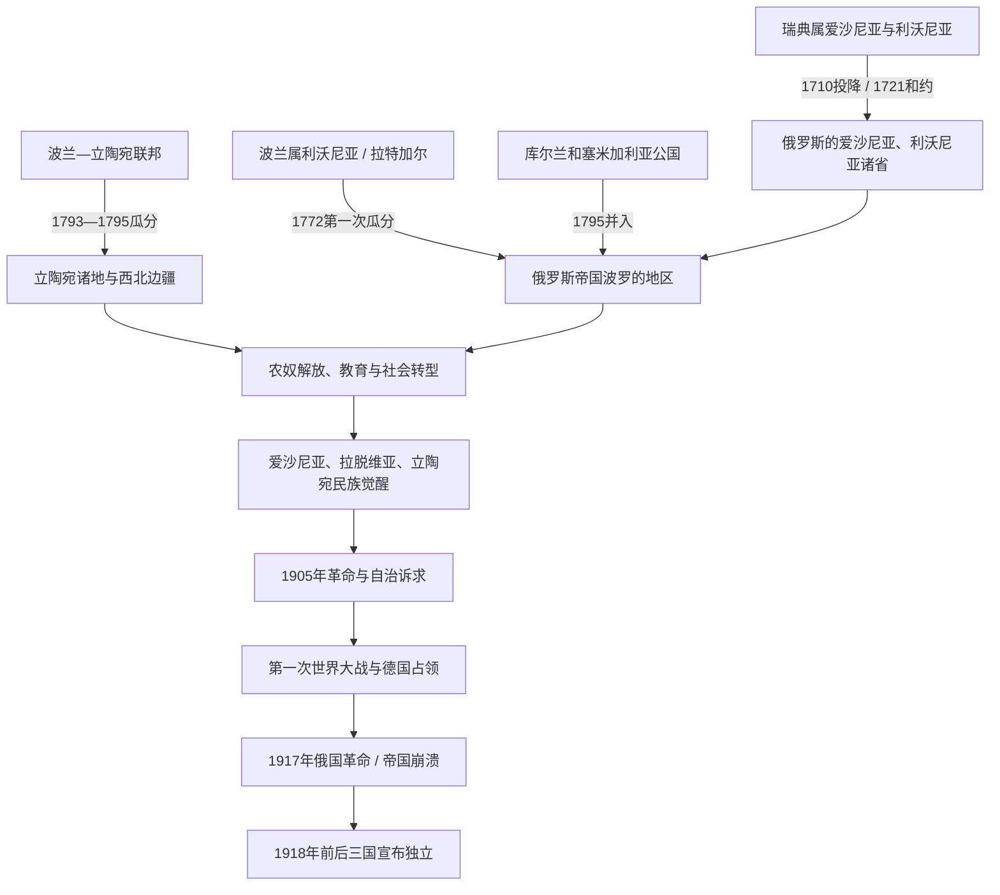

# 俄罗斯帝国统治下的波罗的海

[返回波罗的海历史](/%E4%BA%BA%E6%96%87%E7%A7%91%E5%AD%A6/%E5%8E%86%E5%8F%B2/%E6%AC%A7%E6%B4%B2/%E6%B3%A2%E7%BD%97%E7%9A%84%E6%B5%B7/README.md)

## 时间

1710/1721—1918年。爱沙尼亚与利沃尼亚在1710年实际被俄军控制，1721年正式割让；拉特加尔于1772年并入；库尔兰和立陶宛大部在1795年前后进入帝国。1917年帝国崩溃后，德军占领、俄国内战和独立战争使旧统治秩序到1918—1920年间才彻底退出。

## 概括

俄罗斯并非一次吞并现代波罗的三国，而是通过大北方战争、波兰—立陶宛联邦瓜分和维也纳会议形成不同制度区。爱沙尼亚、利沃尼亚和库尔兰构成享有波罗的德意志等级自治、路德宗和地方私法传统的“波罗的海诸省”；立陶宛及拉特加尔则更多按西北边疆治理，社会中波兰语贵族、天主教会、犹太城镇人口和立陶宛、白俄罗斯、拉脱维亚农民并存。

帝国早期依靠地方精英、港口和特殊法维持统治，19世纪逐步推进官僚整合和俄语化。农奴解放、教育、城市化和印刷资本扩大社会流动，却没有解决土地、政治代表和民族平等。1830—1831年、1863—1864年起义及1905年革命遭镇压；第一次世界大战、德军占领与1917年两次俄国革命最终摧毁帝国权力，为三国建国创造机会。

## 演进图

## 并入过程与地区差异

| 地区 | 并入过程 | 帝国内制度定位 |
|---|---|---|
| 爱沙尼亚省、利沃尼亚省 | 1710年雷瓦尔、里加等分别投降；1721年《尼斯塔德和约》由瑞典正式割让 | 保留路德宗、德意志语等级团体、城市法和大量地方特权；总督代表皇帝，实际乡村权力长期由波罗的德意志贵族掌握。 |
| 拉特加尔 | 1772年第一次瓜分时随波兰属利沃尼亚并入，主要归维捷布斯克省 | 天主教和波兰文化影响较强，不完全适用波罗的海诸省特殊秩序；农奴制到1861年帝国改革才废除。 |
| 库尔兰和塞米加利亚 | 公国长期受俄国外交影响，1795年第三次瓜分时末代公爵彼得·冯·比龙退位 | 成为库尔兰省，纳入波罗的德意志自治与路德宗地区体系。 |
| 立陶宛核心 | 联邦第二、第三次瓜分后大部归俄，1795年为关键节点 | 维尔纳、格罗德诺等省后归“西北边疆”；1843年设科夫诺省。波兰语贵族与天主教会受到起义后日益严厉限制。 |
| 苏瓦乌基等南部 | 1795年先归普鲁士，1807年入华沙公国，1815年后成为俄皇统治的波兰王国一部分 | 行政和法律路径不同于维尔纳、科夫诺；现代国界形成前不能用一条省界概括全部立陶宛语地区。 |
| 克莱佩达与小立陶宛 | 长期属普鲁士而非俄罗斯帝国 | 是立陶宛文化与出版的重要外部空间，尤其在俄国禁印时期。 |

## 统治结构与实际权力

### 波罗的海诸省

| 权力层级 | 角色 |
|---|---|
| 皇帝、元老院和帝国部委 | 掌握主权、战争、外交和高级任命；不同时期对地方特权采取确认、限制或俄语化政策。 |
| 总督、总督长官与省政府 | 执行中央政策，监督治安、税收和军务；里加常是跨省行政中心。 |
| 波罗的德意志骑士团体 | 由登记贵族组成，通过省议会、土地委员会和庄园司法控制地方；“自治”主要是精英等级自治，不是全体居民民主自治。 |
| 城市市议会、行会与商人 | 里加、雷瓦尔、利鲍等保有商业和市政传统，19世纪城市改革后逐渐纳入帝国通行制度。 |
| 路德宗教会与塔尔图大学 | 负责乡村教区、学校和精英教育；1802年重开塔尔图大学，早期以德语学术为主。 |
| 爱沙尼亚、拉脱维亚农民和新兴中产 | 19世纪解放后逐渐购地、迁城、办报和组织社团，但在土地与政治权力上长期弱于德意志地主。 |

### 立陶宛与西北边疆

| 权力层级 | 角色 |
|---|---|
| 皇帝、内务部与维尔纳总督长官 | 起义后加强军事、警察、教育和宗教控制，力图削弱波兰政治传统。 |
| 省长、县官与俄语官僚 | 推行帝国法、征兵、税收和俄语化；地方行政边界多次调整。 |
| 波兰语贵族与天主教会 | 保有土地和文化声望，却因1830—1831、1863—1864年起义遭没收、流放、修道院关闭等打击。 |
| 犹太社区与城镇自治传统 | 立陶宛地区处于犹太定居区内，犹太人是许多城镇商业和手工业的重要群体，同时受居住、教育和职业限制。 |
| 立陶宛农民、神职人员与知识分子 | 农奴解放后形成民族运动社会基础；低级神职人员、学生、出版者和“书籍走私者”维持拉丁字母文化。 |

## 俄罗斯君主世系

下表列出从大北方战争接管东岸到帝国灭亡的全部俄罗斯君主；1721年前彼得一世称沙皇，1721年后使用皇帝称号。

| 顺序 | 君主 | 王室 | 在位 | 与前任关系 | 波罗的海地区关键事件 |
|---:|---|---|---|---|---|
| 1 | **彼得一世** | 罗曼诺夫 | 1682—1725年；1721年称皇帝 | 费奥多尔三世异母弟，早年与伊凡五世共治 | 大北方战争夺取英格里亚、爱沙尼亚和利沃尼亚；1710年投降、1721年和约确认；承诺地方等级特权。 |
| 2 | 叶卡捷琳娜一世 | 罗曼诺夫 | 1725—1727年 | 彼得一世之妻 | 延续依赖波罗的德意志行政和军政人才的政策。 |
| 3 | 彼得二世 | 罗曼诺夫 | 1727—1730年 | 彼得一世之孙 | 短期统治，地方特殊秩序延续。 |
| 4 | 安娜 | 罗曼诺夫 | 1730—1740年 | 伊凡五世之女、彼得一世侄女 | 此前曾任库尔兰公爵夫人；比龙家族和波罗的德意志官员影响上升。 |
| 5 | 伊凡六世 | 不伦瑞克-罗曼诺夫 | 1740—1741年 | 安娜指定的外甥曾孙，婴儿君主 | 摄政政府迅速被政变推翻。 |
| 6 | 伊丽莎白 | 罗曼诺夫 | 1741—1762年 | 彼得一世之女 | 恢复彼得一世直系；波罗的诸省特权总体保留。 |
| 7 | 彼得三世 | 荷尔斯泰因-戈托普-罗曼诺夫 | 1762年 | 彼得一世外孙 | 在位约半年，被妻子发动政变废黜。 |
| 8 | **叶卡捷琳娜二世** | 荷尔斯泰因-戈托普-罗曼诺夫 | 1762—1796年 | 彼得三世之妻 | 1772年取得拉特加尔和联邦东部；1795年取得库尔兰、立陶宛大部；1780年代曾推进省制整合。 |
| 9 | 保罗一世 | 荷尔斯泰因-戈托普-罗曼诺夫 | 1796—1801年 | 叶卡捷琳娜二世之子 | 恢复波罗的海部分特殊机构；1796年设置维尔纳省等新行政格局。 |
| 10 | 亚历山大一世 | 荷尔斯泰因-戈托普-罗曼诺夫 | 1801—1825年 | 保罗一世长子 | 1802年重开塔尔图大学；1816、1817、1819年先后在爱沙尼亚、库尔兰、利沃尼亚解放农奴。 |
| 11 | 尼古拉一世 | 荷尔斯泰因-戈托普-罗曼诺夫 | 1825—1855年 | 亚历山大一世之弟 | 镇压1830—1831年起义，1832年关闭维尔纽斯大学，加强西北边疆行政与宗教整合。 |
| 12 | **亚历山大二世** | 荷尔斯泰因-戈托普-罗曼诺夫 | 1855—1881年 | 尼古拉一世长子 | 1861年帝国农奴解放覆盖立陶宛、拉特加尔；镇压1863—1864年起义并实施立陶宛拉丁字母禁印。 |
| 13 | 亚历山大三世 | 荷尔斯泰因-戈托普-罗曼诺夫 | 1881—1894年 | 亚历山大二世之子 | 1880年代后在行政、学校、法院和大学推进俄语化，削弱波罗的德意志特殊秩序。 |
| 14 | **尼古拉二世** | 荷尔斯泰因-戈托普-罗曼诺夫 | 1894—1917年 | 亚历山大三世之子 | 1904年解除立陶宛禁印；1905年革命席卷三地；一战失去西部，1917年退位，帝国终结。 |

## 分阶段发展

### 地方特权与帝国立足（1710—1795）

彼得一世以1710年投降条款确认路德宗、德意志贵族和城市特权，换取低成本接管。1721年后里加、雷瓦尔和新建圣彼得堡共同服务俄罗斯海军、商业和西向联系。波罗的德意志贵族进入帝国军队、外交和官僚体系，地方庄园对农民的控制反而在18世纪一度加强。

叶卡捷琳娜二世试图以帝国通行省制和城市制度整合地区，但地方等级不断援引投降特权。与此同时，三次瓜分使拉特加尔、库尔兰与立陶宛进入同一帝国主权，却没有形成统一“波罗的省”。

### 改革、农奴解放与社会转型（1801—1863）

- 亚历山大一世时期，爱沙尼亚省于1816年、库尔兰省于1817年、利沃尼亚省于1819年取消农民人身农奴身份。农民未同步获得土地，仍需租佃和承担契约劳役；19世纪中叶后购地和地方自治改革才逐渐扩大。
- 立陶宛和拉特加尔主要适用1861年帝国解放法。1863年起义背景下，政府在西北边疆调整赎买条件以争取农民，但土地不足和地主优势持续。
- 1802年塔尔图大学重开，成为德语学术和帝国人才中心；文法学校、教师学院、报刊与识字增长为本地知识分子出现创造条件。
- 里加、塔林、利耶帕亚等港口受铁路、工业和帝国内市场带动，爱沙尼亚、拉脱维亚人口向城市迁移。立陶宛工业化总体较慢，维尔纽斯、考纳斯和边境商业仍是重要节点。

### 起义与西北边疆压制（1830—1864）

1830—1831年波兰王国起义扩展到立陶宛，地方贵族、学生和农民以不同目标参战，最终被镇压。俄国政府关闭维尔纽斯大学，限制天主教修会和波兰语教育，并在1839年取消帝国内大部分东仪天主教会组织。

1863—1864年一月起义再次席卷立陶宛和白俄罗斯。总督米哈伊尔·穆拉维约夫以处决、流放、没收地产和学校控制镇压。1864年后政府禁止以拉丁字母在帝国内印刷立陶宛语出版物，试图推广西里尔字母；禁令到1904年取消。大量书刊在普鲁士小立陶宛印刷，由“书籍走私者”越境运入，反而形成跨阶层文化网络。

### 民族觉醒与大众政治（1850年代—1904）

| 运动 | 社会基础与文化机制 | 代表节点 |
|---|---|---|
| 爱沙尼亚民族觉醒 | 受教育农民、教师、牧师、记者和城市社团；从波罗的德意志文化框架中争取本地语言公共空间 | 《卡列维波埃格》于1857—1861年分册出版；扬森办报；1869年塔尔图首届全爱沙尼亚歌咏节；雅各布松与赫特推动政治、民俗活动。 |
| 拉脱维亚民族觉醒 | “青年拉脱维亚人”、城市知识分子、农民购地者和社团 | 1850—1870年代语言与经济自主论述；1873年里加首届全拉脱维亚歌咏节；克里什亚尼斯·巴龙斯整理民歌。 |
| 立陶宛民族复兴 | 天主教低级神职人员、学生、农民出身知识分子、海外和普鲁士出版网络 | 瓦兰丘斯组织禁酒与教育；《黎明》1883年创刊、《钟声》1889年创刊；禁印与书籍走私强化语言认同。 |

民族觉醒不是必然通向独立。早期诉求常是文化权利、地方自治或社会改革；阶级、宗教、城市语言和地区认同使各运动内部存在保守、自由、社会主义等路线。

### 俄语化、工业化与1905年革命（1880年代—1907）

亚历山大三世时期，俄语逐步成为学校、法院和行政主要语言，塔尔图大学于1889年前后俄语化并在1893年改称尤里耶夫大学。改革削弱德意志等级垄断，却没有把权力平等交给本地民族，反而扩大对帝国中央的不满。

1905年革命中：

- 拉脱维亚和爱沙尼亚城市爆发罢工，乡村出现庄园焚毁、地方委员会和武装冲突；帝国惩罚远征队以处决、鞭刑和流放镇压。
- 立陶宛“大维尔纽斯议会”要求广泛自治、立陶宛语行政和学校；乡村抵制俄国机关，天主教与民族组织扩大。
- 帝国杜马选举和结社、报刊空间短暂开放，政党与合作社得以发展；但自治诉求未实现，反动时期造成大批流亡。

## 第一次世界大战与帝国崩溃

### 战争与占领

1915年德军占领立陶宛和库尔兰，数十万居民、工厂与机构向俄国内地撤离。德军在“东部总司令辖区”实行军事行政、征用和交通控制；战线把拉脱维亚分割，拉脱维亚步枪部队在俄军中形成。1917年9月德军占领里加，10月夺西爱沙尼亚群岛，1918年初进一步进入爱沙尼亚。

### 1917年革命

二月革命后，爱沙尼亚获得将爱沙尼亚省与利沃尼亚北部合并的自治安排；拉脱维亚和立陶宛政治会议也提出自治或独立。布尔什维克十月夺权后，苏维埃、民族议会、德军与反布尔什维克力量并立。帝国主权已无力恢复统一行政。

### 直接终点

1918年3月《布列斯特-立托夫斯克条约》使苏俄退出并承认德国在西部的控制。德国战败后出现权力真空，爱沙尼亚、拉脱维亚和立陶宛的国家机构与军队必须再通过独立战争确立边界。因此“俄罗斯帝国统治结束”与“独立完全巩固”之间存在1917—1920年的过渡。

## 重要事件

| 时间 | 事件 | 长期意义 |
|---|---|---|
| 1710、1721年 | 爱沙尼亚和利沃尼亚投降及正式割让 | 俄罗斯成为东波罗的海主导强权，波罗的德意志自治框架形成。 |
| 1772、1795年 | 联邦瓜分与库尔兰并入 | 拉特加尔、库尔兰和立陶宛大部纳入帝国，但制度不同。 |
| 1802年 | 塔尔图大学重开 | 成为帝国西部学术中心，也培育本地知识群体。 |
| 1816—1819年 | 波罗的海诸省农奴解放 | 先于俄国内地取消人身依附，却未把土地无偿交给农民。 |
| 1830—1831年 | 起义 | 立陶宛政治传统遭镇压，维尔纽斯大学关闭。 |
| 1861—1864年 | 农奴解放、一月起义与禁印 | 社会改革和政治高压并行，立陶宛民族网络转向地下与境外。 |
| 1869、1873年 | 爱沙尼亚、拉脱维亚歌咏节 | 大规模语言文化共同体公开呈现。 |
| 1880年代—1890年代 | 俄语化 | 削弱旧德意志与波兰精英，也激化新民族运动反帝国倾向。 |
| 1905年 | 革命与大维尔纽斯议会 | 大众政治、自治诉求和武装冲突的共同转折。 |
| 1915—1918年 | 德军占领与俄国革命 | 帝国行政和军队退出，三国建国进入现实阶段。 |

## 帝国统治的维持机制

1. 以1710年特权换取波罗的德意志精英合作，降低驻军和行政成本。
2. 利用里加、雷瓦尔、利耶帕亚等港口发展海军、贸易和工业，连接圣彼得堡。
3. 在立陶宛以省级官僚、军队、警察和宗教政策压制联邦复国传统。
4. 通过学校、征兵、铁路和帝国内市场逐步整合社会。
5. 在不同民族、等级和宗教群体间选择性扶持或限制，防止形成统一反对联盟。

## 衰落与终结原因

### 结构因素

- 特权自治与中央集权长期冲突，帝国既依赖地方精英，又不能满足本地新兴民族的政治参与。
- 土地分配、庄园权力和城市劳工问题在解放后持续，社会矛盾与民族矛盾叠加。
- 俄语化削弱旧精英却未建立被广泛接受的共同公民身份。
- 工业化、识字和大众传播提高动员能力，帝国专制制度的代表渠道不足。

### 外部压力

德国成为波罗的海贸易、文化和军事上的强邻，一战令西部成为主战场。战争造成难民、征用、通胀和军队伤亡，破坏帝国财政与交通。

### 直接触发

1917年二月革命终结君主制，十月革命又打碎旧国家和军队指挥。德军推进使中央权力实际退出，布尔什维克、民族议会和地方武装争夺真空。帝国不是被三国一场同步起义击倒，而是在总体战争与革命崩溃中失去波罗的地区。

## 关键辨析

- **“波罗的海诸省”通常不包括全部立陶宛**：爱沙尼亚、利沃尼亚、库尔兰有德意志等级自治，立陶宛主要属西北边疆。
- **农奴解放并不等于土地改革**：1816—1819年爱沙尼亚和拉脱维亚大部农民获得人身自由却普遍缺地；立陶宛与拉特加尔主要到1861年解放。
- **俄语化对不同精英影响不同**：它限制德意志、波兰和本地语言，不应简单理解为只针对单一民族。
- **1917年不是边界稳定年**：独立宣言、德国占领、苏俄进攻和内战重叠，国家地位到1920年前后才巩固。

## 演变关系

- 前一节点：[瑞典统治下的东波罗的海](/%E4%BA%BA%E6%96%87%E7%A7%91%E5%AD%A6/%E5%8E%86%E5%8F%B2/%E6%AC%A7%E6%B4%B2/%E6%B3%A2%E7%BD%97%E7%9A%84%E6%B5%B7/%E7%91%9E%E5%85%B8%E7%BB%9F%E6%B2%BB%E4%B8%8B%E7%9A%84%E4%B8%9C%E6%B3%A2%E7%BD%97%E7%9A%84%E6%B5%B7.md)、[波兰-立陶宛联邦](/%E4%BA%BA%E6%96%87%E7%A7%91%E5%AD%A6/%E5%8E%86%E5%8F%B2/%E6%AC%A7%E6%B4%B2/%E6%96%AF%E6%8B%89%E5%A4%AB/%E8%A5%BF%E6%96%AF%E6%8B%89%E5%A4%AB/%E6%B3%A2%E5%85%B0-%E7%AB%8B%E9%99%B6%E5%AE%9B%E8%81%94%E9%82%A6.md)。
- 后一节点：[波罗的三国独立](/%E4%BA%BA%E6%96%87%E7%A7%91%E5%AD%A6/%E5%8E%86%E5%8F%B2/%E6%AC%A7%E6%B4%B2/%E6%B3%A2%E7%BD%97%E7%9A%84%E6%B5%B7/%E6%B3%A2%E7%BD%97%E7%9A%84%E4%B8%89%E5%9B%BD%E7%8B%AC%E7%AB%8B.md)。
