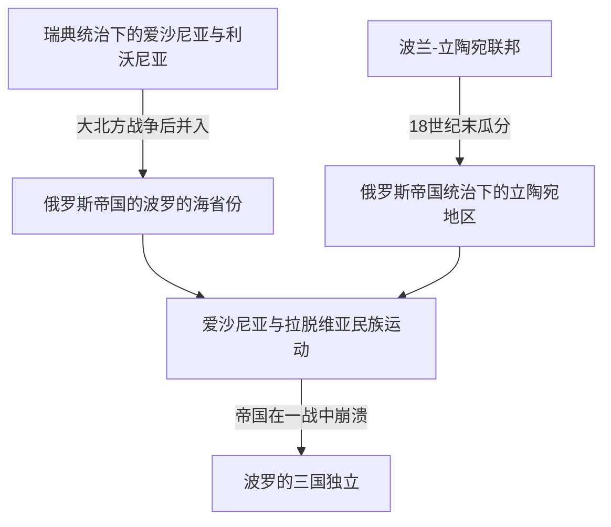

# 俄罗斯帝国统治下的波罗的海

## 时间

18世纪—1918年

## 概括

俄罗斯帝国在大北方战争后逐步控制东波罗的海地区，爱沙尼亚、拉脱维亚和立陶宛方向先后进入帝国体系。各地并入的时间、既有制度和民族运动并不相同，因此这是一段汇合但不完全同质化的区域历史。

## 演进图

## 说明

- 爱沙尼亚、利沃尼亚等地在18世纪初并入俄罗斯帝国，1721年和约确认俄罗斯取代瑞典成为东波罗的海主导力量。
- 立陶宛在波兰-立陶宛联邦被瓜分后进入俄罗斯帝国统治，其历史路径与较早并入的爱沙尼亚、利沃尼亚并不完全相同。
- 当地德意志贵族、波罗的民族运动和俄罗斯帝国政策共同塑造近代波罗的海社会。
- 爱沙尼亚和拉脱维亚方向的波罗的德意志贵族长期保有地方特权；立陶宛方向则与波兰贵族传统、天主教和帝国俄化政策关系更密切。
- 19世纪的农奴制改革、识字教育、城市化和民族文化运动，为一战后现代国家形成准备了社会条件。

## 演变关系

- 前一节点：[瑞典统治下的东波罗的海](/%E4%BA%BA%E6%96%87%E7%A7%91%E5%AD%A6/%E5%8E%86%E5%8F%B2/%E6%AC%A7%E6%B4%B2/%E6%B3%A2%E7%BD%97%E7%9A%84%E6%B5%B7/%E7%91%9E%E5%85%B8%E7%BB%9F%E6%B2%BB%E4%B8%8B%E7%9A%84%E4%B8%9C%E6%B3%A2%E7%BD%97%E7%9A%84%E6%B5%B7.md)、[波兰-立陶宛联邦](/%E4%BA%BA%E6%96%87%E7%A7%91%E5%AD%A6/%E5%8E%86%E5%8F%B2/%E6%AC%A7%E6%B4%B2/%E6%96%AF%E6%8B%89%E5%A4%AB/%E8%A5%BF%E6%96%AF%E6%8B%89%E5%A4%AB/%E6%B3%A2%E5%85%B0-%E7%AB%8B%E9%99%B6%E5%AE%9B%E8%81%94%E9%82%A6.md)。
- 后一节点：[波罗的三国独立](/%E4%BA%BA%E6%96%87%E7%A7%91%E5%AD%A6/%E5%8E%86%E5%8F%B2/%E6%AC%A7%E6%B4%B2/%E6%B3%A2%E7%BD%97%E7%9A%84%E6%B5%B7/%E6%B3%A2%E7%BD%97%E7%9A%84%E4%B8%89%E5%9B%BD%E7%8B%AC%E7%AB%8B.md)。
