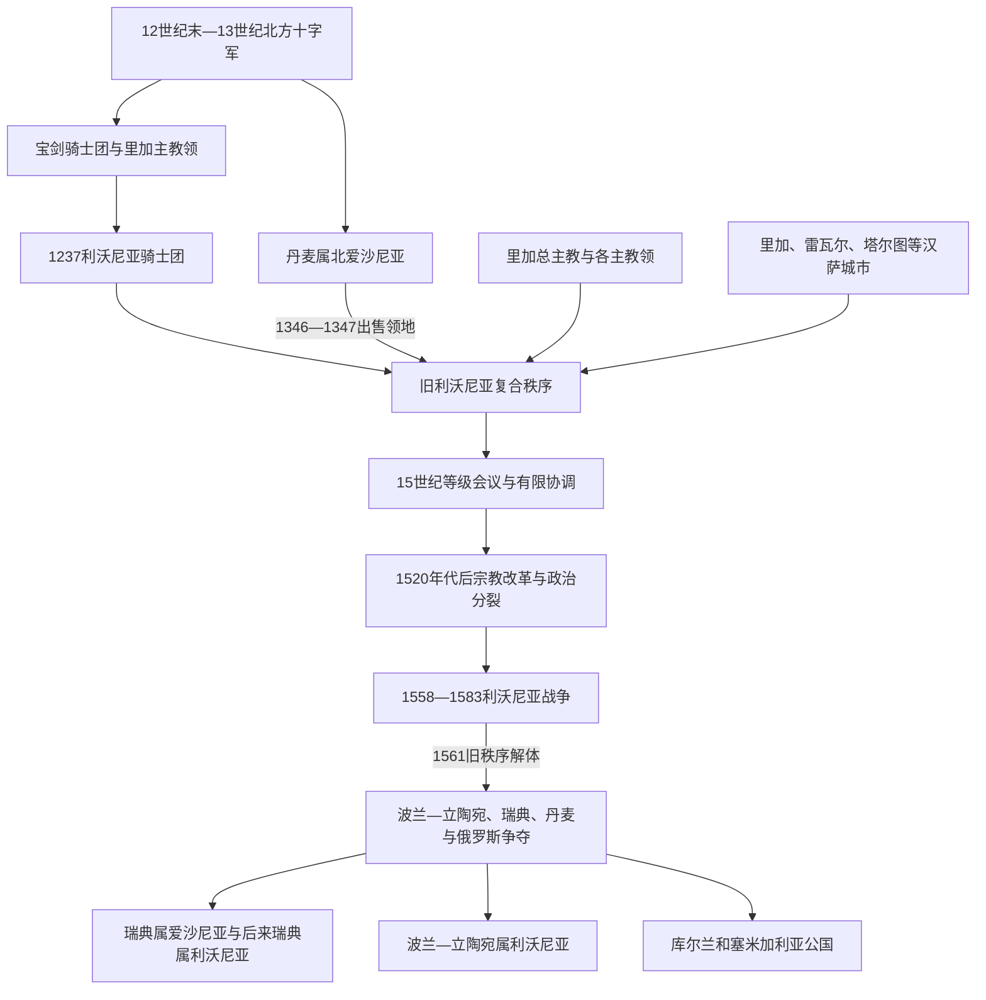

# 利沃尼亚

[返回波罗的海历史](/%E4%BA%BA%E6%96%87%E7%A7%91%E5%AD%A6/%E5%8E%86%E5%8F%B2/%E6%AC%A7%E6%B4%B2/%E6%B3%A2%E7%BD%97%E7%9A%84%E6%B5%B7/README.md)

## 时间

约1201—1561年；利沃尼亚战争延续到1583年，此后“利沃尼亚”仍作为分治地区和省名使用。本页所称中世纪利沃尼亚，也常称“旧利沃尼亚”或“圣母之地”。

## 空间范围

大体覆盖今爱沙尼亚与拉脱维亚，但边界随征服、封地和战争变化。北爱沙尼亚在1219—1346年主要属丹麦王权；萨雷马岛、库尔兰和拉特加尔等地的政治归属也不完全同步，因此利沃尼亚不能等同于任何现代国家或单一稳定疆域。

## 概括

利沃尼亚不是统一王朝国家，而是利沃尼亚骑士团、里加总主教及若干主教领、汉萨城市、封臣和地方等级共同构成的复合秩序。各单位共享拉丁基督教、德意志语精英文化与对本地农民社会的统治，也因土地、司法、主教任命和贸易而不断冲突。

它的崛起依靠北方十字军、城堡与城市网络、汉萨贸易和跨地区军事资源；其衰落则来自内部权力分散、修会兵力与财政有限、宗教改革撕裂、莫斯科—立陶宛—波兰—瑞典竞争升级。1558年伊凡四世入侵是直接触发因素，1560—1561年军事崩溃和各政治单位分别寻求保护，使旧利沃尼亚解体。

## 演进图

## 建立背景

### 从传教据点到领地征服

迈因哈德、贝特霍尔德和阿尔伯特三代主教把道加瓦河口传教逐步转化为有十字军援军、城堡和港口支持的领地事业。1201年里加建立，约1202年宝剑骑士团成立，成为持续作战的军事骨干。主教与骑士团按征服地分配收入，却都试图扩大自身份额，权力冲突从一开始便嵌入制度。

### 本地盟友与地区差异

征服者依靠受洗的利沃尼亚、拉特加利亚等地方首领，也与丹麦王权争夺爱沙尼亚。爱沙尼亚、库尔兰、塞米加利亚和萨雷马岛的抵抗终结时间不同；丹麦在1219年后统治北爱沙尼亚。1236年宝剑骑士团在绍莱战败，1237年残部并入条顿骑士团，成为有地区自主性的利沃尼亚分支。

### “圣母之地”与“联盟”的限度

教皇文书把该地区称为“圣母之地”，强调其教会法身份；现代常用“利沃尼亚邦联”概括骑士团、主教领和城市共存。1435年沃尔克协议及此后等级会议确实加强协商，但没有建立统一主权、财政或常备中央政府，因此“邦联”不应理解为近代联邦国家。

## 政治组成与统治结构

| 政治单位 | 最高权力与机构 | 领地和作用 | 与其他单位关系 |
|---|---|---|---|
| 利沃尼亚骑士团 | 地区团长、骑士团会议与各团区长官 | 占旧利沃尼亚最大块领地，经营城堡、庄园、军队和司法 | 组织上属条顿骑士团体系，实际政策常以利沃尼亚利益为先；与里加总主教长期竞争。 |
| 里加总主教领 | 总主教、教士会及封臣 | 兼具教会管辖和世俗领地，是利沃尼亚教会首席 | 与骑士团争夺里加、封臣效忠和主教任命；总主教本人并不能统治全部利沃尼亚。 |
| 塔尔图主教领 | 塔尔图主教与教士会 | 控制东南爱沙尼亚部分地区，邻近普斯科夫 | 承受罗斯边境压力，也参与利沃尼亚等级政治。 |
| 萨雷—莱内主教领 | 主教及地方封臣 | 包括萨雷马岛与爱沙尼亚西部若干分散领地 | 岛屿和大陆领地分离，易受丹麦、瑞典等海上力量影响。 |
| 库尔兰主教领 | 主教及封臣 | 库尔兰一小部分教会领地 | 规模有限，周围多为骑士团领地。 |
| 里加、雷瓦尔、塔尔图等城市 | 市议会、行会与城市法 | 港口、手工业、信贷和汉萨贸易中心 | 有城墙、法庭和财政，既向领主承担义务，又维护城市自治；常在主教与骑士团间周旋。 |
| 地方贵族与封臣团 | 登记贵族、封臣会议、庄园网络 | 控制乡村土地、农民义务和地方司法 | 向骑士团或主教领效忠，但逐步形成共同等级利益，政权更替后仍保持影响。 |
| 本地村社与农民 | 村落、庄园和堂区层级 | 人口主体，承担地租、劳役、什一税及兵役辅助 | 缺少同城市和贵族相当的政治代表；不同地区的自由、依附与习惯权利长期不一。 |

## 分阶段发展

### 征服与制度定型（13世纪）

- 1201年里加成为主教座和贸易港；1220年代爱沙尼亚主要堡垒相继失守，1227年萨雷马岛被迫归顺。
- 1237年利沃尼亚骑士团形成后，以文登等城堡为中心重建军事组织。它继续征服库尔人和塞米加利亚人，并与立陶宛、诺夫哥罗德和普斯科夫作战。
- 1242年佩普西湖“冰上战役”中，亚历山大·涅夫斯基率诺夫哥罗德—苏兹达尔军击败利沃尼亚骑士团及其盟友。战役限制了当时向诺夫哥罗德方向的扩张，但没有摧毁骑士团。
- 1260年杜尔贝战败引起多地反抗；塞米加利亚主要抵抗到1290年才被压制。至13世纪末，领地与教区框架大体稳定。

### 城市繁荣、贵族化与内部争权（14—15世纪）

- 里加、雷瓦尔、塔尔图、派尔努等城市连接诺夫哥罗德、普斯科夫和西欧，谷物、蜡、毛皮、木材、盐及纺织品构成贸易。城市多加入汉萨网络，但“汉萨”是商业协作体系，不是利沃尼亚中央政府。
- 1343—1345年北爱沙尼亚爆发圣乔治之夜起义。起义遭镇压后，丹麦王室于1346年把爱沙尼亚公国售给条顿骑士团，后者在1347年转交利沃尼亚分支，骑士团领地扩大。
- 骑士团与里加总主教反复争夺宗主权，里加市民也多次武装对抗骑士团。1297—1330年的内战及15世纪围绕总主教任命的冲突显示内部秩序并不稳定。
- 1435年骑士团在维乌科梅日战役遭重创，同年各等级在沃尔克订立为期有限的合作协议。此后利沃尼亚议会成为协商战争、税赋和外交的场所，但决定仍依赖各政治单位执行。
- 土地逐渐集中于德意志语封臣和教会机构，庄园经济扩大。本地农民的迁徙、司法和劳役义务日益受领主控制；农奴化是数世纪演变，而非征服当天一次完成。

### 普莱滕贝格时期的暂时稳定（1494—1535）

沃尔特·冯·普莱滕贝格任利沃尼亚团长时改革军事动员，在1501—1503年对莫斯科战争中维持东部边界。1502年斯莫利诺湖战役虽没有消灭莫斯科军，却帮助取得长期停战。他善于在骑士团、主教、城市和外部列强间平衡，使利沃尼亚暂时稳定；这种个人协调没有转化为统一财政和继承制度。

### 宗教改革与制度裂缝（1520年代—1558）

- 路德宗思想经德意志城市和商贸网络传入，1520年代里加、雷瓦尔和塔尔图发生圣像破坏及教会财产争夺。城市与不少贵族转向路德宗，主教领维持天主教，骑士团成员内部也分化。
- 改革促进本地语言教理问答、学校和印刷，却削弱原有共同宗教合法性。教会领地的继承、财产和保护问题更易被周边君主利用。
- 1554年利沃尼亚与莫斯科议定休战，涉及有争议的“塔尔图贡赋”；利沃尼亚无法形成可靠联军，也缺少与火器时代相适应的财政和要塞体系。
- 1557年波斯沃尔条约使利沃尼亚进一步靠近波兰—立陶宛，伊凡四世将其视为敌对联盟。内部单位仍各自谈判，错失统一防御时机。

## 利沃尼亚战争与直接解体（1558—1561）

### 入侵与防线崩溃

1558年莫斯科军入侵，迅速夺取纳尔瓦与塔尔图。城市、主教领和骑士团既缺统一指挥，也无力长期支付雇佣军。外援谈判又使丹麦、瑞典和波兰—立陶宛分别取得介入据点。

### 1560年厄尔盖梅战役

1560年利沃尼亚骑士团主力在厄尔盖梅被莫斯科军击败，地区团长威廉·冯·菲尔斯滕贝格被俘。此役并非战争终点，却使修会无法再以独立军事力量维持旧秩序；农民暴动和雇佣军失控进一步扩大危机。

### 1561年分割与世俗化

- 北爱沙尼亚贵族与雷瓦尔向瑞典国王埃里克十四世效忠，形成瑞典属爱沙尼亚。
- 萨雷—莱内主教区等西部权益被丹麦王室成员马格努斯控制，丹麦取得岛屿方向影响。
- 最后一任团长戈特哈德·克特勒在《维尔纽斯协定》框架下向波兰国王兼立陶宛大公西吉斯蒙德二世·奥古斯特臣服。
- 道加瓦河以北及东部多地成为受波兰—立陶宛保护的利沃尼亚公国；道加瓦河以南的骑士团领地世俗化为库尔兰和塞米加利亚公国，由克特勒任世袭公爵。
- 莫斯科仍占领东部大片地区，但在后续战争中遭波兰—立陶宛和瑞典反攻，1582—1583年和约结束第一轮利沃尼亚战争。旧利沃尼亚并未恢复。

## 重要事件

| 时间 | 事件 | 过程与结果 |
|---|---|---|
| 1201年 | 里加建立 | 主教座、港口和十字军集结地结合，成为利沃尼亚长期中心。 |
| 1236—1237年 | 绍莱战败与修会合并 | 宝剑骑士团遭重创，残部成为条顿骑士团的利沃尼亚分支。 |
| 1242年 | 佩普西湖战役 | 诺夫哥罗德方面阻止当时的东向军事推进，随后边境竞争仍持续。 |
| 1260年 | 杜尔贝战役 | 骑士团联军败于萨莫吉希亚人，引起库尔、塞米加利亚及普鲁士等地反抗。 |
| 1343—1345年 | 圣乔治之夜起义 | 北爱沙尼亚反领主起义被镇压，间接促成丹麦出售领地。 |
| 1346—1347年 | 丹麦属爱沙尼亚转让 | 北爱沙尼亚进入骑士团体系，旧利沃尼亚领地格局调整。 |
| 1435年 | 沃尔克协议 | 各等级在军事危机后加强协商，常被视为“利沃尼亚邦联”制度节点。 |
| 1502年 | 斯莫利诺湖战役 | 普莱滕贝格稳定东线，利沃尼亚获得半个世纪相对和平。 |
| 1520年代 | 宗教改革传入 | 城市与贵族路德宗化，教会财产和主教权威受到冲击。 |
| 1558年 | 莫斯科入侵 | 纳尔瓦、塔尔图等失守，外部列强全面介入。 |
| 1560—1561年 | 厄尔盖梅惨败、骑士团世俗化 | 修会军事崩溃，各单位分别依附周边王权，旧利沃尼亚终结。 |

## 关键统治者与政治角色

利沃尼亚没有一条可与王朝世系等同的“君主表”。下表列的是改变制度走向的主要职务与代表人物，而非把不同政治单位合并为虚构的统一统治者。

| 人物 | 职务与时期 | 关键作用 |
|---|---|---|
| 阿尔伯特·冯·布克斯赫弗登 | 里加主教，1199—1229年 | 建立里加、组织年度十字军并推动宝剑骑士团成立；奠定主教—修会复合结构。 |
| 沃尔克温 | 宝剑骑士团团长，1209—1236年 | 领导扩张，死于绍莱战役；其败亡促成并入条顿骑士团。 |
| 赫尔曼·巴尔克、迪特里希·冯·格吕宁根 | 首任地区团长，分别约1237—1238年、1238—1241及1242—1246年 | 巴尔克受命完成修会合并，格吕宁根继续建立地区行政并向库尔兰扩张；早期任期因代理和离境在资料中有细节差异。 |
| 沃尔特·冯·普莱滕贝格 | 利沃尼亚团长，1494—1535年 | 对莫斯科作战、维护内部平衡，并在宗教改革初期避免立即内战。 |
| 威廉·冯·菲尔斯滕贝格 | 利沃尼亚团长，1557—1559年 | 利沃尼亚战争初期领导不利，1560年被俘。 |
| 戈特哈德·克特勒 | 末任利沃尼亚团长，1559—1561年；库尔兰公爵，1561—1587年 | 向波兰—立陶宛臣服并将南部修会领地世俗化，成为旧秩序与新公国的连接人物。 |
| 里加总主教威廉 | 1539—1563年在任 | 勃兰登堡家族成员，卷入波兰—立陶宛联盟和主教继承冲突，加深外部介入。 |
| 伊凡四世 | 莫斯科大公、沙皇，1533—1584年 | 1558年发动入侵，是旧利沃尼亚军事崩溃的直接外部触发者。 |

## 兴盛条件

1. **跨区域军事动员**：教皇授权与德意志修会网络持续提供骑士、捐款和政治承认。
2. **城堡—城市双网络**：城堡控制乡村和边境，汉萨城市提供现金、船运与市场。
3. **河海位置**：里加和雷瓦尔连接罗斯腹地与北海—波罗的海商业。
4. **地方分治的可利用性**：征服初期可与部分本地首领结盟；此后分散领地又容许不同精英保留特权。
5. **等级间的有限协商**：在没有中央国家的情况下，议会和临时联盟仍能处理共同防务和外交。

## 衰落与灭亡原因

### 结构因素

- 政治单位彼此独立，没有统一税制、军令和外交决策。
- 修会骑士人数有限，过度依赖封臣与雇佣军；城堡体系在重炮与大规模国家军队面前成本上升。
- 城市、贵族、主教和骑士团的利益不同，危机时倾向各寻保护者。
- 地方农民政治参与极低，庄园化和战争征敛削弱社会动员基础。

### 内部催化

- 宗教改革瓦解共同的天主教制度语言，引发主教财产和统治合法性争议。
- 15—16世纪的主教任命与修会内斗消耗资源；普莱滕贝格的个人平衡去世后未能制度化。
- 对莫斯科军力、火器和要塞战准备不足，财政改革迟缓。

### 外部压力与直接触发

- 莫斯科国家、波兰—立陶宛、瑞典和丹麦都把利沃尼亚视为港口、边境和贸易战略区。
- 1558年伊凡四世入侵直接摧毁东部防线；1560年厄尔盖梅战败使骑士团不再能独立作战。
- 1561年各单位分别接受瑞典、丹麦或波兰—立陶宛保护，旧利沃尼亚不是被一个继承国整体吞并，而是在军事失败中分裂解体。

## 社会与文化影响

- 德意志语贵族、城市市民和教士长期掌握书面行政与土地权，本地爱沙尼亚、拉脱维亚相关人群和利沃尼亚人构成乡村人口主体。
- 基督教堂区覆盖乡村，旧信仰、地方习俗和新教实践长期混合。宗教改革后，路德宗教理教育促进爱沙尼亚语与拉脱维亚语书写。
- 庄园经济与农民依附加深，但地区、时期和领主之间差异很大；不能把中世纪初的贡赋关系与近世成熟农奴制视为完全相同。
- 利沃尼亚解体后，波罗的德意志等级仍在瑞典、波兰—立陶宛和俄罗斯统治中延续，说明领土国家更替并未立即改变社会精英结构。

## 关键辨析

- **利沃尼亚不是利沃尼亚骑士团**：骑士团只是最大政治单位之一。
- **“邦联”不是现代联邦**：1435年后虽有等级会议和合作协议，却无统一主权、军队与财政。
- **雷瓦尔即今塔林，塔尔图旧称多尔帕特**：中世纪资料常用德语或拉丁语地名。
- **1561年是旧秩序解体，不是地区战争全部结束**：列强争夺延续到1583年，瑞典—波兰战争又在17世纪重开。

## 演变关系

- 前一节点：[中世纪波罗的海十字军](/%E4%BA%BA%E6%96%87%E7%A7%91%E5%AD%A6/%E5%8E%86%E5%8F%B2/%E6%AC%A7%E6%B4%B2/%E6%B3%A2%E7%BD%97%E7%9A%84%E6%B5%B7/%E4%B8%AD%E4%B8%96%E7%BA%AA%E6%B3%A2%E7%BD%97%E7%9A%84%E6%B5%B7%E5%8D%81%E5%AD%97%E5%86%9B.md)。
- 并行节点：[条顿骑士团国与波罗的海秩序](/%E4%BA%BA%E6%96%87%E7%A7%91%E5%AD%A6/%E5%8E%86%E5%8F%B2/%E6%AC%A7%E6%B4%B2/%E6%B3%A2%E7%BD%97%E7%9A%84%E6%B5%B7/%E6%9D%A1%E9%A1%BF%E9%AA%91%E5%A3%AB%E5%9B%A2%E5%9B%BD%E4%B8%8E%E6%B3%A2%E7%BD%97%E7%9A%84%E6%B5%B7%E7%A7%A9%E5%BA%8F.md)、[立陶宛大公国](/%E4%BA%BA%E6%96%87%E7%A7%91%E5%AD%A6/%E5%8E%86%E5%8F%B2/%E6%AC%A7%E6%B4%B2/%E6%B3%A2%E7%BD%97%E7%9A%84%E6%B5%B7/%E7%AB%8B%E9%99%B6%E5%AE%9B%E5%A4%A7%E5%85%AC%E5%9B%BD.md)。
- 分裂后续：[瑞典统治下的东波罗的海](/%E4%BA%BA%E6%96%87%E7%A7%91%E5%AD%A6/%E5%8E%86%E5%8F%B2/%E6%AC%A7%E6%B4%B2/%E6%B3%A2%E7%BD%97%E7%9A%84%E6%B5%B7/%E7%91%9E%E5%85%B8%E7%BB%9F%E6%B2%BB%E4%B8%8B%E7%9A%84%E4%B8%9C%E6%B3%A2%E7%BD%97%E7%9A%84%E6%B5%B7.md)、[波兰-立陶宛联邦](/%E4%BA%BA%E6%96%87%E7%A7%91%E5%AD%A6/%E5%8E%86%E5%8F%B2/%E6%AC%A7%E6%B4%B2/%E6%96%AF%E6%8B%89%E5%A4%AB/%E8%A5%BF%E6%96%AF%E6%8B%89%E5%A4%AB/%E6%B3%A2%E5%85%B0-%E7%AB%8B%E9%99%B6%E5%AE%9B%E8%81%94%E9%82%A6.md)及库尔兰和塞米加利亚公国。
