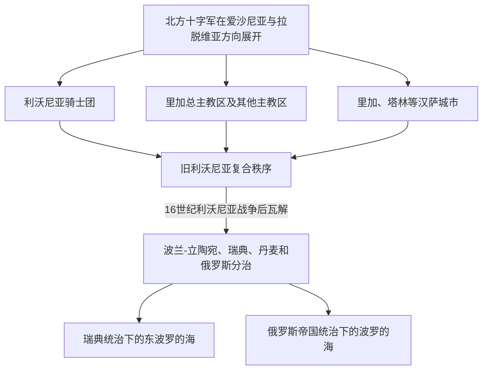

# 利沃尼亚

## 时间

13世纪—16世纪

## 概括

利沃尼亚是今爱沙尼亚、拉脱维亚一带中世纪德意志骑士、主教区、城市和地方贵族交织的区域。它不是边界稳定的单一民族国家，而是多个教会、修会和城市政治体共享的历史空间。

## 演进图

## 说明

- 利沃尼亚与利沃尼亚骑士团、里加总主教区和汉萨城市有关。
- 其社会结构中德意志城市和贵族长期占重要地位，本地爱沙尼亚人、拉脱维亚相关人群和利沃尼亚人则多处于庄园与地方共同体之中。
- 骑士团、主教区、城市和贵族并非层级统一的国家机关，各方在合作之外也长期争夺土地、司法和贸易权。
- 16世纪利沃尼亚战争后，区域被波兰-立陶宛、瑞典、丹麦和俄罗斯等力量重新瓜分。
- 利沃尼亚覆盖今爱沙尼亚和拉脱维亚的部分地区，不能与其中任何一个现代国家简单等同。

## 演变关系

- 前一节点：[中世纪波罗的海十字军](/%E4%BA%BA%E6%96%87%E7%A7%91%E5%AD%A6/%E5%8E%86%E5%8F%B2/%E6%AC%A7%E6%B4%B2/%E6%B3%A2%E7%BD%97%E7%9A%84%E6%B5%B7/%E4%B8%AD%E4%B8%96%E7%BA%AA%E6%B3%A2%E7%BD%97%E7%9A%84%E6%B5%B7%E5%8D%81%E5%AD%97%E5%86%9B.md)。
- 后一节点：[瑞典统治下的东波罗的海](/%E4%BA%BA%E6%96%87%E7%A7%91%E5%AD%A6/%E5%8E%86%E5%8F%B2/%E6%AC%A7%E6%B4%B2/%E6%B3%A2%E7%BD%97%E7%9A%84%E6%B5%B7/%E7%91%9E%E5%85%B8%E7%BB%9F%E6%B2%BB%E4%B8%8B%E7%9A%84%E4%B8%9C%E6%B3%A2%E7%BD%97%E7%9A%84%E6%B5%B7.md)、[俄罗斯帝国统治下的波罗的海](/%E4%BA%BA%E6%96%87%E7%A7%91%E5%AD%A6/%E5%8E%86%E5%8F%B2/%E6%AC%A7%E6%B4%B2/%E6%B3%A2%E7%BD%97%E7%9A%84%E6%B5%B7/%E4%BF%84%E7%BD%97%E6%96%AF%E5%B8%9D%E5%9B%BD%E7%BB%9F%E6%B2%BB%E4%B8%8B%E7%9A%84%E6%B3%A2%E7%BD%97%E7%9A%84%E6%B5%B7.md)。
