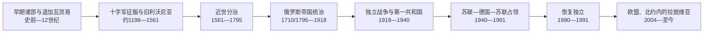

# 拉脱维亚历史

## 历史演进图

## 历史主线

今拉脱维亚不是由一个古代国家直线发展而来。库尔兰人、瑟米加利亚人、瑟罗尼亚人、拉特加尔人等波罗人群与芬兰语支的利沃尼亚人分布在道加瓦河、里加湾和西部海岸；河海贸易把斯堪的纳维亚、罗斯与西欧连在一起。12世纪末以后，传教、教皇授权的十字军、里加主教和宝剑骑士团共同推进征服。到13世纪末，地方诸部被纳入由骑士团、主教区、城市与德意志贵族构成的旧利沃尼亚，里加成为汉萨贸易中心，但这个历史区域同时覆盖今拉脱维亚和爱沙尼亚。

16世纪宗教改革和利沃尼亚战争摧毁旧秩序。今拉脱维亚长期分属不同政体：库尔兰与瑟米加利亚公国由凯特勒、比龙两家统治并臣属于波兰—立陶宛；维泽梅与里加先后处在联邦和瑞典之下；拉特加尔作为波属利沃尼亚保留较强天主教传统。俄罗斯通过大北方战争、第一次瓜分波兰和第三次瓜分，先后取得维泽梅、拉特加尔与库尔兰。行政边界虽分裂，农奴制废除、里加工业化、教育和印刷发展却促成共同的拉脱维亚语公共空间。青年拉脱维亚人、歌咏节、新思潮和1905年革命把文化民族运动推向现代群众政治。

第一次世界大战造成德军占领、难民潮、工业撤迁和拉脱维亚步枪兵的分化。1918年11月18日人民委员会宣布建立共和国；随后政府同时面对布尔什维克政权、德军残部、波罗的德意志军队和西俄志愿军。1919年采西斯战役、里加保卫战及1920年拉特加尔战役奠定国家控制，1920年与苏俄和约结束主要战争。共和国以1922年宪法、土地改革和议会政治建国，1934年卡尔利斯·乌尔马尼斯政变又把制度转为个人威权统治。

1940年苏联以最后通牒和驻军吞并拉脱维亚；1941—1944/45年纳粹德国统治造成犹太人大屠杀、强制劳动和军事动员；苏联再占领后实施驱逐、集体化、工业化和人口迁移。海外外交机构、流亡政治组织、民族游击队和国内文化记忆维持国家连续性主张。1980年代末的环境抗议、拉脱维亚人民阵线、1989年波罗的海之路、1990年5月4日宣言和1991年八月宪法性法律，使共和国恢复实际主权。

恢复独立后，拉脱维亚重建1922年宪法、市场经济和以战前公民资格连续性为基础的公民制度；俄罗斯军队于1994年撤出。2004年加入北约和欧洲联盟，2014年采用欧元。2014年后尤其是2022年俄罗斯全面入侵乌克兰以后，国防、能源脱俄、边境安全、拉脱维亚语教育和社会整合成为核心议题。截至2026-07-14，总统为埃德加斯·林克维奇斯，2026年5月28日获议会信任的安德里斯·库尔贝格斯任总理。

## 分期导航

| 顺序 | 阶段 | 时间 | 简要概括 |
| --- | --- | --- | --- |
| 1 | [早期社会、十字军与旧利沃尼亚](/%E4%BA%BA%E6%96%87%E7%A7%91%E5%AD%A6/%E5%8E%86%E5%8F%B2/%E6%AC%A7%E6%B4%B2/%E6%B3%A2%E7%BD%97%E7%9A%84%E6%B5%B7/%E6%8B%89%E8%84%B1%E7%BB%B4%E4%BA%9A/%E6%97%A9%E6%9C%9F%E7%A4%BE%E4%BC%9A%E3%80%81%E5%8D%81%E5%AD%97%E5%86%9B%E4%B8%8E%E6%97%A7%E5%88%A9%E6%B2%83%E5%B0%BC%E4%BA%9A.md) | 史前—1561年 | 诸部、利沃尼亚人与道加瓦网络，经十字军征服进入旧利沃尼亚复合秩序。 |
| 2 | [近世分治与库尔兰公国](/%E4%BA%BA%E6%96%87%E7%A7%91%E5%AD%A6/%E5%8E%86%E5%8F%B2/%E6%AC%A7%E6%B4%B2/%E6%B3%A2%E7%BD%97%E7%9A%84%E6%B5%B7/%E6%8B%89%E8%84%B1%E7%BB%B4%E4%BA%9A/%E8%BF%91%E4%B8%96%E5%88%86%E6%B2%BB%E4%B8%8E%E5%BA%93%E5%B0%94%E5%85%B0%E5%85%AC%E5%9B%BD.md) | 1561—1795年 | 联邦、瑞典、库尔兰公国与俄罗斯在现代国界内长期并立和更替。 |
| 3 | [俄罗斯帝国统治与民族觉醒](/%E4%BA%BA%E6%96%87%E7%A7%91%E5%AD%A6/%E5%8E%86%E5%8F%B2/%E6%AC%A7%E6%B4%B2/%E6%B3%A2%E7%BD%97%E7%9A%84%E6%B5%B7/%E6%8B%89%E8%84%B1%E7%BB%B4%E4%BA%9A/%E4%BF%84%E7%BD%97%E6%96%AF%E5%B8%9D%E5%9B%BD%E7%BB%9F%E6%B2%BB%E4%B8%8E%E6%B0%91%E6%97%8F%E8%A7%89%E9%86%92.md) | 1710/1795—1918年 | 三个帝国省区逐步形成共同语言民族运动，并经历工业化、1905年革命和一战。 |
| 4 | [第一次共和国、独立战争与威权转向](/%E4%BA%BA%E6%96%87%E7%A7%91%E5%AD%A6/%E5%8E%86%E5%8F%B2/%E6%AC%A7%E6%B4%B2/%E6%B3%A2%E7%BD%97%E7%9A%84%E6%B5%B7/%E6%8B%89%E8%84%B1%E7%BB%B4%E4%BA%9A/%E7%AC%AC%E4%B8%80%E6%AC%A1%E5%85%B1%E5%92%8C%E5%9B%BD%E3%80%81%E7%8B%AC%E7%AB%8B%E6%88%98%E4%BA%89%E4%B8%8E%E5%A8%81%E6%9D%83%E8%BD%AC%E5%90%91.md) | 1918—1940年 | 宣布独立、赢得多方战争、建立议会共和国，1934年后转为威权体制。 |
| 5 | [苏德占领与苏维埃时期](/%E4%BA%BA%E6%96%87%E7%A7%91%E5%AD%A6/%E5%8E%86%E5%8F%B2/%E6%AC%A7%E6%B4%B2/%E6%B3%A2%E7%BD%97%E7%9A%84%E6%B5%B7/%E6%8B%89%E8%84%B1%E7%BB%B4%E4%BA%9A/%E8%8B%8F%E5%BE%B7%E5%8D%A0%E9%A2%86%E4%B8%8E%E8%8B%8F%E7%BB%B4%E5%9F%83%E6%97%B6%E6%9C%9F.md) | 1940—1991年 | 苏联首次占领、纳粹占领、苏联再占领、镇压与社会重构，最终走向复国。 |
| 6 | [恢复独立后的拉脱维亚](/%E4%BA%BA%E6%96%87%E7%A7%91%E5%AD%A6/%E5%8E%86%E5%8F%B2/%E6%AC%A7%E6%B4%B2/%E6%B3%A2%E7%BD%97%E7%9A%84%E6%B5%B7/%E6%8B%89%E8%84%B1%E7%BB%B4%E4%BA%9A/%E6%81%A2%E5%A4%8D%E7%8B%AC%E7%AB%8B%E5%90%8E%E7%9A%84%E6%8B%89%E8%84%B1%E7%BB%B4%E4%BA%9A.md) | 1990年至今 | 完成法理与实际独立恢复，重建宪政并加入欧盟、北约，处理安全和社会整合。 |

## 世系与领导人专表

| 专表 | 覆盖范围 | 说明 |
| --- | --- | --- |
| [库尔兰与瑟米加利亚公爵世系表](/%E4%BA%BA%E6%96%87%E7%A7%91%E5%AD%A6/%E5%8E%86%E5%8F%B2/%E6%AC%A7%E6%B4%B2/%E6%B3%A2%E7%BD%97%E7%9A%84%E6%B5%B7/%E6%8B%89%E8%84%B1%E7%BB%B4%E4%BA%9A/%E5%BA%93%E5%B0%94%E5%85%B0%E4%B8%8E%E7%91%9F%E7%B1%B3%E5%8A%A0%E5%88%A9%E4%BA%9A%E5%85%AC%E7%88%B5%E4%B8%96%E7%B3%BB%E8%A1%A8.md) | 1561—1795年 | 列全获承认、共同统治、复位与争议公爵，说明凯特勒绝嗣、比龙复位和俄罗斯干预。 |
| [拉脱维亚现代国家元首与政府首脑表](/%E4%BA%BA%E6%96%87%E7%A7%91%E5%AD%A6/%E5%8E%86%E5%8F%B2/%E6%AC%A7%E6%B4%B2/%E6%B3%A2%E7%BD%97%E7%9A%84%E6%B5%B7/%E6%8B%89%E8%84%B1%E7%BB%B4%E4%BA%9A/%E6%8B%89%E8%84%B1%E7%BB%B4%E4%BA%9A%E7%8E%B0%E4%BB%A3%E5%9B%BD%E5%AE%B6%E5%85%83%E9%A6%96%E4%B8%8E%E6%94%BF%E5%BA%9C%E9%A6%96%E8%84%91%E8%A1%A8.md) | 1918年至今 | 分列共和国国家元首与完整总理序列、苏维埃法定首长与实际党领导、德国占领行政和流亡连续性。 |

## 重要转折与时间节点

| 时间 | 转折 | 历史意义 |
| --- | --- | --- |
| 约9000 BCE以后 | 冰后重新定居 | 狩猎采集、后来的农业和金属技术构成长期人口基础。 |
| 12—13世纪 | 道加瓦传教与北方十字军 | 里加、主教区和军事修会建立，地方政治被强制重组。 |
| 1201 | 里加建立 | 传教、军政与汉萨贸易中心逐渐形成。 |
| 1236—1237 | 宝剑骑士团战败并重组 | 绍莱战败后并入条顿骑士团，成为利沃尼亚分支。 |
| 1561—1562 | 旧利沃尼亚瓦解 | 库尔兰公国和近世分治格局形成。 |
| 1621/1629 | 瑞典控制里加与大部利沃尼亚 | 维泽梅进入瑞典省制，拉特加尔仍属联邦。 |
| 1642—1682 | 雅各布公爵统治 | 库尔兰发展造船、贸易和短暂海外据点，同时暴露小国资源局限。 |
| 1710/1721 | 俄罗斯取得里加与维泽梅 | 大北方战争后俄罗斯成为东波罗的海主导力量。 |
| 1772、1795 | 俄罗斯并入拉特加尔、库尔兰 | 现代拉脱维亚各历史区均进入帝国，但仍分省治理。 |
| 1817—1819 | 库尔兰、维泽梅废除农奴制 | 结束人身依附，却未同时解决农民土地所有问题。 |
| 1850—1880年代 | 青年拉脱维亚人与民族觉醒 | 语言、报刊、教育和民俗建构共同民族空间。 |
| 1873 | 首届全国歌咏节 | 合唱与社团成为民族动员的重要制度。 |
| 1905 | 革命与惩罚远征 | 社会、土地、民族和政治矛盾集中爆发。 |
| 1915—1917 | 德军占领与拉脱维亚步枪兵 | 战争、难民和革命重塑政治选择。 |
| 1918-11-18 | 共和国宣告成立 | 不同历史地区首次在现代民族国家框架下统一。 |
| 1919 | 采西斯与里加战役 | 阻止德意志军政方案和贝尔蒙特军，巩固临时政府。 |
| 1920 | 拉特加尔战役与里加和约 | 建立大致疆域并获苏俄承认。 |
| 1934-05-15 | 乌尔马尼斯政变 | 解散议会、禁党，议会民主中止。 |
| 1940-06—08 | 苏联占领与吞并 | 本土共和国机关被摧毁，法理连续性转由外交与流亡机构维系。 |
| 1941—1944/45 | 纳粹占领与大屠杀 | 绝大多数拉脱维亚犹太人遇害，社会结构遭永久破坏。 |
| 1949-03 | 大规模驱逐与集体化 | 农村抵抗基础被削弱，苏维埃改造加速。 |
| 1988—1989 | 人民阵线与波罗的海之路 | 群众运动将主权、历史真相和民主结合。 |
| 1990-05-04 | 恢复独立宣言 | 以国家连续性启动过渡期。 |
| 1991-08-21 | 国家地位宪法性法律 | 莫斯科政变期间结束过渡，恢复完整实际独立。 |
| 2004 | 加入北约、欧盟 | 安全、法律与市场制度完成西向整合。 |
| 2014 | 采用欧元 | 加入欧元区，货币制度进一步欧洲化。 |
| 2026-05-28 | 库尔贝格斯政府获信任 | 第43届内阁接替西利尼亚政府。 |

## 理解拉脱维亚历史的六条线索

| 线索 | 核心问题 |
| --- | --- |
| 多个历史地区 | 维泽梅、库尔兰、瑟米加利亚、拉特加尔为何长期不同步，最后如何整合。 |
| 德意志精英与地方社会 | 骑士团、城市和波罗的德意志贵族的制度影响为何跨越多次主权更替。 |
| 道加瓦与里加 | 河海贸易、港口工业和帝国战略如何塑造国家中心。 |
| 语言民族化 | 拉脱维亚语报刊、教育、歌咏节和民俗如何把不同方言区连成民族政治。 |
| 国家连续性 | 1940年吞并为何不被视为合法终结，1991年为何称“恢复独立”。 |
| 安全与社会整合 | 俄语人口、公民资格、语言政策、北约防务和对俄关系如何相互影响。 |

## 关键辨析

- **拉脱维亚不等于利沃尼亚**：旧利沃尼亚横跨今拉脱维亚与爱沙尼亚，现代拉脱维亚还包括不在瑞典利沃尼亚核心内的库尔兰、瑟米加利亚和拉特加尔。
- **利沃尼亚人不等于拉脱维亚人**：利沃尼亚语属乌拉尔语系芬兰语支，拉脱维亚语属印欧语系波罗的语支。
- **库尔兰公国不是现代拉脱维亚民族国家**：它由德语公爵和贵族统治，臣属于波兰—立陶宛；海外据点也不能倒推为现代民族国家殖民事业。
- **近世不是一次次全国换朝**：同一时期的维泽梅、里加、拉特加尔与库尔兰可能分别服从不同君主和法律。
- **1940年的“入苏”不是自由选择**：最后通牒、占领军、受控选举和强制制度转换破坏主权程序。
- **占领期角色必须分层**：苏维埃法定机构、共产党实际权力、德国殖民行政、本地协作机关、抵抗和海外连续性不能混作一条总统序列。
- **当前职位以2026-07-14为截止**：2026年政府刚完成交接，不能把其政策计划写成已实现成果。

## 上级与相关

- 上级：[波罗的海历史](/%E4%BA%BA%E6%96%87%E7%A7%91%E5%AD%A6/%E5%8E%86%E5%8F%B2/%E6%AC%A7%E6%B4%B2/%E6%B3%A2%E7%BD%97%E7%9A%84%E6%B5%B7/README.md)
- 区域背景：[早期波罗的人](/%E4%BA%BA%E6%96%87%E7%A7%91%E5%AD%A6/%E5%8E%86%E5%8F%B2/%E6%AC%A7%E6%B4%B2/%E6%B3%A2%E7%BD%97%E7%9A%84%E6%B5%B7/%E6%97%A9%E6%9C%9F%E6%B3%A2%E7%BD%97%E7%9A%84%E4%BA%BA.md)、[中世纪波罗的海十字军](/%E4%BA%BA%E6%96%87%E7%A7%91%E5%AD%A6/%E5%8E%86%E5%8F%B2/%E6%AC%A7%E6%B4%B2/%E6%B3%A2%E7%BD%97%E7%9A%84%E6%B5%B7/%E4%B8%AD%E4%B8%96%E7%BA%AA%E6%B3%A2%E7%BD%97%E7%9A%84%E6%B5%B7%E5%8D%81%E5%AD%97%E5%86%9B.md)、[利沃尼亚](/%E4%BA%BA%E6%96%87%E7%A7%91%E5%AD%A6/%E5%8E%86%E5%8F%B2/%E6%AC%A7%E6%B4%B2/%E6%B3%A2%E7%BD%97%E7%9A%84%E6%B5%B7/%E5%88%A9%E6%B2%83%E5%B0%BC%E4%BA%9A.md)
- 近世比较：[瑞典统治下的东波罗的海](/%E4%BA%BA%E6%96%87%E7%A7%91%E5%AD%A6/%E5%8E%86%E5%8F%B2/%E6%AC%A7%E6%B4%B2/%E6%B3%A2%E7%BD%97%E7%9A%84%E6%B5%B7/%E7%91%9E%E5%85%B8%E7%BB%9F%E6%B2%BB%E4%B8%8B%E7%9A%84%E4%B8%9C%E6%B3%A2%E7%BD%97%E7%9A%84%E6%B5%B7.md)、[俄罗斯帝国统治下的波罗的海](/%E4%BA%BA%E6%96%87%E7%A7%91%E5%AD%A6/%E5%8E%86%E5%8F%B2/%E6%AC%A7%E6%B4%B2/%E6%B3%A2%E7%BD%97%E7%9A%84%E6%B5%B7/%E4%BF%84%E7%BD%97%E6%96%AF%E5%B8%9D%E5%9B%BD%E7%BB%9F%E6%B2%BB%E4%B8%8B%E7%9A%84%E6%B3%A2%E7%BD%97%E7%9A%84%E6%B5%B7.md)
- 近现代比较：[波罗的三国独立](/%E4%BA%BA%E6%96%87%E7%A7%91%E5%AD%A6/%E5%8E%86%E5%8F%B2/%E6%AC%A7%E6%B4%B2/%E6%B3%A2%E7%BD%97%E7%9A%84%E6%B5%B7/%E6%B3%A2%E7%BD%97%E7%9A%84%E4%B8%89%E5%9B%BD%E7%8B%AC%E7%AB%8B.md)、[苏联统治下的波罗的海](/%E4%BA%BA%E6%96%87%E7%A7%91%E5%AD%A6/%E5%8E%86%E5%8F%B2/%E6%AC%A7%E6%B4%B2/%E6%B3%A2%E7%BD%97%E7%9A%84%E6%B5%B7/%E8%8B%8F%E8%81%94%E7%BB%9F%E6%B2%BB%E4%B8%8B%E7%9A%84%E6%B3%A2%E7%BD%97%E7%9A%84%E6%B5%B7.md)
