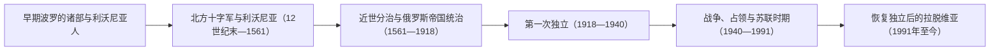

# 拉脱维亚历史

## 概括

拉脱维亚位于东波罗的海中部，其历史空间由维泽梅、库尔兰、瑟米加利亚和拉特加尔等地区逐渐汇合而成。早期波罗的诸部与芬兰语支的利沃尼亚人共同生活；中世纪以后，利沃尼亚、德意志城市和贵族、波兰-立陶宛、瑞典与俄罗斯帝国先后塑造这里，直到20世纪形成并恢复现代拉脱维亚共和国。

## 历史演进图

## 分期导航

| 顺序 | 阶段 | 时间 | 相关入口 | 历史走向 |
|---:|---|---|---|---|
| 1 | 早期波罗的诸部与利沃尼亚人 | 12世纪末以前 | [早期波罗的人](/%E4%BA%BA%E6%96%87%E7%A7%91%E5%AD%A6/%E5%8E%86%E5%8F%B2/%E6%AC%A7%E6%B4%B2/%E6%B3%A2%E7%BD%97%E7%9A%84%E6%B5%B7/%E6%97%A9%E6%9C%9F%E6%B3%A2%E7%BD%97%E7%9A%84%E4%BA%BA.md) | 拉特加尔、瑟米加利亚、瑟罗尼亚、库尔兰等波罗的诸部与芬兰语支利沃尼亚人共同构成早期人群。 |
| 2 | 北方十字军与利沃尼亚 | 12世纪末—1561年 | [中世纪波罗的海十字军](/%E4%BA%BA%E6%96%87%E7%A7%91%E5%AD%A6/%E5%8E%86%E5%8F%B2/%E6%AC%A7%E6%B4%B2/%E6%B3%A2%E7%BD%97%E7%9A%84%E6%B5%B7/%E4%B8%AD%E4%B8%96%E7%BA%AA%E6%B3%A2%E7%BD%97%E7%9A%84%E6%B5%B7%E5%8D%81%E5%AD%97%E5%86%9B.md)、[利沃尼亚](/%E4%BA%BA%E6%96%87%E7%A7%91%E5%AD%A6/%E5%8E%86%E5%8F%B2/%E6%AC%A7%E6%B4%B2/%E6%B3%A2%E7%BD%97%E7%9A%84%E6%B5%B7/%E5%88%A9%E6%B2%83%E5%B0%BC%E4%BA%9A.md) | 里加、主教区、骑士团和汉萨城市形成中世纪利沃尼亚秩序。 |
| 3 | 近世分治与俄罗斯帝国统治 | 1561—1918年 | [瑞典统治下的东波罗的海](/%E4%BA%BA%E6%96%87%E7%A7%91%E5%AD%A6/%E5%8E%86%E5%8F%B2/%E6%AC%A7%E6%B4%B2/%E6%B3%A2%E7%BD%97%E7%9A%84%E6%B5%B7/%E7%91%9E%E5%85%B8%E7%BB%9F%E6%B2%BB%E4%B8%8B%E7%9A%84%E4%B8%9C%E6%B3%A2%E7%BD%97%E7%9A%84%E6%B5%B7.md)、[俄罗斯帝国统治下的波罗的海](/%E4%BA%BA%E6%96%87%E7%A7%91%E5%AD%A6/%E5%8E%86%E5%8F%B2/%E6%AC%A7%E6%B4%B2/%E6%B3%A2%E7%BD%97%E7%9A%84%E6%B5%B7/%E4%BF%84%E7%BD%97%E6%96%AF%E5%B8%9D%E5%9B%BD%E7%BB%9F%E6%B2%BB%E4%B8%8B%E7%9A%84%E6%B3%A2%E7%BD%97%E7%9A%84%E6%B5%B7.md) | 波兰-立陶宛、瑞典、库尔兰公国和俄罗斯先后或并行控制今拉脱维亚各地。 |
| 4 | 第一次独立 | 1918—1940年 | [波罗的三国独立](/%E4%BA%BA%E6%96%87%E7%A7%91%E5%AD%A6/%E5%8E%86%E5%8F%B2/%E6%AC%A7%E6%B4%B2/%E6%B3%A2%E7%BD%97%E7%9A%84%E6%B5%B7/%E6%B3%A2%E7%BD%97%E7%9A%84%E4%B8%89%E5%9B%BD%E7%8B%AC%E7%AB%8B.md) | 独立战争和国家建设把不同历史地区整合为拉脱维亚共和国。 |
| 5 | 战争、占领与苏联时期 | 1940—1991年 | [苏联统治下的波罗的海](/%E4%BA%BA%E6%96%87%E7%A7%91%E5%AD%A6/%E5%8E%86%E5%8F%B2/%E6%AC%A7%E6%B4%B2/%E6%B3%A2%E7%BD%97%E7%9A%84%E6%B5%B7/%E8%8B%8F%E8%81%94%E7%BB%9F%E6%B2%BB%E4%B8%8B%E7%9A%84%E6%B3%A2%E7%BD%97%E7%9A%84%E6%B5%B7.md) | 苏联吞并、德国占领、苏联重新控制和人口经济改造重塑社会。 |
| 6 | 恢复独立后的拉脱维亚 | 1991年至今 | 本页下文 | 恢复共和国法理和制度，并融入欧洲与跨大西洋体系。 |

## 阶段说明

### 早期波罗的诸部与利沃尼亚人

今拉脱维亚境内早期存在拉特加尔人、瑟米加利亚人、瑟罗尼亚人、库尔兰人等波罗的语族相关人群，沿里加湾还分布着属于芬兰语支的利沃尼亚人。道加瓦河把内陆罗斯、东波罗的海港口和斯堪的纳维亚网络连接起来，使当地很早便处于贸易、贡赋和军事竞争的交汇地带。

### 北方十字军与利沃尼亚

里加于1201年成为传教和商业中心。随后主教区、宝剑骑士团及其并入条顿骑士团后的利沃尼亚分支，与城市和地方贵族共同构成旧利沃尼亚。征服和基督教化改变当地政治结构，德意志贵族和市民在城市、庄园及教会中长期居于优势；里加等港口则融入汉萨贸易。这个利沃尼亚空间同时覆盖今拉脱维亚和爱沙尼亚，不能等同于现代拉脱维亚。

### 近世分治与俄罗斯帝国统治

1561年旧利沃尼亚瓦解后，今拉脱维亚各地走向分治：维泽梅和拉特加尔等地先后受波兰-立陶宛与瑞典影响，库尔兰和瑟米加利亚公国作为联邦附属政体延续至1795年。瑞典在17世纪控制里加和北部利沃尼亚；俄罗斯在大北方战争后取得这些地区，又分别在1772年和1795年兼并拉特加尔与库尔兰。俄罗斯帝国时期，波罗的德意志贵族仍具影响，农奴制废除、工业化、城市发展和19世纪民族觉醒共同推动现代拉脱维亚认同。

### 第一次独立

拉脱维亚于1918年11月18日宣布独立，随后在多方武装交错的独立战争中建立对领土的控制。共和国通过土地改革削弱大庄园，建立议会政治，并整合维泽梅、库尔兰、瑟米加利亚和拉特加尔等历史地区。1934年卡尔利斯·乌尔马尼斯建立威权统治，但共和国的法理延续成为1991年恢复独立的重要依据。

### 战争、占领与苏联时期

1940年苏联吞并拉脱维亚；1941—1944年德国占领期间发生大屠杀和战争动员，随后苏联重新控制。战后出现政治镇压、人口遣送、农业集体化、工业化和俄语人口迁入。1980年代末，歌唱革命、波罗的海之路以及独立运动把历史记忆与群众政治连接起来，推动共和国复国。

### 恢复独立后的拉脱维亚

拉脱维亚在1990年启动恢复独立进程，1991年恢复实际主权。国家重建1922年宪法框架，在经济转型、拉脱维亚语地位、公民身份和族群整合之间持续调整，并于2004年加入北约和欧洲联盟。现代国家仍需在共同的波罗的海地区经验与本国不同历史区域传统之间维持平衡。

## 关键辨析

- **拉脱维亚不等于利沃尼亚**：利沃尼亚覆盖今拉脱维亚和爱沙尼亚；现代拉脱维亚还包括历史上的库尔兰、瑟米加利亚与拉特加尔。
- **利沃尼亚人不等于拉脱维亚人**：利沃尼亚人属于芬兰语支，现代拉脱维亚主体语言则属于波罗的语支。
- **近世不是单线换代**：今拉脱维亚不同地区长期由波兰-立陶宛、瑞典、库尔兰公国和俄罗斯分别控制。
- **1991年是恢复共和国**：国家连续性叙事把1940年的苏联吞并视为中断，而非旧国家合法终结。

## 上级

- [波罗的海历史](/%E4%BA%BA%E6%96%87%E7%A7%91%E5%AD%A6/%E5%8E%86%E5%8F%B2/%E6%AC%A7%E6%B4%B2/%E6%B3%A2%E7%BD%97%E7%9A%84%E6%B5%B7/README.md)
