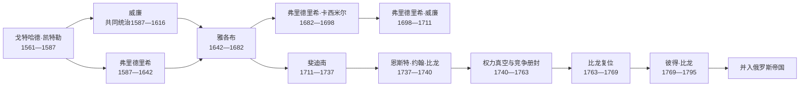

# 库尔兰与瑟米加利亚公爵世系表

## 时间

1561/1562—1795年

## 概括

库尔兰与瑟米加利亚公爵不是现代拉脱维亚的全国君主，而是波兰—立陶宛宗主体系中的世袭或经选任册封的附庸统治者。公国内部还受德意志贵族议会和最高顾问限制。表中列出凯特勒、比龙两家全部公爵，并把共同统治、废黜、流亡统治、短暂选举、竞争册封和复位分别标明；没有把权力真空合并成“后期诸公”。

## 公爵完整序列

“顺序”按取得公爵地位排列；共同统治者和争议公爵保留独立行。实际掌权与法定名义不一致时在备注说明。

| 顺序 | 公爵 | 王朝 / 家族 | 在位时间 | 生卒 | 与前任关系 | 关键事件与统治性质 |
| --- | --- | --- | --- | --- | --- | --- |
| 1 | **戈特哈德·凯特勒** | 凯特勒 | 1561-11-28 / 1562-03-05—1587-05-17 | 约1517—1587 | 首任；原利沃尼亚骑士团末任团长 | 与西吉斯蒙德二世·奥古斯特订立臣服安排，骑士团世俗化；建立公国行政与路德宗教会基础，并把继承分给两子。 |
| 2 | 弗里德里希·凯特勒 | 凯特勒 | 1587-05-17—1642-08-17；1596后主治瑟米加利亚，1616后单独统治全公国 | 1569—1642 | 戈特哈德长子 | 与弟共同继承；在贵族冲突中保住王朝，推动恢复侄子雅各布继承权；无嗣。 |
| 2A | 威廉·凯特勒 | 凯特勒 | 1587-05-17—1616年被废；1596后主治库尔兰 | 1574—1640 | 戈特哈德次子、弗里德里希之弟 | 试图强化公爵权，与贵族激烈冲突；1615年反对派贵族被杀后遭宗主君主废黜并流亡。其子雅各布后来恢复继承权。 |
| 3 | **雅各布·凯特勒** | 凯特勒 | 1642-08-17—1682-01-01 | 1610—1682 | 威廉之子、弗里德里希之侄 | 发展工场、造船、贸易及冈比亚、多巴哥短暂据点；1658年被瑞典军俘虏，1660年复位，战后实力未完全恢复。 |
| 4 | 弗里德里希·卡西米尔·凯特勒 | 凯特勒 | 1682-01-01—1698-01-22 | 1650—1698 | 雅各布之子 | 维持宫廷和海外设想，但财政、债务与贵族制约加重；公国对外自主性下降。 |
| 5 | 弗里德里希·威廉·凯特勒 | 凯特勒 | 1698-01-22—1711-01-21 | 1692—1711 | 弗里德里希·卡西米尔之子 | 幼年继位，由监护和等级机关治理；大北方战争期间流亡，1710年与俄国公主安娜·伊凡诺芙娜结婚，返国途中去世，无嗣。 |
| 6 | 斐迪南·凯特勒 | 凯特勒 | 1711-01-21—1737-05-04 | 1655—1737 | 雅各布幼子、弗里德里希·威廉叔祖父 | 法理继位但长期居但泽，地方贵族拒其直接统治；俄国驻军、安娜及最高顾问掌握更多实际权力。晚婚无存活继承人，凯特勒男系绝嗣。 |
| 7 | **恩斯特·约翰·比龙** | 比龙 | 1737-06—1740-11；后于1763-04复位—1769-11-25退位 | 1690—1772 | 非凯特勒亲系；由等级选出并获宗主册封，依靠俄国女皇安娜 | 首次在位主要居俄国并营建伦达莱、米塔乌宫；安娜死后在俄国政变中被捕流放，公爵权中断。叶卡捷琳娜二世支持其复位，后让位于子。 |
| 争议 | 路德维希·恩斯特·不伦瑞克-吕讷堡 | 韦尔夫 | 1741-06-27—1741-12-06，仅获短暂选举 / 宣称 | 1718—1788 | 无直接血缘；在比龙被逐后由部分力量推举 | 未获各方稳定承认，也未建立持续地方统治；应列为短暂争议公爵，而不能当成完整稳定一朝。 |
| 8 | 卡尔·克里斯蒂安·萨克森 | 韦廷 | 1758-11-10—1763-04 | 1733—1796 | 波兰国王奥古斯特三世之子 | 在俄国与宗主王支持下受封，但合法性受比龙派和部分等级质疑；叶卡捷琳娜二世改变态度后被俄军迫离。 |
| 7（复位） | **恩斯特·约翰·比龙** | 比龙 | 1763-04—1769-11-25 | 1690—1772 | 由俄国支持取代卡尔，恢复1737年公爵资格 | 复位显示俄国已能决定公国继承；年老后把统治权交给儿子彼得。 |
| 9 | **彼得·比龙** | 比龙 | 1769-11-25—1795-03-28 | 1724—1800 | 恩斯特·约翰之子 | 与贵族反对派冲突，受俄国压力日增；1795年地方议会臣俄后在圣彼得堡退位，获财产补偿，公国灭亡。 |

## 摄政、实际权力与空位

| 时段 | 人物 / 机构 | 法定身份 | 实际作用 |
| --- | --- | --- | --- |
| 1698—约1710 | 公爵监护委员会、最高顾问与贵族等级 | 未成年弗里德里希·威廉的监护和地方行政 | 大北方战争、瑞典与俄国占领使正常统治破裂。 |
| 1711—1730 | 安娜·伊凡诺芙娜 | 弗里德里希·威廉遗孀，非公爵；1730年后为俄国女皇 | 居米塔乌并依靠俄国资源影响任官和政治，是斐迪南法理在位时的重要实际权力中心。 |
| 1711—1737 | 最高顾问、地方议会及俄罗斯驻地代表 | 公爵之下的等级机关与外国使节 | 斐迪南长期不在境内，地方治理与俄国干预结合。 |
| 1740—1758 | 最高顾问、地方议会、波兰—立陶宛宗主机关与俄国代表 | 比龙被捕后的空位治理 | 没有获得普遍承认并持续统治的公爵；路德维希·恩斯特仅短暂宣称。 |
| 1758—1763 | 卡尔公爵与俄国军事外交力量 | 宗主册封公爵，但受外部支持变化制约 | 俄国改变态度后其地位迅速崩溃。 |
| 1763—1795 | 比龙父子、贵族等级与俄国代表 | 正式公爵和公国机关 | 形式自治仍存，外交与继承实受俄罗斯支配。 |

## 王朝继承关系

### 凯特勒家族

戈特哈德把公国留给弗里德里希和威廉共同统治。威廉被废后，按照严格处罚可能连带失去其子雅各布的继承权；弗里德里希无子，若雅各布不能继位，宗主国可能把公国改设普通省份。弗里德里希、地方等级和外部关系最终恢复雅各布资格，形成“叔传侄”。

雅各布的长支经弗里德里希·卡西米尔传至弗里德里希·威廉，后者无嗣。斐迪南作为雅各布尚存幼子继位，也无后。1737年凯特勒男系终结，因此不是普通父子继承断裂，而是宗主国、地方等级和俄国共同争夺新公爵选择权。

### 比龙家族与竞争者

比龙不是凯特勒直系继承人，其地位源自等级选举、波兰—立陶宛册封和俄罗斯宫廷支持。1740年俄国政变使他失势，继承程序长期悬置。路德维希·恩斯特的短暂选举缺少稳定承认；卡尔·克里斯蒂安依靠奥古斯特三世与俄国一度支持。1763年叶卡捷琳娜二世让比龙复位，证明俄国已成为决定性仲裁者。比龙1769年让位给彼得是公国内最后一次父子继承。

## 公爵权与贵族权

公爵并非绝对君主。1617年后形成的治理安排确认贵族土地、司法和议会地位，最高顾问由少数大贵族掌握。公爵需要等级同意征税和动员，双方围绕王室庄园、任官、法院和对外政策长期冲突。

| 权力 | 公爵 | 贵族等级 / 最高顾问 | 宗主君主与外部大国 |
| --- | --- | --- | --- |
| 继承 | 世袭原则下提出继承人 | 接受、反对或参与选举 | 波兰—立陶宛君主册封；18世纪俄国实际施压。 |
| 财政 | 王室庄园、关税、工场 | 控制本身庄园并限制普遍税收 | 战争、驻军与贷款改变财政空间。 |
| 军事 | 小规模卫队、雇佣军与船队 | 不愿建立可能武装农民的大军 | 联邦名义保护，瑞典、俄国可直接占领。 |
| 司法行政 | 公爵法院与官员 | 等级法院和最高顾问 | 宗主机关受理争议，俄国使节后期直接干预。 |
| 外交 | 雅各布时期维持广泛使节和贸易 | 担心冒险损害特权 | 附庸身份限制条约，邻国力量决定中立能否维持。 |

## 关键统治者

- **戈特哈德**把军事修会领地改造成世俗公国，奠定王朝和附庸关系。
- **弗里德里希**在无嗣、弟被废和贵族强势的局面下保存公国与侄子的继承资格。
- **雅各布**集中经营资源，把小公国推入欧洲贸易和造船网络；其成就高度依赖个人统筹，也在战争中迅速受损。
- **斐迪南**长期缺席，象征凯特勒晚期法定公爵与实际治理分离。
- **恩斯特·约翰·比龙**的被逐和复位把俄国宫廷变化直接传导到公国。
- **彼得·比龙**在宗主联邦崩溃和俄国支配下退位，是末代公爵。

## 灭亡原因

### 结构因素

- 公爵与贵族分享权力，难以形成可靠财政与军队；
- 附庸合法性依赖日益衰弱的波兰—立陶宛联邦；
- 凯特勒绝嗣后继承不再有稳定世袭规则；
- 公国处于瑞典、俄罗斯、普鲁士和联邦之间，缺少战略纵深；
- 18世纪俄罗斯驻军、使节和宫廷支持取代宗主国成为真正仲裁机制。

### 外部压力

联邦三次瓜分摧毁公国所依附的国际法框架。俄罗斯已控制北部利沃尼亚和东部拉特加尔，能够从多面施压；普鲁士、奥地利也接受瓜分体系，公国无可依赖的外援。

### 直接触发

1794年科希丘什科起义使贵族担心社会革命与战争。1795年3月18日地方议会宣布臣服俄罗斯，3月28日彼得签署退位，4月叶卡捷琳娜二世宣布设省。地方等级以保留财产特权换取转附俄罗斯，公爵世系至此终止。

## 演变关系

- 过程页：[近世分治与库尔兰公国](/%E4%BA%BA%E6%96%87%E7%A7%91%E5%AD%A6/%E5%8E%86%E5%8F%B2/%E6%AC%A7%E6%B4%B2/%E6%B3%A2%E7%BD%97%E7%9A%84%E6%B5%B7/%E6%8B%89%E8%84%B1%E7%BB%B4%E4%BA%9A/%E8%BF%91%E4%B8%96%E5%88%86%E6%B2%BB%E4%B8%8E%E5%BA%93%E5%B0%94%E5%85%B0%E5%85%AC%E5%9B%BD.md)
- 前身：[利沃尼亚](/%E4%BA%BA%E6%96%87%E7%A7%91%E5%AD%A6/%E5%8E%86%E5%8F%B2/%E6%AC%A7%E6%B4%B2/%E6%B3%A2%E7%BD%97%E7%9A%84%E6%B5%B7/%E5%88%A9%E6%B2%83%E5%B0%BC%E4%BA%9A.md)
- 后继：[俄罗斯帝国统治与民族觉醒](/%E4%BA%BA%E6%96%87%E7%A7%91%E5%AD%A6/%E5%8E%86%E5%8F%B2/%E6%AC%A7%E6%B4%B2/%E6%B3%A2%E7%BD%97%E7%9A%84%E6%B5%B7/%E6%8B%89%E8%84%B1%E7%BB%B4%E4%BA%9A/%E4%BF%84%E7%BD%97%E6%96%AF%E5%B8%9D%E5%9B%BD%E7%BB%9F%E6%B2%BB%E4%B8%8E%E6%B0%91%E6%97%8F%E8%A7%89%E9%86%92.md)
- 返回：[拉脱维亚历史](/%E4%BA%BA%E6%96%87%E7%A7%91%E5%AD%A6/%E5%8E%86%E5%8F%B2/%E6%AC%A7%E6%B4%B2/%E6%B3%A2%E7%BD%97%E7%9A%84%E6%B5%B7/%E6%8B%89%E8%84%B1%E7%BB%B4%E4%BA%9A/README.md)
