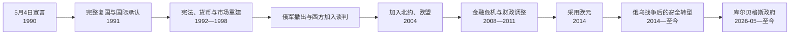

# 恢复独立后的拉脱维亚

## 时间

1990年5月4日至今；完整实际独立自1991年8月21日起（核验截止：2026-07-14）

## 概括

拉脱维亚把1990—1991年的变化界定为恢复1918年共和国，而不是退出苏联后新建国家。国家由此恢复1922年宪法、战前公民资格和外交连续性，同时必须在苏军仍驻境、计划经济崩溃、多语人口和产权重建中创造可运作制度。1990年代经历价格放开、私有化、银行危机、国籍与语言争论和俄军撤出；2004年加入北约、欧洲联盟，2014年采用欧元。金融危机、人口外流、区域差距和政治不信任长期存在。2014年后，尤其2022年俄罗斯全面入侵乌克兰以后，盟军部署、国防投入、义务国防役、能源脱俄和东部边境成为国家战略。截至2026-07-14，总统为埃德加斯·林克维奇斯，议会议长为戴加·米耶里尼亚，2026年5月28日就任的安德里斯·库尔贝格斯领导第43届内阁。

## 从过渡政府到完整独立

1990年5月4日宣言恢复共和国法律权威并设置过渡期，最高委员会主席阿纳托利斯·戈尔布诺夫斯承担国家元首职能，伊瓦尔斯·戈德马尼斯任政府首脑。政府开始建立本国警察、边防、外交和经济管理，却仍面对苏联军队、内务部特警、全联盟企业和共产党保守派。

1991年8月21日宪法性法律结束过渡。承认迅速展开，拉脱维亚于9月17日加入联合国。苏联解体消除了对立中央，但以下主权问题仍待解决：

- 俄罗斯军队和大量军事设施继续驻扎；
- 卢布区、全联盟供应链与能源网络尚未分离；
- 1922年宪法仅部分恢复，需处理过渡法律；
- 居民身份、公民资格和语言制度尚无共识；
- 国有企业、土地和战前财产的权利关系必须重建。

## 俄军撤出与安全主权

1994年8月31日俄罗斯主要部队撤出，斯克伦达预警雷达按协议暂时运作，1998年停止。撤军依赖拉俄谈判和美国、北欧、欧洲机构的外交参与，也涉及退役军人住房、社会保障和军事财产。

拉脱维亚不承认苏联时期划入俄罗斯的阿布雷内恢复为实际领土。2007年边界条约确认现状，国内围绕宪法连续性与现实边界曾有激烈争论。主权巩固因此既包含军队撤离，也包含以条约终结未决边界。

## 宪政重建

### 1922年宪法恢复

1993年第五届议会经战前公民及其后代组成的选民体系选出，7月6日全面恢复1922年宪法，7月8日贡蒂斯·乌尔马尼斯宣誓为总统。宪法建立议会主导的共和国：

| 角色 | 产生方式 | 主要权力 | 实际政治地位 |
| --- | --- | --- | --- |
| 议会 | 100席比例代表普选 | 立法、预算、信任内阁、选总统、批准条约 | 政党联盟和委员会是日常政治核心。 |
| 总统 | 议会选举，四年任期，最多连续两届 | 提名总理、公布或退回法律、外交代表、国防与危机职能，可倡议解散议会 | 通常不掌日常行政，但在组阁、外交、立法否决和政治危机中有实质影响。 |
| 总理与内阁 | 总统提名总理、议会信任政府 | 行政、预算、欧盟事务、国防和社会政策 | 对议会负责，联盟崩解可导致整届内阁辞职。 |
| 宪法法院 | 依法组成 | 审查法律和国际义务是否合宪 | 在语言、财产、社会权利和欧盟法协调中重要。 |

完整国家元首和政府首脑序列见[拉脱维亚现代国家元首与政府首脑表](/%E4%BA%BA%E6%96%87%E7%A7%91%E5%AD%A6/%E5%8E%86%E5%8F%B2/%E6%AC%A7%E6%B4%B2/%E6%B3%A2%E7%BD%97%E7%9A%84%E6%B5%B7/%E6%8B%89%E8%84%B1%E7%BB%B4%E4%BA%9A/%E6%8B%89%E8%84%B1%E7%BB%B4%E4%BA%9A%E7%8E%B0%E4%BB%A3%E5%9B%BD%E5%AE%B6%E5%85%83%E9%A6%96%E4%B8%8E%E6%94%BF%E5%BA%9C%E9%A6%96%E8%84%91%E8%A1%A8.md)。

### 公民资格与“非公民”

国家恢复战前公民及其后代资格，没有自动把全部苏联时期定居者纳入公民。大量长期居民因此获得“拉脱维亚非公民”特殊法律身份，而非一般无国籍人；其旅行、社会权利受保护，却不能参加全国选举和部分公务。

1990年代中期建立自然化制度，后来降低部分门槛，非公民人数持续下降。政策支持者强调国家连续性、占领后人口改变和拉脱维亚语保护；批评者强调长期居民政治排除和社会分隔。理解这一问题必须同时保留历史胁迫与个人生活史，不能把所有俄语居民视为占领机关成员。

## 市场经济转型

### 货币与私有化

拉脱维亚先发行过渡卢布，1993年恢复拉特。财政、中央银行和税制从苏联体系独立。价格放开和贸易转向造成产出骤降、通胀、失业和储蓄损失；同时出现私营商业、外资和服务业。

土地、住房和企业通过返还、凭证及出售等方式私有化。战前所有者权利与现住户、雇员利益冲突；监管薄弱使内幕交易、资产集中和影子经济扩张。1995年银行危机暴露金融监管和政治关系风险，俄罗斯1998年金融危机又冲击出口与银行。

### 增长、移民与地区差距

2000年代加入欧洲市场前后，信贷、房地产、运输、木材和服务业快速增长。里加及周边吸引投资，拉特加尔和农村人口减少更严重。加入欧盟后自由流动使许多人前往英国、爱尔兰、德国和北欧工作；汇款支持家庭，但人口减少、老龄化和专业人才流失加深。

## 加入欧洲与跨大西洋制度

| 时间 | 进程 | 历史意义 |
| --- | --- | --- |
| 1995 | 申请加入欧洲联盟 | 法律、市场和行政改革获得明确方向。 |
| 1998—2002 | 加入谈判 | 改革竞争、农业、司法、边境和环境制度。 |
| 2004-03 | 加入北约 | 集体防御取代战间期中立和有限地区协约。 |
| 2004-05 | 加入欧洲联盟 | 进入单一市场、共同法律与结构基金体系。 |
| 2007 | 加入申根区 | 人员跨境流动深化，外部边界责任增加。 |
| 2014 | 采用欧元 | 货币政策进入欧元体系，减少汇率风险。 |
| 2016 | 加入经合组织 | 公司治理、税收和公共管理规则进一步对接。 |

加入并非外部强加的单向过程：历届政府主动把西方制度视为国家安全和现代化保障，社会通过选举及2003年欧盟公投授权；具体改革成本和利益分配仍有争议。

## 2008年金融危机

高速信贷和房地产繁荣累积外部债务与经常账户失衡。2008年全球危机使银行、财政和就业骤然恶化，政府接管帕雷克斯银行并寻求国际援助。伊瓦尔斯·戈德马尼斯政府辞职，瓦尔迪斯·东布罗夫斯基斯自2009年领导紧缩和“内部贬值”，削减支出、工资并提高税收，以维持拉特对欧元固定汇率。

政策恢复财政和外部平衡，为2014年采用欧元创造条件，却造成失业、移民和公共服务压力。将其只写作“成功范例”或“外部强迫”都不完整：政府有明确维持汇率和西向信誉的选择，社会成本也真实且分配不均。

## 政党、联盟与政治问责

恢复独立后的政党经常重组，内阁更替较多，但行政和外交主线保持连续。主要裂痕包括：

- 市场自由主义、社会保障和地区发展；
- 拉脱维亚语 / 俄语选民的历史与身份政治；
- 反腐改革与被称为“寡头”的商业政治网络；
- 城乡、里加与地区利益；
- 对欧盟整合速度和价值议题的不同立场。

2011年总统瓦尔迪斯·扎特莱尔斯因议会拒绝允许搜查一名议员而启动解散程序，公投支持解散第十届议会。这显示总统虽非行政首脑，仍可在宪政危机中诉诸选民。反腐机关、媒体和法院取得一些成果，政党融资、公共采购和地方网络仍是持续问题。

## 语言、教育与社会整合

1989年后拉脱维亚语恢复唯一国家语言地位，政府逐步提高公立学校拉脱维亚语授课比例，并扩大公务和媒体语言要求。2012年公投否决把俄语设为第二官方语言，显示国家语言具有多数支持，也暴露语言社群政治分隔。

政策目标是让所有居民共享国家公共语言，争议集中在过渡速度、少数民族教育、教师资源和私人生活权。拉特加尔语、利沃尼亚语和其他历史语言又提醒人们：“保护拉脱维亚语”内部仍有多样性。

## 2014年后的安全转型

俄罗斯吞并克里米亚和在乌克兰东部发动战争后，拉脱维亚提高国防预算、强化国民卫队、网络安全和战略传播。2017年加拿大领导的北约增强前沿存在战斗群进驻，后来向旅级框架扩展。盟军轮换与本国部队共同构成威慑。

2022年俄罗斯全面入侵乌克兰后，拉脱维亚：

- 向乌克兰提供军事、人道和政治支持；
- 加快减少俄罗斯能源与贸易依赖；
- 拆除部分苏联占领象征，引发记忆政治争论；
- 加强俄罗斯、白俄罗斯边境与反混合威胁措施；
- 2023年恢复国家国防役，逐步扩大兵员；
- 提高国防支出并建设塞利亚训练场等基础设施；
- 改革俄语教育和公共媒体环境。

安全措施必须接受法治、比例原则和少数权利审查；反对俄罗斯国家侵略不能转化为对所有俄语居民的集体怀疑。

## 能源与基础设施脱俄

克莱佩达液化天然气、波兰—立陶宛天然气管道、波罗的海电网互联和区域市场共同降低俄罗斯垄断。2025年2月，拉脱维亚与爱沙尼亚、立陶宛退出俄白同步电网并接入欧洲大陆同步区，结束莫斯科对电网频率控制的结构依赖。

铁路波罗的海项目旨在以欧洲标准轨连接三国和波兰，具安全与市场意义，却面临成本、工期、治理和里加接入争议。基础设施西向不是一次加入组织即可完成，而是长期财政和执行任务。

## 2023—2026年领导层与政府更替

埃德加斯·林克维奇斯由议会选出，2023年7月8日宣誓成为总统。克里斯亚尼斯·卡林斯同年辞职后，埃维卡·西利尼亚于9月15日组阁。她在2026年5月14日辞职，政府依宪法继续履职到新内阁获信任。

总统邀请安德里斯·库尔贝格斯组阁。2026年5月28日议会以66票支持、25票反对批准第43届内阁，库尔贝格斯当日接任总理。新政府把安全、经济竞争力、司法与反腐、家庭和医疗、欧盟预算谈判列为计划；截至2026-07-14，这些仍是施政承诺，不能写成已经实现的结果。

| 职位 | 现任 | 就任 | 权力说明 |
| --- | --- | --- | --- |
| 总统 | 埃德加斯·林克维奇斯 | 2023-07-08 | 国家元首；提名总理、参与外交国防、可退回法律及启动解散程序。 |
| 议会议长 | 戴加·米耶里尼亚 | 2023-09-20 | 主持议会；总统缺位等法定情形下承担代理职责。 |
| 总理 | 安德里斯·库尔贝格斯 | 2026-05-28 | 领导第43届内阁，对议会负责。 |

## 当前的长期议题

| 议题 | 已有进展 | 未解决问题 |
| --- | --- | --- |
| 安全 | 北约驻军、国防役、预算增长和区域计划 | 人员、弹药、基础设施、社会韧性和长期财政。 |
| 人口 | 返乡政策、欧盟劳动流动和家庭支持 | 低生育、老龄化、外流及地区空心化。 |
| 语言整合 | 国家语言公共空间扩大 | 教育质量、俄语居民参与、非公民自然化。 |
| 经济 | 欧元、欧盟市场、数字与物流产业 | 生产率、能源成本、里加—地区差距和影子经济。 |
| 法治 | 宪法法院、反腐机关和欧盟监督 | 采购、政商关系、司法效率与地方治理。 |
| 历史记忆 | 国家连续性和占领罪行公开 | 大屠杀协作、军团记忆、苏维埃生活经验需多层叙述。 |
| 基础设施 | 电网同步、北约设施、区域互联 | 铁路波罗的海成本和工期、东部边境发展。 |

## 重要事件

| 时间 | 事件 | 结果与长期影响 |
| --- | --- | --- |
| 1990-05-04 | 恢复独立宣言 | 以1918年国家连续性启动过渡。 |
| 1991-08-21 | 完整实际独立恢复 | 结束苏联法权主张。 |
| 1991-09 | 加入联合国 | 国际承认制度化。 |
| 1992—1993 | 过渡货币、拉特与宪法恢复 | 货币和宪政主权重建。 |
| 1993 | 第五届议会、乌尔马尼斯就任总统 | 战前宪制常态化。 |
| 1994 | 俄军主体撤出 | 领土军事主权巩固。 |
| 1995 | 银行危机 | 暴露转型期监管和政商风险。 |
| 1998 | 斯克伦达雷达停止、俄罗斯金融危机 | 外军设施终结，经济转向压力加大。 |
| 2003 | 欧盟加入公投 | 社会授权欧洲整合。 |
| 2004 | 加入北约与欧盟 | 安全、法律和市场全面西向。 |
| 2008—2011 | 金融危机与紧缩 | 财政恢复伴随高失业和外流。 |
| 2011 | 解散议会公投 | 总统危机权力和反寡头议题凸显。 |
| 2012 | 语言公投 | 否决俄语第二官方语言。 |
| 2014 | 采用欧元、克里米亚危机 | 货币整合与安全政策同时转折。 |
| 2017 | 北约战斗群部署 | 盟军地面威慑常态化。 |
| 2022 | 俄罗斯全面入侵乌克兰 | 防务、能源、边境和记忆政策全面加速。 |
| 2023 | 恢复国家国防役 | 从全志愿模式转向混合兵员。 |
| 2025-02 | 接入欧洲大陆同步电网 | 结束俄白电力同步依赖。 |
| 2026-05-28 | 库尔贝格斯内阁获信任 | 第43届政府上任。 |

## 演变关系

- 前一阶段：[苏德占领与苏维埃时期](/%E4%BA%BA%E6%96%87%E7%A7%91%E5%AD%A6/%E5%8E%86%E5%8F%B2/%E6%AC%A7%E6%B4%B2/%E6%B3%A2%E7%BD%97%E7%9A%84%E6%B5%B7/%E6%8B%89%E8%84%B1%E7%BB%B4%E4%BA%9A/%E8%8B%8F%E5%BE%B7%E5%8D%A0%E9%A2%86%E4%B8%8E%E8%8B%8F%E7%BB%B4%E5%9F%83%E6%97%B6%E6%9C%9F.md)
- 领导人专表：[拉脱维亚现代国家元首与政府首脑表](/%E4%BA%BA%E6%96%87%E7%A7%91%E5%AD%A6/%E5%8E%86%E5%8F%B2/%E6%AC%A7%E6%B4%B2/%E6%B3%A2%E7%BD%97%E7%9A%84%E6%B5%B7/%E6%8B%89%E8%84%B1%E7%BB%B4%E4%BA%9A/%E6%8B%89%E8%84%B1%E7%BB%B4%E4%BA%9A%E7%8E%B0%E4%BB%A3%E5%9B%BD%E5%AE%B6%E5%85%83%E9%A6%96%E4%B8%8E%E6%94%BF%E5%BA%9C%E9%A6%96%E8%84%91%E8%A1%A8.md)
- 区域第一次独立比较：[波罗的三国独立](/%E4%BA%BA%E6%96%87%E7%A7%91%E5%AD%A6/%E5%8E%86%E5%8F%B2/%E6%AC%A7%E6%B4%B2/%E6%B3%A2%E7%BD%97%E7%9A%84%E6%B5%B7/%E6%B3%A2%E7%BD%97%E7%9A%84%E4%B8%89%E5%9B%BD%E7%8B%AC%E7%AB%8B.md)
- 区域苏联时期比较：[苏联统治下的波罗的海](/%E4%BA%BA%E6%96%87%E7%A7%91%E5%AD%A6/%E5%8E%86%E5%8F%B2/%E6%AC%A7%E6%B4%B2/%E6%B3%A2%E7%BD%97%E7%9A%84%E6%B5%B7/%E8%8B%8F%E8%81%94%E7%BB%9F%E6%B2%BB%E4%B8%8B%E7%9A%84%E6%B3%A2%E7%BD%97%E7%9A%84%E6%B5%B7.md)
- 返回：[拉脱维亚历史](/%E4%BA%BA%E6%96%87%E7%A7%91%E5%AD%A6/%E5%8E%86%E5%8F%B2/%E6%AC%A7%E6%B4%B2/%E6%B3%A2%E7%BD%97%E7%9A%84%E6%B5%B7/%E6%8B%89%E8%84%B1%E7%BB%B4%E4%BA%9A/README.md)
