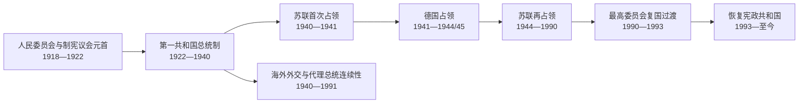

# 拉脱维亚现代国家元首与政府首脑表

## 时间

1918年至今（核验截止：2026-07-14）

## 概括

本表把1918—1940年共和国、独立战争中的竞争政府、1940—1991年苏联与德国占领机关、流亡法理连续性以及恢复独立后的共和国分层列出。占领时期同时存在苏维埃法定首长、共产党实际最高领导、德国殖民行政、本地从属机关、海外代理总统主张和获承认的外交服务，不能合并为一条“历任总统”。现代拉脱维亚是议会共和国：总统由议会选举，政府对议会负责；总统不是日常行政首脑。

## 1918—1940年共和国国家元首完整序列

1918—1922年尚未设独立总统职位，议会型临时机关主席履行元首职能。总统任期之间，议会议长依法短暂代理，表中不省略。

| 顺序 | 人物 | 职务与任期 | 产生与交接 | 关键事件 / 备注 |
| --- | --- | --- | --- | --- |
| 1 | **亚尼斯·恰克斯特** | 人民委员会主席、国家元首，1918-11-17—1920-05-01 | 建国政党协议选出；因外交活动未亲自主持11月18日宣告，由副主席古斯塔夫斯·泽姆加尔斯主持 | 维持临时议会合法性，支持乌尔马尼斯政府和国际承认。 |
| 1 | **亚尼斯·恰克斯特** | 制宪议会议长、国家元首，1920-05-01—1922-11-07；宪法过渡代理，1922-11-07—11-18 | 普选制宪议会选出；宪法生效后继续到正式总统宣誓 | 主持土地改革、1922年宪法和议会制度建立。 |
| 1 | **亚尼斯·恰克斯特** | 总统，1922-11-18—1925-11-03；第二任期1925-11-10—1927-03-14 | 议会选举并连任；第二届任内去世 | 首任正式总统，以调解党派和宪政惯例著称。 |
| — | 保尔斯·卡尔宁什 | 议会议长代理总统，1925-11-03—11-10 | 第一任届满与连任宣誓之间依法代理 | 任期空档，不算独立总统届次。 |
| — | 保尔斯·卡尔宁什 | 议会议长代理总统，1927-03-14—04-08 | 恰克斯特去世后代理到议会选出继任者 | 保持宪法连续。 |
| 2 | 古斯塔夫斯·泽姆加尔斯 | 总统，1927-04-08—1930-04-08 | 议会选出，任满不寻求连任 | 议会联盟政治和对外稳定期。 |
| — | 保尔斯·卡尔宁什 | 议会议长代理总统，1930-04-08—04-11 | 泽姆加尔斯届满至新总统宣誓 | 短暂法定代理。 |
| 3 | 阿尔贝茨·克维埃西斯 | 总统，1930-04-11—1936-04-11 | 议会选出并于1933年连任 | 1934年政变后留任，接受议会民主被威权体制取代。 |
| 4 | **卡尔利斯·乌尔马尼斯** | 总统并兼总理，1936-04-11—1940-07-21；自由行使国家权力实际止于1940-06-17 | 威权内阁立法安排其在克维埃西斯届满后兼行总统职权，无议会选举 | 领袖型威权统治；苏军占领后受控制，7月21日被迫交职并遭驱逐。 |
| 占领下 | 奥古斯茨·基兴施泰因斯 | 形式国家元首兼政府首脑，1940-07-21—08-25 | 在苏联占领和受控“人民议会”程序下接替 | 主持请求加入苏联；共和国不承认该主权转移合法。 |

## 1918—1940年共和国政府首脑完整序列

同一总理连续领导数届内阁时可合并一行，在任日期仍覆盖所有内阁；战争期的竞争政府另表，不混入共和国法定内阁编号。

| 顺序 | 总理 | 在任时间 | 交接与关键事件 |
| --- | --- | --- | --- |
| 1 | **卡尔利斯·乌尔马尼斯** | 1918-11-18—1921-06-18；其间连续领导四届临时内阁 | 首任政府；红军进攻时迁利耶帕亚，亲德政变后在船上维持合法性，1919年7月返回里加，完成战争和制宪过渡。 |
| 2 | **齐格弗里茨·安纳·梅耶罗维茨** | 1921-06-19—1923-01-26 | 首位长期外交部长转任总理；国际承认、联盟外交和财政建设。 |
| 3 | 亚尼斯·保乌卢克斯 | 1923-01-27—06-27 | 工程与非党派色彩内阁，因联盟支持不足辞职。 |
| 4 | 齐格弗里茨·安纳·梅耶罗维茨 | 1923-06-28—1924-01-26 | 第二次任职；党派重组后交权。 |
| 5 | 沃尔德马尔斯·扎穆埃尔斯 | 1924-01-27—12-18 | 民主中心政府；处理财政与外交。 |
| 6 | 胡戈·采尔明什 | 1924-12-19—1925-12-23 | 第一任期；农业与联盟政治。 |
| 7 | 卡尔利斯·乌尔马尼斯 | 1925-12-24—1926-05-06 | 第二次任总理；短期农民联盟政府。 |
| 8 | 阿图尔斯·阿尔贝林斯 | 1926-05-07—12-18 | 农业派内阁，选举后交权。 |
| 9 | 马尔格尔斯·斯库耶涅克斯 | 1926-12-19—1928-01-23 | 第一任期；社会民主与中左联盟。 |
| 10 | 彼得里斯·尤拉舍夫斯基斯 | 1928-01-24—11-30 | 民主中心短期内阁。 |
| 11 | 胡戈·采尔明什 | 1928-12-01—1931-03-26 | 第二任期；世界经济危机开始冲击出口农业。 |
| 12 | 卡尔利斯·乌尔马尼斯 | 1931-03-27—12-05 | 第三次任总理；危机管理与联盟不稳。 |
| 13 | 马尔格尔斯·斯库耶涅克斯 | 1931-12-06—1933-03-23 | 第二任期；经济调整与波罗的合作。 |
| 14 | 阿道夫斯·布洛德涅克斯 | 1933-03-24—1934-03-16 | 末期议会联盟政府。 |
| 15 | **卡尔利斯·乌尔马尼斯** | 1934-03-17—1940-06-17；1940-06-17后失去自由履职能力，形式至06-20 | 5月15日发动政变，此后以总理掌实际最高权；1936年兼总统。苏占后被迫接受新政府。 |
| 占领下 | 奥古斯茨·基兴施泰因斯 | 1940-06-20—08-25 | 由苏方认可、在占领下组阁；不属于自由产生的共和国政府。 |

## 1918—1920年竞争政府和并行权力

| 政权 / 机构 | 首脑 | 任期 | 实际控制与性质 |
| --- | --- | --- | --- |
| 拉脱维亚社会主义苏维埃共和国 | **彼得里斯·斯图奇卡**，人民委员会主席 | 1918-12-17—1920-01；机关退至苏俄后于1920年解散 | 依靠红军和布尔什维克，1919年初控制里加及大部领土；实施国有化、征粮和革命法庭。 |
| 博尔科夫斯基斯过渡内阁 | 奥斯卡斯·博尔科夫斯基斯，代理政府首脑 | 1919-04-26—05-10 | 波罗的德意志政变后的过渡执行机构，只获狭窄军政集团支持。 |
| 涅德拉政府 | **安德里耶夫斯·涅德拉**，总理 | 1919-05-10—06-27 | 依靠波罗的国防军和德国志愿军；采西斯失败后瓦解，未取代人民委员会承认的乌尔马尼斯政府。 |
| 乌尔马尼斯临时政府 | 卡尔利斯·乌尔马尼斯，总理 | 1918-11-18—1921-06-18 | 政变期间在利耶帕亚港“萨拉托夫”号船上运作，获协约国和人民委员会承认；1919年7月复归。 |

## 1940—1990年苏维埃法定国家机关首长

这些职务是占领和吞并后建立的苏维埃机关，不构成拉脱维亚共和国合法总统序列。主席团是名义集体国家元首，主席多承担签署、礼仪和常设议会职能。

| 顺序 | 主席团主席 | 任期 | 关键事件 / 备注 |
| --- | --- | --- | --- |
| 1 | 奥古斯茨·基兴施泰因斯 | 1940-08-25—1952-04-11 | 从占领政府首脑转任；德国占领时机关在苏联后方，1944年随苏军恢复。 |
| 2 | 卡尔利斯·奥佐林什 | 1952-04-11—1959-11-27 | 斯大林末期、去斯大林化和民族共产主义争论时期。 |
| 3 | 亚尼斯·卡尔恩贝尔津什 | 1959-11-27—1970-05-05 | 此前长期任共产党第一书记；转任礼仪法定首长。 |
| 4 | 维塔利斯·鲁贝尼斯 | 1970-05-05—1974-08-20 | 此前任政府首脑。 |
| 5 | 彼得里斯·斯特劳特马尼斯 | 1974-08-20—1985-06-22 | 勃列日涅夫后期至改革初期。 |
| 6 | 亚尼斯·瓦格里斯 | 1985-06-22—1988-10-06 | 后转任共产党第一书记。 |
| 7 | 阿纳托利斯·戈尔布诺夫斯 | 1988-10-06—1990-05-03 | 改革、人民阵线和相对竞争选举时期；1990年转任恢复共和国的最高委员会主席。 |

## 1940—1990年苏维埃政府首脑完整序列

| 顺序 | 政府首脑 | 在任时间 | 机构与备注 |
| --- | --- | --- | --- |
| 1 | **维利斯·拉齐斯** | 1940-08-25—1959-11-27 | 人民委员会主席，1946年后称部长会议主席；德国占领期机关在苏联后方。参与斯大林化、战后重建与集体化。 |
| 2 | 亚尼斯·佩伊韦 | 1959-11-27—1962-04-23 | 民族共产主义清洗后接任，强化中央路线。 |
| 3 | 维塔利斯·鲁贝尼斯 | 1962-04-23—1970-05-05 | 计划工业扩张；后任主席团主席。 |
| 4 | 尤里斯·鲁贝尼斯 | 1970-05-05—1988-10-06 | 长期管理计划经济、住房和工业体系。 |
| 5 | 维尔尼斯·埃德温斯·布雷西斯 | 1988-10-06—1990-05-07 | 末任苏维埃部长会议主席；主权运动和自由选举期间。 |
| 过渡 | **伊瓦尔斯·戈德马尼斯** | 1990-05-07—1993-08-03 | 最高委员会依5月4日宣言组建的恢复共和国政府；1991年前仍处双重权力，之后完成货币与市场转型。 |

## 1940—1991年共产党实际最高领导

| 顺序 | 第一书记 | 任期 | 实际权力与备注 |
| --- | --- | --- | --- |
| 1 | **亚尼斯·卡尔恩贝尔津什** | 1940—1959-11-25 | 在莫斯科支持下领导斯大林化、战后镇压和集体化；德国占领期在苏联后方。 |
| 2 | **阿尔维兹·佩尔谢** | 1959-11-25—1966-04-15 | 清洗民族共产主义者，加强俄化和全联盟工业政策；后调任苏共中央。 |
| 3 | 奥古斯茨·沃斯 | 1966-04-15—1984-04-14 | 长期勃列日涅夫干部体系，优先全联盟工业与中央服从。 |
| 4 | 博里斯·普戈 | 1984-04-14—1988-10-04 | 改革初期未能阻止群众运动；后赴莫斯科任职。 |
| 5 | 亚尼斯·瓦格里斯 | 1988-10-04—1990-04-07 | 在人民阵线兴起、党内分裂和选举转型中失去垄断。 |
| 6 | 阿尔弗雷兹·鲁比克斯 | 1990-04-07—1991-08 | 领导忠于苏联的共产党主流，反对5月4日复国；此后不控制民选政府，支持八月政变后党被停止活动。 |

“第一书记”并非法律上的共和国元首，却通过干部任命、党纪、宣传和安全体系掌实际最高权。1990年后鲁比克斯仍领导亲苏党组织，但国家行政实权转入戈尔布诺夫斯—戈德马尼斯体系，因此不能把他写成1990—1991年拉脱维亚国家领导人。

## 1941—1944年德国占领行政

| 层级 / 角色 | 人物 / 机构 | 任期 | 实际权力与责任 |
| --- | --- | --- | --- |
| 东方领地总督 | 欣里希·洛泽 | 1941—1944 | 管辖拉脱维亚、爱沙尼亚、立陶宛和白俄罗斯等总区；执行德国殖民、经济和种族政策。 |
| 拉脱维亚总区总专员 | **奥托-海因里希·德雷克斯勒** | 1941—1944 | 德国最高地方民政首脑，控制行政与经济；不是拉脱维亚总统或总理。 |
| 德国安全与警察体系 | 安全警察、党卫队、秩序警察及高级警察首脑 | 1941—1944/45 | 组织大屠杀、强制劳动、反游击与镇压，常具有独立于民政的强制权。 |
| 拉脱维亚地方自治总局 | **奥斯卡斯·丹克尔斯**任第一总局长 | 1942—1944为主 | 在德国命令下处理部分教育、内政和经济；无主权，不应列入共和国政府。 |
| 拉脱维亚中央委员会 | 康斯坦丁斯·恰克斯特任主席 | 1943—1945地下活动 | 民主复国抵抗组织；遭德方镇压，未形成领土政府。 |

## 1940—1991年共和国法理与海外连续性

### 代理总统主张

| 人物 | 依据与任期 | 作用与限制 |
| --- | --- | --- |
| **保尔斯·卡尔宁什** | 末届合法议会议长；拉脱维亚中央委员会1944-09-08宣言确认其代理总统，至1945-08-26去世 | 试图在德国撤退和苏联进军间恢复共和国、组织流亡政府；没有稳定领土和国际承认的完整内阁。 |
| **约瑟普斯·兰灿斯** | 末届议会副议长；中央委员会1947-04-26宣布其继承议长和代理总统权力，至1969-12-02去世 | 代表一种严格宪法连续性主张，获部分流亡组织支持；外交使团没有一致承认其对外发号施令权。 |
| 空缺 / 无共同继任 | 1945-08-26—1947-04-26及1969年以后 | 没有获得流亡政治和外交服务共同承认的代理总统；不能虚构连续个人序列。 |

### 外交与领事服务负责人

1940年5月，政府预先授予驻伦敦公使卡尔利斯·扎林什在失联时管理海外使团和国家资产的非常权力。外交服务是占领期持续、并获部分西方国家承认的共和国公共机关，但它不是在海外运作的完整行政内阁。

| 顺序 | 负责人 | 任期 | 权力来源与工作 |
| --- | --- | --- | --- |
| 1 | **卡尔利斯·扎林什** | 1940-06-17—1963-04-29 | 依据1940年5月非常授权领导海外使团、管理资产和任免；驻伦敦。 |
| 2 | 阿诺尔兹·斯佩克 | 1963-05-05—1970-10-01 | 由使团负责人协商选出并获美国接受；驻华盛顿，协调预算、领事和三国外交。 |
| 过渡 | 各使团负责人协调 | 1970-10-01—1971-09-17 | 斯佩克退休后到新负责人正式选出之间，代表机构继续工作，无单一正式负责人。 |
| 3 | **阿纳托尔斯·丁贝尔格斯** | 1971-09-17—1991-12-31 | 驻华盛顿代办，维持不承认政策和外交资产；复国后把使团纳入里加外交部。 |

## 1990年以来国家元首完整序列

| 顺序 | 国家元首 | 职务与任期 | 关键事件 / 备注 |
| --- | --- | --- | --- |
| 1 | **阿纳托利斯·戈尔布诺夫斯** | 最高委员会主席、国家元首，1990-05-04—1993-07-06；议会议长法定代理，1993-07-06—07-08 | 主持5月4日宣言、1991年街垒和8月复国；过渡到第五届议会。正式称号不是总统。 |
| 2 | **贡蒂斯·乌尔马尼斯** | 总统，1993-07-08—1999-07-08 | 两届；全面恢复总统机构、推进俄军撤出和欧盟北约方向。 |
| 3 | **瓦伊拉·维凯-弗赖贝加** | 总统，1999-07-08—2007-07-08 | 两届；加入北约、欧盟，积极塑造对外和历史记忆议程。 |
| 4 | 瓦尔迪斯·扎特莱尔斯 | 总统，2007-07-08—2011-07-08 | 金融危机时期；2011年启动议会解散程序，未获连任。 |
| 5 | 安德里斯·贝尔津什 | 总统，2011-07-08—2015-07-08 | 金融危机后复苏、欧元加入和克里米亚危机时期。 |
| 6 | 雷蒙兹·韦约尼斯 | 总统，2015-07-08—2019-07-08 | 北约前沿部署和政府更替时期。 |
| 7 | 埃吉尔斯·莱维茨 | 总统，2019-07-08—2023-07-08 | 疫情、宪法身份议题和俄罗斯全面侵乌时期。 |
| 8 | **埃德加斯·林克维奇斯** | 总统，2023-07-08至今 | 前长期外长；国防、乌克兰支持、组阁与法治议题。截至2026-07-14在任。 |

## 1990年以来政府首脑完整序列

| 顺序 | 总理 | 在任时间 | 关键事件 / 备注 |
| --- | --- | --- | --- |
| 1 | **伊瓦尔斯·戈德马尼斯** | 1990-05-07—1993-08-03 | 复国过渡；苏联封锁与街垒、价格自由化、货币独立和国家机关重建。 |
| 2 | 瓦尔迪斯·比尔卡夫斯 | 1993-08-03—1994-09-15 | 宪法恢复后首届议会政府；市场改革和西方加入路线。 |
| 3 | 马里斯·盖利斯 | 1994-09-15—1995-12-21 | 俄军撤出后治理；私有化和银行危机。 |
| 4 | **安德里斯·什凯莱** | 1995-12-21—1997-08-07 | 连续领导两届内阁；财政、私有化和政商关系争议。 |
| 5 | 贡塔尔斯·克拉斯茨 | 1997-08-07—1998-11-26 | 欧盟谈判准备、俄罗斯金融危机。 |
| 6 | 维利斯·克里什托潘斯 | 1998-11-26—1999-07-16 | 联盟分裂后短期政府。 |
| 7 | 安德里斯·什凯莱 | 1999-07-16—2000-05-05 | 第三次任职；与联盟伙伴冲突后辞职。 |
| 8 | 安德里斯·贝尔津什 | 2000-05-05—2002-11-07 | 推进欧盟、北约加入谈判；与同名后任总统不是同一履历阶段。 |
| 9 | 埃纳尔斯·雷普舍 | 2002-11-07—2004-03-09 | 反腐和行政改革；加入北约、欧盟前夕。 |
| 10 | 因杜利斯·埃姆西斯 | 2004-03-09—2004-12-02 | 首位绿党背景总理；少数政府预算失败后辞职。 |
| 11 | 艾加尔斯·卡尔维蒂斯 | 2004-12-02—2007-12-20 | 连续两届；高速信贷增长、通胀和抗议，危机风险累积。 |
| 12 | 伊瓦尔斯·戈德马尼斯 | 2007-12-20—2009-03-12 | 第二次任职；金融崩溃、银行救助和国际援助后辞职。 |
| 13 | **瓦尔迪斯·东布罗夫斯基斯** | 2009-03-12—2014-01-22 | 连续三届；紧缩与内部贬值、财政恢复；超市屋顶坍塌政治责任后辞职。 |
| 14 | 莱姆多塔·斯特劳尤马 | 2014-01-22—2016-02-11 | 首位女性总理；采用欧元、克里米亚后安全转向和欧盟轮值主席。 |
| 15 | 马里斯·库钦斯基斯 | 2016-02-11—2019-01-23 | 税制、医疗和北约前沿部署；选举后漫长组阁结束任期。 |
| 16 | **克里斯亚尼斯·卡林斯** | 2019-01-23—2023-09-15 | 连续两届；疫情、能源危机和俄全面侵乌后政策；联盟重组失败后辞职。 |
| 17 | **埃维卡·西利尼亚** | 2023-09-15—2026-05-28 | 联盟政府；任内继续安全、能源和社会政策，2026-05-14辞职并看守至交接。 |
| 18 | **安德里斯·库尔贝格斯** | 2026-05-28至今 | 第43届内阁获66票信任；截至2026-07-14仍在任，新政府计划尚不能视为既成成果。 |

## 恢复独立后的权力分工

| 机关 | 主要权力 | 关键制衡 |
| --- | --- | --- |
| 总统 | 议会选举；提名总理、公布或退回法律、代表国家、参与外交国防，可提出解散议会 | 内阁须获议会信任；解散倡议须经公投；法律否决可被议会复议。 |
| 议会 | 立法、预算、选总统、批准政府、监督和调查 | 宪法法院审查；选民可在特定程序下参与解散与公投。 |
| 总理与内阁 | 日常行政、预算、欧盟协调、国防和社会经济政策 | 对议会集体负责；联盟失去多数需重组或辞职。 |
| 议会议长 | 主持议会，维持议事和代表职能 | 总统缺位或出访等法定情形下代理部分职务，但不自动成为新一届总统。 |
| 宪法法院 | 审查法律、条约和机关行为合宪性 | 判决约束国家机关，不能自行制定政策。 |

## 连续性与争议说明

- 1940年7月21日前乌尔马尼斯形式上仍使用总统称号，但6月17日起已受占领控制；表中把法定称号和自由行权终点分开。
- 基兴施泰因斯既短暂任占领下政府首脑、形式国家元首，又成为苏维埃主席团主席；这些是三种不同角色，不应合并成一届共和国总统。
- 1919年斯图奇卡、博尔科夫斯基斯和涅德拉政府拥有不同程度领土与军队，却未取代人民委员会所承认的共和国法律连续性。
- 苏维埃主席团主席是法定礼仪首长，共产党第一书记才通常掌实际最高权；部长会议负责行政，三表不能混排。
- 德国占领下的总专员是殖民行政首脑，丹克尔斯总局是从属本地机构；两者都不是拉脱维亚共和国政府。
- 卡尔宁什、兰灿斯的代理总统主张与扎林什等外交服务领导并行，彼此授权和国际承认并不完全一致。外交服务的持续存在比“完整流亡政府”更准确。
- 1990—1993年戈尔布诺夫斯是最高委员会主席并履行国家元首职能，正式称号不是总统。
- 2026年西利尼亚辞职日与库尔贝格斯获信任、实际交接日不同；表以5月28日新内阁就职为任期分界。

## 演变关系

- 过程页：[第一次共和国、独立战争与威权转向](/%E4%BA%BA%E6%96%87%E7%A7%91%E5%AD%A6/%E5%8E%86%E5%8F%B2/%E6%AC%A7%E6%B4%B2/%E6%B3%A2%E7%BD%97%E7%9A%84%E6%B5%B7/%E6%8B%89%E8%84%B1%E7%BB%B4%E4%BA%9A/%E7%AC%AC%E4%B8%80%E6%AC%A1%E5%85%B1%E5%92%8C%E5%9B%BD%E3%80%81%E7%8B%AC%E7%AB%8B%E6%88%98%E4%BA%89%E4%B8%8E%E5%A8%81%E6%9D%83%E8%BD%AC%E5%90%91.md)
- 过程页：[苏德占领与苏维埃时期](/%E4%BA%BA%E6%96%87%E7%A7%91%E5%AD%A6/%E5%8E%86%E5%8F%B2/%E6%AC%A7%E6%B4%B2/%E6%B3%A2%E7%BD%97%E7%9A%84%E6%B5%B7/%E6%8B%89%E8%84%B1%E7%BB%B4%E4%BA%9A/%E8%8B%8F%E5%BE%B7%E5%8D%A0%E9%A2%86%E4%B8%8E%E8%8B%8F%E7%BB%B4%E5%9F%83%E6%97%B6%E6%9C%9F.md)
- 过程页：[恢复独立后的拉脱维亚](/%E4%BA%BA%E6%96%87%E7%A7%91%E5%AD%A6/%E5%8E%86%E5%8F%B2/%E6%AC%A7%E6%B4%B2/%E6%B3%A2%E7%BD%97%E7%9A%84%E6%B5%B7/%E6%8B%89%E8%84%B1%E7%BB%B4%E4%BA%9A/%E6%81%A2%E5%A4%8D%E7%8B%AC%E7%AB%8B%E5%90%8E%E7%9A%84%E6%8B%89%E8%84%B1%E7%BB%B4%E4%BA%9A.md)
- 返回：[拉脱维亚历史](/%E4%BA%BA%E6%96%87%E7%A7%91%E5%AD%A6/%E5%8E%86%E5%8F%B2/%E6%AC%A7%E6%B4%B2/%E6%B3%A2%E7%BD%97%E7%9A%84%E6%B5%B7/%E6%8B%89%E8%84%B1%E7%BB%B4%E4%BA%9A/README.md)
