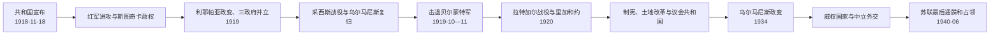

# 第一次共和国、独立战争与威权转向

## 时间

1918年11月18日—1940年6月17日；苏联控制下的形式机构至1940年8月完成吞并

## 概括

1918年的宣告没有自动带来领土和政权。拉脱维亚共和国必须在德军尚未撤尽、苏俄红军西进、波罗的德意志军政集团、爱沙尼亚和波兰各有安全目标的环境中建立军队与行政。1919年同时存在乌尔马尼斯临时政府、斯图奇卡苏维埃政府和安德里耶夫斯·涅德拉亲德政府；共和国先依赖德意志部队阻挡红军，又与爱沙尼亚支持的北拉脱维亚旅击败德意志军政方案，随后在英法海军支援下击退贝尔蒙特军。1920年战争结束后，制宪议会、土地改革、1922年宪法和拉脱维亚拉特货币建立议会国家。1934年乌尔马尼斯政变终止竞争性民主。1940年共和国并非因内阁更替而自行崩溃，而是在《莫洛托夫—里宾特洛甫条约》秘密安排、苏军基地、最后通牒和军事占领下失去实际主权。

## 建国与权力真空

1918年11月17日，民族委员会与民主集团等组成拉脱维亚人民委员会，选亚尼斯·恰克斯特为主席；次日在里加宣布共和国，并授权卡尔利斯·乌尔马尼斯组阁。政府宣称维泽梅、库尔兰、瑟米加利亚和拉特加尔组成国家，但实际只控制有限机关，军队、铁路、粮食和港口仍受德军或地方力量影响。

协约国要求德国在红军威胁下暂缓撤军。乌尔马尼斯政府因而与德国第八集团军残部、波罗的国防军和德国志愿军形成危险合作：这些部队需要共和国名义和补给，却有部分领导者希望保存德意志贵族权力或建立亲德政体。

## 独立战争的五个阶段

### 一、红军进攻与苏维埃政府

苏俄废除对德和约限制后向西推进。彼得里斯·斯图奇卡领导的拉脱维亚社会主义苏维埃共和国于1918年12月宣布成立，1919年初控制里加和大部领土。该政权以共产党、红色步枪兵和苏俄军事力量为核心，实行国有化、粮食征集和革命法庭；城市粮荒、强制政策和红色恐怖削弱支持。

乌尔马尼斯政府退至利耶帕亚。德国第六预备军团、波罗的国防军与拉脱维亚南方旅反攻，1919年5月夺回里加。反攻伴随白色恐怖和对疑似布尔什维克、工人的大规模报复，不能把“解放里加”只写成单一国家胜利。

### 二、利耶帕亚政变与三政府并立

1919年4月，亲德部队在利耶帕亚发动政变。乌尔马尼斯政府避上受协约国保护的“萨拉托夫”号船；奥斯卡斯·博尔克斯内维奇短暂出任过渡首脑，随后牧师安德里耶夫斯·涅德拉领导亲德政府。

此时存在三套竞争主张：

| 政权 | 领导 | 主要依靠 | 目标与结局 |
| --- | --- | --- | --- |
| 拉脱维亚临时政府 | 卡尔利斯·乌尔马尼斯 | 人民委员会、南方旅部分部队、协约国 | 主张民族共和国；政变后在船上维持承认，采西斯战役后复归。 |
| 拉脱维亚社会主义苏维埃共和国 | 彼得里斯·斯图奇卡 | 红军、布尔什维克和部分红色步枪兵 | 建立苏维埃制度；军事失败后退入拉脱维亚东部和俄国。 |
| 亲德政府 | 安德里耶夫斯·涅德拉 | 波罗的德意志军政集团与德国志愿军 | 保存德意志军政影响；采西斯失败后瓦解，未获广泛国际承认。 |

### 三、采西斯战役

爱沙尼亚军和在爱沙尼亚组建的北拉脱维亚旅向南推进，与波罗的国防军和德国铁师发生冲突。1919年6月采西斯战役中，爱沙尼亚—北拉脱维亚一方取胜，阻止亲德力量控制里加。7月《斯特拉兹杜穆伊扎停战》安排德军撤离、波罗的国防军重组并置于共和国指挥；乌尔马尼斯政府返回里加。

这场胜利不是单独由当时尚在整编的拉脱维亚国家军取得，爱沙尼亚军的决定性作用必须保留。战后南、北两支拉脱维亚部队合并，形成统一军队。

### 四、贝尔蒙特军进攻

帕维尔·贝尔蒙特-阿瓦洛夫领导的西俄志愿军名义上反布尔什维克，实际吸收大量拒绝撤离的德军并谋求控制波罗的海。1919年10月该军从库尔兰进攻里加，占领道加瓦西岸。

拉脱维亚军在英法舰炮、爱沙尼亚装甲列车和盟国物资支持下反攻，11月11日夺回帕尔道加瓦，随后把贝尔蒙特军逐出库尔兰。11月11日成为拉奇普莱西斯日，纪念军队胜利。战役消除了德国残余军事力量对政府的直接威胁。

### 五、拉特加尔战役与和平

东部仍由红军和斯图奇卡机关控制。1920年1月拉脱维亚与波兰军共同攻取陶格夫匹尔斯，继而收复拉特加尔；波军随后把城市交给拉脱维亚。2月秘密停火，8月11日拉脱维亚与苏俄签署里加和约，苏俄无保留承认拉脱维亚独立并放弃主权要求。

战争结束不等于所有边界争议消失。与爱沙尼亚的瓦尔加 / 瓦尔卡等争端经仲裁处理；阿布雷内地区后来在苏联时期划入俄罗斯，成为恢复独立后的法律争议。

## 战争胜利的条件

- 德国与俄罗斯帝国同时崩溃，旧主权都无法稳定接管；
- 人民委员会和外交人员维持可被协约国承认的政治中心；
- 爱沙尼亚、波兰、英国和法国在不同阶段提供决定性军事支持；
- 南北拉脱维亚部队最终整合为国家军队；
- 土地和民族国家承诺吸引农村人口支持；
- 敌对力量彼此冲突：布尔什维克、亲德集团和贝尔蒙特军未能形成共同阵线。

胜利并非单纯民族团结结果。红白恐怖、地方合作、族群冲突和强制动员都构成战争经验，后来少数群体政策和历史记忆因此复杂。

## 制宪与议会共和国

1920年经普遍、平等和比例选举产生制宪议会，女性拥有选举权。恰克斯特任议长并履行国家元首职能。议会通过土地改革和1922年宪法；第一届议会同年选恰克斯特为正式总统。

### 权力结构

| 机关 | 产生方式 | 主要权力 | 制衡 |
| --- | --- | --- | --- |
| 议会 | 比例代表普选，100席 | 立法、预算、选总统、支持或推翻内阁 | 党派分散导致联盟谈判频繁。 |
| 总统 | 由议会选举 | 公布法律、提名总理、外交与有限否决、军队统帅 | 权力弱于议会；须在党派间调解。 |
| 总理与内阁 | 总统提名、依赖议会信任 | 日常行政、财政、外交和安全 | 联盟失去多数即需改组。 |
| 法院与审计机关 | 依法任命 | 司法、行政和财政监督 | 宪法权利章节未能在战前全部通过，制度仍在形成。 |

完整国家元首、代理与历届内阁见[拉脱维亚现代国家元首与政府首脑表](/%E4%BA%BA%E6%96%87%E7%A7%91%E5%AD%A6/%E5%8E%86%E5%8F%B2/%E6%AC%A7%E6%B4%B2/%E6%B3%A2%E7%BD%97%E7%9A%84%E6%B5%B7/%E6%8B%89%E8%84%B1%E7%BB%B4%E4%BA%9A/%E6%8B%89%E8%84%B1%E7%BB%B4%E4%BA%9A%E7%8E%B0%E4%BB%A3%E5%9B%BD%E5%AE%B6%E5%85%83%E9%A6%96%E4%B8%8E%E6%94%BF%E5%BA%9C%E9%A6%96%E8%84%91%E8%A1%A8.md)。

### 土地改革

1920年土地改革把大庄园的大部分土地纳入国家基金，分配给无地农民、退伍军人和小农。改革削弱波罗的德意志大地主，扩大自耕农，并把共和国合法性与土地所有权相连。补偿有限，引发德意志贵族抗议和国际诉讼；小农场规模、信贷和全球农产品价格又造成长期压力。

### 货币、经济与社会

1922年拉脱维亚拉特和中央银行稳定战后货币。农业、木材、亚麻和乳制品出口为主，里加工厂逐步恢复，但失去俄罗斯帝国统一市场。合作社和国家信贷帮助小农，1929年后世界经济危机使出口价格和就业受挫。

1919年少数民族学校法为德语、俄语、意第绪语、希伯来语、波兰语等教育提供较广空间。犹太人、德意志人、俄罗斯人、波兰人和白俄罗斯人参与议会与城市生活。土地改革、语言国家化和就业竞争也制造族群紧张，1934年后自治空间缩小。

## 议会政治的成就与局限

### 成就

- 四届议会均经竞争性选举产生，政府通过议会程序更替；
- 土地、货币、教育和行政体系在战争废墟上建立；
- 1921年获协约国事实上的集体承认并加入国际联盟；
- 少数群体拥有议会代表和学校网络；
- 文学、歌咏节、大学和拉脱维亚语官僚体系发展。

### 局限

- 比例制度门槛低，小党众多，联盟经常改组；
- 社会民主党虽是大党，却因内部分歧和对资产阶级联盟的顾虑难长期执政；
- 农业危机、退伍军人、城市劳工与少数族群利益难协调；
- 极右雷霆十字、地下共产党等反体制力量增长；
- 议会未能完成宪法基本权利部分，行政仍长期使用紧急措施。

频繁内阁不等于国家机器完全瘫痪。许多部长、官僚和政策跨内阁延续；把1934年政变解释成“民主必然失败”，会把政变者的正当化宣传当作事实。

## 1934年政变

5月15日至16日夜，时任总理乌尔马尼斯在战争部长亚尼斯·巴洛迪斯支持下动用军队与自卫队，宣布戒严，解散议会，禁止政党和拘押反对派。政变基本未发生大规模交火，但它违反宪法，并非总统依法解散议会。

总统阿尔贝茨·克维埃西斯继续任职至第二任期结束，未阻止威权化。1936年内阁以非常立法让乌尔马尼斯兼行总统职权，不经议会选举。政权取消竞争选举，以职业商会、国家宣传、审查和行政任命替代政党政治。

## 乌尔马尼斯威权体制

| 领域 | 政策 | 影响与局限 |
| --- | --- | --- |
| 政治 | 禁党、解散议会、新闻审查、政治警察 | 短期决策集中，公共问责和合法继承机制消失。 |
| 经济 | 国家信贷、收购与合并企业、农业价格支持、大型公共工程 | 经济从危机中恢复，但国家偏好与裙带关系增加。 |
| 社会 | 职业商会、青年组织、领袖崇拜 | 以非党派“民族团结”取代多元代表。 |
| 民族政策 | 强化拉脱维亚语和拉脱维亚人主导，限制少数民族自治 | 国家认同统一，德、犹、俄等社群制度空间收缩。 |
| 外交 | 宣称中立、参与1934年波罗的协约 | 三国协调有限，缺少能阻止德苏压力的军事保证。 |

威权体制没有发展成纳粹式群众党极权，也未实行同等规模的种族灭绝政策；但它确实取消宪政民主、压制反对派并塑造个人统治，不能只因经济成就而美化。

## 1939—1940年的主权危机

1939年8月德苏互不侵犯条约秘密议定书把拉脱维亚划入苏联势力范围。9月战争爆发后，拉脱维亚宣布中立，却无外部同盟能保障。10月5日在军事压力下签署互助条约，允许苏联驻扎约二万五千军人和使用基地；这已严重限制主权，但政府继续运作。

同年，纳粹德国推动波罗的德意志人“回归帝国”，大多数德意志社群离境，结束数百年精英连续性。1940年6月苏联在西欧战局和既有基地优势下封锁波罗的海，攻击边防哨所，并于16日提出最后通牒，要求新政府和无限制增兵。乌尔马尼斯选择不抵抗，17日苏军占领全境。

“不抵抗”可由地理、兵力和国际孤立解释，却不能使随后程序合法。占领军监督下的政府改组、单一名单选举和请求并入苏联均违反战前宪法。

## 第一共和国失去主权的原因

### 国内脆弱性

威权化取消议会和公开政治，使危机决策集中于极少数人，也削弱社会参与。经济与族群问题仍在，军队规模有限。不过这些因素不足以单独造成国家灭亡。

### 外部结构

- 德国与苏联秘密划分东欧；
- 英法无力向波罗的海提供及时军事保证；
- 波罗的三国协约缺乏联合司令、具体防御计划和大国后盾；
- 1939年苏军基地从内部改变军事平衡；
- 波兰被瓜分、芬兰受攻击显示苏联愿意使用武力。

### 直接过程

最后通牒迫使政府接受苏联指定人员和无限制驻军；红军于1940年6月17日占领。6月20日奥古斯茨·基兴施泰因斯政府成立，7月受控选举后，“人民议会”要求加入苏联。8月5日苏联最高苏维埃完成吞并。第一共和国的本土机关被终结，外交使团和部分国家法理继续存在。

## 重要事件

| 时间 | 事件 | 结果与长期影响 |
| --- | --- | --- |
| 1918-11-18 | 宣布共和国 | 建立主权主张和临时政府。 |
| 1919-01 | 红军占领里加 | 斯图奇卡苏维埃政权控制大部国土。 |
| 1919-04 | 利耶帕亚政变 | 乌尔马尼斯、斯图奇卡、涅德拉三政府并立。 |
| 1919-06 | 采西斯战役 | 爱沙尼亚—北拉脱维亚军击败亲德力量。 |
| 1919-11-11 | 里加击退贝尔蒙特军 | 国家军队控制首都，成为纪念日。 |
| 1920-01 | 拉波联军收复拉特加尔 | 大致国家疆域形成。 |
| 1920-08-11 | 与苏俄签里加和约 | 苏俄承认独立，主要战争结束。 |
| 1920—1922 | 制宪议会、土地改革、宪法 | 议会共和国制度建立。 |
| 1921 | 国际承认、加入国际联盟 | 国家进入国际体系。 |
| 1922 | 拉特发行、首届议会 | 财政与宪政常态化。 |
| 1934-05-15 | 乌尔马尼斯政变 | 议会、政党和竞争选举被取消。 |
| 1936-04 | 乌尔马尼斯兼行总统职权 | 总统与总理合一，个人统治完成。 |
| 1939-08 | 德苏秘密议定书 | 拉脱维亚被划入苏联势力范围。 |
| 1939-10 | 苏拉互助条约 | 苏军基地进入，军事主权被侵蚀。 |
| 1940-06-17 | 苏军占领 | 共和国失去实际主权。 |
| 1940-08-05 | 苏联完成吞并 | 本土国家机关被苏维埃机构取代。 |

## 演变关系

- 前一阶段：[俄罗斯帝国统治与民族觉醒](/%E4%BA%BA%E6%96%87%E7%A7%91%E5%AD%A6/%E5%8E%86%E5%8F%B2/%E6%AC%A7%E6%B4%B2/%E6%B3%A2%E7%BD%97%E7%9A%84%E6%B5%B7/%E6%8B%89%E8%84%B1%E7%BB%B4%E4%BA%9A/%E4%BF%84%E7%BD%97%E6%96%AF%E5%B8%9D%E5%9B%BD%E7%BB%9F%E6%B2%BB%E4%B8%8E%E6%B0%91%E6%97%8F%E8%A7%89%E9%86%92.md)
- 区域比较：[波罗的三国独立](/%E4%BA%BA%E6%96%87%E7%A7%91%E5%AD%A6/%E5%8E%86%E5%8F%B2/%E6%AC%A7%E6%B4%B2/%E6%B3%A2%E7%BD%97%E7%9A%84%E6%B5%B7/%E6%B3%A2%E7%BD%97%E7%9A%84%E4%B8%89%E5%9B%BD%E7%8B%AC%E7%AB%8B.md)
- 领导人专表：[拉脱维亚现代国家元首与政府首脑表](/%E4%BA%BA%E6%96%87%E7%A7%91%E5%AD%A6/%E5%8E%86%E5%8F%B2/%E6%AC%A7%E6%B4%B2/%E6%B3%A2%E7%BD%97%E7%9A%84%E6%B5%B7/%E6%8B%89%E8%84%B1%E7%BB%B4%E4%BA%9A/%E6%8B%89%E8%84%B1%E7%BB%B4%E4%BA%9A%E7%8E%B0%E4%BB%A3%E5%9B%BD%E5%AE%B6%E5%85%83%E9%A6%96%E4%B8%8E%E6%94%BF%E5%BA%9C%E9%A6%96%E8%84%91%E8%A1%A8.md)
- 后一阶段：[苏德占领与苏维埃时期](/%E4%BA%BA%E6%96%87%E7%A7%91%E5%AD%A6/%E5%8E%86%E5%8F%B2/%E6%AC%A7%E6%B4%B2/%E6%B3%A2%E7%BD%97%E7%9A%84%E6%B5%B7/%E6%8B%89%E8%84%B1%E7%BB%B4%E4%BA%9A/%E8%8B%8F%E5%BE%B7%E5%8D%A0%E9%A2%86%E4%B8%8E%E8%8B%8F%E7%BB%B4%E5%9F%83%E6%97%B6%E6%9C%9F.md)
- 返回：[拉脱维亚历史](/%E4%BA%BA%E6%96%87%E7%A7%91%E5%AD%A6/%E5%8E%86%E5%8F%B2/%E6%AC%A7%E6%B4%B2/%E6%B3%A2%E7%BD%97%E7%9A%84%E6%B5%B7/%E6%8B%89%E8%84%B1%E7%BB%B4%E4%BA%9A/README.md)
