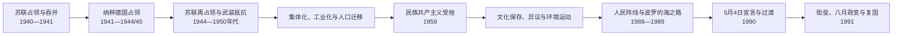

# 苏德占领与苏维埃时期

## 时间

1940年6月17日—1991年8月21日；纳粹德国占领为1941年夏至1944年大部、库尔兰局部至1945年5月

## 概括

1940—1991年不是一个连续且同质的“外国统治阶段”，而是苏联首次占领与吞并、纳粹德国占领、苏联再次占领和晚期主权运动依次发生。苏联以最后通牒、驻军和受控选举 dismantle 共和国机关，实行国有化、逮捕和驱逐；纳粹德国拒绝恢复拉脱维亚独立，把地区编入东方领地，并在德国安全机关指挥和本地协作者参与下杀害绝大多数拉脱维亚犹太人。苏联再占领后又以镇压、1949年驱逐和集体化摧毁武装抵抗，同时通过工业化、城市化、教育和人口迁移重塑社会。外交使团、流亡政治人物、民族游击队、文化与宗教网络以不同方式保存国家连续性记忆。1980年代末，历史公开、环境抗议和拉脱维亚人民阵线把改革要求转成复国运动；1990年5月4日宣言启动过渡，1991年八月莫斯科政变失败时恢复完整实际独立。

## 1940—1941年苏联首次占领

### 最后通牒与受控吞并

苏联军队1940年6月17日进入全境。6月20日，由苏方认可的奥古斯茨·基兴施泰因斯出任政府首脑。卡尔利斯·乌尔马尼斯形式上仍任国家元首到7月21日，却失去自由决策能力，随后被驱逐到苏联并死于羁押。

7月14—15日举行议会选举，只有共产党控制的“劳动人民集团”名单获准参选，反对名单被取消，投票在占领、审查和逮捕环境下进行。新“人民议会”7月21日宣布苏维埃共和国并请求加入苏联；8月5日苏联最高苏维埃批准。这个程序违反1922年宪法关于主权和领土变更的要求，不能把形式投票当作自由同意。

### 制度转换与镇压

- 银行、大型企业和大地产被国有化，货币、工资与贸易接入苏联体系；
- 军队被改编为红军领土军，许多军官遭逮捕或处决；
- 政党、社团、独立媒体和地方自治被取消；
- 国家公务员、军人、警察、企业家、地主和政治人士受到调查、解职和逮捕；
- 1941年6月13—14日，约一万五千四百名居民被驱逐，许多成年男子与家庭分开送入劳改营。

镇压对象包含拉脱维亚人以及犹太人、俄罗斯人、波兰人等不同社群；把苏维埃恐怖简单写成单一族群之间的报复，会掩盖共产主义国家机关和具体执行者责任。

## 1941—1944/45年纳粹德国占领

### 入侵与统治结构

1941年6月22日德国进攻苏联，7月初占领里加，不久控制几乎全境。部分居民因经历苏联镇压而把德军误认为解放者，也有人参与反苏起义；德国很快明确拒绝恢复主权。

| 层级 | 机构 / 人物 | 权力性质 |
| --- | --- | --- |
| 德国最高占领体系 | 东方占领区，由帝国东方占领区部长与东方领地总督系统管辖 | 决定殖民、经济掠夺、种族和安全政策。 |
| 拉脱维亚总区 | 总专员奥托-海因里希·德雷克斯勒，1941—1944 | 最高民政首脑，向东方领地总督负责；不是拉脱维亚国家元首。 |
| 德国警察与党卫队 | 安全部队、秩序警察、党卫队及高级警察首脑 | 组织大屠杀、反游击、强制劳动和镇压，权力常压过民政机关。 |
| 拉脱维亚地方自治机构 | 奥斯卡斯·丹克尔斯领导的总局体系，1942—1944为主 | 在德方命令下处理教育、地方行政、劳工等，不是主权政府。 |
| 市镇与辅助警察 | 德方任命或控制的地方机关 | 参与日常管理；部分单位参与迫害与杀戮，责任须落实到机构和个人。 |

### 大屠杀

德国安全警察和特别行动队从入侵初期即组织反犹暴力。维克托斯·阿拉伊斯突击队等本地协作单位参与逮捕、枪杀和焚毁会堂；地方警察、行政人员、告密者和财产受益者也在不同环节参与。里加、陶格夫匹尔斯、利耶帕亚及小城犹太社群被集中和杀害。

1941年11月30日、12月8日的伦布拉大屠杀中，里加隔都大批犹太人被德国党卫队、警察和辅助人员杀害。整个占领期超过七万名本地犹太人遇害，另有从德国、奥地利、捷克等地运来的犹太人在拉脱维亚被杀。仅有少数人在营救者帮助下生存。

责任叙述需同时避免两种错误：

- 不能把德国制定、指挥的种族灭绝淡化为“地方冲突”；
- 也不能以德国主导为由抹去阿拉伊斯突击队等本地机构和个人的主动参与。

### 强制动员与拉脱维亚军团

德国征用劳工，招募警察营，并于1943年组织所谓“拉脱维亚党卫军志愿军团”，主要形成第15、第19武装党卫军师。名称中的“志愿”不能概括实际构成，后期大量人员在征兵压力下入伍。有人把服役视为阻挡苏联再占领，有人主动支持德国，有人只求生存。

军团前线士兵、早期警察营和大屠杀执行单位在组织、时间和个人经历上有交叉但不完全等同。评价个体责任须看其具体所属、行为和命令，既不能把所有征召兵自动定为大屠杀罪犯，也不能用反苏动机洗去参与战争罪的事实。

### 抵抗和复国尝试

1943年，前议会政党人士成立拉脱维亚中央委员会，康斯坦丁斯·恰克斯特任主席，目标是在德苏之间恢复民主共和国。1944年188名公共人物签署备忘录要求复国。亚尼斯·库雷利斯将军部队一度希望成为独立军核心；德国安全机关识破后逮捕领导，罗伯茨·鲁贝尼斯营抵抗德军。

共产党游击队也反抗德军，但其政治目标通常是恢复苏维埃权力。不同抵抗组织都反对德国，却对战后国家形态存在根本分歧。

### 战线回返与库尔兰口袋

1944年红军重新进入拉脱维亚，10月占领里加。德国北方集团军残部被困库尔兰，直到1945年5月投降。因此“1944年解放 / 再占领”的称呼取决于主权视角：它终结纳粹统治，却没有恢复拉脱维亚共和国，而是重新建立苏联控制。

## 苏联再占领与武装抵抗

### 难民与流亡社会

1944—1945年约二十万居民以难民、撤离者、被强迫劳工、士兵或集中营幸存者等身份离开。许多人在德国等地成为流离失所者，后来迁往美国、加拿大、英国、澳大利亚、瑞典等。流亡社团建立学校、媒体、教会和政治组织，主张西方不承认吞并。

驻华盛顿、伦敦等地的拉脱维亚外交机构继续管理有限财产、护照和领事事务。它们没有领土和常规政府，却是国家国际法连续性的重要载体。

### 森林兄弟

红军动员、逮捕和对复国希望破灭促成民族游击。森林兄弟袭击苏维埃官员、征粮与安全机构，保护逃避征兵者，并期待西方与苏联冲突。其成员包括前共和国军人、逃亡者、前德军服役者和农村青年，政治与个人经历多样。

苏联内务部和安全机关以渗透、集体惩罚、家属驱逐和军事围剿逐步摧毁网络。部分游击队也杀害被视为合作者的平民；抵抗目标不自动免除具体暴力责任。到1950年代初有组织武装大体失败。

### 1949年驱逐与集体化

1949年3月25日，超过四万二千名拉脱维亚居民主要以“富农”、民族游击支持者及家属名义被驱逐到西伯利亚等地，其中大量是妇女和儿童。行动同时服务于政治镇压与强迫农业集体化。驱逐后个体农户迅速被并入集体农庄，国家控制土地、收购和劳动力。

## 苏维埃统治结构

苏维埃宪法把最高苏维埃主席团主席设为法定元首、部长会议主席设为政府首脑，但关键干部由共产党体系决定并受莫斯科控制。共和国第一书记通常是实际最高政治人物，第二书记、国家安全、军队和全联盟部委确保中央监督。

完整法定首长、政府首脑和共产党第一书记见[拉脱维亚现代国家元首与政府首脑表](/%E4%BA%BA%E6%96%87%E7%A7%91%E5%AD%A6/%E5%8E%86%E5%8F%B2/%E6%AC%A7%E6%B4%B2/%E6%B3%A2%E7%BD%97%E7%9A%84%E6%B5%B7/%E6%8B%89%E8%84%B1%E7%BB%B4%E4%BA%9A/%E6%8B%89%E8%84%B1%E7%BB%B4%E4%BA%9A%E7%8E%B0%E4%BB%A3%E5%9B%BD%E5%AE%B6%E5%85%83%E9%A6%96%E4%B8%8E%E6%94%BF%E5%BA%9C%E9%A6%96%E8%84%91%E8%A1%A8.md)。

| 层面 | 名义机制 | 实际运作 |
| --- | --- | --- |
| 最高苏维埃 | 定期选举、通过法律和任命机关 | 候选由共产党控制，多数决定预先形成。 |
| 主席团 | 集体国家元首，主席承担礼仪与签署职能 | 权力弱于第一书记和中央党机关。 |
| 部长会议 | 管理经济、教育、住房与地方行政 | 计划、投资和重要任命受全联盟部委与党控制。 |
| 共产党中央委员会 | 党内会议、局和书记处 | 决定干部、宣传、安全及主要政策，是实际权力核心。 |
| 国家安全与内务机关 | 调查、边境、治安与反情报 | 镇压反对派、监控社会，向共和国和莫斯科双重体系负责。 |

## 工业化、城市化与人口变化

战后苏联把拉脱维亚纳入全联盟分工，扩建机械、电工、化工、交通和军工企业。里加、陶格夫匹尔斯、叶尔加瓦等城市增长，住房、医疗、女性就业和技术教育扩大；消费短缺、污染和中央计划低效率并存。

大型工厂从苏联其他共和国招募俄语工人和干部。战争、屠杀、逃亡、驱逐与迁入共同改变人口结构，拉脱维亚族在共和国人口中的比例明显下降，里加等城市俄语使用扩大。迁入者的个人动机包括工作、军队安置和家庭迁徙，不能一概等同殖民政策设计者；但中央投资与移民政策确实削弱本地语言人口的制度地位。

学校保留拉脱维亚语体系，同时俄语在全联盟晋升、高等教育、军队和工业中更有优势。双语并非权力对称：拉脱维亚语使用者通常必须掌握俄语，俄语使用者未必需掌握拉脱维亚语。

## 1950年代“民族共产主义”与清洗

斯大林死后，部分拉脱维亚共产党干部主张限制无计划劳动力迁入、提高本地干部和拉脱维亚语地位、调整不适合本地的工业项目。爱德华兹·贝尔克拉夫斯等人不是要求多党民主或立即独立，而是在苏维埃体制内争取共和国利益。

1959年赫鲁晓夫访问后，第一书记阿尔维兹·佩尔谢一派在莫斯科支持下清洗“民族共产主义者”。大批干部被调离，工业化和迁入继续。事件表明共和国名义联邦权力不能抵抗中央干部决定。

## 社会生活、文化保存与异议

苏维埃时期不是只有镇压，也有受国家控制的教育、科研、城市文化、体育和社会流动。许多人在制度内生活、工作并形成真实社会关系；承认这些经验不等于认可吞并合法性。

作家、民俗学者、合唱团、教会和家庭记忆保存语言与历史。审查迫使公共表达采用隐喻，某些全国歌舞节在官方社会主义框架内仍成为民族文化聚集。异议人士古纳尔斯·阿斯特拉等因传播禁书或反苏言论被监禁。

1986年成立的“赫尔辛基-86”公开要求人权和历史纪念。反对陶格夫匹尔斯水电站、里加地铁等环境运动把生态、地方决策和民族生存联系起来，为群众政治复兴提供较低门槛。

## 歌唱革命与复国

### 历史公开和组织形成

1987年6月14日，赫尔辛基-86在自由纪念碑公开纪念驱逐受害者。1988年群众集会要求语言地位、历史真相和主权；同年拉脱维亚人民阵线成立，最初支持苏联民主化与经济自主，很快转向恢复独立。较激进的民族独立运动、以公民登记为基础的公民委员会和人民阵线之间策略不同；反独立的“国际阵线”主要依靠部分俄语工业与党组织。

1989年8月23日，约两百万爱沙尼亚、拉脱维亚和立陶宛居民组成波罗的海之路，揭露德苏秘密议定书并要求国家权利。苏联人民代表大会同年承认秘密议定书存在且违法，进一步摧毁1940年叙事。

### 1990年5月4日宣言

1990年相对竞争的最高苏维埃选举中，人民阵线阵营取得恢复独立所需多数。5月4日议会宣布1940年并入无效、恢复1922年宪法若干基本条款，并设过渡期；阿纳托利斯·戈尔布诺夫斯任最高委员会主席，伊瓦尔斯·戈德马尼斯组建政府。

这不是立即控制边境、军队和货币的完整独立。苏联军队、内务部特警、共产党保守派和全联盟经济机关仍在，形成双重权力。

### 1991年街垒与八月政变

1991年1月苏联在立陶宛使用武力后，拉脱维亚民众在里加议会、广播、桥梁和通信设施周围筑街垒。内务部特警袭击造成死伤，却未推翻政府。3月咨询投票显示多数参与者支持民主、独立的拉脱维亚。

8月莫斯科保守派发动政变，里加特警占领部分设施。8月21日最高委员会通过关于国家地位的宪法性法律，结束过渡并宣布完整独立。莫斯科政变迅速失败，冰岛、俄罗斯联邦、欧洲国家、苏联中央等随后承认；拉脱维亚9月加入联合国。

## 这一时期结束的原因

### 苏维埃体系内部因素

- 计划经济停滞、消费与环境危机削弱绩效合法性；
- 戈尔巴乔夫改革放松审查和党垄断，却无法建立稳定新联邦；
- 1940年秘密协议、驱逐和镇压档案公开，官方历史失去可信度；
- 拉脱维亚共产党分裂，亲独立国家机构取得选举授权；
- 共和国经济和文化精英愿意把自治要求转为主权。

### 社会动员

歌咏、纪念、环境抗议、人民阵线基层组织和三国协作使数十万人参与非暴力政治。海外外交与西方不承认政策为“恢复国家”提供国际法框架。

### 直接触发

1991年八月政变证明改革后的联盟仍可能恢复强制统治，却因军政分裂迅速失败。拉脱维亚议会利用权力真空结束过渡，俄罗斯联邦与西方承认使苏联中央无法再逆转。

## 重要事件

| 时间 | 事件 | 结果与长期影响 |
| --- | --- | --- |
| 1940-06-17 | 苏军占领 | 共和国失去实际主权。 |
| 1940-07—08 | 受控选举与苏联吞并 | 苏维埃机关取代共和国制度。 |
| 1941-06-14 | 第一次大规模驱逐 | 社会精英与家庭遭系统镇压。 |
| 1941-06—07 | 德国入侵 | 苏联首次占领结束，纳粹殖民统治开始。 |
| 1941-11—12 | 伦布拉屠杀 | 里加犹太社群遭大规模杀害。 |
| 1943 | 拉脱维亚军团与中央委员会成立 | 德国动员扩大，民主复国地下组织同时出现。 |
| 1944-07—10 | 红军重新进入、占领里加 | 纳粹统治大部结束，苏联再占领。 |
| 1945-05 | 库尔兰德军投降 | 拉脱维亚境内二战战斗结束。 |
| 1945—1950年代 | 森林兄弟抵抗 | 复国武装遭苏联安全机关摧毁。 |
| 1949-03-25 | 大规模驱逐 | 集体化与农村镇压加速。 |
| 1959 | 民族共产主义干部被清洗 | 中央控制和人口工业政策强化。 |
| 1986—1987 | 赫尔辛基-86与环境抗议 | 独立群众行动恢复。 |
| 1988 | 人民阵线成立 | 改革运动转为复国主力。 |
| 1989-08-23 | 波罗的海之路 | 三国以非暴力群众行动挑战吞并合法性。 |
| 1990-05-04 | 恢复独立宣言 | 建立过渡期和民选复国政府。 |
| 1991-01 | 里加街垒 | 苏联武力压力未能推翻国家机构。 |
| 1991-08-21 | 国家地位宪法性法律 | 过渡结束，完整实际独立恢复。 |

## 演变关系

- 前一阶段：[第一次共和国、独立战争与威权转向](/%E4%BA%BA%E6%96%87%E7%A7%91%E5%AD%A6/%E5%8E%86%E5%8F%B2/%E6%AC%A7%E6%B4%B2/%E6%B3%A2%E7%BD%97%E7%9A%84%E6%B5%B7/%E6%8B%89%E8%84%B1%E7%BB%B4%E4%BA%9A/%E7%AC%AC%E4%B8%80%E6%AC%A1%E5%85%B1%E5%92%8C%E5%9B%BD%E3%80%81%E7%8B%AC%E7%AB%8B%E6%88%98%E4%BA%89%E4%B8%8E%E5%A8%81%E6%9D%83%E8%BD%AC%E5%90%91.md)
- 区域比较：[苏联统治下的波罗的海](/%E4%BA%BA%E6%96%87%E7%A7%91%E5%AD%A6/%E5%8E%86%E5%8F%B2/%E6%AC%A7%E6%B4%B2/%E6%B3%A2%E7%BD%97%E7%9A%84%E6%B5%B7/%E8%8B%8F%E8%81%94%E7%BB%9F%E6%B2%BB%E4%B8%8B%E7%9A%84%E6%B3%A2%E7%BD%97%E7%9A%84%E6%B5%B7.md)
- 领导人专表：[拉脱维亚现代国家元首与政府首脑表](/%E4%BA%BA%E6%96%87%E7%A7%91%E5%AD%A6/%E5%8E%86%E5%8F%B2/%E6%AC%A7%E6%B4%B2/%E6%B3%A2%E7%BD%97%E7%9A%84%E6%B5%B7/%E6%8B%89%E8%84%B1%E7%BB%B4%E4%BA%9A/%E6%8B%89%E8%84%B1%E7%BB%B4%E4%BA%9A%E7%8E%B0%E4%BB%A3%E5%9B%BD%E5%AE%B6%E5%85%83%E9%A6%96%E4%B8%8E%E6%94%BF%E5%BA%9C%E9%A6%96%E8%84%91%E8%A1%A8.md)
- 后一阶段：[恢复独立后的拉脱维亚](/%E4%BA%BA%E6%96%87%E7%A7%91%E5%AD%A6/%E5%8E%86%E5%8F%B2/%E6%AC%A7%E6%B4%B2/%E6%B3%A2%E7%BD%97%E7%9A%84%E6%B5%B7/%E6%8B%89%E8%84%B1%E7%BB%B4%E4%BA%9A/%E6%81%A2%E5%A4%8D%E7%8B%AC%E7%AB%8B%E5%90%8E%E7%9A%84%E6%8B%89%E8%84%B1%E7%BB%B4%E4%BA%9A.md)
- 返回：[拉脱维亚历史](/%E4%BA%BA%E6%96%87%E7%A7%91%E5%AD%A6/%E5%8E%86%E5%8F%B2/%E6%AC%A7%E6%B4%B2/%E6%B3%A2%E7%BD%97%E7%9A%84%E6%B5%B7/%E6%8B%89%E8%84%B1%E7%BB%B4%E4%BA%9A/README.md)
