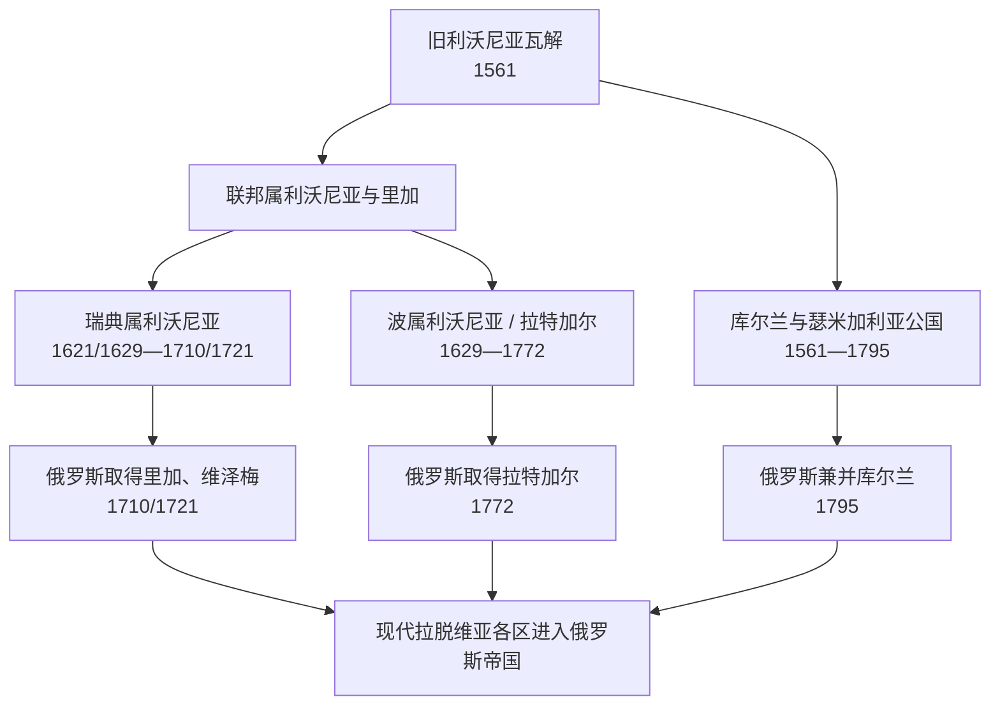

# 近世分治与库尔兰公国

## 时间

1561—1795年；部分地区自1710/1721年起已受俄罗斯统治

## 概括

旧利沃尼亚在16世纪战争中瓦解后，现代拉脱维亚疆域没有形成统一继承国。库尔兰、瑟米加利亚和瑟罗尼亚大部组成臣属于波兰—立陶宛的库尔兰与瑟米加利亚公国；道加瓦以北和以东的利沃尼亚土地在联邦、瑞典和俄罗斯之间转手；拉特加尔长期属于波属利沃尼亚，保持较强天主教与波兰文化影响。不同地区直到18世纪末才全部进入俄罗斯帝国，制度、宗教与土地关系的差异却继续塑造现代拉脱维亚。

## 1561年后的政治地图

| 地区 | 主要政体与时间 | 统治特点 |
| --- | --- | --- |
| 库尔兰、瑟米加利亚、瑟罗尼亚大部 | 库尔兰与瑟米加利亚公国，1561/1562—1795 | 公爵臣属于立陶宛大公、后来的波兰—立陶宛君主；德意志贵族议会和庄园力量强。 |
| 里加 | 1561—1581年近似自由帝国城市式自治，1581/1582后服从联邦，1621年被瑞典攻占 | 港口、行会与城政保持强大谈判能力。 |
| 维泽梅及利沃尼亚大部 | 联邦属利沃尼亚，后成为瑞典属利沃尼亚，1629年和约确认 | 瑞典总督、省制、教会教育和王室土地收回与贵族特权并存。 |
| 拉特加尔 | 1629年后成为波属利沃尼亚 / 因弗兰提省，1772年归俄 | 反宗教改革、天主教、波兰语贵族文化与东部边疆联系突出。 |
| 皮尔泰内 / 库尔兰主教区旧地 | 经丹麦王室支系、联邦等复杂转手，17世纪并入公国 | 显示近世边界并非现代国界整齐分割。 |

## 库尔兰与瑟米加利亚公国的建立

最后一任利沃尼亚骑士团团长戈特哈德·凯特勒在1561年《臣服条约》及1562年世俗化仪式后成为公爵。他接受波兰国王兼立陶宛大公西吉斯蒙德二世·奥古斯特的宗主权，保留部分骑士团领地，把修会财产转成公爵领和封臣庄园。公国有自己的行政、法院、财政和有限外交空间，却不是完全主权国家。

公爵权力从一开始便受多重限制：

- 对外须承认联邦君主的封建宗主权，并接受册封；
- 德意志贵族通过地方议会、最高顾问和庄园司法限制公爵；
- 城市规模和财政基础有限，难以维持大常备军；
- 农民多为拉脱维亚语人口，却缺少等级代表权并承受庄园劳役；
- 波兰—立陶宛、瑞典、俄罗斯和普鲁士能够干预继承与外交。

戈特哈德1587年去世后，两子弗里德里希与威廉共同继承，后分区治理。威廉试图加强公爵权、与贵族冲突，并在1616年被废黜；弗里德里希重新统一公国。无嗣的弗里德里希争取恢复侄子雅各布的继承权，使凯特勒王朝得以延续。

完整在位、共同统治、复位与争议册封见[库尔兰与瑟米加利亚公爵世系表](/%E4%BA%BA%E6%96%87%E7%A7%91%E5%AD%A6/%E5%8E%86%E5%8F%B2/%E6%AC%A7%E6%B4%B2/%E6%B3%A2%E7%BD%97%E7%9A%84%E6%B5%B7/%E6%8B%89%E8%84%B1%E7%BB%B4%E4%BA%9A/%E5%BA%93%E5%B0%94%E5%85%B0%E4%B8%8E%E7%91%9F%E7%B1%B3%E5%8A%A0%E5%88%A9%E4%BA%9A%E5%85%AC%E7%88%B5%E4%B8%96%E7%B3%BB%E8%A1%A8.md)。

## 雅各布公爵时期的扩张

雅各布·凯特勒1642—1682年统治常被视为公国鼎盛期。他采用重商主义政策，经营王室庄园、冶铁、火药、玻璃、纺织和造船工场，在文茨皮尔斯、库尔迪加等地建设船舶，发展与荷兰、英国、法国及北德意志港口的贸易。

公国曾在冈比亚河口圣安德烈岛及多巴哥岛“新库尔兰”建立据点。其意义在于显示小型附庸政体也试图进入17世纪大西洋贸易，但必须注意：

- 据点规模小、占领断续，依赖有限船队和欧洲外交；
- 当地非洲社会、加勒比原住民及被奴役人口不是公国政策的被动背景；
- 瑞典入侵、荷兰竞争和资源不足很快使据点失去；
- 这是德意志公爵与贵族主导的近世事业，不能倒推成现代拉脱维亚民族国家的殖民传统。

1658年第二次北方战争期间，瑞典军俘虏雅各布并占领公国。1660年和约使其复位，但船队、工场、人口和贸易网络已受重创。此后虽有恢复，公国再未达到此前自主活动能力。

## 瑞典属利沃尼亚与里加

瑞典于1621年攻占里加，1629年《阿尔特马克停战》确认其控制利沃尼亚大部。里加成为瑞典王国最重要的港口城市之一。总督、省级法院、路德宗教会和德语贵族共同治理，瑞典王权没有消灭既有波罗的德意志等级。

主要变化包括：

- 以教区学校、教理问答和本地语言宗教书籍推动路德宗识字；
- 1632年设多尔帕特大学，服务东波罗的海教会与行政；
- 17世纪后期王室收回部分贵族土地，增加财政并引发贵族反对；
- 农民仍受庄园控制，所谓“美好瑞典时代”更多是后世比较记忆，不代表农奴制消失；
- 里加纳入瑞典军事供应与波罗的海贸易，亦成为对波兰—立陶宛和俄罗斯的前线。

1700年大北方战争爆发。围城、瘟疫和粮食危机使里加在1710年向俄罗斯投降；1721年《尼斯塔德和约》正式确认俄罗斯取得瑞典属利沃尼亚。俄罗斯为稳定统治，确认波罗的德意志贵族、城市和路德宗教会的许多特权，因而主权更替没有立即改变地方社会权力。

## 波属利沃尼亚与拉特加尔差异

1629年后留在联邦一侧的东南利沃尼亚逐渐称因弗兰提 / 波属利沃尼亚，大体对应后来的拉特加尔。耶稣会、天主教庄园与波兰化贵族推动反宗教改革，使拉特加尔与路德宗占优势的维泽梅、库尔兰形成长期差异。

1772年第一次瓜分波兰时，俄罗斯并入拉特加尔。它最初被接入白俄罗斯方向的行政体系，未与里加、维泽梅立即统一。这解释了拉特加尔语言变体、天主教传统和社会经济结构为何在现代拉脱维亚内部保持辨识度。

## 18世纪的库尔兰继承危机

大北方战争使库尔兰成为俄瑞、联邦和地方贵族角力场。年轻公爵弗里德里希·威廉1711年婚后返国途中去世，无嗣；其叔斐迪南长期居住但泽，统治主要停留在名义层面。公爵遗孀安娜·伊凡诺芙娜留在米塔乌，后来成为俄罗斯女皇，使俄国影响进一步制度化。

1737年凯特勒男系绝嗣后，恩斯特·约翰·比龙在俄国支持下当选。1740年安娜去世后比龙被流放，公国出现长期权力真空；1741年短暂选出的路德维希·恩斯特未获稳固承认，1758—1763年萨克森的卡尔·克里斯蒂安在奥古斯特三世与俄国支持下任公爵。叶卡捷琳娜二世又恢复比龙，后由其子彼得继承。

这段继承史说明公爵选择越来越取决于俄罗斯宫廷与联邦君主，而地方等级主要争取自身特权。1794年科希丘什科起义波及地区，俄罗斯施压与贵族对革命的恐惧共同推动1795年臣服。彼得·比龙退位，叶卡捷琳娜二世把公国改为库尔兰省。

## 统治结构

| 层级 | 公国 | 瑞典属利沃尼亚 | 波属利沃尼亚 |
| --- | --- | --- | --- |
| 最高权威 | 公爵，上有联邦宗主君主 | 瑞典国王及总督 | 波兰—立陶宛君主、议会和地方官 |
| 地方精英 | 德意志贵族议会、最高顾问 | 波罗的德意志贵族与城市 | 波兰化 / 德意志贵族、天主教机构 |
| 宗教 | 路德宗为主，少数天主教和犹太社群 | 路德宗国教体系 | 天主教较强，反宗教改革深入 |
| 农村 | 庄园劳役与农奴制加强 | 庄园经济，王权后期尝试收回土地 | 庄园制及东部边疆差异 |
| 城市贸易 | 米塔乌、文茨皮尔斯、利耶帕亚、库尔迪加 | 里加为核心 | 陶格夫匹尔斯等地区节点 |

## 公国兴衰分析

### 崛起与鼎盛条件

- 利沃尼亚旧机构和封臣网络提供初始行政框架；
- 波兰—立陶宛宗主权给予合法性和一定外部保护；
- 港口、木材、亚麻、谷物和造船资源支持贸易；
- 雅各布公爵的工场、船队与外交网络集中资源；
- 大国相互制衡一度给小公国留下中立和贸易空间。

### 结构性衰落

- 贵族特权限制中央财政和兵役，农民缺少政治与消费能力；
- 人口、资本与海军规模无法同荷兰、瑞典、英格兰竞争；
- 公国位于波兰—瑞典、俄瑞战争通道，难以维持中立；
- 凯特勒后期继承危机使外部势力决定公爵人选；
- 联邦自身衰弱，无法保护附庸，俄罗斯驻军和使节成为实际仲裁者。

### 直接灭亡过程

1794年起义与第三次瓜分摧毁联邦宗主体系。1795年3月地方议会宣布服从俄罗斯，彼得·比龙在圣彼得堡放弃统治权；4月俄罗斯正式设省。公国并非在一场本地决战中灭亡，而是在宗主国被瓜分、俄国军事外交支配和地方精英选择保全特权的共同作用下终结。

## 重要事件

| 时间 | 事件 | 结果与长期影响 |
| --- | --- | --- |
| 1561—1562 | 凯特勒世俗化、接受封地 | 库尔兰公国形成，旧利沃尼亚进入分治。 |
| 1587—1616 | 弗里德里希、威廉共同统治 | 分区治理与公爵—贵族冲突暴露制度张力。 |
| 1616 | 威廉被废 | 贵族等级获胜，公爵集权受挫。 |
| 1621 | 瑞典攻占里加 | 里加及维泽梅主线转入瑞典统治。 |
| 1629 | 《阿尔特马克停战》 | 瑞典利沃尼亚与波属利沃尼亚分界稳定。 |
| 1642 | 雅各布继位 | 公国进入工商业、造船和海外活动高峰。 |
| 1658—1660 | 瑞典占领并俘虏雅各布 | 鼎盛基础遭战争摧毁。 |
| 1682 | 弗里德里希·卡西米尔继位 | 宫廷开支和财政压力加重。 |
| 1700—1721 | 大北方战争 | 俄罗斯取代瑞典成为区域霸主。 |
| 1710 | 里加投降、瘟疫重创 | 瑞典属利沃尼亚的实际统治终结。 |
| 1737 | 凯特勒男系绝嗣、比龙当选 | 继承受俄国宫廷决定性影响。 |
| 1763 | 比龙复位 | 叶卡捷琳娜二世公开主导公爵安排。 |
| 1772 | 俄罗斯并入拉特加尔 | 现代拉脱维亚东部进入帝国。 |
| 1795 | 彼得·比龙退位 | 公国灭亡，现代拉脱维亚全境进入俄罗斯帝国。 |

## 演变关系

- 前一阶段：[早期社会、十字军与旧利沃尼亚](/%E4%BA%BA%E6%96%87%E7%A7%91%E5%AD%A6/%E5%8E%86%E5%8F%B2/%E6%AC%A7%E6%B4%B2/%E6%B3%A2%E7%BD%97%E7%9A%84%E6%B5%B7/%E6%8B%89%E8%84%B1%E7%BB%B4%E4%BA%9A/%E6%97%A9%E6%9C%9F%E7%A4%BE%E4%BC%9A%E3%80%81%E5%8D%81%E5%AD%97%E5%86%9B%E4%B8%8E%E6%97%A7%E5%88%A9%E6%B2%83%E5%B0%BC%E4%BA%9A.md)
- 公爵专表：[库尔兰与瑟米加利亚公爵世系表](/%E4%BA%BA%E6%96%87%E7%A7%91%E5%AD%A6/%E5%8E%86%E5%8F%B2/%E6%AC%A7%E6%B4%B2/%E6%B3%A2%E7%BD%97%E7%9A%84%E6%B5%B7/%E6%8B%89%E8%84%B1%E7%BB%B4%E4%BA%9A/%E5%BA%93%E5%B0%94%E5%85%B0%E4%B8%8E%E7%91%9F%E7%B1%B3%E5%8A%A0%E5%88%A9%E4%BA%9A%E5%85%AC%E7%88%B5%E4%B8%96%E7%B3%BB%E8%A1%A8.md)
- 区域比较：[瑞典统治下的东波罗的海](/%E4%BA%BA%E6%96%87%E7%A7%91%E5%AD%A6/%E5%8E%86%E5%8F%B2/%E6%AC%A7%E6%B4%B2/%E6%B3%A2%E7%BD%97%E7%9A%84%E6%B5%B7/%E7%91%9E%E5%85%B8%E7%BB%9F%E6%B2%BB%E4%B8%8B%E7%9A%84%E4%B8%9C%E6%B3%A2%E7%BD%97%E7%9A%84%E6%B5%B7.md)
- 后一阶段：[俄罗斯帝国统治与民族觉醒](/%E4%BA%BA%E6%96%87%E7%A7%91%E5%AD%A6/%E5%8E%86%E5%8F%B2/%E6%AC%A7%E6%B4%B2/%E6%B3%A2%E7%BD%97%E7%9A%84%E6%B5%B7/%E6%8B%89%E8%84%B1%E7%BB%B4%E4%BA%9A/%E4%BF%84%E7%BD%97%E6%96%AF%E5%B8%9D%E5%9B%BD%E7%BB%9F%E6%B2%BB%E4%B8%8E%E6%B0%91%E6%97%8F%E8%A7%89%E9%86%92.md)
- 返回：[拉脱维亚历史](/%E4%BA%BA%E6%96%87%E7%A7%91%E5%AD%A6/%E5%8E%86%E5%8F%B2/%E6%AC%A7%E6%B4%B2/%E6%B3%A2%E7%BD%97%E7%9A%84%E6%B5%B7/%E6%8B%89%E8%84%B1%E7%BB%B4%E4%BA%9A/README.md)
