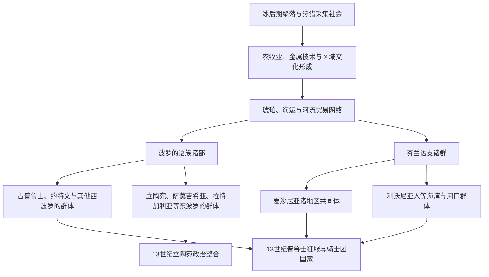

# 早期波罗的人

[返回波罗的海历史](/%E4%BA%BA%E6%96%87%E7%A7%91%E5%AD%A6/%E5%8E%86%E5%8F%B2/%E6%AC%A7%E6%B4%B2/%E6%B3%A2%E7%BD%97%E7%9A%84%E6%B5%B7/README.md)

## 时间

史前—13世纪初；“早期波罗的人”在本页是区域史称呼，并不表示这一时段存在统一的“波罗的民族”或国家。

## 概括

东波罗的海在冰后期重新有人群定居，随后经历狩猎采集、农牧业扩展、青铜器与铁器时代的长期变化。到中世纪早期，这里分布着讲波罗的语族语言的诸部、讲芬兰语支语言的爱沙尼亚人和利沃尼亚人，以及斯拉夫、斯堪的纳维亚和其他邻近人群。海岸、岛屿、湖泊与道加瓦河、涅曼河等水系把本地聚落接入琥珀贸易、斯堪的纳维亚—罗斯交通和西欧商业网络，但并未自动产生统一政权。

语言、考古文化和后来文献中的部族名称不能一一等同。史前社会没有留下本族文字编年史，许多边界、迁徙和亲缘关系只能由考古、语言学及外来记载重建，具体年代与分类仍有争议。

## 区域演进图

## 人群与语言格局

| 范围 | 主要人群或名称 | 说明与后续 |
|---|---|---|
| 今立陶宛及邻近地区 | 立陶宛人、萨莫吉希亚人；边缘另有约特文人、斯卡尔维亚人等 | 立陶宛和萨莫吉希亚诸地方共同体最终成为[立陶宛大公国](/%E4%BA%BA%E6%96%87%E7%A7%91%E5%AD%A6/%E5%8E%86%E5%8F%B2/%E6%AC%A7%E6%B4%B2/%E6%B3%A2%E7%BD%97%E7%9A%84%E6%B5%B7/%E7%AB%8B%E9%99%B6%E5%AE%9B%E5%A4%A7%E5%85%AC%E5%9B%BD.md)的核心；约特文等群体后来在战争与同化中失去独立语言共同体。 |
| 今拉脱维亚及邻近地区 | 拉特加利亚人、塞米加利亚人、塞洛尼亚人、库尔人 | 各群体的语言归属和边界并非绝对固定；库尔语究竟更接近西波罗的还是东波罗的，学界存在不同意见。它们与利沃尼亚人共同参与现代拉脱维亚民族形成。 |
| 普鲁士地区 | 古普鲁士诸部，另有约特文、斯卡尔维亚等邻接群体 | 属波罗的语族而非后来德意志语境中的“普鲁士人”；13世纪后受条顿骑士团征服，古普鲁士语约在17世纪消亡。 |
| 今爱沙尼亚、里加湾北部与芬兰湾 | 爱沙尼亚诸地方共同体、利沃尼亚人、奥塞尔岛民等芬兰语支群体 | 与拉脱维亚、立陶宛的波罗的语族不同，却共享东波罗的海政治与贸易空间。利沃尼亚人后来人数和语言使用范围显著缩小。 |
| 东部与南部邻接带 | 波洛茨克、诺夫哥罗德、普斯科夫等罗斯政治体及斯拉夫人群 | 通过贸易、贡赋、联姻、战争与传教影响道加瓦河和芬兰湾地区；不能把整个东岸视为与罗斯隔绝的封闭世界。 |
| 西部与北部海域 | 哥特兰及其他斯堪的纳维亚商人、武装集团与王权 | 既有贸易、定居和结盟，也有劫掠与征服；丹麦和瑞典王权后来直接参与北方十字军。 |

“爱沙尼亚人”“库尔人”“拉特加利亚人”等名称多来自中世纪外部文献或后来的学术归纳。它们可以指语言共同体、地域集团、政治联盟或征服者眼中的分类，不能机械理解为拥有固定国界和统一中央权力的近代民族国家。

## 社会与政治组织

- **聚落与防御**：村落、季节性资源点和山丘堡垒构成基本空间。道加瓦河沿线部分堡垒的起源可上溯青铜时代，但各遗址使用并不连续；到维京时代和中世纪早期，若干堡垒成为交换、征收贡赋与组织防御的中心。
- **地方权力**：社会由亲族、村社、地区首领和战士集团组成。较强首领可动员随从、控制堡垒和收取贡赋，但这种权力常具有个人性和地域性，尚未形成覆盖整个东岸的官僚国家。
- **生计结构**：农业、畜牧、渔猎、养蜂、手工业和林地资源并存。铁器生产、武器与首饰制作促进地方分工，海岸和河流交通则把毛皮、蜡、蜂蜜、琥珀等商品输入更远市场。
- **信仰与仪式**：地方宗教与祖先、自然地点、火、森林、水域及季节仪式有关。关于神名和祭祀的许多详细描述来自基督教化后的记载，既可能保留旧传统，也受到记录者解释框架影响。
- **战争与结盟**：堡垒争夺、劫掠、报复、贡赋和临时联盟长期并存。本地集团有时抵抗外来势力，有时借助丹麦人、德意志人或罗斯诸公对付邻敌，不能把13世纪战争简化为整齐的“本地人对外来者”两方对抗。

## 贸易网络与外部接触

### 琥珀与沿海交换

波罗的海琥珀在史前已进入中欧和地中海交换体系。“琥珀之路”不是一条固定大道，而是多条海路、河路与陆路的总称。琥珀的重要性不应掩盖毛皮、蜡、金属、盐、纺织品和人口贩运等其他交换。

### 道加瓦河与罗斯方向

道加瓦河从里加湾通向内陆，是东波罗的海最重要的交通门户之一。商人和武装集团可由此连接波洛茨克及更广阔的罗斯水路。沿河共同体既从过境贸易受益，也承受贡赋、竞争和战争压力。12世纪末德意志传教士与商人进入利沃尼亚，同样依赖这条通道。

### 斯堪的纳维亚与汉萨前身网络

维京时代的哥特兰、瑞典与丹麦方向同东岸保持贸易和军事往来。到12—13世纪，吕贝克、哥特兰与德意志商人逐渐把活动固定在港口和河口；商业利益、传教与军事保护相互叠加，为里加等城市和后来的汉萨网络奠定条件。

## 从部族社会到不同政治道路

| 压力与条件 | 爱沙尼亚、利沃尼亚和拉脱维亚大部 | 普鲁士地区 | 立陶宛方向 |
|---|---|---|---|
| 政治结构 | 多个地区共同体并立，缺少能长期整合全境的中心 | 古普鲁士诸部能够反复联合抵抗，却难以形成持久统一指挥 | 外部压力与内部竞争推动诸公整合，明道加斯在13世纪中叶建立更高层级王权 |
| 外部力量 | 里加主教、宝剑骑士团、丹麦王权和罗斯诸公相互竞争 | 波兰诸侯邀请的条顿骑士团获得持续十字军援军和制度资源 | 在骑士团、罗斯诸公与波兰之间运用战争、联姻、改宗和外交 |
| 结果 | 被纳入[利沃尼亚](/%E4%BA%BA%E6%96%87%E7%A7%91%E5%AD%A6/%E5%8E%86%E5%8F%B2/%E6%AC%A7%E6%B4%B2/%E6%B3%A2%E7%BD%97%E7%9A%84%E6%B5%B7/%E5%88%A9%E6%B2%83%E5%B0%BC%E4%BA%9A.md)的骑士团、主教区、丹麦领地和城市体系 | 经长期征服与大起义后成为[条顿骑士团国](/%E4%BA%BA%E6%96%87%E7%A7%91%E5%AD%A6/%E5%8E%86%E5%8F%B2/%E6%AC%A7%E6%B4%B2/%E6%B3%A2%E7%BD%97%E7%9A%84%E6%B5%B7/%E6%9D%A1%E9%A1%BF%E9%AA%91%E5%A3%AB%E5%9B%A2%E5%9B%BD%E4%B8%8E%E6%B3%A2%E7%BD%97%E7%9A%84%E6%B5%B7%E7%A7%A9%E5%BA%8F.md)领地 | 保持本土统治核心并向罗斯地区扩张，成为区域大国 |

差异不是由单一“民族性”造成。人口规模、堡垒网络、地理纵深、邻国关系、首领整合能力及十字军资源投入共同决定了不同结果。

## 重要转折

| 时间 | 事件 | 意义 |
|---|---|---|
| 约公元前2千纪以后 | 农牧业、金属技术和新的社会网络长期扩展 | 不同考古文化逐渐形成，但不能直接等同于后来文献中的民族。 |
| 公元1千纪 | 山丘堡垒、地区中心及海河贸易更加重要 | 为首领权力、地方联盟和跨区域冲突提供物质基础。 |
| 8—11世纪 | 斯堪的纳维亚—罗斯交通与东岸贸易活跃 | 东波罗的海成为北欧、罗斯和中欧交汇地带。 |
| 12世纪 | 罗斯诸公、丹麦与瑞典王权、德意志商人和传教士加大介入 | 原有贡赋和贸易竞争逐渐转化为带有教皇十字军授权的征服。 |
| 13世纪初 | 里加、宝剑骑士团及丹麦属爱沙尼亚形成 | 今爱沙尼亚、拉脱维亚大部进入新的领土与教会秩序。 |
| 13世纪中后期 | 普鲁士征服、立陶宛国家整合并行 | 同一外部压力下出现骑士团国家与本土大公国两种主要政治道路。 |

## 历史影响与辨析

- 现代拉脱维亚人与立陶宛人保存了两种现存波罗的语言；古普鲁士语、库尔语、塞洛尼亚语等先后消亡或融入其他语言共同体。
- 现代爱沙尼亚人不是“波罗的语族”，但属于波罗的海区域历史的重要主体；“波罗的三国”是地缘政治概念。
- 十字军征服没有使本地人口消失，却重组土地权、宗教、城市阶层和精英语言。此后数百年，德意志语精英与本地农民社会的分层成为爱沙尼亚、拉脱维亚历史的重要结构。
- 立陶宛国家形成并非所有早期波罗的诸部的简单统一；大公国既吸收部分波罗的地区，也迅速扩展到广大的东斯拉夫与正教社会。

## 演变关系

- 上级总览：[波罗的海历史](/%E4%BA%BA%E6%96%87%E7%A7%91%E5%AD%A6/%E5%8E%86%E5%8F%B2/%E6%AC%A7%E6%B4%B2/%E6%B3%A2%E7%BD%97%E7%9A%84%E6%B5%B7/README.md)。
- 后一节点：[中世纪波罗的海十字军](/%E4%BA%BA%E6%96%87%E7%A7%91%E5%AD%A6/%E5%8E%86%E5%8F%B2/%E6%AC%A7%E6%B4%B2/%E6%B3%A2%E7%BD%97%E7%9A%84%E6%B5%B7/%E4%B8%AD%E4%B8%96%E7%BA%AA%E6%B3%A2%E7%BD%97%E7%9A%84%E6%B5%B7%E5%8D%81%E5%AD%97%E5%86%9B.md)。
- 分化后续：[利沃尼亚](/%E4%BA%BA%E6%96%87%E7%A7%91%E5%AD%A6/%E5%8E%86%E5%8F%B2/%E6%AC%A7%E6%B4%B2/%E6%B3%A2%E7%BD%97%E7%9A%84%E6%B5%B7/%E5%88%A9%E6%B2%83%E5%B0%BC%E4%BA%9A.md)、[条顿骑士团国与波罗的海秩序](/%E4%BA%BA%E6%96%87%E7%A7%91%E5%AD%A6/%E5%8E%86%E5%8F%B2/%E6%AC%A7%E6%B4%B2/%E6%B3%A2%E7%BD%97%E7%9A%84%E6%B5%B7/%E6%9D%A1%E9%A1%BF%E9%AA%91%E5%A3%AB%E5%9B%A2%E5%9B%BD%E4%B8%8E%E6%B3%A2%E7%BD%97%E7%9A%84%E6%B5%B7%E7%A7%A9%E5%BA%8F.md)、[立陶宛大公国](/%E4%BA%BA%E6%96%87%E7%A7%91%E5%AD%A6/%E5%8E%86%E5%8F%B2/%E6%AC%A7%E6%B4%B2/%E6%B3%A2%E7%BD%97%E7%9A%84%E6%B5%B7/%E7%AB%8B%E9%99%B6%E5%AE%9B%E5%A4%A7%E5%85%AC%E5%9B%BD.md)。
