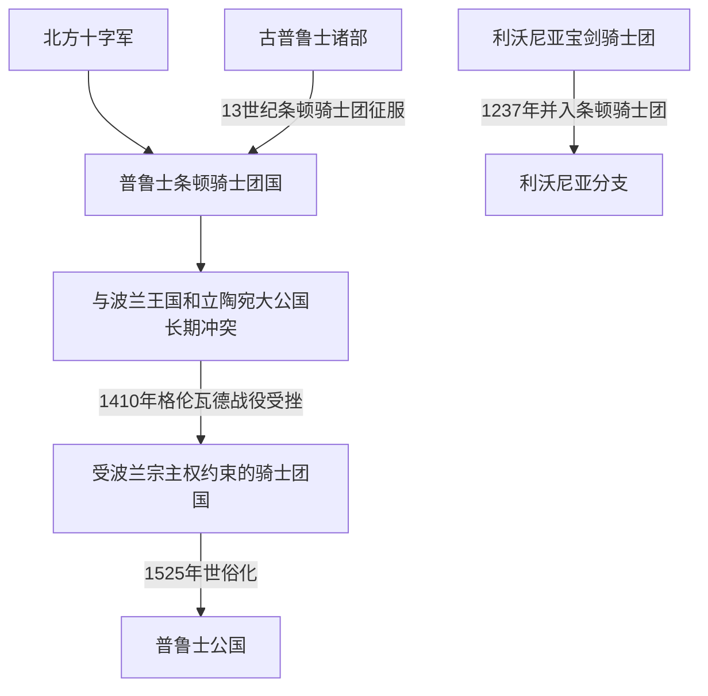

# 条顿骑士团国与波罗的海秩序

## 时间

条顿骑士团形成于12世纪末；本页重点覆盖其在普鲁士和波罗的海建立领土国家的13世纪至1525年。

## 空间范围

本页是波罗的海区域视角，重点说明古普鲁士征服、骑士团国建制、与波兰—立陶宛的竞争以及世俗化对波罗的海秩序的影响。骑士团从圣地起源到近现代延续的完整历史，参见[条顿骑士团通史](/%E4%BA%BA%E6%96%87%E7%A7%91%E5%AD%A6/%E5%8E%86%E5%8F%B2/%E6%AC%A7%E6%B4%B2/_%E9%80%9A%E5%8F%B2/%E5%8D%81%E5%AD%97%E5%86%9B%E4%B8%9C%E5%BE%81/%E5%B9%BF%E4%B9%89%E5%8D%81%E5%AD%97%E5%86%9B%E8%BF%90%E5%8A%A8/%E6%9D%A1%E9%A1%BF%E9%AA%91%E5%A3%AB%E5%9B%A2.md)。

## 概括

条顿骑士团在波罗的海东南岸征服普鲁士地区并建立骑士团国家，连接德意志移民与城市网络、普鲁士地方社会、波兰王国和立陶宛大公国历史。它既是宗教军事修会，也是拥有城堡、城市、庄园和行政体系的领土统治者。

## 地区演进图

## 建立与扩张

- 条顿骑士团征服普鲁士地区并建立骑士团国家；古普鲁士人的土地、宗教生活和政治组织在战争、移民和基督教化中受到根本改变。
- 骑士团以城堡和辖区组织统治，并推动德意志移民、城市特许状、教会建制和汉萨贸易网络扩展。
- 1237年，遭受重创的利沃尼亚宝剑骑士团并入条顿骑士团，成为具有自身地区结构的利沃尼亚分支；普鲁士骑士团国与[利沃尼亚](/%E4%BA%BA%E6%96%87%E7%A7%91%E5%AD%A6/%E5%8E%86%E5%8F%B2/%E6%AC%A7%E6%B4%B2/%E6%B3%A2%E7%BD%97%E7%9A%84%E6%B5%B7/%E5%88%A9%E6%B2%83%E5%B0%BC%E4%BA%9A.md)既有关联，也不是完全相同的政体。

## 波兰—立陶宛竞争

- 骑士团与波兰王国和立陶宛大公国长期冲突，边疆战争同时涉及宗教合法性、土地、港口和贸易控制。
- 立陶宛1387年正式基督教化后，骑士团继续以边界和政治理由作战，显示战争已不能简单解释为“基督徒对异教徒”。
- 1410年格伦瓦德战役中，波兰—立陶宛联军击败条顿骑士团，是骑士团优势转衰的重要节点。
- 1466年第二次托伦和约后，西部领地转为波兰王室普鲁士，剩余骑士团国承认波兰宗主权，波罗的海东南岸秩序由此重组。

## 世俗化与后续

1525年，骑士团国大团长阿尔布雷希特改宗路德宗并把普鲁士领地世俗化为普鲁士公国。该公国后来与勃兰登堡结合，通向勃兰登堡—普鲁士和德国历史；这条后续路线可与[德意志历史](/%E4%BA%BA%E6%96%87%E7%A7%91%E5%AD%A6/%E5%8E%86%E5%8F%B2/%E6%AC%A7%E6%B4%B2/%E5%BE%B7%E6%84%8F%E5%BF%97/README.md)对读。世俗化改变的是普鲁士领土国家，条顿骑士团作为宗教组织本身并未在1525年彻底消失。

## 关键辨析

- **条顿骑士团、骑士团国与普鲁士不是同一概念**：前者是组织，骑士团国是其领土政权，普鲁士公国则是1525年世俗化后的继承国家。
- **普鲁士人与后来的普鲁士国家不是单一民族直系延续**：古普鲁士人属于波罗的语族相关人群，后来的普鲁士国家受到德意志化、王朝联合和多地区扩张塑造。
- **普鲁士分支与利沃尼亚分支不能混写**：二者同属骑士团体系，却具有不同领地、机构和政治结局。

## 演变关系

- 区域前一节点：[中世纪波罗的海十字军](/%E4%BA%BA%E6%96%87%E7%A7%91%E5%AD%A6/%E5%8E%86%E5%8F%B2/%E6%AC%A7%E6%B4%B2/%E6%B3%A2%E7%BD%97%E7%9A%84%E6%B5%B7/%E4%B8%AD%E4%B8%96%E7%BA%AA%E6%B3%A2%E7%BD%97%E7%9A%84%E6%B5%B7%E5%8D%81%E5%AD%97%E5%86%9B.md)。
- 通史主笔记：[条顿骑士团](/%E4%BA%BA%E6%96%87%E7%A7%91%E5%AD%A6/%E5%8E%86%E5%8F%B2/%E6%AC%A7%E6%B4%B2/_%E9%80%9A%E5%8F%B2/%E5%8D%81%E5%AD%97%E5%86%9B%E4%B8%9C%E5%BE%81/%E5%B9%BF%E4%B9%89%E5%8D%81%E5%AD%97%E5%86%9B%E8%BF%90%E5%8A%A8/%E6%9D%A1%E9%A1%BF%E9%AA%91%E5%A3%AB%E5%9B%A2.md)。
- 地区并行节点：[利沃尼亚](/%E4%BA%BA%E6%96%87%E7%A7%91%E5%AD%A6/%E5%8E%86%E5%8F%B2/%E6%AC%A7%E6%B4%B2/%E6%B3%A2%E7%BD%97%E7%9A%84%E6%B5%B7/%E5%88%A9%E6%B2%83%E5%B0%BC%E4%BA%9A.md)、[立陶宛大公国](/%E4%BA%BA%E6%96%87%E7%A7%91%E5%AD%A6/%E5%8E%86%E5%8F%B2/%E6%AC%A7%E6%B4%B2/%E6%B3%A2%E7%BD%97%E7%9A%84%E6%B5%B7/%E7%AB%8B%E9%99%B6%E5%AE%9B%E5%A4%A7%E5%85%AC%E5%9B%BD.md)。
- 后续方向：普鲁士公国、勃兰登堡—普鲁士与[德意志历史](/%E4%BA%BA%E6%96%87%E7%A7%91%E5%AD%A6/%E5%8E%86%E5%8F%B2/%E6%AC%A7%E6%B4%B2/%E5%BE%B7%E6%84%8F%E5%BF%97/README.md)。
