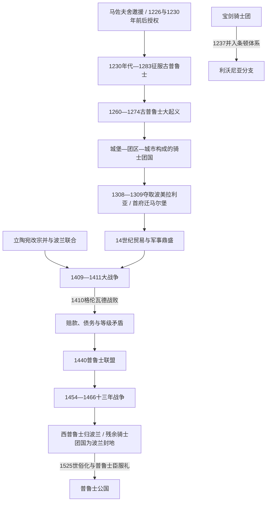

# 条顿骑士团国与波罗的海秩序

[返回波罗的海历史](/%E4%BA%BA%E6%96%87%E7%A7%91%E5%AD%A6/%E5%8E%86%E5%8F%B2/%E6%AC%A7%E6%B4%B2/%E6%B3%A2%E7%BD%97%E7%9A%84%E6%B5%B7/README.md)

## 时间

1226/1230年代—1525年。本页聚焦条顿骑士团在普鲁士建立、扩张并世俗化领土国家的过程；条顿骑士团作为宗教组织在1525年后仍继续存在，其从圣地起源到近现代的完整组织史参见[条顿骑士团通史](/%E4%BA%BA%E6%96%87%E7%A7%91%E5%AD%A6/%E5%8E%86%E5%8F%B2/%E6%AC%A7%E6%B4%B2/_%E9%80%9A%E5%8F%B2/%E5%8D%81%E5%AD%97%E5%86%9B%E4%B8%9C%E5%BE%81/%E5%B9%BF%E4%B9%89%E5%8D%81%E5%AD%97%E5%86%9B%E8%BF%90%E5%8A%A8/%E6%9D%A1%E9%A1%BF%E9%AA%91%E5%A3%AB%E5%9B%A2.md)。

## 空间范围

核心在维斯瓦河下游、古普鲁士地区和后来东、西普鲁士；骑士团也统辖德国等地的地产，并通过具有地区自主性的利沃尼亚分支参与今拉脱维亚、爱沙尼亚历史。普鲁士骑士团国与[利沃尼亚](/%E4%BA%BA%E6%96%87%E7%A7%91%E5%AD%A6/%E5%8E%86%E5%8F%B2/%E6%AC%A7%E6%B4%B2/%E6%B3%A2%E7%BD%97%E7%9A%84%E6%B5%B7/%E5%88%A9%E6%B2%83%E5%B0%BC%E4%BA%9A.md)相连却不是同一政体。

## 概括

条顿骑士团国是军事修会统治的领土国家。骑士团应马佐夫舍公爵邀援进入海乌姆诺地区，在帝国、教皇和地方特许的重叠授权下征服古普鲁士诸部，以城堡、团区、主教区、城市法和移民聚落组织统治。它在14世纪控制从维斯瓦河口到立陶宛边疆的重要海岸，凭贸易、庄园收入和跨欧洲修会网络达到鼎盛。

其衰落不是1410年一战即亡：格伦瓦德惨败后，骑士团仍靠马尔堡要塞保住国家，但战争赔款、雇佣军、等级反抗和十字军合法性衰退持续侵蚀统治。1454—1466年十三年战争使西普鲁士转归波兰，残余骑士团国成为波兰王冠封地；1519—1521年最后战争失败后，大团长阿尔布雷希特于1525年改宗路德宗，将领地世俗化为普鲁士公国。

## 演进图

## 建立背景与合法性

### 马佐夫舍边境危机

13世纪初，马佐夫舍公爵康拉德与古普鲁士诸部在海乌姆诺边境反复战争。他曾支持本地多布任骑士团，但效果有限，遂邀请条顿骑士团。康拉德希望获得可靠边防力量；条顿骑士团则吸取此前匈牙利经历中被王权驱逐的教训，要求取得不受地方公爵任意收回的书面权利。

### 重叠授权

- 1226年神圣罗马皇帝腓特烈二世的“里米尼金玺诏书”确认骑士团对海乌姆诺及未来普鲁士征服地的权利。
- 康拉德与骑士团约在1230年前后形成土地转让安排，常以《克鲁什维茨条约》概括；现存文本的形成时间和真伪细节有史学争议。
- 1234年教皇格列高利九世把普鲁士征服地置于圣座保护下，强化骑士团不只是波兰公爵属臣的主张。
- 多重授权互相补强，也为后来波兰王权与骑士团关于宗主权的争端埋下根源。

## 征服与古普鲁士抵抗

### 逐堡推进（1230年代—1240年代）

首任普鲁士地区团长赫尔曼·巴尔克沿维斯瓦河和维斯瓦潟湖建立托伦、海乌姆诺、埃尔布隆格等据点。城堡既是驻军点，也是仓储、法庭和征税中心；海路与河运使骑士团能在陆地受阻时继续补给。来自德意志及西欧的季节性十字军、波兰盟军、受洗的普鲁士人和移民共同参与征服。

1242—1249年第一次普鲁士大规模反抗与波美拉尼亚公爵希温托佩乌克的战争交织。1249年《基督堡条约》向受洗普鲁士人承诺财产、继承和教会权利，但战后秩序仍由骑士团掌握，协议执行范围有限。

### 古普鲁士大起义（1260—1274）

1260年骑士团在杜尔贝战役败给萨莫吉希亚人，触发桑比亚、纳坦吉亚、瓦尔米亚、巴尔蒂亚等古普鲁士地区起义。赫尔库斯·蒙特等首领曾摧毁小据点并长期围城。骑士团的石堡、海上补给和西欧新援军使其避免全面崩溃；各部缺少统一常设指挥，围城能力和粮秣有限。1274年前后主要起义被镇压，1283年通常视为普鲁士征服完成，但边疆抵抗、逃亡和同化仍延续。

### 人口与文化后果

征服造成死亡、俘虏和向立陶宛等地迁徙。部分古普鲁士贵族受洗后保有或重获土地，更多乡村人口进入修会、主教或贵族庄园。德意志、波兰、荷兰等移民进入城市和部分乡村，古普鲁士语在长期多语接触、人口损失与德意志化中衰退，约17世纪消亡。不能把这一过程简化为古普鲁士人立即被全部消灭或被单一移民群体完全替换。

## 国家结构

| 层级或群体 | 职权与运作 |
|---|---|
| 大团长 | 由修会高级成员选举，是修会和领土国家最高首脑；与总会议及高级职官共同决策。1309年后大团长常驻马尔堡，使全球修会组织中心与普鲁士政府重合。 |
| 大团长会议与高级职官 | 大司令、大医院长、大司库等管理军事、慈善、财政和中央事务；修会誓愿和集体选举使其不同于世袭王朝。 |
| 普鲁士地区团长与团区长官 | 早期由地区团长统筹征服，后由各城堡团区管理庄园、税赋、司法、军役和仓储。团区构成日常行政骨架。 |
| 主教区与教士会 | 1243年后普鲁士划为多个教区，主教和教士会拥有大片世俗领地；与骑士团共享基督教化，却在土地和任命上保有自身利益。 |
| 城市与汉萨商人 | 托伦、海乌姆诺、埃尔布隆格、但泽、柯尼斯堡等依城市法自治，经营港口、手工业和远程贸易；后期因税负和司法冲突成为反骑士团核心。 |
| 德意志、普鲁士与波兰贵族 | 以封地换取军役，形成地方地主等级；族源、语言和政治立场不完全一致。 |
| 古普鲁士自由人、农民与移民农户 | 承担地租、劳役、贡赋和辅助军役，法律地位因受洗时间、特许与领主不同；庄园化在中后期加深。 |
| 利沃尼亚分支 | 有自己的地区团长、会议和领地，服从大团长的程度随时期变化；1410年决定性会战中利沃尼亚主力并未到场，显示分支并非普鲁士中央可随意调动的省军。 |

## 经济、城市与鼎盛

### 城堡与庄园财政

骑士团直接经营大片庄园，征收谷物、牲畜、蜂蜡、木材与货币地租，并以统一仓储和账簿调配军粮。其行政纪律和跨地区地产为早期扩张提供优势，但国家收入也高度依赖农业、贸易和战争征服，一旦长期赔款与雇佣军开支上升便容易失衡。

### 城市与波罗的海贸易

维斯瓦河把波兰腹地谷物、木材等商品送往但泽和西欧。托伦、埃尔布隆格、柯尼斯堡等参与汉萨贸易，盐、布匹、金属、琥珀、蜡和毛皮往来活跃。城市繁荣扩大税基，也使市民拥有独立财富、武装和跨国关系，后期足以挑战修会政府。

### 14世纪高峰

在温里希·冯·克尼普罗德任大团长时期，修会行政、贸易和军事声望达到高峰。骑士团定期对立陶宛发动“旅行远征”，吸引西欧贵族参加，以十字军身份和宫廷荣誉维持国际网络。但这种远征未能征服立陶宛，反而不断消耗边境并促使波兰—立陶宛合作。

## 领土扩张与波兰冲突

### 但泽与波美拉利亚（1308—1309）

1308年，骑士团以援助波兰守卫但泽为名进入波美拉利亚，继而占领城市和地区；但泽攻占中的杀戮规模在各国史学与文献中有争议，但暴力清洗和夺城本身无疑。1309年骑士团从勃兰登堡方面取得其有争议的权利主张，并把大团长驻地由威尼斯迁到马尔堡。

占据维斯瓦河口切断波兰部分出海通道，使原盟友关系转为长期敌对。1343年《卡利什和约》暂时确认骑士团占有波美拉利亚，但波兰并未放弃历史权利和政治诉求。

### 立陶宛战争

骑士团试图控制萨莫吉希亚，以连接普鲁士与利沃尼亚分支。立陶宛大公也袭击普鲁士和利沃尼亚边疆。1386年约盖拉受洗成为波兰国王，1387年立陶宛核心正式天主教化，骑士团的异教十字军理由受损；它仍以萨莫吉希亚归属、改宗是否真实和边界争议继续战争。

## 从格伦瓦德到十三年战争

### 1409—1411年大战争

1409年萨莫吉希亚起义触发骑士团与波兰—立陶宛全面战争。1410年格伦瓦德战役中，大团长乌尔里希·冯·容金根及大量高级骑士阵亡。波兰—立陶宛联军随后围攻马尔堡，海因里希·冯·普劳恩组织防守，避免国家立即灭亡。

1411年第一次托伦和约领土变化有限，却要求巨额赔款和赎金。骑士团为支付战争成本加税、借债并依赖雇佣军，城市、贵族和修会政府矛盾加深。1414年饥饿战争、1422年戈卢布战争等继续消耗国力；《梅尔诺和约》确认萨莫吉希亚大体归立陶宛，骑士团连接普鲁士与利沃尼亚的战略目标失败。

### 普鲁士联盟与十三年战争（1440—1466）

1440年城市和乡绅组成普鲁士联盟，反对修会税收与司法。大团长试图借皇帝和教皇压制联盟，联盟于1454年向波兰国王卡齐米日四世请求并入，爆发十三年战争。

骑士团早期依靠职业雇佣军获胜，却无力足额付薪。1457年雇佣军把马尔堡等据点交给波兰，骑士团政府迁往柯尼斯堡。长期围城、海战、税赋和债务最终耗尽双方，1466年第二次托伦和约结束战争：

- 波美拉利亚、海乌姆诺、马尔堡、埃尔布隆格和瓦尔米亚等组成王室普鲁士，归波兰王冠。
- 骑士团保留东部普鲁士，但大团长须向波兰国王效忠，国家成为波兰封地。
- 修会与神圣罗马帝国、教皇和波兰之间的主权解释仍有争议，但实际独立性显著下降。

## 最后危机与1525年世俗化

### 改革失败与最后战争

1466年后，大团长常试图借德意志诸侯背景摆脱向波兰效忠。国家领土缩小、财政受限，城市和地方等级的议价能力增强。1511年霍亨索伦家族的阿尔布雷希特当选大团长，希望获得帝国及家族援助。

1519—1521年骑士团同波兰进行最后一场战争，未能改变力量对比，停战后阿尔布雷希特前往德意志寻求支持并接触宗教改革思想。军事复兴无望和修会内部资源不足，使世俗化成为现实出路。

### 《克拉科夫条约》与普鲁士臣服礼

1525年阿尔布雷希特改宗路德宗，辞去领土大团长身份，把骑士团普鲁士世俗化为世袭的普鲁士公国，并在克拉科夫向波兰国王西吉斯蒙德一世行臣服礼。普鲁士公国成为欧洲早期正式路德宗国家之一。

这次变化终结的是普鲁士骑士团国，而非条顿骑士团组织本身。帝国内其他修会领地与天主教成员拒绝承认世俗化，继续选举大团长；利沃尼亚分支则到1561年才在利沃尼亚战争中解体。

## 重要事件

| 时间 | 事件 | 结果与意义 |
|---|---|---|
| 1226—1234年 | 帝国、地方公爵与教皇多重授权 | 骑士团获得建立独立领土权力的法理资源。 |
| 1230年代—1283年 | 普鲁士征服 | 城堡、教区和城市网络取代古普鲁士部族政治。 |
| 1260—1274年 | 古普鲁士大起义 | 起义最终失败，骑士团统治得以巩固。 |
| 1308—1309年 | 占领波美拉利亚，首府迁马尔堡 | 国家控制维斯瓦河口，亦使波兰成为持久敌手。 |
| 1386—1387年 | 波兰—立陶宛联合与立陶宛改宗 | 十字军合法性削弱，骑士团面对更强的联合国家。 |
| 1410年 | 格伦瓦德战役 | 主力和领导层遭重创，马尔堡守住使国家免于立即灭亡。 |
| 1411—1422年 | 赔款与后续战争 | 财政恶化，萨莫吉希亚战略失败。 |
| 1440年 | 普鲁士联盟成立 | 城市和乡绅把不满转化为跨等级政治组织。 |
| 1454—1466年 | 十三年战争 | 西普鲁士丧失，残余国家成为波兰封地。 |
| 1519—1521年 | 最后波兰—骑士团战争 | 无法恢复主权，为世俗化铺路。 |
| 1525年 | 普鲁士臣服礼与世俗化 | 普鲁士公国继承领土，骑士团组织在其他地区延续。 |

## 关键大团长与地区统治者

骑士团国不是世袭王朝，下表按职务顺序列出改变普鲁士国家走向的关键大团长和地区长官；完整组织领袖表由[条顿骑士团通史](/%E4%BA%BA%E6%96%87%E7%A7%91%E5%AD%A6/%E5%8E%86%E5%8F%B2/%E6%AC%A7%E6%B4%B2/_%E9%80%9A%E5%8F%B2/%E5%8D%81%E5%AD%97%E5%86%9B%E4%B8%9C%E5%BE%81/%E5%B9%BF%E4%B9%89%E5%8D%81%E5%AD%97%E5%86%9B%E8%BF%90%E5%8A%A8/%E6%9D%A1%E9%A1%BF%E9%AA%91%E5%A3%AB%E5%9B%A2.md)维护。

| 顺序 | 人物 | 职务与任期 | 关键事件 |
|---:|---|---|---|
| 1 | 赫尔曼·冯·萨尔察 | 大团长，1209—1239年 | 取得帝国与教皇支持，选择普鲁士作为领土建设中心。 |
| 2 | 赫尔曼·巴尔克 | 普鲁士地区团长，约1230—1239年 | 建立最初城堡和城市，领导征服早期阶段；并在1237年组织利沃尼亚分支。 |
| 3 | 西格弗里德·冯·福伊希特旺根 | 大团长，1303—1311年 | 1309年把大团长驻地迁至马尔堡，完成普鲁士国家中央化象征。 |
| 4 | 温里希·冯·克尼普罗德 | 大团长，1351—1382年 | 统治期常被视为行政、贸易和军事声望高峰。 |
| 5 | 康拉德·冯·容金根 | 大团长，1393—1407年 | 在扩张与外交间维持强势，取得萨莫吉希亚权利但冲突加剧。 |
| 6 | 乌尔里希·冯·容金根 | 大团长，1407—1410年 | 发动大战争并死于格伦瓦德战役。 |
| 7 | 海因里希·冯·普劳恩 | 大团长，1410—1413年 | 组织马尔堡防御，保住国家；因集权和税赋政策被修会内部罢黜。 |
| 8 | 路德维希·冯·埃利希斯豪森 | 大团长，1450—1467年 | 十三年战争期间失去马尔堡，接受第二次托伦和约。 |
| 9 | 弗里德里希·冯·萨克森 | 大团长，1498—1510年 | 依靠诸侯身份拒绝向波兰效忠，争取帝国支持但未能改变格局。 |
| 10 | **阿尔布雷希特·冯·霍亨索伦** | 末任普鲁士领土大团长，1511—1525年；普鲁士公爵，1525—1568年 | 最后战争失败后改宗并世俗化，成为普鲁士公国首任世袭公爵。 |

## 崛起机制

1. **多重合法性**：帝国、教皇和地方公爵授权使征服兼具宗教与领土法理。
2. **跨欧洲修会网络**：德意志等地地产、招募和贵族关系提供人员与资金。
3. **城堡—河海后勤**：沿维斯瓦和海岸逐堡推进，避免在单次战败后失去全部据点。
4. **城市法与移民**：特许城市吸引资本、技术和人口，扩大税基与贸易。
5. **书面行政**：团区账目、仓储和集体纪律提高资源调度能力。
6. **利用地方分裂**：同部分古普鲁士首领和波兰诸侯结盟，各个击破抵抗。

## 衰落与灭亡原因

### 结构因素

- 修会国家的统治精英是人数有限、主要从境外补充且不世袭的骑士团成员，难以充分吸纳日益富裕的本地城市与乡绅。
- 城市和等级承担税赋，却缺少与其财富相称的中央决策权，最终另组普鲁士联盟。
- 长期立陶宛战争没有实现领土连接目标，消耗边疆资源；立陶宛改宗后宗教动员吸引力下降。
- 火器、要塞和雇佣军使战争费用激增，传统庄园与修会地产收入不足。

### 外部压力

- 波兰与立陶宛联合后具有人口、财政和战略纵深优势。
- 骑士团夺取波美拉利亚把波兰从潜在盟友变为无法和解的长期对手。
- 教皇、皇帝、德意志诸侯与波兰的利益不一致，骑士团难以再获得13世纪那种集中十字军援助。

### 直接触发

- 1410年格伦瓦德战败摧毁主力并引发赔款危机，但马尔堡守住使国家延续。
- 1454年普鲁士联盟叛离把内部等级冲突转化为国际战争；无力支付雇佣军导致首府丧失。
- 1466年后主权与财政基础缩水，1519—1521年战争证明军事复兴失败。
- 1525年阿尔布雷希特选择改宗和世俗化，是统治形式的主动转换，也是骑士团国无法继续维持的直接终点。

## 长期影响与辨析

- **古普鲁士人与后来普鲁士国家不是同一民族概念**：前者讲波罗的语言；“普鲁士”后来成为多语领土和德意志王朝国家名称。
- **条顿骑士团、骑士团国、利沃尼亚分支和普鲁士公国不能互换**：组织跨越多地，领土政权有不同制度结局。
- **1410年不是国家灭亡年**：骑士团国又延续115年，真正决定其政治形式的是财政危机、等级叛乱、1466年和约与1525年世俗化。
- **征服兼有基督教化、殖民与国家建设**：受洗不排除强制，城市发展也不能抵消土地剥夺与长期文化同化。
- 普鲁士公国后来与勃兰登堡组成王朝联合，通向勃兰登堡—普鲁士；后续可与[德意志历史](/%E4%BA%BA%E6%96%87%E7%A7%91%E5%AD%A6/%E5%8E%86%E5%8F%B2/%E6%AC%A7%E6%B4%B2/%E5%BE%B7%E6%84%8F%E5%BF%97/README.md)对读。

## 演变关系

- 区域前一节点：[中世纪波罗的海十字军](/%E4%BA%BA%E6%96%87%E7%A7%91%E5%AD%A6/%E5%8E%86%E5%8F%B2/%E6%AC%A7%E6%B4%B2/%E6%B3%A2%E7%BD%97%E7%9A%84%E6%B5%B7/%E4%B8%AD%E4%B8%96%E7%BA%AA%E6%B3%A2%E7%BD%97%E7%9A%84%E6%B5%B7%E5%8D%81%E5%AD%97%E5%86%9B.md)。
- 并行节点：[利沃尼亚](/%E4%BA%BA%E6%96%87%E7%A7%91%E5%AD%A6/%E5%8E%86%E5%8F%B2/%E6%AC%A7%E6%B4%B2/%E6%B3%A2%E7%BD%97%E7%9A%84%E6%B5%B7/%E5%88%A9%E6%B2%83%E5%B0%BC%E4%BA%9A.md)、[立陶宛大公国](/%E4%BA%BA%E6%96%87%E7%A7%91%E5%AD%A6/%E5%8E%86%E5%8F%B2/%E6%AC%A7%E6%B4%B2/%E6%B3%A2%E7%BD%97%E7%9A%84%E6%B5%B7/%E7%AB%8B%E9%99%B6%E5%AE%9B%E5%A4%A7%E5%85%AC%E5%9B%BD.md)。
- 组织主笔记：[条顿骑士团通史](/%E4%BA%BA%E6%96%87%E7%A7%91%E5%AD%A6/%E5%8E%86%E5%8F%B2/%E6%AC%A7%E6%B4%B2/_%E9%80%9A%E5%8F%B2/%E5%8D%81%E5%AD%97%E5%86%9B%E4%B8%9C%E5%BE%81/%E5%B9%BF%E4%B9%89%E5%8D%81%E5%AD%97%E5%86%9B%E8%BF%90%E5%8A%A8/%E6%9D%A1%E9%A1%BF%E9%AA%91%E5%A3%AB%E5%9B%A2.md)。
- 后续方向：普鲁士公国、勃兰登堡—普鲁士与[德意志历史](/%E4%BA%BA%E6%96%87%E7%A7%91%E5%AD%A6/%E5%8E%86%E5%8F%B2/%E6%AC%A7%E6%B4%B2/%E5%BE%B7%E6%84%8F%E5%BF%97/README.md)。
