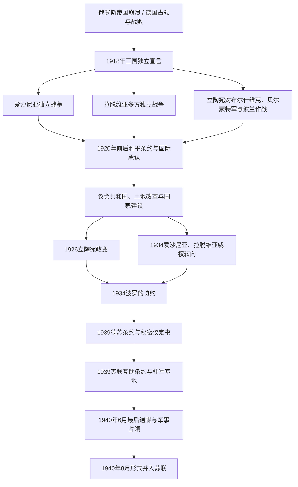

# 波罗的三国独立

[返回波罗的海历史](/%E4%BA%BA%E6%96%87%E7%A7%91%E5%AD%A6/%E5%8E%86%E5%8F%B2/%E6%AC%A7%E6%B4%B2/%E6%B3%A2%E7%BD%97%E7%9A%84%E6%B5%B7/README.md)

## 时间

1917—1940年。三国分别在1918年宣布或恢复国家独立，1918—1920年通过战争和外交巩固；苏联于1940年6月占领并在8月完成形式上的并入。爱沙尼亚、拉脱维亚和立陶宛的独立并非同日同步建成，边界、政体和威权化路径也各不相同。

## 概括

第一次世界大战、俄罗斯帝国崩溃和德国战败打破东波罗的海旧统治。三国的民族议会、政党、军人和地方行政在德军、布尔什维克、德意志地方武装、白军及波兰军队夹缝中建立国家。土地改革削弱德意志或波兰语大地产，普选制和议会政治扩大公民参与，文化自治、学校与本国语行政塑造新国家。

脆弱的安全环境、经济危机、政党碎片化和反共恐惧又推动政体转向：立陶宛1926年政变后由安塔纳斯·斯梅托纳长期统治，爱沙尼亚和拉脱维亚均在1934年进入威权体制。三国1934年建立波罗的协约，却无法抵消德国和苏联的力量。1939年德苏秘密划分势力范围，苏联以基地条约、最后通牒、驻军和受控选举完成吞并；西方多国不承认其合法性，成为1990—1991年“恢复独立”主张的法理基础。

## 演进图

## 国家形成与独立战争

### 爱沙尼亚

爱沙尼亚省级自治机构在1917年形成，救国委员会于1918年2月24日宣布共和国。德军次日进入塔林，临时政府直到德国在一战战败后才恢复公开活动。1918年11月红军进攻纳尔瓦，爱沙尼亚军在约翰·拉伊多内尔指挥下动员，并得到英国海军、芬兰志愿者及其他外援。

1919年初爱沙尼亚军把红军逐出本土，随后在拉脱维亚北部同布尔什维克和波罗的德意志地方军交战。1919年6月文登战役中，爱沙尼亚—拉脱维亚方面击败德意志 Landeswehr 势力，帮助恢复卡尔利斯·乌尔马尼斯政府。1920年2月2日《塔尔图和约》结束爱沙尼亚—苏俄战争，苏俄承认爱沙尼亚独立。详见[爱沙尼亚第一共和国](/%E4%BA%BA%E6%96%87%E7%A7%91%E5%AD%A6/%E5%8E%86%E5%8F%B2/%E6%AC%A7%E6%B4%B2/%E6%B3%A2%E7%BD%97%E7%9A%84%E6%B5%B7/%E7%88%B1%E6%B2%99%E5%B0%BC%E4%BA%9A/%E7%88%B1%E6%B2%99%E5%B0%BC%E4%BA%9A%E7%AC%AC%E4%B8%80%E5%85%B1%E5%92%8C%E5%9B%BD.md)。

### 拉脱维亚

拉脱维亚人民委员会于1918年11月18日在里加宣布共和国。红军迅速占领大部国土，临时政府退守利耶帕亚并依赖德意志志愿军和协约国海军；盟军内部很快围绕谁应掌握国家发生冲突。

1919年4月德意志地方势力发动政变并扶植安德里耶夫斯·涅德拉政府。6月文登战役后，爱沙尼亚军和拉脱维亚北部旅迫使德军退却，乌尔马尼斯政府恢复。10—11月，帕维尔·贝尔蒙特-阿瓦洛夫率西俄志愿军进攻里加，被拉脱维亚军击退；1920年初拉脱维亚与波兰合作收复拉特加尔。8月11日与苏俄签订和平条约，独立战争结束。详见[拉脱维亚第一次共和国](/%E4%BA%BA%E6%96%87%E7%A7%91%E5%AD%A6/%E5%8E%86%E5%8F%B2/%E6%AC%A7%E6%B4%B2/%E6%B3%A2%E7%BD%97%E7%9A%84%E6%B5%B7/%E6%8B%89%E8%84%B1%E7%BB%B4%E4%BA%9A/%E7%AC%AC%E4%B8%80%E6%AC%A1%E5%85%B1%E5%92%8C%E5%9B%BD%E3%80%81%E7%8B%AC%E7%AB%8B%E6%88%98%E4%BA%89%E4%B8%8E%E5%A8%81%E6%9D%83%E8%BD%AC%E5%90%91.md)。

### 立陶宛

立陶宛委员会于1918年2月16日宣布恢复独立国家。德国当局限制其施政；1918年11月德国战败后，政府才组织军队和行政。1919年立陶宛同时面对布尔什维克、德意志—俄国贝尔蒙特军和波兰军队，战线与内政彼此交织。

立陶宛军在1919年逐步击退布尔什维克和贝尔蒙特军；1920年7月12日苏俄和约承认立陶宛并把维尔纽斯划入其主张范围。波兰将军卢齐扬·热利戈夫斯基在毕苏斯基默许下于同年10月夺取维尔纽斯，建立中立陶宛，1922年并入波兰。立陶宛政府以考纳斯为临时首都，拒绝承认既成边界。1923年克莱佩达起义后，立陶宛接管协约国管理的克莱佩达地区，并在国际安排下给予自治。详见[立陶宛第一次共和国](/%E4%BA%BA%E6%96%87%E7%A7%91%E5%AD%A6/%E5%8E%86%E5%8F%B2/%E6%AC%A7%E6%B4%B2/%E6%B3%A2%E7%BD%97%E7%9A%84%E6%B5%B7/%E7%AB%8B%E9%99%B6%E5%AE%9B/%E7%AC%AC%E4%B8%80%E6%AC%A1%E5%85%B1%E5%92%8C%E5%9B%BD%E3%80%81%E6%88%98%E4%BA%89%E4%B8%8E%E5%8D%A0%E9%A2%86.md)。

## 独立巩固的关键条约与边界

| 时间 | 国家或区域 | 事件 | 结果 |
|---|---|---|---|
| 1918-02-16 | 立陶宛 | 独立法案 | 宣布恢复以维尔纽斯为首都的民主国家。 |
| 1918-02-24 | 爱沙尼亚 | 独立宣言 | 宣布建立独立民主共和国；随即经历德国占领。 |
| 1918-11-18 | 拉脱维亚 | 共和国成立 | 人民委员会授权乌尔马尼斯临时政府。 |
| 1919-06 | 爱沙尼亚、拉脱维亚 | 文登战役 | 击败德意志地方军，阻止其控制拉脱维亚。 |
| 1919-11 | 拉脱维亚 | 击败贝尔蒙特军 | 里加和西部国家机构得以稳定。 |
| 1920-02-02 | 爱沙尼亚 | 《塔尔图和约》 | 苏俄承认爱沙尼亚独立并划定边界。 |
| 1920-07-12 | 立陶宛 | 立苏和约 | 苏俄承认立陶宛；维尔纽斯归属仍受波兰—立陶宛战争改变。 |
| 1920-08-11 | 拉脱维亚 | 拉俄和平条约 | 苏俄放弃对拉脱维亚的主权主张。 |
| 1920-10 | 立陶宛、波兰 | 热利戈夫斯基夺取维尔纽斯 | 两国长期不建立正常外交关系，区域安全合作受阻。 |
| 1921年 | 三国 | 加入国际联盟 | 获得广泛国际承认和多边外交平台。 |
| 1923—1924年 | 立陶宛 | 接管克莱佩达及自治公约 | 获得重要港口，同时承担保护地方自治与少数群体义务。 |

## 议会共和国与社会重建

### 宪政

- 爱沙尼亚1920年宪法建立议会中心体制，国家元首与政府首脑合一为“国务长老”；频繁联合政府反映多党代表性，也造成内阁寿命短。
- 拉脱维亚1922年宪法设置议会选举的总统和对议会负责的内阁，比例代表制使多党联盟成为常态。
- 立陶宛1920年制宪议会与1922年宪法建立议会共和国，总统由议会选出；1926年政变后，1928年、1938年宪制逐步扩大总统权力。

### 土地改革

三国都把大庄园分割给无地和少地农民、独立战争军人及国家机构。爱沙尼亚和拉脱维亚主要触动波罗的德意志地产，立陶宛主要限制波兰语或本地大地主。改革建立数量庞大的自耕农，为国家提供社会基础；补偿、生产规模和少数族群财产权也引起争议。

### 少数群体与公民国家

新边界内有德意志人、俄罗斯人、波兰人、犹太人、白俄罗斯人、瑞典人等群体。爱沙尼亚1925年文化自治法为达到人口门槛的少数民族提供文化自治机制；拉脱维亚和立陶宛也曾以学校、宗教和社团权利安排少数群体，但土地、语言、维尔纽斯和克莱佩达争端使政策逐渐收紧。三国建国既有民族自决，也面临如何把多语居民纳入公民共同体的问题。

## 经济与外交

- 土地改革使农业以小农和合作社为基础，黄油、培根、亚麻、木材等出口依赖英国、德国及区域市场。
- 塔林、里加、考纳斯和克莱佩达发展工业与交通；里加一战前工业大量撤迁，恢复过程尤其艰难。
- 1929年后世界经济危机压低农产品价格，失业和债务加重，为威权政治提供口实；1930年代国家干预和贸易协定又带来一定复苏。
- 三国寻求国际联盟、英国和法国保障，同时担忧苏联、德国与波兰。立陶宛同波兰的维尔纽斯争端使三国安全合作长期受限。
- 1934年爱沙尼亚、拉脱维亚和立陶宛签订协商合作条约，建立波罗的协约；它是外交协调机制，没有共同军队、统一作战计划或大国保障。

## 从议会政治到威权统治

| 国家 | 转折 | 过程 | 实际权力结构 |
|---|---|---|---|
| 立陶宛 | 1926-12-17军事政变 | 军方与民族主义者推翻格里纽斯政府，斯梅托纳重新任总统；沃尔德马拉斯任总理，1929年后被排挤 | 总统斯梅托纳居核心，民族主义联盟、官僚和军队支撑；议会被长期搁置，1936年以受控选举恢复。 |
| 爱沙尼亚 | 1934-03-12“自我政变” | 退伍军人联盟可能赢得选举背景下，帕茨宣布紧急状态、逮捕反对者并推迟选举 | 帕茨、军队总司令拉伊多内尔与政府官僚共治；1938年新宪法后帕茨任总统，有限议会恢复。 |
| 拉脱维亚 | 1934-05-15政变 | 乌尔马尼斯解散议会、禁止政党并以紧急状态统治 | 乌尔马尼斯兼任总理，1936年后又行使总统职权；行政、商会和国家社团取代党派竞争。 |

威权转向并非苏联入侵的必然原因，也不能只归结为“民族性”。短期内它提高决策集中度、推广国家文化与经济组织，却取消公开问责和合法反对力量；1940年危机时，社会缺少经选举授权的讨论渠道，三位领导人都选择避免军事抵抗，但根本决定因素仍是德苏压倒性力量和国际孤立。

## 国家元首与政府首脑

本节保持角色分离并按任期顺序列全。爱沙尼亚1920—1934年的国务长老依法同时承担国家元首和政府首脑职能，因此同一序列不重复抄成两表。各届内阁成员、代任日期与国家连续性争议详见[爱沙尼亚共和国国家元首与政府首脑表](/%E4%BA%BA%E6%96%87%E7%A7%91%E5%AD%A6/%E5%8E%86%E5%8F%B2/%E6%AC%A7%E6%B4%B2/%E6%B3%A2%E7%BD%97%E7%9A%84%E6%B5%B7/%E7%88%B1%E6%B2%99%E5%B0%BC%E4%BA%9A/%E7%88%B1%E6%B2%99%E5%B0%BC%E4%BA%9A%E5%85%B1%E5%92%8C%E5%9B%BD%E5%9B%BD%E5%AE%B6%E5%85%83%E9%A6%96%E4%B8%8E%E6%94%BF%E5%BA%9C%E9%A6%96%E8%84%91%E8%A1%A8.md)、[拉脱维亚现代国家元首与政府首脑表](/%E4%BA%BA%E6%96%87%E7%A7%91%E5%AD%A6/%E5%8E%86%E5%8F%B2/%E6%AC%A7%E6%B4%B2/%E6%B3%A2%E7%BD%97%E7%9A%84%E6%B5%B7/%E6%8B%89%E8%84%B1%E7%BB%B4%E4%BA%9A/%E6%8B%89%E8%84%B1%E7%BB%B4%E4%BA%9A%E7%8E%B0%E4%BB%A3%E5%9B%BD%E5%AE%B6%E5%85%83%E9%A6%96%E4%B8%8E%E6%94%BF%E5%BA%9C%E9%A6%96%E8%84%91%E8%A1%A8.md)、[立陶宛现代国家元首与政府首脑表](/%E4%BA%BA%E6%96%87%E7%A7%91%E5%AD%A6/%E5%8E%86%E5%8F%B2/%E6%AC%A7%E6%B4%B2/%E6%B3%A2%E7%BD%97%E7%9A%84%E6%B5%B7/%E7%AB%8B%E9%99%B6%E5%AE%9B/%E7%AB%8B%E9%99%B6%E5%AE%9B%E7%8E%B0%E4%BB%A3%E5%9B%BD%E5%AE%B6%E5%85%83%E9%A6%96%E4%B8%8E%E6%94%BF%E5%BA%9C%E9%A6%96%E8%84%91%E8%A1%A8.md)。

### 爱沙尼亚国家元首兼政府首脑序列

| 顺序 | 人物 | 任期 | 职务与备注 |
|---:|---|---|---|
| 1 | 康斯坦丁·帕茨 | 1918-02-24—1919-05-09 | 临时政府总理，总统府按国家元首连续序列计。 |
| 2 | 奥托·斯特兰德曼 | 1919-05-09—1919-11-18 | 总理。 |
| 3 | 扬·托尼松 | 1919-11-18—1920-07-28 | 总理，首次。 |
| 4 | 阿杜·比尔克 | 1920-07-28—1920-07-30 | 总理，任期极短。 |
| 5 | 扬·托尼松 | 1920-07-30—1920-10-26 | 总理，第二次。 |
| 6 | 安茨·皮普 | 1920-10-26—1921-01-25 | 12月20日前为总理，此后为国务长老。 |
| 7 | 康斯坦丁·帕茨 | 1921-01-25—1922-11-21 | 国务长老，第二段国家元首任期。 |
| 8 | 尤汉·库克 | 1922-11-21—1923-08-02 | 国务长老。 |
| 9 | 康斯坦丁·帕茨 | 1923-08-02—1924-03-26 | 国务长老，第三段。 |
| 10 | 弗里德里希·阿克尔 | 1924-03-26—1924-12-16 | 国务长老。 |
| 11 | 尤里·雅克松 | 1924-12-16—1925-12-15 | 国务长老。 |
| 12 | 扬·特曼特 | 1925-12-15—1927-12-09 | 国务长老，连续主持三届内阁。 |
| 13 | 扬·托尼松 | 1927-12-09—1928-12-04 | 国务长老，第三次。 |
| 14 | 奥古斯特·雷伊 | 1928-12-04—1929-07-09 | 国务长老。 |
| 15 | 奥托·斯特兰德曼 | 1929-07-09—1931-02-12 | 国务长老，第二段执政。 |
| 16 | 康斯坦丁·帕茨 | 1931-02-12—1932-02-19 | 国务长老，第四段。 |
| 17 | 扬·特曼特 | 1932-02-19—1932-07-19 | 国务长老，第二段。 |
| 18 | 卡尔·艾因邦德，1935年改名卡雷尔·恩帕卢 | 1932-07-19—1932-11-01 | 国务长老。 |
| 19 | 康斯坦丁·帕茨 | 1932-11-01—1933-05-18 | 国务长老，第五段。 |
| 20 | 扬·托尼松 | 1933-05-18—1933-10-21 | 国务长老，第四次。 |
| 21 | **康斯坦丁·帕茨** | 1933-10-21—1940-06-17 | 先后为国务长老、代行国务长老职权的总理、国家保护者；1938-04-24起为总统。 |

1938年总统与政府首脑正式分离：**卡雷尔·恩帕卢**任总理至1939-10-12，**尤里·乌洛茨**任总理至1940-06-21；独立国家实际权力在6月17日苏军占领时终止。国家连续性口径下，乌洛茨随后代行总统职权，但未在被占领国土实际执政。

### 拉脱维亚国家元首

| 顺序 | 人物 | 任期 | 职务与备注 |
|---:|---|---|---|
| 1 | 亚尼斯·恰克斯特 | 1918-11-18—1920-05-01 | 人民委员会主席，履行国家元首职能。 |
| 2 | 亚尼斯·恰克斯特 | 1920-05-01—1922-11-18 | 制宪会议主席，继续履行国家元首职能。 |
| 3 | **亚尼斯·恰克斯特** | 1922-11-18—1927-03-14 | 总统，1925年连任。 |
| 4 | 保尔斯·卡尔宁什 | 1927-03-14—1927-04-08 | 议长依法代行总统。 |
| 5 | 古斯塔夫斯·泽姆加尔斯 | 1927-04-08—1930-04-11 | 总统。 |
| 6 | 阿尔贝茨·克维埃西斯 | 1930-04-11—1936-04-11 | 总统，1933年连任。 |
| 7 | **卡尔利斯·乌尔马尼斯** | 1936-04-11—1940-06-17 | 依特别法兼行总统职权与总理职务，未经正常总统选举。 |

### 拉脱维亚政府首脑

| 顺序 | 总理 | 任期 | 备注 |
|---:|---|---|---|
| 1 | 卡尔利斯·乌尔马尼斯 | 1918-11-18—1921-06-18 | 连续四届内阁。 |
| 2 | 齐格弗里茨·安纳·迈耶罗维茨 | 1921-06-19—1923-01-26 | 首次。 |
| 3 | 亚尼斯·保卢克斯 | 1923-01-27—1923-06-27 |  |
| 4 | 齐格弗里茨·安纳·迈耶罗维茨 | 1923-06-28—1924-01-26 | 第二次。 |
| 5 | 沃尔德马尔斯·扎穆埃尔斯 | 1924-01-27—1924-12-18 |  |
| 6 | 胡戈·采尔明什 | 1924-12-19—1925-12-23 | 首次。 |
| 7 | 卡尔利斯·乌尔马尼斯 | 1925-12-24—1926-05-06 | 第二次。 |
| 8 | 阿图尔斯·阿尔贝林斯 | 1926-05-07—1926-12-18 |  |
| 9 | 马尔杰尔斯·斯库耶涅克斯 | 1926-12-19—1928-01-23 | 首次。 |
| 10 | 彼得里斯·尤拉舍夫斯基斯 | 1928-01-24—1928-11-30 |  |
| 11 | 胡戈·采尔明什 | 1928-12-01—1931-03-26 | 第二次。 |
| 12 | 卡尔利斯·乌尔马尼斯 | 1931-03-27—1931-12-05 | 第三次。 |
| 13 | 马尔杰尔斯·斯库耶涅克斯 | 1931-12-06—1933-03-23 | 第二次。 |
| 14 | 阿道尔夫斯·布洛德涅克斯 | 1933-03-24—1934-03-16 |  |
| 15 | **卡尔利斯·乌尔马尼斯** | 1934-03-17—1940-06-17 | 第四次；5月15日政变后实行威权统治，名义内阁到6月20日被取代。 |

### 立陶宛国家元首

| 顺序 | 人物或机关 | 任期 | 职务与备注 |
|---:|---|---|---|
| 1 | 立陶宛国家委员会主席团 | 1918-02-16—1919-04-04 | 集体最高机关；明道加斯二世从未到任，1918-11-02撤销王位决议，不列实际君主。 |
| 2 | **安塔纳斯·斯梅托纳** | 1919-04-06—1920-06-19 | 首任国家总统。 |
| 3 | 亚历山德拉斯·斯图尔金斯基斯 | 1920-06-19—1922-12-21 | 制宪议会议长，代行总统。 |
| 4 | 亚历山德拉斯·斯图尔金斯基斯 | 1922-12-21—1926-06-08 | 总统，1923年连任。 |
| 5 | 卡济斯·格里纽斯 | 1926-06-08—1926-12-17 | 总统，政变后被迫辞职。 |
| 6 | 约纳斯·斯陶盖蒂斯 | 1926-12-17—1926-12-18 | 议长依法短暂代行总统。 |
| 7 | 亚历山德拉斯·斯图尔金斯基斯 | 1926-12-18—1926-12-19 | 接任议长后短暂代行总统。 |
| 8 | **安塔纳斯·斯梅托纳** | 1926-12-19—1940-06-15 | 第二次任总统，政变后建立威权统治。 |
| 9 | 安塔纳斯·梅尔基斯 | 1940-06-15—1940-06-17 | 苏联压力下代行总统；斯梅托纳未辞职，其合法性和行为存在争议。 |

### 立陶宛政府首脑

| 内阁 | 总理 | 任期 |
|---:|---|---|
| 1 | 奥古斯蒂纳斯·沃尔德马拉斯 | 1918-11-11—1918-12-26 |
| 2 | 米科拉斯·斯莱热维丘斯 | 1918-12-26—1919-03-05 |
| 3 | 普拉纳斯·多维代蒂斯 | 1919-03-12—1919-04-12 |
| 4 | 米科拉斯·斯莱热维丘斯 | 1919-04-12—1919-10-02 |
| 5 | 埃尔内斯塔斯·加尔瓦瑙斯卡斯 | 1919-10-07—1920-06-15 |
| 6 | 卡济斯·格里纽斯 | 1920-06-19—1922-01-18；看守至02-01 |
| 7 | 埃尔内斯塔斯·加尔瓦瑙斯卡斯 | 1922-02-02—1923-02-22 |
| 8 | 埃尔内斯塔斯·加尔瓦瑙斯卡斯 | 1923-02-23—1923-06-28 |
| 9 | 埃尔内斯塔斯·加尔瓦瑙斯卡斯 | 1923-06-29—1924-06-18 |
| 10 | 安塔纳斯·图梅纳斯 | 1924-06-18—1925-01-27 |
| 11 | 维陶塔斯·彼得鲁利斯 | 1925-02-04—1925-09-19 |
| 12 | 莱奥纳斯·比斯特拉斯 | 1925-09-25—1926-05-31 |
| 13 | 米科拉斯·斯莱热维丘斯 | 1926-06-15—1926-12-17 |
| 14 | 奥古斯蒂纳斯·沃尔德马拉斯 | 1926-12-17—1929-09-19 |
| 15 | 尤奥扎斯·图贝利斯 | 1929-09-23—1934-06-08 |
| 16 | 尤奥扎斯·图贝利斯 | 1934-06-12—1935-09-06 |
| 17 | 尤奥扎斯·图贝利斯 | 1935-09-06—1938-03-24 |
| 18 | 弗拉达斯·米罗纳斯 | 1938-03-24—1938-12-05 |
| 19 | 弗拉达斯·米罗纳斯 | 1938-12-05—1939-03-27 |
| 20 | 约纳斯·切尔纽斯 | 1939-03-28—1939-11-21 |
| 21 | **安塔纳斯·梅尔基斯** | 1939-11-21—1940-06-15；个人职务延续至06-17 |

## 1938—1940年的主权危机

### 立陶宛连续受压

1938年3月波兰以边境事件为由发出最后通牒，立陶宛被迫建立外交关系，维尔纽斯争端的外交封锁策略破产。1939年3月德国要求归还克莱佩达，立陶宛在缺乏外援下割让。两次退让暴露小国中立政策的极限。

### 德苏秘密划分与基地条约

1939年8月23日《德苏互不侵犯条约》秘密议定书把芬兰、爱沙尼亚和拉脱维亚划入苏联势力范围，立陶宛最初大部划入德国范围；9月28日德苏边界友好条约又把立陶宛大部转入苏联范围。苏联随即以军事压力迫使三国签订“互助条约”：

| 国家 | 条约日期 | 主要条件与后果 |
|---|---|---|
| 爱沙尼亚 | 1939-09-28 | 允许苏联海空军基地和驻军，条文宣称不损害主权，实际改变力量平衡。 |
| 拉脱维亚 | 1939-10-05 | 允许苏军基地和大规模驻军，政府继续名义中立。 |
| 立陶宛 | 1939-10-10 | 苏联移交维尔纽斯部分地区，同时取得基地和驻军权；领土收回与主权受限同时发生。 |

三国领导人选择接受，原因包括苏军优势、德国与苏联已合作瓜分波兰、英法无力立即援助，以及担心抵抗导致国家迅速毁灭。此选择可解释其困境，却不使随后占领合法。

### 1940年占领和形式吞并

1940年6月法国战局使西方干预更不可能。苏联先于6月14日向立陶宛发出最后通牒，15日占领；16日向拉脱维亚和爱沙尼亚发出最后通牒，17日军队进入。三国政府没有组织军事抵抗。

苏联特使分别监督建立约翰内斯·瓦雷斯、奥古斯茨·基尔亨施泰因斯和尤斯塔斯·帕莱茨基斯等人的受控政府。7月14—15日举行只准官方单一名单参选的选举，新议会在竞选时未获授权的情况下请求加入苏联。苏联最高苏维埃于8月3日接纳立陶宛、8月5日接纳拉脱维亚、8月6日接纳爱沙尼亚。

吞并由驻军、最后通牒和受控政治程序完成。美国等国依据不承认以武力改变领土的原则拒绝承认，部分外交使团和国家财产继续以战前共和国名义运作。

## 独立时期兴盛条件

1. 帝国崩溃与民族组织已积累的学校、报刊、政党和地方行政人才相结合。
2. 土地改革建立自耕农基础，削弱同旧帝国精英绑定的大地产。
3. 英国海军、芬兰志愿者、波兰军队等不同外援在关键战场发挥作用。
4. 苏俄在内战中无力长期控制全部西部边疆，选择以和约换取稳定。
5. 国际联盟和协约国承认为小国提供有限但真实的外交空间。

## 失败与失去独立的原因

### 结构因素

- 三国人口、军力和战略纵深有限，防务依赖无法保证的外部支持。
- 维尔纽斯争端使立陶宛与波兰长期敌对，也妨碍波罗的三国形成有效安全联盟。
- 经济高度依赖出口，世界经济危机加剧政治不满。
- 威权政府压缩议会、政党和公开讨论，危机决策集中于少数领导人。

### 外部压力

凡尔赛体系衰落、国际联盟无强制能力、英法忙于西欧战争，使小国中立缺乏保障。德国和苏联从竞争转为1939年的暂时合作，直接消除三国在两强之间周旋的空间。

### 直接触发

秘密议定书划分势力范围，1939年基地条约使苏军合法外衣下进入国土。1940年最后通牒要求无限增兵和改组政府，三国在军事包围中接受；受控选举和“申请加入”只是把占领包装为法律程序。

## 长期影响与辨析

- **三国均是“恢复”而非从零创造国家**：1990—1991年以战前宪法、外交承认和国家连续性为依据。
- **独立战争不是同一场三国联军战争**：敌手、盟友和时间各不相同，甚至存在边界冲突。
- **威权化不等同于极权化**：三国1930年代政权压制反对派，却与随后苏联一党统治、全面国有化和大规模恐怖的制度规模不同。
- **1940年不是自愿加入**：军事威胁、占领、单一名单选举与事先控制的议会决定破坏自由同意。
- 国家层面的制度、战役和人物细节分别由[爱沙尼亚第一共和国](/%E4%BA%BA%E6%96%87%E7%A7%91%E5%AD%A6/%E5%8E%86%E5%8F%B2/%E6%AC%A7%E6%B4%B2/%E6%B3%A2%E7%BD%97%E7%9A%84%E6%B5%B7/%E7%88%B1%E6%B2%99%E5%B0%BC%E4%BA%9A/%E7%88%B1%E6%B2%99%E5%B0%BC%E4%BA%9A%E7%AC%AC%E4%B8%80%E5%85%B1%E5%92%8C%E5%9B%BD.md)、[拉脱维亚第一次共和国](/%E4%BA%BA%E6%96%87%E7%A7%91%E5%AD%A6/%E5%8E%86%E5%8F%B2/%E6%AC%A7%E6%B4%B2/%E6%B3%A2%E7%BD%97%E7%9A%84%E6%B5%B7/%E6%8B%89%E8%84%B1%E7%BB%B4%E4%BA%9A/%E7%AC%AC%E4%B8%80%E6%AC%A1%E5%85%B1%E5%92%8C%E5%9B%BD%E3%80%81%E7%8B%AC%E7%AB%8B%E6%88%98%E4%BA%89%E4%B8%8E%E5%A8%81%E6%9D%83%E8%BD%AC%E5%90%91.md)、[立陶宛第一次共和国](/%E4%BA%BA%E6%96%87%E7%A7%91%E5%AD%A6/%E5%8E%86%E5%8F%B2/%E6%AC%A7%E6%B4%B2/%E6%B3%A2%E7%BD%97%E7%9A%84%E6%B5%B7/%E7%AB%8B%E9%99%B6%E5%AE%9B/%E7%AC%AC%E4%B8%80%E6%AC%A1%E5%85%B1%E5%92%8C%E5%9B%BD%E3%80%81%E6%88%98%E4%BA%89%E4%B8%8E%E5%8D%A0%E9%A2%86.md)维护，本页保留三国比较和共同因果。

## 演变关系

- 前一节点：[俄罗斯帝国统治下的波罗的海](/%E4%BA%BA%E6%96%87%E7%A7%91%E5%AD%A6/%E5%8E%86%E5%8F%B2/%E6%AC%A7%E6%B4%B2/%E6%B3%A2%E7%BD%97%E7%9A%84%E6%B5%B7/%E4%BF%84%E7%BD%97%E6%96%AF%E5%B8%9D%E5%9B%BD%E7%BB%9F%E6%B2%BB%E4%B8%8B%E7%9A%84%E6%B3%A2%E7%BD%97%E7%9A%84%E6%B5%B7.md)。
- 后一节点：[苏联统治下的波罗的海](/%E4%BA%BA%E6%96%87%E7%A7%91%E5%AD%A6/%E5%8E%86%E5%8F%B2/%E6%AC%A7%E6%B4%B2/%E6%B3%A2%E7%BD%97%E7%9A%84%E6%B5%B7/%E8%8B%8F%E8%81%94%E7%BB%9F%E6%B2%BB%E4%B8%8B%E7%9A%84%E6%B3%A2%E7%BD%97%E7%9A%84%E6%B5%B7.md)。
- 国家分支：[爱沙尼亚历史](/%E4%BA%BA%E6%96%87%E7%A7%91%E5%AD%A6/%E5%8E%86%E5%8F%B2/%E6%AC%A7%E6%B4%B2/%E6%B3%A2%E7%BD%97%E7%9A%84%E6%B5%B7/%E7%88%B1%E6%B2%99%E5%B0%BC%E4%BA%9A/README.md)、[拉脱维亚历史](/%E4%BA%BA%E6%96%87%E7%A7%91%E5%AD%A6/%E5%8E%86%E5%8F%B2/%E6%AC%A7%E6%B4%B2/%E6%B3%A2%E7%BD%97%E7%9A%84%E6%B5%B7/%E6%8B%89%E8%84%B1%E7%BB%B4%E4%BA%9A/README.md)、[立陶宛历史](/%E4%BA%BA%E6%96%87%E7%A7%91%E5%AD%A6/%E5%8E%86%E5%8F%B2/%E6%AC%A7%E6%B4%B2/%E6%B3%A2%E7%BD%97%E7%9A%84%E6%B5%B7/%E7%AB%8B%E9%99%B6%E5%AE%9B/README.md)。
