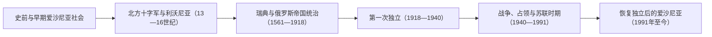

# 爱沙尼亚历史

## 概括

爱沙尼亚位于波罗的海东北岸。爱沙尼亚语属于乌拉尔语系芬兰语支，国家历史却长期与利沃尼亚、丹麦和德意志骑士团扩张、瑞典王国、俄罗斯帝国以及苏联统治交织。理解爱沙尼亚历史，既要看到东波罗的海共同经历，也要保留其芬兰-乌戈尔语言和本地社会发展的独特性。

## 历史演进图

## 分期导航

| 顺序 | 阶段 | 时间 | 相关入口 | 历史走向 |
|---:|---|---|---|---|
| 1 | 史前与早期爱沙尼亚社会 | 13世纪以前 | [早期波罗的人](/%E4%BA%BA%E6%96%87%E7%A7%91%E5%AD%A6/%E5%8E%86%E5%8F%B2/%E6%AC%A7%E6%B4%B2/%E6%B3%A2%E7%BD%97%E7%9A%84%E6%B5%B7/%E6%97%A9%E6%9C%9F%E6%B3%A2%E7%BD%97%E7%9A%84%E4%BA%BA.md) | 芬兰语支人群、沿海聚落和古代县区在波罗的海贸易网络中发展。 |
| 2 | 北方十字军与利沃尼亚 | 13—16世纪 | [中世纪波罗的海十字军](/%E4%BA%BA%E6%96%87%E7%A7%91%E5%AD%A6/%E5%8E%86%E5%8F%B2/%E6%AC%A7%E6%B4%B2/%E6%B3%A2%E7%BD%97%E7%9A%84%E6%B5%B7/%E4%B8%AD%E4%B8%96%E7%BA%AA%E6%B3%A2%E7%BD%97%E7%9A%84%E6%B5%B7%E5%8D%81%E5%AD%97%E5%86%9B.md)、[利沃尼亚](/%E4%BA%BA%E6%96%87%E7%A7%91%E5%AD%A6/%E5%8E%86%E5%8F%B2/%E6%AC%A7%E6%B4%B2/%E6%B3%A2%E7%BD%97%E7%9A%84%E6%B5%B7/%E5%88%A9%E6%B2%83%E5%B0%BC%E4%BA%9A.md) | 丹麦、德意志十字军、主教区和骑士团改变当地政治与宗教秩序。 |
| 3 | 瑞典与俄罗斯帝国统治 | 1561—1918年 | [瑞典统治下的东波罗的海](/%E4%BA%BA%E6%96%87%E7%A7%91%E5%AD%A6/%E5%8E%86%E5%8F%B2/%E6%AC%A7%E6%B4%B2/%E6%B3%A2%E7%BD%97%E7%9A%84%E6%B5%B7/%E7%91%9E%E5%85%B8%E7%BB%9F%E6%B2%BB%E4%B8%8B%E7%9A%84%E4%B8%9C%E6%B3%A2%E7%BD%97%E7%9A%84%E6%B5%B7.md)、[俄罗斯帝国统治下的波罗的海](/%E4%BA%BA%E6%96%87%E7%A7%91%E5%AD%A6/%E5%8E%86%E5%8F%B2/%E6%AC%A7%E6%B4%B2/%E6%B3%A2%E7%BD%97%E7%9A%84%E6%B5%B7/%E4%BF%84%E7%BD%97%E6%96%AF%E5%B8%9D%E5%9B%BD%E7%BB%9F%E6%B2%BB%E4%B8%8B%E7%9A%84%E6%B3%A2%E7%BD%97%E7%9A%84%E6%B5%B7.md) | 利沃尼亚战争和大北方战争先后把爱沙尼亚地区纳入瑞典和俄罗斯帝国。 |
| 4 | 第一次独立 | 1918—1940年 | [波罗的三国独立](/%E4%BA%BA%E6%96%87%E7%A7%91%E5%AD%A6/%E5%8E%86%E5%8F%B2/%E6%AC%A7%E6%B4%B2/%E6%B3%A2%E7%BD%97%E7%9A%84%E6%B5%B7/%E6%B3%A2%E7%BD%97%E7%9A%84%E4%B8%89%E5%9B%BD%E7%8B%AC%E7%AB%8B.md) | 独立战争、塔尔图和约、土地改革和国家制度建设确立爱沙尼亚共和国。 |
| 5 | 战争、占领与苏联时期 | 1940—1991年 | [苏联统治下的波罗的海](/%E4%BA%BA%E6%96%87%E7%A7%91%E5%AD%A6/%E5%8E%86%E5%8F%B2/%E6%AC%A7%E6%B4%B2/%E6%B3%A2%E7%BD%97%E7%9A%84%E6%B5%B7/%E8%8B%8F%E8%81%94%E7%BB%9F%E6%B2%BB%E4%B8%8B%E7%9A%84%E6%B3%A2%E7%BD%97%E7%9A%84%E6%B5%B7.md) | 苏联吞并、德国占领、苏联重新控制及社会改造深刻改变人口和经济。 |
| 6 | 恢复独立后的爱沙尼亚 | 1991年至今 | 本页下文 | 国家连续性得到恢复，随后进入欧洲和跨大西洋制度体系。 |

## 阶段说明

### 史前与早期爱沙尼亚社会

爱沙尼亚地区很早便形成依托海岸、岛屿、湖泊和河流的聚落网络。中世纪文献所见的地方共同体通常由多个古代县区和堡垒中心组成，与斯堪的纳维亚、罗斯及东波罗的海其他人群保持贸易和战争联系。这里的主体语言传统属于芬兰语支，不能因现代爱沙尼亚属于“波罗的国家”而归入波罗的语族。

### 北方十字军与利沃尼亚

13世纪，丹麦和德意志十字军、主教区及军事修会征服爱沙尼亚各地，北部一度由丹麦控制，南部进入利沃尼亚政治网络。1346年丹麦把其爱沙尼亚领地售予条顿骑士团，随后由利沃尼亚分支管理。拉丁基督教制度、德意志贵族和城市集团获得支配地位，塔林等城市进入汉萨贸易圈；爱沙尼亚农民社会则延续并逐渐受到庄园制度约束。

### 瑞典与俄罗斯帝国统治

利沃尼亚战争瓦解旧利沃尼亚秩序后，爱沙尼亚北部于1561年转入瑞典统治，南部在17世纪前期也大体进入瑞典体系。瑞典王权在保留波罗的德意志精英影响的同时推进司法、教会和教育改革。大北方战争期间俄罗斯占领当地，1721年《尼斯塔德和约》确认其归属俄罗斯帝国。帝国时期波罗的德意志贵族仍长期掌握地方优势；19世纪废除农奴制、识字教育扩展和民族文化运动，则推动现代爱沙尼亚民族认同形成。

### 第一次独立

爱沙尼亚于1918年2月24日宣布独立，并在独立战争中同时应对布尔什维克军队和波罗的德意志武装。1920年《塔尔图和约》确认苏俄承认爱沙尼亚独立。共和国实施土地改革并建立议会制度，1934年以后转为由康斯坦丁·佩茨主导的威权体制，但独立国家的法理和机构记忆持续影响后来复国。

### 战争、占领与苏联时期

1940年苏联吞并爱沙尼亚；1941—1944年德国占领造成战争破坏和大屠杀，随后苏联重新控制。战后苏维埃化包括政治压制、人口遣送、农业集体化和工业化，也伴随大量俄语人口迁入。流亡机构、海外社群和本地文化记忆延续国家连续性主张；1980年代末的歌唱革命和群众运动最终推动恢复独立。

### 恢复独立后的爱沙尼亚

爱沙尼亚在1991年恢复实际独立，1992年宪法重建议会共和国。此后国家围绕语言、公民身份、市场转型和数字化治理重塑制度，并于2004年加入北约和欧洲联盟。其国家叙事强调恢复1940年前共和国，而不是在1991年新建一个与旧共和国无关的国家。

## 关键辨析

- **波罗的国家不等于波罗的语族**：爱沙尼亚语属于乌拉尔语系芬兰语支，爱沙尼亚与拉脱维亚、立陶宛的共同性首先是区域史和现代地缘政治概念。
- **利沃尼亚不等于爱沙尼亚**：中世纪利沃尼亚横跨今爱沙尼亚和拉脱维亚，不能机械套用现代国界。
- **1991年是恢复独立**：爱沙尼亚以共和国法理连续性解释1940—1991年的吞并和占领时期。

## 上级

- [波罗的海历史](/%E4%BA%BA%E6%96%87%E7%A7%91%E5%AD%A6/%E5%8E%86%E5%8F%B2/%E6%AC%A7%E6%B4%B2/%E6%B3%A2%E7%BD%97%E7%9A%84%E6%B5%B7/README.md)
