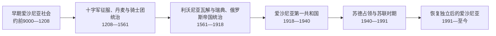

# 爱沙尼亚历史

爱沙尼亚历史的主线，是东波罗的海芬兰语族社会在十字军征服后被纳入丹麦、德意志骑士团、瑞典和俄罗斯帝国体系，又在20世纪两次世界大战与苏联解体之间建立、失去并恢复共和国。现代爱沙尼亚以1918年共和国的法律连续性为国家认同基础。

## 历史主线

早期居民通过农业、海上贸易、城堡聚落和古代县形成区域社会，但没有建立统一王国。13世纪北方十字军与丹麦征服把爱沙尼亚分入主教领、丹麦属地和骑士团国；16世纪利沃尼亚战争后，瑞典逐步取得爱沙尼亚大部。大北方战争使该地转入俄罗斯帝国，波罗的德意志等级长期保有地方特权，19世纪农民解放、教育与民族觉醒则塑造现代爱沙尼亚民族。

1918年共和国在独立战争中站稳脚跟，1934年后转为威权统治，1940年又在苏联最后通牒下遭占领和吞并。1941—1944年德国占领与1944年后的苏联再占领造成大规模迫害、战争损失、人口迁移和制度重构。1980年代后期，群众运动、议会法律行动和国际环境共同推动1991年恢复独立；此后国家以议会民主、数字治理、欧盟与北约一体化为主要方向。

## 阶段导航

| 顺序 | 阶段 | 时间 | 简要概括 |
| --- | --- | --- | --- |
| 1 | [早期爱沙尼亚社会](/%E4%BA%BA%E6%96%87%E7%A7%91%E5%AD%A6/%E5%8E%86%E5%8F%B2/%E6%AC%A7%E6%B4%B2/%E6%B3%A2%E7%BD%97%E7%9A%84%E6%B5%B7/%E7%88%B1%E6%B2%99%E5%B0%BC%E4%BA%9A/%E6%97%A9%E6%9C%9F%E7%88%B1%E6%B2%99%E5%B0%BC%E4%BA%9A%E7%A4%BE%E4%BC%9A.md) | 约前9000—1208年 | 从冰后定居、农业化到古代县与城堡聚落形成。 |
| 2 | [十字军征服、丹麦与骑士团统治](/%E4%BA%BA%E6%96%87%E7%A7%91%E5%AD%A6/%E5%8E%86%E5%8F%B2/%E6%AC%A7%E6%B4%B2/%E6%B3%A2%E7%BD%97%E7%9A%84%E6%B5%B7/%E7%88%B1%E6%B2%99%E5%B0%BC%E4%BA%9A/%E5%8D%81%E5%AD%97%E5%86%9B%E5%BE%81%E6%9C%8D%E3%80%81%E4%B8%B9%E9%BA%A6%E4%B8%8E%E9%AA%91%E5%A3%AB%E5%9B%A2%E7%BB%9F%E6%B2%BB.md) | 1208—1561年 | 征服、基督教化、利沃尼亚复合政体和德意志等级社会。 |
| 3 | [利沃尼亚瓦解与瑞典、俄罗斯帝国统治](/%E4%BA%BA%E6%96%87%E7%A7%91%E5%AD%A6/%E5%8E%86%E5%8F%B2/%E6%AC%A7%E6%B4%B2/%E6%B3%A2%E7%BD%97%E7%9A%84%E6%B5%B7/%E7%88%B1%E6%B2%99%E5%B0%BC%E4%BA%9A/%E5%88%A9%E6%B2%83%E5%B0%BC%E4%BA%9A%E7%93%A6%E8%A7%A3%E4%B8%8E%E7%91%9E%E5%85%B8%E3%80%81%E4%BF%84%E7%BD%97%E6%96%AF%E5%B8%9D%E5%9B%BD%E7%BB%9F%E6%B2%BB.md) | 1561—1918年 | 瑞典改革、俄帝等级自治、民族觉醒和帝国崩溃。 |
| 4 | [爱沙尼亚第一共和国](/%E4%BA%BA%E6%96%87%E7%A7%91%E5%AD%A6/%E5%8E%86%E5%8F%B2/%E6%AC%A7%E6%B4%B2/%E6%B3%A2%E7%BD%97%E7%9A%84%E6%B5%B7/%E7%88%B1%E6%B2%99%E5%B0%BC%E4%BA%9A/%E7%88%B1%E6%B2%99%E5%B0%BC%E4%BA%9A%E7%AC%AC%E4%B8%80%E5%85%B1%E5%92%8C%E5%9B%BD.md) | 1918—1940年 | 独立战争、议会共和国、威权转向与苏联占领。 |
| 5 | [苏德占领与苏联时期](/%E4%BA%BA%E6%96%87%E7%A7%91%E5%AD%A6/%E5%8E%86%E5%8F%B2/%E6%AC%A7%E6%B4%B2/%E6%B3%A2%E7%BD%97%E7%9A%84%E6%B5%B7/%E7%88%B1%E6%B2%99%E5%B0%BC%E4%BA%9A/%E8%8B%8F%E5%BE%B7%E5%8D%A0%E9%A2%86%E4%B8%8E%E8%8B%8F%E8%81%94%E6%97%B6%E6%9C%9F.md) | 1940—1991年 | 苏联首次占领、德国占领、苏联再占领与恢复独立运动。 |
| 6 | [恢复独立后的爱沙尼亚](/%E4%BA%BA%E6%96%87%E7%A7%91%E5%AD%A6/%E5%8E%86%E5%8F%B2/%E6%AC%A7%E6%B4%B2/%E6%B3%A2%E7%BD%97%E7%9A%84%E6%B5%B7/%E7%88%B1%E6%B2%99%E5%B0%BC%E4%BA%9A/%E6%81%A2%E5%A4%8D%E7%8B%AC%E7%AB%8B%E5%90%8E%E7%9A%84%E7%88%B1%E6%B2%99%E5%B0%BC%E4%BA%9A.md) | 1991年至今 | 宪政重建、市场转型、数字国家和欧洲—大西洋一体化。 |

## 重要转折与时间节点

| 时间 | 转折 | 历史意义 |
| --- | --- | --- |
| 1217—1227 | 古代县相继被征服 | 本地政治结构被纳入拉丁基督教利沃尼亚。 |
| 1343—1346 | 圣乔治之夜起义及丹麦出售属地 | 北部爱沙尼亚转入骑士团控制。 |
| 1561 | 北部爱沙尼亚归附瑞典 | 利沃尼亚旧秩序瓦解，进入列强分割时代。 |
| 1710—1721 | 俄军占领与《尼斯塔德条约》 | 俄帝统治确立，同时保留波罗的德意志特权。 |
| 1869 | 首届全爱沙尼亚歌咏节 | 民族文化运动形成跨地区公共空间。 |
| 1918-02-24 | 宣布独立 | 现代爱沙尼亚共和国成立。 |
| 1920-02-02 | 《塔尔图和约》 | 苏俄承认爱沙尼亚独立。 |
| 1940-06 | 苏联占领 | 共和国实际主权中断，法律连续性在海外延续。 |
| 1988-11-16 | 主权宣言 | 恢复独立进入制度化、法律化阶段。 |
| 1991-08-20 | 恢复独立 | 共和国重新取得实际主权。 |
| 2004 | 加入北约和欧盟 | 安全与制度归属转向欧洲—大西洋体系。 |

## 领导与权力结构

- [爱沙尼亚共和国国家元首与政府首脑表](/%E4%BA%BA%E6%96%87%E7%A7%91%E5%AD%A6/%E5%8E%86%E5%8F%B2/%E6%AC%A7%E6%B4%B2/%E6%B3%A2%E7%BD%97%E7%9A%84%E6%B5%B7/%E7%88%B1%E6%B2%99%E5%B0%BC%E4%BA%9A/%E7%88%B1%E6%B2%99%E5%B0%BC%E4%BA%9A%E5%85%B1%E5%92%8C%E5%9B%BD%E5%9B%BD%E5%AE%B6%E5%85%83%E9%A6%96%E4%B8%8E%E6%94%BF%E5%BA%9C%E9%A6%96%E8%84%91%E8%A1%A8.md)
- [爱沙尼亚占领行政与苏维埃领导人表](/%E4%BA%BA%E6%96%87%E7%A7%91%E5%AD%A6/%E5%8E%86%E5%8F%B2/%E6%AC%A7%E6%B4%B2/%E6%B3%A2%E7%BD%97%E7%9A%84%E6%B5%B7/%E7%88%B1%E6%B2%99%E5%B0%BC%E4%BA%9A/%E7%88%B1%E6%B2%99%E5%B0%BC%E4%BA%9A%E5%8D%A0%E9%A2%86%E8%A1%8C%E6%94%BF%E4%B8%8E%E8%8B%8F%E7%BB%B4%E5%9F%83%E9%A2%86%E5%AF%BC%E4%BA%BA%E8%A1%A8.md)

## 区域脉络

跨国背景见[波罗的海历史](/%E4%BA%BA%E6%96%87%E7%A7%91%E5%AD%A6/%E5%8E%86%E5%8F%B2/%E6%AC%A7%E6%B4%B2/%E6%B3%A2%E7%BD%97%E7%9A%84%E6%B5%B7/README.md)、[利沃尼亚](/%E4%BA%BA%E6%96%87%E7%A7%91%E5%AD%A6/%E5%8E%86%E5%8F%B2/%E6%AC%A7%E6%B4%B2/%E6%B3%A2%E7%BD%97%E7%9A%84%E6%B5%B7/%E5%88%A9%E6%B2%83%E5%B0%BC%E4%BA%9A.md)与[波罗的三国独立](/%E4%BA%BA%E6%96%87%E7%A7%91%E5%AD%A6/%E5%8E%86%E5%8F%B2/%E6%AC%A7%E6%B4%B2/%E6%B3%A2%E7%BD%97%E7%9A%84%E6%B5%B7/%E6%B3%A2%E7%BD%97%E7%9A%84%E4%B8%89%E5%9B%BD%E7%8B%AC%E7%AB%8B.md)；本目录只展开爱沙尼亚本地过程。
