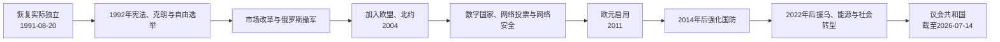

# 恢复独立后的爱沙尼亚

## 时间

1991年8月20日至今（核验截止：2026-07-14）

## 概括

爱沙尼亚把1991年理解为1918年共和国恢复实际独立，而非建立一个苏联解体后的全新国家。1992年宪法、货币改革和首次自由选举重建议会共和国；私有化、贸易重定向和紧缩改革迅速接入西方市场，也带来失业、贫富差距与地区落差。俄罗斯军队1994年撤离后，安全政策以加入欧盟、北约和深化北欧—波罗的合作为中心。数字身份、在线公共服务和网络投票塑造“数字国家”，2007年网络攻击又推动网络安全制度。俄乌战争时代，国防、能源脱俄、爱沙尼亚语教育与人口整合成为持续议题。

## 国家连续性与宪政重建

1991年8月20日决议确认共和国的法律连续性。苏联9月6日承认爱沙尼亚独立，9月17日爱沙尼亚加入联合国。1992年6月公投通过新宪法，9月举行国会和总统选举；流亡政府首脑海因里希·马克于10月把国家权力象征性交给新当选总统伦纳特·梅里，海外连续性与国内机关完成汇合。

宪法建立议会共和国：

| 角色 | 主要权力 | 制衡与限制 |
| --- | --- | --- |
| 国会 | 立法、预算、监督政府、选举或参与选举总统 | 由比例代表选举产生；政府须维持国会信任。 |
| 总统 | 国家代表、公布法律、提名总理候选人、国防与外交的宪制职能 | 多数权力须依法并与政府协作，不直接领导日常行政。 |
| 总理与政府 | 制定和执行内政、经济、外交及欧盟政策 | 对国会负责，可因不信任或联盟瓦解更替。 |
| 最高法院 | 最高审判机关并承担宪法审查 | 可审查法律与国家机关行为是否合宪。 |
| 地方政府 | 市镇公共服务、规划与地方预算 | 财政和法定权限受国家法律约束。 |

完整国家元首与历届内阁见[爱沙尼亚共和国国家元首与政府首脑表](/%E4%BA%BA%E6%96%87%E7%A7%91%E5%AD%A6/%E5%8E%86%E5%8F%B2/%E6%AC%A7%E6%B4%B2/%E6%B3%A2%E7%BD%97%E7%9A%84%E6%B5%B7/%E7%88%B1%E6%B2%99%E5%B0%BC%E4%BA%9A/%E7%88%B1%E6%B2%99%E5%B0%BC%E4%BA%9A%E5%85%B1%E5%92%8C%E5%9B%BD%E5%9B%BD%E5%AE%B6%E5%85%83%E9%A6%96%E4%B8%8E%E6%94%BF%E5%BA%9C%E9%A6%96%E8%84%91%E8%A1%A8.md)。

## 市场与国家能力重建

1992年克朗取代卢布，并通过货币发行局制度与德国马克挂钩，抑制高通胀、稳定预期。政府推动价格自由化、私有化、土地返还、平衡预算、低关税和贸易西向化。改革速度使爱沙尼亚较快形成出口和服务经济，也使苏联工业链骤断，东北工业区、老年人和低技能劳动者承担更高调整成本。

1990年代的主要矛盾包括：

- 财产权恢复要处理原所有者、现住户和苏联时期企业之间的冲突；
- 国有企业重组和市场萎缩造成失业、收入下降与人口外流；
- 塔林及西部更快接入北欧资本，东北部俄语工业城市转型较慢；
- 年轻国家需要同时建立边防、军队、税务、外交和社会保障机构；
- 改革联盟多次更替，但宪政交接和政策大方向保持连续。

俄罗斯军队于1994年8月完成撤离，帕尔迪斯基核潜艇训练设施后续移交问题也得到解决。撤军结束外国驻军，却没有消除边界条约、历史记忆和俄语居民整合争议。

## 公民身份、语言与社会整合

恢复共和国意味着原则上延续1940年前公民及其后裔的国籍。许多苏联时期迁入者需要通过归化取得公民身份，条件包括居留、语言和宪法知识；另有居民持“未确定国籍”身份或俄罗斯国籍。政策维护国家连续性和爱沙尼亚语公共空间，却也造成政治参与、教育和就业差异。

整合政策经历从分轨并存到加强共同语言教育的转变：

| 议题 | 政策目标 | 持续争议 |
| --- | --- | --- |
| 国籍 | 通过出生、恢复或归化建立明确公民共同体 | 语言考试、无国籍人口及代际差异。 |
| 官方语言 | 恢复爱沙尼亚语在行政、教育和工作中的主导地位 | 东北部与俄语学校转型速度、劳动市场门槛。 |
| 教育 | 增加爱沙尼亚语教学，推动统一学校空间 | 教师供给、教学质量和家庭选择。 |
| 历史记忆 | 纪念占领、遣送和抵抗 | 俄语社群中的苏联战争记忆可能不同。 |
| 地区发展 | 缩小塔林、塔尔图与东北工业区差距 | 人口减少、产业转型和社会信任。 |

2007年政府把苏军“青铜士兵”纪念碑迁出塔林市中心，引发街头骚乱、一起死亡事件和社会撕裂，显示历史记忆与整合问题仍具爆发性。

## 欧洲—大西洋一体化

爱沙尼亚把加入西方制度视为锁定民主、市场规则和安全保障的途径。1995年申请加入欧盟，随后改革法律、竞争政策、边境和行政能力；2003年公投批准入盟。2004年3月29日加入北约，5月1日加入欧盟。2010年加入经济合作与发展组织，2011年启用欧元。

这些制度带来市场、投资、人员流动、基础设施资金和集体防御，也要求接受欧盟共同规则、财政纪律及联盟内部谈判。大量居民在欧盟自由流动后到芬兰等国工作，汇款和技能流动与人口外迁同时存在。

## 数字国家与网络安全

国家规模小、苏联旧行政包袱有限，加上1990年代政策选择，使爱沙尼亚较早建立数字身份、数据交换层和电子税务。2002年身份证与数字签名体系普及，2005年地方选举首次使用有约束力的互联网投票，后来扩展至国会和欧洲议会选举。数字系统降低行政成本、便利海外和偏远居民，也持续面对审计、透明度、网络攻击和数字排斥问题。

2007年“青铜之夜”后，政府、银行和媒体网站遭大规模分布式网络攻击。爱沙尼亚推动国家网络防御、数据备份和国际合作，北约合作网络防御卓越中心于2008年在塔林成立。数字国家因此从效率项目转为国家安全架构。

## 国防、俄罗斯与能源

2008年俄格战争、2014年俄罗斯吞并克里米亚和2022年全面入侵乌克兰不断强化爱沙尼亚的威胁判断。国家维持征兵与后备力量，提高国防开支，并在北约框架内接纳盟军轮驻；2017年起北约增强前沿存在战斗群部署于塔帕。

2022年后，爱沙尼亚对乌克兰提供军事、财政和人道支持，接纳难民，同时面对通胀、能源价格和财政压力。安全政策也包括减少俄能源与基础设施依赖。2025年，爱沙尼亚与拉脱维亚、立陶宛退出俄白控制的BRELL同步区，并接入欧洲大陆电网，改变苏联时期遗留的电力依赖。

国防共识较强，但军费、社会支出、税制和经济增长之间存在现实取舍。与俄罗斯的边界、跨境联系、制裁执行和境内俄语信息空间仍需长期管理。

## 政治演变

恢复独立后从未由单一政党长期垄断，政府多为联合内阁。祖国联盟、改革党、中间党、社会民主党、保守人民党和爱沙尼亚200等先后影响政策。联盟更替大致围绕市场改革速度、税制、社会福利、俄语选民、价值议题和安全政策展开。

- 伦纳特·梅里总统时期完成制度西向与俄罗斯撤军；
- 马尔特·拉尔两届政府是早期市场改革与北约、欧盟路线的重要推动者；
- 安德鲁斯·安西普连续三届执政，经历高速增长、2007年危机和2008年后紧缩；
- 2016年于里·拉塔斯上台，终结改革党长期主导，并把中间党带入多种联盟；
- 卡娅·卡拉斯2021—2024年任总理，任内经历疫情后阶段、俄乌全面战争和安全政策加速；
- 克里斯滕·米哈尔自2024年7月23日起任第54届政府总理。

截至2026年7月14日，国家元首为阿拉尔·卡里斯，2021年10月11日就任；政府首脑为克里斯滕·米哈尔。现任信息只记录到核验日，不预判任期。

## 发展条件与长期挑战

### 为何转型得以巩固

| 类型 | 因素 |
| --- | --- |
| 国家连续性 | 1918年国家、公民身份和海外外交使团提供制度合法性。 |
| 政治选择 | 1992年宪法建立清晰议会责任和司法审查，政权可和平轮替。 |
| 社会资本 | 高识字率、技术教育、海外侨民和北欧联系支持改革。 |
| 外部锚定 | 欧盟、北约和欧元区把法律、市场和安全改革锁定在多边体系。 |
| 行政创新 | 数字身份与数据交换提高小国行政效率和服务覆盖。 |

### 仍未解决的问题

- 人口老龄化、低生育率、移民与人才外流影响劳动力和财政；
- 塔林高增长地区与东北部、乡村之间发展不均；
- 爱沙尼亚语与俄语社群在教育、媒体和历史记忆上仍有距离；
- 数字基础设施提高效率，也扩大网络战、隐私和系统依赖风险；
- 国防、能源转型、气候目标和生活成本需要同时投入；
- 联合政府频繁更替可能拖慢长期改革，但也体现竞争性民主。

## 重要事件

| 时间 | 事件 | 结果与长期影响 |
| --- | --- | --- |
| 1991-08-20 | 恢复独立 | 重获实际主权，延续1918年共和国。 |
| 1991-09-17 | 加入联合国 | 国际地位全面恢复。 |
| 1992 | 宪法、克朗与自由选举 | 建立当代议会共和国和稳定货币。 |
| 1994-08 | 俄罗斯军队撤离 | 外国驻军时代结束。 |
| 2002 | 数字身份证与数字签名体系 | 形成电子政务基础设施。 |
| 2004 | 加入北约和欧盟 | 安全、法律与市场锚定西方制度。 |
| 2005 | 首次互联网投票 | 数字公共服务进入选举领域。 |
| 2007 | 青铜之夜与网络攻击 | 暴露记忆、整合和网络安全风险。 |
| 2008 | 北约网络防御中心在塔林运行 | 爱沙尼亚成为国际网络安全节点。 |
| 2011 | 启用欧元 | 货币体系并入欧元区。 |
| 2014—2017 | 俄乌危机与北约前沿部署 | 国防支出、盟军存在和后备体系强化。 |
| 2020—2022 | 新冠疫情 | 数字服务展现韧性，医疗、教育和经济亦承压。 |
| 2022起 | 支援乌克兰与接纳难民 | 安全政策、财政和社会整合进入新阶段。 |
| 2024-07-23 | 米哈尔政府就任 | 第54届共和国政府成立。 |
| 2025-02 | 接入欧洲大陆电网 | 结束与俄白电力同步依赖。 |
| 2026-07-14 | 本页核验截止 | 总统阿拉尔·卡里斯、总理克里斯滕·米哈尔在任。 |

## 演变关系

- 前一阶段：[苏德占领与苏联时期](/%E4%BA%BA%E6%96%87%E7%A7%91%E5%AD%A6/%E5%8E%86%E5%8F%B2/%E6%AC%A7%E6%B4%B2/%E6%B3%A2%E7%BD%97%E7%9A%84%E6%B5%B7/%E7%88%B1%E6%B2%99%E5%B0%BC%E4%BA%9A/%E8%8B%8F%E5%BE%B7%E5%8D%A0%E9%A2%86%E4%B8%8E%E8%8B%8F%E8%81%94%E6%97%B6%E6%9C%9F.md)
- 区域参照：[波罗的三国独立](/%E4%BA%BA%E6%96%87%E7%A7%91%E5%AD%A6/%E5%8E%86%E5%8F%B2/%E6%AC%A7%E6%B4%B2/%E6%B3%A2%E7%BD%97%E7%9A%84%E6%B5%B7/%E6%B3%A2%E7%BD%97%E7%9A%84%E4%B8%89%E5%9B%BD%E7%8B%AC%E7%AB%8B.md)
- 领导序列：[爱沙尼亚共和国国家元首与政府首脑表](/%E4%BA%BA%E6%96%87%E7%A7%91%E5%AD%A6/%E5%8E%86%E5%8F%B2/%E6%AC%A7%E6%B4%B2/%E6%B3%A2%E7%BD%97%E7%9A%84%E6%B5%B7/%E7%88%B1%E6%B2%99%E5%B0%BC%E4%BA%9A/%E7%88%B1%E6%B2%99%E5%B0%BC%E4%BA%9A%E5%85%B1%E5%92%8C%E5%9B%BD%E5%9B%BD%E5%AE%B6%E5%85%83%E9%A6%96%E4%B8%8E%E6%94%BF%E5%BA%9C%E9%A6%96%E8%84%91%E8%A1%A8.md)
- 返回：[爱沙尼亚历史](/%E4%BA%BA%E6%96%87%E7%A7%91%E5%AD%A6/%E5%8E%86%E5%8F%B2/%E6%AC%A7%E6%B4%B2/%E6%B3%A2%E7%BD%97%E7%9A%84%E6%B5%B7/%E7%88%B1%E6%B2%99%E5%B0%BC%E4%BA%9A/README.md)
