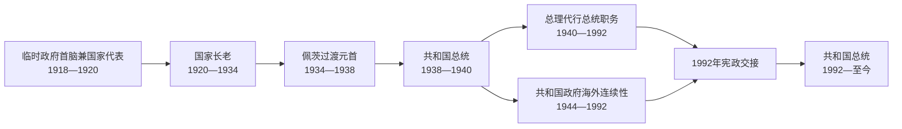

# 爱沙尼亚共和国国家元首与政府首脑表

## 时间

1918年至今（核验截止：2026-07-14）

## 概括

爱沙尼亚1918—1920年的政府首脑、1920—1934年的“国家长老”、1934—1938年的过渡性国家元首和1938年后的总统职务不能混称为“总统”。1940年占领后，共和国依据1938年宪法形成“总理代行总统职务”的海外连续性链；与此同时，境内先后存在苏联和德国占领机关。1990—1992年海外机关与境内恢复国家的最高委员会短暂并行，最后向1992年宪政机关交接。本表只列共和国合法或连续性机关，苏维埃与德国占领领导见另一专表。

## 1918—1940年国家元首完整序列

1920年宪法没有单设总统。“国家长老”既主持政府又承担国家代表职能，权力受国会和内阁约束。1934年后康斯坦丁·佩茨连续以不同法定称号掌权，表中按职务变化分列。

| 顺序 | 人物 | 正式职务与任期 | 与前任关系 / 关键事件 |
| --- | --- | --- | --- |
| 1 | **康斯坦丁·佩茨** | 临时政府总理并承担国家元首职能，1918-02-24—1919-05-09 | 由救国委员会组阁；德国占领期间无法公开施政，1918年11月恢复政府。 |
| 2 | 奥托·斯特兰德曼 | 共和国总理并承担国家元首职能，1919-05-09—1919-11-18 | 制宪议会支持的战时政府。 |
| 3 | 扬·特尼松 | 总理并承担国家元首职能，1919-11-18—1920-07-28 | 任内签订《塔尔图和约》。 |
| 4 | 阿杜·比尔克 | 总理并承担国家元首职能，1920-07-28—07-30 | 三日内阁，未能形成稳定多数。 |
| 5 | 扬·特尼松 | 总理并承担国家元首职能，1920-07-30—10-26 | 第二次连续承担国家代表职能。 |
| 6 | 安茨·皮普 | 总理并承担国家元首职能，1920-10-26—12-20 | 1920年宪法生效前最后一任总理型元首。 |
| 7 | 安茨·皮普 | 国家长老，1920-12-20—1921-01-25 | 宪法生效后职称转换，仍领导同一政府。 |
| 8 | **康斯坦丁·佩茨** | 国家长老，1921-01-25—1922-11-21 | 首次依1920年宪法担任国家长老。 |
| 9 | 尤汉·库克 | 国家长老，1922-11-21—1923-08-02 | 议会联盟更替后接任。 |
| 10 | 康斯坦丁·佩茨 | 国家长老，1923-08-02—1924-03-26 | 第二次出任国家长老。 |
| 11 | 弗里德里希·卡尔·阿克尔 | 国家长老，1924-03-26—12-16 | 任内发生1924年12月共产主义政变未遂。 |
| 12 | 于里·亚克松 | 国家长老，1924-12-16—1925-12-15 | 政变未遂后的广泛联盟政府。 |
| 13 | 扬·泰曼特 | 国家长老，1925-12-15—1927-12-09 | 连续领导第14—16届内阁，联盟组成三次调整。 |
| 14 | 扬·特尼松 | 国家长老，1927-12-09—1928-12-04 | 第三次担任国家首脑型职务。 |
| 15 | 奥古斯特·雷伊 | 国家长老，1928-12-04—1929-07-09 | 社会主义者领导的联合政府。 |
| 16 | 奥托·斯特兰德曼 | 国家长老，1929-07-09—1931-02-12 | 大萧条初期执政。 |
| 17 | 康斯坦丁·佩茨 | 国家长老，1931-02-12—1932-02-19 | 第三次出任国家长老。 |
| 18 | 扬·泰曼特 | 国家长老，1932-02-19—07-19 | 第四次领导内阁。 |
| 19 | 卡雷尔·恩帕卢 | 国家长老，1932-07-19—11-01 | 当时仍使用姓名卡尔·艾因邦德。 |
| 20 | 康斯坦丁·佩茨 | 国家长老，1932-11-01—1933-05-18 | 第四次出任国家长老。 |
| 21 | 扬·特尼松 | 国家长老，1933-05-18—10-21 | 经济与修宪危机中执政。 |
| 22 | **康斯坦丁·佩茨** | 国家长老，1933-10-21—1934-01-24 | 1933年修宪通过后继续任职。 |
| 23 | **康斯坦丁·佩茨** | 总理代行国家长老职务，1934-01-24—1937-09-03 | 1934年3月宣布紧急状态、取消竞争性选举，进入“沉默时代”。 |
| 24 | **康斯坦丁·佩茨** | 国家监护人，1937-09-03—1938-04-24 | 依据过渡法在新宪法完全实施前任职。 |
| 25 | **康斯坦丁·佩茨** | 共和国总统，1938-04-24—1940-06-17 | 首任总统；苏联占领后被胁迫并最终遭遣送，合法任职以占领日为界。 |

## 1940—1992年共和国法律连续性国家元首

1938年宪法规定总统不能履职时，由总理代行总统职务，并把总理日常职务交副总理。此链条主要在海外存在，没有控制境内，却由仍获承认的外交代表和部分国家不承认吞并的政策维系。它与苏维埃法定首长不是同一条序列。

| 顺序 | 人物 | 正式职务与任期 | 继承关系与说明 |
| --- | --- | --- | --- |
| 1 | **于里·乌洛茨** | 总理代行总统职务，1940-06-17—1945-01-09 | 佩茨被占领当局阻止履职后，依宪法承接职权；1944年任命奥托·蒂夫政府。 |
| 2 | **奥古斯特·雷伊** | 总理代行总统职务，1945-01-09—1963-03-29 | 乌洛茨去世后，作为蒂夫政府仍自由的最年长成员承接；1953年正式组建流亡政府。 |
| 3 | 亚历山大·瓦尔马 | 总理代行总统职务，1963-03-30—1970-12-23 | 雷伊去世后承接。 |
| 4 | 特尼斯·金特 | 总理代行总统职务，1970-12-23—1990-03-01 | 瓦尔马去世后承接，长期在瑞典活动。 |
| 5 | **海因里希·马克** | 总理代行总统职务，1990-03-01—1992-10-06 | 1992年新宪法选举完成后，把连续性权力交给伦纳特·梅里。 |

### 1990—1992年境内过渡机关

阿诺德·吕特尔于1983—1990年是爱沙尼亚苏维埃社会主义共和国最高苏维埃主席团主席，1990年3月29日起转任竞争性选举产生的最高委员会主席。最高委员会3月30日宣布恢复共和国的过渡期，1991年8月20日通过恢复独立决议，并在1992年宪法机关就位前充当境内最高代表机关。吕特尔承担实际国家代表职能，但当时正式称号不是“共和国总统”；海外国家元首海因里希·马克的连续性链同时存在。

## 1992年以来共和国总统完整序列

| 顺序 | 总统 | 任期 | 关键事件 / 备注 |
| --- | --- | --- | --- |
| 1 | **伦纳特·梅里** | 1992-10-06—2001-10-08 | 两届；完成国家连续性交接、俄罗斯撤军并推动欧盟和北约方向。 |
| 2 | 阿诺德·吕特尔 | 2001-10-08—2006-10-09 | 曾任境内过渡机关领袖；总统任内爱沙尼亚加入北约和欧盟。 |
| 3 | **托马斯·亨德里克·伊尔韦斯** | 2006-10-09—2016-10-10 | 两届；数字国家、网络安全与2014年后安全转向。 |
| 4 | **克尔斯季·卡柳莱德** | 2016-10-10—2021-10-11 | 首位女性总统；联盟政治、疫情与社会价值议题时期。 |
| 5 | **阿拉尔·卡里斯** | 2021-10-11至今 | 由国会选出；俄乌全面战争和强化国家防务时期。截至2026-07-14在任。 |

## 1918—1940年共和国政府完整序列

政府编号沿用爱沙尼亚政府官方序列。任期交接日可能同时是前届卸任与后届就职日；表中不把看守延续另造一届。

| 届次 | 政府首脑 | 任期 | 关键事件 / 备注 |
| --- | --- | --- | --- |
| 1 | **康斯坦丁·佩茨** | 1918-02-24—11-12 | 首届临时政府；德国占领下大部分时间不能公开施政。 |
| 2 | 康斯坦丁·佩茨 | 1918-11-12—11-27 | 德国撤军后的重组内阁。 |
| 3 | 康斯坦丁·佩茨 | 1918-11-27—1919-05-08 | 独立战争初期政府。 |
| 4 | 奥托·斯特兰德曼 | 1919-05-08—11-18 | 制宪议会时期战时内阁。 |
| 5 | 扬·特尼松 | 1919-11-18—1920-07-28 | 任内签订《塔尔图和约》。 |
| 6 | 阿杜·比尔克 | 1920-07-28—07-30 | 仅维持三日。 |
| 7 | 扬·特尼松 | 1920-07-30—10-26 | 第二届特尼松内阁。 |
| 8 | 安茨·皮普 | 1920-10-26—1921-01-25 | 宪法生效前后跨制度执政。 |
| 9 | 康斯坦丁·佩茨 | 1921-01-25—1922-11-21 | 第一次国家长老内阁。 |
| 10 | 尤汉·库克 | 1922-11-21—1923-08-02 | 议会联盟更替。 |
| 11 | 康斯坦丁·佩茨 | 1923-08-02—1924-03-26 | 第二次国家长老内阁。 |
| 12 | 弗里德里希·阿克尔 | 1924-03-26—12-16 | 1924年政变未遂时在任。 |
| 13 | 于里·亚克松 | 1924-12-16—1925-12-15 | 广泛联合政府。 |
| 14 | 扬·泰曼特 | 1925-12-15—1926-07-23 | 泰曼特第一届内阁。 |
| 15 | 扬·泰曼特 | 1926-07-23—1927-03-04 | 泰曼特第二届内阁。 |
| 16 | 扬·泰曼特 | 1927-03-04—12-09 | 泰曼特第三届内阁。 |
| 17 | 扬·特尼松 | 1927-12-09—1928-12-04 | 特尼松第三届内阁。 |
| 18 | 奥古斯特·雷伊 | 1928-12-04—1929-07-09 | 社会主义者主导联盟。 |
| 19 | 奥托·斯特兰德曼 | 1929-07-09—1931-02-12 | 大萧条初期。 |
| 20 | 康斯坦丁·佩茨 | 1931-02-12—1932-02-19 | 佩茨再度组阁。 |
| 21 | 扬·泰曼特 | 1932-02-19—07-19 | 泰曼特第四届内阁。 |
| 22 | 卡雷尔·恩帕卢 | 1932-07-19—11-01 | 以卡尔·艾因邦德姓名组阁。 |
| 23 | 康斯坦丁·佩茨 | 1932-11-01—1933-05-18 | 经济危机和货币争论期。 |
| 24 | 扬·特尼松 | 1933-05-18—10-21 | 修宪公投前后。 |
| 25 | **康斯坦丁·佩茨** | 1933-10-21—1938-05-09 | 1934年政变后长期威权执政；1938年转任总统。 |
| 26 | 卡雷尔·恩帕卢 | 1938-05-09—1939-10-12 | 新宪法下首届总理内阁。 |
| 27 | **于里·乌洛茨** | 1939-10-12—1940-06-21 | 基地协定后末任合法境内内阁；6月21日被傀儡政府强制取代。 |

约翰内斯·瓦雷斯1940年6月21日成立的内阁受苏联占领当局控制，不列入共和国政府合法序列；相关人员见[爱沙尼亚占领行政与苏维埃领导人表](/%E4%BA%BA%E6%96%87%E7%A7%91%E5%AD%A6/%E5%8E%86%E5%8F%B2/%E6%AC%A7%E6%B4%B2/%E6%B3%A2%E7%BD%97%E7%9A%84%E6%B5%B7/%E7%88%B1%E6%B2%99%E5%B0%BC%E4%BA%9A/%E7%88%B1%E6%B2%99%E5%B0%BC%E4%BA%9A%E5%8D%A0%E9%A2%86%E8%A1%8C%E6%94%BF%E4%B8%8E%E8%8B%8F%E7%BB%B4%E5%9F%83%E9%A2%86%E5%AF%BC%E4%BA%BA%E8%A1%A8.md)。

## 1944—1992年共和国政府海外连续性

1940—1944年没有能在境内正常运作的合法内阁；于里·乌洛茨以总理代行总统职务。1944年9月他任命奥托·蒂夫政府。该政府在苏军进入后失去境内控制，1953年起在海外重新组成。流亡政府没有得到外国政府的正式承认为执政政府，外交使团却在部分国家继续被视为共和国代表。

| 序列 | 政府首脑 | 任期 | 连续性 / 代理说明 |
| --- | --- | --- | --- |
| 1 | **奥托·蒂夫** | 1944-09-18—1953-01-12 | 9月22日前短暂在塔林运作；成员被捕或流亡，法理任期延续至海外重组。 |
| 2 | 约翰内斯·西卡尔 | 1953-01-12—1962-01-01 | 首届正式流亡内阁；本人1960年去世后由特尼斯·金特代理至新内阁成立。 |
| 3 | 亚历山大·瓦尔马 | 1962-01-01—1963-03-29 | 雷伊去世后转任代总统，政府日常工作随后由特尼斯·金特代理。 |
| — | 特尼斯·金特 | 代理政府首脑，1963-03-30—1964-03-01 | 在新一届内阁正式任命前代理。 |
| 4 | 特尼斯·金特 | 1964-03-01—1971-05-08 | 1970年12月转任代总统后，由海因里希·马克承担政府日常职能。 |
| 5 | 海因里希·马克 | 1971-05-08—1990-06-20 | 1990年3月转任代总统后，任命恩诺·彭诺为副总理并主持政府。 |
| 6 | 恩诺·彭诺 | 1990-06-20—1992-10-07 | 最后一届流亡政府；宪政总统就职后次日结束使命。 |

## 1990—1992年境内过渡政府

下列政府源自苏维埃时期的境内机关，但在竞争性选举、恢复国名和1991年独立决议中转化为共和国过渡行政；其与流亡政府并行，不能把重叠日期误判为两个相互取代的境内内阁。

| 届次 | 政府首脑 | 任期 | 关键事件 / 备注 |
| --- | --- | --- | --- |
| 34 | **埃德加·萨维萨尔** | 1990-04-03—1992-01-30 | 过渡期政府；恢复共和国名称，经历1991年独立决议和卢布经济危机。 |
| 35 | 蒂特·韦希 | 1992-01-30—10-22 | 看守转型、货币改革和1992年宪法选举；新国会后交权。 |

## 1992年以来共和国政府完整序列

| 届次 | 总理 | 任期 | 关键事件 / 备注 |
| --- | --- | --- | --- |
| 36 | **马尔特·拉尔** | 1992-10-22—1994-11-08 | 激进市场改革、财产重组与俄罗斯撤军谈判。 |
| 37 | 安德烈斯·塔兰德 | 1994-11-08—1995-04-17 | 选举前过渡政府。 |
| 38 | 蒂特·韦希 | 1995-04-17—11-06 | 联盟因内政争议重组。 |
| 39 | 蒂特·韦希 | 1995-11-06—1997-03-17 | 第二届连续内阁；私有化与联盟冲突。 |
| 40 | 马尔特·西曼 | 1997-03-17—1999-03-25 | 欧盟谈判准备与少数支持结构。 |
| 41 | **马尔特·拉尔** | 1999-03-25—2002-01-28 | 第二次任职；推进欧盟、北约加入与行政改革。 |
| 42 | 西姆·卡拉斯 | 2002-01-28—2003-04-10 | 完成入盟谈判关键阶段。 |
| 43 | 尤汉·帕茨 | 2003-04-10—2005-04-13 | 入北约、欧盟；司法部长不信任案后辞职。 |
| 44 | **安德鲁斯·安西普** | 2005-04-13—2007-04-05 | 首届；经济高速增长，互联网投票扩展。 |
| 45 | 安德鲁斯·安西普 | 2007-04-05—2011-04-06 | 青铜之夜、网络攻击和全球金融危机；联盟中途缩小。 |
| 46 | 安德鲁斯·安西普 | 2011-04-06—2014-03-26 | 第三届；欧元初期与财政整顿。 |
| 47 | 塔维·勒伊瓦斯 | 2014-03-26—2015-04-09 | 克里米亚危机后强化安全政策。 |
| 48 | 塔维·勒伊瓦斯 | 2015-04-09—2016-11-23 | 联盟失去国会支持后下台。 |
| 49 | **于里·拉塔斯** | 2016-11-23—2019-04-29 | 中间党、社会民主党与祖国联盟执政。 |
| 50 | 于里·拉塔斯 | 2019-04-29—2021-01-26 | 与保守人民党、祖国党联盟；腐败调查后总辞。 |
| 51 | **卡娅·卡拉斯** | 2021-01-26—2022-07-18 | 改革党—中间党联盟；疫情和俄乌全面战争初期。 |
| 52 | 卡娅·卡拉斯 | 2022-07-18—2023-04-17 | 改革党、祖国党和社会民主党联盟。 |
| 53 | 卡娅·卡拉斯 | 2023-04-17—2024-07-23 | 改革党、爱沙尼亚200和社会民主党联盟；转任欧盟职务前辞职。 |
| 54 | **克里斯滕·米哈尔** | 2024-07-23至今 | 第54届政府；截至2026-07-14仍由其任总理。 |

## 连续性与职称说明

- “国家长老”在1920年宪法下是政府首脑兼国家代表，不等同后来独立于内阁的总统。
- 1934—1938年佩茨的三个称号对应不同宪法和过渡法阶段，不能合并成未经说明的“总统任期”。
- 1940年苏联占领后，境内傀儡政府、苏维埃机关和共产党领导不进入共和国合法序列。
- 流亡政府与留在西方的外交使团并非同一机构；后者得到部分驻在国较持续的承认，前者主要维持宪法继承与侨民政治。
- 1990—1992年海因里希·马克、阿诺德·吕特尔、恩诺·彭诺和境内政府可在同一日期分别履行连续性、最高代表或行政职能；重叠反映并行过渡，不是表格错误。
- 1992年10月6日伦纳特·梅里就任总统，10月7日流亡政府结束，10月22日马尔特·拉尔内阁就任，三个日期分别对应国家元首、连续性政府和境内内阁交接。
- 现任信息以2026-07-14为截止点，不预判阿拉尔·卡里斯或克里斯滕·米哈尔的卸任日期。

## 演变关系

- 第一共和国过程：[爱沙尼亚第一共和国](/%E4%BA%BA%E6%96%87%E7%A7%91%E5%AD%A6/%E5%8E%86%E5%8F%B2/%E6%AC%A7%E6%B4%B2/%E6%B3%A2%E7%BD%97%E7%9A%84%E6%B5%B7/%E7%88%B1%E6%B2%99%E5%B0%BC%E4%BA%9A/%E7%88%B1%E6%B2%99%E5%B0%BC%E4%BA%9A%E7%AC%AC%E4%B8%80%E5%85%B1%E5%92%8C%E5%9B%BD.md)
- 占领与连续性：[苏德占领与苏联时期](/%E4%BA%BA%E6%96%87%E7%A7%91%E5%AD%A6/%E5%8E%86%E5%8F%B2/%E6%AC%A7%E6%B4%B2/%E6%B3%A2%E7%BD%97%E7%9A%84%E6%B5%B7/%E7%88%B1%E6%B2%99%E5%B0%BC%E4%BA%9A/%E8%8B%8F%E5%BE%B7%E5%8D%A0%E9%A2%86%E4%B8%8E%E8%8B%8F%E8%81%94%E6%97%B6%E6%9C%9F.md)
- 占领机关专表：[爱沙尼亚占领行政与苏维埃领导人表](/%E4%BA%BA%E6%96%87%E7%A7%91%E5%AD%A6/%E5%8E%86%E5%8F%B2/%E6%AC%A7%E6%B4%B2/%E6%B3%A2%E7%BD%97%E7%9A%84%E6%B5%B7/%E7%88%B1%E6%B2%99%E5%B0%BC%E4%BA%9A/%E7%88%B1%E6%B2%99%E5%B0%BC%E4%BA%9A%E5%8D%A0%E9%A2%86%E8%A1%8C%E6%94%BF%E4%B8%8E%E8%8B%8F%E7%BB%B4%E5%9F%83%E9%A2%86%E5%AF%BC%E4%BA%BA%E8%A1%A8.md)
- 当代过程：[恢复独立后的爱沙尼亚](/%E4%BA%BA%E6%96%87%E7%A7%91%E5%AD%A6/%E5%8E%86%E5%8F%B2/%E6%AC%A7%E6%B4%B2/%E6%B3%A2%E7%BD%97%E7%9A%84%E6%B5%B7/%E7%88%B1%E6%B2%99%E5%B0%BC%E4%BA%9A/%E6%81%A2%E5%A4%8D%E7%8B%AC%E7%AB%8B%E5%90%8E%E7%9A%84%E7%88%B1%E6%B2%99%E5%B0%BC%E4%BA%9A.md)
- 返回：[爱沙尼亚历史](/%E4%BA%BA%E6%96%87%E7%A7%91%E5%AD%A6/%E5%8E%86%E5%8F%B2/%E6%AC%A7%E6%B4%B2/%E6%B3%A2%E7%BD%97%E7%9A%84%E6%B5%B7/%E7%88%B1%E6%B2%99%E5%B0%BC%E4%BA%9A/README.md)
