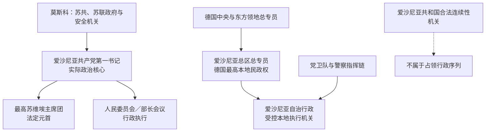

# 爱沙尼亚占领行政与苏维埃领导人表

## 时间

1940—1991年

## 概括

1940—1991年境内权力不能排成一条“总统世系”。苏联占领时期同时有名义上的最高苏维埃主席团、执行计划和行政的人民委员会或部长会议、掌实际政治任免的爱沙尼亚共产党第一书记，以及直接受莫斯科控制的安全机关与驻军。1941—1944年德国占领又分为国防军军事行政、“东方领地”民政体系、爱沙尼亚总区、本地自治行政和党卫队警察系统。本表把法定、行政和实际权力分列；爱沙尼亚共和国海外连续性另见共和国领导表。

## 1940年占领过渡机关

| 层级 / 角色 | 人物或机构 | 任期 | 实际权力与说明 |
| --- | --- | --- | --- |
| 苏联驻爱沙尼亚全权监督 | **安德烈·日丹诺夫** | 1940年6—8月 | 代表苏联中央监督最后通牒后的组阁、受控选举和吞并；没有爱沙尼亚宪制合法职务。 |
| 受胁迫任命的傀儡政府总理 | **约翰内斯·瓦雷斯** | 1940-06-21—08-25 | 由佩茨在占领压力下形式任命；清洗国家机关、组织单一候选选举并申请加入苏联。 |
| “劳动人民联盟”控制的议会 | 第二届国家议会下院，后改称临时最高苏维埃 | 1940年7—8月 | 选举没有自由竞争；通过苏维埃化和并入决议。 |
| 苏联军事与安全力量 | 红军、内务人民委员部等 | 1940-06起 | 形成最终强制力，掌逮捕、遣送、驻军和边境。 |

8月25日苏维埃宪制启用后，瓦雷斯转任最高苏维埃主席团主席；行政首脑转为人民委员会主席约翰内斯·劳里斯廷。共和国总统和于里·乌洛茨的宪法连续性不因这些人事变化而获得合法移交。

## 德国占领行政首脑

德国占领存在重叠指挥，不宜把哈尔马·梅埃称为“爱沙尼亚总统”或独立政府总理。军事、民政、党卫队警察和本地执行机关分别向不同上级负责。

### 最高军事与民政链

| 顺序 | 层级 | 人物 / 机构 | 任期 | 权力与备注 |
| --- | --- | --- | --- | --- |
| 1 | 国防军北方集团军后方地区军事行政 | **弗朗茨·冯·罗克斯** | 爱沙尼亚各地被占后至1941-12-05 | 德军在大陆和岛屿推进期间的最高后方军事统治者；组织初期本地行政。 |
| 2 | “东方领地”总督辖区 | **欣里希·洛泽**任总专员 | 1941—1944 | 驻里加，管辖爱沙尼亚、拉脱维亚、立陶宛及白俄罗斯西部；是区域上级，不是爱沙尼亚专员。 |
| 3 | 爱沙尼亚总区 | **卡尔-西格蒙德·利茨曼**任总专员 | 1941-12-05—1944-09-17 | 唯一一任爱沙尼亚总区总专员，掌最高本地民政、经济和任命权，向洛泽负责。 |
| 4 | 爱沙尼亚自治行政 | **哈尔马·梅埃**任总干事、实际负责人 | 1941-09—1944-09 | 由德方设立和监督；执行治安、经济、劳动及征兵事务，不具有主权。 |

军事行政向民政移交后，爱沙尼亚仍是国防军作战区，军队、民政和警察命令可能并行。1944年德军撤退时，总区与自治行政一并瓦解，没有向苏联合法移交爱沙尼亚主权。

### 德国安全警察与本地协作

| 角色 | 人物 / 机构 | 任期 | 说明 |
| --- | --- | --- | --- |
| 爱沙尼亚安全警察与保安处负责人 | **马丁·桑德贝格尔** | 1941—1943 | 指挥安全警察、保安处及迫害行动；与别动队系统相连。 |
| 爱沙尼亚安全警察与保安处负责人 | **伯恩哈德·巴茨** | 1943—1944 | 接替桑德贝格尔，维持镇压和警察体系至撤退。 |
| 爱沙尼亚自治行政内务总干事 | 奥斯卡·安格卢斯 | 1941—1944 | 掌受控本地内务机关；警察结构参与逮捕和迫害。 |
| 本地警察、保安队和营级单位 | 多个德方与本地指挥官 | 1941—1944 | 职能随时期和编制改变，受德国警察、军队或自治行政交叉控制。 |

自治行政虽受德国政策限制，但其高级负责人自愿任职，并在可支配范围内组织警察、劳役和征兵。因此，分析德国最高决策责任时，也应说明本地机构参与执行迫害和非法动员的责任。

## 爱沙尼亚共产党实际最高领导

共产党第一书记通常是苏联时期境内最有影响的政治职位。重大人事、安全、经济和民族政策仍受苏共中央、驻地第二书记、安全机关和联盟部委约束，故“实际最高领导”也不是独立国家元首。

| 顺序 | 领导人 | 职务与任期 | 实际权力 / 争议说明 |
| --- | --- | --- | --- |
| 1 | **卡尔·萨雷** | 第一书记，1940-08-28—约1943年 | 1941-09-03被德军俘获，此后已无实际指挥；名义终止年份存在资料差异。 |
| 2 | **尼古拉·卡罗塔姆** | 1941-09-03起代理，后任第一书记，至1950-03-26 | 德国占领期在苏联后方；1944年返回，领导战后斯大林化，1950年三月全会后被撤。其早期任期与萨雷名义任期有重叠。 |
| 3 | **约翰内斯·凯宾** | 第一书记，1950-03-26—1978-07-26 | 执政28年；经历斯大林后期、去斯大林化与工业化，在服从莫斯科下较多使用本地干部。 |
| 4 | **卡尔·瓦伊诺** | 第一书记，1978-07-26—1988-06-16 | 中央化、俄语化和社会停滞时期；在群众运动扩大时被撤换。 |
| 5 | **瓦伊诺·韦利亚斯** | 第一书记，1988-06-16—1990-03-25；党主席，1990-03-25—1991-08-22 | 支持部分主权改革；1990年竞争性选举和取消共产党垄断后，党职不再等于境内最高国家权力。 |

## 爱沙尼亚苏维埃社会主义共和国法定国家元首

最高苏维埃主席团主席是苏维埃宪制中的法定共和国元首，但其产生不经自由竞争，权力通常低于共产党第一书记。1941—1944年主席团在苏联后方运作，并未控制德国占领下的爱沙尼亚。

| 顺序 | 人物 | 职务与任期 | 备注 |
| --- | --- | --- | --- |
| 1 | **约翰内斯·瓦雷斯** | 最高苏维埃主席团主席，1940-08-25—1946-11-29 | 1940年傀儡政府总理转任；德国占领期在苏联后方。 |
| 2 | 尼戈尔·安德烈森 | 代理主席，1946-11-29—1947-03-05 | 以副主席身份代理。 |
| 3 | 爱德华·帕尔 | 主席，1947-03-05—1950-07-04 | 斯大林化与干部清洗时期。 |
| 4 | 奥古斯特·雅各布松 | 主席，1950-07-04—1958-02-04 | 斯大林后期至去斯大林化初期。 |
| 5 | 约翰·艾希费尔德 | 主席，1958-02-04—1961-10-12 | 科学家出身的礼仪性元首。 |
| 6 | 阿列克谢·米里谢普 | 主席，1961-10-12—1970-10-07 | 此前任部长会议主席。 |
| 7 | 亚历山大·安斯贝格 | 代理主席，1970-10-07—12-22 | 以副主席身份代理；部分记录亦注明另一副主席共同承担法定职责。 |
| 8 | 阿图尔·瓦德尔 | 主席，1970-12-22—1978-05-25 | 勃列日涅夫时期。 |
| 9 | 梅塔·万纳斯 | 代理主席，1978-05-25—07-26 | 以副主席身份代理；部分记录同时列阿诺德·吕特尔履行副主席职责。 |
| 10 | 约翰内斯·凯宾 | 主席，1978-07-26—1983-04-08 | 从共产党第一书记转任法定元首，实际权力低于继任第一书记卡尔·瓦伊诺。 |
| 11 | **阿诺德·吕特尔** | 主席，1983-04-08—1990-03-29 | 改革后期参与主权立法；后转任最高委员会主席。 |

## 苏维埃行政首脑完整序列

1940—1946年职称为“人民委员会主席”，此后为“部长会议主席”。德国占领时期，机构撤至苏联境内，不能视为在爱沙尼亚实际施政。

| 顺序 | 人物 | 职务与任期 | 备注 |
| --- | --- | --- | --- |
| 1 | **约翰内斯·劳里斯廷** | 人民委员会主席，1940-08-25—1941-08-28 | 首届苏维埃行政首脑；撤退途中死亡。 |
| — | 职位空缺 | 1941-08-28—1942-06-17 | 德国占领、苏方机关撤离后的空档。 |
| 2 | 奥斯卡·塞普雷 | 代理人民委员会主席，1942-06-17—1944-09-28 | 在俄罗斯苏维埃联邦社会主义共和国境内代理，1944年随苏方机关返回。 |
| 3 | **阿诺德·韦伊梅尔** | 人民委员会主席、部长会议主席，1944-09-28—1951-03-29 | 战后国有化、重建、镇压与集体化时期。 |
| 4 | 阿列克谢·米里谢普 | 部长会议主席，1951-03-29—1961-10-12 | 后转任主席团主席。 |
| 5 | 瓦尔特·克劳松 | 部长会议主席，1961-10-12—1984-01-18 | 长期计划经济和工业扩张时期。 |
| 6 | 布鲁诺·绍尔 | 部长会议主席，1984-01-18—1988-11-16 | 改革初期，后被更换。 |
| 7 | **因德雷克·托梅** | 部长会议主席，1988-11-16—1990-04-03 | 主权宣言与群众运动时期的末任苏维埃型政府首脑。 |

1990年4月3日埃德加·萨维萨尔政府成立后，境内行政进入恢复共和国的过渡阶段；其任期列入[爱沙尼亚共和国国家元首与政府首脑表](/%E4%BA%BA%E6%96%87%E7%A7%91%E5%AD%A6/%E5%8E%86%E5%8F%B2/%E6%AC%A7%E6%B4%B2/%E6%B3%A2%E7%BD%97%E7%9A%84%E6%B5%B7/%E7%88%B1%E6%B2%99%E5%B0%BC%E4%BA%9A/%E7%88%B1%E6%B2%99%E5%B0%BC%E4%BA%9A%E5%85%B1%E5%92%8C%E5%9B%BD%E5%9B%BD%E5%AE%B6%E5%85%83%E9%A6%96%E4%B8%8E%E6%94%BF%E5%BA%9C%E9%A6%96%E8%84%91%E8%A1%A8.md)。

## 1990—1992年最高委员会过渡

| 人物 | 正式职务与任期 | 权力变化 |
| --- | --- | --- |
| **阿诺德·吕特尔** | 最高委员会主席，1990-03-29—1992-10-06 | 由竞争性选举产生的最高委员会选出；1990年3月宣布恢复共和国过渡期，5月恢复国名，1991年8月通过恢复独立决议。 |
| 于洛·努吉斯 | 最高委员会议长，1990-03-29—1992-09-29 | 主持议会程序；1991年8月20日主持表决并敲槌确认。 |
| 埃德加·萨维萨尔 | 政府主席，1990-04-03—1992-01-30 | 境内行政首脑，政府逐步脱离苏联计划与联盟机构。 |
| 蒂特·韦希 | 政府主席，1992-01-30—10-22 | 货币、宪法与选举过渡；1992年宪政政府成立后交权。 |

1990年3月后，爱沙尼亚共产党即使继续存在，也不再垄断最高委员会和政府；1991年8月后其苏维埃权力链失去制度基础。吕特尔此时的正式职务仍是最高委员会主席，不应追称为“总统”。

## 权力层级辨析

- 最高苏维埃主席团主席是法定元首，第一书记才是大多数时期的实际政治最高领导。
- 部长会议主席负责日常行政和经济计划，但关键任免、预算方向和安全政策受党与联盟部委约束。
- 苏联驻军、国家安全委员会、内务机关和联盟直属企业往往绕过共和国机关，表中本地职务不能穷尽全部实际权力。
- 德国占领下，利茨曼是最高本地民政官，洛泽是其区域上级，梅埃只是受控本地行政负责人。
- 德国安全警察、党卫队和军队拥有独立指挥链，本地自治行政对其不能行使主权式控制。
- 1940—1991年爱沙尼亚共和国的海外国家元首、流亡政府与外交使团属于另一条法律连续性，不应与占领职务合并。

## 演变关系

- 历史过程：[苏德占领与苏联时期](/%E4%BA%BA%E6%96%87%E7%A7%91%E5%AD%A6/%E5%8E%86%E5%8F%B2/%E6%AC%A7%E6%B4%B2/%E6%B3%A2%E7%BD%97%E7%9A%84%E6%B5%B7/%E7%88%B1%E6%B2%99%E5%B0%BC%E4%BA%9A/%E8%8B%8F%E5%BE%B7%E5%8D%A0%E9%A2%86%E4%B8%8E%E8%8B%8F%E8%81%94%E6%97%B6%E6%9C%9F.md)
- 共和国连续性：[爱沙尼亚共和国国家元首与政府首脑表](/%E4%BA%BA%E6%96%87%E7%A7%91%E5%AD%A6/%E5%8E%86%E5%8F%B2/%E6%AC%A7%E6%B4%B2/%E6%B3%A2%E7%BD%97%E7%9A%84%E6%B5%B7/%E7%88%B1%E6%B2%99%E5%B0%BC%E4%BA%9A/%E7%88%B1%E6%B2%99%E5%B0%BC%E4%BA%9A%E5%85%B1%E5%92%8C%E5%9B%BD%E5%9B%BD%E5%AE%B6%E5%85%83%E9%A6%96%E4%B8%8E%E6%94%BF%E5%BA%9C%E9%A6%96%E8%84%91%E8%A1%A8.md)
- 区域背景：[苏联统治下的波罗的海](/%E4%BA%BA%E6%96%87%E7%A7%91%E5%AD%A6/%E5%8E%86%E5%8F%B2/%E6%AC%A7%E6%B4%B2/%E6%B3%A2%E7%BD%97%E7%9A%84%E6%B5%B7/%E8%8B%8F%E8%81%94%E7%BB%9F%E6%B2%BB%E4%B8%8B%E7%9A%84%E6%B3%A2%E7%BD%97%E7%9A%84%E6%B5%B7.md)
- 返回：[爱沙尼亚历史](/%E4%BA%BA%E6%96%87%E7%A7%91%E5%AD%A6/%E5%8E%86%E5%8F%B2/%E6%AC%A7%E6%B4%B2/%E6%B3%A2%E7%BD%97%E7%9A%84%E6%B5%B7/%E7%88%B1%E6%B2%99%E5%B0%BC%E4%BA%9A/README.md)
