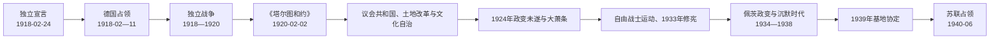

# 爱沙尼亚第一共和国

## 时间

1918年2月24日—1940年6月17日

## 概括

爱沙尼亚在德军进入塔林前夕宣布独立，但首届政府直到德国战败后才真正施政。1918—1920年独立战争同时面对苏俄红军、波罗的德意志军队和国内建国任务；《塔尔图和约》确认独立后，制宪议会以土地改革、议会制宪法和民族文化自治重塑社会。政党碎片化和短命内阁并未阻止国家制度成长，却在大萧条、反议会运动和宪制危机中失去稳定。康斯坦丁·佩茨1934年以紧急状态阻止“自由战士”运动可能胜选，建立“沉默时代”威权体制。1939—1940年苏德势力范围安排、苏联驻军和最后通牒最终中断共和国实际主权。

## 建国与德国占领

1917年俄国革命后，爱沙尼亚临时省议会“马佩夫”宣布自身为召集制宪会议前的最高权力。1918年2月德军击退布尔什维克、旧俄国机关撤退时，马佩夫长老委员会授权的救国委员会发布独立宣言：2月23日在派尔努公开宣读，2月24日塔林建立临时政府。

德军随即占领全境，不承认共和国，解散本地军队并压制政党，试图把波罗的海地区纳入受德国控制的政治经济体系。临时政府成员转入地下或被拘押。1918年11月德国战败和革命迫使占领军交权，爱沙尼亚政府才恢复公开活动；因此2月24日是国家成立日，11月则是行政实际接管的起点。

## 独立战争

1918年11月底，苏俄红军攻取纳尔瓦并扶植“爱沙尼亚劳动人民公社”。新共和国军队最初装备不足、组织松散，红军推进至距塔林不远。政府实行征兵、铁路动员和土地改革承诺，约翰·莱多内尔统率的军队逐渐稳定；英国海军控制芬兰湾、运送武器，芬兰志愿者及其他外援增强防线。

1919年初爱军反攻收复塔尔图、纳尔瓦和南部。战争并不限于东线：

- 南部爱军与拉脱维亚民族部队合作，对抗红军；
- 1919年6月在采西斯—沃努战役击败企图主导拉脱维亚的波罗的德意志“地方防卫军”和德国自由军团；
- 西北俄国白军从爱沙尼亚出发进攻彼得格勒，失败后撤回，给爱方带来难民、解除武装和外交压力；
- 苏俄无法重新占领爱沙尼亚，爱方也无意长期卷入俄国内战，双方转向谈判。

1920年2月2日《塔尔图和约》结束战争，苏俄“永远”承认爱沙尼亚独立并放弃主权要求。条约确定边界并安排资产、人员和经济问题，成为共和国法理记忆的重要文件。

## 国家建构与土地改革

1919年制宪议会通过激进土地改革，征收波罗的德意志大庄园，分配给无地农民、独立战争军人和小农。它同时实现三项目标：削弱旧庄园政治力量、兑现战争动员承诺、建立以家庭农场为基础的共和国社会。补偿、庄园经济拆分和小农负债也引发争议。

1920年宪法建立高度议会制。单院国会掌握广泛权力，政府首脑“国家长老”兼具有限国家代表职能，没有独立总统。比例代表制造多党格局，联合政府频繁更替；但文官、法院、地方自治、教育和财政制度仍保持连续。完整任期见[爱沙尼亚共和国国家元首与政府首脑表](/%E4%BA%BA%E6%96%87%E7%A7%91%E5%AD%A6/%E5%8E%86%E5%8F%B2/%E6%AC%A7%E6%B4%B2/%E6%B3%A2%E7%BD%97%E7%9A%84%E6%B5%B7/%E7%88%B1%E6%B2%99%E5%B0%BC%E4%BA%9A/%E7%88%B1%E6%B2%99%E5%B0%BC%E4%BA%9A%E5%85%B1%E5%92%8C%E5%9B%BD%E5%9B%BD%E5%AE%B6%E5%85%83%E9%A6%96%E4%B8%8E%E6%94%BF%E5%BA%9C%E9%A6%96%E8%84%91%E8%A1%A8.md)。

## 政体与社会

| 领域 | 制度与政策 | 成果及矛盾 |
| --- | --- | --- |
| 议会政治 | 比例代表、多党联合、全民选举 | 代表性广，但内阁短命、责任分散。 |
| 土地 | 1919年征收大庄园并建立小农场 | 解除德意志地主支配，也造成小农资本和市场压力。 |
| 教育文化 | 爱沙尼亚语学校和塔尔图大学；文化社团扩展 | 完成国家语言转型，少数族群教育安排仍需协调。 |
| 少数族群 | 1925年文化自治法 | 德意志人与犹太人建立文化自治机构，是当时欧洲较进步制度之一。 |
| 经济 | 农产品、页岩油、纺织和转口；1928年克朗稳定货币 | 对出口市场敏感，大萧条冲击农村和就业。 |
| 国防外交 | 征兵制、国联成员、与波罗的及北欧国家合作 | 小国难以获得有约束力的大国安全保证。 |

1924年12月，受苏联支持的共产主义者发动塔林政变，袭击政府、军营和交通节点，但很快被镇压。事件强化反共安全国家，也使共产党长期地下化。

## 大萧条与宪制危机

1929年后农产品价格、出口和信贷下降，小农债务与城市失业上升。传统政党不断重组，却难以迅速回应危机。独立战争退伍军人运动“自由战士联盟”由利益组织转为群众性民族主义、反党派运动，主张强势民选国家长老和削弱议会。

1933年公投通过自由战士支持的修宪方案，设权力更强的国家元首。1934年选举前，自由战士候选人可能获胜。时任国家长老康斯坦丁·佩茨与军队总司令莱多内尔于3月12日宣布全国紧急状态，逮捕自由战士领导层、延后选举，随后限制政党、新闻和议会活动。

政变支持者以阻止法西斯化和恢复秩序为理由，但它取消了竞争性选举，不能仅视为技术性延期。其形成既有宪法不稳定和经济危机等结构背景，也有佩茨集团维护权力的直接选择。

## “沉默时代”与1938年宪制

1934—1938年间，政府以行政命令和职业团体组织社会，政党活动被禁止或严格限制，反对者受审查和拘留。经济随欧洲复苏，基础设施、页岩油和社会政策有所发展，威权统治因而获得一部分秩序与现代化合法性。

1936年公投授权制定新宪法，1938年两院国会成立，佩茨当选首任共和国总统，卡雷尔·恩帕卢和于里·乌洛茨先后任总理。新制度恢复有限议会活动，却仍由总统、政府和紧急权力主导，未回到1920年代多党民主。

## 共和国失去实际主权

1939年8月《苏德互不侵犯条约》秘密议定书把爱沙尼亚划入苏联势力范围。9月，苏联以“奥热尔”号潜艇事件和安全要求施压；爱沙尼亚在缺乏可靠外援、军力悬殊且波兰已败的条件下签署互助条约，允许苏军在基地驻扎。政府试图以让步保存国家机关，实际战略空间不断缩小。

1940年6月，苏联指控爱沙尼亚违反条约，提出最后通牒，要求增兵和成立可接受的新政府。苏军于6月17日全面占领，佩茨在胁迫下任命约翰内斯·瓦雷斯政府。7月受控制的单一候选“选举”产生傀儡议会，8月请求加入苏联。军事占领、政治控制和吞并程序共同中断第一共和国的实际统治；共和国在海外外交机构和后来流亡政府的连续性主张并未终止。

### 衰落与灭亡原因

| 类型 | 因素 |
| --- | --- |
| 内部结构 | 高度碎片化议会制、弱行政与大萧条使民众对传统政党失望。 |
| 政治选择 | 1934年政变取消民主竞争，集中权力却没有显著增强外部安全。 |
| 地缘处境 | 爱沙尼亚人口和军力有限，处于德国与苏联之间，西方援助不可达。 |
| 国际体系 | 国联集体安全失效，波兰和北欧不能提供有约束力的共同防御。 |
| 外部压力 | 苏德秘密议定书消除两强相互制衡，苏军基地从内部改变力量对比。 |
| 直接机制 | 1940年最后通牒、全面进军、傀儡政府和受控选举完成强制吞并。 |

## 重要事件

| 时间 | 事件 | 结果与长期影响 |
| --- | --- | --- |
| 1918-02-24 | 宣布共和国 | 建立现代国家的法律起点。 |
| 1918-02—11 | 德国占领 | 临时政府无法施政，德国战败后接管国家。 |
| 1918-11—1920-02 | 独立战争 | 军队和国家机关在战争中建立。 |
| 1919-06 | 沃努战役 | 阻止波罗的德意志—德国军团控制拉脱维亚，形成胜利纪念。 |
| 1919 | 土地改革 | 解体庄园地主体系，扩大共和国社会基础。 |
| 1920-02-02 | 《塔尔图和约》 | 苏俄承认独立，战争结束。 |
| 1920-12 | 宪法生效 | 建立高度议会制共和国。 |
| 1924-12-01 | 共产主义政变未遂 | 安全体制和反共政治加强。 |
| 1925 | 文化自治法 | 为少数族群提供非领土文化自治。 |
| 1929—1933 | 大萧条 | 农村债务、失业和反议会运动扩大。 |
| 1933 | 修宪公投 | 强势国家元首制度获通过。 |
| 1934-03-12 | 佩茨政变 | 选举被取消，进入威权“沉默时代”。 |
| 1938 | 新宪法与总统制 | 有限恢复议会，威权核心延续。 |
| 1939-09—10 | 苏联施压与基地协定 | 苏军合法驻入，国家防务自主性受损。 |
| 1940-06-17 | 苏军全面占领 | 第一共和国实际主权终止。 |

## 演变关系

- 前一阶段：[利沃尼亚瓦解与瑞典、俄罗斯帝国统治](/%E4%BA%BA%E6%96%87%E7%A7%91%E5%AD%A6/%E5%8E%86%E5%8F%B2/%E6%AC%A7%E6%B4%B2/%E6%B3%A2%E7%BD%97%E7%9A%84%E6%B5%B7/%E7%88%B1%E6%B2%99%E5%B0%BC%E4%BA%9A/%E5%88%A9%E6%B2%83%E5%B0%BC%E4%BA%9A%E7%93%A6%E8%A7%A3%E4%B8%8E%E7%91%9E%E5%85%B8%E3%80%81%E4%BF%84%E7%BD%97%E6%96%AF%E5%B8%9D%E5%9B%BD%E7%BB%9F%E6%B2%BB.md)
- 区域背景：[波罗的三国独立](/%E4%BA%BA%E6%96%87%E7%A7%91%E5%AD%A6/%E5%8E%86%E5%8F%B2/%E6%AC%A7%E6%B4%B2/%E6%B3%A2%E7%BD%97%E7%9A%84%E6%B5%B7/%E6%B3%A2%E7%BD%97%E7%9A%84%E4%B8%89%E5%9B%BD%E7%8B%AC%E7%AB%8B.md)
- 领导序列：[爱沙尼亚共和国国家元首与政府首脑表](/%E4%BA%BA%E6%96%87%E7%A7%91%E5%AD%A6/%E5%8E%86%E5%8F%B2/%E6%AC%A7%E6%B4%B2/%E6%B3%A2%E7%BD%97%E7%9A%84%E6%B5%B7/%E7%88%B1%E6%B2%99%E5%B0%BC%E4%BA%9A/%E7%88%B1%E6%B2%99%E5%B0%BC%E4%BA%9A%E5%85%B1%E5%92%8C%E5%9B%BD%E5%9B%BD%E5%AE%B6%E5%85%83%E9%A6%96%E4%B8%8E%E6%94%BF%E5%BA%9C%E9%A6%96%E8%84%91%E8%A1%A8.md)
- 后一阶段：[苏德占领与苏联时期](/%E4%BA%BA%E6%96%87%E7%A7%91%E5%AD%A6/%E5%8E%86%E5%8F%B2/%E6%AC%A7%E6%B4%B2/%E6%B3%A2%E7%BD%97%E7%9A%84%E6%B5%B7/%E7%88%B1%E6%B2%99%E5%B0%BC%E4%BA%9A/%E8%8B%8F%E5%BE%B7%E5%8D%A0%E9%A2%86%E4%B8%8E%E8%8B%8F%E8%81%94%E6%97%B6%E6%9C%9F.md)
- 返回：[爱沙尼亚历史](/%E4%BA%BA%E6%96%87%E7%A7%91%E5%AD%A6/%E5%8E%86%E5%8F%B2/%E6%AC%A7%E6%B4%B2/%E6%B3%A2%E7%BD%97%E7%9A%84%E6%B5%B7/%E7%88%B1%E6%B2%99%E5%B0%BC%E4%BA%9A/README.md)
