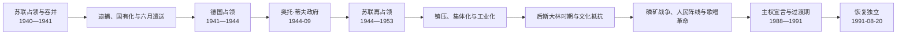

# 苏德占领与苏联时期

## 时间

1940年6月17日—1991年8月20日

## 概括

1940年苏联以最后通牒和军队全面进入爱沙尼亚，扶植傀儡政府、操纵选举并将该国并入苏联。1941年德国进攻苏联后，爱沙尼亚又被纳入“东方领地”总督辖区；德国拒绝恢复共和国，实施经济掠夺、强制动员、种族灭绝和政治镇压。1944年苏军回归前，于里·乌洛茨授权的奥托·蒂夫政府试图恢复国家，旋即失败。苏联再占领后通过镇压、集体化、工业化、人口迁入和共产党垄断重塑社会；海外外交机构与流亡政府则维持法律连续性主张。1987—1991年群众运动、主权立法和苏联危机汇合，最终使共和国恢复实际独立。

## 1940年苏联占领与吞并

1939年基地协定已使苏军驻入。1940年6月16日，苏联要求爱沙尼亚允许无限增兵并建立其认可的政府；在军事包围和外援无望下，政府接受，苏军17日占领全国。苏联特使安德烈·日丹诺夫监督政权更替，康斯坦丁·佩茨总统在胁迫下任命约翰内斯·瓦雷斯内阁。

7月选举只允许受占领当局控制的“劳动人民联盟”候选人参选，新议会随即宣布苏维埃政体并申请加入苏联。8月6日，爱沙尼亚被并为“爱沙尼亚苏维埃社会主义共和国”。这一流程发生在外国军队占领、反对派被排除和国家机关被胁迫之下；爱沙尼亚共和国及多个西方国家不承认吞并合法性。

### 苏维埃化

- 私有银行、大企业、土地和住房被国有化，经济并入苏联计划体系；
- 警察、军队、法院、社团与媒体被清洗或重组，共产党取得垄断；
- 前官员、军人、企业主、知识分子和政治组织成员被捕、处决或送往苏联腹地；
- 1941年6月14日，超过一万名居民在一次大规模行动中被遣送，家庭常被拆散；
- 爱沙尼亚军队被改编为红军部队，部分人员后遭清洗。

首年镇压破坏国家精英和社会组织，也使一部分居民在德国入侵初期把德军误认为摆脱苏联统治的机会。

## 1941—1944年德国占领

1941年夏德军进入，苏联机关和撤退部队实施破坏与动员，地方“森林兄弟”袭击苏方机构。爱沙尼亚民族人士希望恢复独立，但德国只把该地纳入“东方领地总督辖区”的“爱沙尼亚总区”。最高本地德国民政官是总专员卡尔-西格蒙德·利茨曼；哈尔马·梅埃领导的“爱沙尼亚自治行政”只执行德国命令，不是主权政府。完整权力链见[爱沙尼亚占领行政与苏维埃领导人表](/%E4%BA%BA%E6%96%87%E7%A7%91%E5%AD%A6/%E5%8E%86%E5%8F%B2/%E6%AC%A7%E6%B4%B2/%E6%B3%A2%E7%BD%97%E7%9A%84%E6%B5%B7/%E7%88%B1%E6%B2%99%E5%B0%BC%E4%BA%9A/%E7%88%B1%E6%B2%99%E5%B0%BC%E4%BA%9A%E5%8D%A0%E9%A2%86%E8%A1%8C%E6%94%BF%E4%B8%8E%E8%8B%8F%E7%BB%B4%E5%9F%83%E9%A2%86%E5%AF%BC%E4%BA%BA%E8%A1%A8.md)。

德国占领的主要内容包括：

| 领域 | 政策与过程 | 后果 |
| --- | --- | --- |
| 政治 | 禁止恢复共和国，利用受控本地行政 | 独立派被监视，实际权力在德国军政和警察机关。 |
| 经济 | 征收粮食、原料和劳动力，接管国有资产 | 生产服务德军，居民供应紧张。 |
| 种族迫害 | 安全部队与本地协作者登记、拘捕和杀害犹太人、罗姆人等 | 留在爱沙尼亚的犹太人几乎全部遇害；外地犹太人也被运至爱沙尼亚营地杀害。 |
| 战俘与政治犯 | 建立营地、监狱和处决点 | 大量苏联战俘、抵抗者和被指为共产主义者者死亡。 |
| 动员 | 先以志愿和警察营，后扩大征兵；部分爱沙尼亚人同时被苏军动员 | 同一社会成员被迫在敌对军队中作战，战后身份与责任复杂。 |
| 抵抗 | 民族委员会、地下组织、个人逃亡与拒绝征兵 | 反德、反苏和等待西方援助等路线并存。 |

纳粹德国和苏联的占领性质、意识形态与犯罪机制不同，不能彼此抵销。本地人员参与德国警察、营地和迫害机构的事实，也不能把占领当局的最高决策责任转嫁给整个民族。

## 1944年战争与奥托·蒂夫政府

1944年红军在纳尔瓦战线、锡尼迈埃高地和塔尔图方向推进。德国征召的爱沙尼亚部队、德国部队与苏军中的爱沙尼亚军团均参战，平民区遭轰炸。数万居民随德军撤退或乘船逃往瑞典、德国，形成长期海外社群。

依据1938年宪法连续性，末任合法总理于里·乌洛茨自1940年起履行总统职责。德国撤退时，他于9月18日任命奥托·蒂夫为代理总理并组阁。政府宣布中立和恢复共和国，在塔林长赫尔曼塔升起爱沙尼亚旗，试图接管机关；既无足够军队，也未获外援。苏军9月22日进入塔林，成员被捕、流亡或转入地下。

奥托·蒂夫政府持续时间短，却证明1944年不是主权从德国合法转交苏联，而是爱沙尼亚国家机关曾在两次占领之间尝试恢复统治。

## 苏联再占领与斯大林化

1944年后，苏联恢复爱沙尼亚苏维埃社会主义共和国机构。法定主席团、部长会议和法院服从爱沙尼亚共产党，而党又受苏联共产党中央、莫斯科派干部、安全机关和驻军约束。国家元首、政府首脑和实际第一书记必须分表理解。

### 镇压与集体化

苏联安全机关追捕前共和国官员、德国占领机构人员、拒绝动员者、民族地下组织和普通被怀疑者。森林兄弟在乡村进行武装抵抗，依靠亲属和农户网络生存；1940年代末至1950年代初被军事行动、告密、逮捕和大赦分化逐步压制。

1949年3月，超过两万名爱沙尼亚居民被遣送至西伯利亚等地，主要目标包括被称为“富农”的家庭和抵抗者亲属。遣送与税收、没收共同迫使农户加入集体农庄。农民土地所有权和独立经营被取消，农村社会受到根本改造。

### 工业化与人口变化

苏联重点发展东北部油页岩、能源和重工业，扩建纳尔瓦、科赫特拉-耶尔韦和塔林企业。劳动力从苏联其他地区大量迁入，俄语成为许多工业城市和全联盟企业的工作语言。纳尔瓦等战毁城市的人口构成尤其改变。

工业化提高城市化、教育和社会流动，也造成环境污染、住房紧张和地区差异。爱沙尼亚语仍是共和国名义官方文化语言，却在军队、中央企业和跨共和国行政中处于弱势。人口与语言政策遂成为后期民族运动的核心议题。

## 后斯大林时期

斯大林去世后，大规模恐怖下降，部分被遣送者获准返回。约翰内斯·凯宾长期任共产党第一书记，在服从莫斯科的前提下使用较多本地干部；1978年卡尔·瓦伊诺上台后，中央化和俄语化压力加大。电视、文学、历史研究、民俗和歌咏传统仍保存爱沙尼亚文化空间，但出版、社团和政治表达受审查。

| 领域 | 发展 | 内在矛盾 |
| --- | --- | --- |
| 教育文化 | 普及中高等教育，爱沙尼亚语学校、文学和歌咏节延续 | 意识形态审查与俄语高等、职业空间扩张并存。 |
| 经济 | 工业、住房和社会保障增长 | 计划短缺、低效率、污染和中央企业外部控制加深。 |
| 社会 | 城市化与专业阶层扩大 | 爱沙尼亚语、俄语社群生活空间分化。 |
| 政治 | 共和国机构形式完备 | 竞争性选举不存在，实际重大决定由党组织和莫斯科作出。 |
| 反对与记忆 | 地下出版、纪念行动、宗教与文化保护 | 公开政治组织常遭安全机关压制。 |

1980年塔林青年抗议和四十名知识分子公开信批评文化与语言政策，虽受压制，却显示社会不满已跨出私人领域。

## 歌唱革命与法律恢复路线

戈尔巴乔夫改革降低镇压门槛。1987年反对东北部大型磷矿开发的“磷矿战争”把环境、地方决定权和人口担忧结合起来。1988年爱沙尼亚人民阵线成立，遗产保护协会和独立派团体公开活动，蓝黑白旗恢复使用，大型夜间歌咏集会成为“歌唱革命”的象征。

运动内部有两条互相竞争又合作的路线：

- 人民阵线最初以苏联内主权、经济自主管理和渐进改革为主；
- 爱沙尼亚公民委员会和国会运动以1940年前公民及其后裔为基础，要求直接恢复被占领的共和国；
- 苏维埃时期选出的最高委员会则通过现有机关逐步废除吞并秩序；
- 俄语居民中的“国际运动”等组织反对脱离苏联，社会转型并非一致同意。

1988年11月16日，最高苏维埃通过主权宣言，主张爱沙尼亚法律优先。1989年8月23日，爱沙尼亚、拉脱维亚和立陶宛民众组成“波罗的海之路”，要求公开并否定苏德秘密议定书。1990年竞争性选举后，最高委员会宣布进入恢复共和国的过渡期，5月恢复“爱沙尼亚共和国”国名；共产党垄断权力终结。

1991年8月莫斯科政变时，最高委员会与公民委员会阵营达成妥协，8月20日通过恢复国家独立决议。志愿者保护电视塔和通信设施，苏军未能推翻决定。俄罗斯联邦8月24日重新承认爱沙尼亚，苏联9月6日承认波罗的三国独立，爱沙尼亚9月17日加入联合国。

## 占领秩序终结的原因

| 类型 | 因素 |
| --- | --- |
| 制度合法性 | 吞并未经自由同意，海外外交机构、家庭记忆和地下组织维持连续性叙事。 |
| 社会基础 | 高识字率、专业阶层、爱沙尼亚语文化机构和歌咏网络便于大规模和平动员。 |
| 经济环境 | 计划经济停滞、短缺和环境危机削弱苏联治理信誉。 |
| 政治机会 | 公开性、竞争性选举和莫斯科改革使组织、媒体与议会行动成为可能。 |
| 区域协同 | 波罗的三国相互示范，主权宣言和“波罗的海之路”扩大国际影响。 |
| 国际因素 | 苏德秘密议定书被正式否定，西方不承认政策为恢复而非新建国家提供法理空间。 |
| 直接触发 | 1991年莫斯科政变削弱联盟中央，爱沙尼亚机关在权力真空中作出独立决议。 |

## 重要事件

| 时间 | 事件 | 结果与长期影响 |
| --- | --- | --- |
| 1940-06-17 | 苏军全面占领 | 共和国实际主权中断。 |
| 1940-07—08 | 受控选举与并入苏联 | 建立爱沙尼亚苏维埃社会主义共和国。 |
| 1941-06-14 | 六月遣送 | 大规模家庭被送往苏联腹地，恐怖记忆形成。 |
| 1941夏 | 德军占领 | 苏联首次占领中断，但共和国未获恢复。 |
| 1941—1944 | 纳粹迫害和战争动员 | 犹太人大屠杀、战俘死亡和社会军事化。 |
| 1944-09-18—22 | 奥托·蒂夫政府 | 在两次占领间尝试恢复共和国，迅速被苏军压制。 |
| 1944—1950年代 | 森林兄弟抵抗 | 武装反苏网络最终被镇压与分化。 |
| 1949-03 | 三月遣送 | 加速集体化，农村社会结构被摧毁。 |
| 1950年代—1980年代 | 工业化与人口迁入 | 城市、语言和地区人口结构显著变化。 |
| 1980 | 青年抗议与知识分子公开信 | 语言文化不满进入公开政治记忆。 |
| 1987 | 磷矿战争 | 环境运动成为民族政治动员入口。 |
| 1988 | 人民阵线、歌唱革命和主权宣言 | 群众组织与议会法律路线结合。 |
| 1989-08-23 | 波罗的海之路 | 三国共同挑战秘密议定书和吞并合法性。 |
| 1990-03 | 宣布恢复共和国的过渡期 | 共产党统治终结，国家机关改造开始。 |
| 1991-08-20 | 恢复独立决议 | 爱沙尼亚重新取得实际主权。 |

## 演变关系

- 前一阶段：[爱沙尼亚第一共和国](/%E4%BA%BA%E6%96%87%E7%A7%91%E5%AD%A6/%E5%8E%86%E5%8F%B2/%E6%AC%A7%E6%B4%B2/%E6%B3%A2%E7%BD%97%E7%9A%84%E6%B5%B7/%E7%88%B1%E6%B2%99%E5%B0%BC%E4%BA%9A/%E7%88%B1%E6%B2%99%E5%B0%BC%E4%BA%9A%E7%AC%AC%E4%B8%80%E5%85%B1%E5%92%8C%E5%9B%BD.md)
- 区域背景：[苏联统治下的波罗的海](/%E4%BA%BA%E6%96%87%E7%A7%91%E5%AD%A6/%E5%8E%86%E5%8F%B2/%E6%AC%A7%E6%B4%B2/%E6%B3%A2%E7%BD%97%E7%9A%84%E6%B5%B7/%E8%8B%8F%E8%81%94%E7%BB%9F%E6%B2%BB%E4%B8%8B%E7%9A%84%E6%B3%A2%E7%BD%97%E7%9A%84%E6%B5%B7.md)
- 占领权力表：[爱沙尼亚占领行政与苏维埃领导人表](/%E4%BA%BA%E6%96%87%E7%A7%91%E5%AD%A6/%E5%8E%86%E5%8F%B2/%E6%AC%A7%E6%B4%B2/%E6%B3%A2%E7%BD%97%E7%9A%84%E6%B5%B7/%E7%88%B1%E6%B2%99%E5%B0%BC%E4%BA%9A/%E7%88%B1%E6%B2%99%E5%B0%BC%E4%BA%9A%E5%8D%A0%E9%A2%86%E8%A1%8C%E6%94%BF%E4%B8%8E%E8%8B%8F%E7%BB%B4%E5%9F%83%E9%A2%86%E5%AF%BC%E4%BA%BA%E8%A1%A8.md)
- 法律连续性：[爱沙尼亚共和国国家元首与政府首脑表](/%E4%BA%BA%E6%96%87%E7%A7%91%E5%AD%A6/%E5%8E%86%E5%8F%B2/%E6%AC%A7%E6%B4%B2/%E6%B3%A2%E7%BD%97%E7%9A%84%E6%B5%B7/%E7%88%B1%E6%B2%99%E5%B0%BC%E4%BA%9A/%E7%88%B1%E6%B2%99%E5%B0%BC%E4%BA%9A%E5%85%B1%E5%92%8C%E5%9B%BD%E5%9B%BD%E5%AE%B6%E5%85%83%E9%A6%96%E4%B8%8E%E6%94%BF%E5%BA%9C%E9%A6%96%E8%84%91%E8%A1%A8.md)
- 后一阶段：[恢复独立后的爱沙尼亚](/%E4%BA%BA%E6%96%87%E7%A7%91%E5%AD%A6/%E5%8E%86%E5%8F%B2/%E6%AC%A7%E6%B4%B2/%E6%B3%A2%E7%BD%97%E7%9A%84%E6%B5%B7/%E7%88%B1%E6%B2%99%E5%B0%BC%E4%BA%9A/%E6%81%A2%E5%A4%8D%E7%8B%AC%E7%AB%8B%E5%90%8E%E7%9A%84%E7%88%B1%E6%B2%99%E5%B0%BC%E4%BA%9A.md)
- 返回：[爱沙尼亚历史](/%E4%BA%BA%E6%96%87%E7%A7%91%E5%AD%A6/%E5%8E%86%E5%8F%B2/%E6%AC%A7%E6%B4%B2/%E6%B3%A2%E7%BD%97%E7%9A%84%E6%B5%B7/%E7%88%B1%E6%B2%99%E5%B0%BC%E4%BA%9A/README.md)
