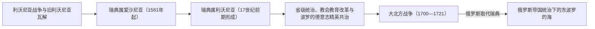

# 瑞典统治下的东波罗的海

## 时间

1561—1721年；瑞典在东波罗的海的核心优势主要形成于17世纪，并在大北方战争后终结。

## 空间范围

本页聚焦瑞典统治下的爱沙尼亚和利沃尼亚，以及这种统治对今爱沙尼亚、拉脱维亚历史的影响。瑞典强权的完整兴衰还包括芬兰、波美拉尼亚、三十年战争和北欧争霸，参见[瑞典帝国](/%E4%BA%BA%E6%96%87%E7%A7%91%E5%AD%A6/%E5%8E%86%E5%8F%B2/%E6%AC%A7%E6%B4%B2/%E5%8C%97%E6%AC%A7/%E7%91%9E%E5%85%B8%E5%B8%9D%E5%9B%BD.md)。

## 概括

利沃尼亚秩序瓦解后，瑞典逐步控制爱沙尼亚北部和利沃尼亚北部，在东波罗的海建立省份、港口与军事防线。瑞典在整个波罗的海周边扩张形成强权体系，其控制或影响范围包括芬兰、爱沙尼亚、利沃尼亚和波美拉尼亚；本页只讨论其中的东岸区域经验。

## 地区演进图

## 形成过程

- 1561年，今爱沙尼亚北部的贵族和城市接受瑞典王权，瑞典属爱沙尼亚由此形成。
- 瑞典在与波兰-立陶宛的战争中逐步取得利沃尼亚北部，17世纪前期确立对里加及周边地区的控制。
- 瑞典对东波罗的海的统治与其在三十年战争和北方战争前后的扩张相连，使瑞典成为波罗的海强国。
- 今立陶宛核心地区并未像爱沙尼亚和利沃尼亚那样长期成为瑞典省份，因此“瑞典统治下的东波罗的海”不能等同于整个波罗的三国都受瑞典统治。

## 统治与社会

- 瑞典王权通过总督、省级机构、教会和军政体系治理爱沙尼亚与利沃尼亚，但波罗的德意志贵族、城市和庄园仍保有重要地位。
- 王权推进司法和教会整顿、识字教育与学校建设；1632年建立的多尔帕特大学成为区域教育节点。
- 农民与庄园领主关系并未因政权转换而完全改变。17世纪后期的王室土地收回政策削弱部分贵族利益，也成为后来地方记忆中评价“瑞典时代”的重要背景。
- 瑞典统治把塔林、里加等港口纳入帝国军事和贸易体系，同时也使东波罗的海成为瑞典与波兰-立陶宛、丹麦和俄罗斯竞争的前线。

## 终结与后续

1700—1721年大北方战争中，俄罗斯占领瑞典的东波罗的海省份。1721年《尼斯塔德和约》确认瑞典丧失爱沙尼亚、利沃尼亚等地，波罗的海霸权转向俄罗斯。当地波罗的德意志贵族的许多特权在新统治下得到确认，使政权更替与社会结构变化并不同步。

## 关键辨析

- **瑞典帝国与瑞典属东波罗的海不是两段独立通史**：前者是完整强权史，本页是爱沙尼亚和拉脱维亚方向的地区经验。
- **瑞典统治范围不能套用现代三国边界**：爱沙尼亚和利沃尼亚是核心省份，立陶宛主要仍处于波兰-立陶宛国家框架。
- **大北方战争改变主导权，但没有立即清除旧精英结构**：俄罗斯接管后仍依赖波罗的德意志贵族和既有地方制度。

## 演变关系

- 前一节点：[利沃尼亚](/%E4%BA%BA%E6%96%87%E7%A7%91%E5%AD%A6/%E5%8E%86%E5%8F%B2/%E6%AC%A7%E6%B4%B2/%E6%B3%A2%E7%BD%97%E7%9A%84%E6%B5%B7/%E5%88%A9%E6%B2%83%E5%B0%BC%E4%BA%9A.md)及波兰-立陶宛在东波罗的海的统治。
- 通史主笔记：[瑞典帝国](/%E4%BA%BA%E6%96%87%E7%A7%91%E5%AD%A6/%E5%8E%86%E5%8F%B2/%E6%AC%A7%E6%B4%B2/%E5%8C%97%E6%AC%A7/%E7%91%9E%E5%85%B8%E5%B8%9D%E5%9B%BD.md)。
- 后一节点：[俄罗斯帝国统治下的波罗的海](/%E4%BA%BA%E6%96%87%E7%A7%91%E5%AD%A6/%E5%8E%86%E5%8F%B2/%E6%AC%A7%E6%B4%B2/%E6%B3%A2%E7%BD%97%E7%9A%84%E6%B5%B7/%E4%BF%84%E7%BD%97%E6%96%AF%E5%B8%9D%E5%9B%BD%E7%BB%9F%E6%B2%BB%E4%B8%8B%E7%9A%84%E6%B3%A2%E7%BD%97%E7%9A%84%E6%B5%B7.md)。
