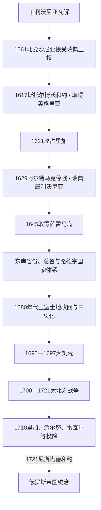

# 瑞典统治下的东波罗的海

[返回波罗的海历史](/%E4%BA%BA%E6%96%87%E7%A7%91%E5%AD%A6/%E5%8E%86%E5%8F%B2/%E6%AC%A7%E6%B4%B2/%E6%B3%A2%E7%BD%97%E7%9A%84%E6%B5%B7/README.md)

## 时间

1561—1721年。北爱沙尼亚自1561年接受瑞典王权；瑞典在17世纪陆续取得英格里亚、里加及利沃尼亚大部、萨雷马岛。俄军在1700—1710年间逐步占领这些省份，1710年地方投降，1721年《尼斯塔德和约》正式结束瑞典主权。

## 空间范围

核心包括瑞典属爱沙尼亚、瑞典属利沃尼亚、英格里亚和萨雷马岛。拉特加尔仍主要留在波兰—立陶宛属利沃尼亚，库尔兰和塞米加利亚公国是联邦封地，立陶宛核心也未长期成为瑞典省份。因此本页不把现代“波罗的三国”疆域整体套入瑞典统治。瑞典强权全史参见[瑞典帝国](/%E4%BA%BA%E6%96%87%E7%A7%91%E5%AD%A6/%E5%8E%86%E5%8F%B2/%E6%AC%A7%E6%B4%B2/%E5%8C%97%E6%AC%A7/%E7%91%9E%E5%85%B8%E5%B8%9D%E5%9B%BD.md)。

## 概括

[利沃尼亚](/%E4%BA%BA%E6%96%87%E7%A7%91%E5%AD%A6/%E5%8E%86%E5%8F%B2/%E6%AC%A7%E6%B4%B2/%E6%B3%A2%E7%BD%97%E7%9A%84%E6%B5%B7/%E5%88%A9%E6%B2%83%E5%B0%BC%E4%BA%9A.md)解体后，瑞典利用当地贵族求援、与莫斯科及波兰—立陶宛的战争逐步建立东岸省份。瑞典王权并未简单废除旧秩序，而是通过总督、王家法庭、路德宗教会和驻军治理，同时承认城市与波罗的德意志贵族的许多特权。

17世纪后期，查理十一世推动王室土地收回、财政中央化、学校和教会整顿，限制部分贵族权力并改善王室农民申诉渠道，却没有普遍废除农奴制。1695—1697年大饥荒、大北方战争、瘟疫和俄军征服共同摧毁瑞典统治。1710年投降条款恢复并保障地方等级权利，说明政权更替与社会结构更替并不同步。

## 演进图

## 领土形成过程

| 时间 | 事件 | 领土结果与意义 |
|---|---|---|
| 1561年 | 北爱沙尼亚贵族与雷瓦尔向埃里克十四世效忠 | 瑞典属爱沙尼亚形成；这是地方等级寻求军事保护与瑞典扩张结合的结果。 |
| 1581—1583年 | 瑞典夺取纳尔瓦等地，利沃尼亚战争结束 | 瑞典巩固爱沙尼亚北部和东北据点，但利沃尼亚大部仍归波兰—立陶宛。 |
| 1592—1599年 | 瑞典—波兰共主西吉斯蒙德被瑞典废黜 | 瓦萨王朝继承争端转化为长期瑞典—波兰战争，利沃尼亚成为主战场。 |
| 1617年 | 《斯托尔博沃和约》 | 莫斯科割让英格里亚和凯基萨尔米；俄罗斯暂时失去直接波罗的海出口，瑞典东岸防线连贯。 |
| 1621年 | 古斯塔夫二世·阿道夫攻占里加 | 瑞典取得道加瓦河口和东波罗的海重要港口。 |
| 1629年 | 《阿尔特马克停战协定》 | 波兰—立陶宛承认瑞典占有里加及利沃尼亚大部；拉特加尔仍属联邦。 |
| 1635、1660年 | 什图姆斯多夫停战与《奥利瓦和约》 | 瑞典退还部分临时占领港口；1660年波兰国王放弃瑞典王位主张并确认主要领土现状。 |
| 1645年 | 《布勒姆瑟布鲁和约》 | 丹麦割让萨雷马岛，瑞典在今爱沙尼亚的领地更完整。 |
| 1656—1661年 | 俄瑞战争 | 俄军一度占领塔尔图等地，最终基本恢复战前边界，暴露东部防线压力。 |
| 1700—1710年 | 大北方战争东岸战场 | 俄军先后夺取英格里亚、塔尔图、纳尔瓦、里加、派尔努和雷瓦尔。 |
| 1710、1721年 | 地方投降与《尼斯塔德和约》 | 俄国实际占领在1710年完成，瑞典到1721年才正式割让爱沙尼亚、利沃尼亚、英格里亚等地。 |

## 统治结构

| 层级 | 角色与实际权力 |
|---|---|
| 瑞典君主与王国枢密院 | 决定战争、税赋、任命、土地收回和宗教政策，是最终主权中心。君主未常驻东岸。 |
| 总督或总督长官 | 分别治理爱沙尼亚、利沃尼亚、英格里亚等省，统筹军政、财政和司法；约翰·许特等人也推动学校与行政改革。 |
| 王家法庭与省级机关 | 塔尔图等高等法院处理上诉，地方官署执行王令；瑞典法与既有德意志习惯法并存，整合程度因省而异。 |
| 波罗的德意志骑士团体 | 登记贵族通过地方议会、庄园和领主司法控制乡村；在早期投降特权下保有较大自治，1680年代土地收回后受到王权更强约束。 |
| 城市市议会与行会 | 里加、雷瓦尔、塔尔图、纳尔瓦等维持城市法、商业和部分司法自治，同时承担关税、驻军和防务。 |
| 路德宗教会 | 是国家宗教与乡村行政的重要支柱，负责堂区、婚姻、教理问答和学校；使用本地语言传教促进爱沙尼亚语、拉脱维亚语书写。 |
| 农民与庄园共同体 | 构成人口与税役主体，承担地租、劳役和运输；能向王家机关申诉的空间增加，但领主人身和土地控制仍强。 |

## 瑞典君主世系

下表列出自北爱沙尼亚接受瑞典王权到正式割让东岸省份期间的全部瑞典君主。摄政和幼主监护由备注说明。

| 顺序 | 君主 | 王室 | 在位 | 与前任关系 | 东波罗的海关键事件 |
|---:|---|---|---|---|---|
| 1 | **埃里克十四世** | 瓦萨 | 1560—1568年 | 古斯塔夫一世长子 | 1561年接纳北爱沙尼亚贵族与雷瓦尔效忠，建立瑞典属爱沙尼亚；后被弟弟废黜。 |
| 2 | 约翰三世 | 瓦萨 | 1568—1592年 | 埃里克十四世之弟 | 延续利沃尼亚战争，1581年瑞军夺纳尔瓦；1583年停战后巩固北爱沙尼亚。 |
| 3 | 西吉斯蒙德 | 瓦萨 | 1592—1599年 | 约翰三世之子；兼波兰国王、立陶宛大公 | 共主身份引发宗教与宪政冲突，1599年被瑞典等级会议废黜；继续以波兰国王身份争夺瑞典王位。 |
| 4 | 查理九世 | 瓦萨 | 1604—1611年；1599年后实际摄政 | 约翰三世之弟 | 与西吉斯蒙德派及波兰—立陶宛争夺利沃尼亚，对俄政策为英格里亚扩张奠基。 |
| 5 | **古斯塔夫二世·阿道夫** | 瓦萨 | 1611—1632年 | 查理九世之子 | 1617年取得英格里亚，1621年攻占里加，1629年确立瑞典属利沃尼亚，1632年创办塔尔图大学。 |
| 6 | 克里斯蒂娜 | 瓦萨 | 1632—1654年 | 古斯塔夫二世独女；幼年由摄政政府治理 | 1645年取得萨雷马岛；行政、教会和教育制度继续发展，1654年退位。 |
| 7 | 查理十世·古斯塔夫 | 普法尔茨-茨魏布吕肯 | 1654—1660年 | 克里斯蒂娜表兄之后、指定继承人 | 北方战争扩大，俄军一度进入利沃尼亚；1660年《奥利瓦和约》确认瑞典地位。 |
| 8 | 查理十一世 | 普法尔茨-茨魏布吕肯 | 1660—1697年 | 查理十世之子；1660—1672年由摄政政府治理 | 1680年代推动王室土地收回、财政和教会中央化；统治末期发生1695—1697年大饥荒。 |
| 9 | 查理十二世 | 普法尔茨-茨魏布吕肯 | 1697—1718年 | 查理十一世之子 | 大北方战争初期胜利后远征俄境，1709年波尔塔瓦败局使东岸省份失去救援；在挪威战死。 |
| 10 | 乌尔丽卡·埃莱奥诺拉 | 普法尔茨-茨魏布吕肯 | 1718—1720年 | 查理十二世之妹 | 放弃王权绝对制并让位丈夫；东岸此时已被俄军占领，和谈继续。 |
| 11 | 弗雷德里克一世 | 黑森-卡塞尔 | 1720—1751年 | 乌尔丽卡之夫 | 1721年签订《尼斯塔德和约》，正式割让爱沙尼亚、利沃尼亚、英格里亚等地。 |

## 分阶段发展

### 立足北爱沙尼亚（1561—1611）

北爱沙尼亚贵族在莫斯科进攻和旧利沃尼亚崩溃中选择瑞典保护。王权确认贵族、城市和路德宗信仰权利，以较低制度改造成本换取效忠。瓦萨家族内部争位和瑞典—波兰战争使当地长期处于前线，财政与兵员主要服务防务。

### 帝国扩张与省份建设（1611—1660）

古斯塔夫二世·阿道夫利用俄国混乱和波兰—瑞典战争取得英格里亚、里加与利沃尼亚大部，使芬兰湾和里加湾进入同一战略体系。总督约翰·许特推动高等法院、文法学校与教会整顿；1632年塔尔图大学成立，设哲学、法学、神学和医学四科。国家希望训练牧师、官员和军政人才，但学生与精英仍主要来自瑞典、芬兰和德意志语群体，本地农民并未立刻普遍进入高等教育。

### 贵族协商与王权中央化（1660—1694）

早期瑞典王权依赖波罗的德意志贵族和城市，地方等级保有庄园、司法和议会权。查理十一世亲政后以“土地收回”复查贵族占有的王室土地，在利沃尼亚尤其大规模收回庄园，将收入用于军队和行政。这削弱大领主、增加王室农民比例，并扩大政府调查领主滥权的能力；爱沙尼亚省执行程度较温和。

土地收回引起利沃尼亚贵族强烈反对。约翰·赖因霍尔德·帕特库尔等人把地方特权争端带入国际政治，后来参与促成反瑞典联盟。改革不是现代平等化：庄园劳役和农民依附仍存在，城市自治也继续受等级限制。

### 饥荒、战争与崩溃（1695—1721）

1695—1697年连续歉收和行政救济不足造成爱沙尼亚、利沃尼亚和芬兰严重饥荒，具体死亡数字因统计残缺而有差异。人口、粮储和庄园经济尚未恢复，大北方战争即于1700年爆发。

查理十二世1700年在纳尔瓦击败俄军，却把主力转向波兰和萨克森，给予彼得一世重建军队的时间。俄军1703年控制涅瓦河口并建立圣彼得堡，1704年夺塔尔图与纳尔瓦。1709年波尔塔瓦战役后瑞典无法再援救东岸；1710年里加、派尔努、雷瓦尔等在围城、饥饿与鼠疫中投降。

俄国以确认路德宗、贵族和城市旧特权换取投降，部分逆转查理十一世土地收回。1721年和约才把军事占领转化为国际承认的主权。

## 重要事件

| 时间 | 事件 | 具体影响 |
|---|---|---|
| 1561年 | 北爱沙尼亚效忠瑞典 | 建立持续一个半世纪的瑞典属爱沙尼亚。 |
| 1617年 | 《斯托尔博沃和约》 | 取得英格里亚，隔断俄罗斯与波罗的海主要出海口。 |
| 1621、1629年 | 攻取里加与《阿尔特马克停战协定》 | 瑞典属利沃尼亚形成，里加成为帝国重要城市。 |
| 1632年 | 塔尔图大学建立 | 建立东岸高等教育与官员、牧师训练中心。 |
| 1645年 | 取得萨雷马岛 | 今爱沙尼亚主要区域大体进入瑞典体系。 |
| 1680年代 | 王室土地收回 | 扩大王室财政和中央控制，激化贵族特权冲突。 |
| 1686年 | 拉脱维亚语《新约》出版 | 教会教育和本地语言书写的重要里程碑；爱沙尼亚语宗教文本也不断发展。 |
| 1695—1697年 | 大饥荒 | 大量人口死亡与流亡，削弱战前社会承受力。 |
| 1700年 | 纳尔瓦战役 | 瑞典取得早期大胜，却未消除俄国长期资源优势。 |
| 1704—1710年 | 俄军夺取东岸城市 | 塔尔图、纳尔瓦、里加、派尔努和雷瓦尔相继失守。 |
| 1721年 | 《尼斯塔德和约》 | 瑞典东岸帝国终结，俄罗斯成为波罗的海主导强权。 |

## 教育、宗教与社会

- 瑞典把路德宗确立为国家教会，推进堂区巡视、教理问答和牧师训练。使用爱沙尼亚语、拉脱维亚语的宗教书籍增加，促进识字和书面语发展，但普及速度因地区、战争和资源而异。
- 1632年塔尔图大学及里加、雷瓦尔、塔尔图文法学校服务整个帝国精英网络。大学在1656年战争中迁离，1665年停办，1690年恢复，1699年迁派尔努，1710年关闭。
- 波罗的德意志贵族和城市市民仍占政治、土地与高等教育优势；瑞典官员加入上层，却未取代地方德意志语精英。
- 农民对“瑞典时代”的后世正面记忆，与土地收回、王家申诉和教育改革有关；“美好旧瑞典时代”同时是后来形成的历史记忆，不能遮蔽农奴依附、战争征用、饥荒和社会等级。

## 兴盛条件

1. 瑞典本土与芬兰的军事财政改革提供常备军和官僚能力。
2. 爱沙尼亚贵族主动寻求保护，使1561年立足成本较低。
3. 俄罗斯混乱及波兰—瑞典王朝冲突为扩张创造窗口。
4. 英格里亚、纳尔瓦、雷瓦尔和里加形成港口—要塞链，支持贸易和防务。
5. 王权与地方贵族、城市妥协，保持既有行政连续性。

## 衰落与灭亡原因

### 结构因素

- 瑞典人口与财政基础小于反瑞典联盟总体，东岸领地广阔且跨海分散。
- 地方贵族特权与中央集权长期矛盾，土地收回虽增加收入，也促使反对者寻求外援。
- 省份是对俄、对波战争前线，城市和乡村反复承担驻军、运输与税役。
- 1690年代饥荒和1700年代瘟疫显著削弱人口与粮食供给。

### 外部压力

彼得一世改革军队、建立造船和炮兵体系，并以俄国更大人口、税源和战略纵深持续作战。丹麦—挪威、萨克森—波兰与俄国结盟迫使瑞典多线应战；查理十二世在1700年后长期把主力用于波兰、萨克森和俄国内陆，使东岸防御逐渐孤立。

### 直接触发

1709年波尔塔瓦战败摧毁瑞典主力和快速反攻能力。1710年俄军围城与鼠疫迫使东岸政治单位分别投降；1721年和约承认既成事实。瑞典统治不是被单一地方起义推翻，而是在总体帝国战争失败中终结。

## 关键辨析

- **瑞典统治范围不等于现代三国**：瑞典长期统治爱沙尼亚和拉脱维亚北中部，立陶宛核心仍属波兰—立陶宛国家。
- **1710年与1721年各有意义**：前者是实际占领和地方投降，后者是瑞典正式割让。
- **改革不等于废除农奴制**：王室土地收回限制部分贵族权力，却保留庄园等级。
- **“瑞典时代美好”是有现实基础的后世记忆，也是选择性叙事**：教育和申诉制度进展与饥荒、战争、依附关系并存。

## 演变关系

- 前一节点：[利沃尼亚](/%E4%BA%BA%E6%96%87%E7%A7%91%E5%AD%A6/%E5%8E%86%E5%8F%B2/%E6%AC%A7%E6%B4%B2/%E6%B3%A2%E7%BD%97%E7%9A%84%E6%B5%B7/%E5%88%A9%E6%B2%83%E5%B0%BC%E4%BA%9A.md)及[波兰-立陶宛联邦](/%E4%BA%BA%E6%96%87%E7%A7%91%E5%AD%A6/%E5%8E%86%E5%8F%B2/%E6%AC%A7%E6%B4%B2/%E6%96%AF%E6%8B%89%E5%A4%AB/%E8%A5%BF%E6%96%AF%E6%8B%89%E5%A4%AB/%E6%B3%A2%E5%85%B0-%E7%AB%8B%E9%99%B6%E5%AE%9B%E8%81%94%E9%82%A6.md)在东波罗的海的统治。
- 帝国主线：[瑞典帝国](/%E4%BA%BA%E6%96%87%E7%A7%91%E5%AD%A6/%E5%8E%86%E5%8F%B2/%E6%AC%A7%E6%B4%B2/%E5%8C%97%E6%AC%A7/%E7%91%9E%E5%85%B8%E5%B8%9D%E5%9B%BD.md)。
- 后一节点：[俄罗斯帝国统治下的波罗的海](/%E4%BA%BA%E6%96%87%E7%A7%91%E5%AD%A6/%E5%8E%86%E5%8F%B2/%E6%AC%A7%E6%B4%B2/%E6%B3%A2%E7%BD%97%E7%9A%84%E6%B5%B7/%E4%BF%84%E7%BD%97%E6%96%AF%E5%B8%9D%E5%9B%BD%E7%BB%9F%E6%B2%BB%E4%B8%8B%E7%9A%84%E6%B3%A2%E7%BD%97%E7%9A%84%E6%B5%B7.md)。
