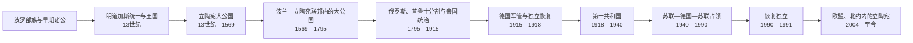

# 立陶宛历史

## 历史演进图

## 历史主线

立陶宛由波罗的海东南部诸部在13世纪军事修会扩张压力下整合。明道加斯1253年加冕为国王，但王号未能稳定延续；格迪米纳斯家族通过战争、婚姻和保留鲁塞尼亚地方制度，把大公国扩展成横跨波罗的海与黑海方向的多族群国家。1385年后立陶宛与波兰形成共同君主关系并接受天主教，维陶塔斯时期达到强盛。1569年卢布林联合建立波兰—立陶宛联邦，立陶宛大公国仍保留法律、财政、军队和官职，直至1795年瓜分。

俄罗斯帝国把原大公国拆入多个省份。两次19世纪起义失败后，贵族主导的旧联邦复国路线让位于以立陶宛语言、天主教、秘密教育和农民社会为基础的民族复兴。第一次世界大战先后摧毁俄国与德国控制，立陶宛委员会于1918年2月16日宣布恢复国家。独立战争保住核心领土，却因与波兰冲突失去维尔纽斯；考纳斯成为临时首都。1926年政变结束议会民主，斯梅托纳威权体制延续到1940年苏联占领。

1940—1990年先后经历苏联首次占领、纳粹德国占领和苏联再占领。纳粹及本地协作者杀害绝大多数立陶宛犹太人；苏联则以驱逐、集体化和镇压击败森林兄弟。后斯大林时期的工业化、城市化与教育扩展没有消除国家连续性、天主教和民族记忆。萨尤季斯在1988年后发动群众主权运动，1990年3月11日议会以1918年共和国法律连续性恢复独立。

1991年一月事件中苏军武力未能推翻政府；莫斯科八月政变失败后独立获广泛承认。立陶宛建立民主宪制与市场经济，2004年加入北约和欧盟，2015年采用欧元，2025年与欧洲大陆电网同步。俄乌战争使国防、能源脱俄、盟军部署和对乌支持成为国家战略主轴。截至2026-07-14，总统为吉塔纳斯·瑙塞达，新宣誓的第21届政府由明道加斯·辛克维丘斯领导。

## 分期导航

| 顺序 | 阶段 | 时间 | 简要概括 |
| --- | --- | --- | --- |
| 1 | [早期波罗的人](/%E4%BA%BA%E6%96%87%E7%A7%91%E5%AD%A6/%E5%8E%86%E5%8F%B2/%E6%AC%A7%E6%B4%B2/%E6%B3%A2%E7%BD%97%E7%9A%84%E6%B5%B7/%E6%97%A9%E6%9C%9F%E6%B3%A2%E7%BD%97%E7%9A%84%E4%BA%BA.md) | 史前—13世纪 | 波罗语言族群形成、部族社会、贸易与军事修会压力，是立陶宛国家形成的区域背景。 |
| 2 | [立陶宛大公国](/%E4%BA%BA%E6%96%87%E7%A7%91%E5%AD%A6/%E5%8E%86%E5%8F%B2/%E6%AC%A7%E6%B4%B2/%E6%B3%A2%E7%BD%97%E7%9A%84%E6%B5%B7/%E7%AB%8B%E9%99%B6%E5%AE%9B%E5%A4%A7%E5%85%AC%E5%9B%BD.md) | 约13世纪中叶—1795 | 明道加斯统一、格迪米纳斯扩张、基督教化、波兰联合、联邦内制度延续及瓜分灭亡。 |
| 3 | [俄罗斯帝国统治与民族复兴](/%E4%BA%BA%E6%96%87%E7%A7%91%E5%AD%A6/%E5%8E%86%E5%8F%B2/%E6%AC%A7%E6%B4%B2/%E6%B3%A2%E7%BD%97%E7%9A%84%E6%B5%B7/%E7%AB%8B%E9%99%B6%E5%AE%9B/%E4%BF%84%E7%BD%97%E6%96%AF%E5%B8%9D%E5%9B%BD%E7%BB%9F%E6%B2%BB%E4%B8%8E%E6%B0%91%E6%97%8F%E5%A4%8D%E5%85%B4.md) | 1795—1918 | 帝国分省、两次起义、俄化与书禁、民族复兴、德军占领和2月16日独立法案。 |
| 4 | [第一次共和国、战争与占领](/%E4%BA%BA%E6%96%87%E7%A7%91%E5%AD%A6/%E5%8E%86%E5%8F%B2/%E6%AC%A7%E6%B4%B2/%E6%B3%A2%E7%BD%97%E7%9A%84%E6%B5%B7/%E7%AB%8B%E9%99%B6%E5%AE%9B/%E7%AC%AC%E4%B8%80%E6%AC%A1%E5%85%B1%E5%92%8C%E5%9B%BD%E3%80%81%E6%88%98%E4%BA%89%E4%B8%8E%E5%8D%A0%E9%A2%86.md) | 1918—1940 | 三线独立战争、考纳斯建国、克莱佩达、1926政变、连续最后通牒及苏联吞并。 |
| 5 | [苏德占领与苏联时期](/%E4%BA%BA%E6%96%87%E7%A7%91%E5%AD%A6/%E5%8E%86%E5%8F%B2/%E6%AC%A7%E6%B4%B2/%E6%B3%A2%E7%BD%97%E7%9A%84%E6%B5%B7/%E7%AB%8B%E9%99%B6%E5%AE%9B/%E8%8B%8F%E5%BE%B7%E5%8D%A0%E9%A2%86%E4%B8%8E%E8%8B%8F%E8%81%94%E6%97%B6%E6%9C%9F.md) | 1940—1990 | 苏联镇压、纳粹占领与大屠杀、森林兄弟、集体化、苏维埃社会和萨尤季斯。 |
| 6 | [恢复独立后的立陶宛](/%E4%BA%BA%E6%96%87%E7%A7%91%E5%AD%A6/%E5%8E%86%E5%8F%B2/%E6%AC%A7%E6%B4%B2/%E6%B3%A2%E7%BD%97%E7%9A%84%E6%B5%B7/%E7%AB%8B%E9%99%B6%E5%AE%9B/%E6%81%A2%E5%A4%8D%E7%8B%AC%E7%AB%8B%E5%90%8E%E7%9A%84%E7%AB%8B%E9%99%B6%E5%AE%9B.md) | 1990—至今 | 一月事件、国际承认、市场与宪政转型、欧盟北约、能源独立及当前安全政策。 |

## 世系与领导人专表

| 专表 | 覆盖范围 | 说明 |
| --- | --- | --- |
| [立陶宛大公世系表](/%E4%BA%BA%E6%96%87%E7%A7%91%E5%AD%A6/%E5%8E%86%E5%8F%B2/%E6%AC%A7%E6%B4%B2/%E6%B3%A2%E7%BD%97%E7%9A%84%E6%B5%B7/%E7%AB%8B%E9%99%B6%E5%AE%9B%E5%A4%A7%E5%85%AC%E4%B8%96%E7%B3%BB%E8%A1%A8.md) | 约1236—1795 | 列全可证大公、共同统治伙伴、摄政、复位、竞争选举和占领性宣称，早期争议明确标注。 |
| [立陶宛现代国家元首与政府首脑表](/%E4%BA%BA%E6%96%87%E7%A7%91%E5%AD%A6/%E5%8E%86%E5%8F%B2/%E6%AC%A7%E6%B4%B2/%E6%B3%A2%E7%BD%97%E7%9A%84%E6%B5%B7/%E7%AB%8B%E9%99%B6%E5%AE%9B/%E7%AB%8B%E9%99%B6%E5%AE%9B%E7%8E%B0%E4%BB%A3%E5%9B%BD%E5%AE%B6%E5%85%83%E9%A6%96%E4%B8%8E%E6%94%BF%E5%BA%9C%E9%A6%96%E8%84%91%E8%A1%A8.md) | 1918—至今 | 分开列第一共和国、苏德占领机构、苏维埃法定与实际领导、恢复独立后的总统及完整总理序列。 |

## 重要转折与时间节点

| 时间 | 转折 | 历史意义 |
| --- | --- | --- |
| 1219 | 诸公对外条约 | 显示统一前多中心结构，明道加斯已是重要公。 |
| 1253 | 明道加斯加冕 | 立陶宛首次获拉丁基督教世界王国承认。 |
| 1316—1341 | 格迪米纳斯统治 | 维尔纽斯成中心，多族群大公国成形。 |
| 1385—1387 | 克雷沃联合与基督教化 | 开启波兰共同君主关系，改变宗教与外交格局。 |
| 1410 | 格伦瓦尔德战役 | 波兰—立陶宛联合军重创条顿骑士团。 |
| 1569 | 卢布林联合 | 大公国进入复合联邦，制度主体仍存。 |
| 1655 | 莫斯科军占维尔纽斯 | 首都遭毁，大公国经历人口与经济重创。 |
| 1791—1795 | 改革、起义与三次瓜分终局 | 改革失败后大公国及联邦被俄普奥消灭。 |
| 1863—1864 | 一月起义失败 | 俄化加强，民族运动转向语言、教育与群众组织。 |
| 1864—1904 | 立陶宛语拉丁字母书禁 | 书籍走私网络强化语言—宗教—民族认同。 |
| 1905 | 维尔纽斯大议会 | 民族复兴进入现代群众政治。 |
| 1918-02-16 | 独立法案 | 奠定现代共和国和1990年法律连续性。 |
| 1918—1920 | 独立战争 | 击退红军和贝尔蒙特军，维尔纽斯争端未决。 |
| 1926-12 | 军事政变 | 议会民主转为斯梅托纳威权统治。 |
| 1940-06—08 | 苏联占领与吞并 | 本土共和国终结，外交与法理连续性保存。 |
| 1941—1944 | 纳粹占领和大屠杀 | 绝大多数立陶宛犹太人被杀，社会结构被永久改变。 |
| 1944—1953 | 森林兄弟抵抗 | 反苏武装延续共和国复国目标，最终遭镇压。 |
| 1988—1989 | 萨尤季斯与波罗的海之路 | 群众运动、历史公开和三国协同瓦解苏维埃合法性。 |
| 1990-03-11 | 恢复独立 | 民选议会恢复1918年国家，而非新建苏联加盟国。 |
| 1991-01 | 一月事件 | 苏军杀害平民但未能推翻政府，国际支持增长。 |
| 2004 | 加入北约、欧盟 | 完成西方安全与市场制度整合。 |
| 2014—2015 | LNG终端与欧元 | 能源多元化和货币整合取得关键进展。 |
| 2025-02 | 接入欧洲大陆电网 | 结束俄白同步电网依赖。 |
| 2026-07-14 | 第21届政府宣誓 | 辛克维丘斯正式就任总理，完成最新政府交接。 |

## 理解立陶宛历史的五条线索

| 线索 | 核心问题 |
| --- | --- |
| 波罗核心与鲁塞尼亚疆域 | 中世纪立陶宛统治家族如何治理人口、宗教和语言多样的大公国。 |
| 波兰联合 | 共同君主和联邦如何既提供军事政治资源，又引发主权、文化与现代记忆争论。 |
| 语言民族化 | 19世纪立陶宛语农民与知识分子运动如何取代旧贵族联邦认同成为建国基础。 |
| 国家连续性 | 1940年吞并为何未获普遍承认，1990年为何称“恢复”而非“宣布新独立”。 |
| 西方整合与东部安全 | 欧盟、北约、能源和对乌政策如何回应俄罗斯与白俄罗斯方向的长期压力。 |

## 关键辨析

- **明道加斯王国不等于此后一直使用王号**：1253年加冕属实，但1263年后统治者通常称大公。
- **大公国不是现代民族同质国家**：立陶宛统治核心、鲁塞尼亚人口、东正教与天主教、犹太和鞑靼等社群共同构成复合国家。
- **1569年不是立陶宛国家制度立即消失**：共同议会和君主形成，但独立法律、军队、国库和官职延续到1795年。
- **1940年并非自由加入苏联**：最后通牒、驻军和受控选举破坏主权程序。
- **反苏抵抗与大屠杀责任须分别核实个人和机构**：不能以一种受害史抹去另一种犯罪，也不能用集体标签取代证据。
- **当前职位以2026-07-14为截止**：总理刚完成交接，政策纲领尚不能写成既成结果。

## 上级与相关

- 上级：[波罗的海历史](/%E4%BA%BA%E6%96%87%E7%A7%91%E5%AD%A6/%E5%8E%86%E5%8F%B2/%E6%AC%A7%E6%B4%B2/%E6%B3%A2%E7%BD%97%E7%9A%84%E6%B5%B7/README.md)
- 区域政权：[波兰—立陶宛联邦](/%E4%BA%BA%E6%96%87%E7%A7%91%E5%AD%A6/%E5%8E%86%E5%8F%B2/%E6%AC%A7%E6%B4%B2/%E6%96%AF%E6%8B%89%E5%A4%AB/%E8%A5%BF%E6%96%AF%E6%8B%89%E5%A4%AB/%E6%B3%A2%E5%85%B0-%E7%AB%8B%E9%99%B6%E5%AE%9B%E8%81%94%E9%82%A6.md)
- 邻国：[拉脱维亚历史](/%E4%BA%BA%E6%96%87%E7%A7%91%E5%AD%A6/%E5%8E%86%E5%8F%B2/%E6%AC%A7%E6%B4%B2/%E6%B3%A2%E7%BD%97%E7%9A%84%E6%B5%B7/%E6%8B%89%E8%84%B1%E7%BB%B4%E4%BA%9A/README.md)、[爱沙尼亚历史](/%E4%BA%BA%E6%96%87%E7%A7%91%E5%AD%A6/%E5%8E%86%E5%8F%B2/%E6%AC%A7%E6%B4%B2/%E6%B3%A2%E7%BD%97%E7%9A%84%E6%B5%B7/%E7%88%B1%E6%B2%99%E5%B0%BC%E4%BA%9A/README.md)
- 区域近现代：[波罗的三国独立](/%E4%BA%BA%E6%96%87%E7%A7%91%E5%AD%A6/%E5%8E%86%E5%8F%B2/%E6%AC%A7%E6%B4%B2/%E6%B3%A2%E7%BD%97%E7%9A%84%E6%B5%B7/%E6%B3%A2%E7%BD%97%E7%9A%84%E4%B8%89%E5%9B%BD%E7%8B%AC%E7%AB%8B.md)、[苏联统治下的波罗的海](/%E4%BA%BA%E6%96%87%E7%A7%91%E5%AD%A6/%E5%8E%86%E5%8F%B2/%E6%AC%A7%E6%B4%B2/%E6%B3%A2%E7%BD%97%E7%9A%84%E6%B5%B7/%E8%8B%8F%E8%81%94%E7%BB%9F%E6%B2%BB%E4%B8%8B%E7%9A%84%E6%B3%A2%E7%BD%97%E7%9A%84%E6%B5%B7.md)
