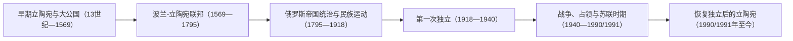

# 立陶宛历史

## 概括

立陶宛历史从波罗的诸部整合为中世纪大公国，继而进入波兰-立陶宛复合国家、帝国瓜分、民族国家建立、战争与苏联统治，再到恢复独立。立陶宛大公国是多族群、多语言的中东欧政体；它是现代立陶宛重要的国家传统，但不能直接等同于现代民族国家及其疆域。

## 历史演进图

## 分期导航

| 顺序 | 阶段 | 时间 | 相关入口 | 历史走向 |
|---:|---|---|---|---|
| 1 | 早期立陶宛与大公国 | 13世纪—1569年 | [早期波罗的人](/%E4%BA%BA%E6%96%87%E7%A7%91%E5%AD%A6/%E5%8E%86%E5%8F%B2/%E6%AC%A7%E6%B4%B2/%E6%B3%A2%E7%BD%97%E7%9A%84%E6%B5%B7/%E6%97%A9%E6%9C%9F%E6%B3%A2%E7%BD%97%E7%9A%84%E4%BA%BA.md)、[立陶宛大公国](/%E4%BA%BA%E6%96%87%E7%A7%91%E5%AD%A6/%E5%8E%86%E5%8F%B2/%E6%AC%A7%E6%B4%B2/%E6%B3%A2%E7%BD%97%E7%9A%84%E6%B5%B7/%E7%AB%8B%E9%99%B6%E5%AE%9B%E5%A4%A7%E5%85%AC%E5%9B%BD.md) | 波罗的诸部整合为大公国，并扩展为覆盖大量东斯拉夫地区的中东欧强权。 |
| 2 | 波兰-立陶宛联邦 | 1569—1795年 | [波兰-立陶宛联邦](/%E4%BA%BA%E6%96%87%E7%A7%91%E5%AD%A6/%E5%8E%86%E5%8F%B2/%E6%AC%A7%E6%B4%B2/%E6%96%AF%E6%8B%89%E5%A4%AB/%E8%A5%BF%E6%96%AF%E6%8B%89%E5%A4%AB/%E6%B3%A2%E5%85%B0-%E7%AB%8B%E9%99%B6%E5%AE%9B%E8%81%94%E9%82%A6.md) | 卢布林联合建立复合国家，立陶宛保留自身制度传统，同时与波兰政治文化更深结合。 |
| 3 | 俄罗斯帝国统治与民族运动 | 1795—1918年 | [俄罗斯帝国统治下的波罗的海](/%E4%BA%BA%E6%96%87%E7%A7%91%E5%AD%A6/%E5%8E%86%E5%8F%B2/%E6%AC%A7%E6%B4%B2/%E6%B3%A2%E7%BD%97%E7%9A%84%E6%B5%B7/%E4%BF%84%E7%BD%97%E6%96%AF%E5%B8%9D%E5%9B%BD%E7%BB%9F%E6%B2%BB%E4%B8%8B%E7%9A%84%E6%B3%A2%E7%BD%97%E7%9A%84%E6%B5%B7.md) | 瓜分后大部分立陶宛进入俄罗斯帝国，民族文化运动在压制与社会变化中发展。 |
| 4 | 第一次独立 | 1918—1940年 | [波罗的三国独立](/%E4%BA%BA%E6%96%87%E7%A7%91%E5%AD%A6/%E5%8E%86%E5%8F%B2/%E6%AC%A7%E6%B4%B2/%E6%B3%A2%E7%BD%97%E7%9A%84%E6%B5%B7/%E6%B3%A2%E7%BD%97%E7%9A%84%E4%B8%89%E5%9B%BD%E7%8B%AC%E7%AB%8B.md) | 独立战争、维尔纽斯争议与考纳斯时期塑造现代共和国。 |
| 5 | 战争、占领与苏联时期 | 1940—1990/1991年 | [苏联统治下的波罗的海](/%E4%BA%BA%E6%96%87%E7%A7%91%E5%AD%A6/%E5%8E%86%E5%8F%B2/%E6%AC%A7%E6%B4%B2/%E6%B3%A2%E7%BD%97%E7%9A%84%E6%B5%B7/%E8%8B%8F%E8%81%94%E7%BB%9F%E6%B2%BB%E4%B8%8B%E7%9A%84%E6%B3%A2%E7%BD%97%E7%9A%84%E6%B5%B7.md) | 苏联吞并、德国占领、苏联重新控制和反抗运动改变国家与社会。 |
| 6 | 恢复独立后的立陶宛 | 1990/1991年至今 | 本页下文 | 1990年宣布恢复独立，1991年取得广泛承认并重建国家制度。 |

## 阶段说明

### 早期立陶宛与大公国

立陶宛相关波罗的诸部在面对罗斯诸国、波兰和北方十字军压力时逐渐整合。明道加斯于1253年加冕为王，13—14世纪的大公国在格迪米纳斯家族统治下向鲁塞尼亚地区扩展，形成包含立陶宛人、鲁塞尼亚人及其他群体的多族群政体。1385年克雷沃联合把立陶宛与波兰王权联系起来，1387年立陶宛正式基督教化；维陶塔斯时期大公国势力达到高峰，1410年波兰-立陶宛联军在格伦瓦德战役击败条顿骑士团。

### 波兰-立陶宛联邦

1569年卢布林联合建立波兰-立陶宛联邦。立陶宛大公国作为组成部分保留法律、官署、财政和军队等制度，但贵族政治、天主教文化和波兰语影响不断加深。鲁塞尼亚人、犹太人及其他群体继续构成复杂社会。18世纪末三次瓜分使联邦和大公国制度一并终结，其疆域分别进入俄罗斯、普鲁士和奥地利体系。

### 俄罗斯帝国统治与民族运动

1795年后，大部分立陶宛地区进入俄罗斯帝国；部分西部地区与“小立陶宛”则经历普鲁士和德意志国家的不同轨迹。1830—1831年和1863—1864年起义失败后，帝国加强俄化政策，并在1864—1904年禁止使用拉丁字母印刷立陶宛语读物。秘密运书者、天主教网络、教育与文化团体推动语言保存和民族运动，使现代立陶宛民族政治逐步与旧大公国多族群传统分化。

### 第一次独立

立陶宛于1918年2月16日宣布恢复独立，并在德国撤军、布尔什维克西进和波兰-立陶宛冲突中建立国家。维尔纽斯在两次世界大战之间大部分时间由波兰控制，考纳斯成为临时首都；克莱佩达地区则在1923年并入立陶宛自治框架。1926年政变后，安塔纳斯·斯梅托纳领导的威权体制取代议会政治。尽管边界和政体发生变化，第一共和国仍为后来复国提供法理基础。

### 战争、占领与苏联时期

1940年苏联吞并立陶宛；1941—1944年德国占领期间，立陶宛犹太社群遭到系统性毁灭。苏联重新控制后实施政治镇压、人口遣送、集体化和工业化，立陶宛游击队在战后多年继续武装抵抗。天主教传统、地下出版和民族记忆成为社会反抗的重要资源；1988年成立的萨尤季斯运动推动主权和独立诉求公开化。

### 恢复独立后的立陶宛

立陶宛最高委员会于1990年3月11日通过恢复独立法案，是苏联加盟共和国中最早正式宣布恢复独立者。苏联施压未能逆转这一进程，1991年立陶宛获得广泛国际承认。国家随后完成宪政与市场转型，并于2004年加入北约和欧洲联盟。恢复独立叙事把现代共和国与1918年国家相连接，同时重新讨论大公国的多族群遗产。

## 关键辨析

- **立陶宛大公国不是现代民族国家**：其疆域广及今日白俄罗斯、乌克兰等地，多数时期具有显著的鲁塞尼亚人口和制度成分。
- **王朝联合与国家合并不是同一件事**：1385年后波兰、立陶宛王权联系加深；1569年卢布林联合才建立联邦，大公国仍保有部分独立制度。
- **现代立陶宛不覆盖全部历史地区**：维尔纽斯、克莱佩达和“小立陶宛”在近现代经历不同政权与边界变化。
- **恢复独立有两个关键年份**：1990年通过恢复独立法案，1991年取得实际巩固和广泛国际承认。

## 上级

- [波罗的海历史](/%E4%BA%BA%E6%96%87%E7%A7%91%E5%AD%A6/%E5%8E%86%E5%8F%B2/%E6%AC%A7%E6%B4%B2/%E6%B3%A2%E7%BD%97%E7%9A%84%E6%B5%B7/README.md)
