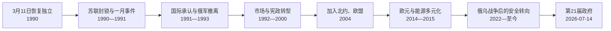

# 恢复独立后的立陶宛

## 时间

1990年至今（核验截止：2026-07-14）

## 概括

1990年3月11日最高委员会恢复立陶宛独立后，苏联先以经济封锁、政治施压和武力行动阻止分离。1991年1月平民守卫议会、电视塔等设施，苏军杀害平民却未能推翻政府；八月莫斯科政变失败后，独立获得广泛承认。此后立陶宛同时完成市场转型、民主宪政和西方安全整合，2004年加入北约与欧盟、2015年采用欧元。成就伴随失业、贫富差距、人口外流和政党不稳定。俄罗斯2014年吞并克里米亚及2022年全面入侵乌克兰后，国防、能源脱俄、北约前沿部署和对乌支持成为国家战略核心。2026年7月14日第21届政府刚宣誓，吉塔纳斯·瑙塞达任总统、明道加斯·辛克维丘斯任总理。

## 1990—1991年：恢复国家与主权对抗

### 3月11日后的双重权力

立陶宛最高委员会宣布恢复国家，废止苏联宪法效力并恢复战前法律原则，同时必须维持日常行政。莫斯科认为法案违反苏联退出程序，要求撤回；立陶宛则坚持1940年吞并非法，因此不存在从合法加入关系中“退出”的问题。

国内也有分歧：

- 萨尤季斯多数主张立即恢复独立；
- 以布拉藻斯卡斯为首的独立立陶宛共产党支持主权但偏好渐进谈判；
- 莫斯科派共产党、部分俄语和波兰语地区组织反对新政府；
- 地方苏维埃、工厂和联盟直属机构对听命对象并不一致。

### 经济封锁

1990年4月苏联限制石油、天然气和原材料供应，试图迫使议会暂停法案。立陶宛实行配给、寻找替代进口并与莫斯科谈判。最高委员会曾宣布短期“百日暂停”新法律实施，以换取谈判，但没有撤销独立。封锁到夏季逐步缓和，说明经济压力能造成严重困难，却未瓦解政治多数。

## 1991年一月事件

苏联中央利用物价争议、莫斯科派“民族拯救委员会”和特种部队制造政权危机。1月11—13日，苏军和特种部队占领出版、广播设施并攻击维尔纽斯电视塔，造成14名平民死亡、数百人受伤。大批群众以路障和人墙守卫最高委员会，政府广播转移至考纳斯和国外，军队没有强攻议会。

事件成为决定性转折：

1. 武力未能产生一个可运作的亲苏政府；
2. 平民非武装抵抗强化国内团结；
3. 国际媒体使莫斯科改革形象受损；
4. 冰岛等国家加快承认立陶宛；
5. 2月公民投票以压倒多数支持独立民主共和国。

1991年7月梅迪宁凯边境站人员遭苏联特警系统相关武装杀害，显示边境和海关主权仍面临暴力。8月莫斯科强硬派政变失败后，俄罗斯苏维埃联邦、苏联中央及欧美国家相继承认；9月立陶宛加入联合国。

## 1991—1993年：制度与安全脱离苏联

### 宪政重建

1992年公投通过新宪法，建立直接民选总统、议会负责的政府和宪法法院。制度既吸取1920年代议会政府不稳定，也防止1926年后总统独裁：

| 机构 | 权力 | 制衡 |
| --- | --- | --- |
| 总统 | 外交、国防重要角色；提名总理、任命部分官员、法律否决 | 总理须经议会同意，不能独自控制政府与预算。 |
| 议会 | 立法、预算、批准政府纲领与监督 | 任期选举、宪法法院和总统有限否决。 |
| 政府 | 经济社会政策和日常行政 | 对议会负责，部长由总统按总理建议任免。 |
| 宪法法院 | 合宪审查和高级官员行为判断 | 其判决约束政治机构。 |

完整国家元首与政府首脑序列见[立陶宛现代国家元首与政府首脑表](/%E4%BA%BA%E6%96%87%E7%A7%91%E5%AD%A6/%E5%8E%86%E5%8F%B2/%E6%AC%A7%E6%B4%B2/%E6%B3%A2%E7%BD%97%E7%9A%84%E6%B5%B7/%E7%AB%8B%E9%99%B6%E5%AE%9B/%E7%AB%8B%E9%99%B6%E5%AE%9B%E7%8E%B0%E4%BB%A3%E5%9B%BD%E5%AE%B6%E5%85%83%E9%A6%96%E4%B8%8E%E6%94%BF%E5%BA%9C%E9%A6%96%E8%84%91%E8%A1%A8.md)。

### 俄军撤离

苏联解体后，原驻军转为俄罗斯军队。立陶宛把撤军作为正常化前提，拒绝把撤军与加入独联体或永久军事安排绑定。1993年8月31日最后一批俄军撤出，比部分邻国更早。撤军减少直接军事控制，但加里宁格勒与白俄罗斯方向的地缘压力仍在。

## 市场转型

### 货币、私有化与社会代价

立陶宛从苏联计划和供应链转向市场经济，先用临时货币券，1993年恢复立塔斯。土地和住房返还、券式私有化与企业重组同时进行。改革的结果并不均衡：

- 通货膨胀和储蓄缩水打击家庭；
- 失业和收入差距上升，部分工业失去联盟市场；
- 私有化缺少监管时产生利益输送和资本集中；
- 农业从集体农庄转向私人经营，生产和就业短期下降；
- 西欧、北欧和美国投资推动电信、金融、零售与制造重组。

1995—1996年银行危机暴露监管薄弱，政府加强中央银行与金融制度。1998年俄罗斯金融危机冲击出口，随后贸易加快转向欧盟。

### 政治轮替

1992年，前共产党转型的民主劳动党赢得议会选举，布拉藻斯卡斯随后当选总统；这显示反苏独立运动没有垄断选举。1996年保守派复出，此后社会民主、祖国联盟、自由派、农民与绿人联盟及新兴民粹政党轮流组阁。

频繁出现新党和联合政府，原因包括：

- 转型利益分配改变选民联盟；
- 单一选区与比例代表混合制度鼓励多党；
- 个人化领导和腐败丑闻使政党快速兴衰；
- 总统直接民选而政府依赖议会，可能出现政治路线差异。

2003年当选总统罗兰达斯·帕克萨斯因向捐助者泄露国家机密、滥用职权等争议，经宪法法院认定违宪后于2004年被议会弹劾罢免。这是制度危机，也是宪法制衡实际运作的案例。

## 西方一体化

### 北约与欧盟

立陶宛把加入北约和欧盟视为同时解决安全、制度与经济现代化的路径。主要步骤包括：

- 改革军队、文官控制和国防规划；
- 接受欧盟法律、竞争、边境和市场规则；
- 通过区域合作改善与波兰、拉脱维亚和爱沙尼亚关系；
- 1994年申请北约，1995年申请欧盟；
- 2003年欧盟入盟公投获多数支持；
- 2004年3月加入北约，5月加入欧盟；
- 2007年进入申根区，2015年采用欧元，2018年加入经济合作与发展组织。

加入不是历史终点：欧盟结构资金改善道路、城市、水务和农业，开放市场也加速劳动力外流；北约提供集体防御，却要求本国持续提高军费与接纳盟军。

## 人口、社会与记忆政治

### 人口外流

独立后低出生率、老龄化和大规模移民使人口显著减少。2004年欧盟劳动力自由化后，许多人前往英国、爱尔兰、挪威、德国等地。汇款和海外经验带来收益，但医护、教育和地区劳动力流失扩大城乡差距。2010年代后工资增长、回流和乌克兰、白俄罗斯移民部分缓和趋势。

### 公民与少数群体

与爱沙尼亚、拉脱维亚不同，立陶宛恢复独立时向常住人口广泛给予公民身份，没有形成大规模“非公民”类别。波兰语社群集中于维尔纽斯东南，教育、地名拼写和少数语言政策时有争议；俄罗斯语人口比例较小。国家既强调立陶宛语公共地位，也须在欧洲人权规范下处理少数教育和文化权利。

### 历史记忆

社会同时处理苏联镇压、森林兄弟、纳粹占领和大屠杀。争议集中于某些反苏人物是否参与或支持过反犹迫害。成熟的历史叙述需要同时承认：

- 1940年苏联吞并和战后镇压的非法与暴力；
- 纳粹德国主导犹太种族灭绝；
- 本地协作者的具体责任；
- 救援者和不同抵抗者的个人选择；
- 纪念独立不能以淡化大屠杀为代价。

## 能源独立与俄罗斯压力

### 从依赖到多元化

苏联解体后，立陶宛长期依赖俄罗斯天然气、电网和炼油供应。欧盟入盟条件要求关闭切尔诺贝利式的伊格纳利纳核电站，2004、2009年两台机组先后停运，短期加深进口依赖。

关键转折包括：

- 2014年克莱佩达液化天然气终端“独立号”投入使用，可从全球采购天然气；
- 建设与波兰、瑞典电力互联；
- 2022年停止进口俄罗斯管道天然气并减少其他能源依赖；
- 2025年2月，波罗的海三国退出由俄白控制的BRELL同步区，与欧洲大陆电网同步。

能源政策由价格问题转为主权与国家安全问题。基础设施也成为网络攻击、破坏和混合威胁防护重点。

## 2014年以来的安全国家转向

俄罗斯吞并克里米亚和顿巴斯战争使立陶宛恢复征兵、提高国防支出并请求北约前沿部署。北约在立陶宛建立多国战斗群，德国成为框架国；俄罗斯2022年全面入侵乌克兰后，德国又推进在立陶宛长期驻扎旅级部队。

立陶宛对乌克兰提供军事、人道和政治支持，接纳难民，并主张对俄制裁和乌克兰加入欧盟、北约。苏瓦乌基走廊位于加里宁格勒与白俄罗斯之间，常被视为北约东北翼关键联络线；但战略讨论不应把当地社会只当作地图上的“缺口”。

白俄罗斯2020年镇压反对派后，立陶宛接纳流亡组织；2021年白俄罗斯当局推动中东等地移民前往欧盟边境，立陶宛称其为混合施压并修建边境设施。边境安全措施也引发难民法和人道争议。

## 对华与台湾政策

2021年台湾在维尔纽斯设立以“台湾”命名的代表处，立陶宛与中国关系急剧降级，中国采取外交和贸易压力。立陶宛寻求欧盟支持和供应链多元化，同时国内争论政策名称、经济成本和决策协调。2026年新执政联盟提出更“务实”恢复对华对话，但截至核验日，新政府刚宣誓，不能把政策意向写成已完成关系正常化。

## 2024—2026年政府更替

2024年议会选举后，社会民主党主导联盟，金陶塔斯·帕卢茨卡斯任总理。他于2025年因个人商业和财务调查争议辞职，财政部长里曼塔斯·沙久斯代理；因加·鲁吉涅内于9月组建第20届政府。

2026年6月，执政联盟重组，鲁吉涅内内阁总辞并看守。7月14日，明道加斯·辛克维丘斯领导的第21届政府宣誓，议会同日批准施政纲领。政府成员和政策刚进入履职阶段，因此本页只记录已完成的法定交接，不把联盟纲领等同已实施结果。

### 截至2026-07-14的权力结构

| 角色 | 现任 | 法定与实际位置 |
| --- | --- | --- |
| 总统 | **吉塔纳斯·瑙塞达** | 2019年起任职，2024年连任；外交、国防及政府任命中有重要权力。 |
| 总理 | **明道加斯·辛克维丘斯** | 2026年7月14日第21届政府宣誓后就任；对议会负责。 |
| 议会 | 141席议会 | 以混合选制产生，政府须有多数或足够支持。 |
| 安全政策 | 总统、政府、议会与北约体系共同制定 | 对乌支持、德国旅部署、国防融资和边境安全是跨机构议题。 |

## 成就与未决问题

| 领域 | 主要成就 | 未决问题 |
| --- | --- | --- |
| 主权 | 1991获承认、1993俄军撤离、北约集体防御 | 邻近俄白、混合威胁和国防成本长期存在。 |
| 民主 | 多次和平轮替、宪法法院和总统弹劾机制运作 | 党派碎片化、政治信任和利益透明度争议。 |
| 经济 | 融入欧盟市场、欧元、制造和服务升级 | 地区差距、老龄化、住房和社会不平等。 |
| 能源 | LNG、电网互联和2025欧洲同步 | 价格、基础设施安全和绿色转型成本。 |
| 社会 | 教育、人均收入和欧洲流动性提高 | 人口减少、人才外流、医疗和区域公共服务。 |
| 历史正义 | 公开苏联罪行与恢复国家连续性 | 大屠杀协作、抵抗人物评价和不同记忆需持续审视。 |

## 重要事件

| 时间 | 事件 | 结果与长期影响 |
| --- | --- | --- |
| 1990-03-11 | 恢复独立法案 | 以1918年国家连续性否定苏联主权。 |
| 1990-04—07 | 苏联经济封锁 | 未迫使撤法，显示主权冲突将长期化。 |
| 1991-01-13 | 电视塔与维尔纽斯暴力 | 平民死亡，武力推翻政府失败，国际支持增长。 |
| 1991-08—09 | 莫斯科政变失败与国际承认 | 苏联承认，立陶宛加入联合国。 |
| 1992 | 新宪法通过 | 建立总统、议会、政府和宪法法院的制衡框架。 |
| 1993 | 俄军撤离、立塔斯恢复 | 安全与货币主权巩固。 |
| 2004 | 加入北约和欧盟 | 战略与经济制度全面西向。 |
| 2004 | 帕克萨斯被弹劾 | 证明宪法审查和议会问责可约束总统。 |
| 2014 | LNG终端投入使用 | 削弱俄罗斯天然气垄断。 |
| 2015 | 采用欧元 | 完成欧元区货币整合。 |
| 2022 | 俄全面侵乌后的政策升级 | 国防、能源脱俄和对乌支持成为国家主轴。 |
| 2025-02 | 接入欧洲大陆同步电网 | 结束对俄白电网同步控制的结构依赖。 |
| 2026-07-14 | 第21届政府宣誓 | 辛克维丘斯接替看守政府，完成最新一次法定交接。 |

## 演变关系

- 前一阶段：[苏德占领与苏联时期](/%E4%BA%BA%E6%96%87%E7%A7%91%E5%AD%A6/%E5%8E%86%E5%8F%B2/%E6%AC%A7%E6%B4%B2/%E6%B3%A2%E7%BD%97%E7%9A%84%E6%B5%B7/%E7%AB%8B%E9%99%B6%E5%AE%9B/%E8%8B%8F%E5%BE%B7%E5%8D%A0%E9%A2%86%E4%B8%8E%E8%8B%8F%E8%81%94%E6%97%B6%E6%9C%9F.md)
- 领导人完整表：[立陶宛现代国家元首与政府首脑表](/%E4%BA%BA%E6%96%87%E7%A7%91%E5%AD%A6/%E5%8E%86%E5%8F%B2/%E6%AC%A7%E6%B4%B2/%E6%B3%A2%E7%BD%97%E7%9A%84%E6%B5%B7/%E7%AB%8B%E9%99%B6%E5%AE%9B/%E7%AB%8B%E9%99%B6%E5%AE%9B%E7%8E%B0%E4%BB%A3%E5%9B%BD%E5%AE%B6%E5%85%83%E9%A6%96%E4%B8%8E%E6%94%BF%E5%BA%9C%E9%A6%96%E8%84%91%E8%A1%A8.md)
- 区域比较：[波罗的三国独立](/%E4%BA%BA%E6%96%87%E7%A7%91%E5%AD%A6/%E5%8E%86%E5%8F%B2/%E6%AC%A7%E6%B4%B2/%E6%B3%A2%E7%BD%97%E7%9A%84%E6%B5%B7/%E6%B3%A2%E7%BD%97%E7%9A%84%E4%B8%89%E5%9B%BD%E7%8B%AC%E7%AB%8B.md)
- 返回：[立陶宛历史](/%E4%BA%BA%E6%96%87%E7%A7%91%E5%AD%A6/%E5%8E%86%E5%8F%B2/%E6%AC%A7%E6%B4%B2/%E6%B3%A2%E7%BD%97%E7%9A%84%E6%B5%B7/%E7%AB%8B%E9%99%B6%E5%AE%9B/README.md)
