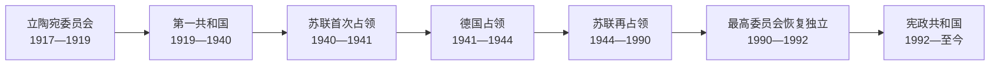

# 立陶宛现代国家元首与政府首脑表

## 时间

1918年至今（核验截止：2026-07-14）

## 概括

本表把1918—1940年共和国、1940—1990年苏联与德国占领机构、1990年恢复独立后的共和国分别列出。占领期同时存在流亡外交延续、地下抵抗、苏维埃法定机关、共产党实际领导和德国殖民行政，不能强行合并为一条“总统”序列。1990年3月11日恢复的是1918年国家的法律连续性，而非从苏联新获准建立的国家。

## 1918—1940年国家元首完整序列

| 顺序 | 国家元首 | 职务与任期 | 与前任关系 / 关键事件 |
| --- | --- | --- | --- |
| 1 | **安塔纳斯·斯梅托纳** | 立陶宛委员会主席，1917-09—1919-04-04；共和国总统，1919-04-04—1920-06-19 | 主持1918年2月16日独立法案时期的委员会；1919年依临时宪法成为首任总统。 |
| 2 | 亚历山德拉斯·斯图尔金斯基斯 | 制宪议会议长并代理国家元首，1920-06-19—1922-12-21；总统，1922-12-21—1926-06-07 | 制宪议会通过土地改革和1922年宪法；正式当选后成为第二任总统。 |
| 3 | **卡齐斯·格里纽斯** | 总统，1926-06-07—1926-12-17 | 中左联盟执政；放宽戒严和政治限制，军事政变后被迫辞职。 |
| — | 约纳斯·斯陶盖蒂斯 | 议会议长、临时履行元首职能，1926-12-17—12-19 | 政变期间的宪制短暂过渡，不算完整总统任期。 |
| — | 亚历山德拉斯·斯图尔金斯基斯 | 临时履行元首职能，1926-12-19 | 作为新议会议长主持斯梅托纳再次当选的程序。 |
| 4 | **安塔纳斯·斯梅托纳** | 总统，1926-12-19—1940-06-15 | 政变后回任；1927年解散议会，1928、1938年宪法强化总统权力。苏联最后通牒后离境。 |
| — | 安塔纳斯·梅尔基斯 | 代理总统，1940-06-15—06-17 | 斯梅托纳离境后自称代理并宣布接任；相关辞职和继任程序受苏联胁迫，法律有效性有争议。 |
| — | **尤斯塔斯·帕莱茨基斯** | 苏联扶植的代理总统，1940-06-17—08-25 | 由受胁迫的梅尔基斯任命；主持“人民政府”和并入苏联程序。独立立陶宛不承认其为合法总统。 |

## 1918—1940年政府首脑完整序列

同一人连续组建多届内阁时合并为一行，在备注中列明内阁更替；短暂看守空档由前内阁继续履职，不虚构新首相。

| 顺序 | 总理 | 在任时间 | 关键事件 / 备注 |
| --- | --- | --- | --- |
| 1 | **奥古斯蒂纳斯·沃尔德马拉斯** | 1918-11-11—1918-12-26 | 首届政府；德军撤退和苏俄进军使其难以建立有效行政。 |
| 2 | **米科拉斯·斯莱热维丘斯** | 1918-12-26—1919-03-12 | 第二届内阁；号召志愿军，组织对布尔什维克战争。 |
| 3 | 普拉纳斯·多维代蒂斯 | 1919-03-12—1919-04-12 | 战时短期内阁。 |
| 4 | 米科拉斯·斯莱热维丘斯 | 1919-04-12—1919-10-07 | 第二次任职；推进行政和军队建设。 |
| 5 | **埃内斯塔斯·加尔瓦瑙斯卡斯** | 1919-10-07—1920-06-19 | 推进国际承认与制宪议会选举。 |
| 6 | 卡齐斯·格里纽斯 | 1920-06-19—1922-02-02 | 制宪议会多数支持；土地改革、和平条约与国家财政建设。 |
| 7 | 埃内斯塔斯·加尔瓦瑙斯卡斯 | 1922-02-02—1924-06-18 | 连续领导多届内阁；克莱佩达起义和并入自治领是主要事件。 |
| 8 | 安塔纳斯·图梅纳斯 | 1924-06-18—1925-02-04 | 基督教民主阵营政府。 |
| 9 | 维陶塔斯·彼得鲁利斯 | 1925-02-04—1925-09-25 | 财政与对外政策争议中辞职。 |
| 10 | 莱奥纳斯·比斯特拉斯 | 1925-09-25—1926-06-15 | 1926年议会选举后交权。 |
| 11 | 米科拉斯·斯莱热维丘斯 | 1926-06-15—1926-12-17 | 第三次任职；政变中被推翻。 |
| 12 | **奥古斯蒂纳斯·沃尔德马拉斯** | 1926-12-17—1929-09-23 | 政变后再任；与斯梅托纳权力冲突后被解除。 |
| 13 | **尤奥扎斯·图贝利斯** | 1929-09-23—1938-03-24 | 连续三届内阁；斯梅托纳亲信，稳定财政并强化威权体制。 |
| 14 | 弗拉达斯·米罗纳斯 | 1938-03-24—1939-03-28 | 连续两届内阁；波兰最后通牒和德国压力加剧。 |
| 15 | 约纳斯·切尔纽斯 | 1939-03-28—1939-11-21 | 德国吞并克莱佩达后执政；维尔纽斯地区由苏联交还同时驻军进入。 |
| 16 | **安塔纳斯·梅尔基斯** | 1939-11-21—1940-06-17 | 末任合法政府首脑；接受苏联最后通牒后国家被占领。 |
| — | 尤斯塔斯·帕莱茨基斯 | “人民政府”总理，1940-06-17—06-24 | 苏联扶植，不是自由组阁；随后转任代理元首。 |
| — | 文察斯·克雷韦-米茨克维丘斯 | “人民政府”代理总理，1940-06-24—08-25 | 在苏联控制下运作，后与占领当局决裂；8月并入苏联后职位撤销。 |

## 1940—1990年占领期权力结构

### 苏维埃法定国家机关首长

| 顺序 | 人物 | 职务与任期 | 备注 |
| --- | --- | --- | --- |
| 1 | 尤斯塔斯·帕莱茨基斯 | 最高苏维埃主席团主席，1940-08-25—1967-04-14 | 苏维埃法定共和国元首；实际政策受共产党和莫斯科控制。 |
| 2 | 莫捷尤斯·舒毛斯卡斯 | 主席团主席，1967-04-14—1975-12-24 | 此前长期任部长会议主席。 |
| 3 | 安塔纳斯·巴尔考斯卡斯 | 主席团主席，1975-12-24—1985-11-18 | 勃列日涅夫后期至改革前夕。 |
| 4 | 林高达斯·松盖拉 | 主席团主席，1985-11-18—1987-12-07 | 此前任政府首脑，后任共产党第一书记。 |
| 5 | 维陶塔斯·阿斯特劳斯卡斯 | 主席团主席，1987-12-07—1990-01 | 改革与民族运动兴起期。 |
| 6 | 阿尔吉尔达斯·布拉藻斯卡斯 | 最高苏维埃主席，1990-01—1990-03-11 | 同时是脱离苏共控制的立陶宛共产党领袖；民主选举后的最高委员会选出新主席。 |

### 共产党实际最高领导

| 顺序 | 第一书记 | 任期 | 实际权力 / 备注 |
| --- | --- | --- | --- |
| 1 | **安塔纳斯·斯涅奇库斯** | 1940—1974 | 除德国占领期转入苏联后方；战后重新掌权，领导集体化、镇压和工业化。 |
| 2 | 彼得拉斯·格里什克维丘斯 | 1974—1987 | 勃列日涅夫时期干部体系延续。 |
| 3 | 林高达斯·松盖拉 | 1987—1988 | 未能应对萨尤季斯与改革诉求，被撤换。 |
| 4 | **阿尔吉尔达斯·布拉藻斯卡斯** | 1988—1990 | 1989年领导立陶宛共产党脱离苏联共产党，是苏联加盟共和国中率先分离的党组织之一。 |
| — | 米科拉斯·布罗凯维丘斯 | 莫斯科派共产党第一书记，1990—1991 | 反对独立、支持1991年一月政变；只代表亲苏残余，未控制恢复独立后的国家机构。 |

### 苏维埃政府首脑

| 顺序 | 政府首脑 | 在任时间 | 备注 |
| --- | --- | --- | --- |
| 1 | 梅奇斯洛瓦斯·格德维拉斯 | 人民委员会主席、部长会议主席，1940-08-25—1956-01-16 | 德国占领期在苏联后方，1944年随红军返回。 |
| 2 | 莫捷尤斯·舒毛斯卡斯 | 部长会议主席，1956-01-16—1967-04-14 | 去斯大林化和工业扩张期。 |
| 3 | 尤奥扎斯·马纽希斯 | 部长会议主席，1967-04-14—1981-01-16 | 长期计划经济管理。 |
| 4 | 林高达斯·松盖拉 | 部长会议主席，1981-01-16—1985-11-18 | 后转任主席团主席和第一书记。 |
| 5 | 维陶塔斯·萨卡劳斯卡斯 | 部长会议主席，1985-11-18—1990-03-17 | 改革和主权运动中末任苏维埃政府首脑。 |

## 1941—1944年德国占领行政与本地机构

| 角色 | 人物 / 机构 | 任期 | 实际权力与备注 |
| --- | --- | --- | --- |
| 六月起义临时政府 | **尤奥扎斯·安布拉泽维丘斯-布拉扎伊蒂斯**任代理总理 | 1941-06-23—1941-08-05 | 试图在德苏战争初期恢复独立；德国拒绝承认并迫使解散。其部分机构和人员对排犹措施、财产剥夺的参与须与后续德方直接屠杀责任一并审视。 |
| 东方占领区总专员 | 欣里希·洛泽 | 1941—1944 | 管辖“东方领地”，立陶宛只是其中一个总区。 |
| 立陶宛总区专员 | **阿德里安·冯·伦特尔恩** | 1941—1944 | 德国在立陶宛的最高民政首脑；掌行政、经济掠夺、劳役和迫害政策。 |
| 本地顾问体系 | 彼得拉斯·库比柳纳斯任总顾问 | 1941—1944 | 在德国命令下处理部分行政，不是主权政府。 |
| 地下国家与抵抗 | 立陶宛自由战士联盟、最高解放委员会等 | 1941—1944及以后 | 反纳粹组织路线多样；部分力量同时准备抵抗苏联再占领。 |

## 1990年以来国家元首完整序列

| 顺序 | 国家元首 | 职务与任期 | 关键事件 / 备注 |
| --- | --- | --- | --- |
| 1 | **维陶塔斯·兰茨贝吉斯** | 最高委员会主席，1990-03-11—1992-11-25 | 依临时基本法履行最高国家代表职能；签署恢复独立法案，经历苏联封锁和1991年一月事件。 |
| — | 阿尔吉尔达斯·布拉藻斯卡斯 | 议长、代理国家元首，1992-11-25—1993-02-25 | 新宪法过渡，直至首届直接总统选举。 |
| 2 | **阿尔吉尔达斯·布拉藻斯卡斯** | 总统，1993-02-25—1998-02-25 | 首位直接民选总统；推进俄罗斯军队撤离和西方一体化。 |
| 3 | **瓦尔达斯·阿达姆库斯** | 总统，1998-02-26—2003-02-26 | 第一任期；推进欧盟、北约加入谈判。 |
| 4 | 罗兰达斯·帕克萨斯 | 总统，2003-02-26—2004-04-06 | 因泄密、滥权等宪政争议被议会弹劾罢免。 |
| — | 阿尔图拉斯·保劳斯卡斯 | 议长、代理总统，2004-04-06—2004-07-12 | 依宪法代理至提前总统选举结束。 |
| 5 | 瓦尔达斯·阿达姆库斯 | 总统，2004-07-12—2009-07-12 | 第二任期；立陶宛加入欧盟和北约后强化东部伙伴政策。 |
| 6 | **达利娅·格里包斯凯特** | 总统，2009-07-12—2019-07-12 | 两届；金融危机、欧元加入和俄乌安全危机时期。 |
| 7 | **吉塔纳斯·瑙塞达** | 总统，2019-07-12至今 | 2024年赢得第二任期；国防、对乌克兰支持及与政府共享外交安全议程。截至2026-07-14仍在任。 |

## 1990年以来政府首脑完整序列

| 顺序 | 总理 | 在任时间 | 关键事件 / 备注 |
| --- | --- | --- | --- |
| 1 | **卡齐米拉·普伦斯基埃内** | 1990-03-17—1991-01-10 | 恢复独立后首任；面对苏联经济封锁和价格改革。 |
| 2 | 阿尔贝塔斯·希梅纳斯 | 1991-01-10—01-13 | 一月事件期间失联，任期仅数日。 |
| 3 | 格迪米纳斯·瓦格诺留斯 | 1991-01-13—1992-07-21 | 推出临时货币券和市场化改革。 |
| 4 | 亚历山德拉斯·阿比沙拉 | 1992-07-21—11-26 | 最高委员会末期政府；筹备新宪法和议会选举。 |
| 5 | 布罗尼斯洛瓦斯·卢比斯 | 1992-12-12—1993-03-10 | 过渡型政府；企业家兼政治人物。 |
| 6 | 阿道法斯·什莱热维丘斯 | 1993-03-10—1996-02-08 | 私有化、货币稳定；银行危机争议后去职。 |
| 7 | 劳里纳斯·斯坦克维丘斯 | 1996-02-23—11-19 | 看守与选举过渡。 |
| 8 | 格迪米纳斯·瓦格诺留斯 | 1996-12-04—1999-05-03 | 第二次任职；改革与总统冲突后辞职。 |
| 9 | 罗兰达斯·帕克萨斯 | 1999-06-01—10-27 | 第一次任职；因马热伊基艾炼油厂协议争议辞职。 |
| 10 | **安德留斯·库比柳斯** | 1999-11-03—2000-11-09 | 第一任期；财政紧缩和北约、欧盟政策。 |
| 11 | 罗兰达斯·帕克萨斯 | 2000-10-27—2001-06-20 | 第二次任职；执政联盟破裂。 |
| 12 | **阿尔吉尔达斯·布拉藻斯卡斯** | 2001-07-04—2006-06-01 | 连续两届内阁；任内完成2004年加入北约、欧盟。 |
| 13 | 格迪米纳斯·基尔基拉斯 | 2006-07-06—2008-11 | 少数政府；经济繁荣后金融危机逼近。 |
| 14 | 安德留斯·库比柳斯 | 2008-11-28—2012-12-13 | 第二任期；以紧缩、能源和财政调整应对全球金融危机。 |
| 15 | 阿尔吉尔达斯·布特凯维丘斯 | 2012-12-13—2016-12-13 | 2015年采用欧元；能源项目与社会政策。 |
| 16 | 萨乌柳斯·斯克韦尔内利斯 | 2016-12-13—2020-12-11 | 农民与绿人联盟政府；税制、社会政策和疫情初期。 |
| 17 | **因格丽达·希莫尼特** | 2020-12-11—2024-12-12 | 疫情、白俄罗斯边境危机、俄罗斯全面入侵乌克兰后国防与能源脱俄。 |
| 18 | 金陶塔斯·帕卢茨卡斯 | 2024-12-12—2025-08-04 | 中左联盟；因个人商业与财务调查争议辞职，内阁总辞。 |
| — | 里曼塔斯·沙久斯 | 代理总理，2025-08-04—09-25 | 财政部长代理至新政府宣誓。 |
| 19 | 因加·鲁吉涅内 | 2025-09-25—2026-07-14 | 2026年6月联盟重组后辞职，继续看守至第21届政府宣誓。 |
| 20 | **明道加斯·辛克维丘斯** | 2026-07-14至今 | 第21届政府总理；内阁于2026年7月14日宣誓并获议会批准施政纲领。 |

## 恢复独立后的权力分工

| 角色 | 主要权力 | 制衡 |
| --- | --- | --- |
| 总统 | 直接民选；外交与国防重要角色；提名总理、任命部分官员、法律否决 | 总理须获议会同意，政府纲领须经议会批准；否决可被法定多数推翻。 |
| 议会 | 立法、预算、批准政府纲领、监督和弹劾 | 总统可依法在特定情形推动提前选举；宪法法院审查。 |
| 总理与政府 | 日常行政、经济社会政策、执行预算与欧盟政策 | 对议会负责，部长由总统按总理建议任免。 |
| 宪法法院 | 审查法律与官员行为是否合宪 | 2004年总统弹劾显示其在宪政危机中的关键作用。 |

## 连续性与争议说明

- 1940年苏联的“选举”和并入程序发生在军事占领、最后通牒与候选控制之下；立陶宛共和国及多数西方国家不承认主权合法转移。
- 德国占领下的临时政府没有得到德国承认，也不能代表德国总区行政；研究其成员的独立诉求时，不能忽略本地机构参与排犹、财产剥夺和大屠杀环境的问题。
- 1944—1953年前后的森林兄弟抵抗与海外外交使团维持国家连续性主张，苏维埃法定首长不能等同自由产生的国家元首。
- 1990—1992年兰茨贝吉斯的正式称号是最高委员会主席；他承担国家元首职能，但不应改称“总统”。
- 2025—2026年首相更替包含看守与代理阶段；“辞职公告日”“总统解除日”和“新内阁宣誓日”应区分。表中以实际履职与正式交接为准。
- 现任信息以2026-07-14第21届政府宣誓为截止点，不预判其任期长度。

## 演变关系

- 过程页：[第一次共和国、战争与占领](/%E4%BA%BA%E6%96%87%E7%A7%91%E5%AD%A6/%E5%8E%86%E5%8F%B2/%E6%AC%A7%E6%B4%B2/%E6%B3%A2%E7%BD%97%E7%9A%84%E6%B5%B7/%E7%AB%8B%E9%99%B6%E5%AE%9B/%E7%AC%AC%E4%B8%80%E6%AC%A1%E5%85%B1%E5%92%8C%E5%9B%BD%E3%80%81%E6%88%98%E4%BA%89%E4%B8%8E%E5%8D%A0%E9%A2%86.md)
- 过程页：[苏德占领与苏联时期](/%E4%BA%BA%E6%96%87%E7%A7%91%E5%AD%A6/%E5%8E%86%E5%8F%B2/%E6%AC%A7%E6%B4%B2/%E6%B3%A2%E7%BD%97%E7%9A%84%E6%B5%B7/%E7%AB%8B%E9%99%B6%E5%AE%9B/%E8%8B%8F%E5%BE%B7%E5%8D%A0%E9%A2%86%E4%B8%8E%E8%8B%8F%E8%81%94%E6%97%B6%E6%9C%9F.md)
- 过程页：[恢复独立后的立陶宛](/%E4%BA%BA%E6%96%87%E7%A7%91%E5%AD%A6/%E5%8E%86%E5%8F%B2/%E6%AC%A7%E6%B4%B2/%E6%B3%A2%E7%BD%97%E7%9A%84%E6%B5%B7/%E7%AB%8B%E9%99%B6%E5%AE%9B/%E6%81%A2%E5%A4%8D%E7%8B%AC%E7%AB%8B%E5%90%8E%E7%9A%84%E7%AB%8B%E9%99%B6%E5%AE%9B.md)
- 中世纪世系：[立陶宛大公世系表](/%E4%BA%BA%E6%96%87%E7%A7%91%E5%AD%A6/%E5%8E%86%E5%8F%B2/%E6%AC%A7%E6%B4%B2/%E6%B3%A2%E7%BD%97%E7%9A%84%E6%B5%B7/%E7%AB%8B%E9%99%B6%E5%AE%9B%E5%A4%A7%E5%85%AC%E4%B8%96%E7%B3%BB%E8%A1%A8.md)
- 返回：[立陶宛历史](/%E4%BA%BA%E6%96%87%E7%A7%91%E5%AD%A6/%E5%8E%86%E5%8F%B2/%E6%AC%A7%E6%B4%B2/%E6%B3%A2%E7%BD%97%E7%9A%84%E6%B5%B7/%E7%AB%8B%E9%99%B6%E5%AE%9B/README.md)
