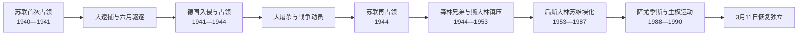

# 苏德占领与苏联时期

## 时间

1940—1990年（含1941—1944年德国占领）

## 概括

1940—1990年的立陶宛不是一个连续、正常更替的本国政权，而是苏联首次占领、纳粹德国占领和苏联再占领的叠加。第一次苏维埃化以国有化、逮捕和1941年六月大驱逐破坏原共和国精英；德国入侵后，部分立陶宛人以为可恢复独立，但纳粹迅速解散临时政府，将立陶宛纳入东方占领区并在本地协作者参与下杀害绝大多数犹太人。1944年苏联重返后，森林兄弟发动长期游击，斯大林政权以军事镇压、驱逐和集体化消灭有组织抵抗。后期工业化、城市化和教育扩展改变社会，政治控制与民族、宗教记忆并存。1988—1990年改革开放释放萨尤季斯群众运动，选举产生的最高委员会于1990年3月11日宣布恢复独立。

## 1940—1941年首次苏维埃化

### 权力接管

苏联军队1940年6月进驻后，特使与安全机关控制内阁、媒体和候选名单。“人民议会”请求加入苏联，8月成立立陶宛苏维埃社会主义共和国。制度变更并非本国议会自由选择，而是在外国军队控制和反对派被禁止条件下完成。

[立陶宛现代国家元首与政府首脑表](/%E4%BA%BA%E6%96%87%E7%A7%91%E5%AD%A6/%E5%8E%86%E5%8F%B2/%E6%AC%A7%E6%B4%B2/%E6%B3%A2%E7%BD%97%E7%9A%84%E6%B5%B7/%E7%AB%8B%E9%99%B6%E5%AE%9B/%E7%AB%8B%E9%99%B6%E5%AE%9B%E7%8E%B0%E4%BB%A3%E5%9B%BD%E5%AE%B6%E5%85%83%E9%A6%96%E4%B8%8E%E6%94%BF%E5%BA%9C%E9%A6%96%E8%84%91%E8%A1%A8.md)分别列出苏维埃法定机关、政府首脑和共产党实际领导，避免把帕莱茨基斯等人误写成自由产生的共和国总统。

### 苏维埃化措施

| 领域 | 措施 | 直接后果 |
| --- | --- | --- |
| 政治 | 禁止原政党和社团，逮捕军官、警察、官员与活动家 | 国家精英网络被摧毁，恐惧与地下活动扩散。 |
| 经济 | 银行、工业、大企业和大额财产国有化；启动土地再分配 | 所有权结构骤变，管理和供应混乱。 |
| 军事 | 立陶宛军改编为红军第29地域步兵军 | 军官被清洗，部分人在德苏战争爆发后逃散或反抗。 |
| 文化宗教 | 审查、学校苏维埃化、限制教会与独立媒体 | 天主教、民族符号和国家记忆转入私人及地下空间。 |
| 安全 | 内务人民委员部建立档案、逮捕和流放体系 | 1941年大规模驱逐有了组织基础。 |

1941年6月14日起，苏联安全机关把上万名居民装入列车，家庭常被拆分，男子送劳改营，妇女儿童流放西伯利亚和北方定居点。确切人数因统计口径而异，但驱逐在短时间内覆盖政治、行政、军队、商业和文化群体，对社会记忆影响极深。

## 德国入侵、六月起义与独立幻灭

### 战争转换

1941年6月22日德国进攻苏联，红军迅速撤出立陶宛。撤退期间发生切尔韦内、赖尼艾等地囚犯杀害。立陶宛活动家阵线发动六月起义，占领部分机关，宣布恢复独立并成立尤奥扎斯·安布拉泽维丘斯-布拉扎伊蒂斯领导的临时政府。

起义者动机并不单一：

- 希望在德苏战争中恢复1918年共和国；
- 报复苏联逮捕、驱逐和国有化；
- 部分组织受激进民族主义、反共产主义和反犹主义影响；
- 地方秩序真空促使自卫队、警察和临时委员会迅速出现。

纳粹德国不愿承认独立国家。1941年7月设立“东方占领区”，立陶宛成为立陶宛总区；8月迫使临时政府停止活动，以德国总区专员和本地总顾问体系取代。

## 纳粹占领结构

| 层级 | 机构 / 首脑 | 权力 | 说明 |
| --- | --- | --- | --- |
| 德国中央 | 纳粹党与占领部 | 殖民、种族、经济和安全总政策 | 目标包括资源掠夺、德国化与消灭犹太人。 |
| 东方占领区 | 总专员欣里希·洛泽 | 管辖波罗的海和白俄罗斯部分地区 | 与党卫队、安全警察在屠杀权力上有交叉。 |
| 立陶宛总区 | 总区专员阿德里安·冯·伦特尔恩 | 民政、经济征发、劳工和地方行政 | 是立陶宛境内最高德国文职官员。 |
| 党卫队与警察 | 别动队、安全警察、秩序警察 | 大屠杀、镇压、反游击 | 屠杀政策由纳粹领导并组织。 |
| 本地机构 | 警察营、自卫队、总顾问和市政机关 | 执行治安、征发、登记和部分迫害 | 合作程度、动机与责任因机构和个人而异，但不能以“德国命令”抹去参与。 |
| 抵抗组织 | 最高解放委员会、地下党派、苏联游击队、波兰家乡军 | 反占领、情报、宣传或武装行动 | 目标彼此冲突，立波关系和战后边界问题也引发暴力。 |

## 立陶宛犹太人大屠杀

战前立陶宛拥有重要的犹太社会，维尔纽斯被称为“北方耶路撒冷”。德国入侵后，大屠杀速度极快，通常分为三步：

1. **煽动、隔离与初期杀害**：德国安全部队利用反苏情绪和反犹宣传；考纳斯等地发生暴力和公开杀害。
2. **地方逐区枪杀**：别动队、德国警察和本地辅助力量把犹太居民押往城郊、森林、堡垒和坑地集体枪决。
3. **隔都、劳役与最终清场**：维尔纽斯、考纳斯、希奥利艾等隔都保留部分强迫劳工，后被清场、转送集中营或杀害。

主要杀戮地点包括帕内里艾、考纳斯第九堡等。大约九成以上的立陶宛犹太人遇害，具体数字因战前边界、难民和统计范围不同而异。立陶宛大屠杀有三个必须同时陈述的责任层次：

- 纳粹德国制定和推动种族灭绝政策，德国党卫队、安全警察与占领行政承担主导责任；
- 一些立陶宛辅助警察、行政人员和个人参与围捕、押送、看守、财产剥夺或直接杀害；
- 也有立陶宛人冒险藏匿、救助犹太人，但救援不能抵消国家与社会层面的参与问题。

把所有立陶宛人概括为协作者或把所有责任都归给德国，都会扭曲历史。对苏联占领的真实创伤也不能用来解释或正当化反犹迫害。

## 战时经济、征兵与抵抗

德国把粮食、工业品和劳动力纳入战争经济，大量居民被送往德国劳动。试图组建立陶宛党卫军团的计划因社会抵制未成功；1944年建立的地方部队本希望防卫本土，因拒绝完全受德军支配而被解散和镇压。

地下抵抗包括：

- 以恢复独立为目标的民族主义和基督教民主网络；
- 波兰家乡军在维尔纽斯地区行动；
- 苏联游击队破坏铁路和行政设施；
- 犹太游击队从隔都逃出后参与武装抵抗。

各抵抗力量既反德，也可能因维尔纽斯归属、战后制度和地方控制相互冲突；1944年格利蒂什凯斯—杜宾吉艾连环报复显示族群战争的残酷。

## 1944年苏联再占领

红军1944年进入维尔纽斯并向西推进，德国至1945年初退出克莱佩达。苏联把这称为“解放”，立陶宛国家连续性立场则视为一种占领取代另一种占领。许多居民面临三种选择：随德军西撤、留在城市适应、或进入森林抵抗。

### 森林兄弟

1944—1953年前后，数万名游击队员及支持者在乡村和森林组织地区军区，目标是恢复独立，并期待西方与苏联冲突。1949年各主要组织建立立陶宛自由战士联盟，2月16日宣言宣布民主共和国与社会改革目标。

游击运动的力量来自：

- 旧军人、警察、青年和拒绝征入红军者；
- 农村家庭提供食物、藏身处和情报；
- 1918年国家及天主教民族传统；
- 对逮捕、征兵、土地和集体化政策的反抗。

其局限包括缺乏外援、苏联渗透和情报优势、平原地形难以长期隐蔽，以及对疑似合作者的处决损害部分民众支持。内务部使用特种伪装小组、线人、封锁和集体惩罚，至1953年前后摧毁主要组织；个别游击者隐藏更久。

## 驱逐、集体化与斯大林化

| 工具 | 过程 | 结果 |
| --- | --- | --- |
| 大规模驱逐 | 1948年“春季行动”、1949年波罗的海联合驱逐、1951年行动等 | 游击支持家庭、富农和“不可靠者”被流放，人口与财产结构破坏。 |
| 集体化 | 强迫农户加入集体农庄，征收土地、牲畜和农具 | 传统乡村自治瓦解，短期产量和生活受冲击。 |
| 政治清洗 | 逮捕地下成员、神职人员、知识分子和返乡者 | 监狱、劳改营与职业限制形成长期恐惧。 |
| 文化工程 | 俄语和苏联叙事进入教育，历史与宗教受审查 | 公开国家记忆被压制，家庭和教会保存另一套叙事。 |
| 移民与工业 | 联邦调配劳动力、建设工厂和城市住宅 | 城市化加快；立陶宛本族人口比例仍高于拉脱维亚、爱沙尼亚。 |

## 后斯大林时期的社会变迁

1953年后大规模恐怖下降，部分流放者获准返回，但一党统治、审查和计划经济未变。立陶宛从农业社会迅速城市化，维尔纽斯、考纳斯、克莱佩达和希奥利艾工业扩展，教育、医疗和住房普及。伊格纳利纳核电站、化工和大型工厂把经济更深纳入苏联分工，也造成生态风险和对联盟市场、能源的依赖。

### 民族与语言

苏联推广俄语作为联盟通用语，干部和技术人员中俄语重要，但立陶宛语继续作为共和国官方公共语言之一，学校和出版体系仍相对广泛。由于战后俄语移民比例低于另外两个波罗的海共和国，立陶宛语社会连续性更强。不过维尔纽斯人口结构因战争、大屠杀、波兰人迁移和苏联移民而彻底改变。

### 天主教与异议

天主教会受财产没收、神学院限制和安全机关监控，却仍是全国性组织。1972年开始秘密出版的《立陶宛天主教会纪事》系统记录宗教与人权迫害，并走私到国外。1972年青年罗马斯·卡兰塔在考纳斯自焚，引发示威和镇压；1976年成立的立陶宛赫尔辛基小组以国际人权承诺挑战苏联。

异议者数量有限，却把宗教自由、民族权利、历史真相和国际法连续性连接起来。

## 改革、萨尤季斯与独立恢复

### 1987—1988年公开运动

戈尔巴乔夫的公开性和改革降低了镇压成本。1987年维尔纽斯出现纪念苏德秘密议定书的公开集会；1988年知识分子、艺术家和改革派干部成立萨尤季斯。运动最初支持改革，很快转向主权、语言、历史和独立。

群众动员的关键包括：

- 大型维尔纽斯集会和地方分组；
- 恢复三色旗、国歌和历史纪念日；
- 公开讨论1940年占领、大驱逐和森林兄弟；
- 推动立陶宛语国家地位、经济自主和本国法律优先；
- 与拉脱维亚、爱沙尼亚运动协调。

1989年8月23日约两百万人在三国组成“波罗的海之路”人链，纪念苏德协议50周年。12月，以阿尔吉尔达斯·布拉藻斯卡斯为首的立陶宛共产党脱离苏联共产党，显示苏维埃统治联盟内部瓦解。

### 1990年选举与3月11日法案

1990年2—3月最高苏维埃选举中，萨尤季斯支持者获多数。3月11日，维陶塔斯·兰茨贝吉斯当选最高委员会主席，议会通过《恢复立陶宛独立国家法案》，宣告：

- 1918年独立法案和1920年制宪议会决议从未失去法律效力；
- 1940年外国力量破坏的主权重新行使；
- 苏联宪法不再适用于立陶宛；
- 国家不是依据苏联分离程序“退出”，而是恢复被非法中断的共和国。

这一法律论证决定了随后与莫斯科冲突的性质。苏联拒绝承认，经济封锁和军事压力随即开始；真正巩固独立要到1991年一月抵抗、苏联八月政变失败和国际承认。

## 苏维埃统治衰落的原因

| 类型 | 因素 |
| --- | --- |
| 合法性 | 1940年占领记忆、外交不承认和家庭叙事使苏维埃主权始终被质疑。 |
| 民族社会 | 立陶宛语教育、天主教网络和本族人口多数保存组织基础。 |
| 经济 | 计划经济短缺、生态问题和对莫斯科配置不满削弱制度吸引力。 |
| 改革效应 | 公开性允许历史和环境议题合法化，群众组织速度超过党控制。 |
| 精英分裂 | 本地共产党脱离苏共，行政和政治资源转向主权路线。 |
| 区域协同 | 波罗的海三国共同纪念、议会声明和人链放大国际影响。 |
| 直接触发 | 1990年竞争性选举给恢复独立派明确议会多数。 |

## 重要事件

| 时间 | 事件 | 过程与影响 |
| --- | --- | --- |
| 1940-06—08 | 苏联占领和吞并 | 以最后通牒、驻军、傀儡政府和受控选举完成苏维埃化。 |
| 1941-06-14 | 六月大驱逐 | 大批家庭被流放或送劳改营，成为占领记忆核心。 |
| 1941-06 | 德国入侵与六月起义 | 临时政府试图复国，旋被纳粹解散。 |
| 1941—1944 | 犹太人大屠杀 | 纳粹主导、本地协作者参与，绝大多数立陶宛犹太人被杀。 |
| 1944 | 苏联再占领 | 红军返回，战后苏维埃体制重建。 |
| 1944—1953 | 森林兄弟战争 | 地下军区争取恢复共和国，遭内务部镇压。 |
| 1948—1951 | 驱逐与集体化高峰 | 摧毁乡村支持网络和私人农业。 |
| 1972 | 《教会纪事》与卡兰塔抗议 | 宗教人权记录和青年抗议进入国际视野。 |
| 1988 | 萨尤季斯成立 | 改革运动转为群众主权运动。 |
| 1989-08-23 | 波罗的海之路 | 三国人链公开挑战苏德协议和吞并合法性。 |
| 1989-12 | 共产党脱离苏共 | 本地执政精英与莫斯科组织决裂。 |
| 1990-03-11 | 恢复独立法案 | 选举议会恢复1918年国家法律连续性。 |

## 演变关系

- 前一阶段：[第一次共和国、战争与占领](/%E4%BA%BA%E6%96%87%E7%A7%91%E5%AD%A6/%E5%8E%86%E5%8F%B2/%E6%AC%A7%E6%B4%B2/%E6%B3%A2%E7%BD%97%E7%9A%84%E6%B5%B7/%E7%AB%8B%E9%99%B6%E5%AE%9B/%E7%AC%AC%E4%B8%80%E6%AC%A1%E5%85%B1%E5%92%8C%E5%9B%BD%E3%80%81%E6%88%98%E4%BA%89%E4%B8%8E%E5%8D%A0%E9%A2%86.md)
- 领导人与占领机构：[立陶宛现代国家元首与政府首脑表](/%E4%BA%BA%E6%96%87%E7%A7%91%E5%AD%A6/%E5%8E%86%E5%8F%B2/%E6%AC%A7%E6%B4%B2/%E6%B3%A2%E7%BD%97%E7%9A%84%E6%B5%B7/%E7%AB%8B%E9%99%B6%E5%AE%9B/%E7%AB%8B%E9%99%B6%E5%AE%9B%E7%8E%B0%E4%BB%A3%E5%9B%BD%E5%AE%B6%E5%85%83%E9%A6%96%E4%B8%8E%E6%94%BF%E5%BA%9C%E9%A6%96%E8%84%91%E8%A1%A8.md)
- 后一阶段：[恢复独立后的立陶宛](/%E4%BA%BA%E6%96%87%E7%A7%91%E5%AD%A6/%E5%8E%86%E5%8F%B2/%E6%AC%A7%E6%B4%B2/%E6%B3%A2%E7%BD%97%E7%9A%84%E6%B5%B7/%E7%AB%8B%E9%99%B6%E5%AE%9B/%E6%81%A2%E5%A4%8D%E7%8B%AC%E7%AB%8B%E5%90%8E%E7%9A%84%E7%AB%8B%E9%99%B6%E5%AE%9B.md)
- 区域比较：[苏联统治下的波罗的海](/%E4%BA%BA%E6%96%87%E7%A7%91%E5%AD%A6/%E5%8E%86%E5%8F%B2/%E6%AC%A7%E6%B4%B2/%E6%B3%A2%E7%BD%97%E7%9A%84%E6%B5%B7/%E8%8B%8F%E8%81%94%E7%BB%9F%E6%B2%BB%E4%B8%8B%E7%9A%84%E6%B3%A2%E7%BD%97%E7%9A%84%E6%B5%B7.md)
- 返回：[立陶宛历史](/%E4%BA%BA%E6%96%87%E7%A7%91%E5%AD%A6/%E5%8E%86%E5%8F%B2/%E6%AC%A7%E6%B4%B2/%E6%B3%A2%E7%BD%97%E7%9A%84%E6%B5%B7/%E7%AB%8B%E9%99%B6%E5%AE%9B/README.md)
