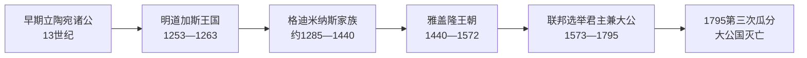

# 立陶宛大公世系表

## 时间

约1236—1795年

## 概括

本表按在位顺序列出立陶宛国家形成至第三次瓜分期间的最高统治者。13世纪早期纪年主要依靠邻国编年史，存在空档、同名和统治范围争议；1385年克雷沃联合以后，大公职位逐步与波兰王位结合；1569年卢布林联合以后，立陶宛大公仍是共同君主的正式头衔，立陶宛大公国的法律、财政、军队和官职并未立即消失。表中把复位、代理、共同统治和有争议的占领者分别注明，不用“后期诸君”合并。

## 13世纪国家形成期

| 顺序 | 统治者 | 在位 | 家族 / 与前任关系 | 关键事件 / 备注 |
| --- | --- | --- | --- | --- |
| 1 | **明道加斯**（Mindaugas） | 约1236—1263 | 早期诸公之一，通过战争和联盟居首 | 约1236年成为最高统治者；1251年受洗，1253年加冕为立陶宛国王；以向利沃尼亚骑士团让地换取王冠，后重新反击。1263年被特雷尼奥塔与道曼塔斯合谋杀害。 |
| 2 | 特雷尼奥塔（Treniota） | 1263—1264 | 明道加斯外甥、政变首领 | 依靠反基督教和对骑士团战争上台；杀害明道加斯之子陶特维拉斯，旋被明道加斯旧臣刺杀。 |
| 3 | 瓦伊什维尔卡斯（Vaišvilkas） | 1264—1267 | 明道加斯之子 | 原为修士，联合加利西亚—沃里尼亚力量击败政敌；把权力转交妹夫什瓦尔恩，后被列夫·丹尼洛维奇杀害。 |
| 4 | 什瓦尔恩（Shvarn / Švarnas） | 1267—约1269 | 明道加斯女婿、加利西亚—沃里尼亚王公 | 统治范围和是否独掌大公位有争议；未能在立陶宛建立持久王朝。 |
| 5 | **特赖德尼斯**（Traidenis） | 约1269/1270—1282 | 与明道加斯关系不明 | 重新整合立陶宛核心；抵抗利沃尼亚骑士团和加利西亚势力，支持瑟米加利亚人。 |
| 6 | 道曼塔斯（Daumantas，归属有争议） | 约1282—1285 | 资料不足 | 个别编年传统将其列为大公；是否与其他同名王公混同、统治全境与否存在争议。 |
| 7 | 布蒂盖迪斯（Butigeidis） | 约1285—1291 | 格迪米纳斯家族早期成员，可能与布特维达斯为兄弟 | 在条顿骑士团压力下巩固涅曼河防线；早期家族关系不完全确定。 |
| 8 | 布特维达斯（Butvydas / Pukuveras） | 约1291—1295 | 可能为布蒂盖迪斯之弟、维特尼斯与格迪米纳斯之父 | 统治记载零散；格迪米纳斯王朝的父系起点之一。 |
| 9 | **维特尼斯**（Vytenis） | 约1295—1316 | 布特维达斯之子 | 与里加市和部分基督教力量结盟，持续对抗条顿骑士团；国家行政和对鲁塞尼亚地区扩张加强。 |

> 13世纪80年代的统治次序仍有学术争议；“资料不足”不是空缺，而是明确区分可证事实与后世谱系推定。

## 格迪米纳斯家族与双核心统治

| 顺序 | 统治者 | 在位 | 与前任关系 | 关键事件 / 备注 |
| --- | --- | --- | --- | --- |
| 10 | **格迪米纳斯**（Gediminas） | 1316—1341 | 维特尼斯之弟或近亲，传统称布特维达斯之子 | 以维尔纽斯为政治中心；通过婚姻、外交和战争扩张鲁塞尼亚领地；致信西欧招徕商人和教士，但未正式皈依。 |
| 11 | 尧努蒂斯（Jaunutis） | 1341—1345 | 格迪米纳斯之子 | 继位原因不明；被兄长阿尔吉尔达斯和凯斯图蒂斯联合推翻，后获封领。 |
| 12 | **阿尔吉尔达斯**（Algirdas） | 1345—1377 | 尧努蒂斯之兄 | 与弟凯斯图蒂斯分工：本人向东扩张，凯斯图蒂斯守西线；1362年蓝水之战后势力伸向基辅和黑海方向。 |
| — | 凯斯图蒂斯（Kęstutis） | 1345—1377间为共同统治伙伴 | 阿尔吉尔达斯之弟 | 掌特拉凯和西部军政，对条顿骑士团作战；通常不在此段单列为大公，但实际是双核心统治者。 |
| 13 | **约盖拉**（Jogaila） | 1377—1381 | 阿尔吉尔达斯之子 | 继承大公位；与叔父凯斯图蒂斯因对条顿骑士团政策和秘密协议冲突。 |
| 14 | **凯斯图蒂斯** | 1381—1382 | 约盖拉之叔、政变夺位 | 发现约盖拉与骑士团的多维迪什凯斯条约后夺权；1382年被约盖拉拘押并死于克雷瓦城堡，死因有争议。 |
| 15 | **约盖拉** | 1382—1392 | 复位 | 1385年签克雷沃安排，1386年受洗并成为波兰国王瓦迪斯瓦夫二世；1387年推动立陶宛正式基督教化。 |
| — | 斯基尔盖拉（Skirgaila） | 1386—1392 | 约盖拉之弟、在立陶宛的摄政 | 代表兼任波兰国王的约盖拉治理；与维陶塔斯竞争，未被各贵族集团普遍接受。 |
| 16 | **维陶塔斯大帝**（Vytautas） | 1392—1430；1401起正式称大公 | 凯斯图蒂斯之子、约盖拉堂兄 | 1392年奥斯特鲁夫协议取得实际统治；1401年维尔纽斯—拉多姆联合确认大公地位；1410年格伦瓦尔德战役重创条顿骑士团；1430年拟加冕为王但未成，旋去世。 |
| 17 | 什维特里盖拉（Švitrigaila） | 1430—1432 | 约盖拉之弟 | 试图摆脱波兰约束并联合鲁塞尼亚贵族；被政变推翻后仍在东部抵抗至1430年代后期。 |
| 18 | 西吉斯蒙德·凯斯图泰蒂斯（Sigismund Kęstutaitis） | 1432—1440 | 维陶塔斯之弟 | 获西部贵族与波兰支持；1435年帕巴伊斯卡斯战役击败什维特里盖拉阵营，1440年被贵族阴谋杀害。 |

## 雅盖隆王朝

| 顺序 | 大公 | 在位 | 与前任关系 | 关键事件 / 备注 |
| --- | --- | --- | --- | --- |
| 19 | **卡齐米日·雅盖隆**（Casimir Jagiellon） | 1440—1492；1447起兼波兰国王 | 约盖拉之子 | 立陶宛贵族未经波兰同意推举，恢复一段独立王廷；扩大贵族特权；与莫斯科的长期竞争加剧。 |
| 20 | 亚历山大·雅盖隆 | 1492—1506；1501起兼波兰国王 | 卡齐米日之子 | 1492年特权确认大公会议权力；对莫斯科战争失地，婚娶伊凡三世之女海伦娜未能稳定关系。 |
| 21 | **西吉斯蒙德一世“老王”** | 1506—1548 | 亚历山大之弟 | 与莫斯科多次战争；1514年奥尔沙战役遏止进攻；推进文艺复兴宫廷和法律编纂。 |
| — | 西吉斯蒙德二世·奥古斯特 | 1529获推为大公；1544起在立陶宛实际执政 | 西吉斯蒙德一世之子、预先指定继承人 | 与父亲任期重叠；1548年父死后兼波兰国王。 |
| 22 | **西吉斯蒙德二世·奥古斯特** | 1544/1548—1572 | 承父位 | 1566年第二部《立陶宛法典》；利沃尼亚战争压力促成1569年卢布林联合；无合法子嗣，雅盖隆男性主线终结。 |

### 继承方式变化

- 1440年以后，立陶宛贵族推举大公的权利与波兰王位继承逐渐联动。
- 1501年梅尔尼克联合方案并未完整实施，但共同君主趋势加强。
- 1529年西吉斯蒙德二世在父亲尚在位时被推举，是保证王朝连续的“在世继承”。
- 1569年以后，共同的选举君主同时拥有“波兰国王和立陶宛大公”等头衔；选举与加冕通常在波兰进行，立陶宛贵族通过联邦议会参与。

## 波兰—立陶宛联邦共同君主兼大公

| 顺序 | 君主 / 大公 | 在位 | 王室 / 继承关系 | 关键事件 / 备注 |
| --- | --- | --- | --- | --- |
| 23 | 亨利·瓦卢瓦 | 1573—1574 | 法国瓦卢瓦王室，首次自由选举 | 签署“亨利条款”限制君权；兄长去世后秘密离境继承法国王位，立陶宛和波兰进入空位。 |
| — | 空位期 | 1574—1576 | — | 贵族围绕哈布斯堡、伊凡四世、安娜与巴托里等候选人竞争。 |
| 24 | **斯特凡·巴托里** | 1576—1586 | 特兰西瓦尼亚巴托里家族；与安娜·雅盖隆共同取得王位 | 改革军队和司法；对俄战争收复波洛茨克并取得有利停战；安娜为共同君主但日常统治由巴托里主导。 |
| — | 安娜·雅盖隆 | 1576—1587 | 西吉斯蒙德一世之女，共同当选的波兰女王 | 与巴托里共治；巴托里死后仍保有王后身份，但未独自承担立陶宛大公日常统治。 |
| 25 | **西吉斯蒙德三世·瓦萨** | 1587—1632 | 瓦萨王室，雅盖隆女性后裔 | 1596年布列斯特联合；对瑞典、莫斯科长期战争；17世纪初联邦势力一度进入莫斯科。 |
| 26 | 瓦迪斯瓦夫四世·瓦萨 | 1632—1648 | 西吉斯蒙德三世之子 | 军事改革并避免对奥斯曼全面战争；其死后哥萨克起义爆发。 |
| 27 | **约翰二世·卡齐米日·瓦萨** | 1648—1668 | 瓦迪斯瓦夫之弟 | 赫梅利尼茨基起义、俄波战争和瑞典“大洪水”；1655年莫斯科沙皇阿列克谢一度占领维尔纽斯并自称立陶宛大公，但未获联邦承认。1668年退位。 |
| — | 阿列克谢·米哈伊洛维奇 | 1655—1661间占领性宣称 | 莫斯科沙皇，非联邦选举君主 | 军事占领部分立陶宛领土并采用大公头衔；不列入合法顺序，只注明其竞争性宣称。 |
| 28 | 米哈乌·科里布特·维希尼奥维茨基 | 1669—1673 | 本地鲁塞尼亚贵族家族，自由选举 | 贵族派系争斗强烈；奥斯曼战争失利，布恰奇条约引发反弹。 |
| 29 | **扬三世·索别斯基** | 1674—1696 | 索别斯基家族，自由选举 | 1683年维也纳解围；对奥斯曼战争延续，未能建立世袭王朝。 |
| 30 | **奥古斯特二世“强者”** | 1697—1706 | 萨克森韦廷王朝 | 以改宗天主教和贵族支持当选；卷入大北方战争，被瑞典迫使退位。 |
| 31 | 斯坦尼斯瓦夫·莱什琴斯基 | 1706—1709 | 瑞典支持的竞争性选举 | 在瑞典军事优势下上台，合法性受质疑；波尔塔瓦战役后流亡。 |
| 32 | **奥古斯特二世“强者”** | 1709—1733 | 复位 | 在俄国支持下复位；1717年“沉默议会”显示俄罗斯调停与干预增强。 |
| 33 | 斯坦尼斯瓦夫·莱什琴斯基 | 1733—1736 | 第二次当选，王位继承战争中的竞争者 | 得法国和部分贵族支持；被迫放弃王位。 |
| 34 | 奥古斯特三世 | 1733/1736—1763 | 奥古斯特二世之子，俄奥支持 | 与莱什琴斯基任期重叠源于竞争选举；其统治下中央议事常因自由否决权瘫痪。 |
| — | 空位期 | 1763—1764 | — | 俄国和普鲁士强力影响选举。 |
| 35 | **斯坦尼斯瓦夫·奥古斯特·波尼亚托夫斯基** | 1764—1795 | 波尼亚托夫斯基家族，末代选举君主 | 推动教育和国家改革；1791年五三宪法试图挽救联邦；俄、普、奥三次瓜分，1795年被迫退位。 |

## 大公权力如何演变

| 阶段 | 继承方式 | 核心权力 | 制约 |
| --- | --- | --- | --- |
| 13世纪 | 军事兼并、家族竞争与部族贵族承认 | 统合立陶宛部族、战争与外交 | 继承规则不稳，宗亲政变频繁。 |
| 格迪米纳斯家族 | 家族继承但常由强势兄弟夺位 | 分封鲁塞尼亚领地、任命地方公、统率军队 | 家族共治和领地分散，需要贵族支持。 |
| 雅盖隆时期 | 贵族推举与王朝继承结合 | 领地、外交、军政与法典确认 | 大公会议和贵族特权扩大；兼任波兰国王后常不驻维尔纽斯。 |
| 联邦时期 | 全体贵族参与的自由选举 | 共同君主保留任命与外交军政职能 | 联邦议会、立陶宛法典、贵族自由与自由否决权限制君权。 |
| 18世纪末 | 名义选举，受邻国强力干预 | 改革派试图建立有效中央国家 | 俄普奥军事压力和国内保守联盟最终摧毁国家。 |

## 世系连续性与争议说明

- 明道加斯是唯一正式加冕的“立陶宛国王”；后来统治者通常称“大公”，维陶塔斯虽筹备王冠但未完成加冕。
- 13世纪早期不能用后世完整家谱填补所有空档；道曼塔斯等人的统治范围和年份需保留“约”“有争议”。
- 约盖拉兼任波兰国王后，斯基尔盖拉是摄政而非独立王朝；维陶塔斯在1392年取得实际统治，1401年获正式大公确认。
- 斯坦尼斯瓦夫·莱什琴斯基的两段任期与奥古斯特二世、三世重叠，是外国战争和竞争选举造成，不应删去任一方。
- 阿列克谢·米哈伊洛维奇的“大公”头衔源于军事占领，不属于立陶宛—联邦宪制认可的继承链。
- 1795年以后俄国皇帝吞并原大公国领土，但“立陶宛大公”不再是一个存续国家的独立职位，因此本表止于波尼亚托夫斯基退位。

## 演变关系

- 主笔记：[立陶宛大公国](/%E4%BA%BA%E6%96%87%E7%A7%91%E5%AD%A6/%E5%8E%86%E5%8F%B2/%E6%AC%A7%E6%B4%B2/%E6%B3%A2%E7%BD%97%E7%9A%84%E6%B5%B7/%E7%AB%8B%E9%99%B6%E5%AE%9B%E5%A4%A7%E5%85%AC%E5%9B%BD.md)
- 国家总览：[立陶宛历史](/%E4%BA%BA%E6%96%87%E7%A7%91%E5%AD%A6/%E5%8E%86%E5%8F%B2/%E6%AC%A7%E6%B4%B2/%E6%B3%A2%E7%BD%97%E7%9A%84%E6%B5%B7/%E7%AB%8B%E9%99%B6%E5%AE%9B/README.md)
- 前一节点：[早期波罗的人](/%E4%BA%BA%E6%96%87%E7%A7%91%E5%AD%A6/%E5%8E%86%E5%8F%B2/%E6%AC%A7%E6%B4%B2/%E6%B3%A2%E7%BD%97%E7%9A%84%E6%B5%B7/%E6%97%A9%E6%9C%9F%E6%B3%A2%E7%BD%97%E7%9A%84%E4%BA%BA.md)
- 后一节点：[波兰—立陶宛联邦](/%E4%BA%BA%E6%96%87%E7%A7%91%E5%AD%A6/%E5%8E%86%E5%8F%B2/%E6%AC%A7%E6%B4%B2/%E6%96%AF%E6%8B%89%E5%A4%AB/%E8%A5%BF%E6%96%AF%E6%8B%89%E5%A4%AB/%E6%B3%A2%E5%85%B0-%E7%AB%8B%E9%99%B6%E5%AE%9B%E8%81%94%E9%82%A6.md)
- 返回：[波罗的海历史](/%E4%BA%BA%E6%96%87%E7%A7%91%E5%AD%A6/%E5%8E%86%E5%8F%B2/%E6%AC%A7%E6%B4%B2/%E6%B3%A2%E7%BD%97%E7%9A%84%E6%B5%B7/README.md)
