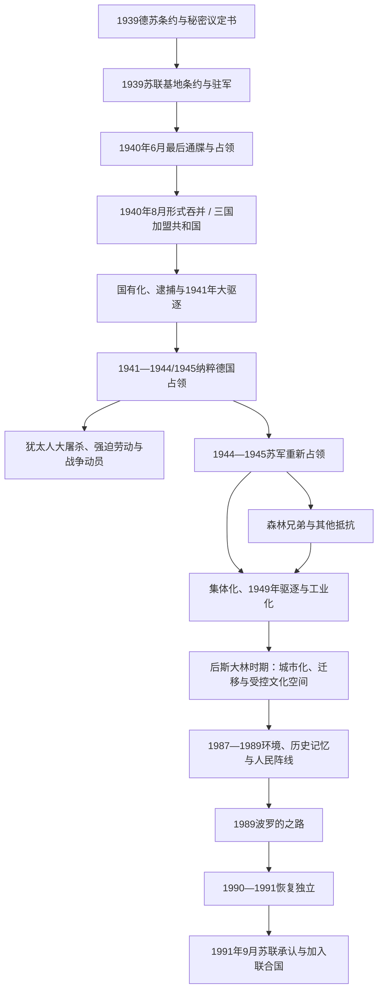

# 苏联统治下的波罗的海

[返回波罗的海历史](/%E4%BA%BA%E6%96%87%E7%A7%91%E5%AD%A6/%E5%8E%86%E5%8F%B2/%E6%AC%A7%E6%B4%B2/%E6%B3%A2%E7%BD%97%E7%9A%84%E6%B5%B7/README.md)

## 时间

1940—1991年。1940—1941年为第一次苏联占领和吞并；1941—1944/1945年为纳粹德国占领；1944/1945—1990/1991年为苏联重新占领和加盟共和国体制。立陶宛于1990年3月11日首先宣布恢复独立，爱沙尼亚和拉脱维亚于1991年8月完成恢复；苏联于1991年9月6日承认三国独立。

## 概括

苏联依据1939年德苏秘密议定书形成的势力范围，先以互助条约驻军，再在1940年6月以最后通牒和增兵占领三国。受控政府、单一名单选举和“申请加入”把军事控制包装为法律程序。美国等国家长期拒绝承认吞并，战前外交机构在海外延续，为后来国家连续性提供依据。

1941年德国入侵把苏联占领替换为纳粹殖民统治。德国建立东方领地总督辖区，系统实施对犹太人的大屠杀，并征用劳力、征兵和镇压反对者；地方协作者参与犯罪，也有营救者和不同政治目标的抵抗者。1944—1945年苏军重新占领，斯大林体制以安全机构、驱逐、集体化和党组织消灭有组织反抗。

战后工业化、城市化、教育普及与社会保障同政治压制、经济从属、文化俄语化和人口迁移并存。1980年代末，公开化让历史记忆、环境抗议和民族运动汇合，三国以群众组织、选举和最高苏维埃决议推动法理恢复。1991年1月苏联武力施压失败，8月莫斯科政变失败成为最后转折。

## 演进图

## 1940年占领和吞并

### 从秘密协议到军事控制

1939年8月23日德苏互不侵犯条约的秘密议定书把爱沙尼亚、拉脱维亚和芬兰划入苏联势力范围；立陶宛最初大部归德国范围，9月28日第二份德苏协议又把其大部转入苏联范围。苏联分别迫使爱沙尼亚、拉脱维亚、立陶宛签订互助条约，取得基地与驻军权，条文仍声称尊重主权。

1940年6月，苏联利用法国战败和西方无力干预的时机，先向立陶宛、再向拉脱维亚与爱沙尼亚发出最后通牒，要求无限增兵和改组政府。红军于6月15—17日控制三国，战前政府选择不组织军事抵抗。

### 受控政府与形式程序

| 国家 | 苏联特使 | 受控政府首脑 | 过程 |
|---|---|---|---|
| 爱沙尼亚 | 安德烈·日丹诺夫 | 约翰内斯·瓦雷斯，1940-06-21起 | 总统帕茨被迫任命新政府；7月单一名单选举，8月6日被接纳为爱沙尼亚苏维埃社会主义共和国。 |
| 拉脱维亚 | 安德烈·维辛斯基 | 奥古斯茨·基尔亨施泰因斯，1940-06-20起 | 乌尔马尼斯在控制下任命政府；受控议会请求加入苏联，8月5日成立拉脱维亚加盟共和国。 |
| 立陶宛 | 弗拉基米尔·杰卡诺佐夫 | 尤斯塔斯·帕莱茨基斯，1940-06-17起；文卡斯·克雷韦一度代行总理 | 斯梅托纳出走，梅尔基斯在胁迫下越权改组；8月3日立陶宛被接纳入苏联。 |

7月14—15日选举只允许官方支持名单参加，竞选承诺并未事先提出并入苏联。新议会在红军驻扎和反对派被排除的条件下作出“申请加入”决议，缺乏自由同意。1940年下半年开始银行、工业和大地产国有化，原国家机关、军队、政党与社团被解散或改造，逮捕、处决和流放针对政治人物、军官、警察、地主、企业主及其他被定义为“阶级敌人”的群体。

1941年6月14日前后三国同时发生大规模驱逐，家庭被分离后运往西伯利亚、哈萨克斯坦等地；死亡与人数因档案口径不同存在差异。德国入侵前的一年已破坏独立时期精英和社会组织。

## 纳粹德国占领（1941—1944/1945）

### 占领更替

德国于1941年6月22日进攻苏联，很快占领立陶宛和拉脱维亚，并在当年秋季控制爱沙尼亚。部分居民把德军视为驱逐苏联的力量，立陶宛六月起义者建立临时政府；德国并无恢复三国主权的计划，拒绝承认该政府并于8月迫使其停止活动。

三地大部随后纳入东方领地总督辖区，里加为总督府中心。德国保留军事、安全警察和经济控制，只让地方行政处理教育、社会事务和征集等从属工作。

### 占领行政与实际权力

| 层级 | 爱沙尼亚 | 拉脱维亚 | 立陶宛 |
|---|---|---|---|
| 德国共同上级 | 东方领地总督欣里希·洛泽；党卫队与警察另有安全指挥链 | 东方领地总督欣里希·洛泽；党卫队与警察另有安全指挥链 | 东方领地总督欣里希·洛泽；党卫队与警察另有安全指挥链 |
| 总专员 | 卡尔-西格蒙德·利茨曼，1941-12—1944-09 | 奥托-海因里希·德雷克斯勒，1941—1944年 | 特奥多尔·阿德里安·冯·伦特尔恩，1941-07—1944年 |
| 从属地方行政 | 亚尔马尔·梅埃领导“爱沙尼亚自治行政”，1941—1944年 | 奥斯卡斯·丹克尔斯领导地方总署体系，1942—1944年 | 彼得拉斯·库比柳纳斯任第一总顾问，1941—1944年 |
| 权力性质 | 德国总专员、党卫队和军警拥有最终命令权；地方机关不是主权政府 | 同左 | 六月起义临时政府仅存续1941-06-23—08-05，未获德国承认；其后地方总顾问完全从属德国行政 |

### 大屠杀与占领暴力

- 德国党卫队、别动队、秩序警察和占领行政有计划地识别、集中并杀害犹太人。立陶宛、拉脱维亚的战前犹太社区几乎被摧毁，爱沙尼亚在德国宣传中被宣布为“无犹太人”；来自欧洲其他地区的犹太人也被押往当地隔都、集中营和杀戮地点。
- 地方警察、辅助部队及个人协作者参与逮捕、看守和屠杀。责任链的核心是德国种族灭绝政策，同时必须具体记录本地参与，不能把全部罪责抽象为“外来占领”。
- 也有个人、宗教人士和地下网络营救犹太人，但规模不足以阻止屠杀。苏联战俘、罗姆人、残疾者、共产党员、民族抵抗者及其他平民同样遭杀害、监禁或强迫劳动。
- 德国征用粮食和工业，动员或强征当地居民进入辅助警察、武装党卫队和劳役体系。爱沙尼亚、拉脱维亚、立陶宛人的参战动机从反苏、求生、征召到纳粹认同不一，不能把所有服役者视为同一政治立场。

## 苏联重新占领与斯大林化

### 1944—1945年军事回归

苏军1944年进入立陶宛、拉脱维亚和爱沙尼亚。爱沙尼亚民族政治人物在德军撤退与苏军抵达之间组织奥托·蒂夫政府，试图恢复共和国，旋即被镇压。拉脱维亚库尔兰地区的德军直到1945年5月才投降。大量居民随德军撤往西方，另一些人被苏军征召或审查。

三国官方史通常称“重新占领”，苏联叙事则称“解放”。击败纳粹与恢复苏联吞并秩序是同时发生的两个层面：纳粹统治结束，并不表示三国获得自决。

### 武装抵抗

“森林兄弟”在农村开展游击战，立陶宛组织最广、持续最久，爱沙尼亚和拉脱维亚也有重要网络。其成员包括前军人、逃避逮捕或征兵者、民族主义者及受迫害家庭，目标和纪律并不完全一致。苏联以内务人民委员部部队、线人、集体惩罚和假游击队渗透镇压；到1950年代中期有组织武装抵抗大体消退，个别人员隐藏更久。

### 驱逐、集体化和社会重组

- 战后逮捕、军事法庭和古拉格针对游击队、支持者、前官员、宗教人士及被视为政治危险者。
- 1949年3月“冲浪行动”一次把约九万人从三国驱逐到苏联内地，主要打击所谓“富农”和游击队家庭；具体人数随档案统计口径略有差异。
- 驱逐和税收压力加快农业集体化，到1950年代初私人农场体系基本被集体农庄、国营农场取代。
- 土地、企业和住房国有化把经济纳入全联盟计划；重工业、能源、港口和军工优先，消费品与地方需求服从中央配额。
- 共产党干部、国家安全机关和来自苏联其他地区的官员掌握任命。部分本地共产党员曾在苏联生活，亦有本地新加入者；“本地化”与清洗随莫斯科路线变化。

## 苏维埃制度与实际权力

### 权力层级

| 层级 | 名义或实际职能 |
|---|---|
| 苏共中央政治局、部长会议和联盟部委 | 决定宪法框架、干部路线、计划指标、国防和安全，是最终权力中心。 |
| 三国共产党中央第一书记 | 各共和国事实最高政治领导人，控制干部任命和政策执行，但须服从莫斯科。 |
| 共和国最高苏维埃及其主席团 | 名义立法机关和集体国家元首机构；候选人由党控制，正常时期不具独立竞争授权。 |
| 共和国部长会议主席 | 名义政府首脑，负责行政和计划落实，权力低于党第一书记。 |
| 克格勃、内务系统和军队 | 承担监控、边境、镇压与战略设施；共和国机关在关键安全事务上受联盟机构控制。 |
| 地方苏维埃、工会与群众组织 | 执行社会服务和动员任务，缺少脱离党的自主政治权。 |

各国完整法定元首、政府首脑和占领行政序列分别见[爱沙尼亚占领行政与苏维埃领导人表](/%E4%BA%BA%E6%96%87%E7%A7%91%E5%AD%A6/%E5%8E%86%E5%8F%B2/%E6%AC%A7%E6%B4%B2/%E6%B3%A2%E7%BD%97%E7%9A%84%E6%B5%B7/%E7%88%B1%E6%B2%99%E5%B0%BC%E4%BA%9A/%E7%88%B1%E6%B2%99%E5%B0%BC%E4%BA%9A%E5%8D%A0%E9%A2%86%E8%A1%8C%E6%94%BF%E4%B8%8E%E8%8B%8F%E7%BB%B4%E5%9F%83%E9%A2%86%E5%AF%BC%E4%BA%BA%E8%A1%A8.md)、[拉脱维亚苏德占领与苏维埃时期](/%E4%BA%BA%E6%96%87%E7%A7%91%E5%AD%A6/%E5%8E%86%E5%8F%B2/%E6%AC%A7%E6%B4%B2/%E6%B3%A2%E7%BD%97%E7%9A%84%E6%B5%B7/%E6%8B%89%E8%84%B1%E7%BB%B4%E4%BA%9A/%E8%8B%8F%E5%BE%B7%E5%8D%A0%E9%A2%86%E4%B8%8E%E8%8B%8F%E7%BB%B4%E5%9F%83%E6%97%B6%E6%9C%9F.md)、[立陶宛苏德占领与苏联时期](/%E4%BA%BA%E6%96%87%E7%A7%91%E5%AD%A6/%E5%8E%86%E5%8F%B2/%E6%AC%A7%E6%B4%B2/%E6%B3%A2%E7%BD%97%E7%9A%84%E6%B5%B7/%E7%AB%8B%E9%99%B6%E5%AE%9B/%E8%8B%8F%E5%BE%B7%E5%8D%A0%E9%A2%86%E4%B8%8E%E8%8B%8F%E8%81%94%E6%97%B6%E6%9C%9F.md)；本页集中维护能够跨国比较的实际最高领导人。

### 爱沙尼亚共产党第一书记

| 顺序 | 人物 | 任期 | 备注 |
|---:|---|---|---|
| 1 | 卡尔·萨雷 | 1940-08-28—1941-09-03 | 德军进攻后被捕；旧名录有名义延续至1943年的写法，实际职权已终止。 |
| 2 | 尼古拉·卡罗塔姆 | 1941-09-03—1950-03-26 | 1941—1944年在苏联后方，1944年重新占领后执政。 |
| 3 | 约翰内斯·凯宾 | 1950-03-26—1978-07-26 | 从斯大林晚期延续到长期稳定期。 |
| 4 | 卡尔·瓦伊诺 | 1978-07-26—1988-06-16 | 强调同莫斯科一致，因社会抗议和改革压力被撤换。 |
| 5 | 瓦伊诺·韦利亚斯 | 1988-06-16—1990-03-25 | 支持主权改革；1990年党垄断取消后不再是当然国家最高领导。 |

### 拉脱维亚共产党第一书记

| 顺序 | 人物 | 任期 | 备注 |
|---:|---|---|---|
| 1 | 亚尼斯·卡尔恩贝尔津什 | 1940年中—1959-11-25 | 1940年6月起履行领导职能，正式任期口径常从12月计。 |
| 2 | 阿尔维兹·佩尔谢 | 1959-11-25—1966-04-15 | 拉脱维亚“民族共产主义者”遭清洗后上台。 |
| 3 | 奥古斯茨·沃斯 | 1966-04-15—1984-04-14 | 长期勃列日涅夫时期领导人。 |
| 4 | 鲍里斯·普戈 | 1984-04-14—1988-10-04 | 后任苏联内务部长，参与1991年八月政变集团。 |
| 5 | 亚尼斯·瓦格里斯 | 1988-10-04—1990-04-07 | 改革和人民阵线崛起时期在任。 |
| 6 | 阿尔弗雷兹·鲁比克斯 | 1990-04-07—1991-08-24 | 党分裂后的亲苏领导；1990-05-04后已不是拉脱维亚实际国家领导人。 |

### 立陶宛共产党第一书记

| 顺序 | 人物 | 任期 | 备注 |
|---:|---|---|---|
| 1 | 安塔纳斯·斯涅奇库斯 | 1940-08—1974-01-22 | 1941—1944年领土统治中断；战后长期掌权。 |
| 2 | 彼得拉斯·格里什克维丘斯 | 1974-02-18—1987-11-14 | 勃列日涅夫时期延续者。 |
| 3 | 林高达斯·松盖拉 | 1987-12-01—1988-10-21 | 因应对民族运动无力而被撤换；个别简表记10月19日，正式全会以21日为准。 |
| 4 | 阿尔吉尔达斯·布拉藻斯卡斯 | 1988-10-21—1989-12-20 | 支持党本土化，领导多数派脱离苏共。 |
| 5 | 米科拉斯·布罗凯维丘斯 | 1989-12—1991-08 | 先任亲莫斯科平行派书记，1990年3月后称第一书记；从未成为恢复独立后的合法国家领导人。 |

## 后斯大林时期的社会变化

### 去斯大林化的限度

1953年后大规模恐怖下降，部分被驱逐者获准回返，法律程序和生活条件有所改善。政治垄断、审查和国家安全监控没有消失，关于1940年吞并、游击战和驱逐的公开讨论仍被压制。回返者常难以取回住房、土地或工作资格。

### 工业化、城市化与人口迁移

联盟计划在塔林、里加、纳尔瓦、道加夫匹尔斯、克莱佩达、维尔纽斯等发展能源、机械、化工、电子和港口产业。来自俄罗斯、乌克兰、白俄罗斯及其他共和国的劳工迁入，爱沙尼亚和拉脱维亚变化尤其显著，部分工业城市中本地民族成为少数；立陶宛因产业布局、地方干部政策和较高农村人口基础，迁入比例相对较低。

迁移包括国家分配、军工和个人就业等多种机制，不宜把每名俄语居民都视为政治殖民代理；但联盟投资、住房和语言制度确实改变人口结构，并成为恢复独立时的公民权争议背景。

### 语言、教育与文化

三种本地语言仍是共和国官方文化和学校教学的重要媒介，文学、电影、音乐、科研与大众教育获得资源；俄语则是联盟机关、军队、高等职业流动和跨共和国交流的优势语言。审查要求文化服从社会主义叙事，创作者常以历史、民俗和隐喻保存国家记忆。

### 宗教与异议

立陶宛天主教网络最具组织连续性，《立陶宛天主教会纪事》自1972年秘密记录迫害；罗马斯·卡兰塔同年自焚引发考纳斯抗议。爱沙尼亚和拉脱维亚的路德宗、地下青年、知识分子及人权小组也保存异议。1979年三国45名异议者发表“波罗的呼吁”，要求公开德苏秘密议定书并恢复自决。

## 独立运动与国家恢复

### 公开化、环境抗议和人民阵线（1987—1988）

| 国家 | 早期动员 | 组织化 |
|---|---|---|
| 爱沙尼亚 | 1987年“磷矿战争”把环境、地方决策权和民族生存联系；8月希尔韦公园集会公开纪念德苏条约受害者 | 1988年4月爱沙尼亚人民阵线倡议出现，歌唱集会扩大；11月16日最高苏维埃宣布共和国法律优先和主权。 |
| 拉脱维亚 | “赫尔辛基-86”于1987年6月14日公开纪念驱逐，随后反对道加瓦工程和纪念历史受害者 | 1988年10月拉脱维亚人民阵线成立；1989年7月28日最高苏维埃通过主权宣言。 |
| 立陶宛 | 1987年8月维尔纽斯公开抗议德苏条约，天主教与异议网络提供基础 | 1988年6月萨尤季斯成立，迅速赢得大众支持；1989年5月最高苏维埃确认共和国主权和法律优先。 |

1989年8月23日，约两百万人从塔林经里加到维尔纽斯组成“波罗的之路”，在德苏条约五十周年要求承认秘密议定书并恢复国家权利。12月苏联人民代表大会谴责秘密协议；立陶宛共产党多数派同月脱离苏共，显示莫斯科组织控制开始断裂。

### 1990年的恢复决议

- **立陶宛**：1990年2月自由程度显著提高的选举中萨尤季斯获胜；3月11日最高委员会通过恢复独立法案，由维陶塔斯·兰茨贝吉斯任主席。苏联不承认并于4—7月实施经济封锁。
- **爱沙尼亚**：1990年3月30日最高苏维埃宣布开始恢复共和国的过渡期，5月恢复国名和国家象征；公民委员会与最高苏维埃两条合法性路径并存并逐步协调。
- **拉脱维亚**：1990年5月4日最高苏维埃宣布恢复1922年宪法的核心条款，并设向完全独立过渡期；伊瓦尔斯·戈德马尼斯政府开始接管国家机构。

### 1991年武力危机与最后转折

1991年1月苏联部队和特种单位试图夺取媒体与关键设施。1月13日维尔纽斯电视塔等地冲突造成14名平民死亡、数百人受伤；拉脱维亚居民修筑“街垒”守卫议会、广播和通信，1月20日里加冲突亦造成死亡。爱沙尼亚通过政治协调和群众守卫避免同等规模流血。

三国1991年举行的民意表决均显示多数支持独立。8月19日莫斯科保守派发动政变，苏军向关键设施移动：

- 爱沙尼亚最高委员会于8月20日确认恢复国家独立，并协调最高苏维埃与爱沙尼亚委员会的法理主张。
- 拉脱维亚于8月21日结束过渡期，宣布完全恢复共和国宪政地位。
- 立陶宛早在1990年恢复，八月政变失败后迅速获得广泛外交承认。

俄罗斯苏维埃联邦社会主义共和国领导人叶利钦反对政变并承认三国主权，苏联国务委员会于9月6日正式承认爱沙尼亚、拉脱维亚和立陶宛独立。三国于9月17日加入联合国。

## 重要事件

| 时间 | 事件 | 结果与长期意义 |
|---|---|---|
| 1939-08至10月 | 德苏秘密划分与互助条约 | 苏军以基地形式进入，为全面占领建立军事条件。 |
| 1940-06至08月 | 最后通牒、占领、受控选举和吞并 | 战前共和国失去事实主权，但法理连续性在海外保留。 |
| 1941-06 | 大驱逐与德国入侵 | 苏联恐怖达到第一阶段高峰，随后进入纳粹占领。 |
| 1941—1944/1945年 | 纳粹德国占领与大屠杀 | 三国犹太社区被摧毁，战争、征用和强迫动员扩大社会损失。 |
| 1944—1950年代 | 苏联重占与森林兄弟抵抗 | 武装反抗最终被安全机关镇压，农村社会承受长期暴力。 |
| 1949-03 | “冲浪行动”驱逐 | 约九万人被流放，集体化迅速推进。 |
| 1950—1980年代 | 工业化、城市化和迁移 | 生活、教育与产业结构变化，爱沙尼亚和拉脱维亚人口语言格局显著改变。 |
| 1972、1979年 | 宗教异议与波罗的呼吁 | 地下网络把人权、历史真相和国家自决连接。 |
| 1987—1988年 | 环境与纪念集会、人民阵线成立 | 民族运动从异议小组转为群众政治。 |
| 1989-08-23 | 波罗的之路 | 三国协同行动向世界展示恢复独立诉求。 |
| 1990-03至05月 | 三国恢复或启动恢复独立 | 共和国机关从苏维埃合法性转向战前国家连续性。 |
| 1991-01 | 维尔纽斯与里加流血事件 | 莫斯科武力压制未能逆转独立运动。 |
| 1991-08至09月 | 八月政变失败、完全恢复与承认 | 苏联对三国统治终结。 |

## 苏联统治的维持机制

1. **党管干部**：第一书记和组织部门控制国家、企业、学校与媒体关键任命。
2. **安全与军事体系**：克格勃、内务部、边防军和苏军基地压制有组织反抗并隔离西方。
3. **计划经济依赖**：能源、原料、订单和销售纳入全联盟网络，退出成本随工业化增加。
4. **社会流动与福利**：免费教育、医疗、住房分配和专业就业为体制提供部分社会接受，但供应短缺和政治特权长期存在。
5. **历史与信息控制**：吞并被称为“社会主义革命”，公开国家连续性、驱逐和游击史受到惩罚。
6. **人口与语言结构**：跨共和国迁移和俄语优势强化联盟联系，尤其改变爱沙尼亚、拉脱维亚城市。

## 衰落与终结原因

### 结构因素

- 吞并缺乏自由同意，战前国家记忆、海外外交机构和家庭经历持续削弱合法性。
- 计划经济低效、环境破坏和消费短缺在1980年代恶化。
- 本地语言教育、文化机构和共和国行政在压制中仍保存组织资源，改革开放后可迅速转为民族动员。
- 三国地理接近、历史经验相似，能够共享口号、法律策略和国际传播。

### 改革窗口

戈尔巴乔夫的公开化、民主化和有限选举削弱审查与党的垄断，却没有提供被三国接受的联邦重构。党内本土派、人民阵线和公民委员会从自治要求转向完整恢复；莫斯科在改革派、保守派和俄罗斯共和国之间分裂，强制能力与政治意愿不再一致。

### 直接触发

1991年1月武力行动造成国际反弹和国内团结，未能建立稳定亲苏政权。8月保守派政变失败摧毁苏共中央和联盟政府权威，叶利钦领导的俄罗斯反而支持削弱联盟中心。三国立法机关抓住数日窗口完成或确认恢复独立，苏联只能承认既成事实。

## 关键辨析

- **1941年德国进入不是三国恢复独立**：纳粹以殖民和种族战争目标取代苏联占领，地方行政无主权。
- **1944年击败纳粹与苏联重新占领可以同时成立**：军事解放欧洲免受纳粹统治，不等于恢复三国自决。
- **加盟共和国机关既是统治工具，也成为恢复载体**：1988年后最高苏维埃经更自由选举逐渐取得民意授权，并以决议拆解苏维埃秩序。
- **“恢复独立”强调法理连续性**：许多西方国家从未承认1940年吞并，外交机构和公民身份传统延续。
- **俄语居民不能与苏联国家等同**：人口迁移改变结构并产生政策争议，但个人身份、迁入原因和对独立态度多样。
- 国家层面细节由[爱沙尼亚苏德占领与苏联时期](/%E4%BA%BA%E6%96%87%E7%A7%91%E5%AD%A6/%E5%8E%86%E5%8F%B2/%E6%AC%A7%E6%B4%B2/%E6%B3%A2%E7%BD%97%E7%9A%84%E6%B5%B7/%E7%88%B1%E6%B2%99%E5%B0%BC%E4%BA%9A/%E8%8B%8F%E5%BE%B7%E5%8D%A0%E9%A2%86%E4%B8%8E%E8%8B%8F%E8%81%94%E6%97%B6%E6%9C%9F.md)、[拉脱维亚苏德占领与苏维埃时期](/%E4%BA%BA%E6%96%87%E7%A7%91%E5%AD%A6/%E5%8E%86%E5%8F%B2/%E6%AC%A7%E6%B4%B2/%E6%B3%A2%E7%BD%97%E7%9A%84%E6%B5%B7/%E6%8B%89%E8%84%B1%E7%BB%B4%E4%BA%9A/%E8%8B%8F%E5%BE%B7%E5%8D%A0%E9%A2%86%E4%B8%8E%E8%8B%8F%E7%BB%B4%E5%9F%83%E6%97%B6%E6%9C%9F.md)、[立陶宛苏德占领与苏联时期](/%E4%BA%BA%E6%96%87%E7%A7%91%E5%AD%A6/%E5%8E%86%E5%8F%B2/%E6%AC%A7%E6%B4%B2/%E6%B3%A2%E7%BD%97%E7%9A%84%E6%B5%B7/%E7%AB%8B%E9%99%B6%E5%AE%9B/%E8%8B%8F%E5%BE%B7%E5%8D%A0%E9%A2%86%E4%B8%8E%E8%8B%8F%E8%81%94%E6%97%B6%E6%9C%9F.md)分别维护，本页只保留共同制度、比较和跨国转折。

## 演变关系

- 前一节点：[波罗的三国独立](/%E4%BA%BA%E6%96%87%E7%A7%91%E5%AD%A6/%E5%8E%86%E5%8F%B2/%E6%AC%A7%E6%B4%B2/%E6%B3%A2%E7%BD%97%E7%9A%84%E6%B5%B7/%E6%B3%A2%E7%BD%97%E7%9A%84%E4%B8%89%E5%9B%BD%E7%8B%AC%E7%AB%8B.md)。
- 后续国家：[爱沙尼亚历史](/%E4%BA%BA%E6%96%87%E7%A7%91%E5%AD%A6/%E5%8E%86%E5%8F%B2/%E6%AC%A7%E6%B4%B2/%E6%B3%A2%E7%BD%97%E7%9A%84%E6%B5%B7/%E7%88%B1%E6%B2%99%E5%B0%BC%E4%BA%9A/README.md)、[拉脱维亚历史](/%E4%BA%BA%E6%96%87%E7%A7%91%E5%AD%A6/%E5%8E%86%E5%8F%B2/%E6%AC%A7%E6%B4%B2/%E6%B3%A2%E7%BD%97%E7%9A%84%E6%B5%B7/%E6%8B%89%E8%84%B1%E7%BB%B4%E4%BA%9A/README.md)、[立陶宛历史](/%E4%BA%BA%E6%96%87%E7%A7%91%E5%AD%A6/%E5%8E%86%E5%8F%B2/%E6%AC%A7%E6%B4%B2/%E6%B3%A2%E7%BD%97%E7%9A%84%E6%B5%B7/%E7%AB%8B%E9%99%B6%E5%AE%9B/README.md)。
