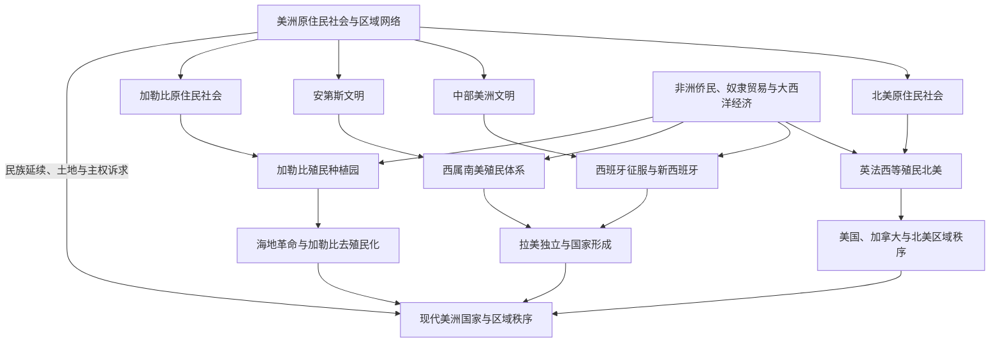

# 美洲历史

## 范围与概括

美洲历史由原住民社会、欧洲扩张、非洲侨民与奴隶贸易、独立革命及现代国家共同构成。北美、中部美洲、加勒比和南美并非相互隔绝：密西西比河、安第斯道路、加勒比海航路、亚马孙与拉普拉塔河流域把不同生态区和政治共同体连接起来；殖民时期的白银、糖、咖啡、烟草、奴隶贸易和移民又把美洲嵌入大西洋和全球经济。

本目录按区域历史组织北美、中美洲、加勒比和南美，同时保留“殖民与独立”作为跨区域专题。中部美洲（Mesoamerica）是跨越墨西哥中南部和中美洲北部的文化历史区，不等同于地理中美洲；墨西哥属于地理北美，相关古代文明在中美洲目录中集中说明。

## 美洲历史演进图

## 文明与历史空间入口

| 文明 / 历史空间 | 规范入口 | 范围说明 |
|---|---|---|
| 北美原住民社会与生态区网络 | [北美原住民](/%E4%BA%BA%E6%96%87%E7%A7%91%E5%AD%A6/%E5%8E%86%E5%8F%B2/%E7%BE%8E%E6%B4%B2/%E5%8C%97%E7%BE%8E/%E5%8C%97%E7%BE%8E%E5%8E%9F%E4%BD%8F%E6%B0%91/README.md) | 北极、太平洋沿岸、大平原、西南、密西西比河流域和东部林地等多种社会。 |
| 中部美洲文化历史区 | [中部美洲文明](/%E4%BA%BA%E6%96%87%E7%A7%91%E5%AD%A6/%E5%8E%86%E5%8F%B2/%E7%BE%8E%E6%B4%B2/%E4%B8%AD%E7%BE%8E%E6%B4%B2/%E4%B8%AD%E9%83%A8%E7%BE%8E%E6%B4%B2%E6%96%87%E6%98%8E.md) | 横跨墨西哥中南部和中美洲北部，不等于地理中美洲。 |
| 加勒比海历史空间 | [加勒比历史](/%E4%BA%BA%E6%96%87%E7%A7%91%E5%AD%A6/%E5%8E%86%E5%8F%B2/%E7%BE%8E%E6%B4%B2/%E5%8A%A0%E5%8B%92%E6%AF%94/README.md) | 海岛与沿海网络、原住民、殖民种植园、非洲侨民和去殖民化。 |
| 安第斯文明与南美区域网络 | [安第斯文明与印加帝国](/%E4%BA%BA%E6%96%87%E7%A7%91%E5%AD%A6/%E5%8E%86%E5%8F%B2/%E7%BE%8E%E6%B4%B2/%E5%8D%97%E7%BE%8E/%E5%AE%89%E7%AC%AC%E6%96%AF%E6%96%87%E6%98%8E%E4%B8%8E%E5%8D%B0%E5%8A%A0%E5%B8%9D%E5%9B%BD.md) | 安第斯高地、沿岸和帝国道路网络；亚马孙与南部区域另见南美总览。 |

## 现代国家与政治实体入口

| 地理区域 / 国家入口 | 入口 | 主线提示 |
|---|---|---|
| 北美 | [北美历史](/%E4%BA%BA%E6%96%87%E7%A7%91%E5%AD%A6/%E5%8E%86%E5%8F%B2/%E7%BE%8E%E6%B4%B2/%E5%8C%97%E7%BE%8E/README.md) | 美国、加拿大、墨西哥国家通史及大陆边界与区域秩序。 |
| 地理中美洲 | [中美洲与中部美洲](/%E4%BA%BA%E6%96%87%E7%A7%91%E5%AD%A6/%E5%8E%86%E5%8F%B2/%E7%BE%8E%E6%B4%B2/%E4%B8%AD%E7%BE%8E%E6%B4%B2/README.md) | 危地马拉至巴拿马的陆桥国家、联邦解体、干预、内战与区域合作。 |
| 加勒比政治实体 | [加勒比历史](/%E4%BA%BA%E6%96%87%E7%A7%91%E5%AD%A6/%E5%8E%86%E5%8F%B2/%E7%BE%8E%E6%B4%B2/%E5%8A%A0%E5%8B%92%E6%AF%94/README.md) | 独立国家、海外领地、自治安排与海地、古巴等国家主线。 |
| 南美 | [南美历史](/%E4%BA%BA%E6%96%87%E7%A7%91%E5%AD%A6/%E5%8E%86%E5%8F%B2/%E7%BE%8E%E6%B4%B2/%E5%8D%97%E7%BE%8E/README.md) | 西属与葡属殖民体系、独立国家、巴西、阿根廷和区域秩序。 |

## 区域共同史与跨境专题

[美洲殖民与独立](/%E4%BA%BA%E6%96%87%E7%A7%91%E5%AD%A6/%E5%8E%86%E5%8F%B2/%E7%BE%8E%E6%B4%B2/%E6%AE%96%E6%B0%91%E4%B8%8E%E7%8B%AC%E7%AB%8B/README.md)是美洲跨区域共同史的规范入口，负责比较欧洲殖民帝国、大西洋奴隶贸易、革命、独立、门罗主义与干预；北美、中美洲、加勒比和南美目录负责相同过程在当地的展开，不重复维护另一套完整通史。

| 共同史 / 专题 | 入口 | 职责 |
|---|---|---|
| 欧洲殖民体系 | [欧洲殖民帝国与美洲](/%E4%BA%BA%E6%96%87%E7%A7%91%E5%AD%A6/%E5%8E%86%E5%8F%B2/%E7%BE%8E%E6%B4%B2/%E6%AE%96%E6%B0%91%E4%B8%8E%E7%8B%AC%E7%AB%8B/%E6%AC%A7%E6%B4%B2%E6%AE%96%E6%B0%91%E5%B8%9D%E5%9B%BD%E4%B8%8E%E7%BE%8E%E6%B4%B2.md) | 比较西、葡、英、法、荷等帝国制度和区域差异。 |
| 奴隶贸易与非洲侨民 | [大西洋奴隶贸易、种植园与侨民](/%E4%BA%BA%E6%96%87%E7%A7%91%E5%AD%A6/%E5%8E%86%E5%8F%B2/%E7%BE%8E%E6%B4%B2/%E6%AE%96%E6%B0%91%E4%B8%8E%E7%8B%AC%E7%AB%8B/%E5%A4%A7%E8%A5%BF%E6%B4%8B%E5%A5%B4%E9%9A%B6%E8%B4%B8%E6%98%93%E3%80%81%E7%A7%8D%E6%A4%8D%E5%9B%AD%E4%B8%8E%E4%BE%A8%E6%B0%91.md) | 维护强迫迁徙、种植园、抵抗、废奴与侨民社会。 |
| 革命与独立比较 | [美洲革命与独立浪潮](/%E4%BA%BA%E6%96%87%E7%A7%91%E5%AD%A6/%E5%8E%86%E5%8F%B2/%E7%BE%8E%E6%B4%B2/%E6%AE%96%E6%B0%91%E4%B8%8E%E7%8B%AC%E7%AB%8B/%E7%BE%8E%E6%B4%B2%E9%9D%A9%E5%91%BD%E4%B8%8E%E7%8B%AC%E7%AB%8B%E6%B5%AA%E6%BD%AE.md) | 比较美国、海地、拉丁美洲与巴西的不同路径。 |
| 19世纪区域秩序 | [19世纪帝国主义与门罗主义](/%E4%BA%BA%E6%96%87%E7%A7%91%E5%AD%A6/%E5%8E%86%E5%8F%B2/%E7%BE%8E%E6%B4%B2/%E6%AE%96%E6%B0%91%E4%B8%8E%E7%8B%AC%E7%AB%8B/19%E4%B8%96%E7%BA%AA%E5%B8%9D%E5%9B%BD%E4%B8%BB%E4%B9%89%E4%B8%8E%E9%97%A8%E7%BD%97%E4%B8%BB%E4%B9%89.md) | 维护欧洲干预、美国扩张、债务和炮舰外交的比较。 |

## 关键辨析

- 1492年哥伦布到达加勒比，不等于“发现整个美洲”，更不等于原住民历史从此开始。
- “中美洲”在地理上通常指墨西哥以南、哥伦比亚以北的陆桥；“中部美洲”是文化历史概念，覆盖墨西哥中南部和中美洲北部的一部分。
- 殖民地图上的颜色不等于有效控制。原住民、逃奴社群、边疆牧民、海盗与地方城市长期塑造实际权力。
- 独立并非一次性完成社会革命。奴隶制、土地集中、种族等级、原住民土地压力和外部经济依赖常在新国家中延续。
- 加勒比既是海岛地区，也是连接北美、中美洲、南美、非洲和欧洲的海上历史空间。

## 上级与相邻区域

- 欧洲殖民母国：[欧洲历史](/%E4%BA%BA%E6%96%87%E7%A7%91%E5%AD%A6/%E5%8E%86%E5%8F%B2/%E6%AC%A7%E6%B4%B2/README.md)。
- 大西洋奴隶贸易背景：[非洲历史](/%E4%BA%BA%E6%96%87%E7%A7%91%E5%AD%A6/%E5%8E%86%E5%8F%B2/%E9%9D%9E%E6%B4%B2/README.md)。
- 太平洋联系：[大洋洲历史](/%E4%BA%BA%E6%96%87%E7%A7%91%E5%AD%A6/%E5%8E%86%E5%8F%B2/%E5%A4%A7%E6%B4%8B%E6%B4%B2/README.md)。

- [历史](/%E4%BA%BA%E6%96%87%E7%A7%91%E5%AD%A6/%E5%8E%86%E5%8F%B2/README.md)
