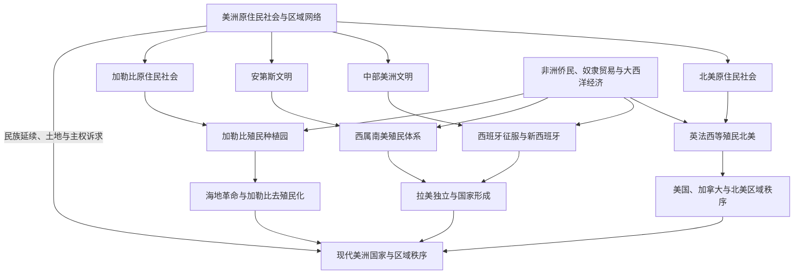

# 美洲历史

## 范围与概括

美洲历史由原住民社会、欧洲扩张、非洲侨民与奴隶贸易、独立革命及现代国家共同构成。北美、中部美洲、加勒比和南美并非相互隔绝：密西西比河、安第斯道路、加勒比海航路、亚马孙与拉普拉塔河流域把不同生态区和政治共同体连接起来；殖民时期的白银、糖、咖啡、烟草、奴隶贸易和移民又把美洲嵌入大西洋和全球经济。

本目录按区域历史组织北美、中美洲、加勒比和南美，同时保留“殖民与独立”作为跨区域专题。中部美洲（Mesoamerica）是跨越墨西哥中南部和中美洲北部的文化历史区，不等同于地理中美洲；墨西哥属于地理北美，相关古代文明在中美洲目录中集中说明。

## 美洲历史演进图

## 文明与历史空间入口

| 文明 / 历史空间 | 规范入口 | 范围说明 |
|---|---|---|
| 北美原住民社会与生态区网络 | [北美原住民](/%E4%BA%BA%E6%96%87%E7%A7%91%E5%AD%A6/%E5%8E%86%E5%8F%B2/%E7%BE%8E%E6%B4%B2/%E5%8C%97%E7%BE%8E/%E5%8C%97%E7%BE%8E%E5%8E%9F%E4%BD%8F%E6%B0%91/README.md) | 北极、太平洋沿岸、大平原、西南、密西西比河流域和东部林地等多种社会。 |
| 中部美洲文化历史区 | [中部美洲文明](/%E4%BA%BA%E6%96%87%E7%A7%91%E5%AD%A6/%E5%8E%86%E5%8F%B2/%E7%BE%8E%E6%B4%B2/%E4%B8%AD%E7%BE%8E%E6%B4%B2/%E4%B8%AD%E9%83%A8%E7%BE%8E%E6%B4%B2%E6%96%87%E6%98%8E.md) | 横跨墨西哥中南部和中美洲北部，不等于地理中美洲。 |
| 加勒比海历史空间 | [加勒比历史](/%E4%BA%BA%E6%96%87%E7%A7%91%E5%AD%A6/%E5%8E%86%E5%8F%B2/%E7%BE%8E%E6%B4%B2/%E5%8A%A0%E5%8B%92%E6%AF%94/README.md) | 海岛与沿海网络、原住民、殖民种植园、非洲侨民和去殖民化。 |
| 安第斯文明与南美区域网络 | [安第斯文明与印加帝国](/%E4%BA%BA%E6%96%87%E7%A7%91%E5%AD%A6/%E5%8E%86%E5%8F%B2/%E7%BE%8E%E6%B4%B2/%E5%8D%97%E7%BE%8E/%E5%AE%89%E7%AC%AC%E6%96%AF%E6%96%87%E6%98%8E%E4%B8%8E%E5%8D%B0%E5%8A%A0%E5%B8%9D%E5%9B%BD.md) | 安第斯高地、沿岸和帝国道路网络；亚马孙与南部区域另见南美总览。 |

## 现代国家与政治实体入口

| 地理区域 / 国家入口 | 入口 | 主线提示 |
|---|---|---|
| 北美 | [北美历史](/%E4%BA%BA%E6%96%87%E7%A7%91%E5%AD%A6/%E5%8E%86%E5%8F%B2/%E7%BE%8E%E6%B4%B2/%E5%8C%97%E7%BE%8E/README.md) | 美国、加拿大、墨西哥国家通史及大陆边界与区域秩序。 |
| 地理中美洲 | [中美洲与中部美洲](/%E4%BA%BA%E6%96%87%E7%A7%91%E5%AD%A6/%E5%8E%86%E5%8F%B2/%E7%BE%8E%E6%B4%B2/%E4%B8%AD%E7%BE%8E%E6%B4%B2/README.md) | 危地马拉至巴拿马的陆桥国家、联邦解体、干预、内战与区域合作。 |
| 加勒比政治实体 | [加勒比历史](/%E4%BA%BA%E6%96%87%E7%A7%91%E5%AD%A6/%E5%8E%86%E5%8F%B2/%E7%BE%8E%E6%B4%B2/%E5%8A%A0%E5%8B%92%E6%AF%94/README.md) | 独立国家、海外领地、自治安排与海地、古巴等国家主线。 |
| 南美 | [南美历史](/%E4%BA%BA%E6%96%87%E7%A7%91%E5%AD%A6/%E5%8E%86%E5%8F%B2/%E7%BE%8E%E6%B4%B2/%E5%8D%97%E7%BE%8E/README.md) | 西属与葡属殖民体系、独立国家、巴西、阿根廷和区域秩序。 |

## 区域共同史与跨境专题

[美洲殖民与独立](/%E4%BA%BA%E6%96%87%E7%A7%91%E5%AD%A6/%E5%8E%86%E5%8F%B2/%E7%BE%8E%E6%B4%B2/%E6%AE%96%E6%B0%91%E4%B8%8E%E7%8B%AC%E7%AB%8B/README.md)是美洲跨区域共同史的规范入口，负责比较欧洲殖民帝国、大西洋奴隶贸易、革命、独立、门罗主义与干预；北美、中美洲、加勒比和南美目录负责相同过程在当地的展开，不重复维护另一套完整通史。

| 共同史 / 专题 | 入口 | 职责 |
|---|---|---|
| 欧洲殖民体系 | [欧洲殖民帝国与美洲](/%E4%BA%BA%E6%96%87%E7%A7%91%E5%AD%A6/%E5%8E%86%E5%8F%B2/%E7%BE%8E%E6%B4%B2/%E6%AE%96%E6%B0%91%E4%B8%8E%E7%8B%AC%E7%AB%8B/%E6%AC%A7%E6%B4%B2%E6%AE%96%E6%B0%91%E5%B8%9D%E5%9B%BD%E4%B8%8E%E7%BE%8E%E6%B4%B2.md) | 比较西、葡、英、法、荷等帝国制度和区域差异。 |
| 奴隶贸易与非洲侨民 | [大西洋奴隶贸易、种植园与侨民](/%E4%BA%BA%E6%96%87%E7%A7%91%E5%AD%A6/%E5%8E%86%E5%8F%B2/%E7%BE%8E%E6%B4%B2/%E6%AE%96%E6%B0%91%E4%B8%8E%E7%8B%AC%E7%AB%8B/%E5%A4%A7%E8%A5%BF%E6%B4%8B%E5%A5%B4%E9%9A%B6%E8%B4%B8%E6%98%93%E3%80%81%E7%A7%8D%E6%A4%8D%E5%9B%AD%E4%B8%8E%E4%BE%A8%E6%B0%91.md) | 维护强迫迁徙、种植园、抵抗、废奴与侨民社会。 |
| 革命与独立比较 | [美洲革命与独立浪潮](/%E4%BA%BA%E6%96%87%E7%A7%91%E5%AD%A6/%E5%8E%86%E5%8F%B2/%E7%BE%8E%E6%B4%B2/%E6%AE%96%E6%B0%91%E4%B8%8E%E7%8B%AC%E7%AB%8B/%E7%BE%8E%E6%B4%B2%E9%9D%A9%E5%91%BD%E4%B8%8E%E7%8B%AC%E7%AB%8B%E6%B5%AA%E6%BD%AE.md) | 比较美国、海地、拉丁美洲与巴西的不同路径。 |
| 19世纪区域秩序 | [19世纪帝国主义与门罗主义](/%E4%BA%BA%E6%96%87%E7%A7%91%E5%AD%A6/%E5%8E%86%E5%8F%B2/%E7%BE%8E%E6%B4%B2/%E6%AE%96%E6%B0%91%E4%B8%8E%E7%8B%AC%E7%AB%8B/19%E4%B8%96%E7%BA%AA%E5%B8%9D%E5%9B%BD%E4%B8%BB%E4%B9%89%E4%B8%8E%E9%97%A8%E7%BD%97%E4%B8%BB%E4%B9%89.md) | 维护欧洲干预、美国扩张、债务和炮舰外交的比较。 |

## 跨区域比较矩阵

| 比较维度 | 北美 | 中部美洲与地理中美洲 | 加勒比 | 南美 |
|---|---|---|---|---|
| 殖民前政治与社会 | 北极、林地、大平原、西南和太平洋沿岸存在多种狩猎、农耕、城镇、联盟与国家形态 | 奥尔梅克、玛雅、特奥蒂瓦坎、托尔特克、墨西加等城市和贡赋体系，与陆桥南部的多样社群并存 | 泰诺、卡利纳戈等形成酋邦、村落与岛际航海网络 | 安第斯城市和印加道路帝国之外，还有亚马孙、圭亚那、查科、潘帕斯和南部沿海的多种社会 |
| 欧洲征服方式 | 英、法、西、俄殖民区竞争；条约、移民殖民、贸易站与战争并用 | 西班牙借助原住民盟友击败墨西加和玛雅诸政权，继而建立新西班牙与危地马拉行政 | 西班牙先征服大岛，英法荷随后争夺小岛并发展海军—种植园殖民 | 西班牙击败印加后建立总督辖区；葡萄牙沿巴西海岸扩张并深入内陆 |
| 劳动与人口重组 | 契约劳工、非洲奴隶制、原住民迁移和欧洲大规模移民因地区而异 | 委托监护、贡赋、矿山劳役、庄园与非洲奴隶劳动并存 | 糖业奴隶制最集中，废奴后又输入印度、华人等契约劳工 | 安第斯米塔、庄园债役、矿工、非洲奴隶和巴西种植园共同塑造社会 |
| 独立路径 | 美国经革命独立；加拿大由帝国内自治、联邦化逐步取得主权；墨西哥经战争和帝国—共和国冲突建国 | 中美洲先随墨西哥脱离西班牙，再建联邦，最终分裂为多国；巴拿马后来脱离哥伦比亚 | 海地经奴隶革命独立；西属、英属岛屿和未独立领地走出多条不同路径 | 西属南美多经战争形成共和国；巴西由王室迁都、皇太子独立和帝制过渡建国 |
| 国家整合难题 | 定居殖民扩张、原住民主权、联邦与边界战争长期存在 | 联邦解体、地方强人、土地集中、外债和外国干预反复影响国家能力 | 小岛规模、殖民地位、种植园单一经济、债务与外部安全依赖突出 | 地区主义、军人政治、边界战争、出口寡头和内陆—港口矛盾塑造共和国 |
| 19—20世纪外部权力 | 美国大陆扩张后成为区域强权，加拿大嵌入大英帝国和北大西洋体系 | 美国公司、运河、占领和冷战干预深刻影响陆桥国家 | 美国占领与干预、欧洲属地关系和冷战竞争重叠 | 英国金融与贸易影响先扩大，美国影响后来上升，欧洲移民和全球商品市场同样重要 |
| 当代共同问题 | 原住民和解、移民、边境、联邦关系、产业转型与不平等 | 民主治理、暴力、迁徙、气候风险、运河与区域一体化 | 旅游与侨汇依赖、债务、海平面与飓风、领土地位和区域合作 | 商品周期、城市不平等、军政府遗产、亚马孙环境与区域政治摆动 |

## 重要转折与时间节点

| 时间 | 转折 | 主要地区与过程 | 长期影响 |
|---|---|---|---|
| 至少约1.5万年前起 | 人群进入并遍布美洲 | 多批迁徙者经白令地区及沿岸路线扩散，随后在各生态区长期分化 | 美洲人口史不是一次迁徙或单一族群扩张 |
| 约前1万纪—前2千纪 | 多中心作物驯化与定居 | 玉米、马铃薯、木薯、豆类、南瓜等在不同地区培育 | 支持村落、城市与区域交换，也与狩猎、渔业和移动生活长期并存 |
| 约前1500年—1500年 | 城市、国家与远距网络扩展 | 中部美洲、安第斯、密西西比河流域等先后形成大型中心；加勒比和太平洋沿岸网络密集 | 殖民前美洲具有多中心政治史，不能只以阿兹特克和印加概括 |
| 1492 年以后 | 哥伦布大交换与殖民征服 | 疫病、战争、联盟、传教、强迫劳动和物种交换席卷全洲 | 原住民人口灾难、土地重组和大西洋经济形成 |
| 16—19 世纪 | 非洲奴隶贸易与种植园—矿业体系 | 加勒比、巴西、北美和西属殖民地吸收大量被强迫迁移者 | 非洲侨民、种族制度、财富集中和抵抗传统成为现代社会基础 |
| 1776—1826 年 | 第一轮革命与独立浪潮 | 美国、海地、西属美洲和巴西分别通过革命、战争或王朝分离建国 | 殖民帝国政治版图瓦解，但奴隶制、土地集中和族群排斥多未同步终结 |
| 19 世纪 | 领土国家形成与边疆扩张 | 美国、加拿大、阿根廷、智利、巴西等向原住民土地扩张；拉美各国发生内战和边界战争 | 现代国界、联邦结构、军队和定居殖民秩序逐步形成 |
| 1834—1888 年 | 奴隶制在美洲法律上逐步废除 | 英属加勒比、美国、古巴、巴西等先后废奴 | 法律自由扩大，债役、佃作、种族隔离和土地不平等继续存在 |
| 1823 年以后、1898 年加速 | 门罗主义与美国区域权力上升 | 从外交宣言发展为加勒比干预、占领、运河与公司利益保护 | 美洲由欧洲殖民主导转向美国霸权与国家主权持续冲突 |
| 1910—1930年代 | 革命、群众政治与国家干预扩大 | 墨西哥革命、劳工运动、土地改革、民众主义和大萧条冲击旧寡头秩序 | 现代政党、社会权利和发展型国家兴起，也出现新威权体制 |
| 1945—1990年代 | 冷战、革命、军事政变与民主化 | 古巴革命、拉美游击战、美国干预、国家安全政权和人权运动交织 | 军政府遗产、失踪者记忆、宪政转型和对外依赖长期影响政治 |
| 1980年代以后 | 债务危机、市场改革与区域一体化 | 拉美债务危机后实施私有化和贸易开放，北美和南美建立多种区域机制 | 产业链与金融联系增强，不平等、去工业化和社会反弹并存 |
| 21 世纪 | 原住民主权、迁徙与气候危机进入政治中心 | 土地权、边境迁徙、亚马孙砍伐、飓风、冰川与海平面风险加剧 | 国家发展模式、殖民遗产和全球责任被重新争论 |

## 关键辨析

- 1492年哥伦布到达加勒比，不等于“发现整个美洲”，更不等于原住民历史从此开始。
- “中美洲”在地理上通常指墨西哥以南、哥伦比亚以北的陆桥；“中部美洲”是文化历史概念，覆盖墨西哥中南部和中美洲北部的一部分。
- 殖民地图上的颜色不等于有效控制。原住民、逃奴社群、边疆牧民、海盗与地方城市长期塑造实际权力。
- 独立并非一次性完成社会革命。奴隶制、土地集中、种族等级、原住民土地压力和外部经济依赖常在新国家中延续。
- 加勒比既是海岛地区，也是连接北美、中美洲、南美、非洲和欧洲的海上历史空间。

## 上级与相邻区域

- 欧洲殖民母国：[欧洲历史](/%E4%BA%BA%E6%96%87%E7%A7%91%E5%AD%A6/%E5%8E%86%E5%8F%B2/%E6%AC%A7%E6%B4%B2/README.md)。
- 大西洋奴隶贸易背景：[非洲历史](/%E4%BA%BA%E6%96%87%E7%A7%91%E5%AD%A6/%E5%8E%86%E5%8F%B2/%E9%9D%9E%E6%B4%B2/README.md)。
- 太平洋联系：[大洋洲历史](/%E4%BA%BA%E6%96%87%E7%A7%91%E5%AD%A6/%E5%8E%86%E5%8F%B2/%E5%A4%A7%E6%B4%8B%E6%B4%B2/README.md)。

- [历史](/%E4%BA%BA%E6%96%87%E7%A7%91%E5%AD%A6/%E5%8E%86%E5%8F%B2/README.md)
