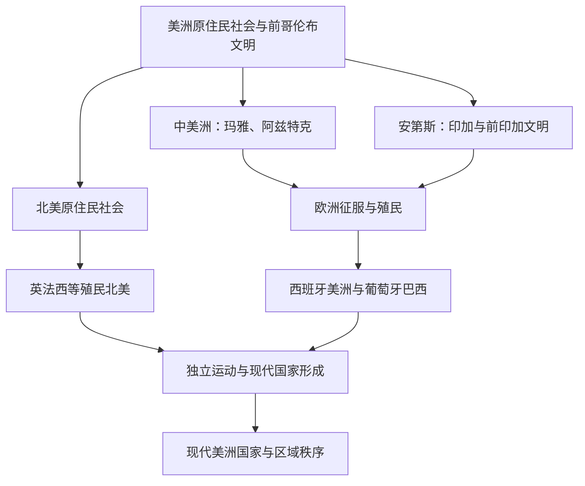

# 美洲历史

## 概括

美洲历史可分为前哥伦布文明、欧洲殖民、独立建国和现代国家几个大阶段。北美、中美洲、加勒比和南美洲各有不同主线：玛雅、阿兹特克、印加等文明与西班牙、葡萄牙、英国、法国等殖民体系共同构成近现代美洲的基础。

## 演变图

## 区域入口

| 区域 / 主题 | 入口 | 主线提示 |
|---|---|---|
| 北美 | [北美](/%E4%BA%BA%E6%96%87%E7%A7%91%E5%AD%A6/%E5%8E%86%E5%8F%B2/%E7%BE%8E%E6%B4%B2/%E5%8C%97%E7%BE%8E/README.md) | 北美原住民、英法殖民、美国、加拿大和墨西哥北部边疆。 |
| 中美洲 | [中美洲](/%E4%BA%BA%E6%96%87%E7%A7%91%E5%AD%A6/%E5%8E%86%E5%8F%B2/%E7%BE%8E%E6%B4%B2/%E4%B8%AD%E7%BE%8E%E6%B4%B2/README.md) | 奥尔梅克、玛雅、阿兹特克、西班牙征服和现代中美洲国家。 |
| 南美 | [南美](/%E4%BA%BA%E6%96%87%E7%A7%91%E5%AD%A6/%E5%8E%86%E5%8F%B2/%E7%BE%8E%E6%B4%B2/%E5%8D%97%E7%BE%8E/README.md) | 安第斯文明、印加、西班牙南美、葡萄牙巴西和独立国家。 |
| 殖民与独立 | [殖民与独立](/%E4%BA%BA%E6%96%87%E7%A7%91%E5%AD%A6/%E5%8E%86%E5%8F%B2/%E7%BE%8E%E6%B4%B2/%E6%AE%96%E6%B0%91%E4%B8%8E%E7%8B%AC%E7%AB%8B/README.md) | 欧洲殖民体系、跨大西洋贸易、美国独立、拉美独立运动。 |

## 相关区域

- 欧洲殖民母国参见[欧洲历史](/%E4%BA%BA%E6%96%87%E7%A7%91%E5%AD%A6/%E5%8E%86%E5%8F%B2/%E6%AC%A7%E6%B4%B2/README.md)。
- 大西洋奴隶贸易与非洲关系参见[非洲历史](/%E4%BA%BA%E6%96%87%E7%A7%91%E5%AD%A6/%E5%8E%86%E5%8F%B2/%E9%9D%9E%E6%B4%B2/README.md)。
- 太平洋航路与殖民网络可与[大洋洲历史](/%E4%BA%BA%E6%96%87%E7%A7%91%E5%AD%A6/%E5%8E%86%E5%8F%B2/%E5%A4%A7%E6%B4%8B%E6%B4%B2/README.md)对读。
