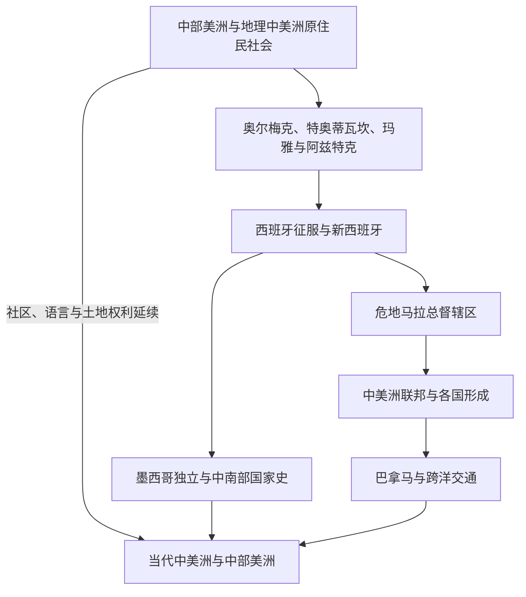

# 中美洲与中部美洲

## 范围与概括

本目录同时处理两个相互重叠但不能混同的范围：中部美洲（Mesoamerica）是以玉米农业、历法、文字、城市与宗教传统相互联系的文化历史区，涵盖墨西哥中南部和中美洲北部；地理中美洲则是危地马拉、伯利兹、洪都拉斯、萨尔瓦多、尼加拉瓜、哥斯达黎加和巴拿马组成的陆桥。中部美洲古代文明与新西班牙核心在这里集中整理，墨西哥北部边疆见[北美历史](/%E4%BA%BA%E6%96%87%E7%A7%91%E5%AD%A6/%E5%8E%86%E5%8F%B2/%E7%BE%8E%E6%B4%B2/%E5%8C%97%E7%BE%8E/README.md)。

## 演进图

## 主题入口

| 主题 | 入口 | 说明 |
|---|---|---|
| 古代文明 | [中部美洲文明](/%E4%BA%BA%E6%96%87%E7%A7%91%E5%AD%A6/%E5%8E%86%E5%8F%B2/%E7%BE%8E%E6%B4%B2/%E4%B8%AD%E7%BE%8E%E6%B4%B2/%E4%B8%AD%E9%83%A8%E7%BE%8E%E6%B4%B2%E6%96%87%E6%98%8E.md) | 奥尔梅克、特奥蒂瓦坎、玛雅、托尔特克、墨西加 / 阿兹特克及地区差异。 |
| 殖民与墨西哥中南部 | [新西班牙与墨西哥中南部](/%E4%BA%BA%E6%96%87%E7%A7%91%E5%AD%A6/%E5%8E%86%E5%8F%B2/%E7%BE%8E%E6%B4%B2/%E4%B8%AD%E7%BE%8E%E6%B4%B2/%E6%96%B0%E8%A5%BF%E7%8F%AD%E7%89%99%E4%B8%8E%E5%A2%A8%E8%A5%BF%E5%93%A5%E4%B8%AD%E5%8D%97%E9%83%A8.md) | 征服、新西班牙、独立和墨西哥中南部的历史位置。 |
| 中美洲国家形成 | [中美洲独立与联邦](/%E4%BA%BA%E6%96%87%E7%A7%91%E5%AD%A6/%E5%8E%86%E5%8F%B2/%E7%BE%8E%E6%B4%B2/%E4%B8%AD%E7%BE%8E%E6%B4%B2/%E4%B8%AD%E7%BE%8E%E6%B4%B2%E7%8B%AC%E7%AB%8B%E4%B8%8E%E8%81%94%E9%82%A6.md) | 1821年独立、1823-1841年联邦与各国分离。 |
| 现代地理中美洲 | [当代中美洲与巴拿马](/%E4%BA%BA%E6%96%87%E7%A7%91%E5%AD%A6/%E5%8E%86%E5%8F%B2/%E7%BE%8E%E6%B4%B2/%E4%B8%AD%E7%BE%8E%E6%B4%B2/%E5%BD%93%E4%BB%A3%E4%B8%AD%E7%BE%8E%E6%B4%B2%E4%B8%8E%E5%B7%B4%E6%8B%BF%E9%A9%AC.md) | 香蕉经济、美国干预、内战、和平进程、运河与跨境迁移。 |
| 加勒比海史 | [加勒比历史](/%E4%BA%BA%E6%96%87%E7%A7%91%E5%AD%A6/%E5%8E%86%E5%8F%B2/%E7%BE%8E%E6%B4%B2/%E5%8A%A0%E5%8B%92%E6%AF%94/README.md) | 海岛殖民、海地革命、古巴与区域合作。 |

## 重要辨析

- 玛雅不是单一帝国；不同城邦、区域与后古典政治体的时间并不一致。
- 阿兹特克是对墨西加及其三方联盟的常用称呼，核心位于今墨西哥中部，不属于地理中美洲各国。
- 巴拿马地理上属于中美洲，但其哥伦比亚、运河和加勒比—太平洋联系使其历史具有跨区域性质。
- “中美洲联邦”不是今日七国的天然前身，成员、边界和实际政治整合不断变化。

## 相关入口

- 上级：[美洲历史](/%E4%BA%BA%E6%96%87%E7%A7%91%E5%AD%A6/%E5%8E%86%E5%8F%B2/%E7%BE%8E%E6%B4%B2/README.md)。
- 北部边疆：[墨西哥北部边疆](/%E4%BA%BA%E6%96%87%E7%A7%91%E5%AD%A6/%E5%8E%86%E5%8F%B2/%E7%BE%8E%E6%B4%B2/%E5%8C%97%E7%BE%8E/%E5%A2%A8%E8%A5%BF%E5%93%A5%E5%8C%97%E9%83%A8%E8%BE%B9%E7%96%86.md)。
- 跨区域殖民：[美洲殖民与独立](/%E4%BA%BA%E6%96%87%E7%A7%91%E5%AD%A6/%E5%8E%86%E5%8F%B2/%E7%BE%8E%E6%B4%B2/%E6%AE%96%E6%B0%91%E4%B8%8E%E7%8B%AC%E7%AB%8B/README.md)。
