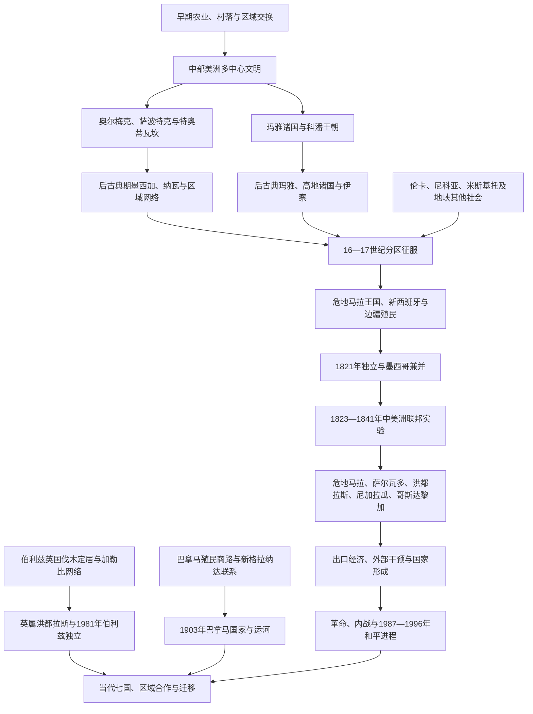

# 中美洲与中部美洲

## 范围与概括

本目录同时处理两个相互重叠但不能混同的范围：

- **中部美洲（Mesoamerica）**是文化历史区，以玉米农业、历法、文字、城市、市场和宗教网络为共同特征，覆盖墨西哥中南部、危地马拉、伯利兹以及洪都拉斯、萨尔瓦多部分地区。
- **地理中美洲（Central America）**是墨西哥以南、哥伦比亚以北的陆桥，现代通常包括危地马拉、伯利兹、洪都拉斯、萨尔瓦多、尼加拉瓜、哥斯达黎加和巴拿马。

古代史不能按现代国界切开：玛雅诸国、伦卡、皮皮尔／纳瓦、米斯基托和其他社会横跨今日边界。殖民时期也存在不同路径：危地马拉王国覆盖今中美洲五国主体，伯利兹沿岸由英国伐木定居者逐步控制，巴拿马则连接秘鲁、新格拉纳达和跨洋商路。1823—1841年的中美洲联邦实验只包括危地马拉、萨尔瓦多、洪都拉斯、尼加拉瓜和哥斯达黎加；共同联邦行政在1840年已经终止，萨尔瓦多到1841年才放弃联邦名义，因此不能把它倒推为今日七国的完整前身。

墨西哥地理上属于北美，连续国家通史见[墨西哥历史](/%E4%BA%BA%E6%96%87%E7%A7%91%E5%AD%A6/%E5%8E%86%E5%8F%B2/%E7%BE%8E%E6%B4%B2/%E5%8C%97%E7%BE%8E/%E5%A2%A8%E8%A5%BF%E5%93%A5/README.md)；本目录只保留横跨国界的中部美洲文明和新西班牙历史空间。

## 演进图

## 历史主线

### 中部美洲文明

前古典和古典时期出现奥尔梅克中心、蒙特阿尔班、特奥蒂瓦坎及众多玛雅城市国家。政治体通过市场、贡赋、婚姻、战争和历法仪式连接，并不存在覆盖全部地区的单一帝国。8—10世纪部分古典玛雅宫廷终止后，北部、高地和沿海政治继续发展；西班牙征服也用了近两百年才攻陷佩滕最后主要独立玛雅王国。

### 征服与殖民治理

西班牙—原住民联盟1521年攻陷特诺奇蒂特兰，1520年代起进入危地马拉、萨尔瓦多、洪都拉斯和尼加拉瓜。王室以审问院、总督兼都督、市政会、教会和原住民共和国建立危地马拉王国。贡赋、劳役、靛蓝、可可、矿业和土地制度重组社会；加勒比岸的英国定居、米斯基托政治体和加里富纳迁徙则形成不同权力格局。

### 独立、联邦与国家形成

1821年独立后，地区短暂并入墨西哥帝国，1823年转为联合省，1824年建立五州联邦共和国。薄弱财政、州权、城市竞争、教会与自由派改革、农村土地和霍乱危机引发战争，1838—1841年各州相继独立。19世纪后期的咖啡、香蕉、铁路与自由派土地改革巩固国家，也扩大土地和劳工不平等。

### 外部干预、战争与和平

美国的运河、公司、债务和安全利益在尼加拉瓜、洪都拉斯、危地马拉与巴拿马尤其突出。冷战时期危地马拉、萨尔瓦多和尼加拉瓜发生长期战争，洪都拉斯成为军事基地。1987年地区和平方案、1990年尼加拉瓜选举、1992年萨尔瓦多和平协议和1996年危地马拉和平协议结束主要战争，民主化却未消除威权集中、犯罪、贫困、气候灾害和迁移。

## 按时间排序的导航

| 顺序 | 笔记 | 时间 | 内容职责 |
|---:|---|---|---|
| 1 | [中部美洲文明](/%E4%BA%BA%E6%96%87%E7%A7%91%E5%AD%A6/%E5%8E%86%E5%8F%B2/%E7%BE%8E%E6%B4%B2/%E4%B8%AD%E7%BE%8E%E6%B4%B2/%E4%B8%AD%E9%83%A8%E7%BE%8E%E6%B4%B2%E6%96%87%E6%98%8E.md) | 约前2000年—17世纪 | 农业、城市、玛雅诸国、特奥蒂瓦坎、墨西加、高地与中美洲南缘社会，以及征服和文化延续。 |
| 2 | [科潘王朝君主世系表](/%E4%BA%BA%E6%96%87%E7%A7%91%E5%AD%A6/%E5%8E%86%E5%8F%B2/%E7%BE%8E%E6%B4%B2/%E4%B8%AD%E7%BE%8E%E6%B4%B2/%E7%A7%91%E6%BD%98%E7%8E%8B%E6%9C%9D%E5%90%9B%E4%B8%BB%E4%B8%96%E7%B3%BB%E8%A1%A8.md) | 426—约822年 | 祭坛 Q 所记16王完整顺序、争议共治、第13王被俘杀和末期继位主张。 |
| 3 | [新西班牙与墨西哥中南部](/%E4%BA%BA%E6%96%87%E7%A7%91%E5%AD%A6/%E5%8E%86%E5%8F%B2/%E7%BE%8E%E6%B4%B2/%E4%B8%AD%E7%BE%8E%E6%B4%B2/%E6%96%B0%E8%A5%BF%E7%8F%AD%E7%89%99%E4%B8%8E%E5%A2%A8%E8%A5%BF%E5%93%A5%E4%B8%AD%E5%8D%97%E9%83%A8.md) | 1519—1821年 | 分区征服、危地马拉审问院与都督辖区、巴拿马和伯利兹不同路径、殖民经济及独立原因。 |
| 4 | [中美洲独立与联邦](/%E4%BA%BA%E6%96%87%E7%A7%91%E5%AD%A6/%E5%8E%86%E5%8F%B2/%E7%BE%8E%E6%B4%B2/%E4%B8%AD%E7%BE%8E%E6%B4%B2/%E4%B8%AD%E7%BE%8E%E6%B4%B2%E7%8B%AC%E7%AB%8B%E4%B8%8E%E8%81%94%E9%82%A6.md) | 1821—1841年及后续 | 独立、墨西哥兼并、1824年制度、完整联邦行政首脑、内战、解体与统一尝试。 |
| 5 | [当代中美洲与巴拿马](/%E4%BA%BA%E6%96%87%E7%A7%91%E5%AD%A6/%E5%8E%86%E5%8F%B2/%E7%BE%8E%E6%B4%B2/%E4%B8%AD%E7%BE%8E%E6%B4%B2/%E5%BD%93%E4%BB%A3%E4%B8%AD%E7%BE%8E%E6%B4%B2%E4%B8%8E%E5%B7%B4%E6%8B%BF%E9%A9%AC.md) | 19世纪中期—2026年 | 七国出口经济、干预、内战、和平与当代治理；现任国家元首和政府首脑核验至2026年7月。 |

## 现代七国主线

| 国家 | 前现代 / 殖民路径 | 近现代主线 |
|---|---|---|
| 危地马拉 | 玛雅高地与低地；危地马拉王国中心 | 咖啡自由派、1944年革命、1954年政变、内战与1996年和平、反腐制度之争。 |
| 伯利兹 | 玛雅社会、英国伐木定居与非洲奴役 | 英属洪都拉斯、1964年自治、1981年独立、英联邦政体和危地马拉领土案。 |
| 洪都拉斯 | 科潘、伦卡及加勒比社会；危地马拉王国一省 | 香蕉公司、军人政治、1969年战争、冷战基地、2009年政变与政党轮替。 |
| 萨尔瓦多 | 皮皮尔／纳瓦与玛雅边缘；靛蓝殖民经济 | 咖啡寡头、1932年大屠杀、内战与1992年和平、布克尔安全国家与连任改革。 |
| 尼加拉瓜 | 乔罗特加、纳瓦与加勒比米斯基托网络 | 美国占领、桑地诺、索摩查王朝、1979年革命、反政府战争与共同总统集权。 |
| 哥斯达黎加 | 中部美洲南缘与奇布查联系；边缘殖民省 | 咖啡、1948年内战、废除军队、福利民主、贸易与治安转型。 |
| 巴拿马 | 地峡酋邦与跨洋商路；归秘鲁／新格拉纳达体系 | 1821年加入大哥伦比亚、1903年分离、运河区、军政府、1989年入侵与1999年运河移交。 |

## 重要转折与时间节点

| 时间 | 转折 | 意义 |
|---|---|---|
| 约前1500年后 | 奥尔梅克、早期玛雅与区域中心发展 | 复杂社会、仪式和交换网络扩大。 |
| 378年 | 蒂卡尔“进入”事件 | 外来符号、武装和本地王朝更替结合。 |
| 426年 | 科潘王朝建立 | 东南玛雅形成延续约四世纪的王系。 |
| 8—10世纪 | 南部低地古典宫廷转型 | 王朝和城市收缩，玛雅社会在其他地区延续。 |
| 1428年 | 墨西加三方联盟形成 | 墨西哥中部贡赋霸权建立。 |
| 1519—1521年 | 特诺奇蒂特兰战争 | 西班牙—原住民联盟摧毁三方联盟核心。 |
| 1524年 | 高地危地马拉战争 | 基切失败，卡克奇克尔由盟友转为反抗者。 |
| 1542—1543年 | 新法与危地马拉审问院 | 王室把征服者权力纳入区域行政。 |
| 1697年 | 诺赫佩滕失守 | 最后主要独立玛雅王国终结。 |
| 1821年 | 中美洲独立 | 殖民政权转入本地临时政府，各省选择分裂。 |
| 1823—1824年 | 联合省与联邦宪法 | 五州共和联邦形成。 |
| 1826—1829年 | 第一次联邦内战 | 阿尔塞政府失败，莫拉桑自由派掌权。 |
| 1837—1841年 | 卡雷拉起义与联邦解体 | 州权、农村反改革和战争终结共同国家。 |
| 1855—1857年 | 反沃克战争 | 分立国家以联军抵抗私人征服。 |
| 1903—1914年 | 巴拿马国家和运河 | 美国权力与全球航运重塑地峡。 |
| 1932年 | 萨尔瓦多“大屠杀” | 军人—咖啡秩序和原住民压制加深。 |
| 1944—1954年 | 危地马拉革命十年及政变 | 社会改革被冷战干预中断。 |
| 1948—1949年 | 哥斯达黎加内战、废军与新宪法 | 建立区域最稳定的文人制度路径之一。 |
| 1979年 | 桑地诺革命 | 索摩查王朝覆亡，中美洲战争国际化。 |
| 1987—1996年 | 地区和各国和平协议 | 军事竞争逐步转入选举和解除武装。 |
| 1989—1999年 | 巴拿马入侵至运河移交 | 军政府终结并恢复完整运河主权。 |
| 2024—2026年 | 多国换届和制度重构 | 反腐转型、共同总统、无限连任与新政府同时出现。 |

## 关键辨析

- 玛雅不是单一帝国，古典宫廷“崩溃”也不是玛雅民族消失。
- 墨西加三方联盟核心在今墨西哥，不属于地理中美洲七国；它属于中部美洲文化史。
- 危地马拉王国又称审问院辖区或都督辖区，但不应误写为完全受墨西哥总督日常直接管理的普通省。
- 巴拿马的殖民和独立路径主要连接南美，伯利兹主要连接英国加勒比；两者都不是1824年联邦成员。
- 中美洲联邦失败不能只归因于“自由派与保守派不合”，财政、州权、土地、教会、城市和农村政治同样重要。
- “香蕉共和国”是批判外资、特许和政治干预的概念，不表示七国制度完全相同。
- 和平协议终止主要内战，不等于历史问责、土地不平等、武器和迁移问题已经解决。
- 总统制国家的总统通常同时是国家元首与政府首脑；伯利兹则必须区分国王、总督和总理。

## 相关入口

- 上级：[美洲历史](/%E4%BA%BA%E6%96%87%E7%A7%91%E5%AD%A6/%E5%8E%86%E5%8F%B2/%E7%BE%8E%E6%B4%B2/README.md)。
- 跨区域殖民与独立：[美洲殖民与独立](/%E4%BA%BA%E6%96%87%E7%A7%91%E5%AD%A6/%E5%8E%86%E5%8F%B2/%E7%BE%8E%E6%B4%B2/%E6%AE%96%E6%B0%91%E4%B8%8E%E7%8B%AC%E7%AB%8B/README.md)。
- 墨西哥国家主线：[墨西哥历史](/%E4%BA%BA%E6%96%87%E7%A7%91%E5%AD%A6/%E5%8E%86%E5%8F%B2/%E7%BE%8E%E6%B4%B2/%E5%8C%97%E7%BE%8E/%E5%A2%A8%E8%A5%BF%E5%93%A5/README.md)。
- 加勒比联系：[加勒比历史](/%E4%BA%BA%E6%96%87%E7%A7%91%E5%AD%A6/%E5%8E%86%E5%8F%B2/%E7%BE%8E%E6%B4%B2/%E5%8A%A0%E5%8B%92%E6%AF%94/README.md)。
- 南美与巴拿马前史：[南美历史](/%E4%BA%BA%E6%96%87%E7%A7%91%E5%AD%A6/%E5%8E%86%E5%8F%B2/%E7%BE%8E%E6%B4%B2/%E5%8D%97%E7%BE%8E/README.md)。
