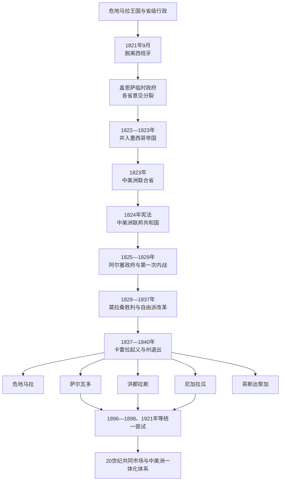

# 中美洲独立与联邦

## 时间

1821—1841年为独立、墨西哥兼并和联邦实验核心；成员国巩固主权及后续统一尝试延续至19—20世纪。

## 概括

危地马拉王国的主要省份于1821年脱离西班牙后，没有立即形成今日各国。加维诺·盖恩萨领导的临时政府在地方意见分裂中推动加入伊图尔维德的墨西哥帝国；圣萨尔瓦多武装反对，哥斯达黎加、尼加拉瓜等地的城市也各自选择阵营。墨西哥帝国1823年崩溃后，制宪大会宣布中美洲对西班牙、墨西哥和任何外国完全独立，先称“中美洲联合省”，1824年宪法后称“中美洲联邦共和国”。

联邦由危地马拉、萨尔瓦多、洪都拉斯、尼加拉瓜和哥斯达黎加五州组成。宪法把州内政权留给各州，把外交、共同防务和部分财政交给联邦，但中央缺少稳定税源、常备行政和忠于联邦的军队。危地马拉城、圣萨尔瓦多、莱昂、格拉纳达、科马亚瓜、特古西加尔巴、卡塔戈和圣何塞等城市之间的旧竞争，与自由派—保守派、教会—世俗改革、克里奥尔精英—农村社区冲突相互叠加。

首任总统曼努埃尔·何塞·阿尔塞同原自由派盟友决裂并干预州政府，引发1826—1829年内战。弗朗西斯科·莫拉桑取胜后推行自由派改革，却未解决财政与地方代表性；危地马拉的霍乱、防疫强制、土地和教会争议为拉斐尔·卡雷拉领导的农村起义提供条件。1838年联邦允许各州自行组织政府，成员相继退出；最后一届联邦行政于1840年终止，萨尔瓦多至1841年放弃联邦名义。联邦失败不是“民族天然分离”，而是薄弱共同机构、精英与民众利益冲突、交通地理、战争和具体改革危机共同造成。

伯利兹当时是英国伐木定居与西班牙—危地马拉名义主权争议区，从未成为联邦有效成员；巴拿马属于大哥伦比亚，也不是联邦成员。

## 演变图

## 1821年独立与省级选择

9月15日危地马拉城会议签署的独立文件要求各地选举代表决定最终政体，并让殖民末任首脑盖恩萨继续掌权。这一安排避免立即同西班牙作战，却使首都精英能够主导过渡。独立消息传到各省后，莱昂、格拉纳达、圣萨尔瓦多、科马亚瓜、特古西加尔巴、卡塔戈和圣何塞等城市作出不同反应，说明“中美洲”尚不是统一政治主体。

伊图尔维德提出把地区纳入墨西哥帝国。盖恩萨以各市镇回函结果宣布兼并，反对者质疑统计和程序；圣萨尔瓦多拒绝承认并寻求同美国结盟。墨西哥将军比森特·菲利索拉率军进入中美洲，1823年攻占圣萨尔瓦多，但伊图尔维德几乎同时退位。菲利索拉召集制宪大会并撤军，地区得以重新选择政体。

1823年7月1日，制宪大会宣布各省“自由、主权并独立于旧西班牙、墨西哥及任何其他强国”。恰帕斯大部最终选择留在墨西哥，索科努斯科归属继续争议；哥斯达黎加在本国内战后加入新联邦。

## 1824年联邦制度

| 机构 | 组成与职权 | 主要限制 |
|---|---|---|
| 联邦总统与副总统 | 负责外交、执行联邦法律和协调军防，任期四年 | 没有充足直属官僚、税收和军队，常依赖州政府与临时征兵。 |
| 联邦国会 | 各州代表组成，制定联邦法律、预算并确认选举 | 州别与城市利益使财政、关税和驻地问题长期争议。 |
| 联邦参议院 | 审议法律并对行政提供制衡 | 权限设计复杂，战争时期难以阻止总统或州军越权。 |
| 联邦最高法院 | 处理宪法和跨州争议 | 司法执行依赖地方机关，规则变更和内战削弱权威。 |
| 五个成员州 | 各有州宪法、州首脑、议会和民兵 | 掌握最直接的税源、土地、警务和政治网络，常优先服从本州。 |
| 联邦区与首都 | 最初驻危地马拉城，后转索索纳特、圣萨尔瓦多；1835年设联邦区 | 迁都反映反对危地马拉支配，也增加行政成本和同萨尔瓦多州的权力冲突。 |
| 教会与市政会 | 天主教为宪法规定宗教；地方教会、市政和兄弟会掌握社会网络 | 自由派改革触动什一税、修会、婚姻、教育和土地，激发广泛抵抗。 |

联邦宪法宣示自由、平等、安全和财产权，但政治参与受性别、财产、识字和地方选举规则制约。奴隶制在联邦初期被废除是重要变化，原住民社区却面临人头税遗产、共同土地和劳役制度的持续压力。

## 完整联邦行政首脑序列

第二届三人执政团成员曾因缺席而多次由替补实际履职，因此表中把正式成员和替补一起说明；总统“当选”与实际就任也必须区分。

| 顺序 | 首脑 / 集体行政 | 在位时间 | 身份与继承 | 关键事件 / 备注 |
|---:|---|---|---|---|
| 1 | 加维诺·盖恩萨 | 1821年9月15日—1822年1月5日 | 原殖民高级政治首长转任临时协商委员会主席 | 主持独立过渡并推动并入墨西哥；兼并后主权转入墨西哥帝国。 |
| — | 墨西哥帝国统治；盖恩萨、比森特·菲利索拉等执行 | 1822年1月—1823年7月1日 | 伊图尔维德任命或认可的政治—军事首脑 | 圣萨尔瓦多拒绝兼并；菲利索拉以军队压服后因帝国崩溃召集制宪大会并撤军。 |
| 2 | 何塞·马蒂亚斯·德尔加多 | 1823年7月1—10日 | 制宪大会主持下的短期高级政治首长 | 完全独立宣言到三人执政团有效接管之间的过渡。 |
| 3 | 第一届最高行政三人团：佩德罗·莫利纳、胡安·比森特·比利亚科塔、安东尼奥·里韦拉·卡韦萨斯 | 1823年7月10日—10月4日 | 集体临时行政；里韦拉替代缺席的曼努埃尔·何塞·阿尔塞 | 接收菲利索拉撤军后的行政；因被指不能充分代表各省而改组。 |
| 4 | 第二届最高行政三人团：正式成员曼努埃尔·何塞·阿尔塞、何塞·塞西略·德尔巴列、托马斯·奥兰；先后由何塞·圣地亚哥·米利亚、胡安·比森特·比利亚科塔、何塞·曼努埃尔·德拉塞尔达等替补 | 1823年10月4日—1825年4月29日 | 集体行政，成员随归国和缺席变化 | 主持1824年宪法制定和首届总统选举；不能把所有成员都写成同时持续在任。 |
| 当选未就任 | 何塞·塞西略·德尔巴列 | 1825年选举 | 得票居前，但国会认定未达法定多数并改选阿尔塞 | 未实际担任总统，应同在任首脑区分。 |
| 5 | **曼努埃尔·何塞·阿尔塞** | 1825年4月29日—1828年2月14日 | 首任宪制总统 | 原自由派支持者转同保守派和危地马拉精英合作，解散或干预州机关，引发内战；后离开职位。 |
| 6 | 马里亚诺·贝尔特拉内纳 | 1828年2月14日—1829年4月13日 | 临时总统 | 在内战中维持危地马拉城联邦政府，莫拉桑军攻入首都后被推翻。 |
| 7 | 弗朗西斯科·莫拉桑 | 1829年4月13日—6月25日 | 胜利军领袖、事实首脑 | 击败保守派联邦政府，驱逐部分修会和保守派领袖；将行政交给临时总统。 |
| 8 | 何塞·弗朗西斯科·巴伦迪亚 | 1829年6月25日—1830年9月16日 | 临时总统 | 恢复宪政和选举，为莫拉桑首个正式任期过渡。 |
| 9 | **弗朗西斯科·莫拉桑** | 1830年9月16日—1834年9月16日 | 第二位正式总统，首任期 | 推动自由贸易、教育和世俗化；面对保守派入侵、州冲突和财政不足。 |
| 当选未就任 | 何塞·塞西略·德尔巴列 | 1834年选举 | 赢得选举后在就职前死亡 | 死亡造成继任空档，不能列为实际总统。 |
| 10 | 何塞·格雷戈里奥·萨拉萨尔 | 1834年9月16日—1835年2月14日 | 临时总统 | 在德尔巴列死亡后看守行政；联邦机关迁向萨尔瓦多。 |
| 11 | **弗朗西斯科·莫拉桑** | 1835年2月14日—1839年2月1日 | 第二任正式任期 | 推进自由派改革；危地马拉州马里亚诺·加尔维斯政府危机和卡雷拉起义使州退出加速。 |
| 12 | 迭戈·比希尔 | 1839年2月1日—1840年3月31日 | 临时总统、最后联邦行政首脑 | 实际权力主要限于萨尔瓦多；成员州相继独立，任期结束后联邦行政不再运作。 |

## 1826—1829年第一次联邦内战

1825年总统选举中德尔巴列得票领先但未获法定多数，国会选择阿尔塞。阿尔塞上台依靠自由派，却因军费、州权和人事冲突转向同危地马拉保守派合作。1826年他逮捕危地马拉州首脑胡安·巴伦迪亚、解散州机关，并同萨尔瓦多发生战争，联邦宪制危机转为多州内战。

洪都拉斯自由派将领弗朗西斯科·莫拉桑在拉特里尼达战役取胜后整合洪都拉斯、萨尔瓦多和尼加拉瓜自由派军队。1829年他攻占危地马拉城，推翻贝尔特拉内纳政府，没收部分教会财产并驱逐保守派领导。军事胜利恢复了形式宪政，却也使联邦政治更加依赖州军与胜利派别。

## 莫拉桑改革与联邦危机

莫拉桑政府试图发展教育、开放贸易、限制修会和教会特权，并把首都迁离危地马拉。危地马拉州首脑马里亚诺·加尔维斯进一步推行民事婚姻、世俗墓地、司法改革和社区土地政策。改革者希望建立统一公民共和国，却往往缺少本地语言沟通、财政补偿和基层协商。

1837年霍乱流行，政府检疫、集中安葬和水源措施被谣言解释为投毒。教区网络、被土地和税费政策冲击的农村居民、保守派精英及地方领袖汇合，拉斐尔·卡雷拉成为武装起义中心。起义不只是保守精英操纵：玛雅和拉迪诺农民有土地、宗教、地方自治及征兵等实际诉求。加尔维斯政府崩溃后，危地马拉退出自由派联邦秩序。

## 各州退出与国家形成

| 州 / 地区 | 退出或转型 | 具体过程 |
|---|---|---|
| 尼加拉瓜 | 1838年4月宣布自主 | 莱昂与格拉纳达长期竞争，州内战争和财政负担削弱联邦认同；较早利用联邦允许自行组织政府的决定。 |
| 洪都拉斯 | 1838年10—11月转为独立国家 | 保守派和地方军人反对莫拉桑；弗朗西斯科·费雷拉成为独立初期关键军事首脑。 |
| 哥斯达黎加 | 1838年11月在布劳略·卡里略统治下退出 | 距联邦核心遥远，咖啡出口和圣何塞国家机关逐步独立；1848年正式称共和国。 |
| 危地马拉 | 1838—1839年联邦关系终止 | 卡雷拉农村联盟击败自由派，保守派和教会恢复影响；1847年宣布为共和国。 |
| 洛斯阿尔托斯 | 1838年作为第六州出现，1840年被并回危地马拉 | 克萨尔特南戈自由派商人与高地利益要求脱离危地马拉；卡雷拉武力兼并，原住民税负和地方冲突同样重要。 |
| 萨尔瓦多 | 1840—1841年最后放弃联邦名义 | 联邦首都和莫拉桑最后基地；1840年卡雷拉击败莫拉桑入侵危地马拉的军队，1841年萨尔瓦多确立独立宪制。 |
| 伯利兹 | 从未成为有效成员州 | 英国伐木定居者实际控制沿海，联邦与后来的危地马拉声称继承西班牙主权但无日常治理。 |
| 巴拿马 | 不在联邦范围 | 1821年脱离西班牙后加入大哥伦比亚，其国家形成与运河史另有路径。 |

## 联邦瓦解的原因

### 结构因素

- 山地、森林、雨季道路和漫长海岸提高通信及军队调动成本，首都命令到边远州常已失去时效。
- 关税和地方税掌握在州及港口手中，联邦缺少稳定收入，只能借款、摊派或征用州军。
- 殖民时期各省、城市和教区已有独立精英网络，危地马拉城的行政优势被其他州视为旧殖民中心延续。
- 联邦与州宪法权限重叠，遇到叛乱时没有被各方共同接受的裁决和执法机关。
- 选举参与有限，农村原住民、混合族群和贫民承受征税、征兵与土地改革，却很少能决定联邦政策。

### 政治与社会压力

- “自由派—保守派”不仅是思想争论，也涉及商路、教会财产、市政职位、地方自治和家庭网络。
- 自由派改革速度快于行政能力和基层协商，保守派则以恢复秩序为名保护旧特权。
- 州政府常用本地民兵解决宪法争议，军事胜负取代法律程序，失败方更愿意退出联邦。
- 莫拉桑的区域理想依赖个人军事声望，未形成能够在其失势后继续运转的跨州政党和财政联盟。

### 直接触发因素

阿尔塞1826年干预危地马拉州引发第一次内战；1837年霍乱、检疫和反改革起义摧毁危地马拉自由派政府；1838年国会授权各州自行组织政权，为退出提供法律出口。卡雷拉1840年击败莫拉桑是恢复联邦的最后直接军事失败。

## 后续统一尝试

- **1842年莫拉桑最后行动**：莫拉桑在哥斯达黎加夺权并计划重建联邦，因征兵和战争计划遭反叛后被处决。
- **1856—1857年反沃克战争**：五国联合击败在尼加拉瓜夺权的美国冒险家威廉·沃克，显示共同安全利益仍可促成协作。
- **1885年巴里奥斯计划**：危地马拉总统胡斯托·鲁菲诺·巴里奥斯试图以军事恢复联盟，在查尔丘阿帕战死，计划失败。
- **1896—1898年大中美洲共和国**：洪都拉斯、尼加拉瓜和萨尔瓦多建立联盟，1898年改称中美洲合众国；萨尔瓦多政变后解体。
- **1921年联邦**：危地马拉、萨尔瓦多和洪都拉斯在独立百年时短暂组成新联邦，数月后因政变终止。
- **制度化一体化**：1951年中美洲国家组织、1960年中美洲共同市场和1991年中美洲一体化体系把统一理想转为政府间合作，不再取消成员国主权。

## 重要事件

| 时间 | 事件 | 结果与长期影响 |
|---|---|---|
| 1821年9月15日 | 危地马拉城签署独立文件 | 结束西班牙统治，省级最终选择尚未解决。 |
| 1822年1月 | 多数省份并入墨西哥帝国 | 圣萨尔瓦多抵抗，地区第一次政体选择引发战争。 |
| 1823年2月 | 菲利索拉攻占圣萨尔瓦多 | 墨西哥军事控制达到高点，但帝国同时崩溃。 |
| 1823年7月1日 | 宣布完全独立 | 中美洲联合省成立，排除对西班牙和墨西哥的从属。 |
| 1824年11月 | 联邦宪法通过 | 五州联邦、权力分立和州自治制度化。 |
| 1825年 | 首次总统选举 | 国会选择阿尔塞而非得票领先的德尔巴列，留下合法性争议。 |
| 1826—1829年 | 第一次联邦内战 | 阿尔塞政府瓦解，莫拉桑自由派联盟取胜。 |
| 1829年 | 莫拉桑攻占危地马拉城 | 保守派和修会受打击，自由派改革阶段开始。 |
| 1830年 | 莫拉桑正式就任总统 | 尝试重建财政、教育与共同政治。 |
| 1834年 | 德尔巴列当选后病逝 | 继任危机使莫拉桑再次当选，反对者质疑权力集中。 |
| 1834—1835年 | 联邦机关迁往萨尔瓦多 | 削弱危地马拉城地位，也把联邦同萨尔瓦多政治纠缠。 |
| 1837年 | 霍乱与危地马拉农村起义 | 防疫、土地、宗教和政治不满汇合，卡雷拉崛起。 |
| 1838年 | 国会允许各州自行组织政府 | 尼加拉瓜、洪都拉斯、哥斯达黎加相继退出。 |
| 1838年 | 洛斯阿尔托斯成为第六州 | 高地自由派和区域利益挑战危地马拉。 |
| 1839年 | 莫拉桑第二任期结束 | 联邦行政已主要限于萨尔瓦多。 |
| 1840年 | 卡雷拉击败莫拉桑并兼并洛斯阿尔托斯 | 军事恢复联邦失败，最后联邦行政终止。 |
| 1841年 | 萨尔瓦多确立独立宪制 | 联邦作为国家正式走到终点。 |
| 1842年 | 莫拉桑在哥斯达黎加被处决 | 早期以军事恢复联邦的最后尝试失败。 |
| 1896—1898年 | 大中美洲共和国 | 三国联盟短暂恢复共同外交，因政变瓦解。 |
| 1921年 | 新联邦实验 | 独立百年统一尝试数月即终止。 |
| 1991年 | 中美洲一体化体系成立 | 统一理想转为主权国家间区域机构。 |

## 演变关系

- 殖民前史：[新西班牙与墨西哥中南部](/%E4%BA%BA%E6%96%87%E7%A7%91%E5%AD%A6/%E5%8E%86%E5%8F%B2/%E7%BE%8E%E6%B4%B2/%E4%B8%AD%E7%BE%8E%E6%B4%B2/%E6%96%B0%E8%A5%BF%E7%8F%AD%E7%89%99%E4%B8%8E%E5%A2%A8%E8%A5%BF%E5%93%A5%E4%B8%AD%E5%8D%97%E9%83%A8.md)。
- 后续七国主线：[当代中美洲与巴拿马](/%E4%BA%BA%E6%96%87%E7%A7%91%E5%AD%A6/%E5%8E%86%E5%8F%B2/%E7%BE%8E%E6%B4%B2/%E4%B8%AD%E7%BE%8E%E6%B4%B2/%E5%BD%93%E4%BB%A3%E4%B8%AD%E7%BE%8E%E6%B4%B2%E4%B8%8E%E5%B7%B4%E6%8B%BF%E9%A9%AC.md)。
- 所属总览：[中美洲与中部美洲](/%E4%BA%BA%E6%96%87%E7%A7%91%E5%AD%A6/%E5%8E%86%E5%8F%B2/%E7%BE%8E%E6%B4%B2/%E4%B8%AD%E7%BE%8E%E6%B4%B2/README.md)。
- 跨区域比较：[美洲革命与独立浪潮](/%E4%BA%BA%E6%96%87%E7%A7%91%E5%AD%A6/%E5%8E%86%E5%8F%B2/%E7%BE%8E%E6%B4%B2/%E6%AE%96%E6%B0%91%E4%B8%8E%E7%8B%AC%E7%AB%8B/%E7%BE%8E%E6%B4%B2%E9%9D%A9%E5%91%BD%E4%B8%8E%E7%8B%AC%E7%AB%8B%E6%B5%AA%E6%BD%AE.md)。
