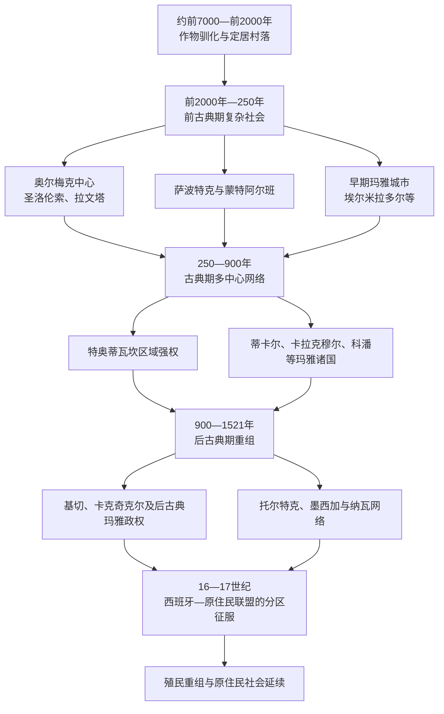

# 中部美洲文明

## 时间

约公元前2000年至16世纪；玛雅、纳瓦、米斯特克、萨波特克及其他原住民族的语言、社区和文化传统延续至今。

## 概括

中部美洲（Mesoamerica）是以玉米农业、城市、市场、历法、文字、球赛和共享宗教观念相互联系的文化历史区，范围覆盖墨西哥中南部、危地马拉、伯利兹以及洪都拉斯和萨尔瓦多西部等地。它不是统一帝国，也不等于由危地马拉至巴拿马组成的地理中美洲。奥尔梅克、萨波特克、特奥蒂瓦坎、玛雅、托尔特克、米斯特克、墨西加和高地玛雅诸国在不同时段并立、竞争和交换，政治中心多次迁移。

“文明兴衰”也不能写成一系列民族整体消失。特奥蒂瓦坎和部分古典玛雅王朝衰退后，人口、技术和宗教传统转入新的城市与地方网络；西班牙攻陷特诺奇蒂特兰后，还用了近两个世纪才征服佩滕伊察等独立政治体。疾病、战争和殖民强制劳动造成巨大人口灾难，但原住民社区、土地制度、语言和历史记忆并未终结。

## 演进图

## 环境、农业与区域网络

中部美洲跨越高原、火山谷地、热带低地、石灰岩半岛和太平洋沿岸，没有一套生态能够自给所有资源。玉米、豆类和南瓜构成重要农业组合，可可、棉花、盐、黑曜石、玉石、羽毛和海产则通过市场、贡赋和远距离商路流动。火山灰土、高地梯田、低地水库与湿地改造等技术因地制宜。

聚落从村庄发展为城市并非只靠农业剩余。统治者通过宗教仪式、历法知识、战争、婚姻、市场监管和公共工程组织劳力；社区则以家户、宗族、地方神祇和共同土地维持自身。大城市的兴起往往依赖广域网络，网络改道、军事失败或生态压力也会削弱中心。

## 主要时期与政治体

| 阶段 / 传统 | 时间 | 形成与统治机制 | 转型或衰退 |
|---|---|---|---|
| 早期农业与村落 | 约前7000—前2000年 | 玉米等作物经历长期驯化，定居与季节流动并存；陶器、家户和地方交换逐步发展。 | 人口增长和区域交换促成更大聚落，但各地进入复杂社会的时间不同。 |
| 奥尔梅克区域中心 | 约前1500—前400年 | 圣洛伦索、拉文塔等依靠河流交通、仪式中心、巨石雕刻和精英网络组织周边。 | 中心先后衰退，可能涉及河道、政治竞争和网络重组；不能简单称作所有后继文明的“母文明”。 |
| 萨波特克与蒙特阿尔班 | 约前500年起 | 瓦哈卡谷地多个社区在山顶城市整合，发展早期文字、历法和军事纪念。 | 古典期后城市权力分散，萨波特克社群延续并同米斯特克诸国竞争。 |
| 特奥蒂瓦坎 | 约前1世纪—6世纪 | 规划城市、金字塔、手工业区和多族群街区构成大型都市；政治可能由王室、议政精英或复合机构统治，尚无定论。 | 约550年前后核心建筑遭焚毁，权力和人口外散；内乱、资源压力和贸易重组可能共同作用。 |
| 前古典与古典玛雅 | 约前1000年—900年 | 城市国家由神圣君主、贵族、书吏和附属中心组成；碑铭记录王位、战争、婚姻和历法。 | 8—10世纪南部低地多座宫廷终止，战争、旱灾、土地压力和统治合法性危机相互叠加；北部和高地中心继续发展。 |
| 托尔特克及史忆中的图拉 | 约9—12世纪 | 图拉是后古典早期中心，军事—宗教图像和贸易影响广泛；后世墨西加把“托尔特克”塑造成文明正统。 | 图拉衰退后人口和权力重组；考古政治体同后世传说中的“托尔特克帝国”不能完全等同。 |
| 后古典玛雅诸国 | 约900—1697年 | 奇琴伊察、玛雅潘、伊察，以及基切、卡克奇克尔等高地王国依靠联盟、商路和贵族宗族。 | 城市联盟分裂并不等于玛雅社会消失；16世纪后分区抵抗，伊察诺赫佩滕至1697年才被攻陷。 |
| 墨西加三方联盟 | 1428—1521年 | 特诺奇蒂特兰、特斯科科和特拉科潘以战争和贡赋支配墨西哥中部，多数附属城保留地方统治者。 | 贡赋敌意、原住民联盟、西班牙武器与围城、天花及补给崩溃共同导致1521年失败。 |
| 中美洲南缘社会 | 各时期并行 | 伦卡、皮皮尔／纳瓦、乔罗特加、尼科亚及更南方奇布查语族社会连接中部美洲、加勒比和哥伦比亚地峡。 | 并非所有地理中美洲都属于中部美洲文化区；殖民征服和疾病改变政治网络，社区仍延续。 |

## 玛雅政治：城邦、王朝与霸权网络

玛雅不是单一帝国。“神圣领主”以特定城市和王朝头衔统治，较强城市可扶立附属王、索取贡赋或把盟友纳入战争网络，却难以建立覆盖整个玛雅地区的常设官僚国家。蒂卡尔和卡拉克穆尔在6—7世纪组织相互竞争的联盟；帕伦克、科潘、基里瓜、卡拉科尔等在不同阶段既依附又自主。

378年，带有中部墨西哥和特奥蒂瓦坎符号的武装集团进入蒂卡尔，旧王去世，新王朝很快建立。事件可能代表征服、外部扶立和本地联盟共同作用，不能只写成“特奥蒂瓦坎殖民”。562年卡拉克穆尔联盟击败蒂卡尔，695年蒂卡尔的哈萨乌·昌·卡维尔反败卡拉克穆尔，显示霸权通过盟国和王朝关系反复转移。

科潘王朝由基尼奇·亚什·库克·莫于426年创立，祭坛 Q 保存16王顺序。第13王扶立的基里瓜君主卡克·蒂利乌·昌·约帕特在738年反叛并将其俘杀，切断科潘地区优势。完整顺序见[科潘王朝君主世系表](/%E4%BA%BA%E6%96%87%E7%A7%91%E5%AD%A6/%E5%8E%86%E5%8F%B2/%E7%BE%8E%E6%B4%B2/%E4%B8%AD%E7%BE%8E%E6%B4%B2/%E7%A7%91%E6%BD%98%E7%8E%8B%E6%9C%9D%E5%90%9B%E4%B8%BB%E4%B8%96%E7%B3%BB%E8%A1%A8.md)。

## 文字、历法与知识制度

- 玛雅文字能够记录语言、日期、王位继承、战争和祭祀，是前哥伦布美洲保存最丰富的本土文字传统；其他地区也出现萨波特克和中部墨西哥的图文系统。
- 260日仪式历与约365日太阳历相互组合，玛雅长纪年用于把王朝事件置于更长宇宙时间。
- 天文观测服务农业、仪式和王权，但不能把建筑方位都解释为精确“天文台”；城市规划同时受地形、祖先建筑和政治展示影响。
- 折页书、碑刻、陶器和口述传统由书吏与祭司维护。殖民时期大量文献被毁，原住民书写者又用拉丁字母记录《波波尔·乌》、地方编年和土地文书。

## 城市、市场与社会结构

城市核心集中王宫、神庙、广场、球场和贵族住宅，外围由农户、工匠和附属聚落构成。统治者以宴饮、祭祀、战争俘虏和公共工程展示互惠能力；普通家户通过农业、织造、陶器、建筑劳役和市场交换支撑体系。奴役、债役和战俘存在，但各政治体的法律与规模不同。

女性不仅是婚姻联盟工具。部分玛雅女性以摄政、共治或独立君主身份出现在铭文中，市场与纺织也赋予女性重要经济角色；现存王碑偏向男性战争和继承叙事，不能代表全部社会。

## 古典期中心转型的原因

### 结构因素

- 南部低地部分地区人口增长和集约农业提高了对旱灾、土壤退化和供应中断的敏感度。
- 宫廷以纪念建筑、战争和贡赋维持合法性，精英竞争加重劳役与资源负担。
- 政治碎片化使城市能够灵活结盟，也让局部战争容易扩展为俘王、断贡和继承危机。

### 外部与环境压力

- 8—10世纪多次严重旱期同城市危机大致重合，但影响因水利、土壤和区域网络而异。
- 蒂卡尔—卡拉克穆尔等霸权竞争和附属城市反叛重排贸易与政治路线。
- 特奥蒂瓦坎衰落、后古典海上贸易兴起等广域变化改变旧中心的中介地位。

### 直接过程

古典宫廷通常不是在同一年“崩溃”。最后纪念碑停止、王宫维护中断、人口向水源或新城市迁移、地方贵族脱离和农村生产调整连续发生。北尤卡坦、高地和沿海城市继续繁荣，因此“玛雅灭亡”是错误说法。

## 西班牙征服的分阶段过程

### 中部墨西哥与原住民联盟

1519年埃尔南·科尔特斯进入墨西哥，先同托托纳克和特拉斯卡拉等反对墨西加贡赋的政治体结盟。1520年西班牙人被逐出特诺奇蒂特兰后重组兵力；天花削弱城市人口和领导层。1521年联盟军队封锁堤道和湖上补给，俘获末代统治者夸乌特莫克。胜利依赖数万原住民盟军，不能归因于少数欧洲人或武器技术单因。

### 高地危地马拉与中美洲北部

1524年佩德罗·德·阿尔瓦拉多率西班牙和中部墨西哥盟军进入危地马拉高地，击败基切王国；卡克奇克尔起初协助进攻敌对政权，随后因贡赋和虐待反抗殖民者。库斯卡特兰、伦卡地区和洪都拉斯的征服经历多轮远征、殖民派系冲突和本地抵抗，并非1524年一次完成。

### 佩滕最后独立政权

低地森林、水网和分散政治使西班牙长期无法控制佩滕。传教、道路和军事远征逐步包围伊察王国；1697年西班牙水陆军攻占诺赫佩滕。该事件终结最后一个主要独立玛雅王国，但地方逃亡、聚落迁移和文化延续仍继续。

## 殖民冲击与原住民延续

疾病在缺乏既往免疫的人群中反复流行，战争、饥荒、迁村、贡赋、强制劳动和出生率下降进一步放大人口损失。殖民者利用既有地方领袖和社区边界建立“原住民共和国”，既便于征税和传教，也给社区保留土地、议事与诉讼空间。天主教仪式、玛雅历法、祖先崇拜和地方圣地形成复杂融合，而非旧宗教简单被新宗教取代。

当代玛雅、萨波特克、米斯特克、纳瓦、伦卡等民族不是考古文明的“遗迹”。他们经历自由派土地私有化、种植园劳工、国家同化、内战和迁移，同时持续争取语言教育、共同土地、考古遗产解释权和政治代表。

## 重要事件

| 时间 | 事件 | 结果与长期影响 |
|---|---|---|
| 约前1500年后 | 圣洛伦索等奥尔梅克中心发展 | 巨石雕刻、仪式和区域交换形成早期复杂社会网络。 |
| 约前500年 | 蒙特阿尔班成长 | 瓦哈卡谷地出现长期城市和书写政治传统。 |
| 1—5世纪 | 特奥蒂瓦坎扩张为大型都市 | 连接高原、湾岸和玛雅地区的贸易与政治网络。 |
| 378年 | 蒂卡尔发生“进入”事件与王朝更替 | 特奥蒂瓦坎符号、外来武装和本地政治重组结合。 |
| 426年 | 科潘王朝建立 | 东南玛雅地区形成延续约四世纪的王朝中心。 |
| 562年 | 卡拉克穆尔联盟击败蒂卡尔 | 玛雅低地霸权转向“蛇王朝”网络。 |
| 约550年前后 | 特奥蒂瓦坎核心遭焚毁并衰退 | 高原权力与人口转入多个后继中心。 |
| 695年 | 蒂卡尔击败卡拉克穆尔 | 蒂卡尔复兴，联盟格局再次改变。 |
| 738年 | 基里瓜俘杀科潘第13王 | 附属城市反叛成功，科潘霸权受创。 |
| 8—10世纪 | 南部低地多座玛雅宫廷终止 | 旱灾、战争、资源和合法性危机叠加；玛雅社会未消失。 |
| 约1200—1450年 | 后古典城市与高地王国重组 | 玛雅潘、基切、卡克奇克尔等新政治中心兴起。 |
| 1428年 | 墨西加三方联盟建立 | 以贡赋和战争形成墨西哥中部霸权。 |
| 1519—1521年 | 特诺奇蒂特兰战争 | 西班牙—原住民联盟摧毁三方联盟核心，殖民国家开始建立。 |
| 1524年 | 高地危地马拉战争 | 基切政权失败，卡克奇克尔从盟友转为反殖民者。 |
| 1537—1539年 | 伦皮拉领导伦卡抵抗 | 洪都拉斯西部征服受阻，最终在战争和殖民推进中失败。 |
| 1542年后 | 新法与殖民行政重组 | 王室试图限制征服者、规范劳役，实际执行反复。 |
| 1697年 | 诺赫佩滕被攻陷 | 最后一个主要独立玛雅王国终结，地方社会继续延续。 |

## 关键辨析

- “中部美洲”是文化历史区；“中美洲”是现代地理陆桥。
- 奥尔梅克对后世影响重大，但不同地区也有自身形成过程，不应写成单一“母文明”扩散。
- 特奥蒂瓦坎居民的主要语言和政体结构尚未确定，不能直接称为托尔特克或墨西加国家。
- 玛雅由多座城市、王朝和语言群组成，古典期宫廷衰退不等于民族消失。
- “阿兹特克”通常指墨西加及其三方联盟；其国家核心在今墨西哥，完整国家通史归入北美墨西哥目录。
- 征服由西班牙人、原住民盟友、敌对政治体、疾病和内部分裂共同完成，不能用技术优势单因解释。

## 演变关系

- 科潘专表：[科潘王朝君主世系表](/%E4%BA%BA%E6%96%87%E7%A7%91%E5%AD%A6/%E5%8E%86%E5%8F%B2/%E7%BE%8E%E6%B4%B2/%E4%B8%AD%E7%BE%8E%E6%B4%B2/%E7%A7%91%E6%BD%98%E7%8E%8B%E6%9C%9D%E5%90%9B%E4%B8%BB%E4%B8%96%E7%B3%BB%E8%A1%A8.md)。
- 后续殖民史：[新西班牙与墨西哥中南部](/%E4%BA%BA%E6%96%87%E7%A7%91%E5%AD%A6/%E5%8E%86%E5%8F%B2/%E7%BE%8E%E6%B4%B2/%E4%B8%AD%E7%BE%8E%E6%B4%B2/%E6%96%B0%E8%A5%BF%E7%8F%AD%E7%89%99%E4%B8%8E%E5%A2%A8%E8%A5%BF%E5%93%A5%E4%B8%AD%E5%8D%97%E9%83%A8.md)。
- 地理中美洲国家形成：[中美洲独立与联邦](/%E4%BA%BA%E6%96%87%E7%A7%91%E5%AD%A6/%E5%8E%86%E5%8F%B2/%E7%BE%8E%E6%B4%B2/%E4%B8%AD%E7%BE%8E%E6%B4%B2/%E4%B8%AD%E7%BE%8E%E6%B4%B2%E7%8B%AC%E7%AB%8B%E4%B8%8E%E8%81%94%E9%82%A6.md)。
- 所属总览：[中美洲与中部美洲](/%E4%BA%BA%E6%96%87%E7%A7%91%E5%AD%A6/%E5%8E%86%E5%8F%B2/%E7%BE%8E%E6%B4%B2/%E4%B8%AD%E7%BE%8E%E6%B4%B2/README.md)。
