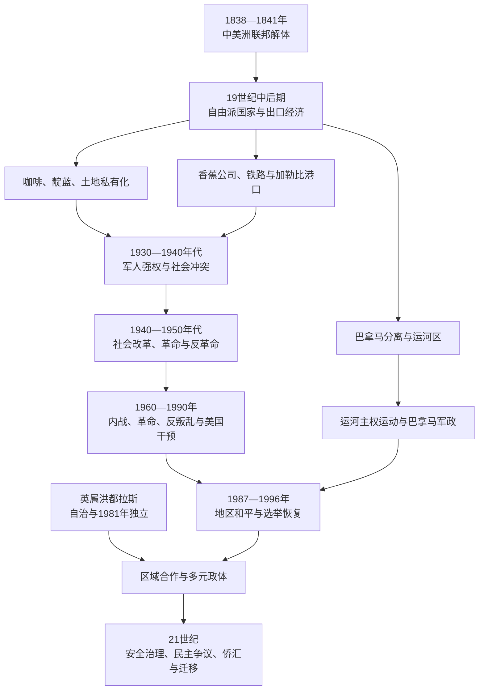

# 当代中美洲与巴拿马

## 时间

19世纪中期至今，重点为出口国家形成、外部干预、革命与内战、和平进程、民主化和区域一体化。当代领导与制度状态核验截至2026年7月14日。

## 概括

地理中美洲包括危地马拉、伯利兹、洪都拉斯、萨尔瓦多、尼加拉瓜、哥斯达黎加和巴拿马。除伯利兹与巴拿马外，另外五国源自中美洲联邦成员州，但联邦解体后的国家并非简单沿殖民省界自然成熟。军人、地方城市、教会、原住民社区、自由派出口精英和外国商人通过战争、宪法、土地改革与铁路建设反复重组国家。

19世纪后期，咖啡、香蕉、靛蓝、糖、矿业和跨洋交通把区域嵌入世界市场。出口收入修建港口、铁路和首都，也让土地与信贷集中，原住民共同地、农民生计和劳工自由受压。美国公司、银行、海军和政府把运河、安全与商业利益结合，尼加拉瓜、洪都拉斯、危地马拉和巴拿马受到尤其直接的干预；“香蕉共和国”概念揭示企业与国家权力结合，却不能抹平各国制度差异。

冷战把本地土地、劳工、族群和国家暴力问题纳入美国—苏联及古巴竞争。危地马拉、萨尔瓦多和尼加拉瓜经历革命、内战或反叛乱战争，洪都拉斯成为地区军事基地；哥斯达黎加维持无常备军的文人宪政，巴拿马围绕运河主权从军政府走向美军入侵后的选举制度，伯利兹则在1981年以英联邦君主国形式独立。1987年《埃斯基普拉斯二号协议》及各国和平安排结束多场战争，但贫困、不平等、犯罪、威权集中、气候灾害和迁移继续塑造区域。

## 演进图

## 19世纪国家形成与出口秩序

联邦瓦解后，各国政府的首要工作不是工业化，而是控制首都、征税、建立军队和获得外国承认。危地马拉的拉斐尔·卡雷拉借农村和教会联盟建立保守秩序；尼加拉瓜的莱昂与格拉纳达长期争权；洪都拉斯和萨尔瓦多军人领袖频繁跨境干预；哥斯达黎加以圣何塞咖啡商和较小军队逐步巩固国家。

1870年代后自由派改革者没收或出售教会与社区土地，登记私人产权，推动劳役法、道路、铁路和出口信贷。政策提高咖啡和香蕉产量，也使危地马拉玛雅村社、萨尔瓦多农民和其他农村社群失地。国家军警保护收获、债务和劳工流动，选举常由地主、军人和首都政治集团控制。

香蕉经济需要大片低地、铁路、港口和疾病防治。联合果品公司、库亚梅尔等企业获得土地、免税和基础设施特许，在洪都拉斯、危地马拉、哥斯达黎加和巴拿马拥有近似公共权力。企业并非全能：工人罢工、地方政府、竞争公司和民族主义会改变合同；铁路和港口也被本地社会转用于迁移与城市化。

## 美国干预与区域权力

| 阶段 | 介入方式 | 地区后果 |
|---|---|---|
| 1855—1857年沃克战争 | 美国冒险家威廉·沃克利用尼加拉瓜内战夺权，恢复奴隶制并谋求英语殖民；中美洲联军将其驱逐。 | 形成共同反外来征服记忆，也显示地方内战会招致私人帝国主义。 |
| 19世纪末—20世纪初 | 美国银行、香蕉公司和铁路资本取得特许，美国海军多次登陆保护侨民与债务利益。 | 洪都拉斯、尼加拉瓜和加勒比港口主权受限，国家财政依赖出口和外国信贷。 |
| 1903—1914年巴拿马运河 | 美国支持巴拿马脱离哥伦比亚，取得运河区近似主权并修建运河。 | 建立全球航运枢纽，也制造贯穿20世纪的主权和种族隔离争议。 |
| 1912—1933年尼加拉瓜占领 | 美国海军陆战队支持保守派政府、监管财政并组织国民警卫队；桑地诺发动游击战。 | 美军撤离后，警卫队成为索摩查家族独裁基础。 |
| 1954年危地马拉政变 | 美国中央情报局支持卡斯蒂略·阿马斯流亡军和心理战，推翻阿本斯政府。 | 土地改革逆转，军队政治和反共镇压加深，成为内战的重要前因。 |
| 1980年代冷战介入 | 美国大规模援助萨尔瓦多政府、利用洪都拉斯基地支持尼加拉瓜反政府武装，并向危地马拉施压或提供不同形式支持。古巴和苏联集团支持桑地诺等左翼力量。 | 本地战争国际化，军援延长冲突；外交压力和援助条件后来也推动选举与和平谈判。 |
| 1989年入侵巴拿马 | 美国以保护侨民、运河条约、打击贩毒和恢复选举结果为由发动“正义事业行动”。 | 诺列加政权垮台，平民伤亡数字存在争议；巴拿马恢复文人选举但主权创伤延续。 |

## 危地马拉

### 咖啡国家、革命与1954年政变

1871年自由派革命后，胡斯托·鲁菲诺·巴里奥斯政府推动咖啡、铁路和世俗化，废除或私有化大量共同土地，并通过债役和流动证件迫使农村劳工进入庄园。原住民市镇保留部分共同体组织，却在土地、税役和国家同化中承受不成比例压力。

豪尔赫·乌维科1931—1944年独裁依赖军队、地方行政长官和劳役法维持出口秩序。1944年教师、学生、军官和城市中产推翻其继承政权，开启“十月革命”。胡安·何塞·阿雷瓦洛政府制定劳动法和社会保障；哈科沃·阿本斯1952年第900号法令征收未耕大地产并补偿后分配，联合果品公司成为最大受影响者之一。

美国政府把土地改革、共产党参与和冷战安全联系起来，1954年以流亡军、广播和外交压力迫使军方抛弃阿本斯。卡斯蒂略·阿马斯废除改革并镇压左翼。政变不是后来内战的唯一原因，却打断合法改革渠道，使军队、地主和反共安全机关长期支配政治。

### 内战、种族灭绝与和平

1960年军官叛乱后形成游击运动，战争逐步扩展至农村。1970年代末至1980年代初，军政府以“焦土”战略摧毁被视为游击队基础的玛雅村庄。1982—1983年埃弗拉因·里奥斯·蒙特时期，伊希尔等玛雅社群遭大规模屠杀、强迫迁移和饥饿；真相委员会认定国家在特定地区实施种族灭绝行为。

1985年宪法恢复文人总统，但军队仍控制战争与安全。1996年政府和危地马拉全国革命团结组织签署和平协议，承诺原住民权利、军队改革、土地与社会政策。协议结束战争，却因税收低、地主阻力、司法薄弱和军政网络延续而执行不全。

2007—2019年联合国支持的危地马拉反有罪不罚国际委员会协助侦办高层腐败，2015年案件引发总统奥托·佩雷斯·莫利纳辞职。机构也触发政治反弹，最终被终止。2023年贝尔纳多·阿雷瓦洛以反腐纲领当选，检察机关和国会势力试图暂停其政党并阻挠权力交接；国内动员和国际压力保障其于2024年1月就任。到2026年，政府继续推进司法与反腐改革，但受国会联盟、法院、官僚和既有经济政治网络制约。

### 关键事件

| 时间 | 事件 | 影响 |
|---|---|---|
| 1871年 | 自由派革命 | 咖啡出口和国家集权加速，社区土地与劳工自主受压。 |
| 1944年 | 十月革命 | 结束乌维科体系，开启十年社会民主改革。 |
| 1952年 | 第900号土地改革 | 重新分配未耕大地产，激化地主、联合果品公司与美国反对。 |
| 1954年 | 美国支持政变 | 阿本斯下台，改革逆转并开启长期反共政权。 |
| 1960—1996年 | 武装冲突 | 约二十万人死亡或失踪，原住民平民承受最严重暴力。 |
| 1982—1983年 | 焦土行动和玛雅屠杀 | 国家暴力达到高峰，后来成为种族灭绝审判核心。 |
| 1985年 | 新宪法和文人总统 | 恢复选举制度，军方影响并未立即消失。 |
| 1996年 | 和平协议 | 正式结束内战，结构改革执行不完整。 |
| 2015年 | 反腐示威与总统辞职 | 公民动员和国际调查机构短期突破有罪不罚。 |
| 2023—2024年 | 阿雷瓦洛当选及艰难就职 | 反腐授权同司法—政治阻挠公开对抗。 |

## 萨尔瓦多

### 咖啡寡头、军人政治与内战

19世纪末，政府废除共同地制度、扩张咖啡庄园，少数家族与出口商控制土地、银行和国家。1931年马克西米利亚诺·埃尔南德斯·马丁内斯将军掌权；1932年西部农民和共产党人起义后，军队及地方武装杀害成千上万居民，原住民身份与语言公共表达受到长期压制。“大屠杀”确立军人—咖啡精英秩序。

1969年同洪都拉斯的战争常被称为“足球战争”，实际原因包括萨尔瓦多人口和土地压力、在洪都拉斯定居者被驱逐、贸易与边界争议。战争使中美洲共同市场受挫，回流人口加剧本国农村矛盾。

1970年代选举舞弊、土地集中、工会和教会基层动员同右翼死亡小组暴力升级。1979年军人政变未能控制局势；1980年大主教奥斯卡·罗梅罗遇刺和反对派组建法拉本多·马蒂民族解放阵线，战争全面化。政府军、安全机关、右翼武装和游击队都实施暴力，国家及其盟友造成多数记录在案的严重侵犯；1981年埃尔莫索特屠杀成为象征。美国以反共为由提供大规模军援和训练。

### 和平、帮派与布克尔时代

1992年《查普尔特佩克和平协议》重组军队、成立文职警察、改革选举机构并让民族解放阵线转为政党。随后民族主义共和联盟与民族解放阵线通过选举轮替。私有化、2001年美元化和侨汇稳定宏观经济，却未充分创造就业；美国大规模遣返帮派成员、城市排斥、家庭分离和监狱政策共同推动 MS-13 与第18街帮派扩张。

纳伊布·布克尔2019年打破两大传统党轮替。2022年3月一轮凶杀激增后，政府实施紧急状态，大规模逮捕并修建巨型监狱；凶杀率显著下降，居民安全感提高，同时长期无审判拘押、误捕、狱中死亡和司法独立引发争议。2024年布克尔依据2021年宪法法院解释获得连任，反对者认为违反此前禁止立即连任的宪法条文。

2025年立法议会修宪，允许总统无限次连任、把未来任期由五年延至六年并取消第二轮投票；过渡条款把布克尔当前任期缩短至2027年，以同其他全国选举同步。截至2026年7月，布克尔与副总统费利克斯·乌略亚在任，执政党新思想掌握压倒性议会优势，安全成效与权力制衡弱化并存。

### 关键事件

| 时间 | 事件 | 影响 |
|---|---|---|
| 1881—1882年 | 共同地制度废除 | 咖啡庄园和土地集中加速。 |
| 1932年 | 农民起义与“大屠杀” | 军事镇压造成大规模死亡，原住民公共身份受压。 |
| 1969年 | 同洪都拉斯战争 | 移民、土地和区域贸易矛盾军事化。 |
| 1980年 | 罗梅罗遇刺、内战全面化 | 改革中间道路崩溃，冲突国际化。 |
| 1981年 | 埃尔莫索特屠杀 | 国家反叛乱暴力的代表性罪行。 |
| 1992年 | 和平协议 | 游击队转为政党，军队和警察制度重组。 |
| 2001年 | 美元化 | 降低汇率风险，也限制独立货币政策。 |
| 2009年 | 民族解放阵线赢得总统选举 | 前游击组织首次执政。 |
| 2019年 | 布克尔当选 | 两大和平协议党系主导结束。 |
| 2022年起 | 紧急状态和大规模拘押 | 凶杀锐减，法治和人权争议扩大。 |
| 2024年 | 布克尔连任 | 即时连任从法院解释转为政治既成事实。 |
| 2025年 | 无限连任修宪 | 总统任期和选举制度重构，行政集中进一步制度化。 |

## 洪都拉斯

### 香蕉特许、军政与冷战基地

20世纪初，政府向美国香蕉公司授予土地、铁路和税收特权，北部加勒比岸形成由公司、地方军阀和港口城市组成的政治经济。美国海军多次登陆并调停债务和内战。蒂武西奥·卡里亚斯·安迪诺1933—1949年长期执政，以军警、宪法延任和同企业合作稳定国家，同时压制反对派。

1954年香蕉工人大罢工迫使企业和政府承认劳工权利，成为现代工会与社会立法转折。1963年军方推翻改革派总统拉蒙·比列达·莫拉莱斯，军事统治延续。1969年同萨尔瓦多的战争源于移民、土地改革、边界和共同市场争端，足球赛只是动员背景。

1980年代洪都拉斯恢复选举政府，却成为美国支持尼加拉瓜反政府武装和萨尔瓦多政府的基地。军方情报单位实施失踪与酷刑，文人政府的正式权力受军事与美国安全政策限制。1998年飓风米奇造成全国性破坏，暴露基础设施、土地和贫困风险。

### 2009年政变与2026年权力交接

2009年，总统曼努埃尔·塞拉亚推动就召开制宪议题举行非约束性民意咨询，最高法院、国会和军方称其违法。军队将塞拉亚逐出国境，国会任命罗伯托·米切莱蒂；国际社会普遍把事件视为政变。此后选举恢复，但政治极化、腐败、暴力和安全机关问题延续。

胡安·奥兰多·埃尔南德斯2014—2022年执政，通过法院解释获得连任，2017年选举引发严重争议；卸任后被引渡美国并因贩毒相关罪名定罪，凸显国家与犯罪网络渗透。希奥玛拉·卡斯特罗2022年成为首位女总统，承诺“重建”国家，却受国会碎片化、能源财政和安全问题制约。

2025年选举后，国民党的纳斯里·胡安·阿斯富拉·萨布拉于2026年1月就任总统，任期至2030年。洪都拉斯为总统制共和国，总统兼国家元首和政府首脑，没有总理；国会、最高法院、检察机关、军方、地方市镇和企业网络分别构成制约或合作力量。

### 关键事件

| 时间 | 事件 | 影响 |
|---|---|---|
| 1900年代起 | 香蕉公司取得大规模特许 | 铁路和出口发展同企业政治影响结合。 |
| 1933—1949年 | 卡里亚斯长期统治 | 结束部分军阀混战，形成威权稳定。 |
| 1954年 | 香蕉工人大罢工 | 劳工组织和社会立法取得突破。 |
| 1963年 | 军事政变 | 文人改革中断，军方长期主导。 |
| 1969年 | 同萨尔瓦多战争 | 移民和土地矛盾爆发，共同市场受损。 |
| 1980年代 | 美国反共军事基地 | 选举政府与军方—安全机关双重权力并存。 |
| 1998年 | 飓风米奇 | 基础设施和农业严重破坏，迁移增加。 |
| 2009年 | 塞拉亚被军方驱逐 | 宪制争议以政变解决，政治极化加深。 |
| 2017年 | 争议性总统选举 | 连任、计票和镇压削弱制度信任。 |
| 2022年 | 卡斯特罗就任 | 首位女总统和政党重组。 |
| 2026年 | 阿斯富拉就任 | 国民党重返行政权，开启2026—2030年任期。 |

## 尼加拉瓜

### 美国占领、桑地诺与索摩查王朝

尼加拉瓜独立后莱昂自由派与格拉纳达保守派竞争不断。1855年自由派邀请威廉·沃克参战，沃克夺取总统职位并恢复奴隶制；中美洲联军和本地反对者于1857年将其驱逐。19世纪末何塞·桑托斯·塞拉亚发展国家和加勒比岸控制，却在美国压力下于1909年下台。

美国海军陆战队1912—1933年长期驻扎，控制财政并支持保守派。1927年多数派别接受美国调停，奥古斯托·塞萨尔·桑地诺拒绝缴械，在北部发动游击战。美军撤离后，由美国训练的国民警卫队首脑阿纳斯塔西奥·索摩查·加西亚于1934年策划杀害桑地诺，1936年夺取总统权。

索摩查家族通过国民警卫队、自由党、企业和美国支持统治至1979年。1972年马那瓜地震后的救援腐败、土地集中、反对派记者佩德罗·华金·查莫罗1978年遇刺及全国罢工，使商界、教会、学生和桑地诺民族解放阵线形成反独裁联盟。

### 革命、反政府战争与选举转型

1979年桑地诺革命推翻索摩查。新政府开展扫盲、医疗和土地改革，并实行混合经济；政治多元和新闻空间逐渐受战争与党国建设限制。美国里根政府资助反政府武装，尼加拉瓜实施征兵并得到古巴、苏联集团援助。战争、禁运、通胀和双方侵犯人权造成严重损失；美国支持反政府武装及港口布雷还引发国际法院案件。

1984年丹尼尔·奥尔特加在反对党参与不完整、战争持续的选举中当选。1987年《埃斯基普拉斯二号协议》推动停火、特赦和选举；1990年维奥莱塔·查莫罗领导的反对派联盟胜选，桑地诺和平移交政府。解除武装、军队改革、财产归属和经济紧缩在此后多年引发冲突。

### 奥尔特加回归与共同总统制

1990—2006年自由派政府实行市场改革，民主选举持续，但腐败、贫困与党派交易削弱制度。奥尔特加同阿诺尔多·阿莱曼达成政治协议，降低胜选门槛并分享司法、选举机关职位；2007年奥尔特加重新执政，随后通过法院解释和宪法改革取消连任限制，执政党、警察和国家机构逐步集中。

2018年社会保险改革触发全国抗议，警察、亲政府武装和反对派冲突造成大量死亡。政府关闭组织与媒体、逮捕或驱逐反对者，许多人流亡；2021年选举前主要潜在候选人被拘押，国际社会广泛质疑竞争条件。

2025年宪法改革把总统任期延至六年，并设一名男性和一名女性共同总统；丹尼尔·奥尔特加与其妻、原副总统罗萨里奥·穆里略成为首任共同总统，现任期延至2028年。改革把国家权力更明确集中于共同总统并弱化立法、司法和自治机关独立性。截至2026年7月，两人仍共同担任国家元首和政府首脑，反对派、教会、大学、非政府组织与法律界继续受到打压。

### 关键事件

| 时间 | 事件 | 影响 |
|---|---|---|
| 1855—1857年 | 沃克夺权与中美洲战争 | 外来私人征服失败，强化地区共同防卫记忆。 |
| 1912—1933年 | 美国军事占领 | 财政、安全和政党秩序受美国直接塑造。 |
| 1927—1934年 | 桑地诺战争及遇刺 | 反占领民族主义成为桑地诺运动核心记忆。 |
| 1936—1979年 | 索摩查家族统治 | 国民警卫队、家族企业和美国联盟构成世袭独裁。 |
| 1972年 | 马那瓜地震 | 灾害与救援腐败削弱政权合法性。 |
| 1979年 | 桑地诺革命 | 独裁覆亡，社会改革和新一轮国家集中同时开始。 |
| 1981—1990年 | 反政府战争 | 冷战国际化、经济崩溃和大规模伤亡。 |
| 1990年 | 查莫罗胜选 | 桑地诺和平交权，进入选举和解除武装转型。 |
| 2007年 | 奥尔特加重返总统职位 | 逐步取消连任限制并集中国家机构。 |
| 2018年 | 抗议与镇压 | 政权转向更全面的警察、司法和流亡控制。 |
| 2021年 | 主要反对者被拘押后的选举 | 竞争性选举和国际承认危机加深。 |
| 2025年 | 共同总统制宪法改革 | 奥尔特加—穆里略双首脑和行政集权制度化。 |

## 哥斯达黎加

### 咖啡、社会改革与1948年内战

哥斯达黎加19世纪以咖啡出口和圣何塞商人国家发展，军队规模小于邻国。19世纪末加勒比铁路和香蕉种植吸引牙买加及其他非洲加勒比劳工，形成利蒙地区独特社会；国家对黑人居民迁徙、公民权和西班牙语同化曾有歧视限制。

1940年代，拉斐尔·安赫尔·卡尔德龙·瓜迪亚政府同天主教会和共产党合作，建立社会保险、劳动法和“社会保障”宪制。1948年总统选举结果被国会取消，何塞·菲格雷斯领导民族解放军击败政府，约六周内战结束。胜利者军政府保留多数社会改革，废除常备军、国有化银行、扩大选举权，并召开制宪会议；1949年宪法确立文人共和国和独立选举机关。

### 文人民主、经济转型与2026年政府

此后民族解放党及其对手通过选举轮替，教育、医疗、电力和自治机构扩大。无常备军并不等于没有警察或安全冲突，但把财政与政治资源从军队政变中移开。1980年代债务危机迫使结构调整，国家从咖啡、香蕉进一步转向旅游、电子、医疗器械和服务业，社会保障仍在财政和不平等压力下维持。

总统奥斯卡·阿里亚斯推动1987年中美洲和平方案。2007年加入美国—中美洲—多米尼加自由贸易协定的公投以微弱多数通过，显示贸易开放和公共垄断争议。2022年罗德里戈·查韦斯以反建制姿态当选，同国会、审计和司法机关频繁冲突。

劳拉·费尔南德斯·德尔加多在2026年选举获胜，5月8日就任总统，为该国第二位女总统。前总统查韦斯进入其政府担任总统府部长并兼财政部长，形成前任在新政府中保持显著影响的罕见安排。截至核验日，总统兼国家元首和政府首脑；立法议会、最高选举法院、宪法法庭、审计机关和自治机构构成制度制衡。

### 关键事件

| 时间 | 事件 | 影响 |
|---|---|---|
| 1856—1857年 | 对沃克战争 | 全国动员和胡安·圣玛丽亚记忆强化国家认同。 |
| 1870—1890年代 | 铁路与香蕉经济 | 加勒比地区、非洲侨民和外国资本进入国家主线。 |
| 1941—1943年 | 社会保险与劳动法 | 建立福利国家核心制度。 |
| 1948年 | 选举危机和内战 | 菲格雷斯取胜，旧军队和政治秩序被重构。 |
| 1949年 | 新宪法 | 废除常备军，确立独立选举机构与文人统治。 |
| 1980年代 | 债务危机与经济调整 | 出口与服务业多元化，社会不平等压力上升。 |
| 1987年 | 阿里亚斯和平计划 | 推动地区谈判并强化哥斯达黎加外交角色。 |
| 2007年 | 自贸协定公投 | 贸易开放首次通过全国公投决定。 |
| 2022年 | 查韦斯当选 | 传统党系进一步弱化，行政与监督机构冲突增加。 |
| 2026年 | 劳拉·费尔南德斯就任 | 第二位女总统执政，延续查韦斯政治路线。 |

## 巴拿马

### 从哥伦比亚地峡到运河共和国

巴拿马1821年脱离西班牙后加入大哥伦比亚，随后作为新格拉纳达／哥伦比亚的一部分，多次出现自治和分离尝试。1855年跨地峡铁路开通，加利福尼亚淘金和全球航运使地峡价值上升。法国公司1881年开凿运河，因疾病、工程选择、腐败和融资崩溃失败。

哥伦比亚参议院1903年拒绝美哥运河条约后，巴拿马分离主义者发动行动，美国军舰阻止哥伦比亚军队有效干预。新国家同法国工程利益代表菲利普·比诺—瓦里利亚签约，给予美国永久控制运河区的广泛权利。巴拿马获得独立和运河收入，却在领土中心形成由外国管治、种族隔离和美军保护的带状区域。

美国1904—1914年完成运河。国家政治由商业家族、自由党—保守党和美国干预共同塑造；美国多次在选举或骚乱中出兵。1941年阿努尔福·阿里亚斯被政变推翻，军警影响上升。

### 军政府、运河条约与入侵

1964年巴拿马学生试图在运河区升旗，引发冲突和多人死亡，“烈士日”使废除旧运河安排成为全民诉求。1968年国民警卫队推翻阿里亚斯，奥马尔·托里霍斯随后成为实际最高领导人。其政府实行民族主义、社会与土地政策，并同美国总统卡特于1977年签署两项条约，规定1999年运河移交及永久中立。

托里霍斯1981年空难去世后，曼努埃尔·诺列加逐步控制军队、情报和政治。1989年选举结果被取消、同美国冲突及贩毒指控升级，美国12月入侵并扶持胜选反对派政府。诺列加被捕；军事政权终结，但入侵造成的平民死亡和社区破坏数量至今有争议。

### 民主、运河移交与当代挑战

1990年代政府废除军队，以警察和边境机关承担安全。1999年12月31日巴拿马收回运河和原运河区，巴拿马运河管理局以宪法自治机构运营。2016年扩建船闸开放，使更大型船舶通航；2023—2024年严重干旱迫使减少过船量，显示运河收入、城市供水和气候变化争夺同一流域水源。

达连隘口在2020年代成为南北美洲不规则迁移主要路线之一，人道救援、走私犯罪、边境执法和美国移民政策共同改变流量。何塞·劳尔·穆利诺2024年7月1日就任总统，截至2026年7月仍在任。巴拿马没有总理，总统兼国家元首与政府首脑；穆利诺因2024年候选替换的特殊过程没有同时当选的副总统，继任需依宪法和政府职位规则处理。国家议会、最高法院、选举法院和自治运河管理局分别限制行政权。

### 关键事件

| 时间 | 事件 | 影响 |
|---|---|---|
| 1821年 | 脱离西班牙并加入大哥伦比亚 | 巴拿马国家形成首先嵌入南美共和国。 |
| 1855年 | 跨地峡铁路开通 | 地峡成为全球人员和货物流动枢纽。 |
| 1881—1889年 | 法国运河工程失败 | 工程、疾病和金融危机为美国接手创造条件。 |
| 1903年 | 脱离哥伦比亚 | 美国支持保障分离，新国家主权同运河特许捆绑。 |
| 1914年 | 巴拿马运河通航 | 全球航运重组，运河区不平等制度固化。 |
| 1964年 | 国旗骚乱 | 运河主权成为不可逆外交议程。 |
| 1968年 | 国民警卫队政变 | 文人寡头秩序转为军政府。 |
| 1977年 | 托里霍斯—卡特条约 | 确定1999年移交和中立制度。 |
| 1989年 | 美国入侵 | 诺列加政权终结，文人选举恢复并留下主权与伤亡争议。 |
| 1999年 | 运河完整移交 | 巴拿马取得核心资产和区域主权。 |
| 2016年 | 扩建运河开放 | 提高大型船舶能力并扩大服务经济。 |
| 2023—2024年 | 干旱限制通航 | 水资源成为运河与居民共同的战略约束。 |
| 2024年 | 穆利诺就任 | 新政府处理运河、社保、矿业和迁移多重压力。 |

## 伯利兹

### 英国伐木殖民与社会形成

17世纪英国“湾民”在西班牙名义领土上砍伐染料木，后来转向桃花心木。英国同西班牙条约只承认有限采伐和居住权，并未立即建立殖民主权；定居者却以自己的公共会议和习惯法治理。大量非洲人被奴役从事砍伐、运输和家内劳动，奴隶制1834年废除后，土地与商贸仍由少数公司和精英控制。

1798年圣乔治礁战役后西班牙未再试图驱逐定居点。19世纪尤卡坦“种姓战争”推动玛雅、尤卡坦梅斯蒂索和商人迁入北部，南部则有加里富纳社群。1862年英国正式宣布英属洪都拉斯殖民地，1871年改为王室殖民地；玛雅社区在土地、税费和殖民扩张中多次抵抗。

### 民族运动、独立与领土争议

1949年殖民当局使货币贬值，加深工人与中产对外部决定不满。乔治·普赖斯等建立人民委员会和人民统一党，以普选、工会和反殖民谈判推动自治。1964年英属洪都拉斯获得内部自治，普赖斯成为总理；1973年正式改名伯利兹。

危地马拉以继承西班牙主权和1859年英危条约争议提出领土要求，英国因安全问题延后独立。1981年9月21日伯利兹独立并保留英军防卫；危地马拉到1991年才承认其国家。两国在美洲国家组织主持下建立邻接区信任措施，并经各自公投把领土、岛屿和海洋争端提交国际法院。截至2026年7月，案件仍在审理，两国重申接受和平和法院裁决。

### 当代政体

伯利兹是英联邦王国。查尔斯三世为国家元首，由总督弗罗伊拉·察拉姆在国内代表；总督主要依总理和内阁建议履行宪制职能。约翰·布里塞尼奥自2020年任总理，人民统一党在2025年选举后继续执政。众议院多数决定政府，参议院包含政府、反对派及社会团体建议的任命成员；司法终审属于加勒比法院。

伯利兹人口包括克里奥尔、梅斯蒂索、玛雅、加里富纳、门诺派及其他社群，英语为官方语言，克里奥尔语、西班牙语和玛雅语言广泛使用。国家同时属于中美洲一体化体系和加勒比共同体，历史身份具有双重区域性。

### 关键事件

| 时间 | 事件 | 影响 |
|---|---|---|
| 17世纪后期 | 英国伐木定居形成 | 名义西班牙主权与英国实际控制分离。 |
| 1798年 | 圣乔治礁战役 | 英国定居点免于西班牙驱逐，成为国家纪念核心。 |
| 1834年 | 奴隶制废除 | 法律奴役终结，土地和经济权力不平等延续。 |
| 1862—1871年 | 英属洪都拉斯及王室殖民地建立 | 英国直接殖民行政制度化。 |
| 1950年 | 人民委员会和民族主义动员 | 普选、劳工和自治运动进入大众政治。 |
| 1964年 | 内部自治 | 本地内阁掌握多数国内事务。 |
| 1973年 | 改名伯利兹 | 国家认同与独立外交进一步确立。 |
| 1981年 | 独立 | 建立英联邦君主制国家，领土争议未解。 |
| 1991年 | 危地马拉承认伯利兹 | 正式国家关系建立，边界主张仍继续。 |
| 2018—2019年 | 两国公投同意提交国际法院 | 领土争端转入司法解决。 |
| 2025年 | 布里塞尼奥政府赢得连任 | 人民统一党继续执政。 |
| 2026年 | 两国重申和平解决和接受国际法院程序 | 邻接区风险仍在，外交管控持续。 |

## 地区和平进程

1970年代末中美洲战争升级后，墨西哥、哥伦比亚、委内瑞拉和巴拿马于1983年组成孔塔多拉集团，提出停止外部军援、民主化和安全保证。美国、尼加拉瓜政府、反政府武装与各国安全利益差异使早期协议未能完成，但建立了地区谈判语言。

1987年，哥斯达黎加总统奥斯卡·阿里亚斯推动五国签署《埃斯基普拉斯二号协议》，要求停火、特赦、民主选举、停止援助非正规武装和国家和解。协议没有立即结束战争，却使冲突合法性从军事胜利转向可核验政治过程。

| 国家 | 关键和平安排 | 结果与未决问题 |
|---|---|---|
| 尼加拉瓜 | 1988年萨波阿停火、1990年选举与反政府武装解除 | 战争结束，财产、退伍军人和武装再起问题持续；2007年后民主倒退。 |
| 萨尔瓦多 | 1992年《查普尔特佩克和平协议》 | 军队、警察和选举改革完成较多，经济不平等、帮派与历史问责延续。 |
| 危地马拉 | 1996年和平协议 | 正式终战并承认原住民权利议程，土地、税收、军政网络与司法改革不足。 |
| 洪都拉斯 | 无同等规模内战，1980年代逐步恢复文人选举 | 失踪、军方问责和作为外部战争基地的遗产未充分解决。 |
| 哥斯达黎加、巴拿马、伯利兹 | 主要作为斡旋者、邻国或不同安全路径 | 地区战争仍通过难民、贸易、边界和美国政策影响国内。 |

## 区域一体化、经济与迁移

1951年中美洲国家组织和1960年中美洲共同市场试图扩大工业与区内贸易；1969年战争和各国保护主义使整合受挫。1991年中美洲一体化体系把和平、民主、经济、灾害和安全合作纳入共同框架，成员范围后来包括伯利兹、巴拿马和多米尼加等。中美洲议会和中美洲法院并不对所有国家以同等方式生效，区域机构仍依赖成员政府。

美国—中美洲—多米尼加自由贸易协定扩大纺织、农产品和投资联系。哥斯达黎加与巴拿马发展高附加值服务和物流，危地马拉、萨尔瓦多、洪都拉斯和尼加拉瓜更依赖服装加工、农业、侨汇和对美市场；伯利兹依赖旅游、农业与加勒比联系。增长成果受税收能力、教育、基础设施和土地分配影响。

内战和经济调整已推动大规模移民，帮派暴力、家庭网络和美国遣返政策又形成跨境社会。2014年未成年人迁移、2018年后“移民大篷车”及2020年代达连路线使人道、庇护和边境执法成为区域议题。侨汇降低家庭贫困，也让国家受到美国就业和移民政策波动影响。

1998年飓风米奇、2020年飓风埃塔和约塔、火山地震及“干旱走廊”的降雨异常表明灾害不是纯自然事件。住房位置、毁林、农业信贷、公共应急能力和土地不平等决定谁最容易流离失所。

## 现行国家元首

| 国家 | 国家元首 | 任期 / 就任 | 宪制说明 |
|---|---|---|---|
| 危地马拉 | 总统贝尔纳多·阿雷瓦洛 | 2024年1月14日就任，任期至2028年 | 总统制；总统同时领导政府，不得立即连任。 |
| 萨尔瓦多 | 总统纳伊布·布克尔 | 2019年起任，2024年开始第二任期；过渡修宪后当前任期至2027年 | 2025年修宪允许无限连任并把未来任期延至六年。 |
| 洪都拉斯 | 总统纳斯里·胡安·阿斯富拉·萨布拉 | 2026年1月就任，任期至2030年 | 总统制；以总统指定人制度处理副手与继任，没有总理。 |
| 尼加拉瓜 | 共同总统丹尼尔·奥尔特加、罗萨里奥·穆里略 | 2025年宪法改革确立共同总统；现任期延至2028年 | 两人共同担任国家元首；实际权力高度集中于总统家庭、执政党和安全机关。 |
| 哥斯达黎加 | 总统劳拉·费尔南德斯·德尔加多 | 2026年5月8日就任，任期至2030年 | 总统制；无常备军，独立选举与司法机关权力较强。 |
| 巴拿马 | 总统何塞·劳尔·穆利诺 | 2024年7月1日就任，任期至2029年 | 总统制；2024年特殊候选替换使本届无同时当选副总统。 |
| 伯利兹 | 国王查尔斯三世；国内由总督弗罗伊拉·察拉姆代表 | 国王2022年即位；总督2021年5月就任 | 英联邦君主国；国家元首与政府首脑分立，总督通常按总理建议行事。 |

## 现行政府首脑

| 国家 | 政府首脑 | 就任 | 实际行政结构 |
|---|---|---|---|
| 危地马拉 | 总统贝尔纳多·阿雷瓦洛 | 2024年1月 | 总统与内阁领导行政；国会碎片化、司法和检察机关具有独立权力来源。 |
| 萨尔瓦多 | 总统纳伊布·布克尔 | 2019年6月 | 总统、内阁和新思想党议会多数主导；紧急状态扩大警察、军队和监狱体系作用。 |
| 洪都拉斯 | 总统纳斯里·阿斯富拉 | 2026年1月 | 总统领导内阁；国会、最高法院、军方、市镇和经济集团影响政策。 |
| 尼加拉瓜 | 共同总统丹尼尔·奥尔特加、罗萨里奥·穆里略 | 2025年共同总统制生效 | 共同总统直接统摄行政并支配多数国家机关，没有总理。 |
| 哥斯达黎加 | 总统劳拉·费尔南德斯 | 2026年5月 | 总统与部长组成政府委员会；前总统查韦斯任总统府部长兼财政部长，保持显著影响。 |
| 巴拿马 | 总统何塞·劳尔·穆利诺 | 2024年7月 | 总统和内阁领导政府；运河管理局拥有宪法与法律保障的专业自治。 |
| 伯利兹 | 总理约翰·布里塞尼奥 | 2020年11月起，2025年选举后续任 | 众议院多数党领袖领导内阁，是实际行政核心；总督承担正式任命与批准。 |

## 实际权力结构比较

| 国家 | 制度中心 | 非正式或并行力量 | 主要制约与风险 |
|---|---|---|---|
| 危地马拉 | 总统、国会、宪法法院、最高法院与检察机关 | 商业协会、地方市长、军政网络、原住民组织和有组织犯罪 | 反腐改革同司法任命、国会联盟和既有网络对抗。 |
| 萨尔瓦多 | 总统及执政党控制的议会、警察与军队 | 总统个人政治品牌、侨民和安全治理支持 | 凶杀下降提高合法性，长期紧急状态、无限连任和司法弱化降低制衡。 |
| 洪都拉斯 | 总统、国会、法院、检察机关和军方 | 企业家族、地方政治、毒品网络和美国安全合作 | 政党碎片化、腐败、暴力和司法能力削弱公共信任。 |
| 尼加拉瓜 | 共同总统、桑地诺民族解放阵线、警察与军队 | 奥尔特加—穆里略家族及党国社会组织 | 立法、司法、选举、大学和地方自治被行政集中，反对派空间极小。 |
| 哥斯达黎加 | 总统、57席立法议会、司法、最高选举法院与自治机构 | 商会、工会、公共机构和环境运动 | 分权能阻止行政垄断，也使财政、治安和改革谈判缓慢。 |
| 巴拿马 | 总统、国民议会、法院、选举法院 | 运河管理局、银行物流集团、工会和地方社群 | 运河与服务收入强，腐败、社保、矿业、供水和达连治理引发冲突。 |
| 伯利兹 | 总理和内阁、众议院、参议院、总督及加勒比法院 | 工会、教会、商会、玛雅土地组织和两大党 | 小国财政、气候灾害、土地权和危地马拉争端影响治理。 |

## 区域国家韧性与持续危机的原因

### 国家建设与韧性来源

- 出口、运河、旅游、侨汇和物流为各国提供不同财政与外汇基础；区域并非单一贫困经济。
- 市镇、教会、原住民社区、工会和侨民网络在中央政府薄弱时维持社会服务与政治参与。
- 和平协议把军队、游击队和选举竞争重新制度化，萨尔瓦多和危地马拉避免重返全面内战。
- 哥斯达黎加无军队宪政、巴拿马专业运河管理和伯利兹议会制度展示不同的制度积累路径。
- SICA、区域贸易、灾害协调和跨境基础设施降低部分小国规模限制。

### 结构性危机

- 土地和财富高度集中、税收偏低及非正规就业限制普遍公共服务。
- 出口和侨汇依赖使经济易受美国需求、商品价格、利率、气候与移民政策影响。
- 内战、军政和有罪不罚遗产削弱司法，安全机关、企业、政党和犯罪网络可能互相渗透。
- 年轻人口、城市边缘化和美国遣返同武器、毒品路线结合，推动帮派与有组织犯罪。
- 原住民和非洲后裔社群在土地、语言和代表权上仍面对历史不平等。

### 外部与环境压力

- 美国是最重要贸易、侨汇、安全和移民政策来源，其援助与制裁既能支持制度，也能扩大权力不对称。
- 全球毒品需求和地峡位置使区域成为运输路线，单纯军事化常把网络转移到邻国。
- 飓风、旱灾、地震、火山和运河水位同贫困、毁林和脆弱住房叠加。
- 中国台湾与中华人民共和国的外交竞争、跨国矿业和基础设施投资带来新资金与地缘选择。

### 直接触发因素

1954年危地马拉政变、1969年萨洪战争、1972年尼加拉瓜地震救援腐败、1979年桑地诺革命、1980年代冷战军援、1989年巴拿马入侵、2009年洪都拉斯政变、2018年尼加拉瓜社保抗议、2022年萨尔瓦多凶杀激增和2023年巴拿马矿业抗议等事件，把长期结构矛盾推入新阶段，但不能单独解释各国差异。

## 区域重要事件

| 时间 | 事件 | 区域意义 |
|---|---|---|
| 1855—1857年 | 中美洲联军击败威廉·沃克 | 联邦解体后仍能形成共同防卫。 |
| 1870年代后 | 自由派改革与咖啡扩张 | 国家财政、铁路和土地集中同步增长。 |
| 1903—1914年 | 巴拿马独立与运河建设 | 美国权力和全球航运深刻改变地峡。 |
| 1912—1933年 | 美国占领尼加拉瓜 | 桑地诺民族主义与国民警卫队遗产形成。 |
| 1932年 | 萨尔瓦多“大屠杀” | 军人—寡头秩序和原住民压制达到高峰。 |
| 1944年 | 危地马拉十月革命 | 地区社会民主改革重要实验开始。 |
| 1948—1949年 | 哥斯达黎加内战、新宪法与废军 | 文人宪政走上不同于邻国的路径。 |
| 1954年 | 危地马拉政变与洪都拉斯香蕉罢工 | 冷战反共和劳工动员同时重塑区域。 |
| 1969年 | 萨尔瓦多—洪都拉斯战争 | 共同市场、移民和土地矛盾爆发。 |
| 1977年 | 托里霍斯—卡特条约 | 运河主权移交获得确定时间表。 |
| 1979年 | 桑地诺革命 | 索摩查独裁终结，中美洲冷战升级。 |
| 1980—1990年代 | 危、萨、尼战争及洪都拉斯基地化 | 大规模死亡、难民和国际干预重塑社会。 |
| 1981年 | 伯利兹独立 | 七个地理中美洲国家的现代国家格局基本完成。 |
| 1987年 | 《埃斯基普拉斯二号协议》 | 区域总统以谈判、选举和停火替代军事胜利。 |
| 1989年 | 美国入侵巴拿马 | 军政府终结，主权和伤亡争议延续。 |
| 1991年 | 中美洲一体化体系成立 | 和平进程转化为常设区域合作。 |
| 1992年 | 萨尔瓦多和平协议 | 游击队政党化和安全部门改革。 |
| 1996年 | 危地马拉和平协议 | 地区最后一场主要内战正式结束。 |
| 1998年 | 飓风米奇 | 灾害、贫困和迁移的联动充分显现。 |
| 1999年 | 巴拿马收回运河 | 运河共和国取得完整运营主权。 |
| 2009年 | 洪都拉斯政变 | 军队介入宪制冲突，地区民主共识受挫。 |
| 2018年 | 尼加拉瓜抗议与镇压 | 选举威权转向更强的党国控制。 |
| 2022年起 | 萨尔瓦多长期紧急状态 | 安全显著改善与法治代价成为区域政策争论。 |
| 2024—2026年 | 多国换届与制度重构 | 危地马拉反腐转型、洪都拉斯和哥斯达黎加新政府、尼加拉瓜共同总统制及萨尔瓦多无限连任并行。 |

## 演变关系

- 前一节点：[中美洲独立与联邦](/%E4%BA%BA%E6%96%87%E7%A7%91%E5%AD%A6/%E5%8E%86%E5%8F%B2/%E7%BE%8E%E6%B4%B2/%E4%B8%AD%E7%BE%8E%E6%B4%B2/%E4%B8%AD%E7%BE%8E%E6%B4%B2%E7%8B%AC%E7%AB%8B%E4%B8%8E%E8%81%94%E9%82%A6.md)。
- 殖民与边疆背景：[新西班牙与墨西哥中南部](/%E4%BA%BA%E6%96%87%E7%A7%91%E5%AD%A6/%E5%8E%86%E5%8F%B2/%E7%BE%8E%E6%B4%B2/%E4%B8%AD%E7%BE%8E%E6%B4%B2/%E6%96%B0%E8%A5%BF%E7%8F%AD%E7%89%99%E4%B8%8E%E5%A2%A8%E8%A5%BF%E5%93%A5%E4%B8%AD%E5%8D%97%E9%83%A8.md)。
- 文明前史：[中部美洲文明](/%E4%BA%BA%E6%96%87%E7%A7%91%E5%AD%A6/%E5%8E%86%E5%8F%B2/%E7%BE%8E%E6%B4%B2/%E4%B8%AD%E7%BE%8E%E6%B4%B2/%E4%B8%AD%E9%83%A8%E7%BE%8E%E6%B4%B2%E6%96%87%E6%98%8E.md)、[科潘王朝君主世系表](/%E4%BA%BA%E6%96%87%E7%A7%91%E5%AD%A6/%E5%8E%86%E5%8F%B2/%E7%BE%8E%E6%B4%B2/%E4%B8%AD%E7%BE%8E%E6%B4%B2/%E7%A7%91%E6%BD%98%E7%8E%8B%E6%9C%9D%E5%90%9B%E4%B8%BB%E4%B8%96%E7%B3%BB%E8%A1%A8.md)。
- 加勒比联系：[加勒比历史](/%E4%BA%BA%E6%96%87%E7%A7%91%E5%AD%A6/%E5%8E%86%E5%8F%B2/%E7%BE%8E%E6%B4%B2/%E5%8A%A0%E5%8B%92%E6%AF%94/README.md)。
- 跨区域共同史：[美洲殖民与独立](/%E4%BA%BA%E6%96%87%E7%A7%91%E5%AD%A6/%E5%8E%86%E5%8F%B2/%E7%BE%8E%E6%B4%B2/%E6%AE%96%E6%B0%91%E4%B8%8E%E7%8B%AC%E7%AB%8B/README.md)。
- 所属总览：[中美洲与中部美洲](/%E4%BA%BA%E6%96%87%E7%A7%91%E5%AD%A6/%E5%8E%86%E5%8F%B2/%E7%BE%8E%E6%B4%B2/%E4%B8%AD%E7%BE%8E%E6%B4%B2/README.md)。
