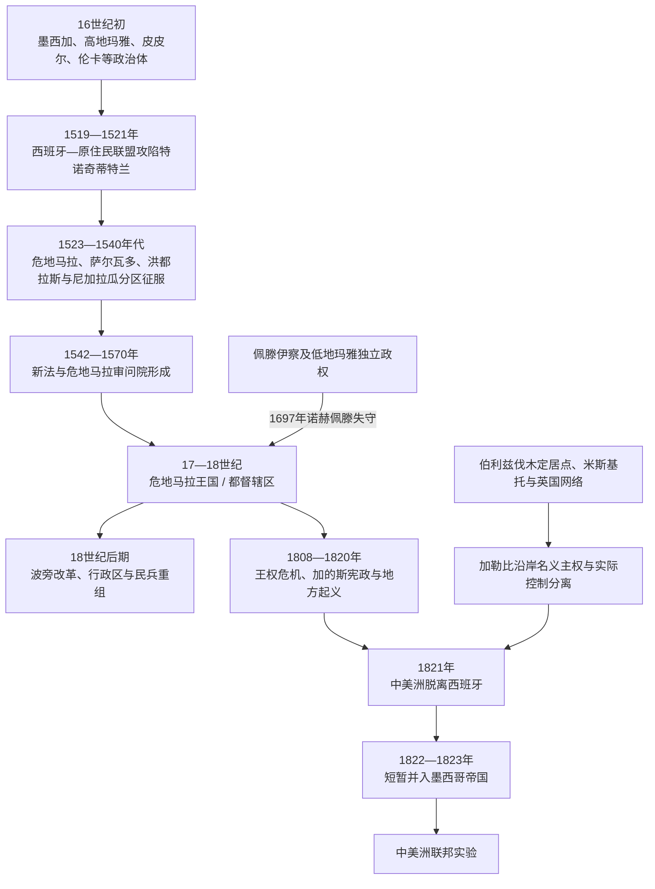

# 新西班牙与墨西哥中南部

## 时间

1519—1821年为西班牙征服与殖民统治核心时期；佩滕部分玛雅政权至1697年才被征服。墨西哥独立后的连续国家史归入北美墨西哥目录，本页重点说明新西班牙和危地马拉王国怎样连接墨西哥中南部与地理中美洲。

## 概括

1521年特诺奇蒂特兰失守后，西班牙以墨西哥城为新西班牙总督区中心，但今日中美洲并非都由总督直接日常统治。危地马拉、萨尔瓦多、洪都拉斯、尼加拉瓜和哥斯达黎加的大部分地区逐步组成“危地马拉王国”，又称危地马拉审问院辖区或都督辖区；其总统、总督兼都督驻危地马拉城一带，在司法上直接联系王室，在财政、贸易和帝国防务上属于更广的新西班牙体系。巴拿马主要归属巴拿马审问院、秘鲁和新格拉纳达系统，伯利兹和蚊子海岸则长期存在英国定居者、米斯基托政治体与西班牙名义主权交错。

殖民统治不是1520年代一次完成。西班牙人依靠特拉斯卡拉等中部墨西哥盟军和当地敌对王国，逐区击败高地玛雅、皮皮尔、伦卡等政治体；低地伊察王国直到1697年才失守。王室又通过审问院、市政会、教会、原住民共和国、贡赋和劳役制度，把征服联盟转为常设治理。疾病、战争、迁村和强制劳动造成严重人口灾难，但原住民社群利用土地权、地方官职、兄弟会和诉讼维持并重塑共同体。

18世纪波旁改革加强税收、军队、贸易和行政区划，同时冲击克里奥尔精英、地方自治和社区经济。1808年西班牙王权危机、加的斯宪政、地方起义及1820年西班牙自由派革命使殖民合法性瓦解。1821年中美洲主要省份在危地马拉城宣布独立，随后并入墨西哥帝国，再于1823年建立自己的联邦实验。

## 演变图

## 征服的具体过程

### 中部墨西哥：联盟、围城与国家替换

1519年，埃尔南·科尔特斯进入墨西哥湾沿岸，在翻译与政治斡旋帮助下同托托纳克、特拉斯卡拉等反对墨西加贡赋的政治体结盟。西班牙人一度控制蒙特苏马二世，又在1520年的城市起义中被逐出。天花疫情削弱人口和领导层后，科尔特斯以原住民盟军、湖上小艇和堤道封锁围攻特诺奇蒂特兰，1521年俘获夸乌特莫克。

三方联盟失败不等于整个新西班牙立即臣服。米却肯、瓦哈卡、尤卡坦和北方边疆的征服使用不同的战争、谈判和传教路径。原住民盟友获得部分特权和土地，却也逐步被纳入贡赋、教区和殖民司法。

### 危地马拉高地：先结盟、后反抗

1523—1524年，佩德罗·德·阿尔瓦拉多率西班牙人与中部墨西哥盟军沿太平洋进入危地马拉。基切王国在军事失败后失去首都库马尔卡赫，统治者被处死。长期同基切竞争的卡克奇克尔最初为殖民军提供基地和兵员，但西班牙索取黄金、贡赋和劳力，卡克奇克尔于1524年转入反抗，直到1530年代才被迫接受新秩序。

这种“利用本地敌对关系—抬高贡赋—盟友反叛”的过程在多地重现。殖民者之间也争夺总督权、土地和劳力，危地马拉、墨西哥、巴拿马和加勒比方向的远征队会彼此冲突。

### 萨尔瓦多、洪都拉斯与尼加拉瓜

库斯卡特兰的皮皮尔／纳瓦政治体在1524年击退阿尔瓦拉多的第一次推进，殖民军经过数年战斗才建立圣萨尔瓦多。洪都拉斯的沿海、矿区和高地受到来自危地马拉、墨西哥及加勒比的多支殖民队争夺；1537—1539年伦皮拉领导的伦卡联盟成为重要抵抗。尼加拉瓜太平洋沿岸人口密集，征服者很快建立莱昂和格拉纳达，却通过奴隶掠卖、疫病和远征造成剧烈人口下降；加勒比内陆长期不受有效控制。

### 佩滕与最后的独立玛雅王国

伊察、科沃赫和亚兰等低地玛雅政权利用森林、水路和分散聚落维持独立。传教士和尤卡坦、危地马拉两路殖民者多次尝试进入佩滕，谈判、逃亡和冲突持续。1697年马丁·德·乌尔苏亚率军以武装船攻占诺赫佩滕，伊察王国覆亡；征服后仍发生聚落逃散和反抗，西班牙对低地的日常控制有限。

## 殖民行政结构

| 层级 | 机构或首脑 | 正式权限 | 实际运行 |
|---|---|---|---|
| 西班牙君主 | 哈布斯堡、后为波旁王室 | 海外宗主权、任命、法律和教会保荐权 | 信息与航程缓慢，依赖地方官、教会、城市和精英执行。 |
| 印度事务委员会与贸易机构 | 王室中央机关 | 审理上诉、制定法令、审查任命并管理帝国贸易 | 同财政、海军和新西班牙总督体系交叉。 |
| 新西班牙总督 | 驻墨西哥城 | 协调总督区财政、军防、贸易和王室政策 | 危地马拉审问院在司法和大量行政事务上直接对王室负责，并非普通墨西哥地方省。 |
| 危地马拉皇家审问院 | 主席、法官和检察官 | 最高区域法院；主席后来兼总督与都督 | 管辖范围和驻地数次变化，通常覆盖危地马拉至哥斯达黎加及恰帕斯。 |
| 总督兼都督 | 审问院主席通常兼任 | 民政、军事、财政协调和官员监督 | 需要同省级官员、主教、市政会和地方精英谈判，边疆控制常弱。 |
| 省、区与市镇 | 省长、阿尔卡尔德·马约尔、科雷希多尔；18世纪后设行政长官区 | 征税、治安、民兵、司法和劳役征调 | 萨尔瓦多靛蓝区、洪都拉斯矿区、尼加拉瓜与哥斯达黎加形成不同地方利益。 |
| 西班牙城市市政会 | 市长、议员和克里奥尔精英 | 城市土地、市场、道路、民兵与地方财政 | 成为本地出生精英积累政治经验和争取自治的核心。 |
| 教会 | 主教、修会、堂区和宗教法庭 | 传教、教育、婚姻登记、什一税、慈善和道德司法 | 修会深入原住民村落，也拥有土地、信贷和地方政治影响。 |
| 原住民共和国 | 卡西克、地方议事会、原住民市长 | 在殖民法内管理社区、贡赋、共同土地和地方纠纷 | 既是征税和劳役工具，也使社区能用王室法律维护土地与自治。 |
| 劳动与土地机构 | 恩科米恩达、劳役分派、庄园和作坊 | 征收贡赋、组织季节劳动和商品生产 | 王室法令限制世袭和虐待，但地方执行反复，债役与土地集中持续。 |

## 殖民行政首脑与制度转折

以下列出制度转折中的代表性首脑，不作为历任官员完整名单；审问院短期代理和职位空缺很多，不能把数十任殖民官写成稳定“王朝”。

| 人物 / 机构 | 时间 | 角色 | 关键事件 |
|---|---|---|---|
| 佩德罗·德·阿尔瓦拉多 | 1527—1541年 | 危地马拉总督、都督和先遣殖民者 | 以征服、城市奠基和恩科米恩达分配建立早期殖民秩序；死于墨西哥西部远征伤势。 |
| 贝阿特丽斯·德·拉库埃瓦及市政过渡 | 1541年 | 短暂继任总督；随后由市政与王室官员接管 | 阿尔瓦拉多死后继位，很快在火山泥流灾害中死亡，显示征服者家族统治的不稳定。 |
| 阿隆索·德·马尔多纳多 | 1543—1548年 | 洛斯孔菲内斯审问院首任主席 | 按《新法》建立高等司法机关，试图把征服者私人权力纳入王室监督。 |
| 阿隆索·洛佩斯·德·塞拉托 | 1548—1555年 | 审问院主席 | 推动限制原住民奴役和征服者滥权，引发殖民精英反对。 |
| 胡安·努涅斯·德·兰德乔 | 1559—1565年 | 主席兼地方总督 | 行政、司法职位逐渐合一；因滥权指控接受王室巡察。 |
| 危地马拉审问院恢复 | 1570年 | 区域最高司法与行政机构 | 此前短期并入墨西哥和巴拿马审问院的安排失败，区域中心重新固定于危地马拉。 |
| 安东尼奥·佩拉萨·德·阿亚拉 | 1611年起 | 较早正式兼称主席、总督与都督者 | 三项职权合一成为此后“危地马拉都督辖区”首脑的典型形式。 |
| 马丁·德·马约尔加 | 1773—1779年 | 总督、都督兼审问院主席 | 1773年地震后推动首府由圣地亚哥迁至新危地马拉城。 |
| 马蒂亚斯·德·加尔韦斯 | 1779—1783年 | 总督、都督兼主席 | 在英西战争中组织加勒比防务，强化民兵和港口。 |
| 何塞·德·布斯塔曼特 | 1811—1818年 | 都督兼高级政治首长 | 面对圣萨尔瓦多和尼加拉瓜起义，以镇压和有限改革维持王室统治。 |
| 卡洛斯·德·乌鲁蒂亚 | 1818—1820年 | 最后正式兼任旧制三职的首脑 | 西班牙1820年宪政恢复后，旧都督体制被省级政治首长制度重组。 |
| 加维诺·盖恩萨 | 1820—1821年 | 代理都督、审问院主席和危地马拉省高级政治首长 | 1821年主持独立会议，后继续领导临时协商委员会，体现殖民官向独立政权过渡。 |

## 巴拿马、伯利兹与加勒比边疆的不同路径

### 巴拿马地峡

巴拿马不是危地马拉都督辖区成员。16世纪的巴拿马城和波托韦洛把秘鲁白银转运至大西洋，归巴拿马审问院及秘鲁总督体系；1739年后主要纳入新格拉纳达总督区。1671年亨利·摩根攻破旧巴拿马城后，城市迁至新址。跨洋商路兴衰和南美政治因此比危地马拉城更直接影响巴拿马，1821年其独立后选择加入大哥伦比亚。

### 伯利兹沿岸

西班牙宣称今伯利兹主权，却缺乏稳定定居和日常行政。17世纪后英国“湾民”砍伐染料木和桃花心木，使用非洲奴隶劳动，并同玛雅社群既贸易又冲突。1783、1786年英西条约承认有限采伐权但不转让正式主权；1798年圣乔治礁战役后，英国定居点持续扩大，后来发展为英属洪都拉斯。

### 蚊子海岸与米斯基托王国

尼加拉瓜、洪都拉斯加勒比岸的米斯基托政治体同逃奴和非洲后裔融合，并与英国商人、殖民官及牙买加保持联盟。英国保护与军火支持限制西班牙控制。18—19世纪的名义宗主权、保护国和地方王权重叠，说明殖民地图颜色不等于有效治理。

1797年英国把圣文森特岛的加里富纳人放逐到罗阿坦岛，随后他们在洪都拉斯、伯利兹、危地马拉和尼加拉瓜加勒比沿岸建立社群，成为中美洲非洲—原住民历史的重要组成。

## 殖民经济与社会

| 领域 | 主要区域与机制 | 社会影响 |
|---|---|---|
| 贡赋与劳役 | 原住民社区缴纳实物、货币贡赋，并参加季节性劳役分派 | 支撑城市、道路、庄园和王室财政，也造成逃亡、负债和社区冲突。 |
| 可可与靛蓝 | 索科努斯科和危地马拉部分地区产可可；萨尔瓦多成为靛蓝中心 | 商人和地主财富上升，原住民与混合族群劳工承受价格和强制采购压力。 |
| 矿业与畜牧 | 洪都拉斯银矿、尼加拉瓜和哥斯达黎加畜牧及骡运 | 形成分散边疆、劳力迁移和跨省贸易；产量远小于墨西哥大型银区。 |
| 城市与跨洋贸易 | 危地马拉城、莱昂、格拉纳达、波托韦洛等连接大西洋与太平洋 | 合法垄断、走私和英国加勒比贸易并存，地方利益常与王室限制冲突。 |
| 非洲奴役与自由黑人 | 加勒比港口、伐木地、庄园和家内劳动 | 被奴役者及其后裔通过逃亡、赎身、民兵和社群形成改变地区人口与文化。 |
| 教会与信贷 | 修会、主教区和兄弟会经营土地、贷款、教育和节庆 | 天主教深入日常生活，同原住民历法、祖先和地方圣地发生融合与冲突。 |
| 聚村与土地 | 殖民者把分散居民迁入集中村镇，确认或重划共同土地 | 便于传教、征税和劳役，也为社区保存法律人格和集体诉讼渠道。 |

殖民“种族等级”以西班牙人、原住民、非洲人和各种混合身份分类，但人口身份并非固定生物类别。财富、婚姻、服饰、语言、合法性和地方名望会改变法律记录中的身份；“拉迪诺”等称谓在不同省份和世纪含义也不相同。

## 波旁改革与殖民危机

18世纪王室扩大贸易、烟草和酒类专卖，加强关税、民兵与财政审计，并在1780年代建立圣萨尔瓦多、恰帕斯、洪都拉斯和尼加拉瓜等行政长官区。改革提高财政和防御能力，却削弱旧官员、市政会和地方商人的利益。克里奥尔精英抱怨高职由半岛出生官员垄断，原住民和城市民众则反对税费、劳役和商品管制。

1773年圣玛尔塔地震摧毁危地马拉旧都大部，王室强制迁往新危地马拉城。迁都不仅是灾害应对，也重排了教会、财产和商贸网络；许多居民和宗教机构抵制搬迁。

1808年拿破仑迫使西班牙国王退位，各地必须回答“君主缺位时主权属于谁”。1811年圣萨尔瓦多起义、1811—1812年莱昂和格拉纳达动乱及其后的镇压显示独立并非危地马拉城单方面和平决定。1812年《加的斯宪法》扩大选举市政和代表制度，斐迪南七世复辟后废除，1820年又恢复，反复改变地方政治预期。

## 1821年独立与殖民体制终结

1821年墨西哥独立进程和西班牙自由派革命使危地马拉精英担忧社会革命、贸易中断和外来战争。9月15日，由殖民官员、教士、市政代表和精英组成的会议签署独立文件，盖恩萨继续主持临时政府。独立主要是行政权从王室转向本地精英，未立即废除贡赋遗产、共同土地压力、教会影响或社会等级。

各省对危地马拉城的决定并不一致。圣萨尔瓦多反对并入墨西哥，尼加拉瓜和哥斯达黎加内部城市也出现不同选择。1822年多数省份被纳入伊图尔维德帝国；墨西哥军队压服圣萨尔瓦多后，帝国很快于1823年崩溃，中美洲制宪大会宣布对西班牙、墨西哥及其他国家完全独立。

## 殖民秩序兴起与终结的原因

### 建立与延续条件

- 西班牙—原住民联盟利用旧政治竞争，征服后又保留地方领袖和社区以征税、传教。
- 王室法院、市政会、教会和原住民共和国提供多层治理，使人数有限的殖民者能够依赖地方中介。
- 跨洋贸易、贡赋、靛蓝、矿业和土地收益把本地精英利益同帝国连接。
- 不同群体可在王室法院上诉，虽不消除压迫，却为殖民秩序提供有限合法性和调节机制。

### 结构性衰弱

- 区域交通困难、财政不足和加勒比边疆失控使“危地马拉王国”从未成为均质中央国家。
- 贸易垄断和高职排斥加深克里奥尔精英与王室矛盾；地方省份又反对危地马拉城集中资源。
- 疾病、强制劳动和土地集中破坏社区人口与经济，也不断产生逃亡、诉讼和反抗。
- 波旁集权提高财政汲取，却削弱传统协商与地方自治。

### 外部压力与直接触发

英国加勒比扩张、美国和海地革命、法国革命及拉丁美洲起义提供新的政治语言和战略环境。1808年西班牙王权崩溃是合法性转折，1820年自由派革命和1821年墨西哥独立则成为直接触发；本地精英选择独立，也意在避免更激进的社会动员。

## 重要事件

| 时间 | 事件 | 结果与长期影响 |
|---|---|---|
| 1519—1521年 | 西班牙—原住民联盟围攻特诺奇蒂特兰 | 三方联盟核心覆亡，新西班牙国家开始建立。 |
| 1523—1524年 | 阿尔瓦拉多进入高地危地马拉 | 基切败亡，卡克奇克尔由盟友转入反抗。 |
| 1524—1528年 | 库斯卡特兰多轮战争 | 西班牙逐步建立圣萨尔瓦多，皮皮尔抵抗并未在首次远征终结。 |
| 1524—1540年代 | 洪都拉斯与尼加拉瓜征服 | 殖民派系、奴隶掠卖、矿业和地方抵抗共同塑造早期秩序。 |
| 1537—1539年 | 伦皮拉领导伦卡抵抗 | 洪都拉斯高地征服受阻，最终在长期战争中失败。 |
| 1542—1543年 | 《新法》与洛斯孔菲内斯审问院建立 | 王室试图限制征服者私人权力并建立区域法院。 |
| 1570年 | 危地马拉审问院恢复 | 区域行政司法中心重新固定。 |
| 1671年 | 亨利·摩根攻破旧巴拿马城 | 跨洋枢纽迁城，巴拿马防务和商路重组。 |
| 1697年 | 诺赫佩滕被攻陷 | 最后主要独立玛雅王国覆亡。 |
| 1773—1776年 | 地震与危地马拉首府迁移 | 财产、教会和行政网络重新配置。 |
| 1780年代 | 行政长官区与财政改革 | 王室集权加强，地方和社群不满上升。 |
| 1797年 | 加里富纳人被放逐至罗阿坦 | 加勒比沿岸形成跨国加里富纳社群。 |
| 1798年 | 圣乔治礁战役 | 英国伐木定居点巩固，西班牙对伯利兹主张失去实际执行力。 |
| 1808年 | 西班牙王权危机 | 殖民地代表、主权与自治问题公开化。 |
| 1811—1814年 | 圣萨尔瓦多、尼加拉瓜等地起义 | 地方反税、自治和独立诉求遭镇压但持续。 |
| 1821年9月15日 | 中美洲独立文件签署 | 危地马拉王国脱离西班牙，殖民官转入临时政府。 |
| 1822—1823年 | 并入及脱离墨西哥帝国 | 地区首次独立安排失败，转向联邦制宪。 |

## 演变关系

- 文明前史：[中部美洲文明](/%E4%BA%BA%E6%96%87%E7%A7%91%E5%AD%A6/%E5%8E%86%E5%8F%B2/%E7%BE%8E%E6%B4%B2/%E4%B8%AD%E7%BE%8E%E6%B4%B2/%E4%B8%AD%E9%83%A8%E7%BE%8E%E6%B4%B2%E6%96%87%E6%98%8E.md)、[科潘王朝君主世系表](/%E4%BA%BA%E6%96%87%E7%A7%91%E5%AD%A6/%E5%8E%86%E5%8F%B2/%E7%BE%8E%E6%B4%B2/%E4%B8%AD%E7%BE%8E%E6%B4%B2/%E7%A7%91%E6%BD%98%E7%8E%8B%E6%9C%9D%E5%90%9B%E4%B8%BB%E4%B8%96%E7%B3%BB%E8%A1%A8.md)。
- 后续国家形成：[中美洲独立与联邦](/%E4%BA%BA%E6%96%87%E7%A7%91%E5%AD%A6/%E5%8E%86%E5%8F%B2/%E7%BE%8E%E6%B4%B2/%E4%B8%AD%E7%BE%8E%E6%B4%B2/%E4%B8%AD%E7%BE%8E%E6%B4%B2%E7%8B%AC%E7%AB%8B%E4%B8%8E%E8%81%94%E9%82%A6.md)。
- 近现代区域史：[当代中美洲与巴拿马](/%E4%BA%BA%E6%96%87%E7%A7%91%E5%AD%A6/%E5%8E%86%E5%8F%B2/%E7%BE%8E%E6%B4%B2/%E4%B8%AD%E7%BE%8E%E6%B4%B2/%E5%BD%93%E4%BB%A3%E4%B8%AD%E7%BE%8E%E6%B4%B2%E4%B8%8E%E5%B7%B4%E6%8B%BF%E9%A9%AC.md)。
- 墨西哥国家通史：[墨西哥历史](/%E4%BA%BA%E6%96%87%E7%A7%91%E5%AD%A6/%E5%8E%86%E5%8F%B2/%E7%BE%8E%E6%B4%B2/%E5%8C%97%E7%BE%8E/%E5%A2%A8%E8%A5%BF%E5%93%A5/README.md)。
- 所属总览：[中美洲与中部美洲](/%E4%BA%BA%E6%96%87%E7%A7%91%E5%AD%A6/%E5%8E%86%E5%8F%B2/%E7%BE%8E%E6%B4%B2/%E4%B8%AD%E7%BE%8E%E6%B4%B2/README.md)。
