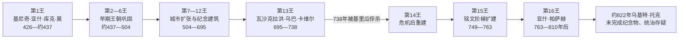

# 科潘王朝君主世系表

## 时间

约426年至9世纪初；王朝正统序列通常止于第16王，约822年另见一位未能稳固统治的继位主张者。

## 范围与史料口径

科潘位于今洪都拉斯西部，古典期名称通常释作“乌什维蒂克”（Uxwitik）。王朝创立者基尼奇·亚什·库克·莫于426年取得王权；第16王亚什·帕萨赫·昌·约帕特在776年奉献祭坛 Q，四面依次刻出创立者及其十五位继承者，因此科潘拥有玛雅世界中最清楚的一组王朝顺序。

祭坛 Q 证明“16王”的王朝记忆，不等于每位君主的生卒、父子关系和精确在位年都已确定。早期王名有些仍无法释读，部分纪年来自后世回溯铭文；第7、8王的年代可能重叠，可能涉及共治、铭文纪年含义不同或现代重建误差。本表保留“约”“不详”和旧称，避免把学术重建写成无争议事实。

## 世系演变图

## 公认王朝顺序

| 顺序 | 君主 | 在位时间 | 与前任关系 | 关键事件与说明 |
|---:|---|---|---|---|
| 1 | **基尼奇·亚什·库克·莫**（K'inich Yax K'uk' Mo'） | 426—约437年 | 王朝创立者；本地前一王系不详 | 426年举行登基仪式，数月后抵达科潘。其出身可能在玛雅中部低地，并主动采用同特奥蒂瓦坎相关的军事—王权符号；是否得到蒂卡尔直接扶植仍有争议。 |
| 2 | 基尼奇·波波尔·霍尔（K'inich Popol Hol） | 约437年后 | 通常认为是创立者之子 | 为创立者营建墓葬和祭祀空间，继续扩建早期卫城；确切卒年和继任年不详。 |
| 3 | 姓名未释读 | 约455年前后 | 不详 | 祭坛 Q 列为第三王，个人事迹和准确在位区间尚不能恢复。 |
| 4 | 库·伊什（Ku Ix；亦见 K'altuun Hix、Tuun K'ab' Hix 等转写） | 约465年前后 | 不详 | 名字读法仍有差异；处于王朝仪式和建筑逐步制度化阶段。 |
| 5 | 姓名未释读 | 约476年前后 | 不详 | 祭坛 Q 的第五位；现有铭文不足以给出可靠政治传记。 |
| 6 | 穆亚尔·霍尔？（Muyal Jol?） | 约485—504年 | 不详 | 王名读法带问号，结束时间由下一王的明确纪年推定。 |
| 7 | 巴兰·内恩（B'alam Nehn；旧称“水百合美洲豹”） | 504—544年 | 不详 | 504年即位；纪念碑把其统治同王朝创立传统连接。与第8王纪年有重叠，可能是共治或年代重建问题。 |
| 8 | 维·约尔·基尼奇（Wi' Yohl K'inich） | 约532—551年 | 与第7王关系不详 | 在第7王仍见纪年的时期出现，是否共治存在争议；其时科潘继续参与东南玛雅低地网络。 |
| 9 | 萨克·卢？（Sak Lu?） | 551—553年 | 不详 | 在位很短，王名尚非完全确定；王朝顺序由祭坛 Q 保证。 |
| 10 | 齐·巴兰（Tzi' B'alam） | 553—578年 | 不详 | 延续王朝仪式建设；个人事件资料有限。 |
| 11 | 卡克·乌蒂·昌（K'ahk' Uti' Chan；旧称 B'utz' Chan、“烟蛇”） | 578—628年 | 不详 | 长期统治使王朝进入更充分的碑铭时代；现代释读与旧称并存。 |
| 12 | **卡克·乌蒂·维茨·卡维尔**（K'ahk' Uti' Witz' K'awiil；旧称“烟伊米什神 K”） | 628—695年 | 不详 | 在位约67年，是王朝稳定扩张的重要君主；营建大型建筑并强化科潘对周边中心的优势。 |
| 13 | **瓦沙克拉洪·乌巴·卡维尔**（Waxaklajuun Ubaah K'awiil；旧称“十八兔”） | 695—738年 | 承第12王 | 推动雕刻和纪念建筑高峰；724年扶立基里瓜的卡克·蒂利乌·昌·约帕特，后者在738年反叛、俘获并将其处死，科潘地区霸权遭重大打击。 |
| 14 | 卡克·霍普拉赫·昌·卡维尔（K'ahk' Joplaj Chan K'awiil） | 738—749年 | 在第13王被俘杀后即位；亲属关系不详 | 面对基里瓜脱离和贡赋网络受损，维持王朝连续性；大型纪念活动一度减少。 |
| 15 | **卡克·伊皮亚赫·昌·卡维尔**（K'ahk' Yipyaj Chan K'awiil） | 749—763年 | 承第14王 | 重启大型建设，扩建著名象形文字阶梯，以铭文重述王朝历史并恢复合法性。 |
| 16 | **亚什·帕萨赫·昌·约帕特**（Yax Pasaj Chan Yopaat） | 763—810年后 | 正统序列末王；可能有母系外来联系 | 776年奉献祭坛 Q，把自己置于创立者直接传下的16王序列终点；后期人口、资源和政治网络承压，810年后仍见相关纪年，但中央王权逐渐失去组织能力。 |
| 争议继位 | 乌基特·托克（Ukit Took'） | 约822年 | 可能主张继承第16王 | 未完成的祭坛 L 可能记录其即位。是否真正控制科潘、统治多久均不确定，通常不列入祭坛 Q 的正统16王。 |

## 王权机制

- **创立者崇拜**：后继君主反复修建创立者墓庙并引用其形象，使外来或跨区域来源转化为本地王权合法性。
- **神圣君主制**：君主主持历法仪式、献祭、战争和祖先纪念，以“神圣领主”头衔连接城市、神灵和土地。
- **贵族与附属中心**：王权并非现代中央官僚国家。贵族家族、书吏、武士、周边聚落和附属城市掌握劳力与贡赋，中心需要持续协商和展示。
- **跨城邦等级**：科潘曾扶立基里瓜统治者，表明君主可建立附庸关系；738年附庸反杀宗主也显示这种等级并不稳定。
- **铭文政治**：祭坛 Q 和象形文字阶梯既是史料，也是后期君主在危机中重构正统性的政治文本，不能当作中立编年史。

## 鼎盛、危机与终结

### 鼎盛条件

科潘谷地农业人口、玉石和黑曜石等交换网络、专业雕刻传统、对周边聚落的贡赋和王朝祖先仪式共同支撑城市。第11至13王的长期统治减少继承中断，使宫殿、神庙、球场和碑刻能够连续建设。

### 结构性压力

8—9世纪人口密度上升、森林与土壤压力、精英建设负担和资源分配不平等削弱体系。王权需要不断投入劳力营建纪念物，却难以在农业风险和地方权力上升时维持旧有回报。

### 外部与政治压力

738年基里瓜击败并处死第13王，打断科潘的地区霸权和贸易控制；周边中心的自主化使贡赋与政治网络收缩。后继者能够恢复建筑，却无法完全恢复原有等级秩序。

### 直接终结过程

第16王时期仍有大型王朝叙事，但9世纪初的纪念碑数量和中央工程减少。约822年的祭坛 L 未能完成，显示继承主张已经缺乏足够资源或政治支持。城市人口并非一日消失，而是在数代中分散、缩减；玛雅社群和语言继续存在，终结的是科潘古典王朝及其宫廷组织。

## 重要事件

| 时间 | 事件 | 意义 |
|---|---|---|
| 426年 | 基尼奇·亚什·库克·莫登基并进入科潘 | 建立祭坛 Q 所追溯的王朝。 |
| 约437年 | 第二王为创立者修建墓祭空间 | 创立者崇拜成为王朝合法性核心。 |
| 504年 | 第7王巴兰·内恩即位 | 进入纪年较清楚的中期王朝。 |
| 628年 | 第12王即位 | 开启长达近七十年的稳定建设期。 |
| 695年 | 第13王即位 | 雕刻与纪念建筑进入高峰。 |
| 724年 | 科潘扶立基里瓜统治者 | 显示科潘对莫塔瓜河贸易节点的宗主地位。 |
| 738年 | 基里瓜俘杀第13王 | 地区霸权断裂，王朝进入危机。 |
| 749年 | 第15王即位 | 以大型工程和王朝铭文恢复正统。 |
| 763年 | 第16王即位 | 正统16王序列的最后一位。 |
| 776年 | 祭坛 Q 奉献 | 保存创立者至第16王的连续王表。 |
| 9世纪初 | 中央工程和碑铭减少 | 王权动员、生态与地区网络同步衰退。 |
| 约822年 | 乌基特·托克及未完成祭坛 L | 显示最后继位尝试未能重建稳定宫廷。 |

## 演变关系

- 文明背景：[中部美洲文明](/%E4%BA%BA%E6%96%87%E7%A7%91%E5%AD%A6/%E5%8E%86%E5%8F%B2/%E7%BE%8E%E6%B4%B2/%E4%B8%AD%E7%BE%8E%E6%B4%B2/%E4%B8%AD%E9%83%A8%E7%BE%8E%E6%B4%B2%E6%96%87%E6%98%8E.md)。
- 殖民转折：[新西班牙与墨西哥中南部](/%E4%BA%BA%E6%96%87%E7%A7%91%E5%AD%A6/%E5%8E%86%E5%8F%B2/%E7%BE%8E%E6%B4%B2/%E4%B8%AD%E7%BE%8E%E6%B4%B2/%E6%96%B0%E8%A5%BF%E7%8F%AD%E7%89%99%E4%B8%8E%E5%A2%A8%E8%A5%BF%E5%93%A5%E4%B8%AD%E5%8D%97%E9%83%A8.md)。
- 区域入口：[中美洲与中部美洲](/%E4%BA%BA%E6%96%87%E7%A7%91%E5%AD%A6/%E5%8E%86%E5%8F%B2/%E7%BE%8E%E6%B4%B2/%E4%B8%AD%E7%BE%8E%E6%B4%B2/README.md)。
