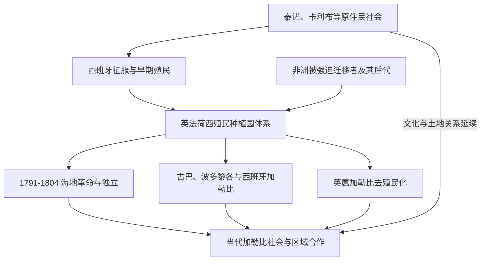

# 加勒比历史

## 概括

加勒比是连接北美、中美洲、南美、欧洲和非洲的海上历史空间。泰诺、卡利布等原住民社会早已形成岛际航行、贸易和政治网络；1492年后的殖民征服、糖业种植园和大西洋奴隶贸易使群岛成为近代世界经济的核心区域之一。海地革命、古巴独立与革命、英法荷殖民地去殖民化，以及旅游、侨汇、飓风和区域合作，构成现代加勒比的多重主线。

## 演进图

## 主题入口

| 主题 | 入口 | 说明 |
|---|---|---|
| 原住民与种植园 | [加勒比原住民与殖民种植园](/%E4%BA%BA%E6%96%87%E7%A7%91%E5%AD%A6/%E5%8E%86%E5%8F%B2/%E7%BE%8E%E6%B4%B2/%E5%8A%A0%E5%8B%92%E6%AF%94/%E5%8A%A0%E5%8B%92%E6%AF%94%E5%8E%9F%E4%BD%8F%E6%B0%91%E4%B8%8E%E6%AE%96%E6%B0%91%E7%A7%8D%E6%A4%8D%E5%9B%AD.md) | 岛际社会、殖民征服、糖业、奴隶制和逃奴社群。 |
| 海地 | [海地革命与法属加勒比](/%E4%BA%BA%E6%96%87%E7%A7%91%E5%AD%A6/%E5%8E%86%E5%8F%B2/%E7%BE%8E%E6%B4%B2/%E5%8A%A0%E5%8B%92%E6%AF%94/%E6%B5%B7%E5%9C%B0%E9%9D%A9%E5%91%BD%E4%B8%8E%E6%B3%95%E5%B1%9E%E5%8A%A0%E5%8B%92%E6%AF%94.md) | 圣多明各革命、1804年独立、赔款与法属加勒比。 |
| 西班牙加勒比 | [西班牙加勒比与古巴](/%E4%BA%BA%E6%96%87%E7%A7%91%E5%AD%A6/%E5%8E%86%E5%8F%B2/%E7%BE%8E%E6%B4%B2/%E5%8A%A0%E5%8B%92%E6%AF%94/%E8%A5%BF%E7%8F%AD%E7%89%99%E5%8A%A0%E5%8B%92%E6%AF%94%E4%B8%8E%E5%8F%A4%E5%B7%B4.md) | 古巴、波多黎各、多米尼加共和国和美西战争遗产。 |
| 英属加勒比 | [英属加勒比去殖民化与区域合作](/%E4%BA%BA%E6%96%87%E7%A7%91%E5%AD%A6/%E5%8E%86%E5%8F%B2/%E7%BE%8E%E6%B4%B2/%E5%8A%A0%E5%8B%92%E6%AF%94/%E8%8B%B1%E5%B1%9E%E5%8A%A0%E5%8B%92%E6%AF%94%E5%8E%BB%E6%AE%96%E6%B0%91%E5%8C%96%E4%B8%8E%E5%8C%BA%E5%9F%9F%E5%90%88%E4%BD%9C.md) | 牙买加、特立尼达和多巴哥等独立、CARICOM与小岛国家。 |

## 关键辨析

- 加勒比不是只由独立岛屿国家组成：波多黎各、法属海外领地、荷属加勒比等至今具有不同的宪政地位。
- “加勒比人”不是单一族群；原住民、非洲后裔、欧洲人、印度和华人契约劳工等共同塑造区域社会。
- 海地革命既是反奴隶制革命、反殖民独立战争，也是大西洋世界政治变革的重要事件。
- 种植园经济与奴隶制并非历史背景，直接塑造土地、人口、语言、宗教和财富分配。

## 相关入口

- 上级：[美洲历史](/%E4%BA%BA%E6%96%87%E7%A7%91%E5%AD%A6/%E5%8E%86%E5%8F%B2/%E7%BE%8E%E6%B4%B2/README.md)。
- 中美洲联系：[中美洲与中部美洲](/%E4%BA%BA%E6%96%87%E7%A7%91%E5%AD%A6/%E5%8E%86%E5%8F%B2/%E7%BE%8E%E6%B4%B2/%E4%B8%AD%E7%BE%8E%E6%B4%B2/README.md)。
- 跨区域专题：[美洲殖民与独立](/%E4%BA%BA%E6%96%87%E7%A7%91%E5%AD%A6/%E5%8E%86%E5%8F%B2/%E7%BE%8E%E6%B4%B2/%E6%AE%96%E6%B0%91%E4%B8%8E%E7%8B%AC%E7%AB%8B/README.md)。
