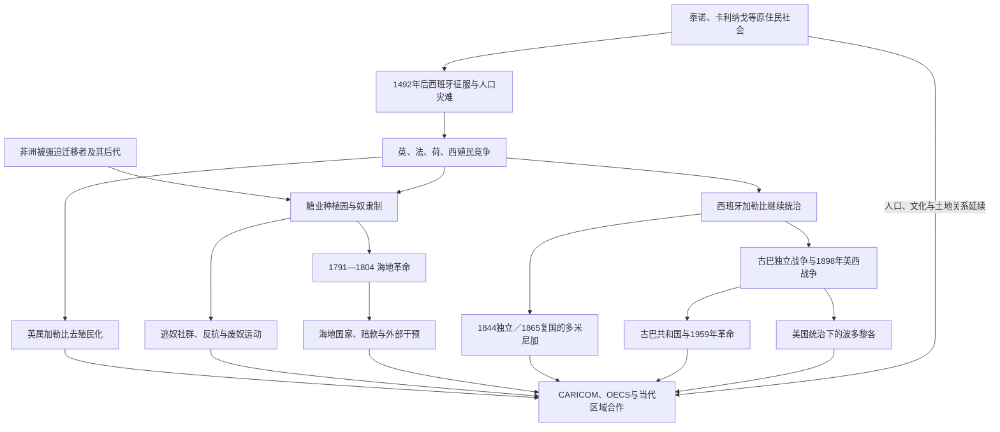

# 加勒比历史

## 概括

加勒比不是孤立岛屿的集合，而是连接北美、中美洲、南美、欧洲与非洲的海上历史空间。泰诺、卡利纳戈及其他原住民社会早已形成岛际航行、交换和政治网络；1492 年后的殖民征服、疫病、强迫劳动、糖业种植园与大西洋奴隶贸易，随后把群岛变成近代世界经济与帝国竞争的核心区域。

这里没有一条统一的“建国线”。海地以奴隶革命建立共和国；多米尼加共和国经历独立、再并入西班牙与复国；古巴在长期独立战争、美国占领和受限共和国后走向社会主义革命；英属岛屿多在 20 世纪经宪政谈判独立；波多黎各、法属和荷属加勒比则保留不同形式的非主权领地或自治关系。理解加勒比历史，必须同时追踪原住民延续、非洲离散、殖民语言区、政体变化与外部主权。

## 演进图

## 历史主线

1. **殖民征服以前**：大安的列斯与小安的列斯存在多种原住民社群，语言、权力组织和迁徙方向并不相同。“泰诺”与“加勒比人”不能作为所有岛民的单一标签。
2. **1492—18 世纪的帝国分割**：西班牙先控制大安的列斯据点；英、法、荷势力随后夺取或经营其他岛屿。疫病、战争、强迫劳动和移民造成原住民社会剧变，非洲奴隶贸易则重组人口。
3. **种植园、反抗与革命**：糖业依靠土地集中、暴力劳动纪律和跨大西洋市场。逃奴社群、奴隶起义、自由有色人政治和海地革命不断冲击殖民秩序。
4. **19 世纪的分化道路**：海地独立改变整个大西洋世界；多米尼加、古巴与波多黎各分别经历海地统一、独立战争、复国、废奴和美国扩张，结局并不相同。
5. **20 世纪的去殖民化与干预**：美国多次占领或干预海地、古巴和多米尼加；英属岛屿从西印度联邦试验转向分别独立，法属与荷属岛屿则发展出海外省、海外集体或王国内自治地位。
6. **当代区域**：旅游、侨汇、能源与粮食进口、债务、飓风和海平面上升造成共同挑战；CARICOM、OECS等机构推动合作，却不能消除国家规模、语言和宪政地位差异。

## 主题与时序导航

| 主要时间 | 主题 | 入口 | 本页应解决的问题 |
|---|---|---|---|
| 约公元前数千年—至今 | 原住民、殖民征服与种植园 | [加勒比原住民与殖民种植园](/%E4%BA%BA%E6%96%87%E7%A7%91%E5%AD%A6/%E5%8E%86%E5%8F%B2/%E7%BE%8E%E6%B4%B2/%E5%8A%A0%E5%8B%92%E6%AF%94/%E5%8A%A0%E5%8B%92%E6%AF%94%E5%8E%9F%E4%BD%8F%E6%B0%91%E4%B8%8E%E6%AE%96%E6%B0%91%E7%A7%8D%E6%A4%8D%E5%9B%AD.md) | 原住民社会如何演变；糖业、奴隶制、逃奴社群和契约劳工怎样塑造群岛 |
| 1492 年—至今 | 西班牙加勒比 | [西班牙加勒比与古巴](/%E4%BA%BA%E6%96%87%E7%A7%91%E5%AD%A6/%E5%8E%86%E5%8F%B2/%E7%BE%8E%E6%B4%B2/%E5%8A%A0%E5%8B%92%E6%AF%94/%E8%A5%BF%E7%8F%AD%E7%89%99%E5%8A%A0%E5%8B%92%E6%AF%94%E4%B8%8E%E5%8F%A4%E5%B7%B4.md) | 伊斯帕尼奥拉东部、古巴和波多黎各为何走向共和国、革命国家与美国领土三种路径 |
| 1625 年前后—至今 | 法属加勒比与海地 | [海地革命与法属加勒比](/%E4%BA%BA%E6%96%87%E7%A7%91%E5%AD%A6/%E5%8E%86%E5%8F%B2/%E7%BE%8E%E6%B4%B2/%E5%8A%A0%E5%8B%92%E6%AF%94/%E6%B5%B7%E5%9C%B0%E9%9D%A9%E5%91%BD%E4%B8%8E%E6%B3%95%E5%B1%9E%E5%8A%A0%E5%8B%92%E6%AF%94.md) | 圣多明各种植园为何爆发革命；海地国家如何受赔款、内战、占领和政治危机影响 |
| 17 世纪—至今 | 英属加勒比 | [英属加勒比去殖民化与区域合作](/%E4%BA%BA%E6%96%87%E7%A7%91%E5%AD%A6/%E5%8E%86%E5%8F%B2/%E7%BE%8E%E6%B4%B2/%E5%8A%A0%E5%8B%92%E6%AF%94/%E8%8B%B1%E5%B1%9E%E5%8A%A0%E5%8B%92%E6%AF%94%E5%8E%BB%E6%AE%96%E6%B0%91%E5%8C%96%E4%B8%8E%E5%8C%BA%E5%9F%9F%E5%90%88%E4%BD%9C.md) | 奴隶制终结、劳工运动、西印度联邦失败、分别独立和区域一体化如何衔接 |
| 20 世纪中期—至今 | 区域合作与未独立领地 | [英属加勒比去殖民化与区域合作](/%E4%BA%BA%E6%96%87%E7%A7%91%E5%AD%A6/%E5%8E%86%E5%8F%B2/%E7%BE%8E%E6%B4%B2/%E5%8A%A0%E5%8B%92%E6%AF%94/%E8%8B%B1%E5%B1%9E%E5%8A%A0%E5%8B%92%E6%AF%94%E5%8E%BB%E6%AE%96%E6%B0%91%E5%8C%96%E4%B8%8E%E5%8C%BA%E5%9F%9F%E5%90%88%E4%BD%9C.md) | CARIFTA、CARICOM、OECS与加勒比法院如何运行；英国海外领地及其他非主权辖区如何区别 |

## 政权与领导序列表

这些专表只承担完整职位序列和权力辨析，具体战争、经济与社会过程仍在上方主题笔记中阅读。

| 政体或地区 | 覆盖时间 | 完整序列表 | 使用说明 |
|---|---|---|---|
| 海地 | 1804 年—至今 | [海地国家元首与政府首脑表](/%E4%BA%BA%E6%96%87%E7%A7%91%E5%AD%A6/%E5%8E%86%E5%8F%B2/%E7%BE%8E%E6%B4%B2/%E5%8A%A0%E5%8B%92%E6%AF%94/%E6%B5%B7%E5%9C%B0%E5%9B%BD%E5%AE%B6%E5%85%83%E9%A6%96%E4%B8%8E%E6%94%BF%E5%BA%9C%E9%A6%96%E8%84%91%E8%A1%A8.md) | 包含南北并立、帝国与共和国、军政府、占领期总统、杜瓦利埃家族、过渡委员会及总理序列 |
| 多米尼加共和国 | 1844 年—至今 | [多米尼加共和国国家元首表](/%E4%BA%BA%E6%96%87%E7%A7%91%E5%AD%A6/%E5%8E%86%E5%8F%B2/%E7%BE%8E%E6%B4%B2/%E5%8A%A0%E5%8B%92%E6%AF%94/%E5%A4%9A%E7%B1%B3%E5%B0%BC%E5%8A%A0%E5%85%B1%E5%92%8C%E5%9B%BD%E5%9B%BD%E5%AE%B6%E5%85%83%E9%A6%96%E8%A1%A8.md) | 包含西班牙再吞并、复国政府、美国占领、特鲁希略代理总统和 1965 年并立政权 |
| 古巴 | 1868 年武装共和国—至今 | [古巴国家元首与政府首脑表](/%E4%BA%BA%E6%96%87%E7%A7%91%E5%AD%A6/%E5%8E%86%E5%8F%B2/%E7%BE%8E%E6%B4%B2/%E5%8A%A0%E5%8B%92%E6%AF%94/%E5%8F%A4%E5%B7%B4%E5%9B%BD%E5%AE%B6%E5%85%83%E9%A6%96%E4%B8%8E%E6%94%BF%E5%BA%9C%E9%A6%96%E8%84%91%E8%A1%A8.md) | 区分总统、总理、国务委员会主席、部长会议主席、代理职位与共产党最高领导 |
| 波多黎各 | 1897 年自治政府—至今 | [波多黎各总督与行政长官表](/%E4%BA%BA%E6%96%87%E7%A7%91%E5%AD%A6/%E5%8E%86%E5%8F%B2/%E7%BE%8E%E6%B4%B2/%E5%8A%A0%E5%8B%92%E6%AF%94/%E6%B3%A2%E5%A4%9A%E9%BB%8E%E5%90%84%E6%80%BB%E7%9D%A3%E4%B8%8E%E8%A1%8C%E6%94%BF%E9%95%BF%E5%AE%98%E8%A1%A8.md) | 连续列出西班牙自治过渡、美国军事与任命总督、民选总督，并说明国会和财政监督权 |
| 英属加勒比独立国家 | 1962 年—至今 | [英属加勒比独立国家领导序列表](/%E4%BA%BA%E6%96%87%E7%A7%91%E5%AD%A6/%E5%8E%86%E5%8F%B2/%E7%BE%8E%E6%B4%B2/%E5%8A%A0%E5%8B%92%E6%AF%94/%E8%8B%B1%E5%B1%9E%E5%8A%A0%E5%8B%92%E6%AF%94%E7%8B%AC%E7%AB%8B%E5%9B%BD%E5%AE%B6%E9%A2%86%E5%AF%BC%E5%BA%8F%E5%88%97%E8%A1%A8.md) | 分列八个英联邦王国的君主与总督、四个共和国的总统，以及十二国完整政府首脑序列 |

## 重要转折与时间节点

| 时间 | 转折 | 直接过程 | 长期影响 |
|---|---|---|---|
| 1492—1511 年 | 西班牙在大安的列斯征服与设点 | 战争、疫病、强迫劳动和移民摧毁原有政治秩序 | 加勒比成为欧洲美洲扩张基地，原住民人口与文化在灾难中重组而非简单消失 |
| 17 世纪 | 英、法、荷殖民区形成 | 海盗、特许公司、战争与条约分割群岛 | 英语、法语、荷兰语和克里奥尔语区域出现，殖民边界长期化 |
| 17—18 世纪 | 糖业种植园体系成熟 | 大规模输入被奴役非洲人，土地和资本集中 | 非洲后裔成为多数岛屿人口主体，种族与阶级结构延续至今 |
| 1762—1763 年 | 英国短占哈瓦那 | 七年战争打开港口和奴隶输入 | 西班牙波旁改革、古巴防务和糖业扩张加速 |
| 1791—1804 年 | 海地革命 | 奴隶起义、内战、外国干涉与反法独立战争相继发生 | 建立首个废奴黑人共和国，冲击奴隶制并使列强孤立海地 |
| 1834—1886 年 | 各殖民区废奴 | 英属、法属、西属岛屿在不同时点法律废奴 | 契约劳工和工资劳动取代奴隶制，但土地集中与种族不平等延续 |
| 1844、1865 年 | 多米尼加独立与复国 | 脱离海地后又并入西班牙，复国战争迫使西班牙撤出 | 两次建国经验共同构成多米尼加国家合法性 |
| 1868—1898 年 | 古巴与波多黎各反殖民运动 | 十年战争、拉雷斯起义、废奴与古巴独立战争 | 西班牙加勒比统治瓦解，美国取代西班牙成为主要外部强权 |
| 1898 年 | 美西战争 | 美国击败西班牙并占领古巴、取得波多黎各 | 古巴走向受限独立，波多黎各进入美国领土地位 |
| 1915—1934 年 | 美国占领海地 | 美国控制财政、宪法和武装，镇压卡科抵抗 | 国家机构中央化，外部控制、土地与主权争议长期化 |
| 1916—1924 年 | 美国占领多米尼加 | 军政府控制关税并重建集中化军队 | 新军成为特鲁希略夺权的制度基础 |
| 1930—1961 年 | 特鲁希略独裁 | 家族、军警与企业垄断国家 | 边境屠杀、政治恐怖和强人制度遗产深刻 |
| 1958—1962 年 | 西印度联邦试验 | 英属殖民地尝试共同联邦，牙买加和特立尼达退出 | 区域政治统一失败，各岛分别独立，经济合作后来重建 |
| 1959 年 | 古巴革命 | 巴蒂斯塔政权崩溃，革命政府改革并向社会主义转型 | 美古对立、加勒比冷战与革命示范效应长期化 |
| 1962—1983 年 | 英属加勒比独立潮 | 多数主要殖民地经宪政谈判成为独立国家 | 君主立宪与共和国并存，小国区域合作需求上升 |
| 1973 年 | CARICOM 成立 | 独立国家建立共同体和共同市场 | 外交、贸易、人员流动和功能合作获得常设框架 |
| 1994 年 | 海地恢复民选政府 | 军政府在国际军事压力下交权 | 选举秩序恢复，但国家能力、外援依赖和政治暴力问题未解决 |
| 2016 年 | 波多黎各进入联邦财政监督 | 美国国会通过《PROMESA》处理债务危机 | 地方自治与美国国会上位权力的矛盾再次制度化 |
| 2017 年 | 飓风玛丽亚 | 多岛基础设施受灾，波多黎各电网和公共服务崩溃 | 气候风险、债务、移民与殖民地位争议相互叠加 |
| 2021 年以后 | 海地治理与安全危机升级 | 总统遇刺、过渡机制失效、武装集团控制扩大 | 国家元首长期空缺，区域与国际安全支援未能迅速恢复宪政秩序 |

## 关键辨析

- **加勒比不是一个国家或单一文明**：它是由岛屿、大陆沿岸、独立国家与多种海外领地组成的历史区域。
- **原住民并未“完全灭绝”**：殖民人口灾难真实存在，但血缘、语言遗存、农业、地名和当代复兴运动说明延续同样重要。
- **废奴不等于种植园秩序结束**：契约劳工、土地集中、出口依赖和殖民种族等级以新形式延续。
- **海地革命不只是民族独立战争**：它同时是奴隶革命、废奴革命、内战与国际战争。
- **“英属加勒比”不等于仍属英国**：多数已独立；另有英国海外领地，二者必须区分。
- **“自由邦”不等于主权国家**：波多黎各拥有地方宪法和民选政府，仍是美国非合并领土。
- **区域组织不取代成员国主权**：CARICOM和OECS能协调贸易、外交、司法和货币，但成员的政体与外部关系仍有差异。

## 相关入口

- 上级：[美洲历史](/%E4%BA%BA%E6%96%87%E7%A7%91%E5%AD%A6/%E5%8E%86%E5%8F%B2/%E7%BE%8E%E6%B4%B2/README.md)
- 中美洲联系：[中美洲历史](/%E4%BA%BA%E6%96%87%E7%A7%91%E5%AD%A6/%E5%8E%86%E5%8F%B2/%E7%BE%8E%E6%B4%B2/%E4%B8%AD%E7%BE%8E%E6%B4%B2/README.md)。
- 跨区域专题：[美洲殖民与独立](/%E4%BA%BA%E6%96%87%E7%A7%91%E5%AD%A6/%E5%8E%86%E5%8F%B2/%E7%BE%8E%E6%B4%B2/%E6%AE%96%E6%B0%91%E4%B8%8E%E7%8B%AC%E7%AB%8B/README.md)。
