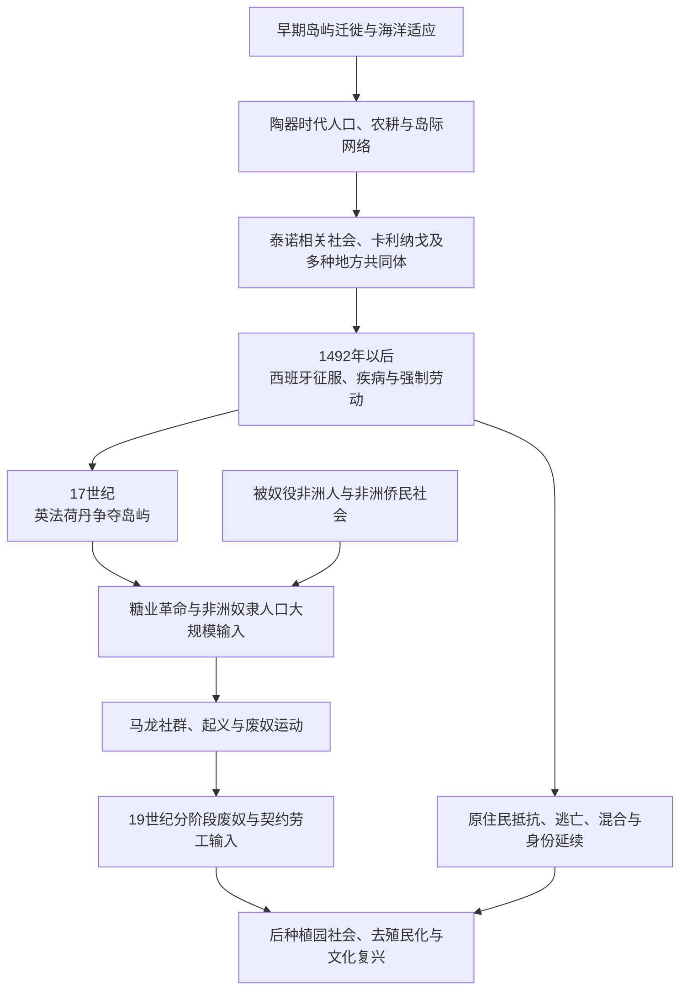

# 加勒比原住民与殖民种植园

## 时间

约前6千纪已有部分岛屿人类活动；1492年后进入欧洲殖民与种植园扩张，19世纪分阶段废奴，其社会遗产延续至今。

## 概括

加勒比群岛在欧洲到来前已有数千年人口迁徙、岛际航海、农耕、渔猎、贸易和政治网络。大安的列斯与巴哈马的泰诺相关社会、小安的列斯的卡利纳戈社会，以及卢卡亚人、瓜纳阿塔贝伊、西瓜约等多种群体，并不是同一个“加勒比原住民族”。它们以独木舟连接岛屿与南北美大陆，种植木薯、玉米、甘薯和辣椒，利用海洋资源，并通过首领、村落、仪式与亲族组织政治。

1492年后，西班牙在伊斯帕尼奥拉、古巴和波多黎各建立据点。战争、强制劳动、迁徙、饥荒和欧亚非传染病造成灾难性人口下降；原住民并未“完全消失”，幸存者、混合家庭、逃亡社区和现代复兴运动延续身份与文化。17世纪英、法、荷、丹等列强争夺岛屿，甘蔗糖业与跨大西洋奴隶贸易结合，使加勒比成为近代种植园复合体的核心。被奴役非洲人与其后代通过生产知识、家庭、宗教、逃亡、马龙社群和起义持续塑造地区。

## 历史演进

## 欧洲到来前的加勒比

### 迁徙与考古阶段

最早居民进入各岛的时间并不相同。部分人群可能从中美洲、尤卡坦、南美北岸或相邻岛屿迁入，不能用一条单线替代。约前1千纪以后，来自奥里诺科河和南美北岸方向、制作陶器并经营园圃的人群逐步进入小安的列斯和大安的列斯；考古学以萨拉多伊德等名称分类器物传统，这些名称不是古人自称。

公元1千纪后半叶，大安的列斯形成考古学所谓奥斯蒂奥诺伊德及后来泰诺相关传统。人口移动、地方创新和跨岛婚姻同时发生，因此“某文化完全取代前一人口”的模型需谨慎。

### 泰诺相关社会

“泰诺”今日常用来概括伊斯帕尼奥拉、波多黎各、古巴东部及巴哈马等地一组阿拉瓦克语相关社会。殖民早期资料把岛屿划为若干酋长辖区，但边界、数量和权力集中程度并不完全确定。卡西克首领以亲族、贡礼、宴饮、战争和仪式维持权威，村落广场或球场是公共生活中心。

木薯园圃采用堆土种植，配合玉米、甘薯、豆类、辣椒、棉花、捕鱼和贝类采集。木薯加工技术能去除苦味品种毒性并制成耐储存食物。独木舟用于岛际迁徙、贸易和战争，石材、贝饰、棉织物、食物和仪式物品跨海流动。

泽米既可指具有灵力的存在，也可指承载其力量的物件；仪式、祖先和首领权威相连。殖民者把复杂社会简化为“温顺印第安人”，这一形象和把卡利纳戈写成“天生食人者”的对立，共同服务于殖民分类。

### 卡利纳戈与小安的列斯

卡利纳戈主要分布于小安的列斯，并与南美北岸保持联系。欧洲资料常称其为“岛屿加勒比人”，又把“食人”指控用于正当化奴役和战争。历史上确有战争仪式和敌我叙述，但殖民文本带有强烈政治目的，不能照单全收。

卡利纳戈群体在独木舟航海、岛际联盟和战争中长期抵抗欧洲殖民。多米尼克、圣文森特等岛直到较晚仍保留较强原住民控制。非洲逃亡者与卡利纳戈在圣文森特形成后来被称为“黑卡里布”或加里富纳的共同体；英国1797年将大批加里富纳人强制迁往罗阿坦岛，其后代分布于中美洲加勒比海岸。

### 多样性与现代延续

卢卡亚人是巴哈马泰诺相关群体；西瓜约、马科里斯和瓜纳阿塔贝伊等名称见于早期古巴与伊斯帕尼奥拉资料，其语言和关系仍有争议。不能把殖民者记录的所有名称都当作边界固定的现代民族。

人口灾难、强制迁移和混合使许多社区不再以殖民官员认可的“印第安村”存在，却不表示后裔和文化完全消失。波多黎各、古巴、多米尼加及其他岛屿的家庭记忆、农业词汇、食物、地名、工艺和身份复兴，构成当代原住民延续；具体谱系主张需分别依据历史、社区和考古材料判断。

## 西班牙征服与人口灾难

### 伊斯帕尼奥拉

1492年哥伦布到达加勒比后，在伊斯帕尼奥拉建立早期据点。殖民者索取黄金和食物，以暴力惩罚反抗。恩科米恩达把原住民贡赋和劳动分配给殖民者；矿场、农场、运输和远离家园的强迫劳动破坏生计。

泰诺首领及村落以结盟、逃亡和战争回应。殖民者利用地方政治竞争，但其要求不断扩大。早期记录中的人口数字差异巨大，无法精确计算1492年前总人口；可以确定的是，数十年内人口发生灾难性下降。

### 古巴、波多黎各与巴哈马

征服从伊斯帕尼奥拉扩展到波多黎各和古巴。哈图埃伊从伊斯帕尼奥拉逃至古巴并组织抵抗，1512年被西班牙人处死。巴哈马卢卡亚人大量被掳往伊斯帕尼奥拉等地劳动，岛屿人口被强制抽空。

传染病是人口下降的重要因素，但不能成为淡化殖民责任的“自然灾害”解释。战争、劳动、迁移、营养恶化、出生率下降和社会崩解与疾病相互放大。部分幸存者加入混合家庭、逃入山区、与非洲逃亡者结盟或被行政重新分类。

### 法律与传教

西班牙王室和教会内部有人批评虐待，促成《布尔戈斯法》和1542年“新法”等改革。法律限制并未消除强迫劳动，殖民官员和定居者常规避执行。传教士记录语言并为部分原住民申诉，也摧毁宗教物件、推动集中定居和文化改造。保护与殖民控制可由同一机构同时发生。

## 多帝国争夺

| 殖民力量 | 主要据点与时期 | 统治与经济特点 |
|---|---|---|
| 西班牙 | 伊斯帕尼奥拉东部、古巴、波多黎各及早期大安的列斯 | 城市、堡垒、牧业、转口港和后来古巴糖业；以哈瓦那保护帝国航线 |
| 英国 | 巴巴多斯、牙买加、背风和向风群岛部分岛屿、巴哈马等 | 定居殖民、地方议会、糖业种植园、奴隶法和海军基地 |
| 法国 | 圣多明各、马提尼克、瓜德罗普、圣卢西亚等 | 糖与咖啡种植园、公司与王室行政；圣多明各成为高利润核心 |
| 荷兰 | 库拉索、阿鲁巴、博奈尔、圣尤斯特歇斯、萨巴、圣马丁部分及苏里南联系 | 转口贸易、奴隶贸易、盐业、港口和种植园；岛屿间功能不同 |
| 丹麦 | 圣托马斯、圣约翰、圣克罗伊 | 特许公司、转口港与奴隶种植园；1917年售予美国 |
| 瑞典等 | 圣巴泰勒米及短期租让 / 尝试 | 自由港和小规模殖民，后主权转移 |

西班牙早期宣称整个加勒比，却无法稳定占领所有小岛。17世纪其他列强以公司、私人殖民者、海盗和海军建立据点。1655年英国夺取牙买加；1697年《赖斯韦克条约》承认法国对伊斯帕尼奥拉西部圣多明各的控制。岛屿在战争和条约中多次易手，居民、被奴役者和原住民的生活不随旗帜变化立即重置。

## 糖业革命与种植园复合体

### 巴巴多斯与扩散

17世纪中叶，巴巴多斯快速转向大规模甘蔗和制糖，土地集中、资本密集磨坊与非洲奴隶劳工结合。糖业技术和种植园主随后转移到牙买加、背风群岛及北美卡罗来纳等地。法国、荷兰和其他帝国也参与技术、信贷和市场网络。

“糖业革命”不是单纯作物更换。它改变土地所有、人口、法律、港口、生态和政治：小农被挤出，森林砍伐，进口粮食依赖上升，白人少数以民兵和奴隶法统治黑人多数。

### 劳动与生活

甘蔗收割后必须迅速压榨，种植、砍蔗、运输、磨坊和熬糖形成全年高强度劳动。不同岗位需要农业、机械、木工、制桶、锅炉和畜力知识。妇女在田间、加工、家庭与市场劳动中承担关键角色，也遭受性暴力和生育控制。

种植园主根据肤色、出生地和法律身份构建等级；自由有色人可能拥有财产或奴隶，又受职业、服饰、婚姻和政治限制。犹太商人、爱尔兰契约劳工、欧洲小农和城市工匠等也处于不等地位，不能把社会简单分成两个完全一致群体。

### 大西洋商业

糖、糖蜜、朗姆、咖啡、靛蓝和烟草进入欧洲与北美市场。船主、保险、港口、银行和王室税收分享收益。殖民地高度依赖进口粮食、木材、牲畜和制造品，北美与加勒比之间形成密切贸易。

所谓“三角贸易”只是网络之一；巴西—非洲、加勒比岛际、北美—西印度和走私航线同样重要。详细制度见[大西洋奴隶贸易、种植园与侨民](/%E4%BA%BA%E6%96%87%E7%A7%91%E5%AD%A6/%E5%8E%86%E5%8F%B2/%E7%BE%8E%E6%B4%B2/%E6%AE%96%E6%B0%91%E4%B8%8E%E7%8B%AC%E7%AB%8B/%E5%A4%A7%E8%A5%BF%E6%B4%8B%E5%A5%B4%E9%9A%B6%E8%B4%B8%E6%98%93%E3%80%81%E7%A7%8D%E6%A4%8D%E5%9B%AD%E4%B8%8E%E4%BE%A8%E6%B0%91.md)。

## 抵抗、马龙社会与起义

| 方式 | 具体表现 | 影响 |
|---|---|---|
| 日常抵抗 | 放慢劳动、隐匿产品、破坏工具、维持家庭和宗教 | 限制主人控制，保存社会关系 |
| 短期逃亡 | 离开种植园数日或季节性返乡、探亲 | 争取休息和自主，殖民政府建立巡逻和通行证制度 |
| 马龙社群 | 在山地、森林或沼泽建立独立聚落 | 牙买加、苏里南等地形成长期政治共同体并与殖民政府战争 |
| 船上反抗 | 拒食、夺船、袭击船员或跳海 | 提高奴隶贸易成本，显示中段航行从未完全受控 |
| 有组织起义 | 伯比斯起义、牙买加浸信会战争、海地革命等 | 动摇奴隶制，推动军事镇压、改革或革命 |
| 法律与赎身 | 诉讼、请愿、购买自由、以军役换自由 | 扩大自由有色人口，但机会因殖民地和性别而异 |
| 文化与宗教 | 非洲宗教重组、秘密仪式、音乐和语言 | 建立跨种植园共同体，也被殖民者视为潜在政治威胁 |

牙买加马龙同英国经过长期战争，于18世纪签订条约，获得特定土地和自治，同时承担返还其他逃亡者等有争议义务。苏里南马龙群体也通过战争和条约获得承认。马龙社群内部有自身权力、性别和对外关系，不应浪漫化为无矛盾的自由空间。

## 废奴与契约劳工

| 地区 | 关键时间 | 过渡特征 |
|---|---|---|
| 海地 | 1793—1794年废奴，1804年独立确认 | 奴隶革命摧毁种植园奴隶制，独立后农业劳动组织仍有冲突 |
| 英属加勒比 | 1834年法律废奴，1838年“学徒制”提前结束 | 奴隶主获补偿，被解放者普遍未获土地；工资与土地控制继续不平等 |
| 法属加勒比 | 1794年首次废奴、1802年部分恢复、1848年最终废奴 | 革命与帝国更替导致制度反复 |
| 丹属西印度 | 1848年废奴 | 圣克罗伊起义压力促使总督宣布解放 |
| 荷属加勒比与苏里南 | 1863年废奴 | 苏里南被解放者还经历十年国家监督劳动 |
| 波多黎各 | 1873年废奴 | 过渡合同限制立即自由 |
| 古巴 | 1886年废奴 | “赞助制”等渐进安排延缓实际解放 |

废奴后，种植园主以土地、税收、流浪法和劳动合同限制工人。英国、法国和荷兰殖民地输入来自印度、中国、马德拉和爪哇等地的契约劳工。契约有期限和工资，不等同于奴隶身份，但招募欺骗、债务、惩罚和行动限制可造成严酷强制。

印度裔人口在特立尼达、圭亚那、苏里南等地形成重要社会；华人、爪哇人和其他移民也建立社群。族群政治不能只由殖民者“分而治之”解释，各群体有自身宗教、阶级、工会和跨族联盟。

## 种植园体系的兴盛与衰退

### 兴盛条件

- 欧洲糖、咖啡和烟草消费快速增长。
- 海军、堡垒和帝国贸易制度保护港口与航线。
- 跨大西洋奴隶贸易持续补充被强迫劳动力。
- 信贷、保险、制糖设备和北美粮食供应降低种植园成本。
- 岛屿土地易被少数殖民者集中控制，白人议会维护奴隶主利益。

### 结构弱点

- 单一作物使经济易受价格、战争、飓风和贸易中断冲击。
- 高死亡率和严酷劳动需要持续人口输入，社会长期军事化。
- 土地集中限制粮食与小农发展。
- 被奴役者抵抗、马龙战争和镇压成本不断增加。
- 土壤损耗、森林砍伐和制糖燃料需求造成生态压力。

### 直接转折

海地革命摧毁圣多明各种植园霸权；英法等国废奴改变劳动法律；欧洲甜菜糖竞争和贸易政策影响蔗糖利润。种植园没有随废奴消失，土地和出口结构在许多岛持续到20世纪，后来才由旅游、能源、金融和移民收入部分取代。

## 重要事件

| 时间 | 事件 | 过程与长期影响 |
|---|---|---|
| 1492年 | 哥伦布到达加勒比 | 开启持续欧洲殖民，原住民社会遭遇征服和疾病 |
| 1490年代—16世纪初 | 伊斯帕尼奥拉征服与恩科米恩达 | 强制劳动、战争和人口灾难成为后续殖民模式 |
| 1511—1512年 | 哈图埃伊在古巴抵抗 | 显示征服从伊斯帕尼奥拉扩散时即遭跨岛抵抗 |
| 1620—1650年代 | 英法荷等建立岛屿据点 | 西班牙垄断破裂，多帝国加勒比形成 |
| 1640年代以后 | 巴巴多斯糖业革命 | 奴隶种植园、土地集中和跨洋资本模式向各岛扩散 |
| 1655年 | 英国夺取牙买加 | 牙买加发展为英属糖业核心和马龙抵抗中心 |
| 1697年 | 法国圣多明各获承认 | 伊斯帕尼奥拉西部发展为法属高利润种植园殖民地 |
| 1730—1740年代 | 牙买加马龙战争与条约 | 殖民政府承认部分马龙自治，边界关系长期复杂 |
| 1763年 | 伯比斯奴隶起义 | 大规模起义一度控制殖民地大部，后遭镇压 |
| 1791—1804年 | 海地革命 | 被奴役者推翻奴隶制和殖民统治，改变大西洋世界 |
| 1831—1832年 | 牙买加浸信会战争 | 大规模奴隶起义加速英国废奴政治 |
| 1834—1886年 | 各殖民地分阶段废奴 | 法律奴隶制终结时间不同，过渡制度延续强制 |
| 1845年以后 | 印度等契约劳工输入扩大 | 后种植园人口与文化结构进一步多元 |
| 1797年 | 加里富纳人被逐出圣文森特 | 原住民—非洲后裔共同体迁至中美洲，形成跨加勒比民族网络 |

## 长期影响

- 岛屿人口由原住民灾难、非洲强迫迁移、欧洲殖民和亚洲契约移民共同重组。
- 糖业土地集中和出口依赖塑造废奴后的贫富、劳工和国家财政。
- 克里奥尔语、宗教、音乐、狂欢节、饮食和航海传统由多种人口在不平等条件下共同创造。
- 马龙、加里富纳和现代泰诺 / 卡利纳戈身份证明原住民与反殖民历史没有消失。
- 殖民边界把共享海域划为多种语言和宪政区域，岛际迁徙仍持续。
- 奴隶主补偿与被解放者无土地之间的差异，是当代修复正义讨论的重要历史基础。
- 飓风和生态脆弱性与种植园砍伐、沿海集中及现代气候变化叠加。

## 关键辨析

- **泰诺、卡利纳戈和其他岛民不是同一民族**：语言、政治和岛屿历史各异。
- **原住民没有“完全灭绝”**：人口灾难真实，幸存、混合与身份延续同样真实。
- **疾病不是脱离殖民暴力的自然解释**：劳动、饥荒、迁徙和战争放大死亡。
- **“食人加勒比人”是带政治目的的殖民标签**：需区分史料、仪式和奴役合法化话语。
- **种植园不只是农场**：它是土地、资本、法律、军队、奴隶贸易和加工体系。
- **废奴不等于劳动自由和平等土地**：学徒制、契约、税收和土地垄断继续限制工人。
- **契约劳工不是奴隶制的同义词，也并非自由劳工的简单范例**：法律身份不同，强制程度仍需分析。

## 演变关系

- 奴隶贸易专题：[大西洋奴隶贸易、种植园与侨民](/%E4%BA%BA%E6%96%87%E7%A7%91%E5%AD%A6/%E5%8E%86%E5%8F%B2/%E7%BE%8E%E6%B4%B2/%E6%AE%96%E6%B0%91%E4%B8%8E%E7%8B%AC%E7%AB%8B/%E5%A4%A7%E8%A5%BF%E6%B4%8B%E5%A5%B4%E9%9A%B6%E8%B4%B8%E6%98%93%E3%80%81%E7%A7%8D%E6%A4%8D%E5%9B%AD%E4%B8%8E%E4%BE%A8%E6%B0%91.md)。
- 革命转折：[海地革命与法属加勒比](/%E4%BA%BA%E6%96%87%E7%A7%91%E5%AD%A6/%E5%8E%86%E5%8F%B2/%E7%BE%8E%E6%B4%B2/%E5%8A%A0%E5%8B%92%E6%AF%94/%E6%B5%B7%E5%9C%B0%E9%9D%A9%E5%91%BD%E4%B8%8E%E6%B3%95%E5%B1%9E%E5%8A%A0%E5%8B%92%E6%AF%94.md)。
- 西班牙加勒比后续：[西班牙加勒比与古巴](/%E4%BA%BA%E6%96%87%E7%A7%91%E5%AD%A6/%E5%8E%86%E5%8F%B2/%E7%BE%8E%E6%B4%B2/%E5%8A%A0%E5%8B%92%E6%AF%94/%E8%A5%BF%E7%8F%AD%E7%89%99%E5%8A%A0%E5%8B%92%E6%AF%94%E4%B8%8E%E5%8F%A4%E5%B7%B4.md)。
- 英属去殖民化：[英属加勒比去殖民化与区域合作](/%E4%BA%BA%E6%96%87%E7%A7%91%E5%AD%A6/%E5%8E%86%E5%8F%B2/%E7%BE%8E%E6%B4%B2/%E5%8A%A0%E5%8B%92%E6%AF%94/%E8%8B%B1%E5%B1%9E%E5%8A%A0%E5%8B%92%E6%AF%94%E5%8E%BB%E6%AE%96%E6%B0%91%E5%8C%96%E4%B8%8E%E5%8C%BA%E5%9F%9F%E5%90%88%E4%BD%9C.md)。
- 所属总览：[加勒比历史](/%E4%BA%BA%E6%96%87%E7%A7%91%E5%AD%A6/%E5%8E%86%E5%8F%B2/%E7%BE%8E%E6%B4%B2/%E5%8A%A0%E5%8B%92%E6%AF%94/README.md)。
