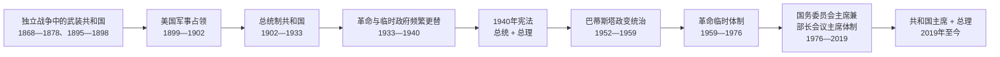

# 古巴国家元首与政府首脑表

## 时间

**1868 年—至今**。主表以 1902 年国际承认的古巴共和国成立为起点；为说明国家合法性来源，另列 1868—1878 年和 1895—1898 年独立战争中的“武装共和国”领导机构。现任信息核验至 **2026 年 7 月 14 日**。

## 概括

古巴的职位名称与实际权力中心多次错位，不能只按“总统名单”理解：

- 1902—1940 年，总统兼具国家元首和政府领导功能；1906—1909 年则由美国临时总督直接统治。
- 1940 年宪法设置总理，形成总统与总理并存的结构，但总统仍掌握主要政治权力。
- 1952 年富尔亨西奥·巴蒂斯塔政变后，宪政职位受军事统治支配；1959 年革命初期，曼努埃尔·乌鲁蒂亚和奥斯瓦尔多·多尔蒂科斯先后担任法定总统，实际最高权力逐渐集中于总理菲德尔·卡斯特罗。
- 1976 年宪法把国家元首、政府首脑与革命领导核心在制度上集中于国务委员会主席兼部长会议主席；古巴共产党第一书记又是政治体系中的最高领导职位。
- 2019 年宪法恢复共和国主席与总理的职位分工，但党、国家主席、全国人民政权代表大会、国务委员会和部长会议仍构成一套不同于竞争性多党议会制的权力体系。

完整历史过程见[西班牙加勒比与古巴](/%E4%BA%BA%E6%96%87%E7%A7%91%E5%AD%A6/%E5%8E%86%E5%8F%B2/%E7%BE%8E%E6%B4%B2/%E5%8A%A0%E5%8B%92%E6%AF%94/%E8%A5%BF%E7%8F%AD%E7%89%99%E5%8A%A0%E5%8B%92%E6%AF%94%E4%B8%8E%E5%8F%A4%E5%B7%B4.md)。

## 独立战争中的武装共和国领导

这些机构由独立军控制区建立，主权范围、首都和行政能力随战局变化，不等同于 1902 年后获得国际承认的共和国，却为后来国家合法性、国旗和宪政传统提供了来源。

### 十年战争时期（1868—1878）

| 顺序 | 领导人 | 职位与任期 | 继承关系 | 关键事件与说明 |
|---|---|---|---|---|
| 1 | **卡洛斯·曼努埃尔·德·塞斯佩德斯** | 起义政府领袖，1868-10-10—1869-04-12；武装共和国总统，1869-04-12—1873-10-27 | 亚拉起义后建立革命政府；瓜伊马罗宪法选为总统 | 宣布奴隶获得自由并发动十年战争；因军政分歧被众议院罢免 |
| 2 | 萨尔瓦多·西斯内罗斯·贝坦库尔 | 总统，1873-10-27—1875-06-28 | 塞斯佩德斯被罢免后继任 | 面对地区主义、军费短缺和西班牙增援；辞职后由议会另选总统 |
| 3 | 胡安·包蒂斯塔·斯波托尔诺 | 总统，1875-06-28—1876-03-29 | 由众议院选出 | 颁布反对擅自议和的法令；战局继续恶化 |
| 4 | 托马斯·埃斯特拉达·帕尔马 | 总统，1876-03-29—1877-10-19 | 接替斯波托尔诺 | 被西班牙军俘获，职位中断；后来成为 1902 年共和国首任总统 |
| 5 | 弗朗西斯科·哈维尔·德·塞斯佩德斯 | 临时总统，1877-10-19—1877-12-13 | 埃斯特拉达·帕尔马被俘后临时主持 | 是卡洛斯·曼努埃尔·德·塞斯佩德斯之弟，在议会另选总统前维持政府 |
| 6 | 比森特·加西亚·冈萨雷斯 | 总统，1877-12-13—1878-02-10 | 由残存革命机构推举 | 《桑洪和约》结束主要战事，武装共和国事实上解体 |
| 补充 | 曼努埃尔·德·赫苏斯·卡尔瓦尔 | 巴拉瓜抗议后临时政府主席，1878-03-16—1878-05-28 | 安东尼奥·马塞奥拒绝接受未废奴、未独立的和约后建立 | 组织最后抵抗，最终因兵力和补给枯竭停止作战 |

### 1895 年独立战争时期

| 顺序 | 领导人或机构 | 职位与任期 | 继承关系 | 关键事件与说明 |
|---|---|---|---|---|
| 1 | 萨尔瓦多·西斯内罗斯·贝坦库尔 | 政府委员会主席，1895-09-18—1897-10-30 | 希马瓜尤宪法建立第二次武装共和国 | 与总司令马克西莫·戈麦斯、安东尼奥·马塞奥等军事领导人分掌文武权力 |
| 2 | 巴托洛梅·马索 | 政府委员会主席，1897-10-30—1898-11-07 | 拉亚亚宪法后继任 | 在美西战争和西班牙撤退过程中维护独立政府的代表权 |
| 3 | 多明戈·门德斯·卡波特 | 革命代表大会执行委员会主席，1898-11-07—1898-11-10 | 战时政府改组为代表大会机构 | 处理独立军复员与美国占领当局关系 |
| 4 | 拉斐尔·波图翁多·塔马约 | 执行委员会主席，1898-11-10—1899-04-04 | 接替门德斯·卡波特 | 在古巴尚未恢复主权时代表革命议会 |
| 5 | 何塞·拉克雷特 | 执行委员会主席，1899-04-04—1899-06-30 | 最后一任革命代表机构首脑 | 革命议会解散，国家行政由美国军事政府控制 |

## 国家元首完整序列（1902 年至今）

### 共和国、第二次美国占领与 1933 年革命（1902—1940）

| 顺序 | 姓名或机构 | 职位 | 在位时间 | 产生与继承关系 | 关键事件与实际权力 |
|---|---|---|---|---|---|
| 1 | **托马斯·埃斯特拉达·帕尔马** | 共和国总统 | 1902-05-20—1906-09-28 | 美国军事政府结束后就任；1905 年争议性连任 | 建立早期共和国财政与行政；反对派起义和美国依据《普拉特修正案》干预后辞职 |
| 占领 1 | 威廉·霍华德·塔夫脱 | 美国临时总督 | 1906-09-29—1906-10-13 | 美国总统西奥多·罗斯福任命 | 接管行政并启动第二次美国占领，仅短期主持过渡 |
| 占领 2 | 查尔斯·爱德华·马贡 | 美国临时总督 | 1906-10-13—1909-01-28 | 接替塔夫脱 | 由美国官僚和驻军直接控制中央政府，安排 1908 年选举后交还政权 |
| 2 | 何塞·米格尔·戈麦斯 | 共和国总统 | 1909-01-28—1913-05-20 | 1908 年选举胜出 | 恢复古巴自治行政；1912 年“有色独立党”起义遭镇压并造成大规模伤亡 |
| 3 | 马里奥·加西亚·梅诺卡尔 | 共和国总统 | 1913-05-20—1921-05-20 | 当选并于 1916 年连任 | 糖业扩张和第一次世界大战繁荣；1917 年自由党起义后再有美国军事介入 |
| 4 | 阿尔弗雷多·萨亚斯 | 共和国总统 | 1921-05-20—1925-05-20 | 1920 年争议选举后就任 | 面对战后糖价崩溃、财政危机和腐败；美国通过财政监督施加影响 |
| 5 | **赫拉尔多·马查多** | 共和国总统，后转为独裁统治 | 1925-05-20—1933-08-12 | 当选后修宪延长任期 | 初期推动公共工程，后以镇压和舞弊维持统治；大萧条、学生和工人运动及军方倒戈迫使其出逃 |
| 临时 1 | 阿尔韦托·埃雷拉·弗兰奇 | 代理总统 | 1933-08-12—1933-08-13 | 马查多出逃后依宪短暂接任 | 在美国斡旋和国内反对下数小时至一日即交权 |
| 临时 2 | 卡洛斯·曼努埃尔·德·塞斯佩德斯—克萨达 | 临时总统 | 1933-08-13—1933-09-05 | 由各方妥协组成临时政府 | 未能控制军队和街头政治，被“军士兵变”推翻 |
| 临时 3 | 五人执政委员会 | 集体临时国家元首 | 1933-09-05—1933-09-10 | 军士兵变和学生革命团体建立 | 成员为拉蒙·格劳、吉列尔莫·波特拉、何塞·米格尔·伊里萨里、塞尔希奥·卡尔沃和波菲里奥·弗兰卡；很快改由格劳任总统 |
| 6 | 拉蒙·格劳·圣马丁 | 临时总统 | 1933-09-10—1934-01-15 | 五人委员会改组 | “百日政府”推行劳工和民族主义改革，但未获美国承认；军方首脑巴蒂斯塔权力上升 |
| 临时 4 | 卡洛斯·埃维亚 | 临时总统 | 1934-01-15—1934-01-18 | 格劳辞职后由革命集团推出 | 无法获得军方稳定支持，三日内辞职 |
| 临时 5 | 曼努埃尔·马克斯·斯特林 | 代理总统 | 1934-01-18（数小时） | 国务卿依继承规则代理 | 为门迭塔就任提供形式过渡 |
| 临时 6 | 卡洛斯·门迭塔 | 临时总统 | 1934-01-18—1935-12-11 | 获巴蒂斯塔军方和美国支持 | 美国废除《普拉特修正案》大部分条款，但古巴国内仍由军方主导；1935 年总罢工遭镇压 |
| 临时 7 | 何塞·阿格里皮诺·巴内特 | 代理／临时总统 | 1935-12-11—1936-05-20 | 外交国务卿依序接任 | 主持 1936 年选举并向民选总统交权 |
| 7 | 米格尔·马里亚诺·戈麦斯 | 共和国总统 | 1936-05-20—1936-12-24 | 1936 年当选 | 因否决巴蒂斯塔支持的农村学校税法，被国会弹劾罢免 |
| 8 | 费德里科·拉雷多·布鲁 | 共和国总统 | 1936-12-24—1940-10-10 | 以副总统身份继任 | 在巴蒂斯塔幕后主导军政的条件下执政；主持制宪进程并向 1940 年宪政政府交权 |

### 1940 年宪法、巴蒂斯塔政变与旧共和国终结（1940—1959）

| 顺序 | 姓名或机构 | 职位 | 在位时间 | 产生与继承关系 | 关键事件与实际权力 |
|---|---|---|---|---|---|
| 9 | **富尔亨西奥·巴蒂斯塔** | 民选共和国总统 | 1940-10-10—1944-10-10 | 依 1940 年宪法当选 | 以跨党联盟执政，古巴参加第二次世界大战；新宪法社会权利广泛，但实施不完整 |
| 10 | 拉蒙·格劳·圣马丁 | 共和国总统 | 1944-10-10—1948-10-10 | 1944 年选举胜出 | 恢复“真正党”文官政府；腐败、帮派暴力与行政失序削弱合法性 |
| 11 | 卡洛斯·普里奥·索卡拉斯 | 共和国总统 | 1948-10-10—1952-03-10 | 1948 年选举胜出 | 延续民选政府但受腐败和政治暴力困扰；在 1952 年大选前被政变推翻 |
| 12a | **富尔亨西奥·巴蒂斯塔** | 政变后的国家元首 | 1952-03-10—1954-08-14 | 军事政变夺权，取消选举并暂停宪法保障 | 军队和警察成为权力支柱；最初兼任政府首脑，后让总理职位空缺 |
| 临时 8 | 安德烈斯·多明戈·德尔卡斯蒂略 | 代理总统 | 1954-08-14—1955-02-24 | 巴蒂斯塔为参加形式选举暂离职时代理 | 行政权仍受巴蒂斯塔控制；1954 年选举缺乏有效竞争 |
| 12b | **富尔亨西奥·巴蒂斯塔** | 总统 | 1955-02-24—1959-01-01 | 1954 年选举后复职 | 革命运动、城市地下组织和游击战扩大；镇压、军队失效和支持联盟瓦解后出逃 |
| 过渡争议 | 安塞尔莫·阿列格罗 | 极短期代理总统 | 1959-01-01—1959-01-02 前后 | 作为副总统被巴蒂斯塔辞职安排推向继任位置 | 是否实际宣誓并有效行使总统权存在名录差异；仅作为数小时的法统过渡列入 |
| 临时 9 | 卡洛斯·曼努埃尔·彼德拉 | 临时总统 | 1959-01-01（数小时） | 最高法院资深法官在军方安排下被指定 | 革命军拒绝承认，哈瓦那旧政权迅速崩溃；部分名录将其视为唯一的当日临时总统 |

### 革命政权与社会主义国家（1959 年至今）

| 顺序 | 姓名 | 职位 | 在位时间 | 产生与继承关系 | 关键事件与实际权力 |
|---|---|---|---|---|---|
| 13 | 曼努埃尔·乌鲁蒂亚·列奥 | 临时共和国总统 | 1959-01-02—1959-07-18 | 革命胜利后由反巴蒂斯塔联盟推举；部分名录以 1 月 3 日为正式履职日 | 早期革命政府的法定元首；与菲德尔·卡斯特罗在革命方向和反共问题上冲突后辞职 |
| 14 | 奥斯瓦尔多·多尔蒂科斯·托拉多 | 共和国总统 | 1959-07-18—1976-12-02 | 接替乌鲁蒂亚 | 是法定国家元首，参与土地改革、猪湾事件、导弹危机和社会主义制度建设；实际最高政治权力在菲德尔·卡斯特罗及革命领导层 |
| 15 | **菲德尔·卡斯特罗** | 国务委员会主席 | 1976-12-02—2008-02-24 | 1976 年宪法实施后由全国人民政权代表大会选举 | 同时任部长会议主席和古共中央第一书记，国家、政府与党权高度集中；2006 年因病将职权临时移交劳尔 |
| 代理 | 劳尔·卡斯特罗 | 代理国务委员会主席、代理部长会议主席 | 2006-07-31—2008-02-24 | 菲德尔因病授权代理 | 在菲德尔仍保留法定职务期间主持日常国家与政府工作；2008 年经选举正式继任 |
| 16 | **劳尔·卡斯特罗** | 国务委员会主席 | 2008-02-24—2018-04-19 | 全国人民政权代表大会选举 | 推动有限经济调整、与美国恢复外交关系；2018 年卸任国家主席，至 2021 年仍任古共中央第一书记 |
| 17a | 米格尔·迪亚斯—卡内尔 | 国务委员会主席 | 2018-04-19—2019-10-10 | 全国人民政权代表大会选举 | 成为革命后首位非卡斯特罗姓氏的国家元首；2019 年宪法改变国家机构名称 |
| 17b | **米格尔·迪亚斯—卡内尔** | 共和国主席 | 2019-10-10—至今 | 2019 年宪法下由全国人民政权代表大会选举；2023 年连任 | 2021 年起兼任古共中央第一书记，因此兼具党和国家最高职位；任内面对经济收缩、能源短缺、移民潮及 2021 年抗议等挑战 |

## 政府首脑完整序列

1940 年以前没有独立于总统的常设总理。下表从 1940 年宪法创设总理开始，连续列出职位空缺、代理和名称变化；“总统／国家元首”列用于辨认名义上的双首长结构。

### 总理制与巴蒂斯塔时期（1940—1959）

| 顺序 | 姓名或状态 | 职位 | 任期 | 同期总统／国家元首 | 继承关系与关键说明 |
|---|---|---|---|---|---|
| 1 | 卡洛斯·萨拉德里加斯·萨亚斯 | 总理 | 1940-10-10—1942-08-16 | 富尔亨西奥·巴蒂斯塔 | 1940 年宪法下首任总理，负责协调内阁；总统仍是主要权力中心 |
| 2 | 拉蒙·萨伊丁 | 总理 | 1942-08-16—1944-03-16 | 富尔亨西奥·巴蒂斯塔 | 接替萨拉德里加斯，继续战时政府运作 |
| 3 | 安塞尔莫·阿列格罗 | 总理 | 1944-03-16—1944-10-10 | 富尔亨西奥·巴蒂斯塔 | 巴蒂斯塔首个总统任期末的政府首脑 |
| 4a | 费利克斯·兰西斯·桑切斯 | 总理 | 1944-10-10—1945-10-13 | 拉蒙·格劳 | 民选政权交替后组阁 |
| 5 | 卡洛斯·普里奥·索卡拉斯 | 总理 | 1945-10-13—1947-05-01 | 拉蒙·格劳 | 后在 1948 年当选总统 |
| 6 | 劳尔·洛佩斯·德尔卡斯蒂略 | 总理 | 1947-05-01—1948-10-10 | 拉蒙·格劳 | 格劳任期末主持内阁 |
| 7 | 曼努埃尔·安东尼奥·德瓦罗纳 | 总理 | 1948-10-10—1950-10-06 | 卡洛斯·普里奥 | 普里奥政府首任总理 |
| 4b | 费利克斯·兰西斯·桑切斯 | 总理（第二次） | 1950-10-06—1951-10-01 | 卡洛斯·普里奥 | 非连续第二次任职 |
| 8 | 奥斯卡·甘斯 | 总理 | 1951-10-01—1952-03-10 | 卡洛斯·普里奥 | 巴蒂斯塔政变时职务终止 |
| 9 | 富尔亨西奥·巴蒂斯塔 | 总理兼国家元首 | 1952-03-10—1952-04-04 | 本人 | 政变后短期以双重职位统治，随后取消独立政府首脑的实际作用 |
| 空缺 | 无独立总理 | 职位空缺 | 1952-04-04—1955-02-24 | 巴蒂斯塔；1954—1955 年由德尔卡斯蒂略代理总统 | 内阁直接服从军事—总统权力中心 |
| 10 | 豪尔赫·加西亚·蒙特斯 | 总理 | 1955-02-24—1957-03-26 | 富尔亨西奥·巴蒂斯塔 | 形式上恢复总理职位，实际受总统和军方支配 |
| 11 | 安德烈斯·里韦罗·阿圭罗 | 总理 | 1957-03-26—1958-03-06 | 富尔亨西奥·巴蒂斯塔 | 后成为 1958 年由政权安排的总统候选人，但未能就任 |
| 12 | 埃米利奥·努涅斯·波图翁多 | 总理 | 1958-03-06—1958-03-12 | 富尔亨西奥·巴蒂斯塔 | 六日短任，反映政权末期内阁不稳 |
| 13 | 贡萨洛·圭尔 | 总理 | 1958-03-12—1959-01-01 | 富尔亨西奥·巴蒂斯塔 | 巴蒂斯塔出逃时旧政府终止 |
| 14 | 何塞·米罗·卡多纳 | 革命临时政府总理 | 1959-01-05—1959-02-13 | 曼努埃尔·乌鲁蒂亚 | 代表温和文官成分；因与革命核心在政策和权力安排上分歧而辞职 |
| 15 | **菲德尔·卡斯特罗** | 总理 | 1959-02-16—1976-12-02 | 乌鲁蒂亚、后为多尔蒂科斯 | 2 月 13—16 日为辞职与接任的短暂过渡；此后总理成为实际最高行政和政治领导职位 |

### 部长会议主席与恢复总理制（1976 年至今）

| 顺序 | 姓名 | 职位 | 任期 | 同期国家元首 | 继承关系与关键说明 |
|---|---|---|---|---|---|
| 16 | **菲德尔·卡斯特罗** | 部长会议主席 | 1976-12-02—2008-02-24 | 本人兼任国务委员会主席 | 1976 年宪法废除“总理”名称；国家元首和政府首脑由同一人担任 |
| 代理 | 劳尔·卡斯特罗 | 代理部长会议主席 | 2006-07-31—2008-02-24 | 代理国务委员会主席 | 菲德尔患病期间主持政府；2008 年正式继任 |
| 17 | **劳尔·卡斯特罗** | 部长会议主席 | 2008-02-24—2018-04-19 | 本人兼任国务委员会主席 | 国家元首与政府首脑继续合一 |
| 18 | 米格尔·迪亚斯—卡内尔 | 部长会议主席 | 2018-04-19—2019-12-21 | 本人；2019-10-10 起任共和国主席 | 2019 年宪法恢复总理后，把日常政府首脑职位移交新任总理 |
| 19 | **曼努埃尔·马雷罗·克鲁斯** | 总理 | 2019-12-21—至今 | 米格尔·迪亚斯—卡内尔 | 2019 年宪法恢复总理职位后的首任；主持部长会议日常行政，但党和国家主席仍居政治体系中心 |

## 党、国家与政府的实际权力关系

| 时期 | 法定国家元首 | 法定政府首脑 | 实际权力中心 | 判断要点 |
|---|---|---|---|---|
| 1902—1933 | 共和国总统 | 总统 | 总统、政党联盟、军队，并受美国条约权利与经济力量制约 | 形式主权与外部干预并存；1906 年危机直接导致美国占领 |
| 1933—1940 | 总统或临时集体机构 | 多由总统领导政府 | 军队首脑巴蒂斯塔、临时总统、美国外交影响之间反复重组 | 职位更替频繁不等于实际权力等量转移 |
| 1940—1952 | 总统 | 总理 | 民选总统、国会、政党与劳工联盟 | 宪法分设两职，但并非总理主导的议会内阁制 |
| 1952—1959 | 巴蒂斯塔或其代理人 | 巴蒂斯塔、空缺或获任命总理 | 巴蒂斯塔及军队、警察和政权联盟 | 总理表只能说明行政名义，不能代表权力独立 |
| 1959—1976 | 乌鲁蒂亚、后为多尔蒂科斯 | 菲德尔·卡斯特罗 | 菲德尔、革命武装领导层，1965 年后以古巴共产党为制度核心 | 多尔蒂科斯是国家元首，但不应据此误判为最高决策者 |
| 1976—2008 | 菲德尔·卡斯特罗 | 菲德尔·卡斯特罗 | 古共中央第一书记兼两项国家职位的菲德尔 | 党、国家、政府首位高度合一 |
| 2008—2018 | 劳尔·卡斯特罗 | 劳尔·卡斯特罗 | 劳尔及共产党领导集体 | 2018 年国家主席交接后，劳尔至 2021 年仍任党第一书记 |
| 2018—2021 | 迪亚斯—卡内尔 | 先由本人兼任，后为马雷罗 | 古共中央第一书记劳尔与国家主席迪亚斯—卡内尔的过渡性分工 | 国家职位代际交接先于党最高职位交接 |
| 2021 年至今 | 迪亚斯—卡内尔 | 马雷罗 | 兼任古共中央第一书记的迪亚斯—卡内尔及党政领导体系 | 总理负责政府日常工作，国家主席同时掌握党内最高职位 |

## 关键断点与辨识

1. **1906—1909 年不是古巴总统之间的普通过渡**：中央行政由美国临时总督直接接管，应作为占领期单列。
2. **1933 年不是一次性政权交接**：马查多倒台后，军队、学生革命团体、传统政客与美国政府之间持续争夺，五人委员会和多个数日临时总统都属于完整序列。
3. **1952 年后的“总统—总理”不构成权力制衡**：巴蒂斯塔以政变掌握军警，职位空缺或任命总理都未改变其最高统治者地位。
4. **1959—1976 年必须区分国家元首和实际领导人**：乌鲁蒂亚、多尔蒂科斯在法律上任总统，菲德尔以总理、革命领袖和后来的党第一书记身份掌握核心决策权。
5. **2006—2008 年是代理而非立即继位**：菲德尔仍保留法定主席职务，劳尔先以代理身份主持党政工作，至 2008 年才正式当选国家和政府首脑。
6. **2019 年的职位分设不等同于多党议会制**：共和国主席、总理和全国人民政权代表大会均在古巴共产党领导的宪制框架内运作；2021 年以后，迪亚斯—卡内尔兼任党第一书记与国家主席。

## 演变关系

- 前一阶段：[西班牙加勒比与古巴](/%E4%BA%BA%E6%96%87%E7%A7%91%E5%AD%A6/%E5%8E%86%E5%8F%B2/%E7%BE%8E%E6%B4%B2/%E5%8A%A0%E5%8B%92%E6%AF%94/%E8%A5%BF%E7%8F%AD%E7%89%99%E5%8A%A0%E5%8B%92%E6%AF%94%E4%B8%8E%E5%8F%A4%E5%B7%B4.md)所述西班牙殖民统治、独立战争与美国军事占领。
- 本表把“国家法统”“政府日常领导”和“实际最高权力”分列，用于解释同一时段内的职位重叠。
- 上级导览：[加勒比历史](/%E4%BA%BA%E6%96%87%E7%A7%91%E5%AD%A6/%E5%8E%86%E5%8F%B2/%E7%BE%8E%E6%B4%B2/%E5%8A%A0%E5%8B%92%E6%AF%94/README.md)。
