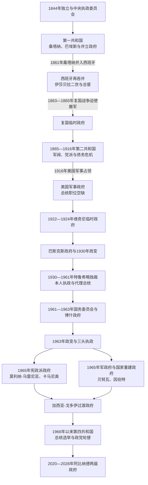

# 多米尼加共和国国家元首表

## 时间

1844年2月27日至2026年7月14日；另列1861—1865年西班牙再吞并、1863—1865年复国战争并立政府、1916—1924年美国占领行政和1965年内战并立政权。

## 范围与口径

本表按“实际接续顺序”记录总统、最高元首、临时政府主席、集体行政机关和占领行政首脑。判断是否列入，不只看后来官方是否把某人计作“第几任总统”，而看其是否曾依法、以政变、以革命政府或以占领当局身份行使国家最高行政权。

- **法定职位与实际权力分列**：特鲁希略时期即使另有总统，拉斐尔·特鲁希略仍掌握军队、执政党、警察和重大决策；美国军事占领时总统职位长期空缺，最高行政权属于美国海军军官。
- **并立政权不强行排成单线**：1857—1858年、1863—1865年、1870年代多次革命和1965年内战存在同时自称中央政府的政权，表中明确标注控制区与承认争议。
- **集体机关列全成员**：国务秘书会议、三人执政团、军政府等没有单一总统时，列出全部已知成员；若设主席，再另标主席。
- **代理总统只列重要的正式接掌**：普通出访期间的短期代行不列；曼努埃尔·德雷格拉·莫塔、哈辛托·佩纳多和埃克托尔·特鲁希略等被总统史单列的代理期保留。
- **日期存在差异时说明口径**：政变发动、首都失守、宣誓就职和正式辞职可能不是同一天；表中优先采用正式职称或权力有效转移日期，并在备注写明重叠。
- **未就任者不进入序列**：例如1849年当选却拒绝就职的圣地亚哥·埃斯派亚特，只在说明中辨识，不算实际国家元首。

## 政权演进图

## 第一共和国（1844—1861）

### 从独立执政委员会到桑塔纳—巴埃斯竞争

| 顺序 | 国家元首 / 集体机关 | 法定职称与在位 | 接续、实际权力与关键事件 |
|---:|---|---|---|
| 1 | 弗朗西斯科·德尔罗萨里奥·桑切斯（Francisco del Rosario Sánchez） | 临时执政委员会主席；1844-02-27—03-01 | 独立宣布后的首位临时最高负责人；新国家尚在组建军队和行政。 |
| 2 | 托马斯·博瓦迪利亚（Tomás Bobadilla y Briones） | 中央执政委员会主席；1844-03-01—约06-01前 | 主持集体行政、立法与司法机关；倾向寻求法国保护，引起“三位一体会”派反对。 |
| 3 | 何塞·马里亚·卡米内罗（José María Caminero Ferrer） | 中央执政委员会主席；约1844-06-01前后—06-09 | 在博瓦迪利亚失势与桑切斯派接管之间短暂主持；具体交接日资料不一。 |
| 4 | 弗朗西斯科·德尔罗萨里奥·桑切斯 | 中央执政委员会主席；1844-06-09—07-13 | 自由派接管委员会；佩德罗·桑塔纳凭南方军队进入首都后将其推翻。 |
| 5 | **佩德罗·桑塔纳**（Pedro Santana Familias） | 最高元首，后兼中央执政委员会主席；1844-07-13—11-13 | 以战争时期军权清洗杜阿尔特派，并推动强总统制宪法；11月转为宪制总统。 |
| 6 | **佩德罗·桑塔纳** | 总统；1844-11-13—1848-08-04 | 首任宪制总统。依宪法第210条取得广泛紧急权，抵御海地进攻并压制政治对手；辞职后由集体机关过渡。 |
| 7 | 国务秘书会议 | 临时掌管行政；1848-08-04—09-08 | 成员：费利克斯·梅尔塞纳里奥、多明戈·德拉罗查、何塞·马里亚·卡米内罗、曼努埃尔·希梅内斯；负责组织继任。 |
| 8 | 曼努埃尔·希梅内斯（Manuel José Jimenes González） | 总统；1848-09-08—1849-05-29 | 在海地再度进攻和军队派系冲突中失势；桑塔纳以恢复秩序名义迫其下台。 |
| 9 | **佩德罗·桑塔纳** | 共和国最高元首；1849-05-30—09-23 | 以南方军总司令和国会授权掌权，未按普通总统任期执政；选举后交出职位。 |
| 10 | **布埃纳文图拉·巴埃斯**（Buenaventura Báez Méndez） | 总统；1849-09-24—1853-02-15 | 形成同桑塔纳长期竞争的另一强人集团；依靠商人、官职和地区网络。 |
| 11 | **佩德罗·桑塔纳** | 总统；1853-02-15—1856-05-26 | 第二个宪制总统阶段；外交保护方案、军费和个人权力仍居核心，最终辞职。 |
| 11a | 曼努埃尔·德雷格拉·莫塔（Manuel de Regla Mota） | 正式代理总统；1855-01-02—09-05，与桑塔纳任期重叠 | 以副总统身份在桑塔纳离开首都或不能履职期间代行；桑塔纳仍是政治与军事主导者。 |
| 12 | 曼努埃尔·德雷格拉·莫塔 | 继任总统；1856-05-26—10-08 | 桑塔纳辞职后接任，财政与军政基础薄弱，数月后辞职并由副总统巴埃斯继承。 |
| 13 | **布埃纳文图拉·巴埃斯** | 总统；1856-10-08—1858-06-12 | 发行缺乏信用的纸币并冲击烟草商与北方精英，触发1857年革命；在圣多明各坚持至桑塔纳围城取胜。 |
| 14 | 何塞·德西德里奥·巴尔韦德（José Desiderio Valverde Pérez） | 圣地亚哥反对政府首脑；1857-07-22—1858-08-28 | 1857-07-22起任临时政府主席，1858-03-01起称总统；北方政府同巴埃斯并立，后又同桑塔纳并立，控制范围逐步丧失。 |
| 15 | **佩德罗·桑塔纳** | 受革命阵营拥立的最高负责人；1858-07-27—1859-01-31 | 原受巴尔韦德阵营邀请围攻巴埃斯，随后排挤巴尔韦德并独揽权力。 |
| 16 | **佩德罗·桑塔纳** | 总统；1859-01-31—1861-03-18 | 面对财政和海地安全焦虑，秘密谈判把共和国并入西班牙；1861年自行废除国家独立地位。 |

1849年圣地亚哥·埃斯派亚特曾被选为总统，但担心桑塔纳掣肘而拒绝就职，故不列为实际元首。第一共和国的反复交替也不能只理解为两个人的私斗：军队地区化、薄弱税基、海地战争压力、烟草与进口商利益、外国保护诉求和宪法紧急权共同使强人政治持续。

## 西班牙再吞并与复国战争（1861—1865）

### 西班牙主权与当地殖民行政

1861年3月18日以后，独立共和国被桑塔纳宣布并入西班牙。法理上的国家元首转为西班牙女王伊莎贝拉二世；圣多明各当地由总督兼都督代表王权。1863年复国政府建立后，两套政权并存，不能把西班牙总督和复国总统排成没有重叠的一条线。

| 顺序 | 主权者 / 行政首脑 | 在位或任职 | 法定地位与实际权力 |
|---:|---|---|---|
| A1 | 西班牙女王伊莎贝拉二世（Isabel II） | 1861-03-18—1865-05-01撤销并入法令；西军至07-11撤清 | 西班牙君主和法定主权者；多米尼加不再有共和国总统。 |
| A2 | **佩德罗·桑塔纳** | 事实行政首脑；1861-03-18—07-09 | 在正式总督机构成立前以女王名义发布命令；从共和国总统转为殖民官。 |
| A3 | **佩德罗·桑塔纳** | 圣多明各总督兼都督；1861-07-09—1862-07-20 | 西班牙认可其军政地位并封拉斯卡雷拉斯侯爵；因同半岛官员冲突辞职。 |
| A4 | 费利佩·里韦罗（Felipe Ribero y Lemoine） | 总督兼都督；1862-07-20—1863-10-23 | 推进殖民税制、军役和行政整合；复国战争在其任内爆发。 |
| A5 | 卡洛斯·德巴尔加斯（Carlos de Vargas Machuca y Cerveto） | 总督兼都督；1863-10-23—1864-03-29 | 西军控制主要港市，但难以消灭山地复国军。 |
| A6 | 何塞·德拉甘达拉（José de la Gándara y Navarro） | 总督兼都督；1864-03-29—1865-05-01，留任至07-11撤离 | 组织最后大规模作战与撤军；正式并入撤销后仍负责移交和部队撤离。 |

### 复国临时政府与共和国恢复

| 顺序 | 复国政府最高负责人 | 职称与在位 | 接续、控制与重要事件 |
|---:|---|---|---|
| R1 | 何塞·安东尼奥·萨尔塞多（José Antonio Salcedo y Ramírez） | 临时政府总统，后称共和国政府总统；1863-09-14—1864-10-10 | “卡普蒂略呼声”后在圣地亚哥建立复国政府；因战争路线和与西班牙谈判争议被推翻，后遭处决。 |
| R2 | 加斯帕尔·波兰科（Gaspar Polanco y Borbón） | 临时政府总统；1864-10-10—1865-01-23 | 强化军事攻势并抵制妥协；内部政变使其下台。 |
| R3 | 远征将领三人临时行政 | 1865-01-23—01-24 | 佩德罗·安东尼奥·皮门特尔、贝尼托·蒙西翁、费德里科·德赫苏斯·加西亚共同代行一天。 |
| R4 | 贝尼格诺·菲洛梅诺·德罗哈斯（Benigno Filomeno de Rojas） | 最高执政委员会主席，后为国民大会主席；1865-01-24—03-25 | 组织制宪与军政过渡；正式选出皮门特尔。 |
| R5 | 佩德罗·安东尼奥·皮门特尔（Pedro Antonio Pimentel） | 总统兼行政负责人；1865-03-25—08-04 | 西班牙5月决定撤军、7月离开圣多明各；复国完成后仍短暂执政，随后被卡夫拉尔政变推翻。 |

复国胜利来自山地游击、北方烟草经济与地方网络、西班牙军费和疾病损失、帝国国内政治压力的叠加。1865年不是“总统自然复位”，而是另一套共和国政府在战争中取代殖民行政。

## 第二共和国（1865—1916）

### 复国后军阀竞争与制度反复（1865—1879）

| 顺序 | 国家元首 / 集体机关 | 法定职称与在位 | 接续、实际权力与关键事件 |
|---:|---|---|---|
| 17 | 何塞·马里亚·卡夫拉尔（José María Cabral y Luna） | “共和国保护者”；1865-08-04—11-15 | 推翻皮门特尔，召集国民会议；未立刻使用普通总统称号。 |
| 18 | 佩德罗·吉列尔莫（Pedro Guillermo y Guerrero） | 临时行政负责人；1865-11-15—12-08 | 等候流亡的巴埃斯回国就任。 |
| 19 | **布埃纳文图拉·巴埃斯** | 总统；1865-12-08—1866-05-28/29 | 在反对派军事压力下避入法国领事馆且未正式签署辞职；5月29日政权才移交三人团。 |
| 20 | 共和国三人执政团 | 1866-05-01起在圣地亚哥反叛，05-29控制首都—08-22 | 成员：佩德罗·安东尼奥·皮门特尔、格雷戈里奥·卢佩龙、费德里科·德赫苏斯·加西亚；废除旧选举人团并准备直接选举。 |
| 21 | 何塞·马里亚·卡夫拉尔 | 公共行政首脑兼行政负责人；1866-08-22—09-29 | 三人团后的临时接管。 |
| 22 | 何塞·马里亚·卡夫拉尔 | 总统；1866-09-29—1868-01-31 | 经直接选举就任；债务、军队和巴埃斯派叛乱使其失势。 |
| 22a | 何塞·安东尼奥·洪格里亚（José Antonio Hungría） | 圣地亚哥并立中央执政委员会主席；1867-12-22—1868-02-13 | 以迎回巴埃斯为目标反叛卡夫拉尔；首都政权倒台后并入新的军政府。 |
| 23 | 曼努埃尔·阿尔塔格拉西亚·卡塞雷斯（Manuel Altagracia Cáceres） | 首都临时军事行政；1868-01-31—02-13 | 卡夫拉尔离开后短暂控制圣多明各；不是稳定全国政府。 |
| 24 | 将领执政委员会 | 1868-02-13—05-02 | 成员：何塞·安东尼奥·洪格里亚、弗朗西斯科·安东尼奥·戈麦斯·巴埃斯、何塞·拉蒙·卢西亚诺；为巴埃斯回国过渡。 |
| 25 | **布埃纳文图拉·巴埃斯** | 总统；1868-05-02—1874-01-02 | “六年政府”。试图把国家并入美国并租让萨马纳，引发长期反对战争；败于伊格纳西奥·冈萨雷斯革命。 |
| 25a | 伊格纳西奥·马里亚·冈萨雷斯（Ignacio María González） | 革命最高首脑；1873-11-27—1874-01-02，与巴埃斯并立 | 革命先在东部形成，迫使巴埃斯下台后成为全国元首。 |
| 26 | 伊格纳西奥·马里亚·冈萨雷斯 | 共和国最高元首；1874-01-02—01-21 | 革命胜利后的单独过渡。 |
| 27 | 冈萨雷斯与曼努埃尔·阿尔塔格拉西亚·卡塞雷斯 | 受托掌握国家最高权力的两名将领；1874-01-21—04-06 | 卡塞雷斯缺席后，冈萨雷斯自2月5日起实质单独行权。 |
| 28 | 伊格纳西奥·马里亚·冈萨雷斯 | 总统；1874-04-06—1876-02-23 | 中途多次改变正式职称但权力连续；在政变压力下辞职。 |
| 29 | 国务秘书会议 | 临时掌管行政；1876-02-23—04-29 | 成员：佩德罗·托马斯·加里多、何塞·德赫苏斯·爱德华多·德卡斯特罗、佩德罗·巴勃罗·德博尼利亚、胡安·包蒂斯塔·萨夫拉、巴勃罗·洛佩斯·比利亚努埃瓦；3月7日起哈辛托·佩纳多替代洛佩斯。 |
| 30 | 乌利塞斯·弗朗西斯科·埃斯派亚特（Ulises Francisco Espaillat） | 总统；1876-04-29—10-05 | 试图以文官、廉政和法治治理，却缺少稳定军队和地方强人支持，被起义推翻。 |
| 30a | 加维诺·克雷斯波（Gabino Crespo） | “复国运动”并立委员会主席；约1876-10—10-30 | 地方性反政府主张者；未成为稳定全国元首。 |
| 31 | 最高执政委员会 | 1876-10-05—11-11 | 成员：佩德罗·托马斯·加里多、何塞·德赫苏斯·爱德华多·德卡斯特罗、胡安·包蒂斯塔·萨夫拉、巴勃罗·洛佩斯·比利亚努埃瓦、何塞·卡米内罗·马蒂亚斯、菲德尔·罗德里格斯·乌尔达内塔、胡安·埃斯特班·阿里萨；等候冈萨雷斯接管。 |
| 32 | 伊格纳西奥·马里亚·冈萨雷斯 | 总统兼国家最高首脑；1876-11-11—12-09 | 再次掌权但仅维持不足一个月，辞职后由临时委员会过渡。 |
| 33 | 马科斯·安东尼奥·卡夫拉尔（Marcos Antonio Cabral） | 临时政府委员会主席；1876-12-10—12-26 | 为巴埃斯第五次执政准备交接。 |
| 34 | **布埃纳文图拉·巴埃斯** | 临时总统后为总统；1876-12-27—1878-03-02 | 第五次也是最后一次执政；在全国运动和政变中下台。 |
| 34a | 伊格纳西奥·马里亚·冈萨雷斯 | 全国运动临时政府总统；1878-03-01—04-13，与巴埃斯末期及东部政府并立 | 革命政府之一；没有立即控制全部国家。 |
| 35 | 国务秘书会议 | 临时掌管行政；1878-03-02—03-05 | 成员：何塞·马里亚·卡夫拉尔、华金·安东尼奥·蒙托利奥；旧政府崩溃后的三日过渡。 |
| 36 | 塞萨雷奥·吉列尔莫（Cesáreo Guillermo y Bastardo） | 东部与南部拥立的临时政府总统；1878-03-05—07-06 | 在多方革命中取得优势，组织冈萨雷斯就任。 |
| 37 | 伊格纳西奥·马里亚·冈萨雷斯 | 宪制总统；1878-07-06—09-02 | 再次就任，两个月后被军人运动推翻。 |
| 38 | 乌利塞斯·厄鲁与塞萨雷奥·吉列尔莫 | 革命运动最高首领；1878-09-02—09-06 | 两名将领共同接管四日。 |
| 39 | 哈辛托·德卡斯特罗（Jacinto de Castro） | 最高法院院长代行总统；1878-09-06—09-30 | 依宪法继任，因无法稳定军政而辞职。 |
| 40 | 三人行政机关 | 1878-09-30—1879-02-27 | 成员：塞萨雷奥·吉列尔莫、亚历杭德罗·安古洛·古里迪、佩德罗·马里亚·阿里斯蒂；以“行政权”或国务秘书会议名义执政。 |
| 41 | 塞萨雷奥·吉列尔莫 | 总统；1879-02-27—12-06 | 同蓝党与北方力量战争；卢佩龙政府自10月起并立，吉列尔莫败退。 |
| 41a | **格雷戈里奥·卢佩龙**（Gregorio Luperón） | 临时政府总统；1879-10-07—1880-09-01 | 先在普拉塔港与吉列尔莫并立，12月后成为全国政府；确立蓝党阶段。 |

### 蓝党国家、厄鲁独裁与美国介入前危机（1879—1916）

| 顺序 | 国家元首 / 集体机关 | 法定职称与在位 | 接续、实际权力与关键事件 |
|---:|---|---|---|
| 42 | 费尔南多·阿图罗·德梅里尼奥（Fernando Arturo de Meriño） | 总统；1880-09-01—1882-09-01 | 教士出身的蓝党总统；以紧急措施镇压叛乱，中央行政逐渐稳定。 |
| 43 | **乌利塞斯·厄鲁**（Ulises Heureaux，“利利斯”） | 总统；1882-09-01—1884-09-01 | 首个正式任期，军队、情报和地方首领网络开始个人化。 |
| 44 | 弗朗西斯科·格雷戈里奥·比利尼（Francisco Gregorio Billini） | 总统；1884-09-01—1885-05-16 | 面对厄鲁派干预和军政压力辞职。 |
| 45 | 亚历杭德罗·沃斯-希尔（Alejandro Woss y Gil） | 副总统继任；1885-05-16—1887-01-06 | 完成比利尼任期，实际政治空间受厄鲁影响。 |
| 46 | **乌利塞斯·厄鲁** | 总统；1887-01-06—1889-02-27 | 以选举与强制手段连任，扩展军队、秘密警察、借款和个人庇护网。 |
| — | 总统职位短暂无宣誓就任者 | 1889-02-27—03-01 | 旧任期届满而新一届正副总统尚未宣誓；并非另一名元首。 |
| 47 | 曼努埃尔·马里亚·戈捷（Manuel María Gautier） | 副总统代行总统；1889-03-01—04-22 | 新任期宣誓延误时依法代行；不是独立政治政权。 |
| 48 | **乌利塞斯·厄鲁** | 总统；1889-04-22—1899-07-26 | 长期独裁阶段；外债、货币发行与镇压集中化，遇刺后财政与政治联盟迅速瓦解。 |
| 49 | 胡安·文塞斯劳·菲格雷奥（Wenceslao Figuereo） | 副总统继任；1899-07-26—08-30 | 厄鲁遇刺后试图维持旧政权，被革命推翻。 |
| 50 | 国务秘书会议 | 1899-08-30—08-31 | 成员：托马斯·德梅特里奥·莫拉莱斯、阿里斯蒂德斯·帕蒂尼奥、恩里克·恩里克斯-阿尔福、海梅·比达尔、布劳略·阿尔瓦雷斯；只维持一天。 |
| 51 | 人民革命执政委员会 | 1899-08-31—09-04 | 成员：马里亚诺·塞斯特罗、阿尔瓦罗·洛格罗尼奥、阿里斯蒂德斯·帕蒂尼奥、佩德罗·马里亚·梅希亚。 |
| 51a | **奥拉西奥·巴斯克斯**（Horacio Vásquez） | 革命临时政府总统；1899-08-29—11-15 | 革命政府成立时间早于旧政权完全结束；9月后控制全国，为希梅内斯就职过渡。 |
| 52 | 胡安·伊西德罗·希梅内斯（Juan Isidro Jimenes Pereyra） | 总统；1899-11-15—1902-05-02 | 希梅内斯派与巴斯克斯派由联盟转为竞争；外债与军权争议使其被政变推翻。 |
| 53 | **奥拉西奥·巴斯克斯** | 临时政府总统；1902-04-26—1903-04-23 | 起义政府在希梅内斯最后数日已并立；次年又被沃斯-希尔革命推翻。 |
| 53a | 亚历杭德罗·沃斯-希尔 | 革命临时政府总统；1903-03-23—08-01，与巴斯克斯末期并立 | 4月取得全国控制，8月转为正式总统。 |
| 54 | 亚历杭德罗·沃斯-希尔 | 总统；1903-08-01—11-24 | “联合派”革命很快又被卡洛斯·莫拉莱斯推翻。 |
| 54a | 卡洛斯·费利佩·莫拉莱斯·兰瓜斯科（Carlos Felipe Morales Languasco） | 革命临时政府总统；1903-10-24—1904-04-19 | 先同沃斯-希尔并立，11月后控制首都；1904年转为宪制总统。 |
| 55 | 卡洛斯·费利佩·莫拉莱斯·兰瓜斯科 | 总统；1904-04-19—1905-12-24，形式职权争议延至1906-01-12 | 接受美国关税接管安排以处理外债；同副总统卡塞雷斯决裂后出逃并辞职。 |
| 56 | 国务秘书会议 | 1905-12-24—12-29 | 成员：曼努埃尔·拉马尔切、埃米利亚诺·特赫拉、安德烈斯·蒙托利奥、弗朗西斯科·巴斯克斯·拉哈拉、卡洛斯·希内夫拉、埃拉迪奥·维多利亚、费德里科·贝拉斯克斯；在莫拉莱斯出逃后过渡。 |
| 57 | **拉蒙·卡塞雷斯**（Ramón Cáceres） | 副总统接掌，后为总统；1905-12-29起事实行权，1906-01-12正式接续—1911-11-19 | 借美国海关稳定收入、裁并地方军阀并建设中央国家；1911年遇刺，引发新内战。 |
| 58 | 国务秘书会议 | 1911-11-19—12-06 | 成员：米格尔·安东尼奥·罗曼、何塞·马里亚·卡夫拉尔-巴埃斯、曼努埃尔·德赫苏斯·特龙科索、费德里科·贝拉斯克斯、曼努埃尔·拉马尔切、拉斐尔·迪亚斯；埃米利奥·特赫拉任至11月30日。 |
| 59 | 埃拉迪奥·维多利亚（Eladio Victoria） | 临时总统后为总统；1911-12-06—1912-11-30 | 由国会选出；其军政亲族集团同反对派内战，美国调停后辞职。 |
| 60 | 阿道尔福·亚历杭德罗·诺埃尔（Adolfo Alejandro Nouel） | 临时总统；1912-12-01—1913-04-13 | 圣多明各大主教，以调停者身份组建过渡政府；无法平息派系而辞职。 |
| 61 | 何塞·博尔达斯·巴尔德斯（José Bordas Valdés） | 宪制临时总统；1913-04-14—1914-08-27 | 选举争议和1914年内战扩大，美国施压组织新过渡。 |
| 62 | 拉蒙·巴埃斯（Ramón Báez Machado） | 临时总统；1914-08-27—12-05 | 负责相对中立的选举过渡。 |
| 63 | 胡安·伊西德罗·希梅内斯 | 总统；1914-12-05—1916-05-07 | 同战争部长德西德里奥·阿里亚斯冲突，美国以海关、债务和防止内战为由登陆；希梅内斯拒绝在美军保护下执政而辞职。 |
| 64 | 国务秘书会议 | 临时掌管行政；1916-05-07—07-31 | 主要成员：海梅·莫塔、贝尔纳多·皮查尔多、何塞·曼努埃尔·希梅内斯，后由费德里科·贝拉斯克斯接替；在美军控制扩大时维持名义行政。 |
| 65 | 弗朗西斯科·恩里克斯-卡瓦哈尔（Francisco Henríquez y Carvajal） | 总统；1916-07-31—11-29 | 国会选出的临时总统，拒绝接受美国财政和军事条件；美国不承认并以军事政府取代。 |

## 美国占领与民族政府过渡（1916—1924）

美国没有把多米尼加共和国正式并入本国，但1916年11月29日解散或停摆本国政治机关，以美国海军军官发布行政命令、控制财政和指挥军队。因而“国家仍存在”与“没有本国国家元首”可以同时成立。1922年维奇尼政府恢复本国总统职位，美军和美国监督仍延续到1924年选举及撤军。

| 顺序 | 最高行政首脑 / 本国职位 | 任职 | 法定地位与实际权力 |
|---:|---|---|---|
| U1 | 多米尼加总统职位空缺 | 1916-11-29—1922-10-21 | 军事政府取代本国总统、暂停国会并以行政命令立法；国家主权未被美国正式吞并，但本国没有独立最高行政首脑。 |
| U2 | 哈里·谢泼德·纳普（Harry Shepard Knapp） | 军事政府首脑、后称军事总督；1916-11-29—1918-11-18 | 美国海军军官，宣布军事政府并掌握行政、财政与治安；1917年职称正式改为军事总督。 |
| U3 | 本·希巴德·富勒（Ben Hebard Fuller） | 代理军事总督；1918-11-18—1919-02-25 | 在纳普离任与斯诺登到任之间代行占领行政。 |
| U4 | 托马斯·斯诺登（Thomas Snowden） | 军事总督；1919-02-25—1921-06-03 | 扩大道路、中央财政和国民卫队，同时镇压东部“加维列罗”农村抵抗。 |
| U5 | 塞缪尔·谢尔本·罗比森（Samuel Shelburn Robison） | 军事总督；1921-06-03—1922-10-21 | 面对国内外撤军压力，执行由美国监督的政治过渡；把行政交给维奇尼临时政府。 |
| U6 | 胡安·包蒂斯塔·维奇尼·布尔戈斯（Juan Bautista Vicini Burgos） | 临时总统；1922-10-21—1924-07-12 | 按撤军协议组建本国政府，承认占领时期法令和债务安排并组织选举；实际仍受美国驻军、海关与选举监督制约。 |
| U7 | **奥拉西奥·巴斯克斯** | 总统；1924-07-12起 | 经监督选举就任，恢复常规本国政府；美军至1924-09-18才完成撤离，美国海关监督继续。 |

占领政府建设全国道路、整顿预算并建立集中化国民卫队，但其合法性来自外军而非多米尼加选举；审查、军事法庭和反游击镇压造成长期创伤。新国民卫队削弱地方军阀，却也为拉斐尔·特鲁希略垄断国家暴力提供组织基础。

## 从巴斯克斯到特鲁希略独裁及其余波（1924—1962）

### 本人总统、代理总统与实际最高权力

| 顺序 | 法定国家元首 | 任期 | 实际最高权力与关键事件 |
|---:|---|---|---|
| T1 | **奥拉西奥·巴斯克斯** | 1924-07-12—1930-03-02 | 选举政府恢复后延长任期并谋求继续执政，反对派起义时国民军司令特鲁希略拒绝保卫政府，迫使其辞职。 |
| T2 | 拉斐尔·埃斯特雷利亚·乌雷尼亚（Rafael Estrella Ureña） | 1930-03-02/03—04-22 | 由内政部长依继任安排宣誓，但军队由特鲁希略控制；为特鲁希略竞选清场。 |
| T3 | 哈辛托·比恩韦尼多·佩纳多（Jacinto Bienvenido Peynado） | 正式代理；1930-04-22—05-21 | 埃斯特雷利亚暂离职期间代理；特鲁希略仍是决定性军政力量。 |
| T4 | 拉斐尔·埃斯特雷利亚·乌雷尼亚 | 复任；1930-05-21—08-16 | 完成过渡，把总统职位交给在受胁迫选举中胜出的特鲁希略。 |
| T5 | **拉斐尔·莱昂尼达斯·特鲁希略**（Rafael Leónidas Trujillo Molina） | 总统第一届；1930-08-16—1934-08-16 | 兼有总统、军队与执政联盟控制，借飓风重建、清洗和谋杀摧毁反对派。 |
| T6 | **拉斐尔·特鲁希略** | 总统第二届；1934-08-16—1938-08-16 | 独裁制度巩固；1937年边境“香芹大屠杀”显示个人命令、军警和反海地种族政治结合。 |
| T7 | 哈辛托·比恩韦尼多·佩纳多 | 总统；1938-08-16—1940-03-07 | 法定元首，任内病逝；重大人事、军队、党务和经济决策仍由特鲁希略决定。 |
| T8 | 曼努埃尔·德赫苏斯·特龙科索（Manuel de Jesús Troncoso de la Concha） | 副总统继任；1940-03-07—1942-05-18 | 形式完成佩纳多任期；特鲁希略以“大元帅”、执政党首脑和私人办公室统治。 |
| T9 | **拉斐尔·特鲁希略** | 总统；1942-05-18—1947-08-16 | 先补足原任期再开启新任期；法律职位和实际独裁权重新合一。 |
| T10 | **拉斐尔·特鲁希略** | 总统；1947-08-16—1952-08-16 | 冷战反共、家族企业和安全机构扩大；流亡者1949、1959年远征均遭镇压。 |
| T10a | 埃克托尔·比恩韦尼多·特鲁希略（Héctor Trujillo Molina） | 正式代理总统；1951-03-01—10-01，与T10重叠 | 拉斐尔仍是宪制总统与独裁者；其弟只在规定期间代行日常总统职权。 |
| T11 | 埃克托尔·特鲁希略 | 总统第一届；1952-08-16—1957-08-16 | 法定元首和代理人物；拉斐尔以军队总司令、执政党首脑和家族统治者掌握最高权力。 |
| T12 | 埃克托尔·特鲁希略 | 总统第二届；1957-08-16—1960-08-03 | 国际压力、1959年远征和天主教会反对削弱政权；依拉斐尔命令辞职。 |
| T13 | 华金·巴拉格尔（Joaquín Balaguer） | 副总统继任；1960-08-03—1961-05-30 | 法定总统，仍是特鲁希略代理；拉斐尔直至遇刺都掌控军队、警察与国家。 |
| T14 | 华金·巴拉格尔 | 总统；1961-05-30—1962-01-16 | 特鲁希略遇刺后不再是代理总统；1961年中实际强制权先由拉姆菲斯·特鲁希略、家族和军方掌握，11月家族出走后巴拉格尔、军方、反对派与美国压力共同塑造过渡。 |

特鲁希略的统治应按1930—1961年连续计算，而不能只相加他亲自担任总统的年份。佩纳多、特龙科索、埃克托尔和早期巴拉格尔签署法令、主持内阁，具有真实法定职务；但他们不能独立任免军警或改变政权核心路线，实际最高统治者始终是拉斐尔·特鲁希略。

## 独裁终结、1963年政变与三头执政（1961—1965）

| 顺序 | 国家元首 / 集体机关 | 法定职称与在位 | 接续、实际权力与关键事件 |
|---:|---|---|---|
| S1 | 巴拉格尔主持的国务委员会 | 1962-01-01—01-16，与其总统任期末重叠 | 成员：华金·巴拉格尔（主席）、拉斐尔·博内利（副主席）、爱德华多·里德·巴雷拉斯（第二副主席）、埃利塞奥·佩雷斯·桑切斯、尼古拉斯·皮查尔多、路易斯·阿米亚马·蒂奥、安东尼奥·因伯特；试图以集体机关扩大过渡合法性。 |
| S2 | 公民—军事委员会 | 1962-01-16—01-17 | 成员：阿曼多·帕切科、路易斯·阿米亚马·蒂奥、安东尼奥·因伯特、恩里克·巴尔德斯·比道雷、威尔弗雷多·梅迪纳；政变推翻巴拉格尔后短暂集体执政。 |
| S3 | 乌韦托·博加特（Huberto Bogaert） | 公民—军事委员会主席；1962-01-17—01-18 | 军政府无法获得社会和国际支持，只维持约一天。 |
| S4 | 拉斐尔·菲利韦托·博内利（Rafael Filiberto Bonnelly） | 过渡总统兼国务委员会主席；1962-01-18—1963-02-27 | 委员包括爱德华多·里德、埃利塞奥·佩雷斯、尼古拉斯·皮查尔多、路易斯·阿米亚马、安东尼奥·因伯特、唐纳德·里德；组织特鲁希略后首次竞争性大选。 |
| S5 | **胡安·博什**（Juan Bosch） | 总统；1963-02-27—09-25 | 民选总统，以1963年宪法推进公民权、文人控制与社会改革；军方、教会、企业和冷战反共联盟发动政变。 |
| S6 | 维克托尔·埃尔温·比尼亚斯·罗曼（Víctor Elvin Viñas Román） | 武装力量临时军政府主席；1963-09-25—09-26 | 政变后一天内把权力转给三人执政机关。 |
| S7 | 三头执政机关，埃米利奥·德洛斯桑托斯（Emilio de los Santos）任主席 | 1963-09-26—12-22 | 成员：德洛斯桑托斯、曼努埃尔·恩里克·塔瓦雷斯·埃斯派亚特、拉蒙·塔皮亚·埃斯皮纳尔；正式为集体机关，实际依赖军方高层。德洛斯桑托斯因游击队员被杀等事件辞职。 |
| S7a | 胡安·卡萨斯诺瓦斯·加里多（Juan Casasnovas Garrido） | 并立“宪制临时总统”；1963-10-13—11-04 | 博什支持者在反政变行动中拥立，控制有限，遭军方击败；必须同三头执政并列而非顺接。 |
| S8 | 三头执政机关，唐纳德·里德·卡夫拉尔（Donald Reid Cabral）为主席和事实行政首脑 | 1963-12-22获任、12-30宣誓—1965-04-25 | 塔皮亚任至1964-04-08，后由拉蒙·卡塞雷斯·特龙科索接替；塔瓦雷斯任至1964-06-27，此后机关实为里德与卡塞雷斯两人。紧缩、腐败指控和恢复博什宪法的军人密谋引发1965年起义。 |

1963年后“主席”并不等于能独立统率军队。军种首脑、圣伊西德罗基地集团、商业与教会反共力量构成三头执政的强制后盾；反对派则把恢复博什及1963年宪法作为合法性核心。

## 1965年内战的并立国家元首

1965年4月起义后，全国没有单一、持续且被各方承认的最高权力。宪政派以1963年宪法和原国会为依据；忠于军方旧秩序的一方先建军政府，后建“国家重建政府”；美国4月28日出兵，随后美洲国家组织的美洲和平部队介入。下表按两条并立线记录。

| 阵营 / 顺序 | 最高机关或负责人 | 在位 | 法定主张、控制与结果 |
|---|---|---|---|
| 宪政派 C1 | 革命委员会 | 1965-04-25，当日过渡 | 成员：比尼西奥·费尔南德斯、乔瓦尼·古铁雷斯、弗朗西斯科·卡马尼奥、埃拉迪奥·拉米雷斯、佩德罗·巴托洛梅·贝努瓦；起义军内部很快分化。 |
| 宪政派 C2 | 何塞·拉斐尔·莫利纳·乌雷尼亚（José Rafael Molina Ureña） | 宪制临时总统；1965-04-25—04-27 | 依博什派继任安排出任，空袭和美方拒绝支持后避入使馆并辞职。 |
| 全国权力断裂 | 无被普遍承认的全国元首 | 1965-04-27—05-01 | 宪政派继续控制首都部分街区；忠诚派掌握空军基地，4月28日美国军队登陆。 |
| 忠诚派 L1 | 军事执政委员会 | 1965-04-25—05-01 | 主要成员：佩德罗·巴托洛梅·贝努瓦、奥尔戈·桑塔纳·卡拉斯科、恩里克·卡萨多·萨拉丁；同宪政派并立。 |
| 忠诚派 L2 | 佩德罗·巴托洛梅·贝努瓦（Pedro Bartolomé Benoit） | 军事政府委员会主席；1965-05-01—05-07 | 忠诚派军政府改组，无法建立广泛文官合法性。 |
| 宪政派 C3 | **弗朗西斯科·阿尔韦托·卡马尼奥**（Francisco Alberto Caamaño Deñó） | 宪制总统；1965-05-04—09-03 | 由1963年当选议员组成的会议拥立，控制圣多明各宪政派区域；获得部分社会支持但未被美国承认为全国政府。 |
| 忠诚派 L3 | **安东尼奥·因伯特·巴雷拉**（Antonio Imbert Barrera）主持国家重建政府 | 1965-05-07—08-30 | 成员：因伯特、卡洛斯·格里索利亚、亚历杭德罗·塞列尔、佩德罗·贝努瓦、胡利奥·波斯蒂戈（至08-10），后由莱昂特·贝尔纳德·巴斯克斯接替；依军方和美国控制区运行。 |
| 协议过渡 | 两个敌对政府解除并立 | 1965-08-30—09-03 | 因伯特政府辞职，卡马尼奥仍保留宪政派职位至9月3日；《多米尼加和解法案》确定共同过渡。 |
| 统一过渡 C4 | 埃克托尔·加西亚-戈多伊（Héctor García-Godoy） | 临时总统；1965-09-03—1966-07-01 | 经双方和美洲国家组织斡旋接受，恢复单一行政、安排解除武装和1966年选举；外国部队逐步撤离。 |

## 第四共和国的全部总统（1966—2026）

1966年后总统一般同时是国家元首和政府首脑。第一阶段仍受1965年干预、特鲁希略时代安全机关和军方影响；1978年以后政党轮替逐步制度化，但选举公平、连任规则、总统集权与腐败仍不断引发改革。

| 顺序 | 总统 | 政党 | 任期 | 继承、选举与重要事件 |
|---:|---|---|---|---|
| 66 | **华金·巴拉格尔** | 社会基督教改革党（PRSC） | 1966-07-01—1970-08-16 | 在外国部队尚未完全撤离、反对派受压条件下当选；以建设、军警和反左翼镇压巩固“十二年统治”。 |
| 67 | **华金·巴拉格尔** | PRSC | 1970-08-16—1974-08-16 | 主要反对力量抵制或受限，安全机构和行政资源维持执政优势。 |
| 68 | **华金·巴拉格尔** | PRSC | 1974-08-16—1978-08-16 | 连续第三届；1978年选举中军方一度阻止计票，国内外压力迫使其接受败选。 |
| 69 | 西尔韦斯特雷·安东尼奥·古斯曼（Antonio Guzmán Fernández） | 多米尼加革命党（PRD） | 1978-08-16—1982-07-04 | 实现现代首次执政党和平交替，释放政治犯并调整军方；在任内自杀。 |
| 70 | 哈科沃·马赫卢塔（Jacobo Majluta Azar） | PRD | 1982-07-04—08-16 | 以副总统身份完成古斯曼余任，确保向当选总统移交。 |
| 71 | 萨尔瓦多·豪尔赫·布兰科（Salvador Jorge Blanco） | PRD | 1982-08-16—1986-08-16 | 债务紧缩与1984年抗议镇压削弱政府；卸任后因腐败案件受审。 |
| 72 | **华金·巴拉格尔** | PRSC | 1986-08-16—1990-08-16 | 以高龄重返权力，公共工程、庇护政治和选举争议并存。 |
| 73 | **华金·巴拉格尔** | PRSC | 1990-08-16—1994-08-16 | 1990年险胜引发舞弊指控，海地劳工和人权问题受国际关注。 |
| 74 | **华金·巴拉格尔** | PRSC | 1994-08-16—1996-08-16 | 1994年选举危机经《民主协议》解决：任期缩短为两年、改革选举制度并禁止立即连任。 |
| 75 | **莱昂内尔·费尔南德斯**（Leonel Fernández） | 多米尼加解放党（PLD） | 1996-08-16—2000-08-16 | 经第二轮选举和巴拉格尔支持上台；推动基础设施、通信和经济开放。 |
| 76 | **伊波利托·梅希亚**（Hipólito Mejía） | PRD | 2000-08-16—2004-08-16 | 修改连任规则后竞逐第二届，但银行危机、货币贬值和社会压力中败选。 |
| 77 | **莱昂内尔·费尔南德斯** | PLD | 2004-08-16—2008-08-16 | 重返总统职位，稳定金融并扩大建设；行政集中和腐败争议持续。 |
| 78 | **莱昂内尔·费尔南德斯** | PLD | 2008-08-16—2012-08-16 | 连续第二届，2010年宪法重构司法和选举制度；任满交给同党候选人。 |
| 79 | **达尼洛·梅迪纳**（Danilo Medina） | PLD | 2012-08-16—2016-08-16 | 发展教育、社会项目与中小企业政策；2015年修宪恢复一次连续连任。 |
| 80 | **达尼洛·梅迪纳** | PLD | 2016-08-16—2020-08-16 | 连任后党内围绕第三次参选分裂；腐败抗议和疫情背景下PLD结束长期执政。 |
| 81 | **路易斯·阿比纳德**（Luis Rodolfo Abinader Corona） | 现代革命党（PRM） | 2020-08-16—2024-08-16 | 以首轮多数结束PLD连续执政；疫情治理、反腐检控和旅游复苏构成首届主线。 |
| 82 | **路易斯·阿比纳德** | PRM | 2024-08-16—2028-08-16；截至2026-07-14在任 | 2024年再次首轮获胜，国会拥有大多数；新一届宪制任期明确为2024—2028年。 |

## 法定职位与实际权力辨析

| 时段 | 法定最高职位 | 实际权力中心 | 阅读要点 |
|---|---|---|---|
| 1844—1861年 | 总统、最高元首或集体委员会 | 总统与地区军队首领相互依赖 | 宪法职位存在，但军队常由个人和地区网络掌握，政变可在数日内更换元首。 |
| 1861—1865年 | 西班牙女王为主权者，总督为当地行政首脑；复国政府自称共和国最高权力 | 西班牙驻军与复国游击政府并立 | 不能把复国总统称为西班牙殖民体系内部官员。 |
| 1865—1916年 | 总统或临时集体行政 | 地区将领、政党强人、海关收入和外国债权人 | “合法总统”与“控制首都或全国”常有数周至数月差异。 |
| 1916—1922年 | 本国总统职位空缺 | 美国军事总督 | 多米尼加未被吞并，但最高行政、立法和军事权由占领当局行使。 |
| 1922—1924年 | 维奇尼临时总统 | 本国政府与美国驻军、海关监督共同作用 | 属恢复主权的过渡，不等于1922年美军已经撤完。 |
| 1930—1961年 | 特鲁希略本人或佩纳多、特龙科索、埃克托尔、巴拉格尔等法定总统 | 拉斐尔·特鲁希略及其军警、执政党、家族企业 | 代理总统并非“完全不存在”，但无权挑战独裁核心。 |
| 1961—1963年 | 总统、国务委员会 | 军方、反特鲁希略联盟、政党与美国压力相互制衡 | 独裁瓦解后强制权尚未完全服从民选机关。 |
| 1963—1965年 | 三头执政、军政府或并立总统 | 军种首脑、宪政派武装、美国与美洲国家组织 | 同一日期可能有两个自称共和国政府的元首。 |
| 1966年以来 | 总统兼国家元首、政府首脑 | 总统与内阁；国会、法院、选举机关、政党和社会组织形成制约 | 1978年轮替后竞争性政治加强，但总统权和连任规则仍是制度核心。 |

## 重要事件与元首制度转折

| 时间 | 事件 | 对国家元首制度的影响 |
|---|---|---|
| 1844-02-27 | 宣布脱离海地 | 临时委员会成为首个集体最高权力。 |
| 1844-11-13 | 桑塔纳就任首位宪制总统 | 强总统制和战争紧急权成为早期国家模板。 |
| 1857—1858年 | 圣地亚哥革命与两政府并立 | 北方经济利益、纸币危机和军权冲突公开化。 |
| 1861-03-18 | 桑塔纳宣布并入西班牙 | 共和国总统职位消失，女王与殖民总督取代。 |
| 1863-09-14 | 复国临时政府成立 | 在西班牙统治区之外恢复共和国元首主张。 |
| 1865-07-11 | 西班牙撤离 | 复国政府成为全国政权，第二共和国开始。 |
| 1868—1874年 | 巴埃斯六年政府及反吞并战争 | 总统寻求并入美国，反对派以主权名义长期并立。 |
| 1876年 | 埃斯派亚特文官政府失败 | 缺乏直属军队的法治改革难以对抗地区强人。 |
| 1887—1899年 | 厄鲁长期独裁 | 军队、借款和警察集中于总统个人；遇刺后制度迅速碎裂。 |
| 1905—1907年 | 美国接管海关 | 总统财政主权受限，债务问题转化为直接外国监督。 |
| 1916-11-29 | 美国军事政府成立 | 本国总统职位空缺，外国军官成为最高行政首脑。 |
| 1922-10-21 | 维奇尼临时政府就任 | 本国总统职位恢复，但仍处撤军监督期。 |
| 1930年 | 巴斯克斯被推翻、特鲁希略当选 | 占领时期建立的中央军队成为个人独裁工具。 |
| 1938—1942年 | 佩纳多、特龙科索任总统 | 法定国家元首与实际独裁者制度性分离。 |
| 1952—1960年 | 埃克托尔·特鲁希略任总统 | 家族代理模式延续，拉斐尔在总统职位之外统治。 |
| 1961-05-30 | 拉斐尔·特鲁希略遇刺 | 代理总统巴拉格尔成为名义中心，强制权转入家族与军方争夺。 |
| 1962—1963年 | 国务委员会与博什当选 | 竞争性选举恢复，首次尝试把军队置于民主宪法下。 |
| 1963-09-25 | 军事政变 | 民选总统被三头执政取代，合法性危机直接通向内战。 |
| 1965年4—9月 | 内战、美国出兵与两个政府并立 | 宪政派总统和忠诚派国家重建政府同时行权，最终由协议政府统一。 |
| 1966—1978年 | 巴拉格尔“十二年” | 选举总统制恢复，但安全机关、行政资源和外部支持造成不平等竞争。 |
| 1978年 | 古斯曼胜选并完成交接 | 首次现代和平政党轮替，军方退出计票干预。 |
| 1982-07-04 | 古斯曼去世、马赫卢塔继任 | 副总统按宪法完成余任，继承机制经受危机。 |
| 1994—1996年 | 争议选举与《民主协议》 | 缩短巴拉格尔任期、改革选举并推动代际政党转换。 |
| 2015年 | 为梅迪纳连任修宪 | 总统连任规则再次成为党内和国家制度焦点。 |
| 2020年 | 阿比纳德当选 | PRM取代PLD，首轮多数实现新一轮政党轮替。 |
| 2024年 | 阿比纳德连任 | 第二届任期确定至2028年；截至2026年7月仍由其兼任国家元首和政府首脑。 |

## 演变关系

- 国家形成、再吞并、复国、美国干预与特鲁希略独裁背景见：[西班牙加勒比与古巴](/%E4%BA%BA%E6%96%87%E7%A7%91%E5%AD%A6/%E5%8E%86%E5%8F%B2/%E7%BE%8E%E6%B4%B2/%E5%8A%A0%E5%8B%92%E6%AF%94/%E8%A5%BF%E7%8F%AD%E7%89%99%E5%8A%A0%E5%8B%92%E6%AF%94%E4%B8%8E%E5%8F%A4%E5%B7%B4.md)。
- 所属区域总览：[加勒比历史](/%E4%BA%BA%E6%96%87%E7%A7%91%E5%AD%A6/%E5%8E%86%E5%8F%B2/%E7%BE%8E%E6%B4%B2/%E5%8A%A0%E5%8B%92%E6%AF%94/README.md)。
